cola Report for Hierarchical Partitioning - 'LengESC'
==================

**Date**: 2021-07-26 10:36:12 CEST, **cola version**: 1.9.4

----------------------------------------------------------------

<style type='text/css'>

body, td, th {
   font-family: Arial,Helvetica,sans-serif;
   background-color: white;
   font-size: 13px;
  max-width: 800px;
  margin: auto;
  margin-left:210px;
  padding: 0px 10px 0px 10px;
  border-left: 1px solid #EEEEEE;
  line-height: 150%;
}

tt, code, pre {
   font-family: 'DejaVu Sans Mono', 'Droid Sans Mono', 'Lucida Console', Consolas, Monaco, 

monospace;
}

h1 {
   font-size:2.2em;
}

h2 {
   font-size:1.8em;
}

h3 {
   font-size:1.4em;
}

h4 {
   font-size:1.0em;
}

h5 {
   font-size:0.9em;
}

h6 {
   font-size:0.8em;
}

a {
  text-decoration: none;
  color: #0366d6;
}

a:hover {
  text-decoration: underline;
}

a:visited {
   color: #0366d6;
}

pre, img {
  max-width: 100%;
}
pre {
  overflow-x: auto;
}
pre code {
   display: block; padding: 0.5em;
}

code {
  font-size: 92%;
  border: 1px solid #ccc;
}

code[class] {
  background-color: #F8F8F8;
}

table, td, th {
  border: 1px solid #ccc;
}

blockquote {
   color:#666666;
   margin:0;
   padding-left: 1em;
   border-left: 0.5em #EEE solid;
}

hr {
   height: 0px;
   border-bottom: none;
   border-top-width: thin;
   border-top-style: dotted;
   border-top-color: #999999;
}

@media print {
   * {
      background: transparent !important;
      color: black !important;
      filter:none !important;
      -ms-filter: none !important;
   }

   body {
      font-size:12pt;
      max-width:100%;
   }

   a, a:visited {
      text-decoration: underline;
   }

   hr {
      visibility: hidden;
      page-break-before: always;
   }

   pre, blockquote {
      padding-right: 1em;
      page-break-inside: avoid;
   }

   tr, img {
      page-break-inside: avoid;
   }

   img {
      max-width: 100% !important;
   }

   @page :left {
      margin: 15mm 20mm 15mm 10mm;
   }

   @page :right {
      margin: 15mm 10mm 15mm 20mm;
   }

   p, h2, h3 {
      orphans: 3; widows: 3;
   }

   h2, h3 {
      page-break-after: avoid;
   }
}
</style>


## Summary


First the variable is renamed to `res_rh`.


```r
res_rh = rh
```


The partition hierarchy and all available functions which can be applied to `res_rh` object.


```r
res_rh
```

```
#> A 'HierarchicalPartition' object with 'ATC:skmeans' method.
#>   On a matrix with 13689 rows and 460 columns.
#>   Performed in total 3000 partitions.
#>   There are 11 groups under the following parameters:
#>     - min_samples: 6
#>     - mean_silhouette_cutoff: 0.9
#>     - min_n_signatures: 70 (signatures are selected based on:)
#>       - fdr_cutoff: 0.05
#>       - group_diff (scaled values): 0.5
#> 
#> Hierarchy of the partition:
#>   0, 460 cols
#>   |-- 01, 221 cols, 1886 signatures
#>   |   |-- 011, 149 cols, 450 signatures
#>   |   |   |-- 0111, 82 cols, 198 signatures
#>   |   |   |   |-- 01111, 46 cols, 62 signatures (c)
#>   |   |   |   `-- 01112, 36 cols (a)
#>   |   |   `-- 0112, 67 cols, 200 signatures
#>   |   |       |-- 01121, 32 cols, 14 signatures (c)
#>   |   |       `-- 01122, 35 cols, 12 signatures (c)
#>   |   `-- 012, 72 cols, 1688 signatures
#>   |       |-- 0121, 44 cols, 16 signatures (c)
#>   |       `-- 0122, 28 cols, 16 signatures (c)
#>   `-- 02, 239 cols, 1358 signatures
#>       |-- 021, 79 cols, 46 signatures (c)
#>       |-- 022, 80 cols, 112 signatures
#>       |   |-- 0221, 39 cols, 9 signatures (c)
#>       |   `-- 0222, 41 cols, 16 signatures (c)
#>       `-- 023, 80 cols, 94 signatures
#>           |-- 0231, 45 cols, 3 signatures (c)
#>           `-- 0232, 35 cols, 0 signatures (c)
#> Stop reason:
#>   a) Mean silhouette score was too small
#>   c) There were too few signatures.
#> 
#> Following methods can be applied to this 'HierarchicalPartition' object:
#>  [1] "all_leaves"            "all_nodes"             "cola_report"           "collect_classes"      
#>  [5] "colnames"              "compare_signatures"    "dimension_reduction"   "functional_enrichment"
#>  [9] "get_anno_col"          "get_anno"              "get_children_nodes"    "get_classes"          
#> [13] "get_matrix"            "get_signatures"        "is_leaf_node"          "max_depth"            
#> [17] "merge_node"            "ncol"                  "node_info"             "node_level"           
#> [21] "nrow"                  "rownames"              "show"                  "split_node"           
#> [25] "suggest_best_k"        "test_to_known_factors" "top_rows_heatmap"      "top_rows_overlap"     
#> 
#> You can get result for a single node by e.g. object["01"]
```

The call of `hierarchical_partition()` was:


```
#> hierarchical_partition(data = mat, anno = anno, subset = 500, cores = 4)
```

Dimension of the input matrix:


```r
mat = get_matrix(res_rh)
dim(mat)
```

```
#> [1] 13689   460
```

All the methods that were tried:


```r
res_rh@param$combination_method
```

```
#> [[1]]
#> [1] "ATC"     "skmeans"
```

### Density distribution

The density distribution for each sample is visualized as one column in the following heatmap.
The clustering is based on the distance which is the Kolmogorov-Smirnov statistic between two distributions.


```r
library(ComplexHeatmap)
densityHeatmap(mat, top_annotation = HeatmapAnnotation(df = get_anno(res_rh), 
    col = get_anno_col(res_rh)), ylab = "value", cluster_columns = TRUE, show_column_names = FALSE,
    mc.cores = 1)
```


Some values about the hierarchy:


```r
all_nodes(res_rh)
```

```
#>  [1] "0"     "01"    "011"   "0111"  "01111" "01112" "0112"  "01121" "01122" "012"   "0121"  "0122" 
#> [13] "02"    "021"   "022"   "0221"  "0222"  "023"   "0231"  "0232"
```

```r
all_leaves(res_rh)
```

```
#>  [1] "01111" "01112" "01121" "01122" "0121"  "0122"  "021"   "0221"  "0222"  "0231"  "0232"
```

```r
node_info(res_rh)
```

```
#>       id best_method depth best_k n_columns n_signatures p_signatures is_leaf
#> 1      0 ATC:skmeans     1      2       460         1418     0.103587   FALSE
#> 2     01 ATC:skmeans     2      2       221         1886     0.137775   FALSE
#> 3    011 ATC:skmeans     3      2       149          450     0.032873   FALSE
#> 4   0111 ATC:skmeans     4      2        82          198     0.014464   FALSE
#> 5  01111 ATC:skmeans     5      3        46           62     0.004529    TRUE
#> 6  01112 ATC:skmeans     5      2        36           NA           NA    TRUE
#> 7   0112 ATC:skmeans     4      2        67          200     0.014610   FALSE
#> 8  01121 ATC:skmeans     5      2        32           14     0.001023    TRUE
#> 9  01122 ATC:skmeans     5      2        35           12     0.000877    TRUE
#> 10   012 ATC:skmeans     3      2        72         1688     0.123311   FALSE
#> 11  0121 ATC:skmeans     4      2        44           16     0.001169    TRUE
#> 12  0122 ATC:skmeans     4      2        28           16     0.001169    TRUE
#> 13    02 ATC:skmeans     2      3       239         1358     0.099204   FALSE
#> 14   021 ATC:skmeans     3      2        79           46     0.003360    TRUE
#> 15   022 ATC:skmeans     3      2        80          112     0.008182   FALSE
#> 16  0221 ATC:skmeans     4      2        39            9     0.000657    TRUE
#> 17  0222 ATC:skmeans     4      3        41           16     0.001169    TRUE
#> 18   023 ATC:skmeans     3      2        80           94     0.006867   FALSE
#> 19  0231 ATC:skmeans     4      2        45            3     0.000219    TRUE
#> 20  0232 ATC:skmeans     4      2        35            0     0.000000    TRUE
```

In the output from `node_info()`, there are the following columns:

- `id`: The node id.
- `best_method`: The best method selected.
- `depth`: Depth of the node in the hierarchy.
- `best_k`: Best number of groups of the partition on that node.
- `n_columns`: Number of columns in the submatrix.
- `n_signatures`: Number of signatures with the `best_k`.
- `p_signatures`: Proportion of hte signatures in total number of rows in the matrix.
- `is_leaf`: Whether the node is a leaf.

Labels of nodes are encoded in a special way. The number of digits
correspond to the depth of the node in the hierarchy and the value of the
digits correspond to the index of the subgroup in the current node, E.g. a label
of “012” means the node is the second subgroup of the partition which is the
first subgroup of the root node.

### Suggest the best k


Following table shows the best `k` (number of partitions) for each node in the
partition hierarchy. Clicking on the node name in the table goes to the
corresponding section for the partitioning on that node.

[The cola vignette](https://jokergoo.github.io/cola_vignettes/cola.html#toc_13)
explains the definition of the metrics used for determining the best
number of partitions.


```r
suggest_best_k(res_rh)
```


|Node                  |Best method |Is leaf   | Best k|1-PAC |Mean silhouette |Concordance | #samples|   |
|:---------------------|:-----------|:---------|------:|:-----|:---------------|:-----------|--------:|:--|
|[Node0](#Node0)       |ATC:skmeans |          |      2|1.00  |0.98            |0.99        |      460|** |
|[Node01](#Node01)     |ATC:skmeans |          |      2|1.00  |0.99            |0.99        |      221|** |
|[Node011](#Node011)   |ATC:skmeans |          |      3|0.93  |0.94            |0.97        |      149|*  |
|[Node0111](#Node0111) |ATC:skmeans |          |      2|1.00  |0.95            |0.98        |       82|** |
|Node01111-leaf        |ATC:skmeans |✓ (&#99;) |      3|0.94  |0.93            |0.97        |       46|*  |
|Node01112-leaf        |ATC:skmeans |✓ (a)     |      2|0.83  |0.90            |0.95        |       36|   |
|[Node0112](#Node0112) |ATC:skmeans |          |      2|1.00  |0.97            |0.99        |       67|** |
|Node01121-leaf        |ATC:skmeans |✓ (&#99;) |      2|1.00  |0.99            |1.00        |       32|** |
|Node01122-leaf        |ATC:skmeans |✓ (&#99;) |      3|0.92  |0.94            |0.96        |       35|*  |
|[Node012](#Node012)   |ATC:skmeans |          |      2|1.00  |0.98            |0.99        |       72|** |
|Node0121-leaf         |ATC:skmeans |✓ (&#99;) |      2|1.00  |0.93            |0.97        |       44|** |
|Node0122-leaf         |ATC:skmeans |✓ (&#99;) |      3|0.95  |0.93            |0.97        |       28|** |
|[Node02](#Node02)     |ATC:skmeans |          |      3|0.91  |0.93            |0.97        |      239|*  |
|Node021-leaf          |ATC:skmeans |✓ (&#99;) |      3|0.91  |0.92            |0.96        |       79|*  |
|[Node022](#Node022)   |ATC:skmeans |          |      2|0.90  |0.94            |0.98        |       80|   |
|Node0221-leaf         |ATC:skmeans |✓ (&#99;) |      2|0.95  |0.94            |0.97        |       39|*  |
|Node0222-leaf         |ATC:skmeans |✓ (&#99;) |      3|1.00  |0.98            |0.99        |       41|** |
|[Node023](#Node023)   |ATC:skmeans |          |      2|0.97  |0.96            |0.98        |       80|** |
|Node0231-leaf         |ATC:skmeans |✓ (&#99;) |      2|0.94  |0.92            |0.97        |       45|*  |
|Node0232-leaf         |ATC:skmeans |✓ (&#99;) |      2|0.87  |0.91            |0.96        |       35|   |


Stop reason: a) Mean silhouette score was too small c) There were too few signatures. 

\*\*: 1-PAC > 0.95, \*: 1-PAC > 0.9


### Partition hierarchy

The nodes of the hierarchy can be merged by setting the `merge_node` parameters. Here we 
control the hierarchy with the `min_n_signatures` parameter. The value of `min_n_signatures` is
from `node_info()`.


<style type='text/css'>


.ui-helper-hidden {
	display: none;
}
.ui-helper-hidden-accessible {
	border: 0;
	clip: rect(0 0 0 0);
	height: 1px;
	margin: -1px;
	overflow: hidden;
	padding: 0;
	position: absolute;
	width: 1px;
}
.ui-helper-reset {
	margin: 0;
	padding: 0;
	border: 0;
	outline: 0;
	line-height: 1.3;
	text-decoration: none;
	font-size: 100%;
	list-style: none;
}
.ui-helper-clearfix:before,
.ui-helper-clearfix:after {
	content: "";
	display: table;
	border-collapse: collapse;
}
.ui-helper-clearfix:after {
	clear: both;
}
.ui-helper-zfix {
	width: 100%;
	height: 100%;
	top: 0;
	left: 0;
	position: absolute;
	opacity: 0;
	filter:Alpha(Opacity=0); 
}

.ui-front {
	z-index: 100;
}


.ui-state-disabled {
	cursor: default !important;
	pointer-events: none;
}


.ui-icon {
	display: inline-block;
	vertical-align: middle;
	margin-top: -.25em;
	position: relative;
	text-indent: -99999px;
	overflow: hidden;
	background-repeat: no-repeat;
}

.ui-widget-icon-block {
	left: 50%;
	margin-left: -8px;
	display: block;
}


.ui-widget-overlay {
	position: fixed;
	top: 0;
	left: 0;
	width: 100%;
	height: 100%;
}
.ui-accordion .ui-accordion-header {
	display: block;
	cursor: pointer;
	position: relative;
	margin: 2px 0 0 0;
	padding: .5em .5em .5em .7em;
	font-size: 100%;
}
.ui-accordion .ui-accordion-content {
	padding: 1em 2.2em;
	border-top: 0;
	overflow: auto;
}
.ui-autocomplete {
	position: absolute;
	top: 0;
	left: 0;
	cursor: default;
}
.ui-menu {
	list-style: none;
	padding: 0;
	margin: 0;
	display: block;
	outline: 0;
}
.ui-menu .ui-menu {
	position: absolute;
}
.ui-menu .ui-menu-item {
	margin: 0;
	cursor: pointer;
	
	list-style-image: url("data:image/gif;base64,R0lGODlhAQABAIAAAAAAAP///yH5BAEAAAAALAAAAAABAAEAAAIBRAA7");
}
.ui-menu .ui-menu-item-wrapper {
	position: relative;
	padding: 3px 1em 3px .4em;
}
.ui-menu .ui-menu-divider {
	margin: 5px 0;
	height: 0;
	font-size: 0;
	line-height: 0;
	border-width: 1px 0 0 0;
}
.ui-menu .ui-state-focus,
.ui-menu .ui-state-active {
	margin: -1px;
}


.ui-menu-icons {
	position: relative;
}
.ui-menu-icons .ui-menu-item-wrapper {
	padding-left: 2em;
}


.ui-menu .ui-icon {
	position: absolute;
	top: 0;
	bottom: 0;
	left: .2em;
	margin: auto 0;
}


.ui-menu .ui-menu-icon {
	left: auto;
	right: 0;
}
.ui-button {
	padding: .4em 1em;
	display: inline-block;
	position: relative;
	line-height: normal;
	margin-right: .1em;
	cursor: pointer;
	vertical-align: middle;
	text-align: center;
	-webkit-user-select: none;
	-moz-user-select: none;
	-ms-user-select: none;
	user-select: none;

	
	overflow: visible;
}

.ui-button,
.ui-button:link,
.ui-button:visited,
.ui-button:hover,
.ui-button:active {
	text-decoration: none;
}


.ui-button-icon-only {
	width: 2em;
	box-sizing: border-box;
	text-indent: -9999px;
	white-space: nowrap;
}


input.ui-button.ui-button-icon-only {
	text-indent: 0;
}


.ui-button-icon-only .ui-icon {
	position: absolute;
	top: 50%;
	left: 50%;
	margin-top: -8px;
	margin-left: -8px;
}

.ui-button.ui-icon-notext .ui-icon {
	padding: 0;
	width: 2.1em;
	height: 2.1em;
	text-indent: -9999px;
	white-space: nowrap;

}

input.ui-button.ui-icon-notext .ui-icon {
	width: auto;
	height: auto;
	text-indent: 0;
	white-space: normal;
	padding: .4em 1em;
}


input.ui-button::-moz-focus-inner,
button.ui-button::-moz-focus-inner {
	border: 0;
	padding: 0;
}
.ui-controlgroup {
	vertical-align: middle;
	display: inline-block;
}
.ui-controlgroup > .ui-controlgroup-item {
	float: left;
	margin-left: 0;
	margin-right: 0;
}
.ui-controlgroup > .ui-controlgroup-item:focus,
.ui-controlgroup > .ui-controlgroup-item.ui-visual-focus {
	z-index: 9999;
}
.ui-controlgroup-vertical > .ui-controlgroup-item {
	display: block;
	float: none;
	width: 100%;
	margin-top: 0;
	margin-bottom: 0;
	text-align: left;
}
.ui-controlgroup-vertical .ui-controlgroup-item {
	box-sizing: border-box;
}
.ui-controlgroup .ui-controlgroup-label {
	padding: .4em 1em;
}
.ui-controlgroup .ui-controlgroup-label span {
	font-size: 80%;
}
.ui-controlgroup-horizontal .ui-controlgroup-label + .ui-controlgroup-item {
	border-left: none;
}
.ui-controlgroup-vertical .ui-controlgroup-label + .ui-controlgroup-item {
	border-top: none;
}
.ui-controlgroup-horizontal .ui-controlgroup-label.ui-widget-content {
	border-right: none;
}
.ui-controlgroup-vertical .ui-controlgroup-label.ui-widget-content {
	border-bottom: none;
}


.ui-controlgroup-vertical .ui-spinner-input {

	
	width: 75%;
	width: calc( 100% - 2.4em );
}
.ui-controlgroup-vertical .ui-spinner .ui-spinner-up {
	border-top-style: solid;
}

.ui-checkboxradio-label .ui-icon-background {
	box-shadow: inset 1px 1px 1px #ccc;
	border-radius: .12em;
	border: none;
}
.ui-checkboxradio-radio-label .ui-icon-background {
	width: 16px;
	height: 16px;
	border-radius: 1em;
	overflow: visible;
	border: none;
}
.ui-checkboxradio-radio-label.ui-checkboxradio-checked .ui-icon,
.ui-checkboxradio-radio-label.ui-checkboxradio-checked:hover .ui-icon {
	background-image: none;
	width: 8px;
	height: 8px;
	border-width: 4px;
	border-style: solid;
}
.ui-checkboxradio-disabled {
	pointer-events: none;
}
.ui-datepicker {
	width: 17em;
	padding: .2em .2em 0;
	display: none;
}
.ui-datepicker .ui-datepicker-header {
	position: relative;
	padding: .2em 0;
}
.ui-datepicker .ui-datepicker-prev,
.ui-datepicker .ui-datepicker-next {
	position: absolute;
	top: 2px;
	width: 1.8em;
	height: 1.8em;
}
.ui-datepicker .ui-datepicker-prev-hover,
.ui-datepicker .ui-datepicker-next-hover {
	top: 1px;
}
.ui-datepicker .ui-datepicker-prev {
	left: 2px;
}
.ui-datepicker .ui-datepicker-next {
	right: 2px;
}
.ui-datepicker .ui-datepicker-prev-hover {
	left: 1px;
}
.ui-datepicker .ui-datepicker-next-hover {
	right: 1px;
}
.ui-datepicker .ui-datepicker-prev span,
.ui-datepicker .ui-datepicker-next span {
	display: block;
	position: absolute;
	left: 50%;
	margin-left: -8px;
	top: 50%;
	margin-top: -8px;
}
.ui-datepicker .ui-datepicker-title {
	margin: 0 2.3em;
	line-height: 1.8em;
	text-align: center;
}
.ui-datepicker .ui-datepicker-title select {
	font-size: 1em;
	margin: 1px 0;
}
.ui-datepicker select.ui-datepicker-month,
.ui-datepicker select.ui-datepicker-year {
	width: 45%;
}
.ui-datepicker table {
	width: 100%;
	font-size: .9em;
	border-collapse: collapse;
	margin: 0 0 .4em;
}
.ui-datepicker th {
	padding: .7em .3em;
	text-align: center;
	font-weight: bold;
	border: 0;
}
.ui-datepicker td {
	border: 0;
	padding: 1px;
}
.ui-datepicker td span,
.ui-datepicker td a {
	display: block;
	padding: .2em;
	text-align: right;
	text-decoration: none;
}
.ui-datepicker .ui-datepicker-buttonpane {
	background-image: none;
	margin: .7em 0 0 0;
	padding: 0 .2em;
	border-left: 0;
	border-right: 0;
	border-bottom: 0;
}
.ui-datepicker .ui-datepicker-buttonpane button {
	float: right;
	margin: .5em .2em .4em;
	cursor: pointer;
	padding: .2em .6em .3em .6em;
	width: auto;
	overflow: visible;
}
.ui-datepicker .ui-datepicker-buttonpane button.ui-datepicker-current {
	float: left;
}


.ui-datepicker.ui-datepicker-multi {
	width: auto;
}
.ui-datepicker-multi .ui-datepicker-group {
	float: left;
}
.ui-datepicker-multi .ui-datepicker-group table {
	width: 95%;
	margin: 0 auto .4em;
}
.ui-datepicker-multi-2 .ui-datepicker-group {
	width: 50%;
}
.ui-datepicker-multi-3 .ui-datepicker-group {
	width: 33.3%;
}
.ui-datepicker-multi-4 .ui-datepicker-group {
	width: 25%;
}
.ui-datepicker-multi .ui-datepicker-group-last .ui-datepicker-header,
.ui-datepicker-multi .ui-datepicker-group-middle .ui-datepicker-header {
	border-left-width: 0;
}
.ui-datepicker-multi .ui-datepicker-buttonpane {
	clear: left;
}
.ui-datepicker-row-break {
	clear: both;
	width: 100%;
	font-size: 0;
}


.ui-datepicker-rtl {
	direction: rtl;
}
.ui-datepicker-rtl .ui-datepicker-prev {
	right: 2px;
	left: auto;
}
.ui-datepicker-rtl .ui-datepicker-next {
	left: 2px;
	right: auto;
}
.ui-datepicker-rtl .ui-datepicker-prev:hover {
	right: 1px;
	left: auto;
}
.ui-datepicker-rtl .ui-datepicker-next:hover {
	left: 1px;
	right: auto;
}
.ui-datepicker-rtl .ui-datepicker-buttonpane {
	clear: right;
}
.ui-datepicker-rtl .ui-datepicker-buttonpane button {
	float: left;
}
.ui-datepicker-rtl .ui-datepicker-buttonpane button.ui-datepicker-current,
.ui-datepicker-rtl .ui-datepicker-group {
	float: right;
}
.ui-datepicker-rtl .ui-datepicker-group-last .ui-datepicker-header,
.ui-datepicker-rtl .ui-datepicker-group-middle .ui-datepicker-header {
	border-right-width: 0;
	border-left-width: 1px;
}


.ui-datepicker .ui-icon {
	display: block;
	text-indent: -99999px;
	overflow: hidden;
	background-repeat: no-repeat;
	left: .5em;
	top: .3em;
}
.ui-dialog {
	position: absolute;
	top: 0;
	left: 0;
	padding: .2em;
	outline: 0;
}
.ui-dialog .ui-dialog-titlebar {
	padding: .4em 1em;
	position: relative;
}
.ui-dialog .ui-dialog-title {
	float: left;
	margin: .1em 0;
	white-space: nowrap;
	width: 90%;
	overflow: hidden;
	text-overflow: ellipsis;
}
.ui-dialog .ui-dialog-titlebar-close {
	position: absolute;
	right: .3em;
	top: 50%;
	width: 20px;
	margin: -10px 0 0 0;
	padding: 1px;
	height: 20px;
}
.ui-dialog .ui-dialog-content {
	position: relative;
	border: 0;
	padding: .5em 1em;
	background: none;
	overflow: auto;
}
.ui-dialog .ui-dialog-buttonpane {
	text-align: left;
	border-width: 1px 0 0 0;
	background-image: none;
	margin-top: .5em;
	padding: .3em 1em .5em .4em;
}
.ui-dialog .ui-dialog-buttonpane .ui-dialog-buttonset {
	float: right;
}
.ui-dialog .ui-dialog-buttonpane button {
	margin: .5em .4em .5em 0;
	cursor: pointer;
}
.ui-dialog .ui-resizable-n {
	height: 2px;
	top: 0;
}
.ui-dialog .ui-resizable-e {
	width: 2px;
	right: 0;
}
.ui-dialog .ui-resizable-s {
	height: 2px;
	bottom: 0;
}
.ui-dialog .ui-resizable-w {
	width: 2px;
	left: 0;
}
.ui-dialog .ui-resizable-se,
.ui-dialog .ui-resizable-sw,
.ui-dialog .ui-resizable-ne,
.ui-dialog .ui-resizable-nw {
	width: 7px;
	height: 7px;
}
.ui-dialog .ui-resizable-se {
	right: 0;
	bottom: 0;
}
.ui-dialog .ui-resizable-sw {
	left: 0;
	bottom: 0;
}
.ui-dialog .ui-resizable-ne {
	right: 0;
	top: 0;
}
.ui-dialog .ui-resizable-nw {
	left: 0;
	top: 0;
}
.ui-draggable .ui-dialog-titlebar {
	cursor: move;
}
.ui-draggable-handle {
	-ms-touch-action: none;
	touch-action: none;
}
.ui-resizable {
	position: relative;
}
.ui-resizable-handle {
	position: absolute;
	font-size: 0.1px;
	display: block;
	-ms-touch-action: none;
	touch-action: none;
}
.ui-resizable-disabled .ui-resizable-handle,
.ui-resizable-autohide .ui-resizable-handle {
	display: none;
}
.ui-resizable-n {
	cursor: n-resize;
	height: 7px;
	width: 100%;
	top: -5px;
	left: 0;
}
.ui-resizable-s {
	cursor: s-resize;
	height: 7px;
	width: 100%;
	bottom: -5px;
	left: 0;
}
.ui-resizable-e {
	cursor: e-resize;
	width: 7px;
	right: -5px;
	top: 0;
	height: 100%;
}
.ui-resizable-w {
	cursor: w-resize;
	width: 7px;
	left: -5px;
	top: 0;
	height: 100%;
}
.ui-resizable-se {
	cursor: se-resize;
	width: 12px;
	height: 12px;
	right: 1px;
	bottom: 1px;
}
.ui-resizable-sw {
	cursor: sw-resize;
	width: 9px;
	height: 9px;
	left: -5px;
	bottom: -5px;
}
.ui-resizable-nw {
	cursor: nw-resize;
	width: 9px;
	height: 9px;
	left: -5px;
	top: -5px;
}
.ui-resizable-ne {
	cursor: ne-resize;
	width: 9px;
	height: 9px;
	right: -5px;
	top: -5px;
}
.ui-progressbar {
	height: 2em;
	text-align: left;
	overflow: hidden;
}
.ui-progressbar .ui-progressbar-value {
	margin: -1px;
	height: 100%;
}
.ui-progressbar .ui-progressbar-overlay {
	background: url("data:image/gif;base64,R0lGODlhKAAoAIABAAAAAP///yH/C05FVFNDQVBFMi4wAwEAAAAh+QQJAQABACwAAAAAKAAoAAACkYwNqXrdC52DS06a7MFZI+4FHBCKoDeWKXqymPqGqxvJrXZbMx7Ttc+w9XgU2FB3lOyQRWET2IFGiU9m1frDVpxZZc6bfHwv4c1YXP6k1Vdy292Fb6UkuvFtXpvWSzA+HycXJHUXiGYIiMg2R6W459gnWGfHNdjIqDWVqemH2ekpObkpOlppWUqZiqr6edqqWQAAIfkECQEAAQAsAAAAACgAKAAAApSMgZnGfaqcg1E2uuzDmmHUBR8Qil95hiPKqWn3aqtLsS18y7G1SzNeowWBENtQd+T1JktP05nzPTdJZlR6vUxNWWjV+vUWhWNkWFwxl9VpZRedYcflIOLafaa28XdsH/ynlcc1uPVDZxQIR0K25+cICCmoqCe5mGhZOfeYSUh5yJcJyrkZWWpaR8doJ2o4NYq62lAAACH5BAkBAAEALAAAAAAoACgAAAKVDI4Yy22ZnINRNqosw0Bv7i1gyHUkFj7oSaWlu3ovC8GxNso5fluz3qLVhBVeT/Lz7ZTHyxL5dDalQWPVOsQWtRnuwXaFTj9jVVh8pma9JjZ4zYSj5ZOyma7uuolffh+IR5aW97cHuBUXKGKXlKjn+DiHWMcYJah4N0lYCMlJOXipGRr5qdgoSTrqWSq6WFl2ypoaUAAAIfkECQEAAQAsAAAAACgAKAAAApaEb6HLgd/iO7FNWtcFWe+ufODGjRfoiJ2akShbueb0wtI50zm02pbvwfWEMWBQ1zKGlLIhskiEPm9R6vRXxV4ZzWT2yHOGpWMyorblKlNp8HmHEb/lCXjcW7bmtXP8Xt229OVWR1fod2eWqNfHuMjXCPkIGNileOiImVmCOEmoSfn3yXlJWmoHGhqp6ilYuWYpmTqKUgAAIfkECQEAAQAsAAAAACgAKAAAApiEH6kb58biQ3FNWtMFWW3eNVcojuFGfqnZqSebuS06w5V80/X02pKe8zFwP6EFWOT1lDFk8rGERh1TTNOocQ61Hm4Xm2VexUHpzjymViHrFbiELsefVrn6XKfnt2Q9G/+Xdie499XHd2g4h7ioOGhXGJboGAnXSBnoBwKYyfioubZJ2Hn0RuRZaflZOil56Zp6iioKSXpUAAAh+QQJAQABACwAAAAAKAAoAAACkoQRqRvnxuI7kU1a1UU5bd5tnSeOZXhmn5lWK3qNTWvRdQxP8qvaC+/yaYQzXO7BMvaUEmJRd3TsiMAgswmNYrSgZdYrTX6tSHGZO73ezuAw2uxuQ+BbeZfMxsexY35+/Qe4J1inV0g4x3WHuMhIl2jXOKT2Q+VU5fgoSUI52VfZyfkJGkha6jmY+aaYdirq+lQAACH5BAkBAAEALAAAAAAoACgAAAKWBIKpYe0L3YNKToqswUlvznigd4wiR4KhZrKt9Upqip61i9E3vMvxRdHlbEFiEXfk9YARYxOZZD6VQ2pUunBmtRXo1Lf8hMVVcNl8JafV38aM2/Fu5V16Bn63r6xt97j09+MXSFi4BniGFae3hzbH9+hYBzkpuUh5aZmHuanZOZgIuvbGiNeomCnaxxap2upaCZsq+1kAACH5BAkBAAEALAAAAAAoACgAAAKXjI8By5zf4kOxTVrXNVlv1X0d8IGZGKLnNpYtm8Lr9cqVeuOSvfOW79D9aDHizNhDJidFZhNydEahOaDH6nomtJjp1tutKoNWkvA6JqfRVLHU/QUfau9l2x7G54d1fl995xcIGAdXqMfBNadoYrhH+Mg2KBlpVpbluCiXmMnZ2Sh4GBqJ+ckIOqqJ6LmKSllZmsoq6wpQAAAh+QQJAQABACwAAAAAKAAoAAAClYx/oLvoxuJDkU1a1YUZbJ59nSd2ZXhWqbRa2/gF8Gu2DY3iqs7yrq+xBYEkYvFSM8aSSObE+ZgRl1BHFZNr7pRCavZ5BW2142hY3AN/zWtsmf12p9XxxFl2lpLn1rseztfXZjdIWIf2s5dItwjYKBgo9yg5pHgzJXTEeGlZuenpyPmpGQoKOWkYmSpaSnqKileI2FAAACH5BAkBAAEALAAAAAAoACgAAAKVjB+gu+jG4kORTVrVhRlsnn2dJ3ZleFaptFrb+CXmO9OozeL5VfP99HvAWhpiUdcwkpBH3825AwYdU8xTqlLGhtCosArKMpvfa1mMRae9VvWZfeB2XfPkeLmm18lUcBj+p5dnN8jXZ3YIGEhYuOUn45aoCDkp16hl5IjYJvjWKcnoGQpqyPlpOhr3aElaqrq56Bq7VAAAOw==");
	height: 100%;
	filter: alpha(opacity=25); 
	opacity: 0.25;
}
.ui-progressbar-indeterminate .ui-progressbar-value {
	background-image: none;
}
.ui-selectable {
	-ms-touch-action: none;
	touch-action: none;
}
.ui-selectable-helper {
	position: absolute;
	z-index: 100;
	border: 1px dotted black;
}
.ui-selectmenu-menu {
	padding: 0;
	margin: 0;
	position: absolute;
	top: 0;
	left: 0;
	display: none;
}
.ui-selectmenu-menu .ui-menu {
	overflow: auto;
	overflow-x: hidden;
	padding-bottom: 1px;
}
.ui-selectmenu-menu .ui-menu .ui-selectmenu-optgroup {
	font-size: 1em;
	font-weight: bold;
	line-height: 1.5;
	padding: 2px 0.4em;
	margin: 0.5em 0 0 0;
	height: auto;
	border: 0;
}
.ui-selectmenu-open {
	display: block;
}
.ui-selectmenu-text {
	display: block;
	margin-right: 20px;
	overflow: hidden;
	text-overflow: ellipsis;
}
.ui-selectmenu-button.ui-button {
	text-align: left;
	white-space: nowrap;
	width: 14em;
}
.ui-selectmenu-icon.ui-icon {
	float: right;
	margin-top: 0;
}
.ui-slider {
	position: relative;
	text-align: left;
}
.ui-slider .ui-slider-handle {
	position: absolute;
	z-index: 2;
	width: 1.2em;
	height: 1.2em;
	cursor: default;
	-ms-touch-action: none;
	touch-action: none;
}
.ui-slider .ui-slider-range {
	position: absolute;
	z-index: 1;
	font-size: .7em;
	display: block;
	border: 0;
	background-position: 0 0;
}


.ui-slider.ui-state-disabled .ui-slider-handle,
.ui-slider.ui-state-disabled .ui-slider-range {
	filter: inherit;
}

.ui-slider-horizontal {
	height: .8em;
}
.ui-slider-horizontal .ui-slider-handle {
	top: -.3em;
	margin-left: -.6em;
}
.ui-slider-horizontal .ui-slider-range {
	top: 0;
	height: 100%;
}
.ui-slider-horizontal .ui-slider-range-min {
	left: 0;
}
.ui-slider-horizontal .ui-slider-range-max {
	right: 0;
}

.ui-slider-vertical {
	width: .8em;
	height: 100px;
}
.ui-slider-vertical .ui-slider-handle {
	left: -.3em;
	margin-left: 0;
	margin-bottom: -.6em;
}
.ui-slider-vertical .ui-slider-range {
	left: 0;
	width: 100%;
}
.ui-slider-vertical .ui-slider-range-min {
	bottom: 0;
}
.ui-slider-vertical .ui-slider-range-max {
	top: 0;
}
.ui-sortable-handle {
	-ms-touch-action: none;
	touch-action: none;
}
.ui-spinner {
	position: relative;
	display: inline-block;
	overflow: hidden;
	padding: 0;
	vertical-align: middle;
}
.ui-spinner-input {
	border: none;
	background: none;
	color: inherit;
	padding: .222em 0;
	margin: .2em 0;
	vertical-align: middle;
	margin-left: .4em;
	margin-right: 2em;
}
.ui-spinner-button {
	width: 1.6em;
	height: 50%;
	font-size: .5em;
	padding: 0;
	margin: 0;
	text-align: center;
	position: absolute;
	cursor: default;
	display: block;
	overflow: hidden;
	right: 0;
}

.ui-spinner a.ui-spinner-button {
	border-top-style: none;
	border-bottom-style: none;
	border-right-style: none;
}
.ui-spinner-up {
	top: 0;
}
.ui-spinner-down {
	bottom: 0;
}
.ui-tabs {
	position: relative;
	padding: .2em;
}
.ui-tabs .ui-tabs-nav {
	margin: 0;
	padding: .2em .2em 0;
}
.ui-tabs .ui-tabs-nav li {
	list-style: none;
	float: left;
	position: relative;
	top: 0;
	margin: 1px .2em 0 0;
	border-bottom-width: 0;
	padding: 0;
	white-space: nowrap;
}
.ui-tabs .ui-tabs-nav .ui-tabs-anchor {
	float: left;
	padding: .5em 1em;
	text-decoration: none;
}
.ui-tabs .ui-tabs-nav li.ui-tabs-active {
	margin-bottom: -1px;
	padding-bottom: 1px;
}
.ui-tabs .ui-tabs-nav li.ui-tabs-active .ui-tabs-anchor,
.ui-tabs .ui-tabs-nav li.ui-state-disabled .ui-tabs-anchor,
.ui-tabs .ui-tabs-nav li.ui-tabs-loading .ui-tabs-anchor {
	cursor: text;
}
.ui-tabs-collapsible .ui-tabs-nav li.ui-tabs-active .ui-tabs-anchor {
	cursor: pointer;
}
.ui-tabs .ui-tabs-panel {
	display: block;
	border-width: 0;
	padding: 1em 1.4em;
	background: none;
}
.ui-tooltip {
	padding: 8px;
	position: absolute;
	z-index: 9999;
	max-width: 300px;
}
body .ui-tooltip {
	border-width: 2px;
}

.ui-widget {
	font-family: Arial,Helvetica,sans-serif;
	font-size: 1em;
}
.ui-widget .ui-widget {
	font-size: 1em;
}
.ui-widget input,
.ui-widget select,
.ui-widget textarea,
.ui-widget button {
	font-family: Arial,Helvetica,sans-serif;
	font-size: 1em;
}
.ui-widget.ui-widget-content {
	border: 1px solid #c5c5c5;
}
.ui-widget-content {
	border: 1px solid #dddddd;
	background: #ffffff;
	color: #333333;
}
.ui-widget-content a {
	color: #333333;
}
.ui-widget-header {
	border: 1px solid #dddddd;
	background: #e9e9e9;
	color: #333333;
	font-weight: bold;
}
.ui-widget-header a {
	color: #333333;
}


.ui-state-default,
.ui-widget-content .ui-state-default,
.ui-widget-header .ui-state-default,
.ui-button,


html .ui-button.ui-state-disabled:hover,
html .ui-button.ui-state-disabled:active {
	border: 1px solid #c5c5c5;
	background: #f6f6f6;
	font-weight: normal;
	color: #454545;
}
.ui-state-default a,
.ui-state-default a:link,
.ui-state-default a:visited,
a.ui-button,
a:link.ui-button,
a:visited.ui-button,
.ui-button {
	color: #454545;
	text-decoration: none;
}
.ui-state-hover,
.ui-widget-content .ui-state-hover,
.ui-widget-header .ui-state-hover,
.ui-state-focus,
.ui-widget-content .ui-state-focus,
.ui-widget-header .ui-state-focus,
.ui-button:hover,
.ui-button:focus {
	border: 1px solid #cccccc;
	background: #ededed;
	font-weight: normal;
	color: #2b2b2b;
}
.ui-state-hover a,
.ui-state-hover a:hover,
.ui-state-hover a:link,
.ui-state-hover a:visited,
.ui-state-focus a,
.ui-state-focus a:hover,
.ui-state-focus a:link,
.ui-state-focus a:visited,
a.ui-button:hover,
a.ui-button:focus {
	color: #2b2b2b;
	text-decoration: none;
}

.ui-visual-focus {
	box-shadow: 0 0 3px 1px rgb(94, 158, 214);
}
.ui-state-active,
.ui-widget-content .ui-state-active,
.ui-widget-header .ui-state-active,
a.ui-button:active,
.ui-button:active,
.ui-button.ui-state-active:hover {
	border: 1px solid #003eff;
	background: #007fff;
	font-weight: normal;
	color: #ffffff;
}
.ui-icon-background,
.ui-state-active .ui-icon-background {
	border: #003eff;
	background-color: #ffffff;
}
.ui-state-active a,
.ui-state-active a:link,
.ui-state-active a:visited {
	color: #ffffff;
	text-decoration: none;
}


.ui-state-highlight,
.ui-widget-content .ui-state-highlight,
.ui-widget-header .ui-state-highlight {
	border: 1px solid #dad55e;
	background: #fffa90;
	color: #777620;
}
.ui-state-checked {
	border: 1px solid #dad55e;
	background: #fffa90;
}
.ui-state-highlight a,
.ui-widget-content .ui-state-highlight a,
.ui-widget-header .ui-state-highlight a {
	color: #777620;
}
.ui-state-error,
.ui-widget-content .ui-state-error,
.ui-widget-header .ui-state-error {
	border: 1px solid #f1a899;
	background: #fddfdf;
	color: #5f3f3f;
}
.ui-state-error a,
.ui-widget-content .ui-state-error a,
.ui-widget-header .ui-state-error a {
	color: #5f3f3f;
}
.ui-state-error-text,
.ui-widget-content .ui-state-error-text,
.ui-widget-header .ui-state-error-text {
	color: #5f3f3f;
}
.ui-priority-primary,
.ui-widget-content .ui-priority-primary,
.ui-widget-header .ui-priority-primary {
	font-weight: bold;
}
.ui-priority-secondary,
.ui-widget-content .ui-priority-secondary,
.ui-widget-header .ui-priority-secondary {
	opacity: .7;
	filter:Alpha(Opacity=70); 
	font-weight: normal;
}
.ui-state-disabled,
.ui-widget-content .ui-state-disabled,
.ui-widget-header .ui-state-disabled {
	opacity: .35;
	filter:Alpha(Opacity=35); 
	background-image: none;
}
.ui-state-disabled .ui-icon {
	filter:Alpha(Opacity=35); 
}


.ui-icon {
	width: 16px;
	height: 16px;
}
.ui-icon,
.ui-widget-content .ui-icon {
	background-image: url("images/ui-icons_444444_256x240.png");
}
.ui-widget-header .ui-icon {
	background-image: url("images/ui-icons_444444_256x240.png");
}
.ui-state-hover .ui-icon,
.ui-state-focus .ui-icon,
.ui-button:hover .ui-icon,
.ui-button:focus .ui-icon {
	background-image: url("images/ui-icons_555555_256x240.png");
}
.ui-state-active .ui-icon,
.ui-button:active .ui-icon {
	background-image: url("images/ui-icons_ffffff_256x240.png");
}
.ui-state-highlight .ui-icon,
.ui-button .ui-state-highlight.ui-icon {
	background-image: url("images/ui-icons_777620_256x240.png");
}
.ui-state-error .ui-icon,
.ui-state-error-text .ui-icon {
	background-image: url("images/ui-icons_cc0000_256x240.png");
}
.ui-button .ui-icon {
	background-image: url("images/ui-icons_777777_256x240.png");
}


.ui-icon-blank { background-position: 16px 16px; }
.ui-icon-caret-1-n { background-position: 0 0; }
.ui-icon-caret-1-ne { background-position: -16px 0; }
.ui-icon-caret-1-e { background-position: -32px 0; }
.ui-icon-caret-1-se { background-position: -48px 0; }
.ui-icon-caret-1-s { background-position: -65px 0; }
.ui-icon-caret-1-sw { background-position: -80px 0; }
.ui-icon-caret-1-w { background-position: -96px 0; }
.ui-icon-caret-1-nw { background-position: -112px 0; }
.ui-icon-caret-2-n-s { background-position: -128px 0; }
.ui-icon-caret-2-e-w { background-position: -144px 0; }
.ui-icon-triangle-1-n { background-position: 0 -16px; }
.ui-icon-triangle-1-ne { background-position: -16px -16px; }
.ui-icon-triangle-1-e { background-position: -32px -16px; }
.ui-icon-triangle-1-se { background-position: -48px -16px; }
.ui-icon-triangle-1-s { background-position: -65px -16px; }
.ui-icon-triangle-1-sw { background-position: -80px -16px; }
.ui-icon-triangle-1-w { background-position: -96px -16px; }
.ui-icon-triangle-1-nw { background-position: -112px -16px; }
.ui-icon-triangle-2-n-s { background-position: -128px -16px; }
.ui-icon-triangle-2-e-w { background-position: -144px -16px; }
.ui-icon-arrow-1-n { background-position: 0 -32px; }
.ui-icon-arrow-1-ne { background-position: -16px -32px; }
.ui-icon-arrow-1-e { background-position: -32px -32px; }
.ui-icon-arrow-1-se { background-position: -48px -32px; }
.ui-icon-arrow-1-s { background-position: -65px -32px; }
.ui-icon-arrow-1-sw { background-position: -80px -32px; }
.ui-icon-arrow-1-w { background-position: -96px -32px; }
.ui-icon-arrow-1-nw { background-position: -112px -32px; }
.ui-icon-arrow-2-n-s { background-position: -128px -32px; }
.ui-icon-arrow-2-ne-sw { background-position: -144px -32px; }
.ui-icon-arrow-2-e-w { background-position: -160px -32px; }
.ui-icon-arrow-2-se-nw { background-position: -176px -32px; }
.ui-icon-arrowstop-1-n { background-position: -192px -32px; }
.ui-icon-arrowstop-1-e { background-position: -208px -32px; }
.ui-icon-arrowstop-1-s { background-position: -224px -32px; }
.ui-icon-arrowstop-1-w { background-position: -240px -32px; }
.ui-icon-arrowthick-1-n { background-position: 1px -48px; }
.ui-icon-arrowthick-1-ne { background-position: -16px -48px; }
.ui-icon-arrowthick-1-e { background-position: -32px -48px; }
.ui-icon-arrowthick-1-se { background-position: -48px -48px; }
.ui-icon-arrowthick-1-s { background-position: -64px -48px; }
.ui-icon-arrowthick-1-sw { background-position: -80px -48px; }
.ui-icon-arrowthick-1-w { background-position: -96px -48px; }
.ui-icon-arrowthick-1-nw { background-position: -112px -48px; }
.ui-icon-arrowthick-2-n-s { background-position: -128px -48px; }
.ui-icon-arrowthick-2-ne-sw { background-position: -144px -48px; }
.ui-icon-arrowthick-2-e-w { background-position: -160px -48px; }
.ui-icon-arrowthick-2-se-nw { background-position: -176px -48px; }
.ui-icon-arrowthickstop-1-n { background-position: -192px -48px; }
.ui-icon-arrowthickstop-1-e { background-position: -208px -48px; }
.ui-icon-arrowthickstop-1-s { background-position: -224px -48px; }
.ui-icon-arrowthickstop-1-w { background-position: -240px -48px; }
.ui-icon-arrowreturnthick-1-w { background-position: 0 -64px; }
.ui-icon-arrowreturnthick-1-n { background-position: -16px -64px; }
.ui-icon-arrowreturnthick-1-e { background-position: -32px -64px; }
.ui-icon-arrowreturnthick-1-s { background-position: -48px -64px; }
.ui-icon-arrowreturn-1-w { background-position: -64px -64px; }
.ui-icon-arrowreturn-1-n { background-position: -80px -64px; }
.ui-icon-arrowreturn-1-e { background-position: -96px -64px; }
.ui-icon-arrowreturn-1-s { background-position: -112px -64px; }
.ui-icon-arrowrefresh-1-w { background-position: -128px -64px; }
.ui-icon-arrowrefresh-1-n { background-position: -144px -64px; }
.ui-icon-arrowrefresh-1-e { background-position: -160px -64px; }
.ui-icon-arrowrefresh-1-s { background-position: -176px -64px; }
.ui-icon-arrow-4 { background-position: 0 -80px; }
.ui-icon-arrow-4-diag { background-position: -16px -80px; }
.ui-icon-extlink { background-position: -32px -80px; }
.ui-icon-newwin { background-position: -48px -80px; }
.ui-icon-refresh { background-position: -64px -80px; }
.ui-icon-shuffle { background-position: -80px -80px; }
.ui-icon-transfer-e-w { background-position: -96px -80px; }
.ui-icon-transferthick-e-w { background-position: -112px -80px; }
.ui-icon-folder-collapsed { background-position: 0 -96px; }
.ui-icon-folder-open { background-position: -16px -96px; }
.ui-icon-document { background-position: -32px -96px; }
.ui-icon-document-b { background-position: -48px -96px; }
.ui-icon-note { background-position: -64px -96px; }
.ui-icon-mail-closed { background-position: -80px -96px; }
.ui-icon-mail-open { background-position: -96px -96px; }
.ui-icon-suitcase { background-position: -112px -96px; }
.ui-icon-comment { background-position: -128px -96px; }
.ui-icon-person { background-position: -144px -96px; }
.ui-icon-print { background-position: -160px -96px; }
.ui-icon-trash { background-position: -176px -96px; }
.ui-icon-locked { background-position: -192px -96px; }
.ui-icon-unlocked { background-position: -208px -96px; }
.ui-icon-bookmark { background-position: -224px -96px; }
.ui-icon-tag { background-position: -240px -96px; }
.ui-icon-home { background-position: 0 -112px; }
.ui-icon-flag { background-position: -16px -112px; }
.ui-icon-calendar { background-position: -32px -112px; }
.ui-icon-cart { background-position: -48px -112px; }
.ui-icon-pencil { background-position: -64px -112px; }
.ui-icon-clock { background-position: -80px -112px; }
.ui-icon-disk { background-position: -96px -112px; }
.ui-icon-calculator { background-position: -112px -112px; }
.ui-icon-zoomin { background-position: -128px -112px; }
.ui-icon-zoomout { background-position: -144px -112px; }
.ui-icon-search { background-position: -160px -112px; }
.ui-icon-wrench { background-position: -176px -112px; }
.ui-icon-gear { background-position: -192px -112px; }
.ui-icon-heart { background-position: -208px -112px; }
.ui-icon-star { background-position: -224px -112px; }
.ui-icon-link { background-position: -240px -112px; }
.ui-icon-cancel { background-position: 0 -128px; }
.ui-icon-plus { background-position: -16px -128px; }
.ui-icon-plusthick { background-position: -32px -128px; }
.ui-icon-minus { background-position: -48px -128px; }
.ui-icon-minusthick { background-position: -64px -128px; }
.ui-icon-close { background-position: -80px -128px; }
.ui-icon-closethick { background-position: -96px -128px; }
.ui-icon-key { background-position: -112px -128px; }
.ui-icon-lightbulb { background-position: -128px -128px; }
.ui-icon-scissors { background-position: -144px -128px; }
.ui-icon-clipboard { background-position: -160px -128px; }
.ui-icon-copy { background-position: -176px -128px; }
.ui-icon-contact { background-position: -192px -128px; }
.ui-icon-image { background-position: -208px -128px; }
.ui-icon-video { background-position: -224px -128px; }
.ui-icon-script { background-position: -240px -128px; }
.ui-icon-alert { background-position: 0 -144px; }
.ui-icon-info { background-position: -16px -144px; }
.ui-icon-notice { background-position: -32px -144px; }
.ui-icon-help { background-position: -48px -144px; }
.ui-icon-check { background-position: -64px -144px; }
.ui-icon-bullet { background-position: -80px -144px; }
.ui-icon-radio-on { background-position: -96px -144px; }
.ui-icon-radio-off { background-position: -112px -144px; }
.ui-icon-pin-w { background-position: -128px -144px; }
.ui-icon-pin-s { background-position: -144px -144px; }
.ui-icon-play { background-position: 0 -160px; }
.ui-icon-pause { background-position: -16px -160px; }
.ui-icon-seek-next { background-position: -32px -160px; }
.ui-icon-seek-prev { background-position: -48px -160px; }
.ui-icon-seek-end { background-position: -64px -160px; }
.ui-icon-seek-start { background-position: -80px -160px; }

.ui-icon-seek-first { background-position: -80px -160px; }
.ui-icon-stop { background-position: -96px -160px; }
.ui-icon-eject { background-position: -112px -160px; }
.ui-icon-volume-off { background-position: -128px -160px; }
.ui-icon-volume-on { background-position: -144px -160px; }
.ui-icon-power { background-position: 0 -176px; }
.ui-icon-signal-diag { background-position: -16px -176px; }
.ui-icon-signal { background-position: -32px -176px; }
.ui-icon-battery-0 { background-position: -48px -176px; }
.ui-icon-battery-1 { background-position: -64px -176px; }
.ui-icon-battery-2 { background-position: -80px -176px; }
.ui-icon-battery-3 { background-position: -96px -176px; }
.ui-icon-circle-plus { background-position: 0 -192px; }
.ui-icon-circle-minus { background-position: -16px -192px; }
.ui-icon-circle-close { background-position: -32px -192px; }
.ui-icon-circle-triangle-e { background-position: -48px -192px; }
.ui-icon-circle-triangle-s { background-position: -64px -192px; }
.ui-icon-circle-triangle-w { background-position: -80px -192px; }
.ui-icon-circle-triangle-n { background-position: -96px -192px; }
.ui-icon-circle-arrow-e { background-position: -112px -192px; }
.ui-icon-circle-arrow-s { background-position: -128px -192px; }
.ui-icon-circle-arrow-w { background-position: -144px -192px; }
.ui-icon-circle-arrow-n { background-position: -160px -192px; }
.ui-icon-circle-zoomin { background-position: -176px -192px; }
.ui-icon-circle-zoomout { background-position: -192px -192px; }
.ui-icon-circle-check { background-position: -208px -192px; }
.ui-icon-circlesmall-plus { background-position: 0 -208px; }
.ui-icon-circlesmall-minus { background-position: -16px -208px; }
.ui-icon-circlesmall-close { background-position: -32px -208px; }
.ui-icon-squaresmall-plus { background-position: -48px -208px; }
.ui-icon-squaresmall-minus { background-position: -64px -208px; }
.ui-icon-squaresmall-close { background-position: -80px -208px; }
.ui-icon-grip-dotted-vertical { background-position: 0 -224px; }
.ui-icon-grip-dotted-horizontal { background-position: -16px -224px; }
.ui-icon-grip-solid-vertical { background-position: -32px -224px; }
.ui-icon-grip-solid-horizontal { background-position: -48px -224px; }
.ui-icon-gripsmall-diagonal-se { background-position: -64px -224px; }
.ui-icon-grip-diagonal-se { background-position: -80px -224px; }


.ui-corner-all,
.ui-corner-top,
.ui-corner-left,
.ui-corner-tl {
	border-top-left-radius: 3px;
}
.ui-corner-all,
.ui-corner-top,
.ui-corner-right,
.ui-corner-tr {
	border-top-right-radius: 3px;
}
.ui-corner-all,
.ui-corner-bottom,
.ui-corner-left,
.ui-corner-bl {
	border-bottom-left-radius: 3px;
}
.ui-corner-all,
.ui-corner-bottom,
.ui-corner-right,
.ui-corner-br {
	border-bottom-right-radius: 3px;
}


.ui-widget-overlay {
	background: #aaaaaa;
	opacity: .3;
	filter: Alpha(Opacity=30); 
}
.ui-widget-shadow {
	-webkit-box-shadow: 0px 0px 5px #666666;
	box-shadow: 0px 0px 5px #666666;
} 
</style>
<script src='js/jquery-1.12.4.js'></script>
<script src='js/jquery-ui.js'></script>

<script>
$( function() {
	$( '#tabs-collect-classes-from-hierarchical-partition' ).tabs();
} );
</script>
<div id='tabs-collect-classes-from-hierarchical-partition'>
<ul>
<li><a href='#tab-collect-classes-from-hierarchical-partition-1'>n_signatures ≥ 94</a></li>
<li><a href='#tab-collect-classes-from-hierarchical-partition-2'>n_signatures ≥ 112</a></li>
<li><a href='#tab-collect-classes-from-hierarchical-partition-3'>n_signatures ≥ 198</a></li>
<li><a href='#tab-collect-classes-from-hierarchical-partition-4'>n_signatures ≥ 200</a></li>
<li><a href='#tab-collect-classes-from-hierarchical-partition-5'>n_signatures ≥ 450</a></li>
<li><a href='#tab-collect-classes-from-hierarchical-partition-6'>n_signatures ≥ 1358</a></li>
<li><a href='#tab-collect-classes-from-hierarchical-partition-7'>n_signatures ≥ 1418</a></li>
<li><a href='#tab-collect-classes-from-hierarchical-partition-8'>n_signatures ≥ 1688</a></li>
<li><a href='#tab-collect-classes-from-hierarchical-partition-9'>n_signatures ≥ 1886</a></li>
</ul>
<div id='tab-collect-classes-from-hierarchical-partition-1'>
<pre><code class="r">collect_classes(res_rh, merge_node = merge_node_param(min_n_signatures = 94))
</code></pre>

<p></p>

</div>
<div id='tab-collect-classes-from-hierarchical-partition-2'>
<pre><code class="r">collect_classes(res_rh, merge_node = merge_node_param(min_n_signatures = 112))
</code></pre>

<p></p>

</div>
<div id='tab-collect-classes-from-hierarchical-partition-3'>
<pre><code class="r">collect_classes(res_rh, merge_node = merge_node_param(min_n_signatures = 198))
</code></pre>

<p></p>

</div>
<div id='tab-collect-classes-from-hierarchical-partition-4'>
<pre><code class="r">collect_classes(res_rh, merge_node = merge_node_param(min_n_signatures = 200))
</code></pre>

<p></p>

</div>
<div id='tab-collect-classes-from-hierarchical-partition-5'>
<pre><code class="r">collect_classes(res_rh, merge_node = merge_node_param(min_n_signatures = 450))
</code></pre>

<p></p>

</div>
<div id='tab-collect-classes-from-hierarchical-partition-6'>
<pre><code class="r">collect_classes(res_rh, merge_node = merge_node_param(min_n_signatures = 1358))
</code></pre>

<p></p>

</div>
<div id='tab-collect-classes-from-hierarchical-partition-7'>
<pre><code class="r">collect_classes(res_rh, merge_node = merge_node_param(min_n_signatures = 1418))
</code></pre>

<p></p>

</div>
<div id='tab-collect-classes-from-hierarchical-partition-8'>
<pre><code class="r">collect_classes(res_rh, merge_node = merge_node_param(min_n_signatures = 1688))
</code></pre>

<pre><code>#&gt; Error in lt[[hierarchy[i, 1]]]$AddChildNode({: attempt to apply non-function
</code></pre>

</div>
<div id='tab-collect-classes-from-hierarchical-partition-9'>
<pre><code class="r">collect_classes(res_rh, merge_node = merge_node_param(min_n_signatures = 1886))
</code></pre>

<pre><code>#&gt; Error in max(children_height): invalid &#39;type&#39; (list) of argument
</code></pre>

</div>
</div>

Following shows the table of the partitions (You need to click the **show/hide
code output** link to see it).


<script>
$( function() {
	$( '#tabs-get-classes-from-hierarchical-partition' ).tabs();
} );
</script>
<div id='tabs-get-classes-from-hierarchical-partition'>
<ul>
<li><a href='#tab-get-classes-from-hierarchical-partition-1'>n_signatures ≥ 94</a></li>
<li><a href='#tab-get-classes-from-hierarchical-partition-2'>n_signatures ≥ 112</a></li>
<li><a href='#tab-get-classes-from-hierarchical-partition-3'>n_signatures ≥ 198</a></li>
<li><a href='#tab-get-classes-from-hierarchical-partition-4'>n_signatures ≥ 200</a></li>
<li><a href='#tab-get-classes-from-hierarchical-partition-5'>n_signatures ≥ 450</a></li>
<li><a href='#tab-get-classes-from-hierarchical-partition-6'>n_signatures ≥ 1358</a></li>
<li><a href='#tab-get-classes-from-hierarchical-partition-7'>n_signatures ≥ 1418</a></li>
<li><a href='#tab-get-classes-from-hierarchical-partition-8'>n_signatures ≥ 1688</a></li>
<li><a href='#tab-get-classes-from-hierarchical-partition-9'>n_signatures ≥ 1886</a></li>
</ul>

<div id='tab-get-classes-from-hierarchical-partition-1'>
<p><a id='tab-get-classes-from-hierarchical-partition-1-a' style='color:#0366d6' href='#'>show/hide code output</a></p>
<pre><code class="r">get_classes(res_rh, merge_node = merge_node_param(min_n_signatures = 94))
</code></pre>

<pre><code>#&gt; H1_Exp1.001 H1_Exp1.002 H1_Exp1.003 H1_Exp1.004 H1_Exp1.006 H1_Exp1.007 H1_Exp1.008 H1_Exp1.009 
#&gt;       &quot;021&quot;     &quot;01112&quot;     &quot;01122&quot;     &quot;01111&quot;     &quot;01112&quot;     &quot;01121&quot;      &quot;0222&quot;      &quot;0121&quot; 
#&gt; H1_Exp1.010 H1_Exp1.011 H1_Exp1.012 H1_Exp1.014 H1_Exp1.015 H1_Exp1.016 H1_Exp1.017 H1_Exp1.018 
#&gt;     &quot;01121&quot;     &quot;01112&quot;     &quot;01112&quot;     &quot;01112&quot;     &quot;01122&quot;     &quot;01121&quot;     &quot;01121&quot;     &quot;01122&quot; 
#&gt; H1_Exp1.019 H1_Exp1.020 H1_Exp1.021 H1_Exp1.022 H1_Exp1.023 H1_Exp1.024 H1_Exp1.025 H1_Exp1.026 
#&gt;      &quot;0121&quot;     &quot;01121&quot;      &quot;0222&quot;     &quot;01122&quot;     &quot;01121&quot;     &quot;01121&quot;     &quot;01122&quot;     &quot;01122&quot; 
#&gt; H1_Exp1.027 H1_Exp1.029 H1_Exp1.030 H1_Exp1.031 H1_Exp1.032 H1_Exp1.033 H1_Exp1.035 H1_Exp1.036 
#&gt;      &quot;0232&quot;     &quot;01122&quot;      &quot;0232&quot;      &quot;0232&quot;      &quot;0232&quot;       &quot;021&quot;     &quot;01121&quot;      &quot;0232&quot; 
#&gt; H1_Exp1.038 H1_Exp1.039 H1_Exp1.040 H1_Exp1.041 H1_Exp1.042 H1_Exp1.043 H1_Exp1.044 H1_Exp1.045 
#&gt;     &quot;01121&quot;     &quot;01122&quot;     &quot;01122&quot;     &quot;01122&quot;      &quot;0231&quot;      &quot;0231&quot;      &quot;0221&quot;      &quot;0221&quot; 
#&gt; H1_Exp1.047 H1_Exp1.048 H1_Exp1.049 H1_Exp1.050 H1_Exp1.051 H1_Exp1.052 H1_Exp1.053 H1_Exp1.054 
#&gt;      &quot;0222&quot;      &quot;0221&quot;     &quot;01121&quot;      &quot;0121&quot;     &quot;01122&quot;      &quot;0121&quot;     &quot;01122&quot;      &quot;0121&quot; 
#&gt; H1_Exp1.055 H1_Exp1.057 H1_Exp1.058 H1_Exp1.059 H1_Exp1.060 H1_Exp1.061 H1_Exp1.062 H1_Exp1.063 
#&gt;      &quot;0121&quot;      &quot;0121&quot;      &quot;0232&quot;      &quot;0122&quot;      &quot;0221&quot;     &quot;01121&quot;     &quot;01122&quot;     &quot;01122&quot; 
#&gt; H1_Exp1.064 H1_Exp1.065 H1_Exp1.066 H1_Exp1.068 H1_Exp1.069 H1_Exp1.070 H1_Exp2.073 H1_Exp2.074 
#&gt;     &quot;01121&quot;       &quot;021&quot;     &quot;01122&quot;      &quot;0232&quot;      &quot;0122&quot;     &quot;01121&quot;     &quot;01111&quot;     &quot;01112&quot; 
#&gt; H1_Exp2.075 H1_Exp2.076 H1_Exp2.077 H1_Exp2.078 H1_Exp2.079 H1_Exp2.080 H1_Exp2.081 H1_Exp2.082 
#&gt;     &quot;01112&quot;       &quot;021&quot;       &quot;021&quot;       &quot;021&quot;     &quot;01112&quot;       &quot;021&quot;     &quot;01112&quot;      &quot;0121&quot; 
#&gt; H1_Exp2.083 H1_Exp2.084 H1_Exp2.085 H1_Exp2.086 H1_Exp2.087 H1_Exp2.088 H1_Exp2.089 H1_Exp2.090 
#&gt;     &quot;01112&quot;     &quot;01112&quot;     &quot;01112&quot;       &quot;021&quot;     &quot;01112&quot;     &quot;01112&quot;     &quot;01112&quot;       &quot;021&quot; 
#&gt; H1_Exp2.091 H1_Exp2.092 H1_Exp2.093 H1_Exp2.094 H1_Exp2.096 H1_Exp2.097 H1_Exp2.098 H1_Exp2.099 
#&gt;     &quot;01112&quot;     &quot;01112&quot;      &quot;0121&quot;     &quot;01112&quot;     &quot;01122&quot;     &quot;01122&quot;     &quot;01112&quot;      &quot;0222&quot; 
#&gt; H1_Exp2.100 H1_Exp2.101 H1_Exp2.102 H1_Exp2.103 H1_Exp2.104 H1_Exp2.105 H1_Exp2.106 H1_Exp2.107 
#&gt;     &quot;01112&quot;     &quot;01112&quot;       &quot;021&quot;       &quot;021&quot;       &quot;021&quot;     &quot;01112&quot;     &quot;01122&quot;      &quot;0222&quot; 
#&gt; H1_Exp2.108 H1_Exp2.109 H1_Exp2.110 H1_Exp2.111 H1_Exp2.112 H1_Exp2.113 H1_Exp2.114 H1_Exp2.115 
#&gt;     &quot;01112&quot;       &quot;021&quot;       &quot;021&quot;       &quot;021&quot;      &quot;0121&quot;      &quot;0221&quot;       &quot;021&quot;      &quot;0232&quot; 
#&gt; H1_Exp2.116 H1_Exp2.117 H1_Exp2.118 H1_Exp2.120 H1_Exp2.121 H1_Exp2.122 H1_Exp2.123 H1_Exp2.124 
#&gt;      &quot;0121&quot;      &quot;0232&quot;     &quot;01121&quot;      &quot;0232&quot;     &quot;01121&quot;       &quot;021&quot;      &quot;0122&quot;       &quot;021&quot; 
#&gt; H1_Exp2.125 H1_Exp2.126 H1_Exp2.127 H1_Exp2.128 H1_Exp2.129 H1_Exp2.130 H1_Exp2.132 H1_Exp2.133 
#&gt;      &quot;0232&quot;      &quot;0231&quot;     &quot;01122&quot;       &quot;021&quot;      &quot;0221&quot;      &quot;0121&quot;      &quot;0232&quot;      &quot;0121&quot; 
#&gt; H1_Exp2.134 H1_Exp2.135 H1_Exp2.136 H1_Exp2.137 H1_Exp2.138 H1_Exp2.139 H1_Exp2.140 H1_Exp2.141 
#&gt;      &quot;0222&quot;      &quot;0122&quot;     &quot;01112&quot;      &quot;0231&quot;     &quot;01112&quot;      &quot;0121&quot;      &quot;0121&quot;       &quot;021&quot; 
#&gt; H1_Exp2.142 H1_Exp2.144 H1_Exp2.145 H1_Exp2.146 H1_Exp2.147 H1_Exp2.148 H1_Exp2.149 H1_Exp2.150 
#&gt;       &quot;021&quot;     &quot;01112&quot;       &quot;021&quot;      &quot;0122&quot;      &quot;0222&quot;     &quot;01121&quot;      &quot;0231&quot;      &quot;0122&quot; 
#&gt; H1_Exp2.151 H1_Exp2.152 H1_Exp2.153 H1_Exp2.154 H1_Exp3.218 H1_Exp3.219 H1_Exp3.220 H1_Exp3.221 
#&gt;      &quot;0222&quot;     &quot;01111&quot;       &quot;021&quot;      &quot;0121&quot;      &quot;0222&quot;       &quot;021&quot;      &quot;0122&quot;       &quot;021&quot; 
#&gt; H1_Exp3.222 H1_Exp3.223 H1_Exp3.224 H1_Exp3.225 H1_Exp3.226 H1_Exp3.227 H1_Exp3.228 H1_Exp3.229 
#&gt;       &quot;021&quot;     &quot;01121&quot;      &quot;0232&quot;       &quot;021&quot;      &quot;0222&quot;       &quot;021&quot;       &quot;021&quot;       &quot;021&quot; 
#&gt; H1_Exp3.230 H1_Exp3.231 H1_Exp3.232 H1_Exp3.233 H1_Exp3.234 H1_Exp3.235 H1_Exp3.236 H1_Exp3.237 
#&gt;       &quot;021&quot;       &quot;021&quot;     &quot;01122&quot;      &quot;0121&quot;      &quot;0221&quot;      &quot;0222&quot;       &quot;021&quot;      &quot;0222&quot; 
#&gt; H1_Exp3.238 H1_Exp3.239 H1_Exp3.240 H1_Exp3.241 H1_Exp3.242 H1_Exp3.243 H1_Exp3.244 H1_Exp3.246 
#&gt;      &quot;0232&quot;       &quot;021&quot;      &quot;0221&quot;     &quot;01122&quot;      &quot;0222&quot;      &quot;0222&quot;      &quot;0232&quot;      &quot;0222&quot; 
#&gt; H1_Exp3.247 H1_Exp3.248 H1_Exp3.249 H1_Exp3.250 H1_Exp3.251 H1_Exp3.252 H1_Exp3.253 H1_Exp3.254 
#&gt;      &quot;0232&quot;      &quot;0121&quot;      &quot;0222&quot;      &quot;0222&quot;      &quot;0222&quot;      &quot;0221&quot;      &quot;0232&quot;      &quot;0232&quot; 
#&gt; H1_Exp3.255 H1_Exp3.256 H1_Exp3.257 H1_Exp3.258 H1_Exp3.259 H1_Exp3.260 H1_Exp3.261 H1_Exp3.262 
#&gt;      &quot;0222&quot;      &quot;0232&quot;      &quot;0232&quot;      &quot;0221&quot;      &quot;0222&quot;      &quot;0232&quot;      &quot;0232&quot;      &quot;0232&quot; 
#&gt; H1_Exp3.263 H1_Exp3.264 H1_Exp3.265 H1_Exp3.266 H1_Exp3.267 H1_Exp3.268 H1_Exp3.269 H1_Exp3.270 
#&gt;      &quot;0232&quot;      &quot;0231&quot;      &quot;0222&quot;      &quot;0232&quot;      &quot;0222&quot;      &quot;0232&quot;      &quot;0221&quot;      &quot;0232&quot; 
#&gt; H1_Exp3.271 H1_Exp3.272 H1_Exp3.273 H1_Exp3.274 H1_Exp3.275 H1_Exp3.276 H1_Exp3.277 H1_Exp3.278 
#&gt;      &quot;0232&quot;      &quot;0231&quot;      &quot;0222&quot;      &quot;0221&quot;      &quot;0221&quot;      &quot;0222&quot;      &quot;0121&quot;      &quot;0231&quot; 
#&gt; H1_Exp3.279 H1_Exp3.280 H1_Exp3.281 H1_Exp3.282 H1_Exp3.283 H1_Exp3.284 H1_Exp3.285 H1_Exp3.286 
#&gt;      &quot;0232&quot;      &quot;0222&quot;      &quot;0232&quot;      &quot;0232&quot;      &quot;0121&quot;      &quot;0121&quot;      &quot;0221&quot;      &quot;0222&quot; 
#&gt; H1_Exp3.287 H1_Exp3.288 H1_Exp3.289 H1_Exp3.290 H1_Exp3.291 G2_Exp1.059 G2_Exp1.069 G2_Exp1.075 
#&gt;      &quot;0222&quot;      &quot;0232&quot;      &quot;0232&quot;       &quot;021&quot;      &quot;0221&quot;      &quot;0231&quot;     &quot;01121&quot;      &quot;0221&quot; 
#&gt; G2_Exp1.063 G2_Exp1.029 G2_Exp1.076 G2_Exp1.013 G2_Exp1.037 G2_Exp1.057 G2_Exp1.018 G2_Exp1.015 
#&gt;      &quot;0221&quot;      &quot;0221&quot;     &quot;01121&quot;     &quot;01112&quot;       &quot;021&quot;      &quot;0231&quot;      &quot;0221&quot;     &quot;01111&quot; 
#&gt; G2_Exp1.019 G2_Exp1.050 G2_Exp1.004 G2_Exp1.061 G2_Exp1.042 G2_Exp1.060 G2_Exp1.058 G2_Exp1.065 
#&gt;     &quot;01121&quot;      &quot;0121&quot;      &quot;0221&quot;       &quot;021&quot;      &quot;0121&quot;      &quot;0221&quot;      &quot;0221&quot;      &quot;0221&quot; 
#&gt; G2_Exp1.002 G2_Exp1.044 G2_Exp1.051 G2_Exp1.073 G2_Exp1.030 G2_Exp1.028 G2_Exp1.022 G2_Exp1.034 
#&gt;       &quot;021&quot;      &quot;0231&quot;      &quot;0221&quot;      &quot;0221&quot;     &quot;01121&quot;       &quot;021&quot;      &quot;0121&quot;       &quot;021&quot; 
#&gt; G2_Exp1.017 G2_Exp1.047 G2_Exp1.072 G2_Exp1.074 G2_Exp1.054 G2_Exp1.024 G2_Exp1.032 G2_Exp1.020 
#&gt;     &quot;01112&quot;     &quot;01122&quot;      &quot;0121&quot;      &quot;0121&quot;      &quot;0231&quot;       &quot;021&quot;     &quot;01121&quot;      &quot;0222&quot; 
#&gt; G2_Exp1.064 G2_Exp1.045 G2_Exp1.038 G2_Exp1.001 G2_Exp1.049 G2_Exp1.031 G2_Exp1.039 G2_Exp1.070 
#&gt;     &quot;01121&quot;     &quot;01121&quot;     &quot;01122&quot;     &quot;01111&quot;     &quot;01122&quot;     &quot;01121&quot;      &quot;0221&quot;      &quot;0121&quot; 
#&gt; G2_Exp1.007 G2_Exp1.021 G2_Exp1.036 G2_Exp1.046 G2_Exp1.040 G2_Exp1.068 G2_Exp1.077 G2_Exp1.026 
#&gt;       &quot;021&quot;      &quot;0121&quot;     &quot;01121&quot;     &quot;01121&quot;     &quot;01121&quot;     &quot;01121&quot;     &quot;01122&quot;      &quot;0221&quot; 
#&gt; G2_Exp1.011 G2_Exp1.053 G2_Exp1.008 G2_Exp1.006 G2_Exp1.016 G2_Exp1.010 G2_Exp1.014 G2_Exp1.005 
#&gt;       &quot;021&quot;      &quot;0221&quot;      &quot;0121&quot;       &quot;021&quot;       &quot;021&quot;       &quot;021&quot;     &quot;01111&quot;     &quot;01121&quot; 
#&gt; G2_Exp1.048 G2_Exp1.027 G2_Exp1.067 G2_Exp1.009 G2_Exp1.062 G2_Exp1.025 G2_Exp1.056 G2_Exp1.055 
#&gt;      &quot;0122&quot;      &quot;0221&quot;      &quot;0221&quot;       &quot;021&quot;      &quot;0121&quot;       &quot;021&quot;     &quot;01122&quot;      &quot;0221&quot; 
#&gt; G2_Exp1.041 G2_Exp1.012 G2_Exp1.066 G2_Exp1.023 G2_Exp1.033 G2_Exp1.043 G2_Exp1.052 G2_Exp1.071 
#&gt;     &quot;01122&quot;     &quot;01112&quot;      &quot;0121&quot;      &quot;0121&quot;      &quot;0232&quot;      &quot;0221&quot;      &quot;0221&quot;      &quot;0221&quot; 
#&gt; G2_Exp1.003  S_Exp1.071  S_Exp1.074  S_Exp1.031  S_Exp1.032  S_Exp1.035  S_Exp1.030  S_Exp1.056 
#&gt;     &quot;01112&quot;      &quot;0122&quot;       &quot;021&quot;     &quot;01111&quot;      &quot;0121&quot;      &quot;0122&quot;       &quot;021&quot;     &quot;01111&quot; 
#&gt;  S_Exp1.011  S_Exp1.016  S_Exp1.013  S_Exp1.063  S_Exp1.038  S_Exp1.065  S_Exp1.048  S_Exp1.051 
#&gt;     &quot;01111&quot;     &quot;01111&quot;      &quot;0222&quot;      &quot;0122&quot;     &quot;01111&quot;       &quot;021&quot;     &quot;01111&quot;     &quot;01112&quot; 
#&gt;  S_Exp1.078  S_Exp1.023  S_Exp1.022  S_Exp1.001  S_Exp1.046  S_Exp1.061  S_Exp1.080  S_Exp1.008 
#&gt;      &quot;0122&quot;      &quot;0122&quot;     &quot;01111&quot;     &quot;01111&quot;      &quot;0122&quot;     &quot;01112&quot;     &quot;01111&quot;      &quot;0122&quot; 
#&gt;  S_Exp1.069  S_Exp1.076  S_Exp1.019  S_Exp1.003  S_Exp1.006  S_Exp1.029  S_Exp1.025  S_Exp1.064 
#&gt;     &quot;01111&quot;       &quot;021&quot;     &quot;01111&quot;     &quot;01111&quot;      &quot;0122&quot;     &quot;01111&quot;     &quot;01111&quot;      &quot;0122&quot; 
#&gt;  S_Exp1.041  S_Exp1.057  S_Exp1.068  S_Exp1.073  S_Exp1.014  S_Exp1.039  S_Exp1.055  S_Exp1.033 
#&gt;     &quot;01111&quot;     &quot;01111&quot;       &quot;021&quot;      &quot;0122&quot;      &quot;0122&quot;      &quot;0122&quot;     &quot;01111&quot;     &quot;01111&quot; 
#&gt;  S_Exp1.081  S_Exp1.004  S_Exp1.045  S_Exp1.009  S_Exp1.054  S_Exp1.018  S_Exp1.034  S_Exp1.042 
#&gt;     &quot;01111&quot;     &quot;01111&quot;     &quot;01111&quot;       &quot;021&quot;      &quot;0122&quot;     &quot;01111&quot;     &quot;01111&quot;       &quot;021&quot; 
#&gt;  S_Exp1.067  S_Exp1.012  S_Exp1.002  S_Exp1.037  S_Exp1.070  S_Exp1.053  S_Exp1.036  S_Exp1.021 
#&gt;     &quot;01112&quot;      &quot;0122&quot;       &quot;021&quot;     &quot;01112&quot;      &quot;0122&quot;     &quot;01111&quot;     &quot;01111&quot;     &quot;01111&quot; 
#&gt;  S_Exp1.020  S_Exp1.060  S_Exp1.015  S_Exp1.059  S_Exp1.066  S_Exp1.062  S_Exp1.040  S_Exp1.028 
#&gt;      &quot;0121&quot;     &quot;01111&quot;      &quot;0122&quot;       &quot;021&quot;      &quot;0122&quot;     &quot;01111&quot;      &quot;0122&quot;     &quot;01112&quot; 
#&gt;  S_Exp1.079  S_Exp1.047  S_Exp1.044  S_Exp1.026  S_Exp1.077  S_Exp1.052  S_Exp1.007  S_Exp1.027 
#&gt;     &quot;01111&quot;     &quot;01111&quot;       &quot;021&quot;      &quot;0121&quot;     &quot;01111&quot;     &quot;01111&quot;     &quot;01111&quot;     &quot;01111&quot; 
#&gt;  S_Exp1.017  S_Exp1.075  S_Exp1.049  S_Exp1.072  S_Exp1.005  S_Exp1.058  S_Exp1.010  S_Exp1.043 
#&gt;      &quot;0122&quot;     &quot;01111&quot;     &quot;01112&quot;     &quot;01111&quot;     &quot;01111&quot;     &quot;01111&quot;      &quot;0122&quot;     &quot;01111&quot; 
#&gt;  S_Exp1.050 G1_Exp1.048 G1_Exp1.090 G1_Exp1.061 G1_Exp1.025 G1_Exp1.033 G1_Exp1.081 G1_Exp1.013 
#&gt;     &quot;01111&quot;      &quot;0231&quot;      &quot;0222&quot;      &quot;0231&quot;      &quot;0231&quot;     &quot;01122&quot;      &quot;0231&quot;     &quot;01122&quot; 
#&gt; G1_Exp1.024 G1_Exp1.056 G1_Exp1.026 G1_Exp1.064 G1_Exp1.053 G1_Exp1.070 G1_Exp1.087 G1_Exp1.067 
#&gt;       &quot;021&quot;      &quot;0222&quot;     &quot;01122&quot;      &quot;0221&quot;      &quot;0231&quot;      &quot;0231&quot;      &quot;0231&quot;      &quot;0222&quot; 
#&gt; G1_Exp1.003 G1_Exp1.052 G1_Exp1.060 G1_Exp1.071 G1_Exp1.045 G1_Exp1.040 G1_Exp1.016 G1_Exp1.027 
#&gt;       &quot;021&quot;      &quot;0231&quot;      &quot;0221&quot;      &quot;0222&quot;      &quot;0222&quot;      &quot;0232&quot;       &quot;021&quot;     &quot;01121&quot; 
#&gt; G1_Exp1.059 G1_Exp1.002 G1_Exp1.021 G1_Exp1.015 G1_Exp1.042 G1_Exp1.058 G1_Exp1.075 G1_Exp1.019 
#&gt;      &quot;0121&quot;       &quot;021&quot;       &quot;021&quot;       &quot;021&quot;      &quot;0231&quot;      &quot;0231&quot;      &quot;0221&quot;     &quot;01122&quot; 
#&gt; G1_Exp1.074 G1_Exp1.079 G1_Exp1.038 G1_Exp1.035 G1_Exp1.012 G1_Exp1.032 G1_Exp1.009 G1_Exp1.043 
#&gt;      &quot;0231&quot;      &quot;0231&quot;      &quot;0231&quot;       &quot;021&quot;       &quot;021&quot;      &quot;0231&quot;       &quot;021&quot;      &quot;0231&quot; 
#&gt; G1_Exp1.089 G1_Exp1.080 G1_Exp1.007 G1_Exp1.062 G1_Exp1.069 G1_Exp1.004 G1_Exp1.010 G1_Exp1.044 
#&gt;      &quot;0231&quot;      &quot;0231&quot;       &quot;021&quot;      &quot;0231&quot;      &quot;0231&quot;      &quot;0221&quot;      &quot;0222&quot;      &quot;0231&quot; 
#&gt; G1_Exp1.065 G1_Exp1.029 G1_Exp1.086 G1_Exp1.084 G1_Exp1.088 G1_Exp1.051 G1_Exp1.085 G1_Exp1.066 
#&gt;      &quot;0222&quot;       &quot;021&quot;       &quot;021&quot;      &quot;0231&quot;      &quot;0222&quot;      &quot;0231&quot;      &quot;0121&quot;      &quot;0221&quot; 
#&gt; G1_Exp1.047 G1_Exp1.072 G1_Exp1.057 G1_Exp1.054 G1_Exp1.082 G1_Exp1.031 G1_Exp1.077 G1_Exp1.091 
#&gt;      &quot;0231&quot;      &quot;0222&quot;      &quot;0231&quot;      &quot;0222&quot;       &quot;021&quot;      &quot;0121&quot;      &quot;0231&quot;       &quot;021&quot; 
#&gt; G1_Exp1.078 G1_Exp1.073 G1_Exp1.068 G1_Exp1.001 G1_Exp1.023 G1_Exp1.022 G1_Exp1.034 G1_Exp1.005 
#&gt;      &quot;0121&quot;     &quot;01122&quot;      &quot;0231&quot;       &quot;021&quot;     &quot;01122&quot;     &quot;01121&quot;      &quot;0121&quot;       &quot;021&quot; 
#&gt; G1_Exp1.039 G1_Exp1.037 G1_Exp1.014 G1_Exp1.017 G1_Exp1.020 G1_Exp1.028 G1_Exp1.036 G1_Exp1.049 
#&gt;     &quot;01122&quot;      &quot;0231&quot;       &quot;021&quot;       &quot;021&quot;      &quot;0121&quot;       &quot;021&quot;      &quot;0231&quot;      &quot;0231&quot; 
#&gt; G1_Exp1.041 G1_Exp1.006 G1_Exp1.008 G1_Exp1.055 G1_Exp1.050 G1_Exp1.076 G1_Exp1.011 G1_Exp1.063 
#&gt;      &quot;0222&quot;       &quot;021&quot;       &quot;021&quot;      &quot;0231&quot;      &quot;0222&quot;      &quot;0231&quot;      &quot;0121&quot;      &quot;0121&quot; 
#&gt; G1_Exp1.083 G1_Exp1.030 G1_Exp1.018 G1_Exp1.046 
#&gt;      &quot;0231&quot;      &quot;0231&quot;     &quot;01122&quot;      &quot;0121&quot;
</code></pre>

<script>
$('#tab-get-classes-from-hierarchical-partition-1-a').parent().next().next().hide();
$('#tab-get-classes-from-hierarchical-partition-1-a').click(function(){
  $('#tab-get-classes-from-hierarchical-partition-1-a').parent().next().next().toggle();
  return(false);
});
</script>
</div>

<div id='tab-get-classes-from-hierarchical-partition-2'>
<p><a id='tab-get-classes-from-hierarchical-partition-2-a' style='color:#0366d6' href='#'>show/hide code output</a></p>
<pre><code class="r">get_classes(res_rh, merge_node = merge_node_param(min_n_signatures = 112))
</code></pre>

<pre><code>#&gt; H1_Exp1.001 H1_Exp1.002 H1_Exp1.003 H1_Exp1.004 H1_Exp1.006 H1_Exp1.007 H1_Exp1.008 H1_Exp1.009 
#&gt;       &quot;021&quot;     &quot;01112&quot;     &quot;01122&quot;     &quot;01111&quot;     &quot;01112&quot;     &quot;01121&quot;      &quot;0222&quot;      &quot;0121&quot; 
#&gt; H1_Exp1.010 H1_Exp1.011 H1_Exp1.012 H1_Exp1.014 H1_Exp1.015 H1_Exp1.016 H1_Exp1.017 H1_Exp1.018 
#&gt;     &quot;01121&quot;     &quot;01112&quot;     &quot;01112&quot;     &quot;01112&quot;     &quot;01122&quot;     &quot;01121&quot;     &quot;01121&quot;     &quot;01122&quot; 
#&gt; H1_Exp1.019 H1_Exp1.020 H1_Exp1.021 H1_Exp1.022 H1_Exp1.023 H1_Exp1.024 H1_Exp1.025 H1_Exp1.026 
#&gt;      &quot;0121&quot;     &quot;01121&quot;      &quot;0222&quot;     &quot;01122&quot;     &quot;01121&quot;     &quot;01121&quot;     &quot;01122&quot;     &quot;01122&quot; 
#&gt; H1_Exp1.027 H1_Exp1.029 H1_Exp1.030 H1_Exp1.031 H1_Exp1.032 H1_Exp1.033 H1_Exp1.035 H1_Exp1.036 
#&gt;       &quot;023&quot;     &quot;01122&quot;       &quot;023&quot;       &quot;023&quot;       &quot;023&quot;       &quot;021&quot;     &quot;01121&quot;       &quot;023&quot; 
#&gt; H1_Exp1.038 H1_Exp1.039 H1_Exp1.040 H1_Exp1.041 H1_Exp1.042 H1_Exp1.043 H1_Exp1.044 H1_Exp1.045 
#&gt;     &quot;01121&quot;     &quot;01122&quot;     &quot;01122&quot;     &quot;01122&quot;       &quot;023&quot;       &quot;023&quot;      &quot;0221&quot;      &quot;0221&quot; 
#&gt; H1_Exp1.047 H1_Exp1.048 H1_Exp1.049 H1_Exp1.050 H1_Exp1.051 H1_Exp1.052 H1_Exp1.053 H1_Exp1.054 
#&gt;      &quot;0222&quot;      &quot;0221&quot;     &quot;01121&quot;      &quot;0121&quot;     &quot;01122&quot;      &quot;0121&quot;     &quot;01122&quot;      &quot;0121&quot; 
#&gt; H1_Exp1.055 H1_Exp1.057 H1_Exp1.058 H1_Exp1.059 H1_Exp1.060 H1_Exp1.061 H1_Exp1.062 H1_Exp1.063 
#&gt;      &quot;0121&quot;      &quot;0121&quot;       &quot;023&quot;      &quot;0122&quot;      &quot;0221&quot;     &quot;01121&quot;     &quot;01122&quot;     &quot;01122&quot; 
#&gt; H1_Exp1.064 H1_Exp1.065 H1_Exp1.066 H1_Exp1.068 H1_Exp1.069 H1_Exp1.070 H1_Exp2.073 H1_Exp2.074 
#&gt;     &quot;01121&quot;       &quot;021&quot;     &quot;01122&quot;       &quot;023&quot;      &quot;0122&quot;     &quot;01121&quot;     &quot;01111&quot;     &quot;01112&quot; 
#&gt; H1_Exp2.075 H1_Exp2.076 H1_Exp2.077 H1_Exp2.078 H1_Exp2.079 H1_Exp2.080 H1_Exp2.081 H1_Exp2.082 
#&gt;     &quot;01112&quot;       &quot;021&quot;       &quot;021&quot;       &quot;021&quot;     &quot;01112&quot;       &quot;021&quot;     &quot;01112&quot;      &quot;0121&quot; 
#&gt; H1_Exp2.083 H1_Exp2.084 H1_Exp2.085 H1_Exp2.086 H1_Exp2.087 H1_Exp2.088 H1_Exp2.089 H1_Exp2.090 
#&gt;     &quot;01112&quot;     &quot;01112&quot;     &quot;01112&quot;       &quot;021&quot;     &quot;01112&quot;     &quot;01112&quot;     &quot;01112&quot;       &quot;021&quot; 
#&gt; H1_Exp2.091 H1_Exp2.092 H1_Exp2.093 H1_Exp2.094 H1_Exp2.096 H1_Exp2.097 H1_Exp2.098 H1_Exp2.099 
#&gt;     &quot;01112&quot;     &quot;01112&quot;      &quot;0121&quot;     &quot;01112&quot;     &quot;01122&quot;     &quot;01122&quot;     &quot;01112&quot;      &quot;0222&quot; 
#&gt; H1_Exp2.100 H1_Exp2.101 H1_Exp2.102 H1_Exp2.103 H1_Exp2.104 H1_Exp2.105 H1_Exp2.106 H1_Exp2.107 
#&gt;     &quot;01112&quot;     &quot;01112&quot;       &quot;021&quot;       &quot;021&quot;       &quot;021&quot;     &quot;01112&quot;     &quot;01122&quot;      &quot;0222&quot; 
#&gt; H1_Exp2.108 H1_Exp2.109 H1_Exp2.110 H1_Exp2.111 H1_Exp2.112 H1_Exp2.113 H1_Exp2.114 H1_Exp2.115 
#&gt;     &quot;01112&quot;       &quot;021&quot;       &quot;021&quot;       &quot;021&quot;      &quot;0121&quot;      &quot;0221&quot;       &quot;021&quot;       &quot;023&quot; 
#&gt; H1_Exp2.116 H1_Exp2.117 H1_Exp2.118 H1_Exp2.120 H1_Exp2.121 H1_Exp2.122 H1_Exp2.123 H1_Exp2.124 
#&gt;      &quot;0121&quot;       &quot;023&quot;     &quot;01121&quot;       &quot;023&quot;     &quot;01121&quot;       &quot;021&quot;      &quot;0122&quot;       &quot;021&quot; 
#&gt; H1_Exp2.125 H1_Exp2.126 H1_Exp2.127 H1_Exp2.128 H1_Exp2.129 H1_Exp2.130 H1_Exp2.132 H1_Exp2.133 
#&gt;       &quot;023&quot;       &quot;023&quot;     &quot;01122&quot;       &quot;021&quot;      &quot;0221&quot;      &quot;0121&quot;       &quot;023&quot;      &quot;0121&quot; 
#&gt; H1_Exp2.134 H1_Exp2.135 H1_Exp2.136 H1_Exp2.137 H1_Exp2.138 H1_Exp2.139 H1_Exp2.140 H1_Exp2.141 
#&gt;      &quot;0222&quot;      &quot;0122&quot;     &quot;01112&quot;       &quot;023&quot;     &quot;01112&quot;      &quot;0121&quot;      &quot;0121&quot;       &quot;021&quot; 
#&gt; H1_Exp2.142 H1_Exp2.144 H1_Exp2.145 H1_Exp2.146 H1_Exp2.147 H1_Exp2.148 H1_Exp2.149 H1_Exp2.150 
#&gt;       &quot;021&quot;     &quot;01112&quot;       &quot;021&quot;      &quot;0122&quot;      &quot;0222&quot;     &quot;01121&quot;       &quot;023&quot;      &quot;0122&quot; 
#&gt; H1_Exp2.151 H1_Exp2.152 H1_Exp2.153 H1_Exp2.154 H1_Exp3.218 H1_Exp3.219 H1_Exp3.220 H1_Exp3.221 
#&gt;      &quot;0222&quot;     &quot;01111&quot;       &quot;021&quot;      &quot;0121&quot;      &quot;0222&quot;       &quot;021&quot;      &quot;0122&quot;       &quot;021&quot; 
#&gt; H1_Exp3.222 H1_Exp3.223 H1_Exp3.224 H1_Exp3.225 H1_Exp3.226 H1_Exp3.227 H1_Exp3.228 H1_Exp3.229 
#&gt;       &quot;021&quot;     &quot;01121&quot;       &quot;023&quot;       &quot;021&quot;      &quot;0222&quot;       &quot;021&quot;       &quot;021&quot;       &quot;021&quot; 
#&gt; H1_Exp3.230 H1_Exp3.231 H1_Exp3.232 H1_Exp3.233 H1_Exp3.234 H1_Exp3.235 H1_Exp3.236 H1_Exp3.237 
#&gt;       &quot;021&quot;       &quot;021&quot;     &quot;01122&quot;      &quot;0121&quot;      &quot;0221&quot;      &quot;0222&quot;       &quot;021&quot;      &quot;0222&quot; 
#&gt; H1_Exp3.238 H1_Exp3.239 H1_Exp3.240 H1_Exp3.241 H1_Exp3.242 H1_Exp3.243 H1_Exp3.244 H1_Exp3.246 
#&gt;       &quot;023&quot;       &quot;021&quot;      &quot;0221&quot;     &quot;01122&quot;      &quot;0222&quot;      &quot;0222&quot;       &quot;023&quot;      &quot;0222&quot; 
#&gt; H1_Exp3.247 H1_Exp3.248 H1_Exp3.249 H1_Exp3.250 H1_Exp3.251 H1_Exp3.252 H1_Exp3.253 H1_Exp3.254 
#&gt;       &quot;023&quot;      &quot;0121&quot;      &quot;0222&quot;      &quot;0222&quot;      &quot;0222&quot;      &quot;0221&quot;       &quot;023&quot;       &quot;023&quot; 
#&gt; H1_Exp3.255 H1_Exp3.256 H1_Exp3.257 H1_Exp3.258 H1_Exp3.259 H1_Exp3.260 H1_Exp3.261 H1_Exp3.262 
#&gt;      &quot;0222&quot;       &quot;023&quot;       &quot;023&quot;      &quot;0221&quot;      &quot;0222&quot;       &quot;023&quot;       &quot;023&quot;       &quot;023&quot; 
#&gt; H1_Exp3.263 H1_Exp3.264 H1_Exp3.265 H1_Exp3.266 H1_Exp3.267 H1_Exp3.268 H1_Exp3.269 H1_Exp3.270 
#&gt;       &quot;023&quot;       &quot;023&quot;      &quot;0222&quot;       &quot;023&quot;      &quot;0222&quot;       &quot;023&quot;      &quot;0221&quot;       &quot;023&quot; 
#&gt; H1_Exp3.271 H1_Exp3.272 H1_Exp3.273 H1_Exp3.274 H1_Exp3.275 H1_Exp3.276 H1_Exp3.277 H1_Exp3.278 
#&gt;       &quot;023&quot;       &quot;023&quot;      &quot;0222&quot;      &quot;0221&quot;      &quot;0221&quot;      &quot;0222&quot;      &quot;0121&quot;       &quot;023&quot; 
#&gt; H1_Exp3.279 H1_Exp3.280 H1_Exp3.281 H1_Exp3.282 H1_Exp3.283 H1_Exp3.284 H1_Exp3.285 H1_Exp3.286 
#&gt;       &quot;023&quot;      &quot;0222&quot;       &quot;023&quot;       &quot;023&quot;      &quot;0121&quot;      &quot;0121&quot;      &quot;0221&quot;      &quot;0222&quot; 
#&gt; H1_Exp3.287 H1_Exp3.288 H1_Exp3.289 H1_Exp3.290 H1_Exp3.291 G2_Exp1.059 G2_Exp1.069 G2_Exp1.075 
#&gt;      &quot;0222&quot;       &quot;023&quot;       &quot;023&quot;       &quot;021&quot;      &quot;0221&quot;       &quot;023&quot;     &quot;01121&quot;      &quot;0221&quot; 
#&gt; G2_Exp1.063 G2_Exp1.029 G2_Exp1.076 G2_Exp1.013 G2_Exp1.037 G2_Exp1.057 G2_Exp1.018 G2_Exp1.015 
#&gt;      &quot;0221&quot;      &quot;0221&quot;     &quot;01121&quot;     &quot;01112&quot;       &quot;021&quot;       &quot;023&quot;      &quot;0221&quot;     &quot;01111&quot; 
#&gt; G2_Exp1.019 G2_Exp1.050 G2_Exp1.004 G2_Exp1.061 G2_Exp1.042 G2_Exp1.060 G2_Exp1.058 G2_Exp1.065 
#&gt;     &quot;01121&quot;      &quot;0121&quot;      &quot;0221&quot;       &quot;021&quot;      &quot;0121&quot;      &quot;0221&quot;      &quot;0221&quot;      &quot;0221&quot; 
#&gt; G2_Exp1.002 G2_Exp1.044 G2_Exp1.051 G2_Exp1.073 G2_Exp1.030 G2_Exp1.028 G2_Exp1.022 G2_Exp1.034 
#&gt;       &quot;021&quot;       &quot;023&quot;      &quot;0221&quot;      &quot;0221&quot;     &quot;01121&quot;       &quot;021&quot;      &quot;0121&quot;       &quot;021&quot; 
#&gt; G2_Exp1.017 G2_Exp1.047 G2_Exp1.072 G2_Exp1.074 G2_Exp1.054 G2_Exp1.024 G2_Exp1.032 G2_Exp1.020 
#&gt;     &quot;01112&quot;     &quot;01122&quot;      &quot;0121&quot;      &quot;0121&quot;       &quot;023&quot;       &quot;021&quot;     &quot;01121&quot;      &quot;0222&quot; 
#&gt; G2_Exp1.064 G2_Exp1.045 G2_Exp1.038 G2_Exp1.001 G2_Exp1.049 G2_Exp1.031 G2_Exp1.039 G2_Exp1.070 
#&gt;     &quot;01121&quot;     &quot;01121&quot;     &quot;01122&quot;     &quot;01111&quot;     &quot;01122&quot;     &quot;01121&quot;      &quot;0221&quot;      &quot;0121&quot; 
#&gt; G2_Exp1.007 G2_Exp1.021 G2_Exp1.036 G2_Exp1.046 G2_Exp1.040 G2_Exp1.068 G2_Exp1.077 G2_Exp1.026 
#&gt;       &quot;021&quot;      &quot;0121&quot;     &quot;01121&quot;     &quot;01121&quot;     &quot;01121&quot;     &quot;01121&quot;     &quot;01122&quot;      &quot;0221&quot; 
#&gt; G2_Exp1.011 G2_Exp1.053 G2_Exp1.008 G2_Exp1.006 G2_Exp1.016 G2_Exp1.010 G2_Exp1.014 G2_Exp1.005 
#&gt;       &quot;021&quot;      &quot;0221&quot;      &quot;0121&quot;       &quot;021&quot;       &quot;021&quot;       &quot;021&quot;     &quot;01111&quot;     &quot;01121&quot; 
#&gt; G2_Exp1.048 G2_Exp1.027 G2_Exp1.067 G2_Exp1.009 G2_Exp1.062 G2_Exp1.025 G2_Exp1.056 G2_Exp1.055 
#&gt;      &quot;0122&quot;      &quot;0221&quot;      &quot;0221&quot;       &quot;021&quot;      &quot;0121&quot;       &quot;021&quot;     &quot;01122&quot;      &quot;0221&quot; 
#&gt; G2_Exp1.041 G2_Exp1.012 G2_Exp1.066 G2_Exp1.023 G2_Exp1.033 G2_Exp1.043 G2_Exp1.052 G2_Exp1.071 
#&gt;     &quot;01122&quot;     &quot;01112&quot;      &quot;0121&quot;      &quot;0121&quot;       &quot;023&quot;      &quot;0221&quot;      &quot;0221&quot;      &quot;0221&quot; 
#&gt; G2_Exp1.003  S_Exp1.071  S_Exp1.074  S_Exp1.031  S_Exp1.032  S_Exp1.035  S_Exp1.030  S_Exp1.056 
#&gt;     &quot;01112&quot;      &quot;0122&quot;       &quot;021&quot;     &quot;01111&quot;      &quot;0121&quot;      &quot;0122&quot;       &quot;021&quot;     &quot;01111&quot; 
#&gt;  S_Exp1.011  S_Exp1.016  S_Exp1.013  S_Exp1.063  S_Exp1.038  S_Exp1.065  S_Exp1.048  S_Exp1.051 
#&gt;     &quot;01111&quot;     &quot;01111&quot;      &quot;0222&quot;      &quot;0122&quot;     &quot;01111&quot;       &quot;021&quot;     &quot;01111&quot;     &quot;01112&quot; 
#&gt;  S_Exp1.078  S_Exp1.023  S_Exp1.022  S_Exp1.001  S_Exp1.046  S_Exp1.061  S_Exp1.080  S_Exp1.008 
#&gt;      &quot;0122&quot;      &quot;0122&quot;     &quot;01111&quot;     &quot;01111&quot;      &quot;0122&quot;     &quot;01112&quot;     &quot;01111&quot;      &quot;0122&quot; 
#&gt;  S_Exp1.069  S_Exp1.076  S_Exp1.019  S_Exp1.003  S_Exp1.006  S_Exp1.029  S_Exp1.025  S_Exp1.064 
#&gt;     &quot;01111&quot;       &quot;021&quot;     &quot;01111&quot;     &quot;01111&quot;      &quot;0122&quot;     &quot;01111&quot;     &quot;01111&quot;      &quot;0122&quot; 
#&gt;  S_Exp1.041  S_Exp1.057  S_Exp1.068  S_Exp1.073  S_Exp1.014  S_Exp1.039  S_Exp1.055  S_Exp1.033 
#&gt;     &quot;01111&quot;     &quot;01111&quot;       &quot;021&quot;      &quot;0122&quot;      &quot;0122&quot;      &quot;0122&quot;     &quot;01111&quot;     &quot;01111&quot; 
#&gt;  S_Exp1.081  S_Exp1.004  S_Exp1.045  S_Exp1.009  S_Exp1.054  S_Exp1.018  S_Exp1.034  S_Exp1.042 
#&gt;     &quot;01111&quot;     &quot;01111&quot;     &quot;01111&quot;       &quot;021&quot;      &quot;0122&quot;     &quot;01111&quot;     &quot;01111&quot;       &quot;021&quot; 
#&gt;  S_Exp1.067  S_Exp1.012  S_Exp1.002  S_Exp1.037  S_Exp1.070  S_Exp1.053  S_Exp1.036  S_Exp1.021 
#&gt;     &quot;01112&quot;      &quot;0122&quot;       &quot;021&quot;     &quot;01112&quot;      &quot;0122&quot;     &quot;01111&quot;     &quot;01111&quot;     &quot;01111&quot; 
#&gt;  S_Exp1.020  S_Exp1.060  S_Exp1.015  S_Exp1.059  S_Exp1.066  S_Exp1.062  S_Exp1.040  S_Exp1.028 
#&gt;      &quot;0121&quot;     &quot;01111&quot;      &quot;0122&quot;       &quot;021&quot;      &quot;0122&quot;     &quot;01111&quot;      &quot;0122&quot;     &quot;01112&quot; 
#&gt;  S_Exp1.079  S_Exp1.047  S_Exp1.044  S_Exp1.026  S_Exp1.077  S_Exp1.052  S_Exp1.007  S_Exp1.027 
#&gt;     &quot;01111&quot;     &quot;01111&quot;       &quot;021&quot;      &quot;0121&quot;     &quot;01111&quot;     &quot;01111&quot;     &quot;01111&quot;     &quot;01111&quot; 
#&gt;  S_Exp1.017  S_Exp1.075  S_Exp1.049  S_Exp1.072  S_Exp1.005  S_Exp1.058  S_Exp1.010  S_Exp1.043 
#&gt;      &quot;0122&quot;     &quot;01111&quot;     &quot;01112&quot;     &quot;01111&quot;     &quot;01111&quot;     &quot;01111&quot;      &quot;0122&quot;     &quot;01111&quot; 
#&gt;  S_Exp1.050 G1_Exp1.048 G1_Exp1.090 G1_Exp1.061 G1_Exp1.025 G1_Exp1.033 G1_Exp1.081 G1_Exp1.013 
#&gt;     &quot;01111&quot;       &quot;023&quot;      &quot;0222&quot;       &quot;023&quot;       &quot;023&quot;     &quot;01122&quot;       &quot;023&quot;     &quot;01122&quot; 
#&gt; G1_Exp1.024 G1_Exp1.056 G1_Exp1.026 G1_Exp1.064 G1_Exp1.053 G1_Exp1.070 G1_Exp1.087 G1_Exp1.067 
#&gt;       &quot;021&quot;      &quot;0222&quot;     &quot;01122&quot;      &quot;0221&quot;       &quot;023&quot;       &quot;023&quot;       &quot;023&quot;      &quot;0222&quot; 
#&gt; G1_Exp1.003 G1_Exp1.052 G1_Exp1.060 G1_Exp1.071 G1_Exp1.045 G1_Exp1.040 G1_Exp1.016 G1_Exp1.027 
#&gt;       &quot;021&quot;       &quot;023&quot;      &quot;0221&quot;      &quot;0222&quot;      &quot;0222&quot;       &quot;023&quot;       &quot;021&quot;     &quot;01121&quot; 
#&gt; G1_Exp1.059 G1_Exp1.002 G1_Exp1.021 G1_Exp1.015 G1_Exp1.042 G1_Exp1.058 G1_Exp1.075 G1_Exp1.019 
#&gt;      &quot;0121&quot;       &quot;021&quot;       &quot;021&quot;       &quot;021&quot;       &quot;023&quot;       &quot;023&quot;      &quot;0221&quot;     &quot;01122&quot; 
#&gt; G1_Exp1.074 G1_Exp1.079 G1_Exp1.038 G1_Exp1.035 G1_Exp1.012 G1_Exp1.032 G1_Exp1.009 G1_Exp1.043 
#&gt;       &quot;023&quot;       &quot;023&quot;       &quot;023&quot;       &quot;021&quot;       &quot;021&quot;       &quot;023&quot;       &quot;021&quot;       &quot;023&quot; 
#&gt; G1_Exp1.089 G1_Exp1.080 G1_Exp1.007 G1_Exp1.062 G1_Exp1.069 G1_Exp1.004 G1_Exp1.010 G1_Exp1.044 
#&gt;       &quot;023&quot;       &quot;023&quot;       &quot;021&quot;       &quot;023&quot;       &quot;023&quot;      &quot;0221&quot;      &quot;0222&quot;       &quot;023&quot; 
#&gt; G1_Exp1.065 G1_Exp1.029 G1_Exp1.086 G1_Exp1.084 G1_Exp1.088 G1_Exp1.051 G1_Exp1.085 G1_Exp1.066 
#&gt;      &quot;0222&quot;       &quot;021&quot;       &quot;021&quot;       &quot;023&quot;      &quot;0222&quot;       &quot;023&quot;      &quot;0121&quot;      &quot;0221&quot; 
#&gt; G1_Exp1.047 G1_Exp1.072 G1_Exp1.057 G1_Exp1.054 G1_Exp1.082 G1_Exp1.031 G1_Exp1.077 G1_Exp1.091 
#&gt;       &quot;023&quot;      &quot;0222&quot;       &quot;023&quot;      &quot;0222&quot;       &quot;021&quot;      &quot;0121&quot;       &quot;023&quot;       &quot;021&quot; 
#&gt; G1_Exp1.078 G1_Exp1.073 G1_Exp1.068 G1_Exp1.001 G1_Exp1.023 G1_Exp1.022 G1_Exp1.034 G1_Exp1.005 
#&gt;      &quot;0121&quot;     &quot;01122&quot;       &quot;023&quot;       &quot;021&quot;     &quot;01122&quot;     &quot;01121&quot;      &quot;0121&quot;       &quot;021&quot; 
#&gt; G1_Exp1.039 G1_Exp1.037 G1_Exp1.014 G1_Exp1.017 G1_Exp1.020 G1_Exp1.028 G1_Exp1.036 G1_Exp1.049 
#&gt;     &quot;01122&quot;       &quot;023&quot;       &quot;021&quot;       &quot;021&quot;      &quot;0121&quot;       &quot;021&quot;       &quot;023&quot;       &quot;023&quot; 
#&gt; G1_Exp1.041 G1_Exp1.006 G1_Exp1.008 G1_Exp1.055 G1_Exp1.050 G1_Exp1.076 G1_Exp1.011 G1_Exp1.063 
#&gt;      &quot;0222&quot;       &quot;021&quot;       &quot;021&quot;       &quot;023&quot;      &quot;0222&quot;       &quot;023&quot;      &quot;0121&quot;      &quot;0121&quot; 
#&gt; G1_Exp1.083 G1_Exp1.030 G1_Exp1.018 G1_Exp1.046 
#&gt;       &quot;023&quot;       &quot;023&quot;     &quot;01122&quot;      &quot;0121&quot;
</code></pre>

<script>
$('#tab-get-classes-from-hierarchical-partition-2-a').parent().next().next().hide();
$('#tab-get-classes-from-hierarchical-partition-2-a').click(function(){
  $('#tab-get-classes-from-hierarchical-partition-2-a').parent().next().next().toggle();
  return(false);
});
</script>
</div>

<div id='tab-get-classes-from-hierarchical-partition-3'>
<p><a id='tab-get-classes-from-hierarchical-partition-3-a' style='color:#0366d6' href='#'>show/hide code output</a></p>
<pre><code class="r">get_classes(res_rh, merge_node = merge_node_param(min_n_signatures = 198))
</code></pre>

<pre><code>#&gt; H1_Exp1.001 H1_Exp1.002 H1_Exp1.003 H1_Exp1.004 H1_Exp1.006 H1_Exp1.007 H1_Exp1.008 H1_Exp1.009 
#&gt;       &quot;021&quot;     &quot;01112&quot;     &quot;01122&quot;     &quot;01111&quot;     &quot;01112&quot;     &quot;01121&quot;       &quot;022&quot;      &quot;0121&quot; 
#&gt; H1_Exp1.010 H1_Exp1.011 H1_Exp1.012 H1_Exp1.014 H1_Exp1.015 H1_Exp1.016 H1_Exp1.017 H1_Exp1.018 
#&gt;     &quot;01121&quot;     &quot;01112&quot;     &quot;01112&quot;     &quot;01112&quot;     &quot;01122&quot;     &quot;01121&quot;     &quot;01121&quot;     &quot;01122&quot; 
#&gt; H1_Exp1.019 H1_Exp1.020 H1_Exp1.021 H1_Exp1.022 H1_Exp1.023 H1_Exp1.024 H1_Exp1.025 H1_Exp1.026 
#&gt;      &quot;0121&quot;     &quot;01121&quot;       &quot;022&quot;     &quot;01122&quot;     &quot;01121&quot;     &quot;01121&quot;     &quot;01122&quot;     &quot;01122&quot; 
#&gt; H1_Exp1.027 H1_Exp1.029 H1_Exp1.030 H1_Exp1.031 H1_Exp1.032 H1_Exp1.033 H1_Exp1.035 H1_Exp1.036 
#&gt;       &quot;023&quot;     &quot;01122&quot;       &quot;023&quot;       &quot;023&quot;       &quot;023&quot;       &quot;021&quot;     &quot;01121&quot;       &quot;023&quot; 
#&gt; H1_Exp1.038 H1_Exp1.039 H1_Exp1.040 H1_Exp1.041 H1_Exp1.042 H1_Exp1.043 H1_Exp1.044 H1_Exp1.045 
#&gt;     &quot;01121&quot;     &quot;01122&quot;     &quot;01122&quot;     &quot;01122&quot;       &quot;023&quot;       &quot;023&quot;       &quot;022&quot;       &quot;022&quot; 
#&gt; H1_Exp1.047 H1_Exp1.048 H1_Exp1.049 H1_Exp1.050 H1_Exp1.051 H1_Exp1.052 H1_Exp1.053 H1_Exp1.054 
#&gt;       &quot;022&quot;       &quot;022&quot;     &quot;01121&quot;      &quot;0121&quot;     &quot;01122&quot;      &quot;0121&quot;     &quot;01122&quot;      &quot;0121&quot; 
#&gt; H1_Exp1.055 H1_Exp1.057 H1_Exp1.058 H1_Exp1.059 H1_Exp1.060 H1_Exp1.061 H1_Exp1.062 H1_Exp1.063 
#&gt;      &quot;0121&quot;      &quot;0121&quot;       &quot;023&quot;      &quot;0122&quot;       &quot;022&quot;     &quot;01121&quot;     &quot;01122&quot;     &quot;01122&quot; 
#&gt; H1_Exp1.064 H1_Exp1.065 H1_Exp1.066 H1_Exp1.068 H1_Exp1.069 H1_Exp1.070 H1_Exp2.073 H1_Exp2.074 
#&gt;     &quot;01121&quot;       &quot;021&quot;     &quot;01122&quot;       &quot;023&quot;      &quot;0122&quot;     &quot;01121&quot;     &quot;01111&quot;     &quot;01112&quot; 
#&gt; H1_Exp2.075 H1_Exp2.076 H1_Exp2.077 H1_Exp2.078 H1_Exp2.079 H1_Exp2.080 H1_Exp2.081 H1_Exp2.082 
#&gt;     &quot;01112&quot;       &quot;021&quot;       &quot;021&quot;       &quot;021&quot;     &quot;01112&quot;       &quot;021&quot;     &quot;01112&quot;      &quot;0121&quot; 
#&gt; H1_Exp2.083 H1_Exp2.084 H1_Exp2.085 H1_Exp2.086 H1_Exp2.087 H1_Exp2.088 H1_Exp2.089 H1_Exp2.090 
#&gt;     &quot;01112&quot;     &quot;01112&quot;     &quot;01112&quot;       &quot;021&quot;     &quot;01112&quot;     &quot;01112&quot;     &quot;01112&quot;       &quot;021&quot; 
#&gt; H1_Exp2.091 H1_Exp2.092 H1_Exp2.093 H1_Exp2.094 H1_Exp2.096 H1_Exp2.097 H1_Exp2.098 H1_Exp2.099 
#&gt;     &quot;01112&quot;     &quot;01112&quot;      &quot;0121&quot;     &quot;01112&quot;     &quot;01122&quot;     &quot;01122&quot;     &quot;01112&quot;       &quot;022&quot; 
#&gt; H1_Exp2.100 H1_Exp2.101 H1_Exp2.102 H1_Exp2.103 H1_Exp2.104 H1_Exp2.105 H1_Exp2.106 H1_Exp2.107 
#&gt;     &quot;01112&quot;     &quot;01112&quot;       &quot;021&quot;       &quot;021&quot;       &quot;021&quot;     &quot;01112&quot;     &quot;01122&quot;       &quot;022&quot; 
#&gt; H1_Exp2.108 H1_Exp2.109 H1_Exp2.110 H1_Exp2.111 H1_Exp2.112 H1_Exp2.113 H1_Exp2.114 H1_Exp2.115 
#&gt;     &quot;01112&quot;       &quot;021&quot;       &quot;021&quot;       &quot;021&quot;      &quot;0121&quot;       &quot;022&quot;       &quot;021&quot;       &quot;023&quot; 
#&gt; H1_Exp2.116 H1_Exp2.117 H1_Exp2.118 H1_Exp2.120 H1_Exp2.121 H1_Exp2.122 H1_Exp2.123 H1_Exp2.124 
#&gt;      &quot;0121&quot;       &quot;023&quot;     &quot;01121&quot;       &quot;023&quot;     &quot;01121&quot;       &quot;021&quot;      &quot;0122&quot;       &quot;021&quot; 
#&gt; H1_Exp2.125 H1_Exp2.126 H1_Exp2.127 H1_Exp2.128 H1_Exp2.129 H1_Exp2.130 H1_Exp2.132 H1_Exp2.133 
#&gt;       &quot;023&quot;       &quot;023&quot;     &quot;01122&quot;       &quot;021&quot;       &quot;022&quot;      &quot;0121&quot;       &quot;023&quot;      &quot;0121&quot; 
#&gt; H1_Exp2.134 H1_Exp2.135 H1_Exp2.136 H1_Exp2.137 H1_Exp2.138 H1_Exp2.139 H1_Exp2.140 H1_Exp2.141 
#&gt;       &quot;022&quot;      &quot;0122&quot;     &quot;01112&quot;       &quot;023&quot;     &quot;01112&quot;      &quot;0121&quot;      &quot;0121&quot;       &quot;021&quot; 
#&gt; H1_Exp2.142 H1_Exp2.144 H1_Exp2.145 H1_Exp2.146 H1_Exp2.147 H1_Exp2.148 H1_Exp2.149 H1_Exp2.150 
#&gt;       &quot;021&quot;     &quot;01112&quot;       &quot;021&quot;      &quot;0122&quot;       &quot;022&quot;     &quot;01121&quot;       &quot;023&quot;      &quot;0122&quot; 
#&gt; H1_Exp2.151 H1_Exp2.152 H1_Exp2.153 H1_Exp2.154 H1_Exp3.218 H1_Exp3.219 H1_Exp3.220 H1_Exp3.221 
#&gt;       &quot;022&quot;     &quot;01111&quot;       &quot;021&quot;      &quot;0121&quot;       &quot;022&quot;       &quot;021&quot;      &quot;0122&quot;       &quot;021&quot; 
#&gt; H1_Exp3.222 H1_Exp3.223 H1_Exp3.224 H1_Exp3.225 H1_Exp3.226 H1_Exp3.227 H1_Exp3.228 H1_Exp3.229 
#&gt;       &quot;021&quot;     &quot;01121&quot;       &quot;023&quot;       &quot;021&quot;       &quot;022&quot;       &quot;021&quot;       &quot;021&quot;       &quot;021&quot; 
#&gt; H1_Exp3.230 H1_Exp3.231 H1_Exp3.232 H1_Exp3.233 H1_Exp3.234 H1_Exp3.235 H1_Exp3.236 H1_Exp3.237 
#&gt;       &quot;021&quot;       &quot;021&quot;     &quot;01122&quot;      &quot;0121&quot;       &quot;022&quot;       &quot;022&quot;       &quot;021&quot;       &quot;022&quot; 
#&gt; H1_Exp3.238 H1_Exp3.239 H1_Exp3.240 H1_Exp3.241 H1_Exp3.242 H1_Exp3.243 H1_Exp3.244 H1_Exp3.246 
#&gt;       &quot;023&quot;       &quot;021&quot;       &quot;022&quot;     &quot;01122&quot;       &quot;022&quot;       &quot;022&quot;       &quot;023&quot;       &quot;022&quot; 
#&gt; H1_Exp3.247 H1_Exp3.248 H1_Exp3.249 H1_Exp3.250 H1_Exp3.251 H1_Exp3.252 H1_Exp3.253 H1_Exp3.254 
#&gt;       &quot;023&quot;      &quot;0121&quot;       &quot;022&quot;       &quot;022&quot;       &quot;022&quot;       &quot;022&quot;       &quot;023&quot;       &quot;023&quot; 
#&gt; H1_Exp3.255 H1_Exp3.256 H1_Exp3.257 H1_Exp3.258 H1_Exp3.259 H1_Exp3.260 H1_Exp3.261 H1_Exp3.262 
#&gt;       &quot;022&quot;       &quot;023&quot;       &quot;023&quot;       &quot;022&quot;       &quot;022&quot;       &quot;023&quot;       &quot;023&quot;       &quot;023&quot; 
#&gt; H1_Exp3.263 H1_Exp3.264 H1_Exp3.265 H1_Exp3.266 H1_Exp3.267 H1_Exp3.268 H1_Exp3.269 H1_Exp3.270 
#&gt;       &quot;023&quot;       &quot;023&quot;       &quot;022&quot;       &quot;023&quot;       &quot;022&quot;       &quot;023&quot;       &quot;022&quot;       &quot;023&quot; 
#&gt; H1_Exp3.271 H1_Exp3.272 H1_Exp3.273 H1_Exp3.274 H1_Exp3.275 H1_Exp3.276 H1_Exp3.277 H1_Exp3.278 
#&gt;       &quot;023&quot;       &quot;023&quot;       &quot;022&quot;       &quot;022&quot;       &quot;022&quot;       &quot;022&quot;      &quot;0121&quot;       &quot;023&quot; 
#&gt; H1_Exp3.279 H1_Exp3.280 H1_Exp3.281 H1_Exp3.282 H1_Exp3.283 H1_Exp3.284 H1_Exp3.285 H1_Exp3.286 
#&gt;       &quot;023&quot;       &quot;022&quot;       &quot;023&quot;       &quot;023&quot;      &quot;0121&quot;      &quot;0121&quot;       &quot;022&quot;       &quot;022&quot; 
#&gt; H1_Exp3.287 H1_Exp3.288 H1_Exp3.289 H1_Exp3.290 H1_Exp3.291 G2_Exp1.059 G2_Exp1.069 G2_Exp1.075 
#&gt;       &quot;022&quot;       &quot;023&quot;       &quot;023&quot;       &quot;021&quot;       &quot;022&quot;       &quot;023&quot;     &quot;01121&quot;       &quot;022&quot; 
#&gt; G2_Exp1.063 G2_Exp1.029 G2_Exp1.076 G2_Exp1.013 G2_Exp1.037 G2_Exp1.057 G2_Exp1.018 G2_Exp1.015 
#&gt;       &quot;022&quot;       &quot;022&quot;     &quot;01121&quot;     &quot;01112&quot;       &quot;021&quot;       &quot;023&quot;       &quot;022&quot;     &quot;01111&quot; 
#&gt; G2_Exp1.019 G2_Exp1.050 G2_Exp1.004 G2_Exp1.061 G2_Exp1.042 G2_Exp1.060 G2_Exp1.058 G2_Exp1.065 
#&gt;     &quot;01121&quot;      &quot;0121&quot;       &quot;022&quot;       &quot;021&quot;      &quot;0121&quot;       &quot;022&quot;       &quot;022&quot;       &quot;022&quot; 
#&gt; G2_Exp1.002 G2_Exp1.044 G2_Exp1.051 G2_Exp1.073 G2_Exp1.030 G2_Exp1.028 G2_Exp1.022 G2_Exp1.034 
#&gt;       &quot;021&quot;       &quot;023&quot;       &quot;022&quot;       &quot;022&quot;     &quot;01121&quot;       &quot;021&quot;      &quot;0121&quot;       &quot;021&quot; 
#&gt; G2_Exp1.017 G2_Exp1.047 G2_Exp1.072 G2_Exp1.074 G2_Exp1.054 G2_Exp1.024 G2_Exp1.032 G2_Exp1.020 
#&gt;     &quot;01112&quot;     &quot;01122&quot;      &quot;0121&quot;      &quot;0121&quot;       &quot;023&quot;       &quot;021&quot;     &quot;01121&quot;       &quot;022&quot; 
#&gt; G2_Exp1.064 G2_Exp1.045 G2_Exp1.038 G2_Exp1.001 G2_Exp1.049 G2_Exp1.031 G2_Exp1.039 G2_Exp1.070 
#&gt;     &quot;01121&quot;     &quot;01121&quot;     &quot;01122&quot;     &quot;01111&quot;     &quot;01122&quot;     &quot;01121&quot;       &quot;022&quot;      &quot;0121&quot; 
#&gt; G2_Exp1.007 G2_Exp1.021 G2_Exp1.036 G2_Exp1.046 G2_Exp1.040 G2_Exp1.068 G2_Exp1.077 G2_Exp1.026 
#&gt;       &quot;021&quot;      &quot;0121&quot;     &quot;01121&quot;     &quot;01121&quot;     &quot;01121&quot;     &quot;01121&quot;     &quot;01122&quot;       &quot;022&quot; 
#&gt; G2_Exp1.011 G2_Exp1.053 G2_Exp1.008 G2_Exp1.006 G2_Exp1.016 G2_Exp1.010 G2_Exp1.014 G2_Exp1.005 
#&gt;       &quot;021&quot;       &quot;022&quot;      &quot;0121&quot;       &quot;021&quot;       &quot;021&quot;       &quot;021&quot;     &quot;01111&quot;     &quot;01121&quot; 
#&gt; G2_Exp1.048 G2_Exp1.027 G2_Exp1.067 G2_Exp1.009 G2_Exp1.062 G2_Exp1.025 G2_Exp1.056 G2_Exp1.055 
#&gt;      &quot;0122&quot;       &quot;022&quot;       &quot;022&quot;       &quot;021&quot;      &quot;0121&quot;       &quot;021&quot;     &quot;01122&quot;       &quot;022&quot; 
#&gt; G2_Exp1.041 G2_Exp1.012 G2_Exp1.066 G2_Exp1.023 G2_Exp1.033 G2_Exp1.043 G2_Exp1.052 G2_Exp1.071 
#&gt;     &quot;01122&quot;     &quot;01112&quot;      &quot;0121&quot;      &quot;0121&quot;       &quot;023&quot;       &quot;022&quot;       &quot;022&quot;       &quot;022&quot; 
#&gt; G2_Exp1.003  S_Exp1.071  S_Exp1.074  S_Exp1.031  S_Exp1.032  S_Exp1.035  S_Exp1.030  S_Exp1.056 
#&gt;     &quot;01112&quot;      &quot;0122&quot;       &quot;021&quot;     &quot;01111&quot;      &quot;0121&quot;      &quot;0122&quot;       &quot;021&quot;     &quot;01111&quot; 
#&gt;  S_Exp1.011  S_Exp1.016  S_Exp1.013  S_Exp1.063  S_Exp1.038  S_Exp1.065  S_Exp1.048  S_Exp1.051 
#&gt;     &quot;01111&quot;     &quot;01111&quot;       &quot;022&quot;      &quot;0122&quot;     &quot;01111&quot;       &quot;021&quot;     &quot;01111&quot;     &quot;01112&quot; 
#&gt;  S_Exp1.078  S_Exp1.023  S_Exp1.022  S_Exp1.001  S_Exp1.046  S_Exp1.061  S_Exp1.080  S_Exp1.008 
#&gt;      &quot;0122&quot;      &quot;0122&quot;     &quot;01111&quot;     &quot;01111&quot;      &quot;0122&quot;     &quot;01112&quot;     &quot;01111&quot;      &quot;0122&quot; 
#&gt;  S_Exp1.069  S_Exp1.076  S_Exp1.019  S_Exp1.003  S_Exp1.006  S_Exp1.029  S_Exp1.025  S_Exp1.064 
#&gt;     &quot;01111&quot;       &quot;021&quot;     &quot;01111&quot;     &quot;01111&quot;      &quot;0122&quot;     &quot;01111&quot;     &quot;01111&quot;      &quot;0122&quot; 
#&gt;  S_Exp1.041  S_Exp1.057  S_Exp1.068  S_Exp1.073  S_Exp1.014  S_Exp1.039  S_Exp1.055  S_Exp1.033 
#&gt;     &quot;01111&quot;     &quot;01111&quot;       &quot;021&quot;      &quot;0122&quot;      &quot;0122&quot;      &quot;0122&quot;     &quot;01111&quot;     &quot;01111&quot; 
#&gt;  S_Exp1.081  S_Exp1.004  S_Exp1.045  S_Exp1.009  S_Exp1.054  S_Exp1.018  S_Exp1.034  S_Exp1.042 
#&gt;     &quot;01111&quot;     &quot;01111&quot;     &quot;01111&quot;       &quot;021&quot;      &quot;0122&quot;     &quot;01111&quot;     &quot;01111&quot;       &quot;021&quot; 
#&gt;  S_Exp1.067  S_Exp1.012  S_Exp1.002  S_Exp1.037  S_Exp1.070  S_Exp1.053  S_Exp1.036  S_Exp1.021 
#&gt;     &quot;01112&quot;      &quot;0122&quot;       &quot;021&quot;     &quot;01112&quot;      &quot;0122&quot;     &quot;01111&quot;     &quot;01111&quot;     &quot;01111&quot; 
#&gt;  S_Exp1.020  S_Exp1.060  S_Exp1.015  S_Exp1.059  S_Exp1.066  S_Exp1.062  S_Exp1.040  S_Exp1.028 
#&gt;      &quot;0121&quot;     &quot;01111&quot;      &quot;0122&quot;       &quot;021&quot;      &quot;0122&quot;     &quot;01111&quot;      &quot;0122&quot;     &quot;01112&quot; 
#&gt;  S_Exp1.079  S_Exp1.047  S_Exp1.044  S_Exp1.026  S_Exp1.077  S_Exp1.052  S_Exp1.007  S_Exp1.027 
#&gt;     &quot;01111&quot;     &quot;01111&quot;       &quot;021&quot;      &quot;0121&quot;     &quot;01111&quot;     &quot;01111&quot;     &quot;01111&quot;     &quot;01111&quot; 
#&gt;  S_Exp1.017  S_Exp1.075  S_Exp1.049  S_Exp1.072  S_Exp1.005  S_Exp1.058  S_Exp1.010  S_Exp1.043 
#&gt;      &quot;0122&quot;     &quot;01111&quot;     &quot;01112&quot;     &quot;01111&quot;     &quot;01111&quot;     &quot;01111&quot;      &quot;0122&quot;     &quot;01111&quot; 
#&gt;  S_Exp1.050 G1_Exp1.048 G1_Exp1.090 G1_Exp1.061 G1_Exp1.025 G1_Exp1.033 G1_Exp1.081 G1_Exp1.013 
#&gt;     &quot;01111&quot;       &quot;023&quot;       &quot;022&quot;       &quot;023&quot;       &quot;023&quot;     &quot;01122&quot;       &quot;023&quot;     &quot;01122&quot; 
#&gt; G1_Exp1.024 G1_Exp1.056 G1_Exp1.026 G1_Exp1.064 G1_Exp1.053 G1_Exp1.070 G1_Exp1.087 G1_Exp1.067 
#&gt;       &quot;021&quot;       &quot;022&quot;     &quot;01122&quot;       &quot;022&quot;       &quot;023&quot;       &quot;023&quot;       &quot;023&quot;       &quot;022&quot; 
#&gt; G1_Exp1.003 G1_Exp1.052 G1_Exp1.060 G1_Exp1.071 G1_Exp1.045 G1_Exp1.040 G1_Exp1.016 G1_Exp1.027 
#&gt;       &quot;021&quot;       &quot;023&quot;       &quot;022&quot;       &quot;022&quot;       &quot;022&quot;       &quot;023&quot;       &quot;021&quot;     &quot;01121&quot; 
#&gt; G1_Exp1.059 G1_Exp1.002 G1_Exp1.021 G1_Exp1.015 G1_Exp1.042 G1_Exp1.058 G1_Exp1.075 G1_Exp1.019 
#&gt;      &quot;0121&quot;       &quot;021&quot;       &quot;021&quot;       &quot;021&quot;       &quot;023&quot;       &quot;023&quot;       &quot;022&quot;     &quot;01122&quot; 
#&gt; G1_Exp1.074 G1_Exp1.079 G1_Exp1.038 G1_Exp1.035 G1_Exp1.012 G1_Exp1.032 G1_Exp1.009 G1_Exp1.043 
#&gt;       &quot;023&quot;       &quot;023&quot;       &quot;023&quot;       &quot;021&quot;       &quot;021&quot;       &quot;023&quot;       &quot;021&quot;       &quot;023&quot; 
#&gt; G1_Exp1.089 G1_Exp1.080 G1_Exp1.007 G1_Exp1.062 G1_Exp1.069 G1_Exp1.004 G1_Exp1.010 G1_Exp1.044 
#&gt;       &quot;023&quot;       &quot;023&quot;       &quot;021&quot;       &quot;023&quot;       &quot;023&quot;       &quot;022&quot;       &quot;022&quot;       &quot;023&quot; 
#&gt; G1_Exp1.065 G1_Exp1.029 G1_Exp1.086 G1_Exp1.084 G1_Exp1.088 G1_Exp1.051 G1_Exp1.085 G1_Exp1.066 
#&gt;       &quot;022&quot;       &quot;021&quot;       &quot;021&quot;       &quot;023&quot;       &quot;022&quot;       &quot;023&quot;      &quot;0121&quot;       &quot;022&quot; 
#&gt; G1_Exp1.047 G1_Exp1.072 G1_Exp1.057 G1_Exp1.054 G1_Exp1.082 G1_Exp1.031 G1_Exp1.077 G1_Exp1.091 
#&gt;       &quot;023&quot;       &quot;022&quot;       &quot;023&quot;       &quot;022&quot;       &quot;021&quot;      &quot;0121&quot;       &quot;023&quot;       &quot;021&quot; 
#&gt; G1_Exp1.078 G1_Exp1.073 G1_Exp1.068 G1_Exp1.001 G1_Exp1.023 G1_Exp1.022 G1_Exp1.034 G1_Exp1.005 
#&gt;      &quot;0121&quot;     &quot;01122&quot;       &quot;023&quot;       &quot;021&quot;     &quot;01122&quot;     &quot;01121&quot;      &quot;0121&quot;       &quot;021&quot; 
#&gt; G1_Exp1.039 G1_Exp1.037 G1_Exp1.014 G1_Exp1.017 G1_Exp1.020 G1_Exp1.028 G1_Exp1.036 G1_Exp1.049 
#&gt;     &quot;01122&quot;       &quot;023&quot;       &quot;021&quot;       &quot;021&quot;      &quot;0121&quot;       &quot;021&quot;       &quot;023&quot;       &quot;023&quot; 
#&gt; G1_Exp1.041 G1_Exp1.006 G1_Exp1.008 G1_Exp1.055 G1_Exp1.050 G1_Exp1.076 G1_Exp1.011 G1_Exp1.063 
#&gt;       &quot;022&quot;       &quot;021&quot;       &quot;021&quot;       &quot;023&quot;       &quot;022&quot;       &quot;023&quot;      &quot;0121&quot;      &quot;0121&quot; 
#&gt; G1_Exp1.083 G1_Exp1.030 G1_Exp1.018 G1_Exp1.046 
#&gt;       &quot;023&quot;       &quot;023&quot;     &quot;01122&quot;      &quot;0121&quot;
</code></pre>

<script>
$('#tab-get-classes-from-hierarchical-partition-3-a').parent().next().next().hide();
$('#tab-get-classes-from-hierarchical-partition-3-a').click(function(){
  $('#tab-get-classes-from-hierarchical-partition-3-a').parent().next().next().toggle();
  return(false);
});
</script>
</div>

<div id='tab-get-classes-from-hierarchical-partition-4'>
<p><a id='tab-get-classes-from-hierarchical-partition-4-a' style='color:#0366d6' href='#'>show/hide code output</a></p>
<pre><code class="r">get_classes(res_rh, merge_node = merge_node_param(min_n_signatures = 200))
</code></pre>

<pre><code>#&gt; H1_Exp1.001 H1_Exp1.002 H1_Exp1.003 H1_Exp1.004 H1_Exp1.006 H1_Exp1.007 H1_Exp1.008 H1_Exp1.009 
#&gt;       &quot;021&quot;      &quot;0111&quot;     &quot;01122&quot;      &quot;0111&quot;      &quot;0111&quot;     &quot;01121&quot;       &quot;022&quot;      &quot;0121&quot; 
#&gt; H1_Exp1.010 H1_Exp1.011 H1_Exp1.012 H1_Exp1.014 H1_Exp1.015 H1_Exp1.016 H1_Exp1.017 H1_Exp1.018 
#&gt;     &quot;01121&quot;      &quot;0111&quot;      &quot;0111&quot;      &quot;0111&quot;     &quot;01122&quot;     &quot;01121&quot;     &quot;01121&quot;     &quot;01122&quot; 
#&gt; H1_Exp1.019 H1_Exp1.020 H1_Exp1.021 H1_Exp1.022 H1_Exp1.023 H1_Exp1.024 H1_Exp1.025 H1_Exp1.026 
#&gt;      &quot;0121&quot;     &quot;01121&quot;       &quot;022&quot;     &quot;01122&quot;     &quot;01121&quot;     &quot;01121&quot;     &quot;01122&quot;     &quot;01122&quot; 
#&gt; H1_Exp1.027 H1_Exp1.029 H1_Exp1.030 H1_Exp1.031 H1_Exp1.032 H1_Exp1.033 H1_Exp1.035 H1_Exp1.036 
#&gt;       &quot;023&quot;     &quot;01122&quot;       &quot;023&quot;       &quot;023&quot;       &quot;023&quot;       &quot;021&quot;     &quot;01121&quot;       &quot;023&quot; 
#&gt; H1_Exp1.038 H1_Exp1.039 H1_Exp1.040 H1_Exp1.041 H1_Exp1.042 H1_Exp1.043 H1_Exp1.044 H1_Exp1.045 
#&gt;     &quot;01121&quot;     &quot;01122&quot;     &quot;01122&quot;     &quot;01122&quot;       &quot;023&quot;       &quot;023&quot;       &quot;022&quot;       &quot;022&quot; 
#&gt; H1_Exp1.047 H1_Exp1.048 H1_Exp1.049 H1_Exp1.050 H1_Exp1.051 H1_Exp1.052 H1_Exp1.053 H1_Exp1.054 
#&gt;       &quot;022&quot;       &quot;022&quot;     &quot;01121&quot;      &quot;0121&quot;     &quot;01122&quot;      &quot;0121&quot;     &quot;01122&quot;      &quot;0121&quot; 
#&gt; H1_Exp1.055 H1_Exp1.057 H1_Exp1.058 H1_Exp1.059 H1_Exp1.060 H1_Exp1.061 H1_Exp1.062 H1_Exp1.063 
#&gt;      &quot;0121&quot;      &quot;0121&quot;       &quot;023&quot;      &quot;0122&quot;       &quot;022&quot;     &quot;01121&quot;     &quot;01122&quot;     &quot;01122&quot; 
#&gt; H1_Exp1.064 H1_Exp1.065 H1_Exp1.066 H1_Exp1.068 H1_Exp1.069 H1_Exp1.070 H1_Exp2.073 H1_Exp2.074 
#&gt;     &quot;01121&quot;       &quot;021&quot;     &quot;01122&quot;       &quot;023&quot;      &quot;0122&quot;     &quot;01121&quot;      &quot;0111&quot;      &quot;0111&quot; 
#&gt; H1_Exp2.075 H1_Exp2.076 H1_Exp2.077 H1_Exp2.078 H1_Exp2.079 H1_Exp2.080 H1_Exp2.081 H1_Exp2.082 
#&gt;      &quot;0111&quot;       &quot;021&quot;       &quot;021&quot;       &quot;021&quot;      &quot;0111&quot;       &quot;021&quot;      &quot;0111&quot;      &quot;0121&quot; 
#&gt; H1_Exp2.083 H1_Exp2.084 H1_Exp2.085 H1_Exp2.086 H1_Exp2.087 H1_Exp2.088 H1_Exp2.089 H1_Exp2.090 
#&gt;      &quot;0111&quot;      &quot;0111&quot;      &quot;0111&quot;       &quot;021&quot;      &quot;0111&quot;      &quot;0111&quot;      &quot;0111&quot;       &quot;021&quot; 
#&gt; H1_Exp2.091 H1_Exp2.092 H1_Exp2.093 H1_Exp2.094 H1_Exp2.096 H1_Exp2.097 H1_Exp2.098 H1_Exp2.099 
#&gt;      &quot;0111&quot;      &quot;0111&quot;      &quot;0121&quot;      &quot;0111&quot;     &quot;01122&quot;     &quot;01122&quot;      &quot;0111&quot;       &quot;022&quot; 
#&gt; H1_Exp2.100 H1_Exp2.101 H1_Exp2.102 H1_Exp2.103 H1_Exp2.104 H1_Exp2.105 H1_Exp2.106 H1_Exp2.107 
#&gt;      &quot;0111&quot;      &quot;0111&quot;       &quot;021&quot;       &quot;021&quot;       &quot;021&quot;      &quot;0111&quot;     &quot;01122&quot;       &quot;022&quot; 
#&gt; H1_Exp2.108 H1_Exp2.109 H1_Exp2.110 H1_Exp2.111 H1_Exp2.112 H1_Exp2.113 H1_Exp2.114 H1_Exp2.115 
#&gt;      &quot;0111&quot;       &quot;021&quot;       &quot;021&quot;       &quot;021&quot;      &quot;0121&quot;       &quot;022&quot;       &quot;021&quot;       &quot;023&quot; 
#&gt; H1_Exp2.116 H1_Exp2.117 H1_Exp2.118 H1_Exp2.120 H1_Exp2.121 H1_Exp2.122 H1_Exp2.123 H1_Exp2.124 
#&gt;      &quot;0121&quot;       &quot;023&quot;     &quot;01121&quot;       &quot;023&quot;     &quot;01121&quot;       &quot;021&quot;      &quot;0122&quot;       &quot;021&quot; 
#&gt; H1_Exp2.125 H1_Exp2.126 H1_Exp2.127 H1_Exp2.128 H1_Exp2.129 H1_Exp2.130 H1_Exp2.132 H1_Exp2.133 
#&gt;       &quot;023&quot;       &quot;023&quot;     &quot;01122&quot;       &quot;021&quot;       &quot;022&quot;      &quot;0121&quot;       &quot;023&quot;      &quot;0121&quot; 
#&gt; H1_Exp2.134 H1_Exp2.135 H1_Exp2.136 H1_Exp2.137 H1_Exp2.138 H1_Exp2.139 H1_Exp2.140 H1_Exp2.141 
#&gt;       &quot;022&quot;      &quot;0122&quot;      &quot;0111&quot;       &quot;023&quot;      &quot;0111&quot;      &quot;0121&quot;      &quot;0121&quot;       &quot;021&quot; 
#&gt; H1_Exp2.142 H1_Exp2.144 H1_Exp2.145 H1_Exp2.146 H1_Exp2.147 H1_Exp2.148 H1_Exp2.149 H1_Exp2.150 
#&gt;       &quot;021&quot;      &quot;0111&quot;       &quot;021&quot;      &quot;0122&quot;       &quot;022&quot;     &quot;01121&quot;       &quot;023&quot;      &quot;0122&quot; 
#&gt; H1_Exp2.151 H1_Exp2.152 H1_Exp2.153 H1_Exp2.154 H1_Exp3.218 H1_Exp3.219 H1_Exp3.220 H1_Exp3.221 
#&gt;       &quot;022&quot;      &quot;0111&quot;       &quot;021&quot;      &quot;0121&quot;       &quot;022&quot;       &quot;021&quot;      &quot;0122&quot;       &quot;021&quot; 
#&gt; H1_Exp3.222 H1_Exp3.223 H1_Exp3.224 H1_Exp3.225 H1_Exp3.226 H1_Exp3.227 H1_Exp3.228 H1_Exp3.229 
#&gt;       &quot;021&quot;     &quot;01121&quot;       &quot;023&quot;       &quot;021&quot;       &quot;022&quot;       &quot;021&quot;       &quot;021&quot;       &quot;021&quot; 
#&gt; H1_Exp3.230 H1_Exp3.231 H1_Exp3.232 H1_Exp3.233 H1_Exp3.234 H1_Exp3.235 H1_Exp3.236 H1_Exp3.237 
#&gt;       &quot;021&quot;       &quot;021&quot;     &quot;01122&quot;      &quot;0121&quot;       &quot;022&quot;       &quot;022&quot;       &quot;021&quot;       &quot;022&quot; 
#&gt; H1_Exp3.238 H1_Exp3.239 H1_Exp3.240 H1_Exp3.241 H1_Exp3.242 H1_Exp3.243 H1_Exp3.244 H1_Exp3.246 
#&gt;       &quot;023&quot;       &quot;021&quot;       &quot;022&quot;     &quot;01122&quot;       &quot;022&quot;       &quot;022&quot;       &quot;023&quot;       &quot;022&quot; 
#&gt; H1_Exp3.247 H1_Exp3.248 H1_Exp3.249 H1_Exp3.250 H1_Exp3.251 H1_Exp3.252 H1_Exp3.253 H1_Exp3.254 
#&gt;       &quot;023&quot;      &quot;0121&quot;       &quot;022&quot;       &quot;022&quot;       &quot;022&quot;       &quot;022&quot;       &quot;023&quot;       &quot;023&quot; 
#&gt; H1_Exp3.255 H1_Exp3.256 H1_Exp3.257 H1_Exp3.258 H1_Exp3.259 H1_Exp3.260 H1_Exp3.261 H1_Exp3.262 
#&gt;       &quot;022&quot;       &quot;023&quot;       &quot;023&quot;       &quot;022&quot;       &quot;022&quot;       &quot;023&quot;       &quot;023&quot;       &quot;023&quot; 
#&gt; H1_Exp3.263 H1_Exp3.264 H1_Exp3.265 H1_Exp3.266 H1_Exp3.267 H1_Exp3.268 H1_Exp3.269 H1_Exp3.270 
#&gt;       &quot;023&quot;       &quot;023&quot;       &quot;022&quot;       &quot;023&quot;       &quot;022&quot;       &quot;023&quot;       &quot;022&quot;       &quot;023&quot; 
#&gt; H1_Exp3.271 H1_Exp3.272 H1_Exp3.273 H1_Exp3.274 H1_Exp3.275 H1_Exp3.276 H1_Exp3.277 H1_Exp3.278 
#&gt;       &quot;023&quot;       &quot;023&quot;       &quot;022&quot;       &quot;022&quot;       &quot;022&quot;       &quot;022&quot;      &quot;0121&quot;       &quot;023&quot; 
#&gt; H1_Exp3.279 H1_Exp3.280 H1_Exp3.281 H1_Exp3.282 H1_Exp3.283 H1_Exp3.284 H1_Exp3.285 H1_Exp3.286 
#&gt;       &quot;023&quot;       &quot;022&quot;       &quot;023&quot;       &quot;023&quot;      &quot;0121&quot;      &quot;0121&quot;       &quot;022&quot;       &quot;022&quot; 
#&gt; H1_Exp3.287 H1_Exp3.288 H1_Exp3.289 H1_Exp3.290 H1_Exp3.291 G2_Exp1.059 G2_Exp1.069 G2_Exp1.075 
#&gt;       &quot;022&quot;       &quot;023&quot;       &quot;023&quot;       &quot;021&quot;       &quot;022&quot;       &quot;023&quot;     &quot;01121&quot;       &quot;022&quot; 
#&gt; G2_Exp1.063 G2_Exp1.029 G2_Exp1.076 G2_Exp1.013 G2_Exp1.037 G2_Exp1.057 G2_Exp1.018 G2_Exp1.015 
#&gt;       &quot;022&quot;       &quot;022&quot;     &quot;01121&quot;      &quot;0111&quot;       &quot;021&quot;       &quot;023&quot;       &quot;022&quot;      &quot;0111&quot; 
#&gt; G2_Exp1.019 G2_Exp1.050 G2_Exp1.004 G2_Exp1.061 G2_Exp1.042 G2_Exp1.060 G2_Exp1.058 G2_Exp1.065 
#&gt;     &quot;01121&quot;      &quot;0121&quot;       &quot;022&quot;       &quot;021&quot;      &quot;0121&quot;       &quot;022&quot;       &quot;022&quot;       &quot;022&quot; 
#&gt; G2_Exp1.002 G2_Exp1.044 G2_Exp1.051 G2_Exp1.073 G2_Exp1.030 G2_Exp1.028 G2_Exp1.022 G2_Exp1.034 
#&gt;       &quot;021&quot;       &quot;023&quot;       &quot;022&quot;       &quot;022&quot;     &quot;01121&quot;       &quot;021&quot;      &quot;0121&quot;       &quot;021&quot; 
#&gt; G2_Exp1.017 G2_Exp1.047 G2_Exp1.072 G2_Exp1.074 G2_Exp1.054 G2_Exp1.024 G2_Exp1.032 G2_Exp1.020 
#&gt;      &quot;0111&quot;     &quot;01122&quot;      &quot;0121&quot;      &quot;0121&quot;       &quot;023&quot;       &quot;021&quot;     &quot;01121&quot;       &quot;022&quot; 
#&gt; G2_Exp1.064 G2_Exp1.045 G2_Exp1.038 G2_Exp1.001 G2_Exp1.049 G2_Exp1.031 G2_Exp1.039 G2_Exp1.070 
#&gt;     &quot;01121&quot;     &quot;01121&quot;     &quot;01122&quot;      &quot;0111&quot;     &quot;01122&quot;     &quot;01121&quot;       &quot;022&quot;      &quot;0121&quot; 
#&gt; G2_Exp1.007 G2_Exp1.021 G2_Exp1.036 G2_Exp1.046 G2_Exp1.040 G2_Exp1.068 G2_Exp1.077 G2_Exp1.026 
#&gt;       &quot;021&quot;      &quot;0121&quot;     &quot;01121&quot;     &quot;01121&quot;     &quot;01121&quot;     &quot;01121&quot;     &quot;01122&quot;       &quot;022&quot; 
#&gt; G2_Exp1.011 G2_Exp1.053 G2_Exp1.008 G2_Exp1.006 G2_Exp1.016 G2_Exp1.010 G2_Exp1.014 G2_Exp1.005 
#&gt;       &quot;021&quot;       &quot;022&quot;      &quot;0121&quot;       &quot;021&quot;       &quot;021&quot;       &quot;021&quot;      &quot;0111&quot;     &quot;01121&quot; 
#&gt; G2_Exp1.048 G2_Exp1.027 G2_Exp1.067 G2_Exp1.009 G2_Exp1.062 G2_Exp1.025 G2_Exp1.056 G2_Exp1.055 
#&gt;      &quot;0122&quot;       &quot;022&quot;       &quot;022&quot;       &quot;021&quot;      &quot;0121&quot;       &quot;021&quot;     &quot;01122&quot;       &quot;022&quot; 
#&gt; G2_Exp1.041 G2_Exp1.012 G2_Exp1.066 G2_Exp1.023 G2_Exp1.033 G2_Exp1.043 G2_Exp1.052 G2_Exp1.071 
#&gt;     &quot;01122&quot;      &quot;0111&quot;      &quot;0121&quot;      &quot;0121&quot;       &quot;023&quot;       &quot;022&quot;       &quot;022&quot;       &quot;022&quot; 
#&gt; G2_Exp1.003  S_Exp1.071  S_Exp1.074  S_Exp1.031  S_Exp1.032  S_Exp1.035  S_Exp1.030  S_Exp1.056 
#&gt;      &quot;0111&quot;      &quot;0122&quot;       &quot;021&quot;      &quot;0111&quot;      &quot;0121&quot;      &quot;0122&quot;       &quot;021&quot;      &quot;0111&quot; 
#&gt;  S_Exp1.011  S_Exp1.016  S_Exp1.013  S_Exp1.063  S_Exp1.038  S_Exp1.065  S_Exp1.048  S_Exp1.051 
#&gt;      &quot;0111&quot;      &quot;0111&quot;       &quot;022&quot;      &quot;0122&quot;      &quot;0111&quot;       &quot;021&quot;      &quot;0111&quot;      &quot;0111&quot; 
#&gt;  S_Exp1.078  S_Exp1.023  S_Exp1.022  S_Exp1.001  S_Exp1.046  S_Exp1.061  S_Exp1.080  S_Exp1.008 
#&gt;      &quot;0122&quot;      &quot;0122&quot;      &quot;0111&quot;      &quot;0111&quot;      &quot;0122&quot;      &quot;0111&quot;      &quot;0111&quot;      &quot;0122&quot; 
#&gt;  S_Exp1.069  S_Exp1.076  S_Exp1.019  S_Exp1.003  S_Exp1.006  S_Exp1.029  S_Exp1.025  S_Exp1.064 
#&gt;      &quot;0111&quot;       &quot;021&quot;      &quot;0111&quot;      &quot;0111&quot;      &quot;0122&quot;      &quot;0111&quot;      &quot;0111&quot;      &quot;0122&quot; 
#&gt;  S_Exp1.041  S_Exp1.057  S_Exp1.068  S_Exp1.073  S_Exp1.014  S_Exp1.039  S_Exp1.055  S_Exp1.033 
#&gt;      &quot;0111&quot;      &quot;0111&quot;       &quot;021&quot;      &quot;0122&quot;      &quot;0122&quot;      &quot;0122&quot;      &quot;0111&quot;      &quot;0111&quot; 
#&gt;  S_Exp1.081  S_Exp1.004  S_Exp1.045  S_Exp1.009  S_Exp1.054  S_Exp1.018  S_Exp1.034  S_Exp1.042 
#&gt;      &quot;0111&quot;      &quot;0111&quot;      &quot;0111&quot;       &quot;021&quot;      &quot;0122&quot;      &quot;0111&quot;      &quot;0111&quot;       &quot;021&quot; 
#&gt;  S_Exp1.067  S_Exp1.012  S_Exp1.002  S_Exp1.037  S_Exp1.070  S_Exp1.053  S_Exp1.036  S_Exp1.021 
#&gt;      &quot;0111&quot;      &quot;0122&quot;       &quot;021&quot;      &quot;0111&quot;      &quot;0122&quot;      &quot;0111&quot;      &quot;0111&quot;      &quot;0111&quot; 
#&gt;  S_Exp1.020  S_Exp1.060  S_Exp1.015  S_Exp1.059  S_Exp1.066  S_Exp1.062  S_Exp1.040  S_Exp1.028 
#&gt;      &quot;0121&quot;      &quot;0111&quot;      &quot;0122&quot;       &quot;021&quot;      &quot;0122&quot;      &quot;0111&quot;      &quot;0122&quot;      &quot;0111&quot; 
#&gt;  S_Exp1.079  S_Exp1.047  S_Exp1.044  S_Exp1.026  S_Exp1.077  S_Exp1.052  S_Exp1.007  S_Exp1.027 
#&gt;      &quot;0111&quot;      &quot;0111&quot;       &quot;021&quot;      &quot;0121&quot;      &quot;0111&quot;      &quot;0111&quot;      &quot;0111&quot;      &quot;0111&quot; 
#&gt;  S_Exp1.017  S_Exp1.075  S_Exp1.049  S_Exp1.072  S_Exp1.005  S_Exp1.058  S_Exp1.010  S_Exp1.043 
#&gt;      &quot;0122&quot;      &quot;0111&quot;      &quot;0111&quot;      &quot;0111&quot;      &quot;0111&quot;      &quot;0111&quot;      &quot;0122&quot;      &quot;0111&quot; 
#&gt;  S_Exp1.050 G1_Exp1.048 G1_Exp1.090 G1_Exp1.061 G1_Exp1.025 G1_Exp1.033 G1_Exp1.081 G1_Exp1.013 
#&gt;      &quot;0111&quot;       &quot;023&quot;       &quot;022&quot;       &quot;023&quot;       &quot;023&quot;     &quot;01122&quot;       &quot;023&quot;     &quot;01122&quot; 
#&gt; G1_Exp1.024 G1_Exp1.056 G1_Exp1.026 G1_Exp1.064 G1_Exp1.053 G1_Exp1.070 G1_Exp1.087 G1_Exp1.067 
#&gt;       &quot;021&quot;       &quot;022&quot;     &quot;01122&quot;       &quot;022&quot;       &quot;023&quot;       &quot;023&quot;       &quot;023&quot;       &quot;022&quot; 
#&gt; G1_Exp1.003 G1_Exp1.052 G1_Exp1.060 G1_Exp1.071 G1_Exp1.045 G1_Exp1.040 G1_Exp1.016 G1_Exp1.027 
#&gt;       &quot;021&quot;       &quot;023&quot;       &quot;022&quot;       &quot;022&quot;       &quot;022&quot;       &quot;023&quot;       &quot;021&quot;     &quot;01121&quot; 
#&gt; G1_Exp1.059 G1_Exp1.002 G1_Exp1.021 G1_Exp1.015 G1_Exp1.042 G1_Exp1.058 G1_Exp1.075 G1_Exp1.019 
#&gt;      &quot;0121&quot;       &quot;021&quot;       &quot;021&quot;       &quot;021&quot;       &quot;023&quot;       &quot;023&quot;       &quot;022&quot;     &quot;01122&quot; 
#&gt; G1_Exp1.074 G1_Exp1.079 G1_Exp1.038 G1_Exp1.035 G1_Exp1.012 G1_Exp1.032 G1_Exp1.009 G1_Exp1.043 
#&gt;       &quot;023&quot;       &quot;023&quot;       &quot;023&quot;       &quot;021&quot;       &quot;021&quot;       &quot;023&quot;       &quot;021&quot;       &quot;023&quot; 
#&gt; G1_Exp1.089 G1_Exp1.080 G1_Exp1.007 G1_Exp1.062 G1_Exp1.069 G1_Exp1.004 G1_Exp1.010 G1_Exp1.044 
#&gt;       &quot;023&quot;       &quot;023&quot;       &quot;021&quot;       &quot;023&quot;       &quot;023&quot;       &quot;022&quot;       &quot;022&quot;       &quot;023&quot; 
#&gt; G1_Exp1.065 G1_Exp1.029 G1_Exp1.086 G1_Exp1.084 G1_Exp1.088 G1_Exp1.051 G1_Exp1.085 G1_Exp1.066 
#&gt;       &quot;022&quot;       &quot;021&quot;       &quot;021&quot;       &quot;023&quot;       &quot;022&quot;       &quot;023&quot;      &quot;0121&quot;       &quot;022&quot; 
#&gt; G1_Exp1.047 G1_Exp1.072 G1_Exp1.057 G1_Exp1.054 G1_Exp1.082 G1_Exp1.031 G1_Exp1.077 G1_Exp1.091 
#&gt;       &quot;023&quot;       &quot;022&quot;       &quot;023&quot;       &quot;022&quot;       &quot;021&quot;      &quot;0121&quot;       &quot;023&quot;       &quot;021&quot; 
#&gt; G1_Exp1.078 G1_Exp1.073 G1_Exp1.068 G1_Exp1.001 G1_Exp1.023 G1_Exp1.022 G1_Exp1.034 G1_Exp1.005 
#&gt;      &quot;0121&quot;     &quot;01122&quot;       &quot;023&quot;       &quot;021&quot;     &quot;01122&quot;     &quot;01121&quot;      &quot;0121&quot;       &quot;021&quot; 
#&gt; G1_Exp1.039 G1_Exp1.037 G1_Exp1.014 G1_Exp1.017 G1_Exp1.020 G1_Exp1.028 G1_Exp1.036 G1_Exp1.049 
#&gt;     &quot;01122&quot;       &quot;023&quot;       &quot;021&quot;       &quot;021&quot;      &quot;0121&quot;       &quot;021&quot;       &quot;023&quot;       &quot;023&quot; 
#&gt; G1_Exp1.041 G1_Exp1.006 G1_Exp1.008 G1_Exp1.055 G1_Exp1.050 G1_Exp1.076 G1_Exp1.011 G1_Exp1.063 
#&gt;       &quot;022&quot;       &quot;021&quot;       &quot;021&quot;       &quot;023&quot;       &quot;022&quot;       &quot;023&quot;      &quot;0121&quot;      &quot;0121&quot; 
#&gt; G1_Exp1.083 G1_Exp1.030 G1_Exp1.018 G1_Exp1.046 
#&gt;       &quot;023&quot;       &quot;023&quot;     &quot;01122&quot;      &quot;0121&quot;
</code></pre>

<script>
$('#tab-get-classes-from-hierarchical-partition-4-a').parent().next().next().hide();
$('#tab-get-classes-from-hierarchical-partition-4-a').click(function(){
  $('#tab-get-classes-from-hierarchical-partition-4-a').parent().next().next().toggle();
  return(false);
});
</script>
</div>

<div id='tab-get-classes-from-hierarchical-partition-5'>
<p><a id='tab-get-classes-from-hierarchical-partition-5-a' style='color:#0366d6' href='#'>show/hide code output</a></p>
<pre><code class="r">get_classes(res_rh, merge_node = merge_node_param(min_n_signatures = 450))
</code></pre>

<pre><code>#&gt; H1_Exp1.001 H1_Exp1.002 H1_Exp1.003 H1_Exp1.004 H1_Exp1.006 H1_Exp1.007 H1_Exp1.008 H1_Exp1.009 
#&gt;       &quot;021&quot;      &quot;0111&quot;      &quot;0112&quot;      &quot;0111&quot;      &quot;0111&quot;      &quot;0112&quot;       &quot;022&quot;      &quot;0121&quot; 
#&gt; H1_Exp1.010 H1_Exp1.011 H1_Exp1.012 H1_Exp1.014 H1_Exp1.015 H1_Exp1.016 H1_Exp1.017 H1_Exp1.018 
#&gt;      &quot;0112&quot;      &quot;0111&quot;      &quot;0111&quot;      &quot;0111&quot;      &quot;0112&quot;      &quot;0112&quot;      &quot;0112&quot;      &quot;0112&quot; 
#&gt; H1_Exp1.019 H1_Exp1.020 H1_Exp1.021 H1_Exp1.022 H1_Exp1.023 H1_Exp1.024 H1_Exp1.025 H1_Exp1.026 
#&gt;      &quot;0121&quot;      &quot;0112&quot;       &quot;022&quot;      &quot;0112&quot;      &quot;0112&quot;      &quot;0112&quot;      &quot;0112&quot;      &quot;0112&quot; 
#&gt; H1_Exp1.027 H1_Exp1.029 H1_Exp1.030 H1_Exp1.031 H1_Exp1.032 H1_Exp1.033 H1_Exp1.035 H1_Exp1.036 
#&gt;       &quot;023&quot;      &quot;0112&quot;       &quot;023&quot;       &quot;023&quot;       &quot;023&quot;       &quot;021&quot;      &quot;0112&quot;       &quot;023&quot; 
#&gt; H1_Exp1.038 H1_Exp1.039 H1_Exp1.040 H1_Exp1.041 H1_Exp1.042 H1_Exp1.043 H1_Exp1.044 H1_Exp1.045 
#&gt;      &quot;0112&quot;      &quot;0112&quot;      &quot;0112&quot;      &quot;0112&quot;       &quot;023&quot;       &quot;023&quot;       &quot;022&quot;       &quot;022&quot; 
#&gt; H1_Exp1.047 H1_Exp1.048 H1_Exp1.049 H1_Exp1.050 H1_Exp1.051 H1_Exp1.052 H1_Exp1.053 H1_Exp1.054 
#&gt;       &quot;022&quot;       &quot;022&quot;      &quot;0112&quot;      &quot;0121&quot;      &quot;0112&quot;      &quot;0121&quot;      &quot;0112&quot;      &quot;0121&quot; 
#&gt; H1_Exp1.055 H1_Exp1.057 H1_Exp1.058 H1_Exp1.059 H1_Exp1.060 H1_Exp1.061 H1_Exp1.062 H1_Exp1.063 
#&gt;      &quot;0121&quot;      &quot;0121&quot;       &quot;023&quot;      &quot;0122&quot;       &quot;022&quot;      &quot;0112&quot;      &quot;0112&quot;      &quot;0112&quot; 
#&gt; H1_Exp1.064 H1_Exp1.065 H1_Exp1.066 H1_Exp1.068 H1_Exp1.069 H1_Exp1.070 H1_Exp2.073 H1_Exp2.074 
#&gt;      &quot;0112&quot;       &quot;021&quot;      &quot;0112&quot;       &quot;023&quot;      &quot;0122&quot;      &quot;0112&quot;      &quot;0111&quot;      &quot;0111&quot; 
#&gt; H1_Exp2.075 H1_Exp2.076 H1_Exp2.077 H1_Exp2.078 H1_Exp2.079 H1_Exp2.080 H1_Exp2.081 H1_Exp2.082 
#&gt;      &quot;0111&quot;       &quot;021&quot;       &quot;021&quot;       &quot;021&quot;      &quot;0111&quot;       &quot;021&quot;      &quot;0111&quot;      &quot;0121&quot; 
#&gt; H1_Exp2.083 H1_Exp2.084 H1_Exp2.085 H1_Exp2.086 H1_Exp2.087 H1_Exp2.088 H1_Exp2.089 H1_Exp2.090 
#&gt;      &quot;0111&quot;      &quot;0111&quot;      &quot;0111&quot;       &quot;021&quot;      &quot;0111&quot;      &quot;0111&quot;      &quot;0111&quot;       &quot;021&quot; 
#&gt; H1_Exp2.091 H1_Exp2.092 H1_Exp2.093 H1_Exp2.094 H1_Exp2.096 H1_Exp2.097 H1_Exp2.098 H1_Exp2.099 
#&gt;      &quot;0111&quot;      &quot;0111&quot;      &quot;0121&quot;      &quot;0111&quot;      &quot;0112&quot;      &quot;0112&quot;      &quot;0111&quot;       &quot;022&quot; 
#&gt; H1_Exp2.100 H1_Exp2.101 H1_Exp2.102 H1_Exp2.103 H1_Exp2.104 H1_Exp2.105 H1_Exp2.106 H1_Exp2.107 
#&gt;      &quot;0111&quot;      &quot;0111&quot;       &quot;021&quot;       &quot;021&quot;       &quot;021&quot;      &quot;0111&quot;      &quot;0112&quot;       &quot;022&quot; 
#&gt; H1_Exp2.108 H1_Exp2.109 H1_Exp2.110 H1_Exp2.111 H1_Exp2.112 H1_Exp2.113 H1_Exp2.114 H1_Exp2.115 
#&gt;      &quot;0111&quot;       &quot;021&quot;       &quot;021&quot;       &quot;021&quot;      &quot;0121&quot;       &quot;022&quot;       &quot;021&quot;       &quot;023&quot; 
#&gt; H1_Exp2.116 H1_Exp2.117 H1_Exp2.118 H1_Exp2.120 H1_Exp2.121 H1_Exp2.122 H1_Exp2.123 H1_Exp2.124 
#&gt;      &quot;0121&quot;       &quot;023&quot;      &quot;0112&quot;       &quot;023&quot;      &quot;0112&quot;       &quot;021&quot;      &quot;0122&quot;       &quot;021&quot; 
#&gt; H1_Exp2.125 H1_Exp2.126 H1_Exp2.127 H1_Exp2.128 H1_Exp2.129 H1_Exp2.130 H1_Exp2.132 H1_Exp2.133 
#&gt;       &quot;023&quot;       &quot;023&quot;      &quot;0112&quot;       &quot;021&quot;       &quot;022&quot;      &quot;0121&quot;       &quot;023&quot;      &quot;0121&quot; 
#&gt; H1_Exp2.134 H1_Exp2.135 H1_Exp2.136 H1_Exp2.137 H1_Exp2.138 H1_Exp2.139 H1_Exp2.140 H1_Exp2.141 
#&gt;       &quot;022&quot;      &quot;0122&quot;      &quot;0111&quot;       &quot;023&quot;      &quot;0111&quot;      &quot;0121&quot;      &quot;0121&quot;       &quot;021&quot; 
#&gt; H1_Exp2.142 H1_Exp2.144 H1_Exp2.145 H1_Exp2.146 H1_Exp2.147 H1_Exp2.148 H1_Exp2.149 H1_Exp2.150 
#&gt;       &quot;021&quot;      &quot;0111&quot;       &quot;021&quot;      &quot;0122&quot;       &quot;022&quot;      &quot;0112&quot;       &quot;023&quot;      &quot;0122&quot; 
#&gt; H1_Exp2.151 H1_Exp2.152 H1_Exp2.153 H1_Exp2.154 H1_Exp3.218 H1_Exp3.219 H1_Exp3.220 H1_Exp3.221 
#&gt;       &quot;022&quot;      &quot;0111&quot;       &quot;021&quot;      &quot;0121&quot;       &quot;022&quot;       &quot;021&quot;      &quot;0122&quot;       &quot;021&quot; 
#&gt; H1_Exp3.222 H1_Exp3.223 H1_Exp3.224 H1_Exp3.225 H1_Exp3.226 H1_Exp3.227 H1_Exp3.228 H1_Exp3.229 
#&gt;       &quot;021&quot;      &quot;0112&quot;       &quot;023&quot;       &quot;021&quot;       &quot;022&quot;       &quot;021&quot;       &quot;021&quot;       &quot;021&quot; 
#&gt; H1_Exp3.230 H1_Exp3.231 H1_Exp3.232 H1_Exp3.233 H1_Exp3.234 H1_Exp3.235 H1_Exp3.236 H1_Exp3.237 
#&gt;       &quot;021&quot;       &quot;021&quot;      &quot;0112&quot;      &quot;0121&quot;       &quot;022&quot;       &quot;022&quot;       &quot;021&quot;       &quot;022&quot; 
#&gt; H1_Exp3.238 H1_Exp3.239 H1_Exp3.240 H1_Exp3.241 H1_Exp3.242 H1_Exp3.243 H1_Exp3.244 H1_Exp3.246 
#&gt;       &quot;023&quot;       &quot;021&quot;       &quot;022&quot;      &quot;0112&quot;       &quot;022&quot;       &quot;022&quot;       &quot;023&quot;       &quot;022&quot; 
#&gt; H1_Exp3.247 H1_Exp3.248 H1_Exp3.249 H1_Exp3.250 H1_Exp3.251 H1_Exp3.252 H1_Exp3.253 H1_Exp3.254 
#&gt;       &quot;023&quot;      &quot;0121&quot;       &quot;022&quot;       &quot;022&quot;       &quot;022&quot;       &quot;022&quot;       &quot;023&quot;       &quot;023&quot; 
#&gt; H1_Exp3.255 H1_Exp3.256 H1_Exp3.257 H1_Exp3.258 H1_Exp3.259 H1_Exp3.260 H1_Exp3.261 H1_Exp3.262 
#&gt;       &quot;022&quot;       &quot;023&quot;       &quot;023&quot;       &quot;022&quot;       &quot;022&quot;       &quot;023&quot;       &quot;023&quot;       &quot;023&quot; 
#&gt; H1_Exp3.263 H1_Exp3.264 H1_Exp3.265 H1_Exp3.266 H1_Exp3.267 H1_Exp3.268 H1_Exp3.269 H1_Exp3.270 
#&gt;       &quot;023&quot;       &quot;023&quot;       &quot;022&quot;       &quot;023&quot;       &quot;022&quot;       &quot;023&quot;       &quot;022&quot;       &quot;023&quot; 
#&gt; H1_Exp3.271 H1_Exp3.272 H1_Exp3.273 H1_Exp3.274 H1_Exp3.275 H1_Exp3.276 H1_Exp3.277 H1_Exp3.278 
#&gt;       &quot;023&quot;       &quot;023&quot;       &quot;022&quot;       &quot;022&quot;       &quot;022&quot;       &quot;022&quot;      &quot;0121&quot;       &quot;023&quot; 
#&gt; H1_Exp3.279 H1_Exp3.280 H1_Exp3.281 H1_Exp3.282 H1_Exp3.283 H1_Exp3.284 H1_Exp3.285 H1_Exp3.286 
#&gt;       &quot;023&quot;       &quot;022&quot;       &quot;023&quot;       &quot;023&quot;      &quot;0121&quot;      &quot;0121&quot;       &quot;022&quot;       &quot;022&quot; 
#&gt; H1_Exp3.287 H1_Exp3.288 H1_Exp3.289 H1_Exp3.290 H1_Exp3.291 G2_Exp1.059 G2_Exp1.069 G2_Exp1.075 
#&gt;       &quot;022&quot;       &quot;023&quot;       &quot;023&quot;       &quot;021&quot;       &quot;022&quot;       &quot;023&quot;      &quot;0112&quot;       &quot;022&quot; 
#&gt; G2_Exp1.063 G2_Exp1.029 G2_Exp1.076 G2_Exp1.013 G2_Exp1.037 G2_Exp1.057 G2_Exp1.018 G2_Exp1.015 
#&gt;       &quot;022&quot;       &quot;022&quot;      &quot;0112&quot;      &quot;0111&quot;       &quot;021&quot;       &quot;023&quot;       &quot;022&quot;      &quot;0111&quot; 
#&gt; G2_Exp1.019 G2_Exp1.050 G2_Exp1.004 G2_Exp1.061 G2_Exp1.042 G2_Exp1.060 G2_Exp1.058 G2_Exp1.065 
#&gt;      &quot;0112&quot;      &quot;0121&quot;       &quot;022&quot;       &quot;021&quot;      &quot;0121&quot;       &quot;022&quot;       &quot;022&quot;       &quot;022&quot; 
#&gt; G2_Exp1.002 G2_Exp1.044 G2_Exp1.051 G2_Exp1.073 G2_Exp1.030 G2_Exp1.028 G2_Exp1.022 G2_Exp1.034 
#&gt;       &quot;021&quot;       &quot;023&quot;       &quot;022&quot;       &quot;022&quot;      &quot;0112&quot;       &quot;021&quot;      &quot;0121&quot;       &quot;021&quot; 
#&gt; G2_Exp1.017 G2_Exp1.047 G2_Exp1.072 G2_Exp1.074 G2_Exp1.054 G2_Exp1.024 G2_Exp1.032 G2_Exp1.020 
#&gt;      &quot;0111&quot;      &quot;0112&quot;      &quot;0121&quot;      &quot;0121&quot;       &quot;023&quot;       &quot;021&quot;      &quot;0112&quot;       &quot;022&quot; 
#&gt; G2_Exp1.064 G2_Exp1.045 G2_Exp1.038 G2_Exp1.001 G2_Exp1.049 G2_Exp1.031 G2_Exp1.039 G2_Exp1.070 
#&gt;      &quot;0112&quot;      &quot;0112&quot;      &quot;0112&quot;      &quot;0111&quot;      &quot;0112&quot;      &quot;0112&quot;       &quot;022&quot;      &quot;0121&quot; 
#&gt; G2_Exp1.007 G2_Exp1.021 G2_Exp1.036 G2_Exp1.046 G2_Exp1.040 G2_Exp1.068 G2_Exp1.077 G2_Exp1.026 
#&gt;       &quot;021&quot;      &quot;0121&quot;      &quot;0112&quot;      &quot;0112&quot;      &quot;0112&quot;      &quot;0112&quot;      &quot;0112&quot;       &quot;022&quot; 
#&gt; G2_Exp1.011 G2_Exp1.053 G2_Exp1.008 G2_Exp1.006 G2_Exp1.016 G2_Exp1.010 G2_Exp1.014 G2_Exp1.005 
#&gt;       &quot;021&quot;       &quot;022&quot;      &quot;0121&quot;       &quot;021&quot;       &quot;021&quot;       &quot;021&quot;      &quot;0111&quot;      &quot;0112&quot; 
#&gt; G2_Exp1.048 G2_Exp1.027 G2_Exp1.067 G2_Exp1.009 G2_Exp1.062 G2_Exp1.025 G2_Exp1.056 G2_Exp1.055 
#&gt;      &quot;0122&quot;       &quot;022&quot;       &quot;022&quot;       &quot;021&quot;      &quot;0121&quot;       &quot;021&quot;      &quot;0112&quot;       &quot;022&quot; 
#&gt; G2_Exp1.041 G2_Exp1.012 G2_Exp1.066 G2_Exp1.023 G2_Exp1.033 G2_Exp1.043 G2_Exp1.052 G2_Exp1.071 
#&gt;      &quot;0112&quot;      &quot;0111&quot;      &quot;0121&quot;      &quot;0121&quot;       &quot;023&quot;       &quot;022&quot;       &quot;022&quot;       &quot;022&quot; 
#&gt; G2_Exp1.003  S_Exp1.071  S_Exp1.074  S_Exp1.031  S_Exp1.032  S_Exp1.035  S_Exp1.030  S_Exp1.056 
#&gt;      &quot;0111&quot;      &quot;0122&quot;       &quot;021&quot;      &quot;0111&quot;      &quot;0121&quot;      &quot;0122&quot;       &quot;021&quot;      &quot;0111&quot; 
#&gt;  S_Exp1.011  S_Exp1.016  S_Exp1.013  S_Exp1.063  S_Exp1.038  S_Exp1.065  S_Exp1.048  S_Exp1.051 
#&gt;      &quot;0111&quot;      &quot;0111&quot;       &quot;022&quot;      &quot;0122&quot;      &quot;0111&quot;       &quot;021&quot;      &quot;0111&quot;      &quot;0111&quot; 
#&gt;  S_Exp1.078  S_Exp1.023  S_Exp1.022  S_Exp1.001  S_Exp1.046  S_Exp1.061  S_Exp1.080  S_Exp1.008 
#&gt;      &quot;0122&quot;      &quot;0122&quot;      &quot;0111&quot;      &quot;0111&quot;      &quot;0122&quot;      &quot;0111&quot;      &quot;0111&quot;      &quot;0122&quot; 
#&gt;  S_Exp1.069  S_Exp1.076  S_Exp1.019  S_Exp1.003  S_Exp1.006  S_Exp1.029  S_Exp1.025  S_Exp1.064 
#&gt;      &quot;0111&quot;       &quot;021&quot;      &quot;0111&quot;      &quot;0111&quot;      &quot;0122&quot;      &quot;0111&quot;      &quot;0111&quot;      &quot;0122&quot; 
#&gt;  S_Exp1.041  S_Exp1.057  S_Exp1.068  S_Exp1.073  S_Exp1.014  S_Exp1.039  S_Exp1.055  S_Exp1.033 
#&gt;      &quot;0111&quot;      &quot;0111&quot;       &quot;021&quot;      &quot;0122&quot;      &quot;0122&quot;      &quot;0122&quot;      &quot;0111&quot;      &quot;0111&quot; 
#&gt;  S_Exp1.081  S_Exp1.004  S_Exp1.045  S_Exp1.009  S_Exp1.054  S_Exp1.018  S_Exp1.034  S_Exp1.042 
#&gt;      &quot;0111&quot;      &quot;0111&quot;      &quot;0111&quot;       &quot;021&quot;      &quot;0122&quot;      &quot;0111&quot;      &quot;0111&quot;       &quot;021&quot; 
#&gt;  S_Exp1.067  S_Exp1.012  S_Exp1.002  S_Exp1.037  S_Exp1.070  S_Exp1.053  S_Exp1.036  S_Exp1.021 
#&gt;      &quot;0111&quot;      &quot;0122&quot;       &quot;021&quot;      &quot;0111&quot;      &quot;0122&quot;      &quot;0111&quot;      &quot;0111&quot;      &quot;0111&quot; 
#&gt;  S_Exp1.020  S_Exp1.060  S_Exp1.015  S_Exp1.059  S_Exp1.066  S_Exp1.062  S_Exp1.040  S_Exp1.028 
#&gt;      &quot;0121&quot;      &quot;0111&quot;      &quot;0122&quot;       &quot;021&quot;      &quot;0122&quot;      &quot;0111&quot;      &quot;0122&quot;      &quot;0111&quot; 
#&gt;  S_Exp1.079  S_Exp1.047  S_Exp1.044  S_Exp1.026  S_Exp1.077  S_Exp1.052  S_Exp1.007  S_Exp1.027 
#&gt;      &quot;0111&quot;      &quot;0111&quot;       &quot;021&quot;      &quot;0121&quot;      &quot;0111&quot;      &quot;0111&quot;      &quot;0111&quot;      &quot;0111&quot; 
#&gt;  S_Exp1.017  S_Exp1.075  S_Exp1.049  S_Exp1.072  S_Exp1.005  S_Exp1.058  S_Exp1.010  S_Exp1.043 
#&gt;      &quot;0122&quot;      &quot;0111&quot;      &quot;0111&quot;      &quot;0111&quot;      &quot;0111&quot;      &quot;0111&quot;      &quot;0122&quot;      &quot;0111&quot; 
#&gt;  S_Exp1.050 G1_Exp1.048 G1_Exp1.090 G1_Exp1.061 G1_Exp1.025 G1_Exp1.033 G1_Exp1.081 G1_Exp1.013 
#&gt;      &quot;0111&quot;       &quot;023&quot;       &quot;022&quot;       &quot;023&quot;       &quot;023&quot;      &quot;0112&quot;       &quot;023&quot;      &quot;0112&quot; 
#&gt; G1_Exp1.024 G1_Exp1.056 G1_Exp1.026 G1_Exp1.064 G1_Exp1.053 G1_Exp1.070 G1_Exp1.087 G1_Exp1.067 
#&gt;       &quot;021&quot;       &quot;022&quot;      &quot;0112&quot;       &quot;022&quot;       &quot;023&quot;       &quot;023&quot;       &quot;023&quot;       &quot;022&quot; 
#&gt; G1_Exp1.003 G1_Exp1.052 G1_Exp1.060 G1_Exp1.071 G1_Exp1.045 G1_Exp1.040 G1_Exp1.016 G1_Exp1.027 
#&gt;       &quot;021&quot;       &quot;023&quot;       &quot;022&quot;       &quot;022&quot;       &quot;022&quot;       &quot;023&quot;       &quot;021&quot;      &quot;0112&quot; 
#&gt; G1_Exp1.059 G1_Exp1.002 G1_Exp1.021 G1_Exp1.015 G1_Exp1.042 G1_Exp1.058 G1_Exp1.075 G1_Exp1.019 
#&gt;      &quot;0121&quot;       &quot;021&quot;       &quot;021&quot;       &quot;021&quot;       &quot;023&quot;       &quot;023&quot;       &quot;022&quot;      &quot;0112&quot; 
#&gt; G1_Exp1.074 G1_Exp1.079 G1_Exp1.038 G1_Exp1.035 G1_Exp1.012 G1_Exp1.032 G1_Exp1.009 G1_Exp1.043 
#&gt;       &quot;023&quot;       &quot;023&quot;       &quot;023&quot;       &quot;021&quot;       &quot;021&quot;       &quot;023&quot;       &quot;021&quot;       &quot;023&quot; 
#&gt; G1_Exp1.089 G1_Exp1.080 G1_Exp1.007 G1_Exp1.062 G1_Exp1.069 G1_Exp1.004 G1_Exp1.010 G1_Exp1.044 
#&gt;       &quot;023&quot;       &quot;023&quot;       &quot;021&quot;       &quot;023&quot;       &quot;023&quot;       &quot;022&quot;       &quot;022&quot;       &quot;023&quot; 
#&gt; G1_Exp1.065 G1_Exp1.029 G1_Exp1.086 G1_Exp1.084 G1_Exp1.088 G1_Exp1.051 G1_Exp1.085 G1_Exp1.066 
#&gt;       &quot;022&quot;       &quot;021&quot;       &quot;021&quot;       &quot;023&quot;       &quot;022&quot;       &quot;023&quot;      &quot;0121&quot;       &quot;022&quot; 
#&gt; G1_Exp1.047 G1_Exp1.072 G1_Exp1.057 G1_Exp1.054 G1_Exp1.082 G1_Exp1.031 G1_Exp1.077 G1_Exp1.091 
#&gt;       &quot;023&quot;       &quot;022&quot;       &quot;023&quot;       &quot;022&quot;       &quot;021&quot;      &quot;0121&quot;       &quot;023&quot;       &quot;021&quot; 
#&gt; G1_Exp1.078 G1_Exp1.073 G1_Exp1.068 G1_Exp1.001 G1_Exp1.023 G1_Exp1.022 G1_Exp1.034 G1_Exp1.005 
#&gt;      &quot;0121&quot;      &quot;0112&quot;       &quot;023&quot;       &quot;021&quot;      &quot;0112&quot;      &quot;0112&quot;      &quot;0121&quot;       &quot;021&quot; 
#&gt; G1_Exp1.039 G1_Exp1.037 G1_Exp1.014 G1_Exp1.017 G1_Exp1.020 G1_Exp1.028 G1_Exp1.036 G1_Exp1.049 
#&gt;      &quot;0112&quot;       &quot;023&quot;       &quot;021&quot;       &quot;021&quot;      &quot;0121&quot;       &quot;021&quot;       &quot;023&quot;       &quot;023&quot; 
#&gt; G1_Exp1.041 G1_Exp1.006 G1_Exp1.008 G1_Exp1.055 G1_Exp1.050 G1_Exp1.076 G1_Exp1.011 G1_Exp1.063 
#&gt;       &quot;022&quot;       &quot;021&quot;       &quot;021&quot;       &quot;023&quot;       &quot;022&quot;       &quot;023&quot;      &quot;0121&quot;      &quot;0121&quot; 
#&gt; G1_Exp1.083 G1_Exp1.030 G1_Exp1.018 G1_Exp1.046 
#&gt;       &quot;023&quot;       &quot;023&quot;      &quot;0112&quot;      &quot;0121&quot;
</code></pre>

<script>
$('#tab-get-classes-from-hierarchical-partition-5-a').parent().next().next().hide();
$('#tab-get-classes-from-hierarchical-partition-5-a').click(function(){
  $('#tab-get-classes-from-hierarchical-partition-5-a').parent().next().next().toggle();
  return(false);
});
</script>
</div>

<div id='tab-get-classes-from-hierarchical-partition-6'>
<p><a id='tab-get-classes-from-hierarchical-partition-6-a' style='color:#0366d6' href='#'>show/hide code output</a></p>
<pre><code class="r">get_classes(res_rh, merge_node = merge_node_param(min_n_signatures = 1358))
</code></pre>

<pre><code>#&gt; H1_Exp1.001 H1_Exp1.002 H1_Exp1.003 H1_Exp1.004 H1_Exp1.006 H1_Exp1.007 H1_Exp1.008 H1_Exp1.009 
#&gt;       &quot;021&quot;       &quot;011&quot;       &quot;011&quot;       &quot;011&quot;       &quot;011&quot;       &quot;011&quot;       &quot;022&quot;      &quot;0121&quot; 
#&gt; H1_Exp1.010 H1_Exp1.011 H1_Exp1.012 H1_Exp1.014 H1_Exp1.015 H1_Exp1.016 H1_Exp1.017 H1_Exp1.018 
#&gt;       &quot;011&quot;       &quot;011&quot;       &quot;011&quot;       &quot;011&quot;       &quot;011&quot;       &quot;011&quot;       &quot;011&quot;       &quot;011&quot; 
#&gt; H1_Exp1.019 H1_Exp1.020 H1_Exp1.021 H1_Exp1.022 H1_Exp1.023 H1_Exp1.024 H1_Exp1.025 H1_Exp1.026 
#&gt;      &quot;0121&quot;       &quot;011&quot;       &quot;022&quot;       &quot;011&quot;       &quot;011&quot;       &quot;011&quot;       &quot;011&quot;       &quot;011&quot; 
#&gt; H1_Exp1.027 H1_Exp1.029 H1_Exp1.030 H1_Exp1.031 H1_Exp1.032 H1_Exp1.033 H1_Exp1.035 H1_Exp1.036 
#&gt;       &quot;023&quot;       &quot;011&quot;       &quot;023&quot;       &quot;023&quot;       &quot;023&quot;       &quot;021&quot;       &quot;011&quot;       &quot;023&quot; 
#&gt; H1_Exp1.038 H1_Exp1.039 H1_Exp1.040 H1_Exp1.041 H1_Exp1.042 H1_Exp1.043 H1_Exp1.044 H1_Exp1.045 
#&gt;       &quot;011&quot;       &quot;011&quot;       &quot;011&quot;       &quot;011&quot;       &quot;023&quot;       &quot;023&quot;       &quot;022&quot;       &quot;022&quot; 
#&gt; H1_Exp1.047 H1_Exp1.048 H1_Exp1.049 H1_Exp1.050 H1_Exp1.051 H1_Exp1.052 H1_Exp1.053 H1_Exp1.054 
#&gt;       &quot;022&quot;       &quot;022&quot;       &quot;011&quot;      &quot;0121&quot;       &quot;011&quot;      &quot;0121&quot;       &quot;011&quot;      &quot;0121&quot; 
#&gt; H1_Exp1.055 H1_Exp1.057 H1_Exp1.058 H1_Exp1.059 H1_Exp1.060 H1_Exp1.061 H1_Exp1.062 H1_Exp1.063 
#&gt;      &quot;0121&quot;      &quot;0121&quot;       &quot;023&quot;      &quot;0122&quot;       &quot;022&quot;       &quot;011&quot;       &quot;011&quot;       &quot;011&quot; 
#&gt; H1_Exp1.064 H1_Exp1.065 H1_Exp1.066 H1_Exp1.068 H1_Exp1.069 H1_Exp1.070 H1_Exp2.073 H1_Exp2.074 
#&gt;       &quot;011&quot;       &quot;021&quot;       &quot;011&quot;       &quot;023&quot;      &quot;0122&quot;       &quot;011&quot;       &quot;011&quot;       &quot;011&quot; 
#&gt; H1_Exp2.075 H1_Exp2.076 H1_Exp2.077 H1_Exp2.078 H1_Exp2.079 H1_Exp2.080 H1_Exp2.081 H1_Exp2.082 
#&gt;       &quot;011&quot;       &quot;021&quot;       &quot;021&quot;       &quot;021&quot;       &quot;011&quot;       &quot;021&quot;       &quot;011&quot;      &quot;0121&quot; 
#&gt; H1_Exp2.083 H1_Exp2.084 H1_Exp2.085 H1_Exp2.086 H1_Exp2.087 H1_Exp2.088 H1_Exp2.089 H1_Exp2.090 
#&gt;       &quot;011&quot;       &quot;011&quot;       &quot;011&quot;       &quot;021&quot;       &quot;011&quot;       &quot;011&quot;       &quot;011&quot;       &quot;021&quot; 
#&gt; H1_Exp2.091 H1_Exp2.092 H1_Exp2.093 H1_Exp2.094 H1_Exp2.096 H1_Exp2.097 H1_Exp2.098 H1_Exp2.099 
#&gt;       &quot;011&quot;       &quot;011&quot;      &quot;0121&quot;       &quot;011&quot;       &quot;011&quot;       &quot;011&quot;       &quot;011&quot;       &quot;022&quot; 
#&gt; H1_Exp2.100 H1_Exp2.101 H1_Exp2.102 H1_Exp2.103 H1_Exp2.104 H1_Exp2.105 H1_Exp2.106 H1_Exp2.107 
#&gt;       &quot;011&quot;       &quot;011&quot;       &quot;021&quot;       &quot;021&quot;       &quot;021&quot;       &quot;011&quot;       &quot;011&quot;       &quot;022&quot; 
#&gt; H1_Exp2.108 H1_Exp2.109 H1_Exp2.110 H1_Exp2.111 H1_Exp2.112 H1_Exp2.113 H1_Exp2.114 H1_Exp2.115 
#&gt;       &quot;011&quot;       &quot;021&quot;       &quot;021&quot;       &quot;021&quot;      &quot;0121&quot;       &quot;022&quot;       &quot;021&quot;       &quot;023&quot; 
#&gt; H1_Exp2.116 H1_Exp2.117 H1_Exp2.118 H1_Exp2.120 H1_Exp2.121 H1_Exp2.122 H1_Exp2.123 H1_Exp2.124 
#&gt;      &quot;0121&quot;       &quot;023&quot;       &quot;011&quot;       &quot;023&quot;       &quot;011&quot;       &quot;021&quot;      &quot;0122&quot;       &quot;021&quot; 
#&gt; H1_Exp2.125 H1_Exp2.126 H1_Exp2.127 H1_Exp2.128 H1_Exp2.129 H1_Exp2.130 H1_Exp2.132 H1_Exp2.133 
#&gt;       &quot;023&quot;       &quot;023&quot;       &quot;011&quot;       &quot;021&quot;       &quot;022&quot;      &quot;0121&quot;       &quot;023&quot;      &quot;0121&quot; 
#&gt; H1_Exp2.134 H1_Exp2.135 H1_Exp2.136 H1_Exp2.137 H1_Exp2.138 H1_Exp2.139 H1_Exp2.140 H1_Exp2.141 
#&gt;       &quot;022&quot;      &quot;0122&quot;       &quot;011&quot;       &quot;023&quot;       &quot;011&quot;      &quot;0121&quot;      &quot;0121&quot;       &quot;021&quot; 
#&gt; H1_Exp2.142 H1_Exp2.144 H1_Exp2.145 H1_Exp2.146 H1_Exp2.147 H1_Exp2.148 H1_Exp2.149 H1_Exp2.150 
#&gt;       &quot;021&quot;       &quot;011&quot;       &quot;021&quot;      &quot;0122&quot;       &quot;022&quot;       &quot;011&quot;       &quot;023&quot;      &quot;0122&quot; 
#&gt; H1_Exp2.151 H1_Exp2.152 H1_Exp2.153 H1_Exp2.154 H1_Exp3.218 H1_Exp3.219 H1_Exp3.220 H1_Exp3.221 
#&gt;       &quot;022&quot;       &quot;011&quot;       &quot;021&quot;      &quot;0121&quot;       &quot;022&quot;       &quot;021&quot;      &quot;0122&quot;       &quot;021&quot; 
#&gt; H1_Exp3.222 H1_Exp3.223 H1_Exp3.224 H1_Exp3.225 H1_Exp3.226 H1_Exp3.227 H1_Exp3.228 H1_Exp3.229 
#&gt;       &quot;021&quot;       &quot;011&quot;       &quot;023&quot;       &quot;021&quot;       &quot;022&quot;       &quot;021&quot;       &quot;021&quot;       &quot;021&quot; 
#&gt; H1_Exp3.230 H1_Exp3.231 H1_Exp3.232 H1_Exp3.233 H1_Exp3.234 H1_Exp3.235 H1_Exp3.236 H1_Exp3.237 
#&gt;       &quot;021&quot;       &quot;021&quot;       &quot;011&quot;      &quot;0121&quot;       &quot;022&quot;       &quot;022&quot;       &quot;021&quot;       &quot;022&quot; 
#&gt; H1_Exp3.238 H1_Exp3.239 H1_Exp3.240 H1_Exp3.241 H1_Exp3.242 H1_Exp3.243 H1_Exp3.244 H1_Exp3.246 
#&gt;       &quot;023&quot;       &quot;021&quot;       &quot;022&quot;       &quot;011&quot;       &quot;022&quot;       &quot;022&quot;       &quot;023&quot;       &quot;022&quot; 
#&gt; H1_Exp3.247 H1_Exp3.248 H1_Exp3.249 H1_Exp3.250 H1_Exp3.251 H1_Exp3.252 H1_Exp3.253 H1_Exp3.254 
#&gt;       &quot;023&quot;      &quot;0121&quot;       &quot;022&quot;       &quot;022&quot;       &quot;022&quot;       &quot;022&quot;       &quot;023&quot;       &quot;023&quot; 
#&gt; H1_Exp3.255 H1_Exp3.256 H1_Exp3.257 H1_Exp3.258 H1_Exp3.259 H1_Exp3.260 H1_Exp3.261 H1_Exp3.262 
#&gt;       &quot;022&quot;       &quot;023&quot;       &quot;023&quot;       &quot;022&quot;       &quot;022&quot;       &quot;023&quot;       &quot;023&quot;       &quot;023&quot; 
#&gt; H1_Exp3.263 H1_Exp3.264 H1_Exp3.265 H1_Exp3.266 H1_Exp3.267 H1_Exp3.268 H1_Exp3.269 H1_Exp3.270 
#&gt;       &quot;023&quot;       &quot;023&quot;       &quot;022&quot;       &quot;023&quot;       &quot;022&quot;       &quot;023&quot;       &quot;022&quot;       &quot;023&quot; 
#&gt; H1_Exp3.271 H1_Exp3.272 H1_Exp3.273 H1_Exp3.274 H1_Exp3.275 H1_Exp3.276 H1_Exp3.277 H1_Exp3.278 
#&gt;       &quot;023&quot;       &quot;023&quot;       &quot;022&quot;       &quot;022&quot;       &quot;022&quot;       &quot;022&quot;      &quot;0121&quot;       &quot;023&quot; 
#&gt; H1_Exp3.279 H1_Exp3.280 H1_Exp3.281 H1_Exp3.282 H1_Exp3.283 H1_Exp3.284 H1_Exp3.285 H1_Exp3.286 
#&gt;       &quot;023&quot;       &quot;022&quot;       &quot;023&quot;       &quot;023&quot;      &quot;0121&quot;      &quot;0121&quot;       &quot;022&quot;       &quot;022&quot; 
#&gt; H1_Exp3.287 H1_Exp3.288 H1_Exp3.289 H1_Exp3.290 H1_Exp3.291 G2_Exp1.059 G2_Exp1.069 G2_Exp1.075 
#&gt;       &quot;022&quot;       &quot;023&quot;       &quot;023&quot;       &quot;021&quot;       &quot;022&quot;       &quot;023&quot;       &quot;011&quot;       &quot;022&quot; 
#&gt; G2_Exp1.063 G2_Exp1.029 G2_Exp1.076 G2_Exp1.013 G2_Exp1.037 G2_Exp1.057 G2_Exp1.018 G2_Exp1.015 
#&gt;       &quot;022&quot;       &quot;022&quot;       &quot;011&quot;       &quot;011&quot;       &quot;021&quot;       &quot;023&quot;       &quot;022&quot;       &quot;011&quot; 
#&gt; G2_Exp1.019 G2_Exp1.050 G2_Exp1.004 G2_Exp1.061 G2_Exp1.042 G2_Exp1.060 G2_Exp1.058 G2_Exp1.065 
#&gt;       &quot;011&quot;      &quot;0121&quot;       &quot;022&quot;       &quot;021&quot;      &quot;0121&quot;       &quot;022&quot;       &quot;022&quot;       &quot;022&quot; 
#&gt; G2_Exp1.002 G2_Exp1.044 G2_Exp1.051 G2_Exp1.073 G2_Exp1.030 G2_Exp1.028 G2_Exp1.022 G2_Exp1.034 
#&gt;       &quot;021&quot;       &quot;023&quot;       &quot;022&quot;       &quot;022&quot;       &quot;011&quot;       &quot;021&quot;      &quot;0121&quot;       &quot;021&quot; 
#&gt; G2_Exp1.017 G2_Exp1.047 G2_Exp1.072 G2_Exp1.074 G2_Exp1.054 G2_Exp1.024 G2_Exp1.032 G2_Exp1.020 
#&gt;       &quot;011&quot;       &quot;011&quot;      &quot;0121&quot;      &quot;0121&quot;       &quot;023&quot;       &quot;021&quot;       &quot;011&quot;       &quot;022&quot; 
#&gt; G2_Exp1.064 G2_Exp1.045 G2_Exp1.038 G2_Exp1.001 G2_Exp1.049 G2_Exp1.031 G2_Exp1.039 G2_Exp1.070 
#&gt;       &quot;011&quot;       &quot;011&quot;       &quot;011&quot;       &quot;011&quot;       &quot;011&quot;       &quot;011&quot;       &quot;022&quot;      &quot;0121&quot; 
#&gt; G2_Exp1.007 G2_Exp1.021 G2_Exp1.036 G2_Exp1.046 G2_Exp1.040 G2_Exp1.068 G2_Exp1.077 G2_Exp1.026 
#&gt;       &quot;021&quot;      &quot;0121&quot;       &quot;011&quot;       &quot;011&quot;       &quot;011&quot;       &quot;011&quot;       &quot;011&quot;       &quot;022&quot; 
#&gt; G2_Exp1.011 G2_Exp1.053 G2_Exp1.008 G2_Exp1.006 G2_Exp1.016 G2_Exp1.010 G2_Exp1.014 G2_Exp1.005 
#&gt;       &quot;021&quot;       &quot;022&quot;      &quot;0121&quot;       &quot;021&quot;       &quot;021&quot;       &quot;021&quot;       &quot;011&quot;       &quot;011&quot; 
#&gt; G2_Exp1.048 G2_Exp1.027 G2_Exp1.067 G2_Exp1.009 G2_Exp1.062 G2_Exp1.025 G2_Exp1.056 G2_Exp1.055 
#&gt;      &quot;0122&quot;       &quot;022&quot;       &quot;022&quot;       &quot;021&quot;      &quot;0121&quot;       &quot;021&quot;       &quot;011&quot;       &quot;022&quot; 
#&gt; G2_Exp1.041 G2_Exp1.012 G2_Exp1.066 G2_Exp1.023 G2_Exp1.033 G2_Exp1.043 G2_Exp1.052 G2_Exp1.071 
#&gt;       &quot;011&quot;       &quot;011&quot;      &quot;0121&quot;      &quot;0121&quot;       &quot;023&quot;       &quot;022&quot;       &quot;022&quot;       &quot;022&quot; 
#&gt; G2_Exp1.003  S_Exp1.071  S_Exp1.074  S_Exp1.031  S_Exp1.032  S_Exp1.035  S_Exp1.030  S_Exp1.056 
#&gt;       &quot;011&quot;      &quot;0122&quot;       &quot;021&quot;       &quot;011&quot;      &quot;0121&quot;      &quot;0122&quot;       &quot;021&quot;       &quot;011&quot; 
#&gt;  S_Exp1.011  S_Exp1.016  S_Exp1.013  S_Exp1.063  S_Exp1.038  S_Exp1.065  S_Exp1.048  S_Exp1.051 
#&gt;       &quot;011&quot;       &quot;011&quot;       &quot;022&quot;      &quot;0122&quot;       &quot;011&quot;       &quot;021&quot;       &quot;011&quot;       &quot;011&quot; 
#&gt;  S_Exp1.078  S_Exp1.023  S_Exp1.022  S_Exp1.001  S_Exp1.046  S_Exp1.061  S_Exp1.080  S_Exp1.008 
#&gt;      &quot;0122&quot;      &quot;0122&quot;       &quot;011&quot;       &quot;011&quot;      &quot;0122&quot;       &quot;011&quot;       &quot;011&quot;      &quot;0122&quot; 
#&gt;  S_Exp1.069  S_Exp1.076  S_Exp1.019  S_Exp1.003  S_Exp1.006  S_Exp1.029  S_Exp1.025  S_Exp1.064 
#&gt;       &quot;011&quot;       &quot;021&quot;       &quot;011&quot;       &quot;011&quot;      &quot;0122&quot;       &quot;011&quot;       &quot;011&quot;      &quot;0122&quot; 
#&gt;  S_Exp1.041  S_Exp1.057  S_Exp1.068  S_Exp1.073  S_Exp1.014  S_Exp1.039  S_Exp1.055  S_Exp1.033 
#&gt;       &quot;011&quot;       &quot;011&quot;       &quot;021&quot;      &quot;0122&quot;      &quot;0122&quot;      &quot;0122&quot;       &quot;011&quot;       &quot;011&quot; 
#&gt;  S_Exp1.081  S_Exp1.004  S_Exp1.045  S_Exp1.009  S_Exp1.054  S_Exp1.018  S_Exp1.034  S_Exp1.042 
#&gt;       &quot;011&quot;       &quot;011&quot;       &quot;011&quot;       &quot;021&quot;      &quot;0122&quot;       &quot;011&quot;       &quot;011&quot;       &quot;021&quot; 
#&gt;  S_Exp1.067  S_Exp1.012  S_Exp1.002  S_Exp1.037  S_Exp1.070  S_Exp1.053  S_Exp1.036  S_Exp1.021 
#&gt;       &quot;011&quot;      &quot;0122&quot;       &quot;021&quot;       &quot;011&quot;      &quot;0122&quot;       &quot;011&quot;       &quot;011&quot;       &quot;011&quot; 
#&gt;  S_Exp1.020  S_Exp1.060  S_Exp1.015  S_Exp1.059  S_Exp1.066  S_Exp1.062  S_Exp1.040  S_Exp1.028 
#&gt;      &quot;0121&quot;       &quot;011&quot;      &quot;0122&quot;       &quot;021&quot;      &quot;0122&quot;       &quot;011&quot;      &quot;0122&quot;       &quot;011&quot; 
#&gt;  S_Exp1.079  S_Exp1.047  S_Exp1.044  S_Exp1.026  S_Exp1.077  S_Exp1.052  S_Exp1.007  S_Exp1.027 
#&gt;       &quot;011&quot;       &quot;011&quot;       &quot;021&quot;      &quot;0121&quot;       &quot;011&quot;       &quot;011&quot;       &quot;011&quot;       &quot;011&quot; 
#&gt;  S_Exp1.017  S_Exp1.075  S_Exp1.049  S_Exp1.072  S_Exp1.005  S_Exp1.058  S_Exp1.010  S_Exp1.043 
#&gt;      &quot;0122&quot;       &quot;011&quot;       &quot;011&quot;       &quot;011&quot;       &quot;011&quot;       &quot;011&quot;      &quot;0122&quot;       &quot;011&quot; 
#&gt;  S_Exp1.050 G1_Exp1.048 G1_Exp1.090 G1_Exp1.061 G1_Exp1.025 G1_Exp1.033 G1_Exp1.081 G1_Exp1.013 
#&gt;       &quot;011&quot;       &quot;023&quot;       &quot;022&quot;       &quot;023&quot;       &quot;023&quot;       &quot;011&quot;       &quot;023&quot;       &quot;011&quot; 
#&gt; G1_Exp1.024 G1_Exp1.056 G1_Exp1.026 G1_Exp1.064 G1_Exp1.053 G1_Exp1.070 G1_Exp1.087 G1_Exp1.067 
#&gt;       &quot;021&quot;       &quot;022&quot;       &quot;011&quot;       &quot;022&quot;       &quot;023&quot;       &quot;023&quot;       &quot;023&quot;       &quot;022&quot; 
#&gt; G1_Exp1.003 G1_Exp1.052 G1_Exp1.060 G1_Exp1.071 G1_Exp1.045 G1_Exp1.040 G1_Exp1.016 G1_Exp1.027 
#&gt;       &quot;021&quot;       &quot;023&quot;       &quot;022&quot;       &quot;022&quot;       &quot;022&quot;       &quot;023&quot;       &quot;021&quot;       &quot;011&quot; 
#&gt; G1_Exp1.059 G1_Exp1.002 G1_Exp1.021 G1_Exp1.015 G1_Exp1.042 G1_Exp1.058 G1_Exp1.075 G1_Exp1.019 
#&gt;      &quot;0121&quot;       &quot;021&quot;       &quot;021&quot;       &quot;021&quot;       &quot;023&quot;       &quot;023&quot;       &quot;022&quot;       &quot;011&quot; 
#&gt; G1_Exp1.074 G1_Exp1.079 G1_Exp1.038 G1_Exp1.035 G1_Exp1.012 G1_Exp1.032 G1_Exp1.009 G1_Exp1.043 
#&gt;       &quot;023&quot;       &quot;023&quot;       &quot;023&quot;       &quot;021&quot;       &quot;021&quot;       &quot;023&quot;       &quot;021&quot;       &quot;023&quot; 
#&gt; G1_Exp1.089 G1_Exp1.080 G1_Exp1.007 G1_Exp1.062 G1_Exp1.069 G1_Exp1.004 G1_Exp1.010 G1_Exp1.044 
#&gt;       &quot;023&quot;       &quot;023&quot;       &quot;021&quot;       &quot;023&quot;       &quot;023&quot;       &quot;022&quot;       &quot;022&quot;       &quot;023&quot; 
#&gt; G1_Exp1.065 G1_Exp1.029 G1_Exp1.086 G1_Exp1.084 G1_Exp1.088 G1_Exp1.051 G1_Exp1.085 G1_Exp1.066 
#&gt;       &quot;022&quot;       &quot;021&quot;       &quot;021&quot;       &quot;023&quot;       &quot;022&quot;       &quot;023&quot;      &quot;0121&quot;       &quot;022&quot; 
#&gt; G1_Exp1.047 G1_Exp1.072 G1_Exp1.057 G1_Exp1.054 G1_Exp1.082 G1_Exp1.031 G1_Exp1.077 G1_Exp1.091 
#&gt;       &quot;023&quot;       &quot;022&quot;       &quot;023&quot;       &quot;022&quot;       &quot;021&quot;      &quot;0121&quot;       &quot;023&quot;       &quot;021&quot; 
#&gt; G1_Exp1.078 G1_Exp1.073 G1_Exp1.068 G1_Exp1.001 G1_Exp1.023 G1_Exp1.022 G1_Exp1.034 G1_Exp1.005 
#&gt;      &quot;0121&quot;       &quot;011&quot;       &quot;023&quot;       &quot;021&quot;       &quot;011&quot;       &quot;011&quot;      &quot;0121&quot;       &quot;021&quot; 
#&gt; G1_Exp1.039 G1_Exp1.037 G1_Exp1.014 G1_Exp1.017 G1_Exp1.020 G1_Exp1.028 G1_Exp1.036 G1_Exp1.049 
#&gt;       &quot;011&quot;       &quot;023&quot;       &quot;021&quot;       &quot;021&quot;      &quot;0121&quot;       &quot;021&quot;       &quot;023&quot;       &quot;023&quot; 
#&gt; G1_Exp1.041 G1_Exp1.006 G1_Exp1.008 G1_Exp1.055 G1_Exp1.050 G1_Exp1.076 G1_Exp1.011 G1_Exp1.063 
#&gt;       &quot;022&quot;       &quot;021&quot;       &quot;021&quot;       &quot;023&quot;       &quot;022&quot;       &quot;023&quot;      &quot;0121&quot;      &quot;0121&quot; 
#&gt; G1_Exp1.083 G1_Exp1.030 G1_Exp1.018 G1_Exp1.046 
#&gt;       &quot;023&quot;       &quot;023&quot;       &quot;011&quot;      &quot;0121&quot;
</code></pre>

<script>
$('#tab-get-classes-from-hierarchical-partition-6-a').parent().next().next().hide();
$('#tab-get-classes-from-hierarchical-partition-6-a').click(function(){
  $('#tab-get-classes-from-hierarchical-partition-6-a').parent().next().next().toggle();
  return(false);
});
</script>
</div>

<div id='tab-get-classes-from-hierarchical-partition-7'>
<p><a id='tab-get-classes-from-hierarchical-partition-7-a' style='color:#0366d6' href='#'>show/hide code output</a></p>
<pre><code class="r">get_classes(res_rh, merge_node = merge_node_param(min_n_signatures = 1418))
</code></pre>

<pre><code>#&gt; H1_Exp1.001 H1_Exp1.002 H1_Exp1.003 H1_Exp1.004 H1_Exp1.006 H1_Exp1.007 H1_Exp1.008 H1_Exp1.009 
#&gt;        &quot;02&quot;       &quot;011&quot;       &quot;011&quot;       &quot;011&quot;       &quot;011&quot;       &quot;011&quot;        &quot;02&quot;      &quot;0121&quot; 
#&gt; H1_Exp1.010 H1_Exp1.011 H1_Exp1.012 H1_Exp1.014 H1_Exp1.015 H1_Exp1.016 H1_Exp1.017 H1_Exp1.018 
#&gt;       &quot;011&quot;       &quot;011&quot;       &quot;011&quot;       &quot;011&quot;       &quot;011&quot;       &quot;011&quot;       &quot;011&quot;       &quot;011&quot; 
#&gt; H1_Exp1.019 H1_Exp1.020 H1_Exp1.021 H1_Exp1.022 H1_Exp1.023 H1_Exp1.024 H1_Exp1.025 H1_Exp1.026 
#&gt;      &quot;0121&quot;       &quot;011&quot;        &quot;02&quot;       &quot;011&quot;       &quot;011&quot;       &quot;011&quot;       &quot;011&quot;       &quot;011&quot; 
#&gt; H1_Exp1.027 H1_Exp1.029 H1_Exp1.030 H1_Exp1.031 H1_Exp1.032 H1_Exp1.033 H1_Exp1.035 H1_Exp1.036 
#&gt;        &quot;02&quot;       &quot;011&quot;        &quot;02&quot;        &quot;02&quot;        &quot;02&quot;        &quot;02&quot;       &quot;011&quot;        &quot;02&quot; 
#&gt; H1_Exp1.038 H1_Exp1.039 H1_Exp1.040 H1_Exp1.041 H1_Exp1.042 H1_Exp1.043 H1_Exp1.044 H1_Exp1.045 
#&gt;       &quot;011&quot;       &quot;011&quot;       &quot;011&quot;       &quot;011&quot;        &quot;02&quot;        &quot;02&quot;        &quot;02&quot;        &quot;02&quot; 
#&gt; H1_Exp1.047 H1_Exp1.048 H1_Exp1.049 H1_Exp1.050 H1_Exp1.051 H1_Exp1.052 H1_Exp1.053 H1_Exp1.054 
#&gt;        &quot;02&quot;        &quot;02&quot;       &quot;011&quot;      &quot;0121&quot;       &quot;011&quot;      &quot;0121&quot;       &quot;011&quot;      &quot;0121&quot; 
#&gt; H1_Exp1.055 H1_Exp1.057 H1_Exp1.058 H1_Exp1.059 H1_Exp1.060 H1_Exp1.061 H1_Exp1.062 H1_Exp1.063 
#&gt;      &quot;0121&quot;      &quot;0121&quot;        &quot;02&quot;      &quot;0122&quot;        &quot;02&quot;       &quot;011&quot;       &quot;011&quot;       &quot;011&quot; 
#&gt; H1_Exp1.064 H1_Exp1.065 H1_Exp1.066 H1_Exp1.068 H1_Exp1.069 H1_Exp1.070 H1_Exp2.073 H1_Exp2.074 
#&gt;       &quot;011&quot;        &quot;02&quot;       &quot;011&quot;        &quot;02&quot;      &quot;0122&quot;       &quot;011&quot;       &quot;011&quot;       &quot;011&quot; 
#&gt; H1_Exp2.075 H1_Exp2.076 H1_Exp2.077 H1_Exp2.078 H1_Exp2.079 H1_Exp2.080 H1_Exp2.081 H1_Exp2.082 
#&gt;       &quot;011&quot;        &quot;02&quot;        &quot;02&quot;        &quot;02&quot;       &quot;011&quot;        &quot;02&quot;       &quot;011&quot;      &quot;0121&quot; 
#&gt; H1_Exp2.083 H1_Exp2.084 H1_Exp2.085 H1_Exp2.086 H1_Exp2.087 H1_Exp2.088 H1_Exp2.089 H1_Exp2.090 
#&gt;       &quot;011&quot;       &quot;011&quot;       &quot;011&quot;        &quot;02&quot;       &quot;011&quot;       &quot;011&quot;       &quot;011&quot;        &quot;02&quot; 
#&gt; H1_Exp2.091 H1_Exp2.092 H1_Exp2.093 H1_Exp2.094 H1_Exp2.096 H1_Exp2.097 H1_Exp2.098 H1_Exp2.099 
#&gt;       &quot;011&quot;       &quot;011&quot;      &quot;0121&quot;       &quot;011&quot;       &quot;011&quot;       &quot;011&quot;       &quot;011&quot;        &quot;02&quot; 
#&gt; H1_Exp2.100 H1_Exp2.101 H1_Exp2.102 H1_Exp2.103 H1_Exp2.104 H1_Exp2.105 H1_Exp2.106 H1_Exp2.107 
#&gt;       &quot;011&quot;       &quot;011&quot;        &quot;02&quot;        &quot;02&quot;        &quot;02&quot;       &quot;011&quot;       &quot;011&quot;        &quot;02&quot; 
#&gt; H1_Exp2.108 H1_Exp2.109 H1_Exp2.110 H1_Exp2.111 H1_Exp2.112 H1_Exp2.113 H1_Exp2.114 H1_Exp2.115 
#&gt;       &quot;011&quot;        &quot;02&quot;        &quot;02&quot;        &quot;02&quot;      &quot;0121&quot;        &quot;02&quot;        &quot;02&quot;        &quot;02&quot; 
#&gt; H1_Exp2.116 H1_Exp2.117 H1_Exp2.118 H1_Exp2.120 H1_Exp2.121 H1_Exp2.122 H1_Exp2.123 H1_Exp2.124 
#&gt;      &quot;0121&quot;        &quot;02&quot;       &quot;011&quot;        &quot;02&quot;       &quot;011&quot;        &quot;02&quot;      &quot;0122&quot;        &quot;02&quot; 
#&gt; H1_Exp2.125 H1_Exp2.126 H1_Exp2.127 H1_Exp2.128 H1_Exp2.129 H1_Exp2.130 H1_Exp2.132 H1_Exp2.133 
#&gt;        &quot;02&quot;        &quot;02&quot;       &quot;011&quot;        &quot;02&quot;        &quot;02&quot;      &quot;0121&quot;        &quot;02&quot;      &quot;0121&quot; 
#&gt; H1_Exp2.134 H1_Exp2.135 H1_Exp2.136 H1_Exp2.137 H1_Exp2.138 H1_Exp2.139 H1_Exp2.140 H1_Exp2.141 
#&gt;        &quot;02&quot;      &quot;0122&quot;       &quot;011&quot;        &quot;02&quot;       &quot;011&quot;      &quot;0121&quot;      &quot;0121&quot;        &quot;02&quot; 
#&gt; H1_Exp2.142 H1_Exp2.144 H1_Exp2.145 H1_Exp2.146 H1_Exp2.147 H1_Exp2.148 H1_Exp2.149 H1_Exp2.150 
#&gt;        &quot;02&quot;       &quot;011&quot;        &quot;02&quot;      &quot;0122&quot;        &quot;02&quot;       &quot;011&quot;        &quot;02&quot;      &quot;0122&quot; 
#&gt; H1_Exp2.151 H1_Exp2.152 H1_Exp2.153 H1_Exp2.154 H1_Exp3.218 H1_Exp3.219 H1_Exp3.220 H1_Exp3.221 
#&gt;        &quot;02&quot;       &quot;011&quot;        &quot;02&quot;      &quot;0121&quot;        &quot;02&quot;        &quot;02&quot;      &quot;0122&quot;        &quot;02&quot; 
#&gt; H1_Exp3.222 H1_Exp3.223 H1_Exp3.224 H1_Exp3.225 H1_Exp3.226 H1_Exp3.227 H1_Exp3.228 H1_Exp3.229 
#&gt;        &quot;02&quot;       &quot;011&quot;        &quot;02&quot;        &quot;02&quot;        &quot;02&quot;        &quot;02&quot;        &quot;02&quot;        &quot;02&quot; 
#&gt; H1_Exp3.230 H1_Exp3.231 H1_Exp3.232 H1_Exp3.233 H1_Exp3.234 H1_Exp3.235 H1_Exp3.236 H1_Exp3.237 
#&gt;        &quot;02&quot;        &quot;02&quot;       &quot;011&quot;      &quot;0121&quot;        &quot;02&quot;        &quot;02&quot;        &quot;02&quot;        &quot;02&quot; 
#&gt; H1_Exp3.238 H1_Exp3.239 H1_Exp3.240 H1_Exp3.241 H1_Exp3.242 H1_Exp3.243 H1_Exp3.244 H1_Exp3.246 
#&gt;        &quot;02&quot;        &quot;02&quot;        &quot;02&quot;       &quot;011&quot;        &quot;02&quot;        &quot;02&quot;        &quot;02&quot;        &quot;02&quot; 
#&gt; H1_Exp3.247 H1_Exp3.248 H1_Exp3.249 H1_Exp3.250 H1_Exp3.251 H1_Exp3.252 H1_Exp3.253 H1_Exp3.254 
#&gt;        &quot;02&quot;      &quot;0121&quot;        &quot;02&quot;        &quot;02&quot;        &quot;02&quot;        &quot;02&quot;        &quot;02&quot;        &quot;02&quot; 
#&gt; H1_Exp3.255 H1_Exp3.256 H1_Exp3.257 H1_Exp3.258 H1_Exp3.259 H1_Exp3.260 H1_Exp3.261 H1_Exp3.262 
#&gt;        &quot;02&quot;        &quot;02&quot;        &quot;02&quot;        &quot;02&quot;        &quot;02&quot;        &quot;02&quot;        &quot;02&quot;        &quot;02&quot; 
#&gt; H1_Exp3.263 H1_Exp3.264 H1_Exp3.265 H1_Exp3.266 H1_Exp3.267 H1_Exp3.268 H1_Exp3.269 H1_Exp3.270 
#&gt;        &quot;02&quot;        &quot;02&quot;        &quot;02&quot;        &quot;02&quot;        &quot;02&quot;        &quot;02&quot;        &quot;02&quot;        &quot;02&quot; 
#&gt; H1_Exp3.271 H1_Exp3.272 H1_Exp3.273 H1_Exp3.274 H1_Exp3.275 H1_Exp3.276 H1_Exp3.277 H1_Exp3.278 
#&gt;        &quot;02&quot;        &quot;02&quot;        &quot;02&quot;        &quot;02&quot;        &quot;02&quot;        &quot;02&quot;      &quot;0121&quot;        &quot;02&quot; 
#&gt; H1_Exp3.279 H1_Exp3.280 H1_Exp3.281 H1_Exp3.282 H1_Exp3.283 H1_Exp3.284 H1_Exp3.285 H1_Exp3.286 
#&gt;        &quot;02&quot;        &quot;02&quot;        &quot;02&quot;        &quot;02&quot;      &quot;0121&quot;      &quot;0121&quot;        &quot;02&quot;        &quot;02&quot; 
#&gt; H1_Exp3.287 H1_Exp3.288 H1_Exp3.289 H1_Exp3.290 H1_Exp3.291 G2_Exp1.059 G2_Exp1.069 G2_Exp1.075 
#&gt;        &quot;02&quot;        &quot;02&quot;        &quot;02&quot;        &quot;02&quot;        &quot;02&quot;        &quot;02&quot;       &quot;011&quot;        &quot;02&quot; 
#&gt; G2_Exp1.063 G2_Exp1.029 G2_Exp1.076 G2_Exp1.013 G2_Exp1.037 G2_Exp1.057 G2_Exp1.018 G2_Exp1.015 
#&gt;        &quot;02&quot;        &quot;02&quot;       &quot;011&quot;       &quot;011&quot;        &quot;02&quot;        &quot;02&quot;        &quot;02&quot;       &quot;011&quot; 
#&gt; G2_Exp1.019 G2_Exp1.050 G2_Exp1.004 G2_Exp1.061 G2_Exp1.042 G2_Exp1.060 G2_Exp1.058 G2_Exp1.065 
#&gt;       &quot;011&quot;      &quot;0121&quot;        &quot;02&quot;        &quot;02&quot;      &quot;0121&quot;        &quot;02&quot;        &quot;02&quot;        &quot;02&quot; 
#&gt; G2_Exp1.002 G2_Exp1.044 G2_Exp1.051 G2_Exp1.073 G2_Exp1.030 G2_Exp1.028 G2_Exp1.022 G2_Exp1.034 
#&gt;        &quot;02&quot;        &quot;02&quot;        &quot;02&quot;        &quot;02&quot;       &quot;011&quot;        &quot;02&quot;      &quot;0121&quot;        &quot;02&quot; 
#&gt; G2_Exp1.017 G2_Exp1.047 G2_Exp1.072 G2_Exp1.074 G2_Exp1.054 G2_Exp1.024 G2_Exp1.032 G2_Exp1.020 
#&gt;       &quot;011&quot;       &quot;011&quot;      &quot;0121&quot;      &quot;0121&quot;        &quot;02&quot;        &quot;02&quot;       &quot;011&quot;        &quot;02&quot; 
#&gt; G2_Exp1.064 G2_Exp1.045 G2_Exp1.038 G2_Exp1.001 G2_Exp1.049 G2_Exp1.031 G2_Exp1.039 G2_Exp1.070 
#&gt;       &quot;011&quot;       &quot;011&quot;       &quot;011&quot;       &quot;011&quot;       &quot;011&quot;       &quot;011&quot;        &quot;02&quot;      &quot;0121&quot; 
#&gt; G2_Exp1.007 G2_Exp1.021 G2_Exp1.036 G2_Exp1.046 G2_Exp1.040 G2_Exp1.068 G2_Exp1.077 G2_Exp1.026 
#&gt;        &quot;02&quot;      &quot;0121&quot;       &quot;011&quot;       &quot;011&quot;       &quot;011&quot;       &quot;011&quot;       &quot;011&quot;        &quot;02&quot; 
#&gt; G2_Exp1.011 G2_Exp1.053 G2_Exp1.008 G2_Exp1.006 G2_Exp1.016 G2_Exp1.010 G2_Exp1.014 G2_Exp1.005 
#&gt;        &quot;02&quot;        &quot;02&quot;      &quot;0121&quot;        &quot;02&quot;        &quot;02&quot;        &quot;02&quot;       &quot;011&quot;       &quot;011&quot; 
#&gt; G2_Exp1.048 G2_Exp1.027 G2_Exp1.067 G2_Exp1.009 G2_Exp1.062 G2_Exp1.025 G2_Exp1.056 G2_Exp1.055 
#&gt;      &quot;0122&quot;        &quot;02&quot;        &quot;02&quot;        &quot;02&quot;      &quot;0121&quot;        &quot;02&quot;       &quot;011&quot;        &quot;02&quot; 
#&gt; G2_Exp1.041 G2_Exp1.012 G2_Exp1.066 G2_Exp1.023 G2_Exp1.033 G2_Exp1.043 G2_Exp1.052 G2_Exp1.071 
#&gt;       &quot;011&quot;       &quot;011&quot;      &quot;0121&quot;      &quot;0121&quot;        &quot;02&quot;        &quot;02&quot;        &quot;02&quot;        &quot;02&quot; 
#&gt; G2_Exp1.003  S_Exp1.071  S_Exp1.074  S_Exp1.031  S_Exp1.032  S_Exp1.035  S_Exp1.030  S_Exp1.056 
#&gt;       &quot;011&quot;      &quot;0122&quot;        &quot;02&quot;       &quot;011&quot;      &quot;0121&quot;      &quot;0122&quot;        &quot;02&quot;       &quot;011&quot; 
#&gt;  S_Exp1.011  S_Exp1.016  S_Exp1.013  S_Exp1.063  S_Exp1.038  S_Exp1.065  S_Exp1.048  S_Exp1.051 
#&gt;       &quot;011&quot;       &quot;011&quot;        &quot;02&quot;      &quot;0122&quot;       &quot;011&quot;        &quot;02&quot;       &quot;011&quot;       &quot;011&quot; 
#&gt;  S_Exp1.078  S_Exp1.023  S_Exp1.022  S_Exp1.001  S_Exp1.046  S_Exp1.061  S_Exp1.080  S_Exp1.008 
#&gt;      &quot;0122&quot;      &quot;0122&quot;       &quot;011&quot;       &quot;011&quot;      &quot;0122&quot;       &quot;011&quot;       &quot;011&quot;      &quot;0122&quot; 
#&gt;  S_Exp1.069  S_Exp1.076  S_Exp1.019  S_Exp1.003  S_Exp1.006  S_Exp1.029  S_Exp1.025  S_Exp1.064 
#&gt;       &quot;011&quot;        &quot;02&quot;       &quot;011&quot;       &quot;011&quot;      &quot;0122&quot;       &quot;011&quot;       &quot;011&quot;      &quot;0122&quot; 
#&gt;  S_Exp1.041  S_Exp1.057  S_Exp1.068  S_Exp1.073  S_Exp1.014  S_Exp1.039  S_Exp1.055  S_Exp1.033 
#&gt;       &quot;011&quot;       &quot;011&quot;        &quot;02&quot;      &quot;0122&quot;      &quot;0122&quot;      &quot;0122&quot;       &quot;011&quot;       &quot;011&quot; 
#&gt;  S_Exp1.081  S_Exp1.004  S_Exp1.045  S_Exp1.009  S_Exp1.054  S_Exp1.018  S_Exp1.034  S_Exp1.042 
#&gt;       &quot;011&quot;       &quot;011&quot;       &quot;011&quot;        &quot;02&quot;      &quot;0122&quot;       &quot;011&quot;       &quot;011&quot;        &quot;02&quot; 
#&gt;  S_Exp1.067  S_Exp1.012  S_Exp1.002  S_Exp1.037  S_Exp1.070  S_Exp1.053  S_Exp1.036  S_Exp1.021 
#&gt;       &quot;011&quot;      &quot;0122&quot;        &quot;02&quot;       &quot;011&quot;      &quot;0122&quot;       &quot;011&quot;       &quot;011&quot;       &quot;011&quot; 
#&gt;  S_Exp1.020  S_Exp1.060  S_Exp1.015  S_Exp1.059  S_Exp1.066  S_Exp1.062  S_Exp1.040  S_Exp1.028 
#&gt;      &quot;0121&quot;       &quot;011&quot;      &quot;0122&quot;        &quot;02&quot;      &quot;0122&quot;       &quot;011&quot;      &quot;0122&quot;       &quot;011&quot; 
#&gt;  S_Exp1.079  S_Exp1.047  S_Exp1.044  S_Exp1.026  S_Exp1.077  S_Exp1.052  S_Exp1.007  S_Exp1.027 
#&gt;       &quot;011&quot;       &quot;011&quot;        &quot;02&quot;      &quot;0121&quot;       &quot;011&quot;       &quot;011&quot;       &quot;011&quot;       &quot;011&quot; 
#&gt;  S_Exp1.017  S_Exp1.075  S_Exp1.049  S_Exp1.072  S_Exp1.005  S_Exp1.058  S_Exp1.010  S_Exp1.043 
#&gt;      &quot;0122&quot;       &quot;011&quot;       &quot;011&quot;       &quot;011&quot;       &quot;011&quot;       &quot;011&quot;      &quot;0122&quot;       &quot;011&quot; 
#&gt;  S_Exp1.050 G1_Exp1.048 G1_Exp1.090 G1_Exp1.061 G1_Exp1.025 G1_Exp1.033 G1_Exp1.081 G1_Exp1.013 
#&gt;       &quot;011&quot;        &quot;02&quot;        &quot;02&quot;        &quot;02&quot;        &quot;02&quot;       &quot;011&quot;        &quot;02&quot;       &quot;011&quot; 
#&gt; G1_Exp1.024 G1_Exp1.056 G1_Exp1.026 G1_Exp1.064 G1_Exp1.053 G1_Exp1.070 G1_Exp1.087 G1_Exp1.067 
#&gt;        &quot;02&quot;        &quot;02&quot;       &quot;011&quot;        &quot;02&quot;        &quot;02&quot;        &quot;02&quot;        &quot;02&quot;        &quot;02&quot; 
#&gt; G1_Exp1.003 G1_Exp1.052 G1_Exp1.060 G1_Exp1.071 G1_Exp1.045 G1_Exp1.040 G1_Exp1.016 G1_Exp1.027 
#&gt;        &quot;02&quot;        &quot;02&quot;        &quot;02&quot;        &quot;02&quot;        &quot;02&quot;        &quot;02&quot;        &quot;02&quot;       &quot;011&quot; 
#&gt; G1_Exp1.059 G1_Exp1.002 G1_Exp1.021 G1_Exp1.015 G1_Exp1.042 G1_Exp1.058 G1_Exp1.075 G1_Exp1.019 
#&gt;      &quot;0121&quot;        &quot;02&quot;        &quot;02&quot;        &quot;02&quot;        &quot;02&quot;        &quot;02&quot;        &quot;02&quot;       &quot;011&quot; 
#&gt; G1_Exp1.074 G1_Exp1.079 G1_Exp1.038 G1_Exp1.035 G1_Exp1.012 G1_Exp1.032 G1_Exp1.009 G1_Exp1.043 
#&gt;        &quot;02&quot;        &quot;02&quot;        &quot;02&quot;        &quot;02&quot;        &quot;02&quot;        &quot;02&quot;        &quot;02&quot;        &quot;02&quot; 
#&gt; G1_Exp1.089 G1_Exp1.080 G1_Exp1.007 G1_Exp1.062 G1_Exp1.069 G1_Exp1.004 G1_Exp1.010 G1_Exp1.044 
#&gt;        &quot;02&quot;        &quot;02&quot;        &quot;02&quot;        &quot;02&quot;        &quot;02&quot;        &quot;02&quot;        &quot;02&quot;        &quot;02&quot; 
#&gt; G1_Exp1.065 G1_Exp1.029 G1_Exp1.086 G1_Exp1.084 G1_Exp1.088 G1_Exp1.051 G1_Exp1.085 G1_Exp1.066 
#&gt;        &quot;02&quot;        &quot;02&quot;        &quot;02&quot;        &quot;02&quot;        &quot;02&quot;        &quot;02&quot;      &quot;0121&quot;        &quot;02&quot; 
#&gt; G1_Exp1.047 G1_Exp1.072 G1_Exp1.057 G1_Exp1.054 G1_Exp1.082 G1_Exp1.031 G1_Exp1.077 G1_Exp1.091 
#&gt;        &quot;02&quot;        &quot;02&quot;        &quot;02&quot;        &quot;02&quot;        &quot;02&quot;      &quot;0121&quot;        &quot;02&quot;        &quot;02&quot; 
#&gt; G1_Exp1.078 G1_Exp1.073 G1_Exp1.068 G1_Exp1.001 G1_Exp1.023 G1_Exp1.022 G1_Exp1.034 G1_Exp1.005 
#&gt;      &quot;0121&quot;       &quot;011&quot;        &quot;02&quot;        &quot;02&quot;       &quot;011&quot;       &quot;011&quot;      &quot;0121&quot;        &quot;02&quot; 
#&gt; G1_Exp1.039 G1_Exp1.037 G1_Exp1.014 G1_Exp1.017 G1_Exp1.020 G1_Exp1.028 G1_Exp1.036 G1_Exp1.049 
#&gt;       &quot;011&quot;        &quot;02&quot;        &quot;02&quot;        &quot;02&quot;      &quot;0121&quot;        &quot;02&quot;        &quot;02&quot;        &quot;02&quot; 
#&gt; G1_Exp1.041 G1_Exp1.006 G1_Exp1.008 G1_Exp1.055 G1_Exp1.050 G1_Exp1.076 G1_Exp1.011 G1_Exp1.063 
#&gt;        &quot;02&quot;        &quot;02&quot;        &quot;02&quot;        &quot;02&quot;        &quot;02&quot;        &quot;02&quot;      &quot;0121&quot;      &quot;0121&quot; 
#&gt; G1_Exp1.083 G1_Exp1.030 G1_Exp1.018 G1_Exp1.046 
#&gt;        &quot;02&quot;        &quot;02&quot;       &quot;011&quot;      &quot;0121&quot;
</code></pre>

<script>
$('#tab-get-classes-from-hierarchical-partition-7-a').parent().next().next().hide();
$('#tab-get-classes-from-hierarchical-partition-7-a').click(function(){
  $('#tab-get-classes-from-hierarchical-partition-7-a').parent().next().next().toggle();
  return(false);
});
</script>
</div>

<div id='tab-get-classes-from-hierarchical-partition-8'>
<p><a id='tab-get-classes-from-hierarchical-partition-8-a' style='color:#0366d6' href='#'>show/hide code output</a></p>
<pre><code class="r">get_classes(res_rh, merge_node = merge_node_param(min_n_signatures = 1688))
</code></pre>

<pre><code>#&gt; H1_Exp1.001 H1_Exp1.002 H1_Exp1.003 H1_Exp1.004 H1_Exp1.006 H1_Exp1.007 H1_Exp1.008 H1_Exp1.009 
#&gt;          NA          NA          NA          NA          NA          NA          NA      &quot;0121&quot; 
#&gt; H1_Exp1.010 H1_Exp1.011 H1_Exp1.012 H1_Exp1.014 H1_Exp1.015 H1_Exp1.016 H1_Exp1.017 H1_Exp1.018 
#&gt;          NA          NA          NA          NA          NA          NA          NA          NA 
#&gt; H1_Exp1.019 H1_Exp1.020 H1_Exp1.021 H1_Exp1.022 H1_Exp1.023 H1_Exp1.024 H1_Exp1.025 H1_Exp1.026 
#&gt;      &quot;0121&quot;          NA          NA          NA          NA          NA          NA          NA 
#&gt; H1_Exp1.027 H1_Exp1.029 H1_Exp1.030 H1_Exp1.031 H1_Exp1.032 H1_Exp1.033 H1_Exp1.035 H1_Exp1.036 
#&gt;          NA          NA          NA          NA          NA          NA          NA          NA 
#&gt; H1_Exp1.038 H1_Exp1.039 H1_Exp1.040 H1_Exp1.041 H1_Exp1.042 H1_Exp1.043 H1_Exp1.044 H1_Exp1.045 
#&gt;          NA          NA          NA          NA          NA          NA          NA          NA 
#&gt; H1_Exp1.047 H1_Exp1.048 H1_Exp1.049 H1_Exp1.050 H1_Exp1.051 H1_Exp1.052 H1_Exp1.053 H1_Exp1.054 
#&gt;          NA          NA          NA      &quot;0121&quot;          NA      &quot;0121&quot;          NA      &quot;0121&quot; 
#&gt; H1_Exp1.055 H1_Exp1.057 H1_Exp1.058 H1_Exp1.059 H1_Exp1.060 H1_Exp1.061 H1_Exp1.062 H1_Exp1.063 
#&gt;      &quot;0121&quot;      &quot;0121&quot;          NA      &quot;0122&quot;          NA          NA          NA          NA 
#&gt; H1_Exp1.064 H1_Exp1.065 H1_Exp1.066 H1_Exp1.068 H1_Exp1.069 H1_Exp1.070 H1_Exp2.073 H1_Exp2.074 
#&gt;          NA          NA          NA          NA      &quot;0122&quot;          NA          NA          NA 
#&gt; H1_Exp2.075 H1_Exp2.076 H1_Exp2.077 H1_Exp2.078 H1_Exp2.079 H1_Exp2.080 H1_Exp2.081 H1_Exp2.082 
#&gt;          NA          NA          NA          NA          NA          NA          NA      &quot;0121&quot; 
#&gt; H1_Exp2.083 H1_Exp2.084 H1_Exp2.085 H1_Exp2.086 H1_Exp2.087 H1_Exp2.088 H1_Exp2.089 H1_Exp2.090 
#&gt;          NA          NA          NA          NA          NA          NA          NA          NA 
#&gt; H1_Exp2.091 H1_Exp2.092 H1_Exp2.093 H1_Exp2.094 H1_Exp2.096 H1_Exp2.097 H1_Exp2.098 H1_Exp2.099 
#&gt;          NA          NA      &quot;0121&quot;          NA          NA          NA          NA          NA 
#&gt; H1_Exp2.100 H1_Exp2.101 H1_Exp2.102 H1_Exp2.103 H1_Exp2.104 H1_Exp2.105 H1_Exp2.106 H1_Exp2.107 
#&gt;          NA          NA          NA          NA          NA          NA          NA          NA 
#&gt; H1_Exp2.108 H1_Exp2.109 H1_Exp2.110 H1_Exp2.111 H1_Exp2.112 H1_Exp2.113 H1_Exp2.114 H1_Exp2.115 
#&gt;          NA          NA          NA          NA      &quot;0121&quot;          NA          NA          NA 
#&gt; H1_Exp2.116 H1_Exp2.117 H1_Exp2.118 H1_Exp2.120 H1_Exp2.121 H1_Exp2.122 H1_Exp2.123 H1_Exp2.124 
#&gt;      &quot;0121&quot;          NA          NA          NA          NA          NA      &quot;0122&quot;          NA 
#&gt; H1_Exp2.125 H1_Exp2.126 H1_Exp2.127 H1_Exp2.128 H1_Exp2.129 H1_Exp2.130 H1_Exp2.132 H1_Exp2.133 
#&gt;          NA          NA          NA          NA          NA      &quot;0121&quot;          NA      &quot;0121&quot; 
#&gt; H1_Exp2.134 H1_Exp2.135 H1_Exp2.136 H1_Exp2.137 H1_Exp2.138 H1_Exp2.139 H1_Exp2.140 H1_Exp2.141 
#&gt;          NA      &quot;0122&quot;          NA          NA          NA      &quot;0121&quot;      &quot;0121&quot;          NA 
#&gt; H1_Exp2.142 H1_Exp2.144 H1_Exp2.145 H1_Exp2.146 H1_Exp2.147 H1_Exp2.148 H1_Exp2.149 H1_Exp2.150 
#&gt;          NA          NA          NA      &quot;0122&quot;          NA          NA          NA      &quot;0122&quot; 
#&gt; H1_Exp2.151 H1_Exp2.152 H1_Exp2.153 H1_Exp2.154 H1_Exp3.218 H1_Exp3.219 H1_Exp3.220 H1_Exp3.221 
#&gt;          NA          NA          NA      &quot;0121&quot;          NA          NA      &quot;0122&quot;          NA 
#&gt; H1_Exp3.222 H1_Exp3.223 H1_Exp3.224 H1_Exp3.225 H1_Exp3.226 H1_Exp3.227 H1_Exp3.228 H1_Exp3.229 
#&gt;          NA          NA          NA          NA          NA          NA          NA          NA 
#&gt; H1_Exp3.230 H1_Exp3.231 H1_Exp3.232 H1_Exp3.233 H1_Exp3.234 H1_Exp3.235 H1_Exp3.236 H1_Exp3.237 
#&gt;          NA          NA          NA      &quot;0121&quot;          NA          NA          NA          NA 
#&gt; H1_Exp3.238 H1_Exp3.239 H1_Exp3.240 H1_Exp3.241 H1_Exp3.242 H1_Exp3.243 H1_Exp3.244 H1_Exp3.246 
#&gt;          NA          NA          NA          NA          NA          NA          NA          NA 
#&gt; H1_Exp3.247 H1_Exp3.248 H1_Exp3.249 H1_Exp3.250 H1_Exp3.251 H1_Exp3.252 H1_Exp3.253 H1_Exp3.254 
#&gt;          NA      &quot;0121&quot;          NA          NA          NA          NA          NA          NA 
#&gt; H1_Exp3.255 H1_Exp3.256 H1_Exp3.257 H1_Exp3.258 H1_Exp3.259 H1_Exp3.260 H1_Exp3.261 H1_Exp3.262 
#&gt;          NA          NA          NA          NA          NA          NA          NA          NA 
#&gt; H1_Exp3.263 H1_Exp3.264 H1_Exp3.265 H1_Exp3.266 H1_Exp3.267 H1_Exp3.268 H1_Exp3.269 H1_Exp3.270 
#&gt;          NA          NA          NA          NA          NA          NA          NA          NA 
#&gt; H1_Exp3.271 H1_Exp3.272 H1_Exp3.273 H1_Exp3.274 H1_Exp3.275 H1_Exp3.276 H1_Exp3.277 H1_Exp3.278 
#&gt;          NA          NA          NA          NA          NA          NA      &quot;0121&quot;          NA 
#&gt; H1_Exp3.279 H1_Exp3.280 H1_Exp3.281 H1_Exp3.282 H1_Exp3.283 H1_Exp3.284 H1_Exp3.285 H1_Exp3.286 
#&gt;          NA          NA          NA          NA      &quot;0121&quot;      &quot;0121&quot;          NA          NA 
#&gt; H1_Exp3.287 H1_Exp3.288 H1_Exp3.289 H1_Exp3.290 H1_Exp3.291 G2_Exp1.059 G2_Exp1.069 G2_Exp1.075 
#&gt;          NA          NA          NA          NA          NA          NA          NA          NA 
#&gt; G2_Exp1.063 G2_Exp1.029 G2_Exp1.076 G2_Exp1.013 G2_Exp1.037 G2_Exp1.057 G2_Exp1.018 G2_Exp1.015 
#&gt;          NA          NA          NA          NA          NA          NA          NA          NA 
#&gt; G2_Exp1.019 G2_Exp1.050 G2_Exp1.004 G2_Exp1.061 G2_Exp1.042 G2_Exp1.060 G2_Exp1.058 G2_Exp1.065 
#&gt;          NA      &quot;0121&quot;          NA          NA      &quot;0121&quot;          NA          NA          NA 
#&gt; G2_Exp1.002 G2_Exp1.044 G2_Exp1.051 G2_Exp1.073 G2_Exp1.030 G2_Exp1.028 G2_Exp1.022 G2_Exp1.034 
#&gt;          NA          NA          NA          NA          NA          NA      &quot;0121&quot;          NA 
#&gt; G2_Exp1.017 G2_Exp1.047 G2_Exp1.072 G2_Exp1.074 G2_Exp1.054 G2_Exp1.024 G2_Exp1.032 G2_Exp1.020 
#&gt;          NA          NA      &quot;0121&quot;      &quot;0121&quot;          NA          NA          NA          NA 
#&gt; G2_Exp1.064 G2_Exp1.045 G2_Exp1.038 G2_Exp1.001 G2_Exp1.049 G2_Exp1.031 G2_Exp1.039 G2_Exp1.070 
#&gt;          NA          NA          NA          NA          NA          NA          NA      &quot;0121&quot; 
#&gt; G2_Exp1.007 G2_Exp1.021 G2_Exp1.036 G2_Exp1.046 G2_Exp1.040 G2_Exp1.068 G2_Exp1.077 G2_Exp1.026 
#&gt;          NA      &quot;0121&quot;          NA          NA          NA          NA          NA          NA 
#&gt; G2_Exp1.011 G2_Exp1.053 G2_Exp1.008 G2_Exp1.006 G2_Exp1.016 G2_Exp1.010 G2_Exp1.014 G2_Exp1.005 
#&gt;          NA          NA      &quot;0121&quot;          NA          NA          NA          NA          NA 
#&gt; G2_Exp1.048 G2_Exp1.027 G2_Exp1.067 G2_Exp1.009 G2_Exp1.062 G2_Exp1.025 G2_Exp1.056 G2_Exp1.055 
#&gt;      &quot;0122&quot;          NA          NA          NA      &quot;0121&quot;          NA          NA          NA 
#&gt; G2_Exp1.041 G2_Exp1.012 G2_Exp1.066 G2_Exp1.023 G2_Exp1.033 G2_Exp1.043 G2_Exp1.052 G2_Exp1.071 
#&gt;          NA          NA      &quot;0121&quot;      &quot;0121&quot;          NA          NA          NA          NA 
#&gt; G2_Exp1.003  S_Exp1.071  S_Exp1.074  S_Exp1.031  S_Exp1.032  S_Exp1.035  S_Exp1.030  S_Exp1.056 
#&gt;          NA      &quot;0122&quot;          NA          NA      &quot;0121&quot;      &quot;0122&quot;          NA          NA 
#&gt;  S_Exp1.011  S_Exp1.016  S_Exp1.013  S_Exp1.063  S_Exp1.038  S_Exp1.065  S_Exp1.048  S_Exp1.051 
#&gt;          NA          NA          NA      &quot;0122&quot;          NA          NA          NA          NA 
#&gt;  S_Exp1.078  S_Exp1.023  S_Exp1.022  S_Exp1.001  S_Exp1.046  S_Exp1.061  S_Exp1.080  S_Exp1.008 
#&gt;      &quot;0122&quot;      &quot;0122&quot;          NA          NA      &quot;0122&quot;          NA          NA      &quot;0122&quot; 
#&gt;  S_Exp1.069  S_Exp1.076  S_Exp1.019  S_Exp1.003  S_Exp1.006  S_Exp1.029  S_Exp1.025  S_Exp1.064 
#&gt;          NA          NA          NA          NA      &quot;0122&quot;          NA          NA      &quot;0122&quot; 
#&gt;  S_Exp1.041  S_Exp1.057  S_Exp1.068  S_Exp1.073  S_Exp1.014  S_Exp1.039  S_Exp1.055  S_Exp1.033 
#&gt;          NA          NA          NA      &quot;0122&quot;      &quot;0122&quot;      &quot;0122&quot;          NA          NA 
#&gt;  S_Exp1.081  S_Exp1.004  S_Exp1.045  S_Exp1.009  S_Exp1.054  S_Exp1.018  S_Exp1.034  S_Exp1.042 
#&gt;          NA          NA          NA          NA      &quot;0122&quot;          NA          NA          NA 
#&gt;  S_Exp1.067  S_Exp1.012  S_Exp1.002  S_Exp1.037  S_Exp1.070  S_Exp1.053  S_Exp1.036  S_Exp1.021 
#&gt;          NA      &quot;0122&quot;          NA          NA      &quot;0122&quot;          NA          NA          NA 
#&gt;  S_Exp1.020  S_Exp1.060  S_Exp1.015  S_Exp1.059  S_Exp1.066  S_Exp1.062  S_Exp1.040  S_Exp1.028 
#&gt;      &quot;0121&quot;          NA      &quot;0122&quot;          NA      &quot;0122&quot;          NA      &quot;0122&quot;          NA 
#&gt;  S_Exp1.079  S_Exp1.047  S_Exp1.044  S_Exp1.026  S_Exp1.077  S_Exp1.052  S_Exp1.007  S_Exp1.027 
#&gt;          NA          NA          NA      &quot;0121&quot;          NA          NA          NA          NA 
#&gt;  S_Exp1.017  S_Exp1.075  S_Exp1.049  S_Exp1.072  S_Exp1.005  S_Exp1.058  S_Exp1.010  S_Exp1.043 
#&gt;      &quot;0122&quot;          NA          NA          NA          NA          NA      &quot;0122&quot;          NA 
#&gt;  S_Exp1.050 G1_Exp1.048 G1_Exp1.090 G1_Exp1.061 G1_Exp1.025 G1_Exp1.033 G1_Exp1.081 G1_Exp1.013 
#&gt;          NA          NA          NA          NA          NA          NA          NA          NA 
#&gt; G1_Exp1.024 G1_Exp1.056 G1_Exp1.026 G1_Exp1.064 G1_Exp1.053 G1_Exp1.070 G1_Exp1.087 G1_Exp1.067 
#&gt;          NA          NA          NA          NA          NA          NA          NA          NA 
#&gt; G1_Exp1.003 G1_Exp1.052 G1_Exp1.060 G1_Exp1.071 G1_Exp1.045 G1_Exp1.040 G1_Exp1.016 G1_Exp1.027 
#&gt;          NA          NA          NA          NA          NA          NA          NA          NA 
#&gt; G1_Exp1.059 G1_Exp1.002 G1_Exp1.021 G1_Exp1.015 G1_Exp1.042 G1_Exp1.058 G1_Exp1.075 G1_Exp1.019 
#&gt;      &quot;0121&quot;          NA          NA          NA          NA          NA          NA          NA 
#&gt; G1_Exp1.074 G1_Exp1.079 G1_Exp1.038 G1_Exp1.035 G1_Exp1.012 G1_Exp1.032 G1_Exp1.009 G1_Exp1.043 
#&gt;          NA          NA          NA          NA          NA          NA          NA          NA 
#&gt; G1_Exp1.089 G1_Exp1.080 G1_Exp1.007 G1_Exp1.062 G1_Exp1.069 G1_Exp1.004 G1_Exp1.010 G1_Exp1.044 
#&gt;          NA          NA          NA          NA          NA          NA          NA          NA 
#&gt; G1_Exp1.065 G1_Exp1.029 G1_Exp1.086 G1_Exp1.084 G1_Exp1.088 G1_Exp1.051 G1_Exp1.085 G1_Exp1.066 
#&gt;          NA          NA          NA          NA          NA          NA      &quot;0121&quot;          NA 
#&gt; G1_Exp1.047 G1_Exp1.072 G1_Exp1.057 G1_Exp1.054 G1_Exp1.082 G1_Exp1.031 G1_Exp1.077 G1_Exp1.091 
#&gt;          NA          NA          NA          NA          NA      &quot;0121&quot;          NA          NA 
#&gt; G1_Exp1.078 G1_Exp1.073 G1_Exp1.068 G1_Exp1.001 G1_Exp1.023 G1_Exp1.022 G1_Exp1.034 G1_Exp1.005 
#&gt;      &quot;0121&quot;          NA          NA          NA          NA          NA      &quot;0121&quot;          NA 
#&gt; G1_Exp1.039 G1_Exp1.037 G1_Exp1.014 G1_Exp1.017 G1_Exp1.020 G1_Exp1.028 G1_Exp1.036 G1_Exp1.049 
#&gt;          NA          NA          NA          NA      &quot;0121&quot;          NA          NA          NA 
#&gt; G1_Exp1.041 G1_Exp1.006 G1_Exp1.008 G1_Exp1.055 G1_Exp1.050 G1_Exp1.076 G1_Exp1.011 G1_Exp1.063 
#&gt;          NA          NA          NA          NA          NA          NA      &quot;0121&quot;      &quot;0121&quot; 
#&gt; G1_Exp1.083 G1_Exp1.030 G1_Exp1.018 G1_Exp1.046 
#&gt;          NA          NA          NA      &quot;0121&quot;
</code></pre>

<script>
$('#tab-get-classes-from-hierarchical-partition-8-a').parent().next().next().hide();
$('#tab-get-classes-from-hierarchical-partition-8-a').click(function(){
  $('#tab-get-classes-from-hierarchical-partition-8-a').parent().next().next().toggle();
  return(false);
});
</script>
</div>

<div id='tab-get-classes-from-hierarchical-partition-9'>
<p><a id='tab-get-classes-from-hierarchical-partition-9-a' style='color:#0366d6' href='#'>show/hide code output</a></p>
<pre><code class="r">get_classes(res_rh, merge_node = merge_node_param(min_n_signatures = 1886))
</code></pre>

<pre><code>#&gt; H1_Exp1.001 H1_Exp1.002 H1_Exp1.003 H1_Exp1.004 H1_Exp1.006 H1_Exp1.007 H1_Exp1.008 H1_Exp1.009 
#&gt;          NA          NA          NA          NA          NA          NA          NA          NA 
#&gt; H1_Exp1.010 H1_Exp1.011 H1_Exp1.012 H1_Exp1.014 H1_Exp1.015 H1_Exp1.016 H1_Exp1.017 H1_Exp1.018 
#&gt;          NA          NA          NA          NA          NA          NA          NA          NA 
#&gt; H1_Exp1.019 H1_Exp1.020 H1_Exp1.021 H1_Exp1.022 H1_Exp1.023 H1_Exp1.024 H1_Exp1.025 H1_Exp1.026 
#&gt;          NA          NA          NA          NA          NA          NA          NA          NA 
#&gt; H1_Exp1.027 H1_Exp1.029 H1_Exp1.030 H1_Exp1.031 H1_Exp1.032 H1_Exp1.033 H1_Exp1.035 H1_Exp1.036 
#&gt;          NA          NA          NA          NA          NA          NA          NA          NA 
#&gt; H1_Exp1.038 H1_Exp1.039 H1_Exp1.040 H1_Exp1.041 H1_Exp1.042 H1_Exp1.043 H1_Exp1.044 H1_Exp1.045 
#&gt;          NA          NA          NA          NA          NA          NA          NA          NA 
#&gt; H1_Exp1.047 H1_Exp1.048 H1_Exp1.049 H1_Exp1.050 H1_Exp1.051 H1_Exp1.052 H1_Exp1.053 H1_Exp1.054 
#&gt;          NA          NA          NA          NA          NA          NA          NA          NA 
#&gt; H1_Exp1.055 H1_Exp1.057 H1_Exp1.058 H1_Exp1.059 H1_Exp1.060 H1_Exp1.061 H1_Exp1.062 H1_Exp1.063 
#&gt;          NA          NA          NA          NA          NA          NA          NA          NA 
#&gt; H1_Exp1.064 H1_Exp1.065 H1_Exp1.066 H1_Exp1.068 H1_Exp1.069 H1_Exp1.070 H1_Exp2.073 H1_Exp2.074 
#&gt;          NA          NA          NA          NA          NA          NA          NA          NA 
#&gt; H1_Exp2.075 H1_Exp2.076 H1_Exp2.077 H1_Exp2.078 H1_Exp2.079 H1_Exp2.080 H1_Exp2.081 H1_Exp2.082 
#&gt;          NA          NA          NA          NA          NA          NA          NA          NA 
#&gt; H1_Exp2.083 H1_Exp2.084 H1_Exp2.085 H1_Exp2.086 H1_Exp2.087 H1_Exp2.088 H1_Exp2.089 H1_Exp2.090 
#&gt;          NA          NA          NA          NA          NA          NA          NA          NA 
#&gt; H1_Exp2.091 H1_Exp2.092 H1_Exp2.093 H1_Exp2.094 H1_Exp2.096 H1_Exp2.097 H1_Exp2.098 H1_Exp2.099 
#&gt;          NA          NA          NA          NA          NA          NA          NA          NA 
#&gt; H1_Exp2.100 H1_Exp2.101 H1_Exp2.102 H1_Exp2.103 H1_Exp2.104 H1_Exp2.105 H1_Exp2.106 H1_Exp2.107 
#&gt;          NA          NA          NA          NA          NA          NA          NA          NA 
#&gt; H1_Exp2.108 H1_Exp2.109 H1_Exp2.110 H1_Exp2.111 H1_Exp2.112 H1_Exp2.113 H1_Exp2.114 H1_Exp2.115 
#&gt;          NA          NA          NA          NA          NA          NA          NA          NA 
#&gt; H1_Exp2.116 H1_Exp2.117 H1_Exp2.118 H1_Exp2.120 H1_Exp2.121 H1_Exp2.122 H1_Exp2.123 H1_Exp2.124 
#&gt;          NA          NA          NA          NA          NA          NA          NA          NA 
#&gt; H1_Exp2.125 H1_Exp2.126 H1_Exp2.127 H1_Exp2.128 H1_Exp2.129 H1_Exp2.130 H1_Exp2.132 H1_Exp2.133 
#&gt;          NA          NA          NA          NA          NA          NA          NA          NA 
#&gt; H1_Exp2.134 H1_Exp2.135 H1_Exp2.136 H1_Exp2.137 H1_Exp2.138 H1_Exp2.139 H1_Exp2.140 H1_Exp2.141 
#&gt;          NA          NA          NA          NA          NA          NA          NA          NA 
#&gt; H1_Exp2.142 H1_Exp2.144 H1_Exp2.145 H1_Exp2.146 H1_Exp2.147 H1_Exp2.148 H1_Exp2.149 H1_Exp2.150 
#&gt;          NA          NA          NA          NA          NA          NA          NA          NA 
#&gt; H1_Exp2.151 H1_Exp2.152 H1_Exp2.153 H1_Exp2.154 H1_Exp3.218 H1_Exp3.219 H1_Exp3.220 H1_Exp3.221 
#&gt;          NA          NA          NA          NA          NA          NA          NA          NA 
#&gt; H1_Exp3.222 H1_Exp3.223 H1_Exp3.224 H1_Exp3.225 H1_Exp3.226 H1_Exp3.227 H1_Exp3.228 H1_Exp3.229 
#&gt;          NA          NA          NA          NA          NA          NA          NA          NA 
#&gt; H1_Exp3.230 H1_Exp3.231 H1_Exp3.232 H1_Exp3.233 H1_Exp3.234 H1_Exp3.235 H1_Exp3.236 H1_Exp3.237 
#&gt;          NA          NA          NA          NA          NA          NA          NA          NA 
#&gt; H1_Exp3.238 H1_Exp3.239 H1_Exp3.240 H1_Exp3.241 H1_Exp3.242 H1_Exp3.243 H1_Exp3.244 H1_Exp3.246 
#&gt;          NA          NA          NA          NA          NA          NA          NA          NA 
#&gt; H1_Exp3.247 H1_Exp3.248 H1_Exp3.249 H1_Exp3.250 H1_Exp3.251 H1_Exp3.252 H1_Exp3.253 H1_Exp3.254 
#&gt;          NA          NA          NA          NA          NA          NA          NA          NA 
#&gt; H1_Exp3.255 H1_Exp3.256 H1_Exp3.257 H1_Exp3.258 H1_Exp3.259 H1_Exp3.260 H1_Exp3.261 H1_Exp3.262 
#&gt;          NA          NA          NA          NA          NA          NA          NA          NA 
#&gt; H1_Exp3.263 H1_Exp3.264 H1_Exp3.265 H1_Exp3.266 H1_Exp3.267 H1_Exp3.268 H1_Exp3.269 H1_Exp3.270 
#&gt;          NA          NA          NA          NA          NA          NA          NA          NA 
#&gt; H1_Exp3.271 H1_Exp3.272 H1_Exp3.273 H1_Exp3.274 H1_Exp3.275 H1_Exp3.276 H1_Exp3.277 H1_Exp3.278 
#&gt;          NA          NA          NA          NA          NA          NA          NA          NA 
#&gt; H1_Exp3.279 H1_Exp3.280 H1_Exp3.281 H1_Exp3.282 H1_Exp3.283 H1_Exp3.284 H1_Exp3.285 H1_Exp3.286 
#&gt;          NA          NA          NA          NA          NA          NA          NA          NA 
#&gt; H1_Exp3.287 H1_Exp3.288 H1_Exp3.289 H1_Exp3.290 H1_Exp3.291 G2_Exp1.059 G2_Exp1.069 G2_Exp1.075 
#&gt;          NA          NA          NA          NA          NA          NA          NA          NA 
#&gt; G2_Exp1.063 G2_Exp1.029 G2_Exp1.076 G2_Exp1.013 G2_Exp1.037 G2_Exp1.057 G2_Exp1.018 G2_Exp1.015 
#&gt;          NA          NA          NA          NA          NA          NA          NA          NA 
#&gt; G2_Exp1.019 G2_Exp1.050 G2_Exp1.004 G2_Exp1.061 G2_Exp1.042 G2_Exp1.060 G2_Exp1.058 G2_Exp1.065 
#&gt;          NA          NA          NA          NA          NA          NA          NA          NA 
#&gt; G2_Exp1.002 G2_Exp1.044 G2_Exp1.051 G2_Exp1.073 G2_Exp1.030 G2_Exp1.028 G2_Exp1.022 G2_Exp1.034 
#&gt;          NA          NA          NA          NA          NA          NA          NA          NA 
#&gt; G2_Exp1.017 G2_Exp1.047 G2_Exp1.072 G2_Exp1.074 G2_Exp1.054 G2_Exp1.024 G2_Exp1.032 G2_Exp1.020 
#&gt;          NA          NA          NA          NA          NA          NA          NA          NA 
#&gt; G2_Exp1.064 G2_Exp1.045 G2_Exp1.038 G2_Exp1.001 G2_Exp1.049 G2_Exp1.031 G2_Exp1.039 G2_Exp1.070 
#&gt;          NA          NA          NA          NA          NA          NA          NA          NA 
#&gt; G2_Exp1.007 G2_Exp1.021 G2_Exp1.036 G2_Exp1.046 G2_Exp1.040 G2_Exp1.068 G2_Exp1.077 G2_Exp1.026 
#&gt;          NA          NA          NA          NA          NA          NA          NA          NA 
#&gt; G2_Exp1.011 G2_Exp1.053 G2_Exp1.008 G2_Exp1.006 G2_Exp1.016 G2_Exp1.010 G2_Exp1.014 G2_Exp1.005 
#&gt;          NA          NA          NA          NA          NA          NA          NA          NA 
#&gt; G2_Exp1.048 G2_Exp1.027 G2_Exp1.067 G2_Exp1.009 G2_Exp1.062 G2_Exp1.025 G2_Exp1.056 G2_Exp1.055 
#&gt;          NA          NA          NA          NA          NA          NA          NA          NA 
#&gt; G2_Exp1.041 G2_Exp1.012 G2_Exp1.066 G2_Exp1.023 G2_Exp1.033 G2_Exp1.043 G2_Exp1.052 G2_Exp1.071 
#&gt;          NA          NA          NA          NA          NA          NA          NA          NA 
#&gt; G2_Exp1.003  S_Exp1.071  S_Exp1.074  S_Exp1.031  S_Exp1.032  S_Exp1.035  S_Exp1.030  S_Exp1.056 
#&gt;          NA          NA          NA          NA          NA          NA          NA          NA 
#&gt;  S_Exp1.011  S_Exp1.016  S_Exp1.013  S_Exp1.063  S_Exp1.038  S_Exp1.065  S_Exp1.048  S_Exp1.051 
#&gt;          NA          NA          NA          NA          NA          NA          NA          NA 
#&gt;  S_Exp1.078  S_Exp1.023  S_Exp1.022  S_Exp1.001  S_Exp1.046  S_Exp1.061  S_Exp1.080  S_Exp1.008 
#&gt;          NA          NA          NA          NA          NA          NA          NA          NA 
#&gt;  S_Exp1.069  S_Exp1.076  S_Exp1.019  S_Exp1.003  S_Exp1.006  S_Exp1.029  S_Exp1.025  S_Exp1.064 
#&gt;          NA          NA          NA          NA          NA          NA          NA          NA 
#&gt;  S_Exp1.041  S_Exp1.057  S_Exp1.068  S_Exp1.073  S_Exp1.014  S_Exp1.039  S_Exp1.055  S_Exp1.033 
#&gt;          NA          NA          NA          NA          NA          NA          NA          NA 
#&gt;  S_Exp1.081  S_Exp1.004  S_Exp1.045  S_Exp1.009  S_Exp1.054  S_Exp1.018  S_Exp1.034  S_Exp1.042 
#&gt;          NA          NA          NA          NA          NA          NA          NA          NA 
#&gt;  S_Exp1.067  S_Exp1.012  S_Exp1.002  S_Exp1.037  S_Exp1.070  S_Exp1.053  S_Exp1.036  S_Exp1.021 
#&gt;          NA          NA          NA          NA          NA          NA          NA          NA 
#&gt;  S_Exp1.020  S_Exp1.060  S_Exp1.015  S_Exp1.059  S_Exp1.066  S_Exp1.062  S_Exp1.040  S_Exp1.028 
#&gt;          NA          NA          NA          NA          NA          NA          NA          NA 
#&gt;  S_Exp1.079  S_Exp1.047  S_Exp1.044  S_Exp1.026  S_Exp1.077  S_Exp1.052  S_Exp1.007  S_Exp1.027 
#&gt;          NA          NA          NA          NA          NA          NA          NA          NA 
#&gt;  S_Exp1.017  S_Exp1.075  S_Exp1.049  S_Exp1.072  S_Exp1.005  S_Exp1.058  S_Exp1.010  S_Exp1.043 
#&gt;          NA          NA          NA          NA          NA          NA          NA          NA 
#&gt;  S_Exp1.050 G1_Exp1.048 G1_Exp1.090 G1_Exp1.061 G1_Exp1.025 G1_Exp1.033 G1_Exp1.081 G1_Exp1.013 
#&gt;          NA          NA          NA          NA          NA          NA          NA          NA 
#&gt; G1_Exp1.024 G1_Exp1.056 G1_Exp1.026 G1_Exp1.064 G1_Exp1.053 G1_Exp1.070 G1_Exp1.087 G1_Exp1.067 
#&gt;          NA          NA          NA          NA          NA          NA          NA          NA 
#&gt; G1_Exp1.003 G1_Exp1.052 G1_Exp1.060 G1_Exp1.071 G1_Exp1.045 G1_Exp1.040 G1_Exp1.016 G1_Exp1.027 
#&gt;          NA          NA          NA          NA          NA          NA          NA          NA 
#&gt; G1_Exp1.059 G1_Exp1.002 G1_Exp1.021 G1_Exp1.015 G1_Exp1.042 G1_Exp1.058 G1_Exp1.075 G1_Exp1.019 
#&gt;          NA          NA          NA          NA          NA          NA          NA          NA 
#&gt; G1_Exp1.074 G1_Exp1.079 G1_Exp1.038 G1_Exp1.035 G1_Exp1.012 G1_Exp1.032 G1_Exp1.009 G1_Exp1.043 
#&gt;          NA          NA          NA          NA          NA          NA          NA          NA 
#&gt; G1_Exp1.089 G1_Exp1.080 G1_Exp1.007 G1_Exp1.062 G1_Exp1.069 G1_Exp1.004 G1_Exp1.010 G1_Exp1.044 
#&gt;          NA          NA          NA          NA          NA          NA          NA          NA 
#&gt; G1_Exp1.065 G1_Exp1.029 G1_Exp1.086 G1_Exp1.084 G1_Exp1.088 G1_Exp1.051 G1_Exp1.085 G1_Exp1.066 
#&gt;          NA          NA          NA          NA          NA          NA          NA          NA 
#&gt; G1_Exp1.047 G1_Exp1.072 G1_Exp1.057 G1_Exp1.054 G1_Exp1.082 G1_Exp1.031 G1_Exp1.077 G1_Exp1.091 
#&gt;          NA          NA          NA          NA          NA          NA          NA          NA 
#&gt; G1_Exp1.078 G1_Exp1.073 G1_Exp1.068 G1_Exp1.001 G1_Exp1.023 G1_Exp1.022 G1_Exp1.034 G1_Exp1.005 
#&gt;          NA          NA          NA          NA          NA          NA          NA          NA 
#&gt; G1_Exp1.039 G1_Exp1.037 G1_Exp1.014 G1_Exp1.017 G1_Exp1.020 G1_Exp1.028 G1_Exp1.036 G1_Exp1.049 
#&gt;          NA          NA          NA          NA          NA          NA          NA          NA 
#&gt; G1_Exp1.041 G1_Exp1.006 G1_Exp1.008 G1_Exp1.055 G1_Exp1.050 G1_Exp1.076 G1_Exp1.011 G1_Exp1.063 
#&gt;          NA          NA          NA          NA          NA          NA          NA          NA 
#&gt; G1_Exp1.083 G1_Exp1.030 G1_Exp1.018 G1_Exp1.046 
#&gt;          NA          NA          NA          NA
</code></pre>

<script>
$('#tab-get-classes-from-hierarchical-partition-9-a').parent().next().next().hide();
$('#tab-get-classes-from-hierarchical-partition-9-a').click(function(){
  $('#tab-get-classes-from-hierarchical-partition-9-a').parent().next().next().toggle();
  return(false);
});
</script>
</div>
</div>


### Top rows heatmap

Heatmaps of the top rows:


```r
top_rows_heatmap(res_rh)
```


Top rows on each node:


```r
top_rows_overlap(res_rh, method = "upset")
```


### UMAP plot

UMAP plot which shows how samples are separated.


<script>
$( function() {
	$( '#tabs-dimension-reduction-by-depth' ).tabs();
} );
</script>
<div id='tabs-dimension-reduction-by-depth'>
<ul>
<li><a href='#tab-dimension-reduction-by-depth-1'>n_signatures ≥ 94</a></li>
<li><a href='#tab-dimension-reduction-by-depth-2'>n_signatures ≥ 112</a></li>
<li><a href='#tab-dimension-reduction-by-depth-3'>n_signatures ≥ 198</a></li>
<li><a href='#tab-dimension-reduction-by-depth-4'>n_signatures ≥ 200</a></li>
<li><a href='#tab-dimension-reduction-by-depth-5'>n_signatures ≥ 450</a></li>
<li><a href='#tab-dimension-reduction-by-depth-6'>n_signatures ≥ 1358</a></li>
<li><a href='#tab-dimension-reduction-by-depth-7'>n_signatures ≥ 1418</a></li>
<li><a href='#tab-dimension-reduction-by-depth-8'>n_signatures ≥ 1688</a></li>
<li><a href='#tab-dimension-reduction-by-depth-9'>n_signatures ≥ 1886</a></li>
</ul>
<div id='tab-dimension-reduction-by-depth-1'>
<pre><code class="r">par(mfrow = c(1, 2))
dimension_reduction(res_rh, merge_node = merge_node_param(min_n_signatures = 94),
    method = &quot;UMAP&quot;, top_value_method = &quot;SD&quot;, top_n = 1400, scale_rows = FALSE)
dimension_reduction(res_rh, merge_node = merge_node_param(min_n_signatures = 94),
    method = &quot;UMAP&quot;, top_value_method = &quot;ATC&quot;, top_n = 1400, scale_rows = TRUE)
</code></pre>

<p></p>

</div>
<div id='tab-dimension-reduction-by-depth-2'>
<pre><code class="r">par(mfrow = c(1, 2))
dimension_reduction(res_rh, merge_node = merge_node_param(min_n_signatures = 112),
    method = &quot;UMAP&quot;, top_value_method = &quot;SD&quot;, top_n = 1400, scale_rows = FALSE)
dimension_reduction(res_rh, merge_node = merge_node_param(min_n_signatures = 112),
    method = &quot;UMAP&quot;, top_value_method = &quot;ATC&quot;, top_n = 1400, scale_rows = TRUE)
</code></pre>

<p></p>

</div>
<div id='tab-dimension-reduction-by-depth-3'>
<pre><code class="r">par(mfrow = c(1, 2))
dimension_reduction(res_rh, merge_node = merge_node_param(min_n_signatures = 198),
    method = &quot;UMAP&quot;, top_value_method = &quot;SD&quot;, top_n = 1400, scale_rows = FALSE)
dimension_reduction(res_rh, merge_node = merge_node_param(min_n_signatures = 198),
    method = &quot;UMAP&quot;, top_value_method = &quot;ATC&quot;, top_n = 1400, scale_rows = TRUE)
</code></pre>

<p>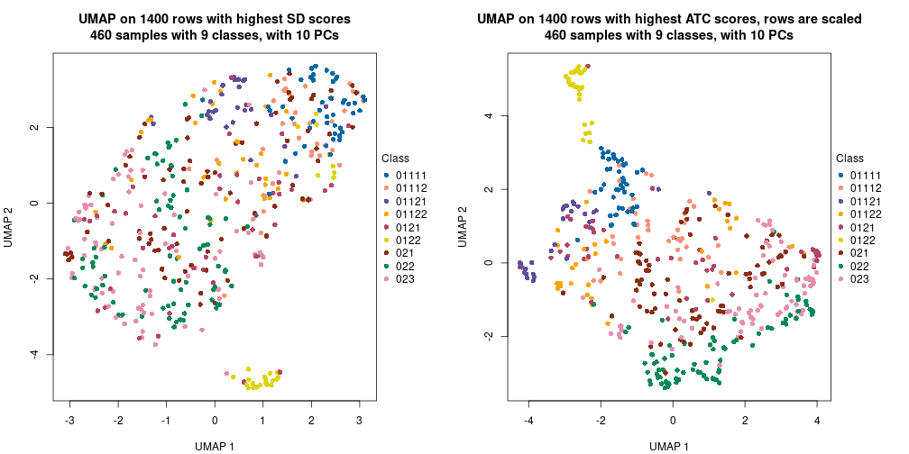</p>

</div>
<div id='tab-dimension-reduction-by-depth-4'>
<pre><code class="r">par(mfrow = c(1, 2))
dimension_reduction(res_rh, merge_node = merge_node_param(min_n_signatures = 200),
    method = &quot;UMAP&quot;, top_value_method = &quot;SD&quot;, top_n = 1400, scale_rows = FALSE)
dimension_reduction(res_rh, merge_node = merge_node_param(min_n_signatures = 200),
    method = &quot;UMAP&quot;, top_value_method = &quot;ATC&quot;, top_n = 1400, scale_rows = TRUE)
</code></pre>

<p></p>

</div>
<div id='tab-dimension-reduction-by-depth-5'>
<pre><code class="r">par(mfrow = c(1, 2))
dimension_reduction(res_rh, merge_node = merge_node_param(min_n_signatures = 450),
    method = &quot;UMAP&quot;, top_value_method = &quot;SD&quot;, top_n = 1400, scale_rows = FALSE)
dimension_reduction(res_rh, merge_node = merge_node_param(min_n_signatures = 450),
    method = &quot;UMAP&quot;, top_value_method = &quot;ATC&quot;, top_n = 1400, scale_rows = TRUE)
</code></pre>

<p></p>

</div>
<div id='tab-dimension-reduction-by-depth-6'>
<pre><code class="r">par(mfrow = c(1, 2))
dimension_reduction(res_rh, merge_node = merge_node_param(min_n_signatures = 1358),
    method = &quot;UMAP&quot;, top_value_method = &quot;SD&quot;, top_n = 1400, scale_rows = FALSE)
dimension_reduction(res_rh, merge_node = merge_node_param(min_n_signatures = 1358),
    method = &quot;UMAP&quot;, top_value_method = &quot;ATC&quot;, top_n = 1400, scale_rows = TRUE)
</code></pre>

<p></p>

</div>
<div id='tab-dimension-reduction-by-depth-7'>
<pre><code class="r">par(mfrow = c(1, 2))
dimension_reduction(res_rh, merge_node = merge_node_param(min_n_signatures = 1418),
    method = &quot;UMAP&quot;, top_value_method = &quot;SD&quot;, top_n = 1400, scale_rows = FALSE)
dimension_reduction(res_rh, merge_node = merge_node_param(min_n_signatures = 1418),
    method = &quot;UMAP&quot;, top_value_method = &quot;ATC&quot;, top_n = 1400, scale_rows = TRUE)
</code></pre>

<p></p>

</div>
<div id='tab-dimension-reduction-by-depth-8'>
<pre><code class="r">par(mfrow = c(1, 2))
dimension_reduction(res_rh, merge_node = merge_node_param(min_n_signatures = 1688),
    method = &quot;UMAP&quot;, top_value_method = &quot;SD&quot;, top_n = 1400, scale_rows = FALSE)
dimension_reduction(res_rh, merge_node = merge_node_param(min_n_signatures = 1688),
    method = &quot;UMAP&quot;, top_value_method = &quot;ATC&quot;, top_n = 1400, scale_rows = TRUE)
</code></pre>

<p></p>

</div>
<div id='tab-dimension-reduction-by-depth-9'>
<pre><code class="r">par(mfrow = c(1, 2))
dimension_reduction(res_rh, merge_node = merge_node_param(min_n_signatures = 1886),
    method = &quot;UMAP&quot;, top_value_method = &quot;SD&quot;, top_n = 1400, scale_rows = FALSE)
dimension_reduction(res_rh, merge_node = merge_node_param(min_n_signatures = 1886),
    method = &quot;UMAP&quot;, top_value_method = &quot;ATC&quot;, top_n = 1400, scale_rows = TRUE)
</code></pre>

<p></p>

</div>
</div>


### Signature heatmap

Signatures on the heatmap are the union of all signatures found on every node
on the hierarchy. The number of k-means on rows are automatically selected by the function.


<script>
$( function() {
	$( '#tabs-get-signatures-from-hierarchical-partition' ).tabs();
} );
</script>
<div id='tabs-get-signatures-from-hierarchical-partition'>
<ul>
<li><a href='#tab-get-signatures-from-hierarchical-partition-1'>n_signatures ≥ 94</a></li>
<li><a href='#tab-get-signatures-from-hierarchical-partition-2'>n_signatures ≥ 112</a></li>
<li><a href='#tab-get-signatures-from-hierarchical-partition-3'>n_signatures ≥ 198</a></li>
<li><a href='#tab-get-signatures-from-hierarchical-partition-4'>n_signatures ≥ 200</a></li>
<li><a href='#tab-get-signatures-from-hierarchical-partition-5'>n_signatures ≥ 450</a></li>
<li><a href='#tab-get-signatures-from-hierarchical-partition-6'>n_signatures ≥ 1358</a></li>
<li><a href='#tab-get-signatures-from-hierarchical-partition-7'>n_signatures ≥ 1418</a></li>
<li><a href='#tab-get-signatures-from-hierarchical-partition-8'>n_signatures ≥ 1688</a></li>
<li><a href='#tab-get-signatures-from-hierarchical-partition-9'>n_signatures ≥ 1886</a></li>
</ul>
<div id='tab-get-signatures-from-hierarchical-partition-1'>
<pre><code class="r">get_signatures(res_rh, merge_node = merge_node_param(min_n_signatures = 94))
</code></pre>

<p></p>

</div>
<div id='tab-get-signatures-from-hierarchical-partition-2'>
<pre><code class="r">get_signatures(res_rh, merge_node = merge_node_param(min_n_signatures = 112))
</code></pre>

<p></p>

</div>
<div id='tab-get-signatures-from-hierarchical-partition-3'>
<pre><code class="r">get_signatures(res_rh, merge_node = merge_node_param(min_n_signatures = 198))
</code></pre>

<p></p>

</div>
<div id='tab-get-signatures-from-hierarchical-partition-4'>
<pre><code class="r">get_signatures(res_rh, merge_node = merge_node_param(min_n_signatures = 200))
</code></pre>

<p></p>

</div>
<div id='tab-get-signatures-from-hierarchical-partition-5'>
<pre><code class="r">get_signatures(res_rh, merge_node = merge_node_param(min_n_signatures = 450))
</code></pre>

<p></p>

</div>
<div id='tab-get-signatures-from-hierarchical-partition-6'>
<pre><code class="r">get_signatures(res_rh, merge_node = merge_node_param(min_n_signatures = 1358))
</code></pre>

<p></p>

</div>
<div id='tab-get-signatures-from-hierarchical-partition-7'>
<pre><code class="r">get_signatures(res_rh, merge_node = merge_node_param(min_n_signatures = 1418))
</code></pre>

<p></p>

</div>
<div id='tab-get-signatures-from-hierarchical-partition-8'>
<pre><code class="r">get_signatures(res_rh, merge_node = merge_node_param(min_n_signatures = 1688))
</code></pre>

<pre><code>#&gt; Error in lt[[hierarchy[i, 1]]]$AddChildNode({: attempt to apply non-function
</code></pre>

</div>
<div id='tab-get-signatures-from-hierarchical-partition-9'>
<pre><code class="r">get_signatures(res_rh, merge_node = merge_node_param(min_n_signatures = 1886))
</code></pre>

<pre><code>#&gt; Error in names(x) &lt;- value: &#39;names&#39; attribute [1] must be the same length as the vector [0]
</code></pre>

</div>
</div>


Compare signatures from different nodes:


```r
compare_signatures(res_rh, verbose = FALSE)
```


If there are too many signatures, `top_signatures = ...` can be set to only show the 
signatures with the highest FDRs. Note it only works on every node and the final signatures
are the union of all signatures of all nodes.


```r
# code only for demonstration
# e.g. to show the top 500 most significant rows on each node.
tb = get_signature(res_rh, top_signatures = 500)
```


### Test to known annotations

Test correlation between subgroups and known annotations. If the known
annotation is numeric, one-way ANOVA test is applied, and if the known
annotation is discrete, chi-squared contingency table test is applied.


<script>
$( function() {
	$( '#tabs-test-to-known-factors-from-hierarchical-partition' ).tabs();
} );
</script>
<div id='tabs-test-to-known-factors-from-hierarchical-partition'>
<ul>
<li><a href='#tab-test-to-known-factors-from-hierarchical-partition-1'>n_signatures ≥ 94</a></li>
<li><a href='#tab-test-to-known-factors-from-hierarchical-partition-2'>n_signatures ≥ 112</a></li>
<li><a href='#tab-test-to-known-factors-from-hierarchical-partition-3'>n_signatures ≥ 198</a></li>
<li><a href='#tab-test-to-known-factors-from-hierarchical-partition-4'>n_signatures ≥ 200</a></li>
<li><a href='#tab-test-to-known-factors-from-hierarchical-partition-5'>n_signatures ≥ 450</a></li>
<li><a href='#tab-test-to-known-factors-from-hierarchical-partition-6'>n_signatures ≥ 1358</a></li>
<li><a href='#tab-test-to-known-factors-from-hierarchical-partition-7'>n_signatures ≥ 1418</a></li>
<li><a href='#tab-test-to-known-factors-from-hierarchical-partition-8'>n_signatures ≥ 1688</a></li>
<li><a href='#tab-test-to-known-factors-from-hierarchical-partition-9'>n_signatures ≥ 1886</a></li>
</ul>
<div id='tab-test-to-known-factors-from-hierarchical-partition-1'>
<pre><code class="r">test_to_known_factors(res_rh, merge_node = merge_node_param(min_n_signatures = 94))
</code></pre>

<pre><code>#&gt;       CellLine Experiment    Phase
#&gt; class 2.24e-17      1e-26 2.86e-23
</code></pre>

</div>
<div id='tab-test-to-known-factors-from-hierarchical-partition-2'>
<pre><code class="r">test_to_known_factors(res_rh, merge_node = merge_node_param(min_n_signatures = 112))
</code></pre>

<pre><code>#&gt;       CellLine Experiment    Phase
#&gt; class 9.46e-09    1.3e-18 7.23e-24
</code></pre>

</div>
<div id='tab-test-to-known-factors-from-hierarchical-partition-3'>
<pre><code class="r">test_to_known_factors(res_rh, merge_node = merge_node_param(min_n_signatures = 198))
</code></pre>

<pre><code>#&gt;       CellLine Experiment    Phase
#&gt; class    5e-08   1.44e-17 1.79e-24
</code></pre>

</div>
<div id='tab-test-to-known-factors-from-hierarchical-partition-4'>
<pre><code class="r">test_to_known_factors(res_rh, merge_node = merge_node_param(min_n_signatures = 200))
</code></pre>

<pre><code>#&gt;       CellLine Experiment    Phase
#&gt; class   0.0432   3.12e-10 3.96e-25
</code></pre>

</div>
<div id='tab-test-to-known-factors-from-hierarchical-partition-5'>
<pre><code class="r">test_to_known_factors(res_rh, merge_node = merge_node_param(min_n_signatures = 450))
</code></pre>

<pre><code>#&gt;       CellLine Experiment    Phase
#&gt; class   0.0279   5.25e-11 8.07e-26
</code></pre>

</div>
<div id='tab-test-to-known-factors-from-hierarchical-partition-6'>
<pre><code class="r">test_to_known_factors(res_rh, merge_node = merge_node_param(min_n_signatures = 1358))
</code></pre>

<pre><code>#&gt;       CellLine Experiment    Phase
#&gt; class    0.192   2.57e-10 1.42e-19
</code></pre>

</div>
<div id='tab-test-to-known-factors-from-hierarchical-partition-7'>
<pre><code class="r">test_to_known_factors(res_rh, merge_node = merge_node_param(min_n_signatures = 1418))
</code></pre>

<pre><code>#&gt;       CellLine Experiment    Phase
#&gt; class    0.104   1.59e-08 1.59e-19
</code></pre>

</div>
<div id='tab-test-to-known-factors-from-hierarchical-partition-8'>
<pre><code class="r">test_to_known_factors(res_rh, merge_node = merge_node_param(min_n_signatures = 1688))
</code></pre>

<pre><code>#&gt;       CellLine Experiment    Phase
#&gt; class   0.0929      0.357 3.15e-05
</code></pre>

</div>
<div id='tab-test-to-known-factors-from-hierarchical-partition-9'>
<pre><code class="r">test_to_known_factors(res_rh, merge_node = merge_node_param(min_n_signatures = 1886))
</code></pre>

<pre><code>#&gt;       CellLine Experiment Phase
#&gt; class       NA         NA    NA
</code></pre>

</div>
</div>


## Results for each node


---------------------------------------------------


### Node0


Child nodes: 
                [Node01](#Node01)
        ,
                [Node02](#Node02)
        .


The object with results only for a single top-value method and a single partitioning method 
can be extracted as:

```r
res = res_rh["0"]
```

A summary of `res` and all the functions that can be applied to it:

```r
res
```

```
#> A 'ConsensusPartition' object with k = 2, 3, 4.
#>   On a matrix with 13001 rows and 460 columns.
#>   Top rows (1300) are extracted by 'ATC' method.
#>   Subgroups are detected by 'skmeans' method.
#>   Performed in total 150 partitions by row resampling.
#>   Best k for subgroups seems to be 2.
#> 
#> Following methods can be applied to this 'ConsensusPartition' object:
#>  [1] "cola_report"             "collect_classes"         "collect_plots"          
#>  [4] "collect_stats"           "colnames"                "compare_partitions"     
#>  [7] "compare_signatures"      "consensus_heatmap"       "dimension_reduction"    
#> [10] "functional_enrichment"   "get_anno_col"            "get_anno"               
#> [13] "get_classes"             "get_consensus"           "get_matrix"             
#> [16] "get_membership"          "get_param"               "get_signatures"         
#> [19] "get_stats"               "is_best_k"               "is_stable_k"            
#> [22] "membership_heatmap"      "ncol"                    "nrow"                   
#> [25] "plot_ecdf"               "predict_classes"         "rownames"               
#> [28] "select_partition_number" "show"                    "suggest_best_k"         
#> [31] "test_to_known_factors"   "top_rows_heatmap"
```

`collect_plots()` function collects all the plots made from `res` for all `k` (number of subgroups)
into one single page to provide an easy and fast comparison between different `k`.

```r
collect_plots(res)
```


The plots are:

- The first row: a plot of the eCDF (empirical cumulative distribution
  function) curves of the consensus matrix for each `k` and the heatmap of
  predicted classes for each `k`.
- The second row: heatmaps of the consensus matrix for each `k`.
- The third row: heatmaps of the membership matrix for each `k`.
- The fouth row: heatmaps of the signatures for each `k`.

All the plots in panels can be made by individual functions and they are
plotted later in this section.

`select_partition_number()` produces several plots showing different
statistics for choosing "optimized" `k`. There are following statistics:

- eCDF curves of the consensus matrix for each `k`;
- 1-PAC. [The PAC score](https://en.wikipedia.org/wiki/Consensus_clustering#Over-interpretation_potential_of_consensus_clustering)
  measures the proportion of the ambiguous subgrouping.
- Mean silhouette score.
- Concordance. The mean probability of fiting the consensus subgroup labels in all
  partitions.
- Area increased. Denote $A_k$ as the area under the eCDF curve for current
  `k`, the area increased is defined as $A_k - A_{k-1}$.
- Rand index. The percent of pairs of samples that are both in a same cluster
  or both are not in a same cluster in the partition of k and k-1.
- Jaccard index. The ratio of pairs of samples are both in a same cluster in
  the partition of k and k-1 and the pairs of samples are both in a same
  cluster in the partition k or k-1.

The detailed explanations of these statistics can be found in [the _cola_
vignette](https://jokergoo.github.io/cola_vignettes/cola.html#toc_13).

Generally speaking, higher 1-PAC score, higher mean silhouette score or higher
concordance corresponds to better partition. Rand index and Jaccard index
measure how similar the current partition is compared to partition with `k-1`.
If they are too similar, we won't accept `k` is better than `k-1`.

```r
select_partition_number(res)
```


The numeric values for all these statistics can be obtained by `get_stats()`.

```r
get_stats(res)
```

```
#>   k 1-PAC mean_silhouette concordance area_increased  Rand Jaccard
#> 2 2 1.000           0.984       0.994          0.501 0.500   0.500
#> 3 3 0.849           0.919       0.941          0.205 0.883   0.769
#> 4 4 0.792           0.860       0.922          0.094 0.926   0.819
```

`suggest_best_k()` suggests the best $k$ based on these statistics. The rules are as follows:

- All $k$ with Jaccard index larger than 0.95 are removed because increasing
  $k$ does not provide enough extra information. If all $k$ are removed, it is
  marked as no subgroup is detected.
- For all $k$ with 1-PAC score larger than 0.9, the maximal $k$ is taken as
  the best $k$, and other $k$ are marked as optional $k$.
- If it does not fit the second rule. The $k$ with the maximal vote of the
  highest 1-PAC score, highest mean silhouette, and highest concordance is
  taken as the best $k$.

```r
suggest_best_k(res)
```

```
#> [1] 2
```


Following is the table of the partitions (You need to click the **show/hide
code output** link to see it). The membership matrix (columns with name `p*`)
is inferred by
[`clue::cl_consensus()`](https://www.rdocumentation.org/link/cl_consensus?package=clue)
function with the `SE` method. Basically the value in the membership matrix
represents the probability to belong to a certain group. The finall subgroup
label for an item is determined with the group with highest probability it
belongs to.

In `get_classes()` function, the entropy is calculated from the membership
matrix and the silhouette score is calculated from the consensus matrix.


<script>
$( function() {
	$( '#tabs-node-0-get-classes' ).tabs();
} );
</script>
<div id='tabs-node-0-get-classes'>
<ul>
<li><a href='#tab-node-0-get-classes-1'>k = 2</a></li>
<li><a href='#tab-node-0-get-classes-2'>k = 3</a></li>
<li><a href='#tab-node-0-get-classes-3'>k = 4</a></li>
</ul>

<div id='tab-node-0-get-classes-1'>
<p><a id='tab-node-0-get-classes-1-a' style='color:#0366d6' href='#'>show/hide code output</a></p>
<pre><code class="r">cbind(get_classes(res, k = 2), get_membership(res, k = 2))
</code></pre>

<pre><code>#&gt;             class entropy silhouette   p1   p2
#&gt; H1_Exp1.001     2   0.971     0.3410 0.40 0.60
#&gt; H1_Exp1.002     1   0.000     0.9966 1.00 0.00
#&gt; H1_Exp1.003     1   0.141     0.9768 0.98 0.02
#&gt; H1_Exp1.004     1   0.000     0.9966 1.00 0.00
#&gt; H1_Exp1.006     1   0.000     0.9966 1.00 0.00
#&gt; H1_Exp1.007     1   0.000     0.9966 1.00 0.00
#&gt; H1_Exp1.008     2   0.000     0.9906 0.00 1.00
#&gt; H1_Exp1.009     1   0.000     0.9966 1.00 0.00
#&gt; H1_Exp1.010     1   0.000     0.9966 1.00 0.00
#&gt; H1_Exp1.011     1   0.000     0.9966 1.00 0.00
#&gt; H1_Exp1.012     1   0.000     0.9966 1.00 0.00
#&gt; H1_Exp1.014     1   0.000     0.9966 1.00 0.00
#&gt; H1_Exp1.015     1   0.000     0.9966 1.00 0.00
#&gt; H1_Exp1.016     1   0.000     0.9966 1.00 0.00
#&gt; H1_Exp1.017     1   0.000     0.9966 1.00 0.00
#&gt; H1_Exp1.018     1   0.000     0.9966 1.00 0.00
#&gt; H1_Exp1.019     1   0.000     0.9966 1.00 0.00
#&gt; H1_Exp1.020     1   0.000     0.9966 1.00 0.00
#&gt; H1_Exp1.021     2   0.000     0.9906 0.00 1.00
#&gt; H1_Exp1.022     1   0.855     0.6089 0.72 0.28
#&gt; H1_Exp1.023     1   0.000     0.9966 1.00 0.00
#&gt; H1_Exp1.024     1   0.000     0.9966 1.00 0.00
#&gt; H1_Exp1.025     1   0.469     0.8874 0.90 0.10
#&gt; H1_Exp1.026     1   0.000     0.9966 1.00 0.00
#&gt; H1_Exp1.027     2   0.000     0.9906 0.00 1.00
#&gt; H1_Exp1.029     1   0.000     0.9966 1.00 0.00
#&gt; H1_Exp1.030     2   0.402     0.9090 0.08 0.92
#&gt; H1_Exp1.031     2   0.000     0.9906 0.00 1.00
#&gt; H1_Exp1.032     2   0.000     0.9906 0.00 1.00
#&gt; H1_Exp1.033     2   0.000     0.9906 0.00 1.00
#&gt; H1_Exp1.035     1   0.000     0.9966 1.00 0.00
#&gt; H1_Exp1.036     2   0.000     0.9906 0.00 1.00
#&gt; H1_Exp1.038     1   0.000     0.9966 1.00 0.00
#&gt; H1_Exp1.039     1   0.000     0.9966 1.00 0.00
#&gt; H1_Exp1.040     1   0.000     0.9966 1.00 0.00
#&gt; H1_Exp1.041     1   0.000     0.9966 1.00 0.00
#&gt; H1_Exp1.042     2   0.000     0.9906 0.00 1.00
#&gt; H1_Exp1.043     2   0.529     0.8618 0.12 0.88
#&gt; H1_Exp1.044     2   0.000     0.9906 0.00 1.00
#&gt; H1_Exp1.045     2   0.000     0.9906 0.00 1.00
#&gt; H1_Exp1.047     2   0.000     0.9906 0.00 1.00
#&gt; H1_Exp1.048     2   0.000     0.9906 0.00 1.00
#&gt; H1_Exp1.049     1   0.000     0.9966 1.00 0.00
#&gt; H1_Exp1.050     1   0.000     0.9966 1.00 0.00
#&gt; H1_Exp1.051     1   0.000     0.9966 1.00 0.00
#&gt; H1_Exp1.052     1   0.000     0.9966 1.00 0.00
#&gt; H1_Exp1.053     1   0.000     0.9966 1.00 0.00
#&gt; H1_Exp1.054     1   0.000     0.9966 1.00 0.00
#&gt; H1_Exp1.055     1   0.000     0.9966 1.00 0.00
#&gt; H1_Exp1.057     1   0.000     0.9966 1.00 0.00
#&gt; H1_Exp1.058     2   0.000     0.9906 0.00 1.00
#&gt; H1_Exp1.059     1   0.000     0.9966 1.00 0.00
#&gt; H1_Exp1.060     2   0.000     0.9906 0.00 1.00
#&gt; H1_Exp1.061     1   0.000     0.9966 1.00 0.00
#&gt; H1_Exp1.062     1   0.000     0.9966 1.00 0.00
#&gt; H1_Exp1.063     1   0.000     0.9966 1.00 0.00
#&gt; H1_Exp1.064     1   0.000     0.9966 1.00 0.00
#&gt; H1_Exp1.065     2   0.000     0.9906 0.00 1.00
#&gt; H1_Exp1.066     1   0.000     0.9966 1.00 0.00
#&gt; H1_Exp1.068     2   0.000     0.9906 0.00 1.00
#&gt; H1_Exp1.069     1   0.000     0.9966 1.00 0.00
#&gt; H1_Exp1.070     1   0.000     0.9966 1.00 0.00
#&gt; H1_Exp2.073     1   0.000     0.9966 1.00 0.00
#&gt; H1_Exp2.074     1   0.000     0.9966 1.00 0.00
#&gt; H1_Exp2.075     1   0.000     0.9966 1.00 0.00
#&gt; H1_Exp2.076     2   0.999     0.0853 0.48 0.52
#&gt; H1_Exp2.077     2   0.000     0.9906 0.00 1.00
#&gt; H1_Exp2.078     2   0.000     0.9906 0.00 1.00
#&gt; H1_Exp2.079     1   0.000     0.9966 1.00 0.00
#&gt; H1_Exp2.080     2   0.000     0.9906 0.00 1.00
#&gt; H1_Exp2.081     1   0.000     0.9966 1.00 0.00
#&gt; H1_Exp2.082     1   0.000     0.9966 1.00 0.00
#&gt; H1_Exp2.083     1   0.000     0.9966 1.00 0.00
#&gt; H1_Exp2.084     1   0.000     0.9966 1.00 0.00
#&gt; H1_Exp2.085     1   0.000     0.9966 1.00 0.00
#&gt; H1_Exp2.086     2   0.000     0.9906 0.00 1.00
#&gt; H1_Exp2.087     1   0.141     0.9768 0.98 0.02
#&gt; H1_Exp2.088     1   0.000     0.9966 1.00 0.00
#&gt; H1_Exp2.089     1   0.000     0.9966 1.00 0.00
#&gt; H1_Exp2.090     2   0.000     0.9906 0.00 1.00
#&gt; H1_Exp2.091     1   0.000     0.9966 1.00 0.00
#&gt; H1_Exp2.092     1   0.000     0.9966 1.00 0.00
#&gt; H1_Exp2.093     1   0.000     0.9966 1.00 0.00
#&gt; H1_Exp2.094     1   0.000     0.9966 1.00 0.00
#&gt; H1_Exp2.096     1   0.000     0.9966 1.00 0.00
#&gt; H1_Exp2.097     1   0.327     0.9343 0.94 0.06
#&gt; H1_Exp2.098     1   0.000     0.9966 1.00 0.00
#&gt; H1_Exp2.099     2   0.000     0.9906 0.00 1.00
#&gt; H1_Exp2.100     1   0.000     0.9966 1.00 0.00
#&gt; H1_Exp2.101     1   0.000     0.9966 1.00 0.00
#&gt; H1_Exp2.102     2   0.000     0.9906 0.00 1.00
#&gt; H1_Exp2.103     2   0.000     0.9906 0.00 1.00
#&gt; H1_Exp2.104     2   0.000     0.9906 0.00 1.00
#&gt; H1_Exp2.105     1   0.000     0.9966 1.00 0.00
#&gt; H1_Exp2.106     1   0.000     0.9966 1.00 0.00
#&gt; H1_Exp2.107     2   0.000     0.9906 0.00 1.00
#&gt; H1_Exp2.108     1   0.000     0.9966 1.00 0.00
#&gt; H1_Exp2.109     2   0.000     0.9906 0.00 1.00
#&gt; H1_Exp2.110     2   0.000     0.9906 0.00 1.00
#&gt; H1_Exp2.111     2   0.000     0.9906 0.00 1.00
#&gt; H1_Exp2.112     1   0.000     0.9966 1.00 0.00
#&gt; H1_Exp2.113     2   0.000     0.9906 0.00 1.00
#&gt; H1_Exp2.114     2   0.000     0.9906 0.00 1.00
#&gt; H1_Exp2.115     2   0.000     0.9906 0.00 1.00
#&gt; H1_Exp2.116     1   0.000     0.9966 1.00 0.00
#&gt; H1_Exp2.117     2   0.000     0.9906 0.00 1.00
#&gt; H1_Exp2.118     1   0.000     0.9966 1.00 0.00
#&gt; H1_Exp2.120     2   0.000     0.9906 0.00 1.00
#&gt; H1_Exp2.121     1   0.000     0.9966 1.00 0.00
#&gt; H1_Exp2.122     2   0.000     0.9906 0.00 1.00
#&gt; H1_Exp2.123     1   0.000     0.9966 1.00 0.00
#&gt; H1_Exp2.124     2   0.000     0.9906 0.00 1.00
#&gt; H1_Exp2.125     2   0.000     0.9906 0.00 1.00
#&gt; H1_Exp2.126     2   0.000     0.9906 0.00 1.00
#&gt; H1_Exp2.127     1   0.000     0.9966 1.00 0.00
#&gt; H1_Exp2.128     2   0.000     0.9906 0.00 1.00
#&gt; H1_Exp2.129     2   0.000     0.9906 0.00 1.00
#&gt; H1_Exp2.130     1   0.000     0.9966 1.00 0.00
#&gt; H1_Exp2.132     2   0.242     0.9519 0.04 0.96
#&gt; H1_Exp2.133     1   0.000     0.9966 1.00 0.00
#&gt; H1_Exp2.134     2   0.000     0.9906 0.00 1.00
#&gt; H1_Exp2.135     1   0.000     0.9966 1.00 0.00
#&gt; H1_Exp2.136     1   0.000     0.9966 1.00 0.00
#&gt; H1_Exp2.137     2   0.000     0.9906 0.00 1.00
#&gt; H1_Exp2.138     1   0.000     0.9966 1.00 0.00
#&gt; H1_Exp2.139     1   0.000     0.9966 1.00 0.00
#&gt; H1_Exp2.140     1   0.000     0.9966 1.00 0.00
#&gt; H1_Exp2.141     2   0.000     0.9906 0.00 1.00
#&gt; H1_Exp2.142     2   0.000     0.9906 0.00 1.00
#&gt; H1_Exp2.144     1   0.000     0.9966 1.00 0.00
#&gt; H1_Exp2.145     2   0.000     0.9906 0.00 1.00
#&gt; H1_Exp2.146     1   0.000     0.9966 1.00 0.00
#&gt; H1_Exp2.147     2   0.000     0.9906 0.00 1.00
#&gt; H1_Exp2.148     1   0.000     0.9966 1.00 0.00
#&gt; H1_Exp2.149     2   0.000     0.9906 0.00 1.00
#&gt; H1_Exp2.150     1   0.000     0.9966 1.00 0.00
#&gt; H1_Exp2.151     2   0.000     0.9906 0.00 1.00
#&gt; H1_Exp2.152     1   0.000     0.9966 1.00 0.00
#&gt; H1_Exp2.153     2   0.904     0.5342 0.32 0.68
#&gt; H1_Exp2.154     1   0.000     0.9966 1.00 0.00
#&gt; H1_Exp3.218     2   0.000     0.9906 0.00 1.00
#&gt; H1_Exp3.219     2   0.971     0.3415 0.40 0.60
#&gt; H1_Exp3.220     1   0.000     0.9966 1.00 0.00
#&gt; H1_Exp3.221     2   0.000     0.9906 0.00 1.00
#&gt; H1_Exp3.222     2   0.000     0.9906 0.00 1.00
#&gt; H1_Exp3.223     1   0.000     0.9966 1.00 0.00
#&gt; H1_Exp3.224     2   0.000     0.9906 0.00 1.00
#&gt; H1_Exp3.225     2   0.000     0.9906 0.00 1.00
#&gt; H1_Exp3.226     2   0.000     0.9906 0.00 1.00
#&gt; H1_Exp3.227     2   0.000     0.9906 0.00 1.00
#&gt; H1_Exp3.228     2   0.000     0.9906 0.00 1.00
#&gt; H1_Exp3.229     2   0.000     0.9906 0.00 1.00
#&gt; H1_Exp3.230     2   0.000     0.9906 0.00 1.00
#&gt; H1_Exp3.231     2   0.000     0.9906 0.00 1.00
#&gt; H1_Exp3.232     1   0.000     0.9966 1.00 0.00
#&gt; H1_Exp3.233     1   0.000     0.9966 1.00 0.00
#&gt; H1_Exp3.234     2   0.000     0.9906 0.00 1.00
#&gt; H1_Exp3.235     2   0.000     0.9906 0.00 1.00
#&gt; H1_Exp3.236     2   0.000     0.9906 0.00 1.00
#&gt; H1_Exp3.237     2   0.000     0.9906 0.00 1.00
#&gt; H1_Exp3.238     2   0.000     0.9906 0.00 1.00
#&gt; H1_Exp3.239     2   0.000     0.9906 0.00 1.00
#&gt; H1_Exp3.240     2   0.000     0.9906 0.00 1.00
#&gt; H1_Exp3.241     1   0.000     0.9966 1.00 0.00
#&gt; H1_Exp3.242     2   0.000     0.9906 0.00 1.00
#&gt; H1_Exp3.243     2   0.000     0.9906 0.00 1.00
#&gt; H1_Exp3.244     2   0.000     0.9906 0.00 1.00
#&gt; H1_Exp3.246     2   0.000     0.9906 0.00 1.00
#&gt; H1_Exp3.247     2   0.000     0.9906 0.00 1.00
#&gt; H1_Exp3.248     1   0.000     0.9966 1.00 0.00
#&gt; H1_Exp3.249     2   0.000     0.9906 0.00 1.00
#&gt; H1_Exp3.250     2   0.000     0.9906 0.00 1.00
#&gt; H1_Exp3.251     2   0.000     0.9906 0.00 1.00
#&gt; H1_Exp3.252     2   0.000     0.9906 0.00 1.00
#&gt; H1_Exp3.253     2   0.000     0.9906 0.00 1.00
#&gt; H1_Exp3.254     2   0.000     0.9906 0.00 1.00
#&gt; H1_Exp3.255     2   0.000     0.9906 0.00 1.00
#&gt; H1_Exp3.256     2   0.469     0.8864 0.10 0.90
#&gt; H1_Exp3.257     2   0.000     0.9906 0.00 1.00
#&gt; H1_Exp3.258     2   0.000     0.9906 0.00 1.00
#&gt; H1_Exp3.259     2   0.000     0.9906 0.00 1.00
#&gt; H1_Exp3.260     2   0.000     0.9906 0.00 1.00
#&gt; H1_Exp3.261     2   0.000     0.9906 0.00 1.00
#&gt; H1_Exp3.262     2   0.000     0.9906 0.00 1.00
#&gt; H1_Exp3.263     2   0.000     0.9906 0.00 1.00
#&gt; H1_Exp3.264     2   0.000     0.9906 0.00 1.00
#&gt; H1_Exp3.265     2   0.000     0.9906 0.00 1.00
#&gt; H1_Exp3.266     2   0.000     0.9906 0.00 1.00
#&gt; H1_Exp3.267     2   0.000     0.9906 0.00 1.00
#&gt; H1_Exp3.268     2   0.000     0.9906 0.00 1.00
#&gt; H1_Exp3.269     2   0.000     0.9906 0.00 1.00
#&gt; H1_Exp3.270     2   0.000     0.9906 0.00 1.00
#&gt; H1_Exp3.271     2   0.000     0.9906 0.00 1.00
#&gt; H1_Exp3.272     2   0.000     0.9906 0.00 1.00
#&gt; H1_Exp3.273     2   0.000     0.9906 0.00 1.00
#&gt; H1_Exp3.274     2   0.000     0.9906 0.00 1.00
#&gt; H1_Exp3.275     2   0.000     0.9906 0.00 1.00
#&gt; H1_Exp3.276     2   0.000     0.9906 0.00 1.00
#&gt; H1_Exp3.277     1   0.000     0.9966 1.00 0.00
#&gt; H1_Exp3.278     2   0.000     0.9906 0.00 1.00
#&gt; H1_Exp3.279     2   0.000     0.9906 0.00 1.00
#&gt; H1_Exp3.280     2   0.000     0.9906 0.00 1.00
#&gt; H1_Exp3.281     2   0.000     0.9906 0.00 1.00
#&gt; H1_Exp3.282     2   0.000     0.9906 0.00 1.00
#&gt; H1_Exp3.283     1   0.000     0.9966 1.00 0.00
#&gt; H1_Exp3.284     1   0.000     0.9966 1.00 0.00
#&gt; H1_Exp3.285     2   0.000     0.9906 0.00 1.00
#&gt; H1_Exp3.286     2   0.000     0.9906 0.00 1.00
#&gt; H1_Exp3.287     2   0.000     0.9906 0.00 1.00
#&gt; H1_Exp3.288     2   0.000     0.9906 0.00 1.00
#&gt; H1_Exp3.289     2   0.000     0.9906 0.00 1.00
#&gt; H1_Exp3.290     2   0.000     0.9906 0.00 1.00
#&gt; H1_Exp3.291     2   0.000     0.9906 0.00 1.00
#&gt; G2_Exp1.059     2   0.000     0.9906 0.00 1.00
#&gt; G2_Exp1.069     1   0.000     0.9966 1.00 0.00
#&gt; G2_Exp1.075     2   0.000     0.9906 0.00 1.00
#&gt; G2_Exp1.063     2   0.000     0.9906 0.00 1.00
#&gt; G2_Exp1.029     2   0.000     0.9906 0.00 1.00
#&gt; G2_Exp1.076     1   0.000     0.9966 1.00 0.00
#&gt; G2_Exp1.013     1   0.000     0.9966 1.00 0.00
#&gt; G2_Exp1.037     2   0.000     0.9906 0.00 1.00
#&gt; G2_Exp1.057     2   0.000     0.9906 0.00 1.00
#&gt; G2_Exp1.018     2   0.000     0.9906 0.00 1.00
#&gt; G2_Exp1.015     1   0.000     0.9966 1.00 0.00
#&gt; G2_Exp1.019     1   0.000     0.9966 1.00 0.00
#&gt; G2_Exp1.050     1   0.000     0.9966 1.00 0.00
#&gt; G2_Exp1.004     2   0.000     0.9906 0.00 1.00
#&gt; G2_Exp1.061     2   0.000     0.9906 0.00 1.00
#&gt; G2_Exp1.042     1   0.000     0.9966 1.00 0.00
#&gt; G2_Exp1.060     2   0.000     0.9906 0.00 1.00
#&gt; G2_Exp1.058     2   0.000     0.9906 0.00 1.00
#&gt; G2_Exp1.065     2   0.000     0.9906 0.00 1.00
#&gt; G2_Exp1.002     2   0.000     0.9906 0.00 1.00
#&gt; G2_Exp1.044     2   0.000     0.9906 0.00 1.00
#&gt; G2_Exp1.051     2   0.000     0.9906 0.00 1.00
#&gt; G2_Exp1.073     2   0.000     0.9906 0.00 1.00
#&gt; G2_Exp1.030     1   0.000     0.9966 1.00 0.00
#&gt; G2_Exp1.028     2   0.000     0.9906 0.00 1.00
#&gt; G2_Exp1.022     1   0.000     0.9966 1.00 0.00
#&gt; G2_Exp1.034     2   0.000     0.9906 0.00 1.00
#&gt; G2_Exp1.017     1   0.000     0.9966 1.00 0.00
#&gt; G2_Exp1.047     1   0.000     0.9966 1.00 0.00
#&gt; G2_Exp1.072     1   0.000     0.9966 1.00 0.00
#&gt; G2_Exp1.074     1   0.000     0.9966 1.00 0.00
#&gt; G2_Exp1.054     2   0.000     0.9906 0.00 1.00
#&gt; G2_Exp1.024     2   0.000     0.9906 0.00 1.00
#&gt; G2_Exp1.032     1   0.000     0.9966 1.00 0.00
#&gt; G2_Exp1.020     2   0.000     0.9906 0.00 1.00
#&gt; G2_Exp1.064     1   0.000     0.9966 1.00 0.00
#&gt; G2_Exp1.045     1   0.000     0.9966 1.00 0.00
#&gt; G2_Exp1.038     1   0.000     0.9966 1.00 0.00
#&gt; G2_Exp1.001     1   0.000     0.9966 1.00 0.00
#&gt; G2_Exp1.049     1   0.000     0.9966 1.00 0.00
#&gt; G2_Exp1.031     1   0.000     0.9966 1.00 0.00
#&gt; G2_Exp1.039     2   0.000     0.9906 0.00 1.00
#&gt; G2_Exp1.070     1   0.000     0.9966 1.00 0.00
#&gt; G2_Exp1.007     2   0.000     0.9906 0.00 1.00
#&gt; G2_Exp1.021     1   0.000     0.9966 1.00 0.00
#&gt; G2_Exp1.036     1   0.000     0.9966 1.00 0.00
#&gt; G2_Exp1.046     1   0.000     0.9966 1.00 0.00
#&gt; G2_Exp1.040     1   0.000     0.9966 1.00 0.00
#&gt; G2_Exp1.068     1   0.000     0.9966 1.00 0.00
#&gt; G2_Exp1.077     1   0.000     0.9966 1.00 0.00
#&gt; G2_Exp1.026     2   0.000     0.9906 0.00 1.00
#&gt; G2_Exp1.011     2   0.000     0.9906 0.00 1.00
#&gt; G2_Exp1.053     2   0.000     0.9906 0.00 1.00
#&gt; G2_Exp1.008     1   0.000     0.9966 1.00 0.00
#&gt; G2_Exp1.006     2   0.000     0.9906 0.00 1.00
#&gt; G2_Exp1.016     2   0.000     0.9906 0.00 1.00
#&gt; G2_Exp1.010     2   0.000     0.9906 0.00 1.00
#&gt; G2_Exp1.014     1   0.000     0.9966 1.00 0.00
#&gt; G2_Exp1.005     1   0.000     0.9966 1.00 0.00
#&gt; G2_Exp1.048     1   0.000     0.9966 1.00 0.00
#&gt; G2_Exp1.027     2   0.000     0.9906 0.00 1.00
#&gt; G2_Exp1.067     2   0.000     0.9906 0.00 1.00
#&gt; G2_Exp1.009     2   0.000     0.9906 0.00 1.00
#&gt; G2_Exp1.062     1   0.000     0.9966 1.00 0.00
#&gt; G2_Exp1.025     2   0.000     0.9906 0.00 1.00
#&gt; G2_Exp1.056     1   0.000     0.9966 1.00 0.00
#&gt; G2_Exp1.055     2   0.000     0.9906 0.00 1.00
#&gt; G2_Exp1.041     1   0.000     0.9966 1.00 0.00
#&gt; G2_Exp1.012     1   0.000     0.9966 1.00 0.00
#&gt; G2_Exp1.066     1   0.000     0.9966 1.00 0.00
#&gt; G2_Exp1.023     1   0.000     0.9966 1.00 0.00
#&gt; G2_Exp1.033     2   0.000     0.9906 0.00 1.00
#&gt; G2_Exp1.043     2   0.000     0.9906 0.00 1.00
#&gt; G2_Exp1.052     2   0.000     0.9906 0.00 1.00
#&gt; G2_Exp1.071     2   0.000     0.9906 0.00 1.00
#&gt; G2_Exp1.003     1   0.000     0.9966 1.00 0.00
#&gt; S_Exp1.071      1   0.000     0.9966 1.00 0.00
#&gt; S_Exp1.074      2   0.000     0.9906 0.00 1.00
#&gt; S_Exp1.031      1   0.000     0.9966 1.00 0.00
#&gt; S_Exp1.032      1   0.000     0.9966 1.00 0.00
#&gt; S_Exp1.035      1   0.000     0.9966 1.00 0.00
#&gt; S_Exp1.030      2   0.000     0.9906 0.00 1.00
#&gt; S_Exp1.056      1   0.000     0.9966 1.00 0.00
#&gt; S_Exp1.011      1   0.000     0.9966 1.00 0.00
#&gt; S_Exp1.016      1   0.000     0.9966 1.00 0.00
#&gt; S_Exp1.013      2   0.000     0.9906 0.00 1.00
#&gt; S_Exp1.063      1   0.000     0.9966 1.00 0.00
#&gt; S_Exp1.038      1   0.000     0.9966 1.00 0.00
#&gt; S_Exp1.065      2   0.584     0.8366 0.14 0.86
#&gt; S_Exp1.048      1   0.000     0.9966 1.00 0.00
#&gt; S_Exp1.051      1   0.000     0.9966 1.00 0.00
#&gt; S_Exp1.078      1   0.000     0.9966 1.00 0.00
#&gt; S_Exp1.023      1   0.000     0.9966 1.00 0.00
#&gt; S_Exp1.022      1   0.000     0.9966 1.00 0.00
#&gt; S_Exp1.001      1   0.000     0.9966 1.00 0.00
#&gt; S_Exp1.046      1   0.000     0.9966 1.00 0.00
#&gt; S_Exp1.061      1   0.000     0.9966 1.00 0.00
#&gt; S_Exp1.080      1   0.000     0.9966 1.00 0.00
#&gt; S_Exp1.008      1   0.000     0.9966 1.00 0.00
#&gt; S_Exp1.069      1   0.000     0.9966 1.00 0.00
#&gt; S_Exp1.076      2   0.000     0.9906 0.00 1.00
#&gt; S_Exp1.019      1   0.000     0.9966 1.00 0.00
#&gt; S_Exp1.003      1   0.000     0.9966 1.00 0.00
#&gt; S_Exp1.006      1   0.000     0.9966 1.00 0.00
#&gt; S_Exp1.029      1   0.000     0.9966 1.00 0.00
#&gt; S_Exp1.025      1   0.000     0.9966 1.00 0.00
#&gt; S_Exp1.064      1   0.000     0.9966 1.00 0.00
#&gt; S_Exp1.041      1   0.000     0.9966 1.00 0.00
#&gt; S_Exp1.057      1   0.000     0.9966 1.00 0.00
#&gt; S_Exp1.068      2   0.000     0.9906 0.00 1.00
#&gt; S_Exp1.073      1   0.000     0.9966 1.00 0.00
#&gt; S_Exp1.014      1   0.000     0.9966 1.00 0.00
#&gt; S_Exp1.039      1   0.000     0.9966 1.00 0.00
#&gt; S_Exp1.055      1   0.000     0.9966 1.00 0.00
#&gt; S_Exp1.033      1   0.000     0.9966 1.00 0.00
#&gt; S_Exp1.081      1   0.000     0.9966 1.00 0.00
#&gt; S_Exp1.004      1   0.000     0.9966 1.00 0.00
#&gt; S_Exp1.045      1   0.000     0.9966 1.00 0.00
#&gt; S_Exp1.009      2   0.000     0.9906 0.00 1.00
#&gt; S_Exp1.054      1   0.000     0.9966 1.00 0.00
#&gt; S_Exp1.018      1   0.000     0.9966 1.00 0.00
#&gt; S_Exp1.034      1   0.000     0.9966 1.00 0.00
#&gt; S_Exp1.042      2   0.000     0.9906 0.00 1.00
#&gt; S_Exp1.067      1   0.000     0.9966 1.00 0.00
#&gt; S_Exp1.012      1   0.000     0.9966 1.00 0.00
#&gt; S_Exp1.002      2   0.000     0.9906 0.00 1.00
#&gt; S_Exp1.037      1   0.000     0.9966 1.00 0.00
#&gt; S_Exp1.070      1   0.000     0.9966 1.00 0.00
#&gt; S_Exp1.053      1   0.000     0.9966 1.00 0.00
#&gt; S_Exp1.036      1   0.000     0.9966 1.00 0.00
#&gt; S_Exp1.021      1   0.000     0.9966 1.00 0.00
#&gt; S_Exp1.020      1   0.000     0.9966 1.00 0.00
#&gt; S_Exp1.060      1   0.000     0.9966 1.00 0.00
#&gt; S_Exp1.015      1   0.000     0.9966 1.00 0.00
#&gt; S_Exp1.059      2   0.000     0.9906 0.00 1.00
#&gt; S_Exp1.066      1   0.000     0.9966 1.00 0.00
#&gt; S_Exp1.062      1   0.000     0.9966 1.00 0.00
#&gt; S_Exp1.040      1   0.000     0.9966 1.00 0.00
#&gt; S_Exp1.028      1   0.000     0.9966 1.00 0.00
#&gt; S_Exp1.079      1   0.000     0.9966 1.00 0.00
#&gt; S_Exp1.047      1   0.000     0.9966 1.00 0.00
#&gt; S_Exp1.044      2   0.000     0.9906 0.00 1.00
#&gt; S_Exp1.026      1   0.000     0.9966 1.00 0.00
#&gt; S_Exp1.077      1   0.000     0.9966 1.00 0.00
#&gt; S_Exp1.052      1   0.000     0.9966 1.00 0.00
#&gt; S_Exp1.007      1   0.000     0.9966 1.00 0.00
#&gt; S_Exp1.027      1   0.000     0.9966 1.00 0.00
#&gt; S_Exp1.017      1   0.000     0.9966 1.00 0.00
#&gt; S_Exp1.075      1   0.000     0.9966 1.00 0.00
#&gt; S_Exp1.049      1   0.000     0.9966 1.00 0.00
#&gt; S_Exp1.072      1   0.000     0.9966 1.00 0.00
#&gt; S_Exp1.005      1   0.000     0.9966 1.00 0.00
#&gt; S_Exp1.058      1   0.000     0.9966 1.00 0.00
#&gt; S_Exp1.010      1   0.000     0.9966 1.00 0.00
#&gt; S_Exp1.043      1   0.000     0.9966 1.00 0.00
#&gt; S_Exp1.050      1   0.000     0.9966 1.00 0.00
#&gt; G1_Exp1.048     2   0.000     0.9906 0.00 1.00
#&gt; G1_Exp1.090     2   0.000     0.9906 0.00 1.00
#&gt; G1_Exp1.061     2   0.000     0.9906 0.00 1.00
#&gt; G1_Exp1.025     2   0.000     0.9906 0.00 1.00
#&gt; G1_Exp1.033     1   0.000     0.9966 1.00 0.00
#&gt; G1_Exp1.081     2   0.000     0.9906 0.00 1.00
#&gt; G1_Exp1.013     1   0.000     0.9966 1.00 0.00
#&gt; G1_Exp1.024     2   0.000     0.9906 0.00 1.00
#&gt; G1_Exp1.056     2   0.000     0.9906 0.00 1.00
#&gt; G1_Exp1.026     1   0.000     0.9966 1.00 0.00
#&gt; G1_Exp1.064     2   0.000     0.9906 0.00 1.00
#&gt; G1_Exp1.053     2   0.000     0.9906 0.00 1.00
#&gt; G1_Exp1.070     2   0.000     0.9906 0.00 1.00
#&gt; G1_Exp1.087     2   0.000     0.9906 0.00 1.00
#&gt; G1_Exp1.067     2   0.000     0.9906 0.00 1.00
#&gt; G1_Exp1.003     2   0.000     0.9906 0.00 1.00
#&gt; G1_Exp1.052     2   0.000     0.9906 0.00 1.00
#&gt; G1_Exp1.060     2   0.000     0.9906 0.00 1.00
#&gt; G1_Exp1.071     2   0.000     0.9906 0.00 1.00
#&gt; G1_Exp1.045     2   0.000     0.9906 0.00 1.00
#&gt; G1_Exp1.040     2   0.000     0.9906 0.00 1.00
#&gt; G1_Exp1.016     2   0.000     0.9906 0.00 1.00
#&gt; G1_Exp1.027     1   0.000     0.9966 1.00 0.00
#&gt; G1_Exp1.059     1   0.000     0.9966 1.00 0.00
#&gt; G1_Exp1.002     2   0.000     0.9906 0.00 1.00
#&gt; G1_Exp1.021     2   0.000     0.9906 0.00 1.00
#&gt; G1_Exp1.015     2   0.000     0.9906 0.00 1.00
#&gt; G1_Exp1.042     2   0.000     0.9906 0.00 1.00
#&gt; G1_Exp1.058     2   0.000     0.9906 0.00 1.00
#&gt; G1_Exp1.075     2   0.000     0.9906 0.00 1.00
#&gt; G1_Exp1.019     1   0.000     0.9966 1.00 0.00
#&gt; G1_Exp1.074     2   0.000     0.9906 0.00 1.00
#&gt; G1_Exp1.079     2   0.000     0.9906 0.00 1.00
#&gt; G1_Exp1.038     2   0.000     0.9906 0.00 1.00
#&gt; G1_Exp1.035     2   0.000     0.9906 0.00 1.00
#&gt; G1_Exp1.012     2   0.000     0.9906 0.00 1.00
#&gt; G1_Exp1.032     2   0.000     0.9906 0.00 1.00
#&gt; G1_Exp1.009     2   0.000     0.9906 0.00 1.00
#&gt; G1_Exp1.043     2   0.000     0.9906 0.00 1.00
#&gt; G1_Exp1.089     2   0.000     0.9906 0.00 1.00
#&gt; G1_Exp1.080     2   0.000     0.9906 0.00 1.00
#&gt; G1_Exp1.007     2   0.000     0.9906 0.00 1.00
#&gt; G1_Exp1.062     2   0.000     0.9906 0.00 1.00
#&gt; G1_Exp1.069     2   0.000     0.9906 0.00 1.00
#&gt; G1_Exp1.004     2   0.000     0.9906 0.00 1.00
#&gt; G1_Exp1.010     2   0.000     0.9906 0.00 1.00
#&gt; G1_Exp1.044     2   0.000     0.9906 0.00 1.00
#&gt; G1_Exp1.065     2   0.000     0.9906 0.00 1.00
#&gt; G1_Exp1.029     2   0.000     0.9906 0.00 1.00
#&gt; G1_Exp1.086     2   0.141     0.9716 0.02 0.98
#&gt; G1_Exp1.084     2   0.000     0.9906 0.00 1.00
#&gt; G1_Exp1.088     2   0.000     0.9906 0.00 1.00
#&gt; G1_Exp1.051     2   0.000     0.9906 0.00 1.00
#&gt; G1_Exp1.085     1   0.000     0.9966 1.00 0.00
#&gt; G1_Exp1.066     2   0.000     0.9906 0.00 1.00
#&gt; G1_Exp1.047     2   0.000     0.9906 0.00 1.00
#&gt; G1_Exp1.072     2   0.000     0.9906 0.00 1.00
#&gt; G1_Exp1.057     2   0.000     0.9906 0.00 1.00
#&gt; G1_Exp1.054     2   0.000     0.9906 0.00 1.00
#&gt; G1_Exp1.082     2   0.000     0.9906 0.00 1.00
#&gt; G1_Exp1.031     1   0.827     0.6472 0.74 0.26
#&gt; G1_Exp1.077     2   0.000     0.9906 0.00 1.00
#&gt; G1_Exp1.091     2   0.000     0.9906 0.00 1.00
#&gt; G1_Exp1.078     1   0.000     0.9966 1.00 0.00
#&gt; G1_Exp1.073     1   0.000     0.9966 1.00 0.00
#&gt; G1_Exp1.068     2   0.000     0.9906 0.00 1.00
#&gt; G1_Exp1.001     2   0.000     0.9906 0.00 1.00
#&gt; G1_Exp1.023     1   0.000     0.9966 1.00 0.00
#&gt; G1_Exp1.022     1   0.000     0.9966 1.00 0.00
#&gt; G1_Exp1.034     1   0.000     0.9966 1.00 0.00
#&gt; G1_Exp1.005     2   0.000     0.9906 0.00 1.00
#&gt; G1_Exp1.039     1   0.000     0.9966 1.00 0.00
#&gt; G1_Exp1.037     2   0.000     0.9906 0.00 1.00
#&gt; G1_Exp1.014     2   0.000     0.9906 0.00 1.00
#&gt; G1_Exp1.017     2   0.000     0.9906 0.00 1.00
#&gt; G1_Exp1.020     1   0.000     0.9966 1.00 0.00
#&gt; G1_Exp1.028     2   0.000     0.9906 0.00 1.00
#&gt; G1_Exp1.036     2   0.000     0.9906 0.00 1.00
#&gt; G1_Exp1.049     2   0.000     0.9906 0.00 1.00
#&gt; G1_Exp1.041     2   0.000     0.9906 0.00 1.00
#&gt; G1_Exp1.006     2   0.000     0.9906 0.00 1.00
#&gt; G1_Exp1.008     2   0.529     0.8617 0.12 0.88
#&gt; G1_Exp1.055     2   0.000     0.9906 0.00 1.00
#&gt; G1_Exp1.050     2   0.000     0.9906 0.00 1.00
#&gt; G1_Exp1.076     2   0.000     0.9906 0.00 1.00
#&gt; G1_Exp1.011     1   0.000     0.9966 1.00 0.00
#&gt; G1_Exp1.063     1   0.000     0.9966 1.00 0.00
#&gt; G1_Exp1.083     2   0.000     0.9906 0.00 1.00
#&gt; G1_Exp1.030     2   0.000     0.9906 0.00 1.00
#&gt; G1_Exp1.018     1   0.000     0.9966 1.00 0.00
#&gt; G1_Exp1.046     1   0.000     0.9966 1.00 0.00
</code></pre>

<script>
$('#tab-node-0-get-classes-1-a').parent().next().next().hide();
$('#tab-node-0-get-classes-1-a').click(function(){
  $('#tab-node-0-get-classes-1-a').parent().next().next().toggle();
  return(false);
});
</script>
</div>

<div id='tab-node-0-get-classes-2'>
<p><a id='tab-node-0-get-classes-2-a' style='color:#0366d6' href='#'>show/hide code output</a></p>
<pre><code class="r">cbind(get_classes(res, k = 3), get_membership(res, k = 3))
</code></pre>

<pre><code>#&gt;             class entropy silhouette   p1   p2   p3
#&gt; H1_Exp1.001     1  0.2066     0.7274 0.94 0.06 0.00
#&gt; H1_Exp1.002     1  0.0000     0.7989 1.00 0.00 0.00
#&gt; H1_Exp1.003     1  0.0000     0.7989 1.00 0.00 0.00
#&gt; H1_Exp1.004     1  0.4555     0.9377 0.80 0.00 0.20
#&gt; H1_Exp1.006     1  0.0000     0.7989 1.00 0.00 0.00
#&gt; H1_Exp1.007     1  0.4555     0.9377 0.80 0.00 0.20
#&gt; H1_Exp1.008     2  0.0000     0.9780 0.00 1.00 0.00
#&gt; H1_Exp1.009     1  0.4555     0.9377 0.80 0.00 0.20
#&gt; H1_Exp1.010     1  0.4555     0.9377 0.80 0.00 0.20
#&gt; H1_Exp1.011     1  0.4555     0.9377 0.80 0.00 0.20
#&gt; H1_Exp1.012     1  0.4002     0.9265 0.84 0.00 0.16
#&gt; H1_Exp1.014     1  0.4002     0.9265 0.84 0.00 0.16
#&gt; H1_Exp1.015     1  0.3340     0.9005 0.88 0.00 0.12
#&gt; H1_Exp1.016     1  0.4555     0.9377 0.80 0.00 0.20
#&gt; H1_Exp1.017     1  0.4555     0.9377 0.80 0.00 0.20
#&gt; H1_Exp1.018     1  0.0000     0.7989 1.00 0.00 0.00
#&gt; H1_Exp1.019     1  0.4555     0.9377 0.80 0.00 0.20
#&gt; H1_Exp1.020     1  0.4555     0.9377 0.80 0.00 0.20
#&gt; H1_Exp1.021     2  0.0000     0.9780 0.00 1.00 0.00
#&gt; H1_Exp1.022     1  0.2066     0.7269 0.94 0.06 0.00
#&gt; H1_Exp1.023     1  0.4555     0.9377 0.80 0.00 0.20
#&gt; H1_Exp1.024     1  0.4555     0.9377 0.80 0.00 0.20
#&gt; H1_Exp1.025     3  0.7344     0.6923 0.24 0.08 0.68
#&gt; H1_Exp1.026     1  0.4002     0.9265 0.84 0.00 0.16
#&gt; H1_Exp1.027     2  0.0000     0.9780 0.00 1.00 0.00
#&gt; H1_Exp1.029     1  0.4555     0.9377 0.80 0.00 0.20
#&gt; H1_Exp1.030     2  0.7683     0.4942 0.08 0.64 0.28
#&gt; H1_Exp1.031     2  0.0000     0.9780 0.00 1.00 0.00
#&gt; H1_Exp1.032     2  0.0000     0.9780 0.00 1.00 0.00
#&gt; H1_Exp1.033     2  0.0000     0.9780 0.00 1.00 0.00
#&gt; H1_Exp1.035     1  0.4555     0.9377 0.80 0.00 0.20
#&gt; H1_Exp1.036     2  0.0000     0.9780 0.00 1.00 0.00
#&gt; H1_Exp1.038     1  0.4555     0.9377 0.80 0.00 0.20
#&gt; H1_Exp1.039     1  0.4555     0.9377 0.80 0.00 0.20
#&gt; H1_Exp1.040     1  0.4002     0.9265 0.84 0.00 0.16
#&gt; H1_Exp1.041     1  0.4555     0.9377 0.80 0.00 0.20
#&gt; H1_Exp1.042     2  0.0000     0.9780 0.00 1.00 0.00
#&gt; H1_Exp1.043     2  0.5216     0.6810 0.26 0.74 0.00
#&gt; H1_Exp1.044     2  0.0000     0.9780 0.00 1.00 0.00
#&gt; H1_Exp1.045     2  0.0000     0.9780 0.00 1.00 0.00
#&gt; H1_Exp1.047     2  0.0000     0.9780 0.00 1.00 0.00
#&gt; H1_Exp1.048     2  0.0000     0.9780 0.00 1.00 0.00
#&gt; H1_Exp1.049     1  0.4555     0.9377 0.80 0.00 0.20
#&gt; H1_Exp1.050     1  0.4555     0.9377 0.80 0.00 0.20
#&gt; H1_Exp1.051     1  0.4555     0.9377 0.80 0.00 0.20
#&gt; H1_Exp1.052     1  0.4555     0.9377 0.80 0.00 0.20
#&gt; H1_Exp1.053     3  0.0000     0.9236 0.00 0.00 1.00
#&gt; H1_Exp1.054     3  0.5016     0.5736 0.24 0.00 0.76
#&gt; H1_Exp1.055     1  0.4555     0.9377 0.80 0.00 0.20
#&gt; H1_Exp1.057     3  0.0000     0.9236 0.00 0.00 1.00
#&gt; H1_Exp1.058     2  0.0000     0.9780 0.00 1.00 0.00
#&gt; H1_Exp1.059     3  0.0000     0.9236 0.00 0.00 1.00
#&gt; H1_Exp1.060     2  0.0000     0.9780 0.00 1.00 0.00
#&gt; H1_Exp1.061     1  0.4555     0.9377 0.80 0.00 0.20
#&gt; H1_Exp1.062     1  0.3686     0.9122 0.86 0.00 0.14
#&gt; H1_Exp1.063     1  0.4555     0.9377 0.80 0.00 0.20
#&gt; H1_Exp1.064     1  0.4555     0.9377 0.80 0.00 0.20
#&gt; H1_Exp1.065     2  0.2066     0.9269 0.06 0.94 0.00
#&gt; H1_Exp1.066     1  0.3340     0.9004 0.88 0.00 0.12
#&gt; H1_Exp1.068     2  0.0000     0.9780 0.00 1.00 0.00
#&gt; H1_Exp1.069     3  0.0000     0.9236 0.00 0.00 1.00
#&gt; H1_Exp1.070     1  0.4555     0.9377 0.80 0.00 0.20
#&gt; H1_Exp2.073     1  0.4555     0.9377 0.80 0.00 0.20
#&gt; H1_Exp2.074     1  0.0892     0.8178 0.98 0.00 0.02
#&gt; H1_Exp2.075     1  0.0000     0.7989 1.00 0.00 0.00
#&gt; H1_Exp2.076     1  0.2959     0.6647 0.90 0.10 0.00
#&gt; H1_Exp2.077     2  0.0000     0.9780 0.00 1.00 0.00
#&gt; H1_Exp2.078     2  0.0000     0.9780 0.00 1.00 0.00
#&gt; H1_Exp2.079     1  0.1529     0.8360 0.96 0.00 0.04
#&gt; H1_Exp2.080     2  0.4555     0.7823 0.20 0.80 0.00
#&gt; H1_Exp2.081     1  0.0000     0.7989 1.00 0.00 0.00
#&gt; H1_Exp2.082     3  0.0892     0.9071 0.02 0.00 0.98
#&gt; H1_Exp2.083     1  0.0892     0.8178 0.98 0.00 0.02
#&gt; H1_Exp2.084     1  0.4555     0.9377 0.80 0.00 0.20
#&gt; H1_Exp2.085     1  0.0000     0.7989 1.00 0.00 0.00
#&gt; H1_Exp2.086     2  0.0000     0.9780 0.00 1.00 0.00
#&gt; H1_Exp2.087     1  0.0000     0.7989 1.00 0.00 0.00
#&gt; H1_Exp2.088     1  0.4555     0.9377 0.80 0.00 0.20
#&gt; H1_Exp2.089     1  0.0000     0.7989 1.00 0.00 0.00
#&gt; H1_Exp2.090     2  0.6244     0.3674 0.44 0.56 0.00
#&gt; H1_Exp2.091     1  0.5706     0.7867 0.68 0.00 0.32
#&gt; H1_Exp2.092     1  0.0000     0.7989 1.00 0.00 0.00
#&gt; H1_Exp2.093     3  0.3340     0.8173 0.12 0.00 0.88
#&gt; H1_Exp2.094     1  0.4555     0.9377 0.80 0.00 0.20
#&gt; H1_Exp2.096     1  0.4555     0.9377 0.80 0.00 0.20
#&gt; H1_Exp2.097     3  0.4002     0.7802 0.16 0.00 0.84
#&gt; H1_Exp2.098     1  0.4002     0.9265 0.84 0.00 0.16
#&gt; H1_Exp2.099     2  0.0000     0.9780 0.00 1.00 0.00
#&gt; H1_Exp2.100     1  0.0000     0.7989 1.00 0.00 0.00
#&gt; H1_Exp2.101     1  0.0892     0.8175 0.98 0.00 0.02
#&gt; H1_Exp2.102     2  0.4002     0.8278 0.16 0.84 0.00
#&gt; H1_Exp2.103     2  0.0000     0.9780 0.00 1.00 0.00
#&gt; H1_Exp2.104     2  0.0000     0.9780 0.00 1.00 0.00
#&gt; H1_Exp2.105     1  0.4002     0.9265 0.84 0.00 0.16
#&gt; H1_Exp2.106     1  0.4555     0.9377 0.80 0.00 0.20
#&gt; H1_Exp2.107     2  0.0000     0.9780 0.00 1.00 0.00
#&gt; H1_Exp2.108     1  0.4555     0.9377 0.80 0.00 0.20
#&gt; H1_Exp2.109     2  0.0000     0.9780 0.00 1.00 0.00
#&gt; H1_Exp2.110     2  0.0000     0.9780 0.00 1.00 0.00
#&gt; H1_Exp2.111     2  0.0000     0.9780 0.00 1.00 0.00
#&gt; H1_Exp2.112     3  0.0000     0.9236 0.00 0.00 1.00
#&gt; H1_Exp2.113     2  0.0000     0.9780 0.00 1.00 0.00
#&gt; H1_Exp2.114     2  0.0000     0.9780 0.00 1.00 0.00
#&gt; H1_Exp2.115     2  0.0000     0.9780 0.00 1.00 0.00
#&gt; H1_Exp2.116     3  0.0000     0.9236 0.00 0.00 1.00
#&gt; H1_Exp2.117     2  0.0000     0.9780 0.00 1.00 0.00
#&gt; H1_Exp2.118     1  0.4555     0.9377 0.80 0.00 0.20
#&gt; H1_Exp2.120     2  0.0000     0.9780 0.00 1.00 0.00
#&gt; H1_Exp2.121     1  0.4555     0.9377 0.80 0.00 0.20
#&gt; H1_Exp2.122     2  0.0000     0.9780 0.00 1.00 0.00
#&gt; H1_Exp2.123     3  0.0000     0.9236 0.00 0.00 1.00
#&gt; H1_Exp2.124     2  0.0000     0.9780 0.00 1.00 0.00
#&gt; H1_Exp2.125     2  0.0000     0.9780 0.00 1.00 0.00
#&gt; H1_Exp2.126     2  0.0000     0.9780 0.00 1.00 0.00
#&gt; H1_Exp2.127     1  0.4555     0.9377 0.80 0.00 0.20
#&gt; H1_Exp2.128     2  0.0000     0.9780 0.00 1.00 0.00
#&gt; H1_Exp2.129     2  0.0000     0.9780 0.00 1.00 0.00
#&gt; H1_Exp2.130     3  0.0000     0.9236 0.00 0.00 1.00
#&gt; H1_Exp2.132     2  0.4966     0.8315 0.10 0.84 0.06
#&gt; H1_Exp2.133     3  0.0000     0.9236 0.00 0.00 1.00
#&gt; H1_Exp2.134     2  0.0000     0.9780 0.00 1.00 0.00
#&gt; H1_Exp2.135     3  0.0000     0.9236 0.00 0.00 1.00
#&gt; H1_Exp2.136     1  0.4555     0.9377 0.80 0.00 0.20
#&gt; H1_Exp2.137     2  0.0000     0.9780 0.00 1.00 0.00
#&gt; H1_Exp2.138     1  0.4555     0.9377 0.80 0.00 0.20
#&gt; H1_Exp2.139     3  0.0000     0.9236 0.00 0.00 1.00
#&gt; H1_Exp2.140     3  0.6192    -0.0513 0.42 0.00 0.58
#&gt; H1_Exp2.141     2  0.0000     0.9780 0.00 1.00 0.00
#&gt; H1_Exp2.142     2  0.0000     0.9780 0.00 1.00 0.00
#&gt; H1_Exp2.144     1  0.4555     0.9377 0.80 0.00 0.20
#&gt; H1_Exp2.145     2  0.0000     0.9780 0.00 1.00 0.00
#&gt; H1_Exp2.146     3  0.0000     0.9236 0.00 0.00 1.00
#&gt; H1_Exp2.147     2  0.0000     0.9780 0.00 1.00 0.00
#&gt; H1_Exp2.148     1  0.4555     0.9377 0.80 0.00 0.20
#&gt; H1_Exp2.149     2  0.0000     0.9780 0.00 1.00 0.00
#&gt; H1_Exp2.150     3  0.0000     0.9236 0.00 0.00 1.00
#&gt; H1_Exp2.151     2  0.0000     0.9780 0.00 1.00 0.00
#&gt; H1_Exp2.152     1  0.4555     0.9377 0.80 0.00 0.20
#&gt; H1_Exp2.153     2  0.8635     0.1230 0.44 0.46 0.10
#&gt; H1_Exp2.154     1  0.4555     0.9377 0.80 0.00 0.20
#&gt; H1_Exp3.218     2  0.0000     0.9780 0.00 1.00 0.00
#&gt; H1_Exp3.219     3  0.6793     0.7154 0.16 0.10 0.74
#&gt; H1_Exp3.220     3  0.0000     0.9236 0.00 0.00 1.00
#&gt; H1_Exp3.221     2  0.0000     0.9780 0.00 1.00 0.00
#&gt; H1_Exp3.222     2  0.0000     0.9780 0.00 1.00 0.00
#&gt; H1_Exp3.223     1  0.4555     0.9377 0.80 0.00 0.20
#&gt; H1_Exp3.224     2  0.0000     0.9780 0.00 1.00 0.00
#&gt; H1_Exp3.225     2  0.0000     0.9780 0.00 1.00 0.00
#&gt; H1_Exp3.226     2  0.0000     0.9780 0.00 1.00 0.00
#&gt; H1_Exp3.227     2  0.0000     0.9780 0.00 1.00 0.00
#&gt; H1_Exp3.228     2  0.0000     0.9780 0.00 1.00 0.00
#&gt; H1_Exp3.229     2  0.0000     0.9780 0.00 1.00 0.00
#&gt; H1_Exp3.230     2  0.0000     0.9780 0.00 1.00 0.00
#&gt; H1_Exp3.231     2  0.0000     0.9780 0.00 1.00 0.00
#&gt; H1_Exp3.232     1  0.4555     0.9377 0.80 0.00 0.20
#&gt; H1_Exp3.233     3  0.0000     0.9236 0.00 0.00 1.00
#&gt; H1_Exp3.234     2  0.0000     0.9780 0.00 1.00 0.00
#&gt; H1_Exp3.235     2  0.0000     0.9780 0.00 1.00 0.00
#&gt; H1_Exp3.236     2  0.0000     0.9780 0.00 1.00 0.00
#&gt; H1_Exp3.237     2  0.0000     0.9780 0.00 1.00 0.00
#&gt; H1_Exp3.238     3  0.4796     0.6684 0.00 0.22 0.78
#&gt; H1_Exp3.239     2  0.0000     0.9780 0.00 1.00 0.00
#&gt; H1_Exp3.240     2  0.0000     0.9780 0.00 1.00 0.00
#&gt; H1_Exp3.241     1  0.4002     0.9265 0.84 0.00 0.16
#&gt; H1_Exp3.242     2  0.0000     0.9780 0.00 1.00 0.00
#&gt; H1_Exp3.243     2  0.0000     0.9780 0.00 1.00 0.00
#&gt; H1_Exp3.244     2  0.0000     0.9780 0.00 1.00 0.00
#&gt; H1_Exp3.246     2  0.0000     0.9780 0.00 1.00 0.00
#&gt; H1_Exp3.247     2  0.0000     0.9780 0.00 1.00 0.00
#&gt; H1_Exp3.248     3  0.0892     0.9070 0.02 0.00 0.98
#&gt; H1_Exp3.249     2  0.0000     0.9780 0.00 1.00 0.00
#&gt; H1_Exp3.250     2  0.0000     0.9780 0.00 1.00 0.00
#&gt; H1_Exp3.251     2  0.0000     0.9780 0.00 1.00 0.00
#&gt; H1_Exp3.252     2  0.0000     0.9780 0.00 1.00 0.00
#&gt; H1_Exp3.253     2  0.0000     0.9780 0.00 1.00 0.00
#&gt; H1_Exp3.254     2  0.0000     0.9780 0.00 1.00 0.00
#&gt; H1_Exp3.255     2  0.0000     0.9780 0.00 1.00 0.00
#&gt; H1_Exp3.256     3  0.4002     0.7390 0.00 0.16 0.84
#&gt; H1_Exp3.257     2  0.0000     0.9780 0.00 1.00 0.00
#&gt; H1_Exp3.258     2  0.0000     0.9780 0.00 1.00 0.00
#&gt; H1_Exp3.259     2  0.0000     0.9780 0.00 1.00 0.00
#&gt; H1_Exp3.260     2  0.0000     0.9780 0.00 1.00 0.00
#&gt; H1_Exp3.261     2  0.3686     0.8349 0.00 0.86 0.14
#&gt; H1_Exp3.262     2  0.0000     0.9780 0.00 1.00 0.00
#&gt; H1_Exp3.263     2  0.0000     0.9780 0.00 1.00 0.00
#&gt; H1_Exp3.264     2  0.0000     0.9780 0.00 1.00 0.00
#&gt; H1_Exp3.265     2  0.0000     0.9780 0.00 1.00 0.00
#&gt; H1_Exp3.266     2  0.1529     0.9422 0.00 0.96 0.04
#&gt; H1_Exp3.267     2  0.0000     0.9780 0.00 1.00 0.00
#&gt; H1_Exp3.268     2  0.0000     0.9780 0.00 1.00 0.00
#&gt; H1_Exp3.269     2  0.0000     0.9780 0.00 1.00 0.00
#&gt; H1_Exp3.270     2  0.0000     0.9780 0.00 1.00 0.00
#&gt; H1_Exp3.271     2  0.0000     0.9780 0.00 1.00 0.00
#&gt; H1_Exp3.272     2  0.0000     0.9780 0.00 1.00 0.00
#&gt; H1_Exp3.273     2  0.0000     0.9780 0.00 1.00 0.00
#&gt; H1_Exp3.274     2  0.0000     0.9780 0.00 1.00 0.00
#&gt; H1_Exp3.275     2  0.0000     0.9780 0.00 1.00 0.00
#&gt; H1_Exp3.276     2  0.0000     0.9780 0.00 1.00 0.00
#&gt; H1_Exp3.277     3  0.0000     0.9236 0.00 0.00 1.00
#&gt; H1_Exp3.278     2  0.0000     0.9780 0.00 1.00 0.00
#&gt; H1_Exp3.279     2  0.0000     0.9780 0.00 1.00 0.00
#&gt; H1_Exp3.280     2  0.0000     0.9780 0.00 1.00 0.00
#&gt; H1_Exp3.281     2  0.0000     0.9780 0.00 1.00 0.00
#&gt; H1_Exp3.282     2  0.0000     0.9780 0.00 1.00 0.00
#&gt; H1_Exp3.283     3  0.0000     0.9236 0.00 0.00 1.00
#&gt; H1_Exp3.284     3  0.0000     0.9236 0.00 0.00 1.00
#&gt; H1_Exp3.285     2  0.0000     0.9780 0.00 1.00 0.00
#&gt; H1_Exp3.286     2  0.0000     0.9780 0.00 1.00 0.00
#&gt; H1_Exp3.287     2  0.0000     0.9780 0.00 1.00 0.00
#&gt; H1_Exp3.288     2  0.0000     0.9780 0.00 1.00 0.00
#&gt; H1_Exp3.289     2  0.3340     0.8587 0.00 0.88 0.12
#&gt; H1_Exp3.290     2  0.0000     0.9780 0.00 1.00 0.00
#&gt; H1_Exp3.291     2  0.0000     0.9780 0.00 1.00 0.00
#&gt; G2_Exp1.059     2  0.0000     0.9780 0.00 1.00 0.00
#&gt; G2_Exp1.069     1  0.4555     0.9377 0.80 0.00 0.20
#&gt; G2_Exp1.075     2  0.0000     0.9780 0.00 1.00 0.00
#&gt; G2_Exp1.063     2  0.0000     0.9780 0.00 1.00 0.00
#&gt; G2_Exp1.029     2  0.0000     0.9780 0.00 1.00 0.00
#&gt; G2_Exp1.076     1  0.4555     0.9377 0.80 0.00 0.20
#&gt; G2_Exp1.013     1  0.4291     0.9327 0.82 0.00 0.18
#&gt; G2_Exp1.037     2  0.0000     0.9780 0.00 1.00 0.00
#&gt; G2_Exp1.057     2  0.0000     0.9780 0.00 1.00 0.00
#&gt; G2_Exp1.018     2  0.0000     0.9780 0.00 1.00 0.00
#&gt; G2_Exp1.015     1  0.4002     0.9265 0.84 0.00 0.16
#&gt; G2_Exp1.019     1  0.4555     0.9377 0.80 0.00 0.20
#&gt; G2_Exp1.050     3  0.0000     0.9236 0.00 0.00 1.00
#&gt; G2_Exp1.004     2  0.0000     0.9780 0.00 1.00 0.00
#&gt; G2_Exp1.061     2  0.0000     0.9780 0.00 1.00 0.00
#&gt; G2_Exp1.042     3  0.0000     0.9236 0.00 0.00 1.00
#&gt; G2_Exp1.060     2  0.0000     0.9780 0.00 1.00 0.00
#&gt; G2_Exp1.058     2  0.0000     0.9780 0.00 1.00 0.00
#&gt; G2_Exp1.065     2  0.0000     0.9780 0.00 1.00 0.00
#&gt; G2_Exp1.002     2  0.6045     0.4916 0.38 0.62 0.00
#&gt; G2_Exp1.044     2  0.0000     0.9780 0.00 1.00 0.00
#&gt; G2_Exp1.051     2  0.0000     0.9780 0.00 1.00 0.00
#&gt; G2_Exp1.073     2  0.0000     0.9780 0.00 1.00 0.00
#&gt; G2_Exp1.030     1  0.4555     0.9377 0.80 0.00 0.20
#&gt; G2_Exp1.028     2  0.0892     0.9617 0.02 0.98 0.00
#&gt; G2_Exp1.022     1  0.4555     0.9377 0.80 0.00 0.20
#&gt; G2_Exp1.034     2  0.0000     0.9780 0.00 1.00 0.00
#&gt; G2_Exp1.017     1  0.0000     0.7989 1.00 0.00 0.00
#&gt; G2_Exp1.047     1  0.4002     0.9265 0.84 0.00 0.16
#&gt; G2_Exp1.072     3  0.0000     0.9236 0.00 0.00 1.00
#&gt; G2_Exp1.074     3  0.0000     0.9236 0.00 0.00 1.00
#&gt; G2_Exp1.054     2  0.0000     0.9780 0.00 1.00 0.00
#&gt; G2_Exp1.024     2  0.0000     0.9780 0.00 1.00 0.00
#&gt; G2_Exp1.032     1  0.4555     0.9377 0.80 0.00 0.20
#&gt; G2_Exp1.020     2  0.0000     0.9780 0.00 1.00 0.00
#&gt; G2_Exp1.064     1  0.4555     0.9377 0.80 0.00 0.20
#&gt; G2_Exp1.045     1  0.4555     0.9377 0.80 0.00 0.20
#&gt; G2_Exp1.038     1  0.4555     0.9377 0.80 0.00 0.20
#&gt; G2_Exp1.001     1  0.4555     0.9377 0.80 0.00 0.20
#&gt; G2_Exp1.049     1  0.4555     0.9377 0.80 0.00 0.20
#&gt; G2_Exp1.031     1  0.4555     0.9377 0.80 0.00 0.20
#&gt; G2_Exp1.039     2  0.0000     0.9780 0.00 1.00 0.00
#&gt; G2_Exp1.070     3  0.0000     0.9236 0.00 0.00 1.00
#&gt; G2_Exp1.007     2  0.0000     0.9780 0.00 1.00 0.00
#&gt; G2_Exp1.021     1  0.4555     0.9377 0.80 0.00 0.20
#&gt; G2_Exp1.036     1  0.4555     0.9377 0.80 0.00 0.20
#&gt; G2_Exp1.046     1  0.4555     0.9377 0.80 0.00 0.20
#&gt; G2_Exp1.040     1  0.4555     0.9377 0.80 0.00 0.20
#&gt; G2_Exp1.068     1  0.4555     0.9377 0.80 0.00 0.20
#&gt; G2_Exp1.077     1  0.5216     0.8735 0.74 0.00 0.26
#&gt; G2_Exp1.026     2  0.0000     0.9780 0.00 1.00 0.00
#&gt; G2_Exp1.011     2  0.0000     0.9780 0.00 1.00 0.00
#&gt; G2_Exp1.053     2  0.0000     0.9780 0.00 1.00 0.00
#&gt; G2_Exp1.008     3  0.4555     0.6575 0.20 0.00 0.80
#&gt; G2_Exp1.006     2  0.0000     0.9780 0.00 1.00 0.00
#&gt; G2_Exp1.016     2  0.0000     0.9780 0.00 1.00 0.00
#&gt; G2_Exp1.010     2  0.4796     0.7570 0.22 0.78 0.00
#&gt; G2_Exp1.014     1  0.4002     0.9265 0.84 0.00 0.16
#&gt; G2_Exp1.005     1  0.4555     0.9377 0.80 0.00 0.20
#&gt; G2_Exp1.048     3  0.6045     0.1371 0.38 0.00 0.62
#&gt; G2_Exp1.027     2  0.0000     0.9780 0.00 1.00 0.00
#&gt; G2_Exp1.067     2  0.0000     0.9780 0.00 1.00 0.00
#&gt; G2_Exp1.009     2  0.0000     0.9780 0.00 1.00 0.00
#&gt; G2_Exp1.062     3  0.4555     0.6572 0.20 0.00 0.80
#&gt; G2_Exp1.025     2  0.0000     0.9780 0.00 1.00 0.00
#&gt; G2_Exp1.056     1  0.3686     0.9145 0.86 0.00 0.14
#&gt; G2_Exp1.055     2  0.0000     0.9780 0.00 1.00 0.00
#&gt; G2_Exp1.041     1  0.4002     0.9265 0.84 0.00 0.16
#&gt; G2_Exp1.012     1  0.4555     0.9377 0.80 0.00 0.20
#&gt; G2_Exp1.066     1  0.6244     0.5363 0.56 0.00 0.44
#&gt; G2_Exp1.023     1  0.4555     0.9377 0.80 0.00 0.20
#&gt; G2_Exp1.033     2  0.4555     0.7528 0.00 0.80 0.20
#&gt; G2_Exp1.043     2  0.0000     0.9780 0.00 1.00 0.00
#&gt; G2_Exp1.052     2  0.0000     0.9780 0.00 1.00 0.00
#&gt; G2_Exp1.071     2  0.0000     0.9780 0.00 1.00 0.00
#&gt; G2_Exp1.003     1  0.4002     0.9265 0.84 0.00 0.16
#&gt; S_Exp1.071      3  0.0000     0.9236 0.00 0.00 1.00
#&gt; S_Exp1.074      2  0.0000     0.9780 0.00 1.00 0.00
#&gt; S_Exp1.031      1  0.4002     0.9265 0.84 0.00 0.16
#&gt; S_Exp1.032      3  0.0000     0.9236 0.00 0.00 1.00
#&gt; S_Exp1.035      1  0.4555     0.9377 0.80 0.00 0.20
#&gt; S_Exp1.030      2  0.3686     0.8492 0.14 0.86 0.00
#&gt; S_Exp1.056      1  0.4555     0.9377 0.80 0.00 0.20
#&gt; S_Exp1.011      1  0.4002     0.9265 0.84 0.00 0.16
#&gt; S_Exp1.016      1  0.4555     0.9377 0.80 0.00 0.20
#&gt; S_Exp1.013      2  0.0000     0.9780 0.00 1.00 0.00
#&gt; S_Exp1.063      3  0.0000     0.9236 0.00 0.00 1.00
#&gt; S_Exp1.038      1  0.4555     0.9377 0.80 0.00 0.20
#&gt; S_Exp1.065      2  0.8202     0.5006 0.26 0.62 0.12
#&gt; S_Exp1.048      1  0.4555     0.9377 0.80 0.00 0.20
#&gt; S_Exp1.051      1  0.0000     0.7989 1.00 0.00 0.00
#&gt; S_Exp1.078      3  0.0000     0.9236 0.00 0.00 1.00
#&gt; S_Exp1.023      1  0.4555     0.9377 0.80 0.00 0.20
#&gt; S_Exp1.022      1  0.4555     0.9377 0.80 0.00 0.20
#&gt; S_Exp1.001      1  0.4555     0.9377 0.80 0.00 0.20
#&gt; S_Exp1.046      3  0.0000     0.9236 0.00 0.00 1.00
#&gt; S_Exp1.061      1  0.0000     0.7989 1.00 0.00 0.00
#&gt; S_Exp1.080      1  0.1529     0.8356 0.96 0.00 0.04
#&gt; S_Exp1.008      3  0.0000     0.9236 0.00 0.00 1.00
#&gt; S_Exp1.069      1  0.4555     0.9377 0.80 0.00 0.20
#&gt; S_Exp1.076      2  0.0000     0.9780 0.00 1.00 0.00
#&gt; S_Exp1.019      1  0.3686     0.9145 0.86 0.00 0.14
#&gt; S_Exp1.003      1  0.4555     0.9377 0.80 0.00 0.20
#&gt; S_Exp1.006      3  0.0000     0.9236 0.00 0.00 1.00
#&gt; S_Exp1.029      1  0.4291     0.9327 0.82 0.00 0.18
#&gt; S_Exp1.025      1  0.4002     0.9265 0.84 0.00 0.16
#&gt; S_Exp1.064      3  0.0000     0.9236 0.00 0.00 1.00
#&gt; S_Exp1.041      1  0.0000     0.7989 1.00 0.00 0.00
#&gt; S_Exp1.057      1  0.4002     0.9265 0.84 0.00 0.16
#&gt; S_Exp1.068      2  0.0000     0.9780 0.00 1.00 0.00
#&gt; S_Exp1.073      3  0.0000     0.9236 0.00 0.00 1.00
#&gt; S_Exp1.014      3  0.0000     0.9236 0.00 0.00 1.00
#&gt; S_Exp1.039      3  0.0000     0.9236 0.00 0.00 1.00
#&gt; S_Exp1.055      1  0.4291     0.9327 0.82 0.00 0.18
#&gt; S_Exp1.033      1  0.0000     0.7989 1.00 0.00 0.00
#&gt; S_Exp1.081      1  0.4002     0.9265 0.84 0.00 0.16
#&gt; S_Exp1.004      1  0.4002     0.9265 0.84 0.00 0.16
#&gt; S_Exp1.045      1  0.4002     0.9265 0.84 0.00 0.16
#&gt; S_Exp1.009      2  0.4555     0.7823 0.20 0.80 0.00
#&gt; S_Exp1.054      3  0.0000     0.9236 0.00 0.00 1.00
#&gt; S_Exp1.018      1  0.4555     0.9377 0.80 0.00 0.20
#&gt; S_Exp1.034      1  0.4555     0.9377 0.80 0.00 0.20
#&gt; S_Exp1.042      2  0.0000     0.9780 0.00 1.00 0.00
#&gt; S_Exp1.067      1  0.0000     0.7989 1.00 0.00 0.00
#&gt; S_Exp1.012      3  0.0000     0.9236 0.00 0.00 1.00
#&gt; S_Exp1.002      2  0.0000     0.9780 0.00 1.00 0.00
#&gt; S_Exp1.037      1  0.1529     0.8355 0.96 0.00 0.04
#&gt; S_Exp1.070      1  0.4555     0.9377 0.80 0.00 0.20
#&gt; S_Exp1.053      1  0.4555     0.9377 0.80 0.00 0.20
#&gt; S_Exp1.036      1  0.4291     0.9327 0.82 0.00 0.18
#&gt; S_Exp1.021      1  0.4002     0.9265 0.84 0.00 0.16
#&gt; S_Exp1.020      3  0.0000     0.9236 0.00 0.00 1.00
#&gt; S_Exp1.060      1  0.4555     0.9377 0.80 0.00 0.20
#&gt; S_Exp1.015      3  0.0000     0.9236 0.00 0.00 1.00
#&gt; S_Exp1.059      2  0.0000     0.9780 0.00 1.00 0.00
#&gt; S_Exp1.066      3  0.0000     0.9236 0.00 0.00 1.00
#&gt; S_Exp1.062      1  0.4002     0.9265 0.84 0.00 0.16
#&gt; S_Exp1.040      3  0.0000     0.9236 0.00 0.00 1.00
#&gt; S_Exp1.028      1  0.2066     0.8525 0.94 0.00 0.06
#&gt; S_Exp1.079      1  0.4555     0.9377 0.80 0.00 0.20
#&gt; S_Exp1.047      1  0.4002     0.9265 0.84 0.00 0.16
#&gt; S_Exp1.044      2  0.0000     0.9780 0.00 1.00 0.00
#&gt; S_Exp1.026      3  0.2066     0.8631 0.06 0.00 0.94
#&gt; S_Exp1.077      1  0.0000     0.7989 1.00 0.00 0.00
#&gt; S_Exp1.052      1  0.4555     0.9377 0.80 0.00 0.20
#&gt; S_Exp1.007      1  0.4002     0.9265 0.84 0.00 0.16
#&gt; S_Exp1.027      1  0.4555     0.9377 0.80 0.00 0.20
#&gt; S_Exp1.017      3  0.0000     0.9236 0.00 0.00 1.00
#&gt; S_Exp1.075      1  0.4555     0.9377 0.80 0.00 0.20
#&gt; S_Exp1.049      1  0.4291     0.9326 0.82 0.00 0.18
#&gt; S_Exp1.072      1  0.4002     0.9265 0.84 0.00 0.16
#&gt; S_Exp1.005      1  0.4002     0.9265 0.84 0.00 0.16
#&gt; S_Exp1.058      1  0.4555     0.9377 0.80 0.00 0.20
#&gt; S_Exp1.010      3  0.0000     0.9236 0.00 0.00 1.00
#&gt; S_Exp1.043      1  0.4002     0.9265 0.84 0.00 0.16
#&gt; S_Exp1.050      1  0.4555     0.9377 0.80 0.00 0.20
#&gt; G1_Exp1.048     2  0.0000     0.9780 0.00 1.00 0.00
#&gt; G1_Exp1.090     2  0.0000     0.9780 0.00 1.00 0.00
#&gt; G1_Exp1.061     2  0.0000     0.9780 0.00 1.00 0.00
#&gt; G1_Exp1.025     2  0.0000     0.9780 0.00 1.00 0.00
#&gt; G1_Exp1.033     1  0.4555     0.9377 0.80 0.00 0.20
#&gt; G1_Exp1.081     2  0.0000     0.9780 0.00 1.00 0.00
#&gt; G1_Exp1.013     1  0.4002     0.9256 0.84 0.00 0.16
#&gt; G1_Exp1.024     2  0.4555     0.7823 0.20 0.80 0.00
#&gt; G1_Exp1.056     2  0.0000     0.9780 0.00 1.00 0.00
#&gt; G1_Exp1.026     1  0.0000     0.7989 1.00 0.00 0.00
#&gt; G1_Exp1.064     2  0.0000     0.9780 0.00 1.00 0.00
#&gt; G1_Exp1.053     2  0.0000     0.9780 0.00 1.00 0.00
#&gt; G1_Exp1.070     2  0.0000     0.9780 0.00 1.00 0.00
#&gt; G1_Exp1.087     2  0.2414     0.9279 0.02 0.94 0.04
#&gt; G1_Exp1.067     2  0.0000     0.9780 0.00 1.00 0.00
#&gt; G1_Exp1.003     2  0.0000     0.9780 0.00 1.00 0.00
#&gt; G1_Exp1.052     2  0.0000     0.9780 0.00 1.00 0.00
#&gt; G1_Exp1.060     2  0.0000     0.9780 0.00 1.00 0.00
#&gt; G1_Exp1.071     2  0.0000     0.9780 0.00 1.00 0.00
#&gt; G1_Exp1.045     2  0.0000     0.9780 0.00 1.00 0.00
#&gt; G1_Exp1.040     2  0.0000     0.9780 0.00 1.00 0.00
#&gt; G1_Exp1.016     2  0.0000     0.9780 0.00 1.00 0.00
#&gt; G1_Exp1.027     1  0.4555     0.9377 0.80 0.00 0.20
#&gt; G1_Exp1.059     3  0.0000     0.9236 0.00 0.00 1.00
#&gt; G1_Exp1.002     2  0.0000     0.9780 0.00 1.00 0.00
#&gt; G1_Exp1.021     2  0.0000     0.9780 0.00 1.00 0.00
#&gt; G1_Exp1.015     2  0.0000     0.9780 0.00 1.00 0.00
#&gt; G1_Exp1.042     2  0.2537     0.9031 0.00 0.92 0.08
#&gt; G1_Exp1.058     2  0.0000     0.9780 0.00 1.00 0.00
#&gt; G1_Exp1.075     2  0.0000     0.9780 0.00 1.00 0.00
#&gt; G1_Exp1.019     3  0.5706     0.3557 0.32 0.00 0.68
#&gt; G1_Exp1.074     2  0.0000     0.9780 0.00 1.00 0.00
#&gt; G1_Exp1.079     2  0.0000     0.9780 0.00 1.00 0.00
#&gt; G1_Exp1.038     2  0.0000     0.9780 0.00 1.00 0.00
#&gt; G1_Exp1.035     2  0.0000     0.9780 0.00 1.00 0.00
#&gt; G1_Exp1.012     2  0.0000     0.9780 0.00 1.00 0.00
#&gt; G1_Exp1.032     2  0.0000     0.9780 0.00 1.00 0.00
#&gt; G1_Exp1.009     2  0.4291     0.7816 0.00 0.82 0.18
#&gt; G1_Exp1.043     2  0.0000     0.9780 0.00 1.00 0.00
#&gt; G1_Exp1.089     2  0.0000     0.9780 0.00 1.00 0.00
#&gt; G1_Exp1.080     2  0.0000     0.9780 0.00 1.00 0.00
#&gt; G1_Exp1.007     2  0.0000     0.9780 0.00 1.00 0.00
#&gt; G1_Exp1.062     2  0.0000     0.9780 0.00 1.00 0.00
#&gt; G1_Exp1.069     2  0.0000     0.9780 0.00 1.00 0.00
#&gt; G1_Exp1.004     2  0.0000     0.9780 0.00 1.00 0.00
#&gt; G1_Exp1.010     2  0.0000     0.9780 0.00 1.00 0.00
#&gt; G1_Exp1.044     2  0.0000     0.9780 0.00 1.00 0.00
#&gt; G1_Exp1.065     2  0.0000     0.9780 0.00 1.00 0.00
#&gt; G1_Exp1.029     2  0.0000     0.9780 0.00 1.00 0.00
#&gt; G1_Exp1.086     2  0.5397     0.6632 0.28 0.72 0.00
#&gt; G1_Exp1.084     2  0.0000     0.9780 0.00 1.00 0.00
#&gt; G1_Exp1.088     2  0.0000     0.9780 0.00 1.00 0.00
#&gt; G1_Exp1.051     2  0.0000     0.9780 0.00 1.00 0.00
#&gt; G1_Exp1.085     3  0.0000     0.9236 0.00 0.00 1.00
#&gt; G1_Exp1.066     2  0.0000     0.9780 0.00 1.00 0.00
#&gt; G1_Exp1.047     2  0.4002     0.8076 0.00 0.84 0.16
#&gt; G1_Exp1.072     2  0.0000     0.9780 0.00 1.00 0.00
#&gt; G1_Exp1.057     2  0.0000     0.9780 0.00 1.00 0.00
#&gt; G1_Exp1.054     2  0.0000     0.9780 0.00 1.00 0.00
#&gt; G1_Exp1.082     2  0.0000     0.9780 0.00 1.00 0.00
#&gt; G1_Exp1.031     3  0.0892     0.9018 0.00 0.02 0.98
#&gt; G1_Exp1.077     3  0.4555     0.6928 0.00 0.20 0.80
#&gt; G1_Exp1.091     2  0.0000     0.9780 0.00 1.00 0.00
#&gt; G1_Exp1.078     3  0.0000     0.9236 0.00 0.00 1.00
#&gt; G1_Exp1.073     1  0.1529     0.8357 0.96 0.00 0.04
#&gt; G1_Exp1.068     2  0.0000     0.9780 0.00 1.00 0.00
#&gt; G1_Exp1.001     2  0.0000     0.9780 0.00 1.00 0.00
#&gt; G1_Exp1.023     1  0.4002     0.9265 0.84 0.00 0.16
#&gt; G1_Exp1.022     1  0.4555     0.9377 0.80 0.00 0.20
#&gt; G1_Exp1.034     3  0.0000     0.9236 0.00 0.00 1.00
#&gt; G1_Exp1.005     2  0.0000     0.9780 0.00 1.00 0.00
#&gt; G1_Exp1.039     1  0.4555     0.9377 0.80 0.00 0.20
#&gt; G1_Exp1.037     2  0.0000     0.9780 0.00 1.00 0.00
#&gt; G1_Exp1.014     2  0.0000     0.9780 0.00 1.00 0.00
#&gt; G1_Exp1.017     2  0.0000     0.9780 0.00 1.00 0.00
#&gt; G1_Exp1.020     3  0.3686     0.7594 0.14 0.00 0.86
#&gt; G1_Exp1.028     2  0.0000     0.9780 0.00 1.00 0.00
#&gt; G1_Exp1.036     2  0.0000     0.9780 0.00 1.00 0.00
#&gt; G1_Exp1.049     2  0.0000     0.9780 0.00 1.00 0.00
#&gt; G1_Exp1.041     2  0.0000     0.9780 0.00 1.00 0.00
#&gt; G1_Exp1.006     2  0.4002     0.8278 0.16 0.84 0.00
#&gt; G1_Exp1.008     3  0.8321     0.5746 0.14 0.24 0.62
#&gt; G1_Exp1.055     2  0.0000     0.9780 0.00 1.00 0.00
#&gt; G1_Exp1.050     2  0.0000     0.9780 0.00 1.00 0.00
#&gt; G1_Exp1.076     2  0.0000     0.9780 0.00 1.00 0.00
#&gt; G1_Exp1.011     3  0.0000     0.9236 0.00 0.00 1.00
#&gt; G1_Exp1.063     3  0.0000     0.9236 0.00 0.00 1.00
#&gt; G1_Exp1.083     2  0.0000     0.9780 0.00 1.00 0.00
#&gt; G1_Exp1.030     2  0.0000     0.9780 0.00 1.00 0.00
#&gt; G1_Exp1.018     3  0.6045     0.5855 0.38 0.00 0.62
#&gt; G1_Exp1.046     3  0.0000     0.9236 0.00 0.00 1.00
</code></pre>

<script>
$('#tab-node-0-get-classes-2-a').parent().next().next().hide();
$('#tab-node-0-get-classes-2-a').click(function(){
  $('#tab-node-0-get-classes-2-a').parent().next().next().toggle();
  return(false);
});
</script>
</div>

<div id='tab-node-0-get-classes-3'>
<p><a id='tab-node-0-get-classes-3-a' style='color:#0366d6' href='#'>show/hide code output</a></p>
<pre><code class="r">cbind(get_classes(res, k = 4), get_membership(res, k = 4))
</code></pre>

<pre><code>#&gt;             class entropy silhouette   p1   p2   p3   p4
#&gt; H1_Exp1.001     4  0.2647     0.7218 0.12 0.00 0.00 0.88
#&gt; H1_Exp1.002     4  0.3610     0.7074 0.20 0.00 0.00 0.80
#&gt; H1_Exp1.003     4  0.3172     0.7187 0.16 0.00 0.00 0.84
#&gt; H1_Exp1.004     1  0.0000     0.9418 1.00 0.00 0.00 0.00
#&gt; H1_Exp1.006     4  0.3610     0.7057 0.20 0.00 0.00 0.80
#&gt; H1_Exp1.007     1  0.0000     0.9418 1.00 0.00 0.00 0.00
#&gt; H1_Exp1.008     2  0.0707     0.9426 0.00 0.98 0.00 0.02
#&gt; H1_Exp1.009     1  0.0000     0.9418 1.00 0.00 0.00 0.00
#&gt; H1_Exp1.010     1  0.0000     0.9418 1.00 0.00 0.00 0.00
#&gt; H1_Exp1.011     1  0.0000     0.9418 1.00 0.00 0.00 0.00
#&gt; H1_Exp1.012     1  0.2345     0.8436 0.90 0.00 0.00 0.10
#&gt; H1_Exp1.014     1  0.0000     0.9418 1.00 0.00 0.00 0.00
#&gt; H1_Exp1.015     1  0.2921     0.7984 0.86 0.00 0.00 0.14
#&gt; H1_Exp1.016     1  0.0000     0.9418 1.00 0.00 0.00 0.00
#&gt; H1_Exp1.017     1  0.0000     0.9418 1.00 0.00 0.00 0.00
#&gt; H1_Exp1.018     4  0.4406     0.6224 0.30 0.00 0.00 0.70
#&gt; H1_Exp1.019     1  0.0000     0.9418 1.00 0.00 0.00 0.00
#&gt; H1_Exp1.020     1  0.0000     0.9418 1.00 0.00 0.00 0.00
#&gt; H1_Exp1.021     2  0.0000     0.9501 0.00 1.00 0.00 0.00
#&gt; H1_Exp1.022     4  0.3725     0.7055 0.10 0.02 0.02 0.86
#&gt; H1_Exp1.023     1  0.0000     0.9418 1.00 0.00 0.00 0.00
#&gt; H1_Exp1.024     1  0.0000     0.9418 1.00 0.00 0.00 0.00
#&gt; H1_Exp1.025     3  0.8093     0.1605 0.20 0.02 0.46 0.32
#&gt; H1_Exp1.026     1  0.0000     0.9418 1.00 0.00 0.00 0.00
#&gt; H1_Exp1.027     2  0.0000     0.9501 0.00 1.00 0.00 0.00
#&gt; H1_Exp1.029     1  0.0000     0.9418 1.00 0.00 0.00 0.00
#&gt; H1_Exp1.030     4  0.7544     0.3094 0.00 0.20 0.34 0.46
#&gt; H1_Exp1.031     2  0.1211     0.9354 0.00 0.96 0.00 0.04
#&gt; H1_Exp1.032     2  0.0000     0.9501 0.00 1.00 0.00 0.00
#&gt; H1_Exp1.033     2  0.0000     0.9501 0.00 1.00 0.00 0.00
#&gt; H1_Exp1.035     1  0.0000     0.9418 1.00 0.00 0.00 0.00
#&gt; H1_Exp1.036     2  0.1211     0.9354 0.00 0.96 0.00 0.04
#&gt; H1_Exp1.038     1  0.0000     0.9418 1.00 0.00 0.00 0.00
#&gt; H1_Exp1.039     1  0.0000     0.9418 1.00 0.00 0.00 0.00
#&gt; H1_Exp1.040     1  0.0000     0.9418 1.00 0.00 0.00 0.00
#&gt; H1_Exp1.041     1  0.0000     0.9418 1.00 0.00 0.00 0.00
#&gt; H1_Exp1.042     2  0.0707     0.9438 0.00 0.98 0.00 0.02
#&gt; H1_Exp1.043     4  0.7598     0.2225 0.08 0.44 0.04 0.44
#&gt; H1_Exp1.044     2  0.0000     0.9501 0.00 1.00 0.00 0.00
#&gt; H1_Exp1.045     2  0.0000     0.9501 0.00 1.00 0.00 0.00
#&gt; H1_Exp1.047     2  0.0000     0.9501 0.00 1.00 0.00 0.00
#&gt; H1_Exp1.048     2  0.0000     0.9501 0.00 1.00 0.00 0.00
#&gt; H1_Exp1.049     1  0.0000     0.9418 1.00 0.00 0.00 0.00
#&gt; H1_Exp1.050     1  0.0000     0.9418 1.00 0.00 0.00 0.00
#&gt; H1_Exp1.051     1  0.0000     0.9418 1.00 0.00 0.00 0.00
#&gt; H1_Exp1.052     1  0.0000     0.9418 1.00 0.00 0.00 0.00
#&gt; H1_Exp1.053     3  0.1411     0.7628 0.02 0.00 0.96 0.02
#&gt; H1_Exp1.054     1  0.3610     0.6915 0.80 0.00 0.20 0.00
#&gt; H1_Exp1.055     1  0.0000     0.9418 1.00 0.00 0.00 0.00
#&gt; H1_Exp1.057     3  0.3172     0.8931 0.16 0.00 0.84 0.00
#&gt; H1_Exp1.058     2  0.0707     0.9438 0.00 0.98 0.00 0.02
#&gt; H1_Exp1.059     3  0.1637     0.8163 0.06 0.00 0.94 0.00
#&gt; H1_Exp1.060     2  0.0000     0.9501 0.00 1.00 0.00 0.00
#&gt; H1_Exp1.061     1  0.0000     0.9418 1.00 0.00 0.00 0.00
#&gt; H1_Exp1.062     1  0.1211     0.9101 0.96 0.00 0.00 0.04
#&gt; H1_Exp1.063     1  0.0000     0.9418 1.00 0.00 0.00 0.00
#&gt; H1_Exp1.064     1  0.0000     0.9418 1.00 0.00 0.00 0.00
#&gt; H1_Exp1.065     4  0.4907     0.3144 0.00 0.42 0.00 0.58
#&gt; H1_Exp1.066     1  0.3172     0.7758 0.84 0.00 0.00 0.16
#&gt; H1_Exp1.068     2  0.0000     0.9501 0.00 1.00 0.00 0.00
#&gt; H1_Exp1.069     3  0.2647     0.8681 0.12 0.00 0.88 0.00
#&gt; H1_Exp1.070     1  0.0000     0.9418 1.00 0.00 0.00 0.00
#&gt; H1_Exp2.073     1  0.0000     0.9418 1.00 0.00 0.00 0.00
#&gt; H1_Exp2.074     1  0.3975     0.6411 0.76 0.00 0.00 0.24
#&gt; H1_Exp2.075     1  0.4855     0.2551 0.60 0.00 0.00 0.40
#&gt; H1_Exp2.076     4  0.3198     0.7269 0.08 0.04 0.00 0.88
#&gt; H1_Exp2.077     2  0.1211     0.9323 0.00 0.96 0.00 0.04
#&gt; H1_Exp2.078     2  0.1637     0.9195 0.00 0.94 0.00 0.06
#&gt; H1_Exp2.079     1  0.3975     0.6438 0.76 0.00 0.00 0.24
#&gt; H1_Exp2.080     4  0.2647     0.7019 0.00 0.12 0.00 0.88
#&gt; H1_Exp2.081     4  0.3400     0.7148 0.18 0.00 0.00 0.82
#&gt; H1_Exp2.082     3  0.3606     0.8759 0.14 0.00 0.84 0.02
#&gt; H1_Exp2.083     1  0.3975     0.6459 0.76 0.00 0.00 0.24
#&gt; H1_Exp2.084     1  0.0000     0.9418 1.00 0.00 0.00 0.00
#&gt; H1_Exp2.085     4  0.3801     0.6951 0.22 0.00 0.00 0.78
#&gt; H1_Exp2.086     2  0.1637     0.9195 0.00 0.94 0.00 0.06
#&gt; H1_Exp2.087     4  0.2647     0.7218 0.12 0.00 0.00 0.88
#&gt; H1_Exp2.088     1  0.0000     0.9418 1.00 0.00 0.00 0.00
#&gt; H1_Exp2.089     4  0.4134     0.6674 0.26 0.00 0.00 0.74
#&gt; H1_Exp2.090     4  0.3037     0.7133 0.02 0.10 0.00 0.88
#&gt; H1_Exp2.091     1  0.3821     0.7739 0.84 0.00 0.12 0.04
#&gt; H1_Exp2.092     4  0.4134     0.6668 0.26 0.00 0.00 0.74
#&gt; H1_Exp2.093     3  0.5657     0.7380 0.12 0.00 0.72 0.16
#&gt; H1_Exp2.094     1  0.0000     0.9418 1.00 0.00 0.00 0.00
#&gt; H1_Exp2.096     1  0.0000     0.9418 1.00 0.00 0.00 0.00
#&gt; H1_Exp2.097     3  0.5000    -0.0735 0.00 0.00 0.50 0.50
#&gt; H1_Exp2.098     1  0.0707     0.9244 0.98 0.00 0.00 0.02
#&gt; H1_Exp2.099     2  0.0000     0.9501 0.00 1.00 0.00 0.00
#&gt; H1_Exp2.100     4  0.3400     0.7133 0.18 0.00 0.00 0.82
#&gt; H1_Exp2.101     4  0.4797     0.6657 0.26 0.00 0.02 0.72
#&gt; H1_Exp2.102     4  0.3037     0.6958 0.00 0.10 0.02 0.88
#&gt; H1_Exp2.103     2  0.2011     0.9039 0.00 0.92 0.00 0.08
#&gt; H1_Exp2.104     2  0.2011     0.9039 0.00 0.92 0.00 0.08
#&gt; H1_Exp2.105     1  0.0000     0.9418 1.00 0.00 0.00 0.00
#&gt; H1_Exp2.106     1  0.0000     0.9418 1.00 0.00 0.00 0.00
#&gt; H1_Exp2.107     2  0.0000     0.9501 0.00 1.00 0.00 0.00
#&gt; H1_Exp2.108     1  0.0000     0.9418 1.00 0.00 0.00 0.00
#&gt; H1_Exp2.109     2  0.0000     0.9501 0.00 1.00 0.00 0.00
#&gt; H1_Exp2.110     2  0.2335     0.9132 0.00 0.92 0.02 0.06
#&gt; H1_Exp2.111     2  0.0000     0.9501 0.00 1.00 0.00 0.00
#&gt; H1_Exp2.112     3  0.0000     0.7482 0.00 0.00 1.00 0.00
#&gt; H1_Exp2.113     2  0.0000     0.9501 0.00 1.00 0.00 0.00
#&gt; H1_Exp2.114     2  0.0000     0.9501 0.00 1.00 0.00 0.00
#&gt; H1_Exp2.115     2  0.0000     0.9501 0.00 1.00 0.00 0.00
#&gt; H1_Exp2.116     3  0.3172     0.8931 0.16 0.00 0.84 0.00
#&gt; H1_Exp2.117     2  0.0000     0.9501 0.00 1.00 0.00 0.00
#&gt; H1_Exp2.118     1  0.0000     0.9418 1.00 0.00 0.00 0.00
#&gt; H1_Exp2.120     2  0.0000     0.9501 0.00 1.00 0.00 0.00
#&gt; H1_Exp2.121     1  0.0000     0.9418 1.00 0.00 0.00 0.00
#&gt; H1_Exp2.122     2  0.0000     0.9501 0.00 1.00 0.00 0.00
#&gt; H1_Exp2.123     3  0.3172     0.8931 0.16 0.00 0.84 0.00
#&gt; H1_Exp2.124     2  0.0000     0.9501 0.00 1.00 0.00 0.00
#&gt; H1_Exp2.125     2  0.1411     0.9338 0.00 0.96 0.02 0.02
#&gt; H1_Exp2.126     2  0.4079     0.8114 0.00 0.80 0.02 0.18
#&gt; H1_Exp2.127     1  0.0000     0.9418 1.00 0.00 0.00 0.00
#&gt; H1_Exp2.128     2  0.0707     0.9426 0.00 0.98 0.00 0.02
#&gt; H1_Exp2.129     2  0.0000     0.9501 0.00 1.00 0.00 0.00
#&gt; H1_Exp2.130     3  0.3172     0.8931 0.16 0.00 0.84 0.00
#&gt; H1_Exp2.132     4  0.4731     0.6343 0.00 0.16 0.06 0.78
#&gt; H1_Exp2.133     3  0.3172     0.8931 0.16 0.00 0.84 0.00
#&gt; H1_Exp2.134     2  0.0000     0.9501 0.00 1.00 0.00 0.00
#&gt; H1_Exp2.135     3  0.3172     0.8931 0.16 0.00 0.84 0.00
#&gt; H1_Exp2.136     1  0.0000     0.9418 1.00 0.00 0.00 0.00
#&gt; H1_Exp2.137     2  0.1637     0.9316 0.00 0.94 0.00 0.06
#&gt; H1_Exp2.138     1  0.0000     0.9418 1.00 0.00 0.00 0.00
#&gt; H1_Exp2.139     3  0.2345     0.8524 0.10 0.00 0.90 0.00
#&gt; H1_Exp2.140     1  0.4277     0.5234 0.72 0.00 0.28 0.00
#&gt; H1_Exp2.141     2  0.2411     0.9106 0.00 0.92 0.04 0.04
#&gt; H1_Exp2.142     2  0.1211     0.9323 0.00 0.96 0.00 0.04
#&gt; H1_Exp2.144     1  0.0000     0.9418 1.00 0.00 0.00 0.00
#&gt; H1_Exp2.145     2  0.0707     0.9426 0.00 0.98 0.00 0.02
#&gt; H1_Exp2.146     3  0.3172     0.8931 0.16 0.00 0.84 0.00
#&gt; H1_Exp2.147     2  0.0000     0.9501 0.00 1.00 0.00 0.00
#&gt; H1_Exp2.148     1  0.0000     0.9418 1.00 0.00 0.00 0.00
#&gt; H1_Exp2.149     2  0.2335     0.9102 0.00 0.92 0.02 0.06
#&gt; H1_Exp2.150     3  0.3172     0.8931 0.16 0.00 0.84 0.00
#&gt; H1_Exp2.151     2  0.0000     0.9501 0.00 1.00 0.00 0.00
#&gt; H1_Exp2.152     1  0.0000     0.9418 1.00 0.00 0.00 0.00
#&gt; H1_Exp2.153     4  0.5095     0.6907 0.06 0.04 0.10 0.80
#&gt; H1_Exp2.154     1  0.0000     0.9418 1.00 0.00 0.00 0.00
#&gt; H1_Exp3.218     2  0.0000     0.9501 0.00 1.00 0.00 0.00
#&gt; H1_Exp3.219     3  0.4855     0.2196 0.00 0.00 0.60 0.40
#&gt; H1_Exp3.220     3  0.3172     0.8931 0.16 0.00 0.84 0.00
#&gt; H1_Exp3.221     2  0.0000     0.9501 0.00 1.00 0.00 0.00
#&gt; H1_Exp3.222     2  0.0707     0.9426 0.00 0.98 0.00 0.02
#&gt; H1_Exp3.223     1  0.0000     0.9418 1.00 0.00 0.00 0.00
#&gt; H1_Exp3.224     2  0.3611     0.8610 0.00 0.86 0.06 0.08
#&gt; H1_Exp3.225     2  0.0707     0.9437 0.00 0.98 0.00 0.02
#&gt; H1_Exp3.226     2  0.0000     0.9501 0.00 1.00 0.00 0.00
#&gt; H1_Exp3.227     2  0.0707     0.9426 0.00 0.98 0.00 0.02
#&gt; H1_Exp3.228     2  0.0000     0.9501 0.00 1.00 0.00 0.00
#&gt; H1_Exp3.229     2  0.1211     0.9323 0.00 0.96 0.00 0.04
#&gt; H1_Exp3.230     2  0.0000     0.9501 0.00 1.00 0.00 0.00
#&gt; H1_Exp3.231     2  0.0000     0.9501 0.00 1.00 0.00 0.00
#&gt; H1_Exp3.232     1  0.0000     0.9418 1.00 0.00 0.00 0.00
#&gt; H1_Exp3.233     3  0.3400     0.8706 0.18 0.00 0.82 0.00
#&gt; H1_Exp3.234     2  0.0000     0.9501 0.00 1.00 0.00 0.00
#&gt; H1_Exp3.235     2  0.0000     0.9501 0.00 1.00 0.00 0.00
#&gt; H1_Exp3.236     2  0.1637     0.9195 0.00 0.94 0.00 0.06
#&gt; H1_Exp3.237     2  0.0000     0.9501 0.00 1.00 0.00 0.00
#&gt; H1_Exp3.238     3  0.3037     0.6474 0.00 0.02 0.88 0.10
#&gt; H1_Exp3.239     2  0.0000     0.9501 0.00 1.00 0.00 0.00
#&gt; H1_Exp3.240     2  0.0000     0.9501 0.00 1.00 0.00 0.00
#&gt; H1_Exp3.241     1  0.0000     0.9418 1.00 0.00 0.00 0.00
#&gt; H1_Exp3.242     2  0.0000     0.9501 0.00 1.00 0.00 0.00
#&gt; H1_Exp3.243     2  0.0000     0.9501 0.00 1.00 0.00 0.00
#&gt; H1_Exp3.244     2  0.0707     0.9438 0.00 0.98 0.00 0.02
#&gt; H1_Exp3.246     2  0.0000     0.9501 0.00 1.00 0.00 0.00
#&gt; H1_Exp3.247     2  0.0707     0.9438 0.00 0.98 0.00 0.02
#&gt; H1_Exp3.248     3  0.1211     0.7962 0.04 0.00 0.96 0.00
#&gt; H1_Exp3.249     2  0.0000     0.9501 0.00 1.00 0.00 0.00
#&gt; H1_Exp3.250     2  0.0000     0.9501 0.00 1.00 0.00 0.00
#&gt; H1_Exp3.251     2  0.0000     0.9501 0.00 1.00 0.00 0.00
#&gt; H1_Exp3.252     2  0.0000     0.9501 0.00 1.00 0.00 0.00
#&gt; H1_Exp3.253     2  0.1211     0.9356 0.00 0.96 0.00 0.04
#&gt; H1_Exp3.254     2  0.0707     0.9438 0.00 0.98 0.00 0.02
#&gt; H1_Exp3.255     2  0.0000     0.9501 0.00 1.00 0.00 0.00
#&gt; H1_Exp3.256     3  0.0707     0.7370 0.00 0.00 0.98 0.02
#&gt; H1_Exp3.257     2  0.3611     0.8562 0.00 0.86 0.08 0.06
#&gt; H1_Exp3.258     2  0.0000     0.9501 0.00 1.00 0.00 0.00
#&gt; H1_Exp3.259     2  0.0000     0.9501 0.00 1.00 0.00 0.00
#&gt; H1_Exp3.260     2  0.1913     0.9251 0.00 0.94 0.04 0.02
#&gt; H1_Exp3.261     2  0.6500     0.5087 0.00 0.62 0.26 0.12
#&gt; H1_Exp3.262     2  0.0000     0.9501 0.00 1.00 0.00 0.00
#&gt; H1_Exp3.263     2  0.0000     0.9501 0.00 1.00 0.00 0.00
#&gt; H1_Exp3.264     2  0.3198     0.8770 0.00 0.88 0.04 0.08
#&gt; H1_Exp3.265     2  0.0000     0.9501 0.00 1.00 0.00 0.00
#&gt; H1_Exp3.266     2  0.6513     0.5493 0.00 0.64 0.18 0.18
#&gt; H1_Exp3.267     2  0.0000     0.9501 0.00 1.00 0.00 0.00
#&gt; H1_Exp3.268     2  0.0707     0.9438 0.00 0.98 0.00 0.02
#&gt; H1_Exp3.269     2  0.0000     0.9501 0.00 1.00 0.00 0.00
#&gt; H1_Exp3.270     2  0.0707     0.9438 0.00 0.98 0.00 0.02
#&gt; H1_Exp3.271     2  0.2335     0.9100 0.00 0.92 0.02 0.06
#&gt; H1_Exp3.272     2  0.0707     0.9438 0.00 0.98 0.00 0.02
#&gt; H1_Exp3.273     2  0.0000     0.9501 0.00 1.00 0.00 0.00
#&gt; H1_Exp3.274     2  0.0000     0.9501 0.00 1.00 0.00 0.00
#&gt; H1_Exp3.275     2  0.0000     0.9501 0.00 1.00 0.00 0.00
#&gt; H1_Exp3.276     2  0.0000     0.9501 0.00 1.00 0.00 0.00
#&gt; H1_Exp3.277     3  0.3400     0.8708 0.18 0.00 0.82 0.00
#&gt; H1_Exp3.278     2  0.0000     0.9501 0.00 1.00 0.00 0.00
#&gt; H1_Exp3.279     2  0.1913     0.9280 0.00 0.94 0.02 0.04
#&gt; H1_Exp3.280     2  0.0000     0.9501 0.00 1.00 0.00 0.00
#&gt; H1_Exp3.281     2  0.1411     0.9363 0.00 0.96 0.02 0.02
#&gt; H1_Exp3.282     2  0.0000     0.9501 0.00 1.00 0.00 0.00
#&gt; H1_Exp3.283     3  0.2345     0.8524 0.10 0.00 0.90 0.00
#&gt; H1_Exp3.284     3  0.3172     0.8931 0.16 0.00 0.84 0.00
#&gt; H1_Exp3.285     2  0.0000     0.9501 0.00 1.00 0.00 0.00
#&gt; H1_Exp3.286     2  0.0000     0.9501 0.00 1.00 0.00 0.00
#&gt; H1_Exp3.287     2  0.0000     0.9501 0.00 1.00 0.00 0.00
#&gt; H1_Exp3.288     2  0.3198     0.8782 0.00 0.88 0.04 0.08
#&gt; H1_Exp3.289     2  0.5883     0.5207 0.00 0.64 0.30 0.06
#&gt; H1_Exp3.290     2  0.0707     0.9425 0.00 0.98 0.00 0.02
#&gt; H1_Exp3.291     2  0.0000     0.9501 0.00 1.00 0.00 0.00
#&gt; G2_Exp1.059     2  0.2411     0.9099 0.00 0.92 0.04 0.04
#&gt; G2_Exp1.069     1  0.0000     0.9418 1.00 0.00 0.00 0.00
#&gt; G2_Exp1.075     2  0.0000     0.9501 0.00 1.00 0.00 0.00
#&gt; G2_Exp1.063     2  0.0000     0.9501 0.00 1.00 0.00 0.00
#&gt; G2_Exp1.029     2  0.0000     0.9501 0.00 1.00 0.00 0.00
#&gt; G2_Exp1.076     1  0.0000     0.9418 1.00 0.00 0.00 0.00
#&gt; G2_Exp1.013     1  0.0000     0.9418 1.00 0.00 0.00 0.00
#&gt; G2_Exp1.037     2  0.0000     0.9501 0.00 1.00 0.00 0.00
#&gt; G2_Exp1.057     2  0.3611     0.8552 0.00 0.86 0.08 0.06
#&gt; G2_Exp1.018     2  0.0000     0.9501 0.00 1.00 0.00 0.00
#&gt; G2_Exp1.015     1  0.0000     0.9418 1.00 0.00 0.00 0.00
#&gt; G2_Exp1.019     1  0.0000     0.9418 1.00 0.00 0.00 0.00
#&gt; G2_Exp1.050     3  0.0000     0.7482 0.00 0.00 1.00 0.00
#&gt; G2_Exp1.004     2  0.0000     0.9501 0.00 1.00 0.00 0.00
#&gt; G2_Exp1.061     2  0.1637     0.9195 0.00 0.94 0.00 0.06
#&gt; G2_Exp1.042     3  0.3172     0.8931 0.16 0.00 0.84 0.00
#&gt; G2_Exp1.060     2  0.0000     0.9501 0.00 1.00 0.00 0.00
#&gt; G2_Exp1.058     2  0.0000     0.9501 0.00 1.00 0.00 0.00
#&gt; G2_Exp1.065     2  0.1211     0.9323 0.00 0.96 0.00 0.04
#&gt; G2_Exp1.002     4  0.2647     0.7019 0.00 0.12 0.00 0.88
#&gt; G2_Exp1.044     2  0.0707     0.9438 0.00 0.98 0.00 0.02
#&gt; G2_Exp1.051     2  0.0000     0.9501 0.00 1.00 0.00 0.00
#&gt; G2_Exp1.073     2  0.0000     0.9501 0.00 1.00 0.00 0.00
#&gt; G2_Exp1.030     1  0.0000     0.9418 1.00 0.00 0.00 0.00
#&gt; G2_Exp1.028     2  0.5915     0.2584 0.00 0.56 0.04 0.40
#&gt; G2_Exp1.022     1  0.0000     0.9418 1.00 0.00 0.00 0.00
#&gt; G2_Exp1.034     2  0.0000     0.9501 0.00 1.00 0.00 0.00
#&gt; G2_Exp1.017     1  0.3610     0.7046 0.80 0.00 0.00 0.20
#&gt; G2_Exp1.047     1  0.0707     0.9244 0.98 0.00 0.00 0.02
#&gt; G2_Exp1.072     3  0.3172     0.8931 0.16 0.00 0.84 0.00
#&gt; G2_Exp1.074     3  0.2921     0.8818 0.14 0.00 0.86 0.00
#&gt; G2_Exp1.054     2  0.0000     0.9501 0.00 1.00 0.00 0.00
#&gt; G2_Exp1.024     2  0.1211     0.9323 0.00 0.96 0.00 0.04
#&gt; G2_Exp1.032     1  0.0000     0.9418 1.00 0.00 0.00 0.00
#&gt; G2_Exp1.020     2  0.0000     0.9501 0.00 1.00 0.00 0.00
#&gt; G2_Exp1.064     1  0.0000     0.9418 1.00 0.00 0.00 0.00
#&gt; G2_Exp1.045     1  0.0000     0.9418 1.00 0.00 0.00 0.00
#&gt; G2_Exp1.038     1  0.0000     0.9418 1.00 0.00 0.00 0.00
#&gt; G2_Exp1.001     1  0.0000     0.9418 1.00 0.00 0.00 0.00
#&gt; G2_Exp1.049     1  0.0000     0.9418 1.00 0.00 0.00 0.00
#&gt; G2_Exp1.031     1  0.0000     0.9418 1.00 0.00 0.00 0.00
#&gt; G2_Exp1.039     2  0.0707     0.9438 0.00 0.98 0.00 0.02
#&gt; G2_Exp1.070     3  0.3172     0.8931 0.16 0.00 0.84 0.00
#&gt; G2_Exp1.007     2  0.1211     0.9323 0.00 0.96 0.00 0.04
#&gt; G2_Exp1.021     1  0.0000     0.9418 1.00 0.00 0.00 0.00
#&gt; G2_Exp1.036     1  0.0000     0.9418 1.00 0.00 0.00 0.00
#&gt; G2_Exp1.046     1  0.0000     0.9418 1.00 0.00 0.00 0.00
#&gt; G2_Exp1.040     1  0.0000     0.9418 1.00 0.00 0.00 0.00
#&gt; G2_Exp1.068     1  0.0000     0.9418 1.00 0.00 0.00 0.00
#&gt; G2_Exp1.077     1  0.1637     0.8842 0.94 0.00 0.06 0.00
#&gt; G2_Exp1.026     2  0.0000     0.9501 0.00 1.00 0.00 0.00
#&gt; G2_Exp1.011     2  0.1637     0.9195 0.00 0.94 0.00 0.06
#&gt; G2_Exp1.053     2  0.0000     0.9501 0.00 1.00 0.00 0.00
#&gt; G2_Exp1.008     1  0.4713     0.3036 0.64 0.00 0.36 0.00
#&gt; G2_Exp1.006     2  0.1211     0.9323 0.00 0.96 0.00 0.04
#&gt; G2_Exp1.016     2  0.1637     0.9195 0.00 0.94 0.00 0.06
#&gt; G2_Exp1.010     4  0.2647     0.7019 0.00 0.12 0.00 0.88
#&gt; G2_Exp1.014     1  0.0000     0.9418 1.00 0.00 0.00 0.00
#&gt; G2_Exp1.005     1  0.0000     0.9418 1.00 0.00 0.00 0.00
#&gt; G2_Exp1.048     1  0.2921     0.7790 0.86 0.00 0.14 0.00
#&gt; G2_Exp1.027     2  0.0000     0.9501 0.00 1.00 0.00 0.00
#&gt; G2_Exp1.067     2  0.0000     0.9501 0.00 1.00 0.00 0.00
#&gt; G2_Exp1.009     2  0.1211     0.9323 0.00 0.96 0.00 0.04
#&gt; G2_Exp1.062     1  0.4406     0.4744 0.70 0.00 0.30 0.00
#&gt; G2_Exp1.025     2  0.0000     0.9501 0.00 1.00 0.00 0.00
#&gt; G2_Exp1.056     1  0.2647     0.8226 0.88 0.00 0.00 0.12
#&gt; G2_Exp1.055     2  0.0000     0.9501 0.00 1.00 0.00 0.00
#&gt; G2_Exp1.041     1  0.1211     0.9051 0.96 0.00 0.00 0.04
#&gt; G2_Exp1.012     1  0.0000     0.9418 1.00 0.00 0.00 0.00
#&gt; G2_Exp1.066     1  0.3400     0.7253 0.82 0.00 0.18 0.00
#&gt; G2_Exp1.023     1  0.0000     0.9418 1.00 0.00 0.00 0.00
#&gt; G2_Exp1.033     2  0.6500     0.5106 0.00 0.62 0.26 0.12
#&gt; G2_Exp1.043     2  0.0000     0.9501 0.00 1.00 0.00 0.00
#&gt; G2_Exp1.052     2  0.0000     0.9501 0.00 1.00 0.00 0.00
#&gt; G2_Exp1.071     2  0.0000     0.9501 0.00 1.00 0.00 0.00
#&gt; G2_Exp1.003     1  0.0707     0.9244 0.98 0.00 0.00 0.02
#&gt; S_Exp1.071      3  0.3172     0.8931 0.16 0.00 0.84 0.00
#&gt; S_Exp1.074      2  0.1637     0.9195 0.00 0.94 0.00 0.06
#&gt; S_Exp1.031      1  0.0000     0.9418 1.00 0.00 0.00 0.00
#&gt; S_Exp1.032      3  0.3400     0.8698 0.18 0.00 0.82 0.00
#&gt; S_Exp1.035      1  0.0000     0.9418 1.00 0.00 0.00 0.00
#&gt; S_Exp1.030      4  0.2921     0.6891 0.00 0.14 0.00 0.86
#&gt; S_Exp1.056      1  0.0000     0.9418 1.00 0.00 0.00 0.00
#&gt; S_Exp1.011      1  0.0000     0.9418 1.00 0.00 0.00 0.00
#&gt; S_Exp1.016      1  0.0000     0.9418 1.00 0.00 0.00 0.00
#&gt; S_Exp1.013      2  0.0000     0.9501 0.00 1.00 0.00 0.00
#&gt; S_Exp1.063      3  0.3172     0.8931 0.16 0.00 0.84 0.00
#&gt; S_Exp1.038      1  0.0000     0.9418 1.00 0.00 0.00 0.00
#&gt; S_Exp1.065      4  0.6449     0.4827 0.00 0.22 0.14 0.64
#&gt; S_Exp1.048      1  0.0000     0.9418 1.00 0.00 0.00 0.00
#&gt; S_Exp1.051      4  0.3172     0.7187 0.16 0.00 0.00 0.84
#&gt; S_Exp1.078      3  0.3172     0.8931 0.16 0.00 0.84 0.00
#&gt; S_Exp1.023      1  0.0000     0.9418 1.00 0.00 0.00 0.00
#&gt; S_Exp1.022      1  0.0000     0.9418 1.00 0.00 0.00 0.00
#&gt; S_Exp1.001      1  0.0000     0.9418 1.00 0.00 0.00 0.00
#&gt; S_Exp1.046      3  0.3172     0.8931 0.16 0.00 0.84 0.00
#&gt; S_Exp1.061      4  0.4134     0.6682 0.26 0.00 0.00 0.74
#&gt; S_Exp1.080      1  0.2921     0.7827 0.86 0.00 0.00 0.14
#&gt; S_Exp1.008      3  0.3172     0.8931 0.16 0.00 0.84 0.00
#&gt; S_Exp1.069      1  0.0000     0.9418 1.00 0.00 0.00 0.00
#&gt; S_Exp1.076      2  0.2011     0.9111 0.00 0.92 0.00 0.08
#&gt; S_Exp1.019      1  0.2011     0.8613 0.92 0.00 0.00 0.08
#&gt; S_Exp1.003      1  0.0000     0.9418 1.00 0.00 0.00 0.00
#&gt; S_Exp1.006      3  0.3172     0.8931 0.16 0.00 0.84 0.00
#&gt; S_Exp1.029      1  0.0000     0.9418 1.00 0.00 0.00 0.00
#&gt; S_Exp1.025      1  0.2011     0.8613 0.92 0.00 0.00 0.08
#&gt; S_Exp1.064      3  0.3172     0.8931 0.16 0.00 0.84 0.00
#&gt; S_Exp1.041      1  0.4406     0.5163 0.70 0.00 0.00 0.30
#&gt; S_Exp1.057      1  0.0000     0.9418 1.00 0.00 0.00 0.00
#&gt; S_Exp1.068      2  0.2647     0.8638 0.00 0.88 0.00 0.12
#&gt; S_Exp1.073      3  0.3172     0.8931 0.16 0.00 0.84 0.00
#&gt; S_Exp1.014      3  0.3172     0.8931 0.16 0.00 0.84 0.00
#&gt; S_Exp1.039      3  0.3172     0.8931 0.16 0.00 0.84 0.00
#&gt; S_Exp1.055      1  0.0000     0.9418 1.00 0.00 0.00 0.00
#&gt; S_Exp1.033      4  0.4948     0.3095 0.44 0.00 0.00 0.56
#&gt; S_Exp1.081      1  0.0000     0.9418 1.00 0.00 0.00 0.00
#&gt; S_Exp1.004      1  0.0000     0.9418 1.00 0.00 0.00 0.00
#&gt; S_Exp1.045      1  0.0000     0.9418 1.00 0.00 0.00 0.00
#&gt; S_Exp1.009      4  0.2647     0.7019 0.00 0.12 0.00 0.88
#&gt; S_Exp1.054      3  0.3172     0.8931 0.16 0.00 0.84 0.00
#&gt; S_Exp1.018      1  0.0000     0.9418 1.00 0.00 0.00 0.00
#&gt; S_Exp1.034      1  0.0000     0.9418 1.00 0.00 0.00 0.00
#&gt; S_Exp1.042      2  0.1211     0.9323 0.00 0.96 0.00 0.04
#&gt; S_Exp1.067      1  0.4907     0.1837 0.58 0.00 0.00 0.42
#&gt; S_Exp1.012      3  0.3172     0.8931 0.16 0.00 0.84 0.00
#&gt; S_Exp1.002      2  0.1637     0.9195 0.00 0.94 0.00 0.06
#&gt; S_Exp1.037      1  0.4855     0.2521 0.60 0.00 0.00 0.40
#&gt; S_Exp1.070      1  0.0000     0.9418 1.00 0.00 0.00 0.00
#&gt; S_Exp1.053      1  0.0000     0.9418 1.00 0.00 0.00 0.00
#&gt; S_Exp1.036      1  0.0000     0.9418 1.00 0.00 0.00 0.00
#&gt; S_Exp1.021      1  0.0000     0.9418 1.00 0.00 0.00 0.00
#&gt; S_Exp1.020      3  0.3172     0.8931 0.16 0.00 0.84 0.00
#&gt; S_Exp1.060      1  0.0000     0.9418 1.00 0.00 0.00 0.00
#&gt; S_Exp1.015      3  0.3172     0.8931 0.16 0.00 0.84 0.00
#&gt; S_Exp1.059      2  0.1211     0.9323 0.00 0.96 0.00 0.04
#&gt; S_Exp1.066      3  0.3172     0.8931 0.16 0.00 0.84 0.00
#&gt; S_Exp1.062      1  0.0000     0.9418 1.00 0.00 0.00 0.00
#&gt; S_Exp1.040      3  0.3172     0.8931 0.16 0.00 0.84 0.00
#&gt; S_Exp1.028      1  0.4134     0.6062 0.74 0.00 0.00 0.26
#&gt; S_Exp1.079      1  0.0000     0.9418 1.00 0.00 0.00 0.00
#&gt; S_Exp1.047      1  0.0000     0.9418 1.00 0.00 0.00 0.00
#&gt; S_Exp1.044      2  0.2647     0.8638 0.00 0.88 0.00 0.12
#&gt; S_Exp1.026      3  0.4994     0.3049 0.48 0.00 0.52 0.00
#&gt; S_Exp1.077      4  0.4790     0.4661 0.38 0.00 0.00 0.62
#&gt; S_Exp1.052      1  0.0000     0.9418 1.00 0.00 0.00 0.00
#&gt; S_Exp1.007      1  0.0000     0.9418 1.00 0.00 0.00 0.00
#&gt; S_Exp1.027      1  0.0000     0.9418 1.00 0.00 0.00 0.00
#&gt; S_Exp1.017      3  0.3172     0.8931 0.16 0.00 0.84 0.00
#&gt; S_Exp1.075      1  0.0000     0.9418 1.00 0.00 0.00 0.00
#&gt; S_Exp1.049      1  0.0707     0.9259 0.98 0.00 0.00 0.02
#&gt; S_Exp1.072      1  0.0707     0.9244 0.98 0.00 0.00 0.02
#&gt; S_Exp1.005      1  0.0000     0.9418 1.00 0.00 0.00 0.00
#&gt; S_Exp1.058      1  0.0000     0.9418 1.00 0.00 0.00 0.00
#&gt; S_Exp1.010      3  0.3172     0.8931 0.16 0.00 0.84 0.00
#&gt; S_Exp1.043      1  0.1211     0.9051 0.96 0.00 0.00 0.04
#&gt; S_Exp1.050      1  0.0000     0.9418 1.00 0.00 0.00 0.00
#&gt; G1_Exp1.048     2  0.0707     0.9438 0.00 0.98 0.00 0.02
#&gt; G1_Exp1.090     2  0.0000     0.9501 0.00 1.00 0.00 0.00
#&gt; G1_Exp1.061     2  0.5657     0.6859 0.00 0.72 0.16 0.12
#&gt; G1_Exp1.025     2  0.3525     0.8704 0.00 0.86 0.04 0.10
#&gt; G1_Exp1.033     1  0.1411     0.9126 0.96 0.00 0.02 0.02
#&gt; G1_Exp1.081     2  0.4227     0.8181 0.00 0.82 0.06 0.12
#&gt; G1_Exp1.013     1  0.0000     0.9418 1.00 0.00 0.00 0.00
#&gt; G1_Exp1.024     4  0.2345     0.7021 0.00 0.10 0.00 0.90
#&gt; G1_Exp1.056     2  0.0000     0.9501 0.00 1.00 0.00 0.00
#&gt; G1_Exp1.026     1  0.4855     0.2546 0.60 0.00 0.00 0.40
#&gt; G1_Exp1.064     2  0.0707     0.9438 0.00 0.98 0.00 0.02
#&gt; G1_Exp1.053     2  0.3821     0.8387 0.00 0.84 0.04 0.12
#&gt; G1_Exp1.070     2  0.0707     0.9438 0.00 0.98 0.00 0.02
#&gt; G1_Exp1.087     2  0.7004     0.4357 0.00 0.58 0.20 0.22
#&gt; G1_Exp1.067     2  0.0000     0.9501 0.00 1.00 0.00 0.00
#&gt; G1_Exp1.003     2  0.2921     0.8679 0.00 0.86 0.00 0.14
#&gt; G1_Exp1.052     2  0.3198     0.8770 0.00 0.88 0.04 0.08
#&gt; G1_Exp1.060     2  0.0000     0.9501 0.00 1.00 0.00 0.00
#&gt; G1_Exp1.071     2  0.0000     0.9501 0.00 1.00 0.00 0.00
#&gt; G1_Exp1.045     2  0.0000     0.9501 0.00 1.00 0.00 0.00
#&gt; G1_Exp1.040     2  0.0707     0.9438 0.00 0.98 0.00 0.02
#&gt; G1_Exp1.016     2  0.0707     0.9426 0.00 0.98 0.00 0.02
#&gt; G1_Exp1.027     1  0.0000     0.9418 1.00 0.00 0.00 0.00
#&gt; G1_Exp1.059     3  0.1211     0.7960 0.04 0.00 0.96 0.00
#&gt; G1_Exp1.002     2  0.1211     0.9323 0.00 0.96 0.00 0.04
#&gt; G1_Exp1.021     2  0.1637     0.9195 0.00 0.94 0.00 0.06
#&gt; G1_Exp1.015     2  0.1211     0.9323 0.00 0.96 0.00 0.04
#&gt; G1_Exp1.042     2  0.6049     0.6230 0.00 0.68 0.20 0.12
#&gt; G1_Exp1.058     2  0.0707     0.9438 0.00 0.98 0.00 0.02
#&gt; G1_Exp1.075     2  0.0000     0.9501 0.00 1.00 0.00 0.00
#&gt; G1_Exp1.019     1  0.4790     0.2321 0.62 0.00 0.38 0.00
#&gt; G1_Exp1.074     2  0.1211     0.9358 0.00 0.96 0.00 0.04
#&gt; G1_Exp1.079     2  0.0707     0.9438 0.00 0.98 0.00 0.02
#&gt; G1_Exp1.038     2  0.2706     0.8955 0.00 0.90 0.02 0.08
#&gt; G1_Exp1.035     2  0.2921     0.8699 0.00 0.86 0.00 0.14
#&gt; G1_Exp1.012     2  0.2011     0.9148 0.00 0.92 0.00 0.08
#&gt; G1_Exp1.032     2  0.2706     0.8941 0.00 0.90 0.02 0.08
#&gt; G1_Exp1.009     2  0.5428     0.7140 0.00 0.74 0.14 0.12
#&gt; G1_Exp1.043     2  0.3821     0.8387 0.00 0.84 0.04 0.12
#&gt; G1_Exp1.089     2  0.4227     0.8172 0.00 0.82 0.06 0.12
#&gt; G1_Exp1.080     2  0.4227     0.8177 0.00 0.82 0.06 0.12
#&gt; G1_Exp1.007     2  0.0000     0.9501 0.00 1.00 0.00 0.00
#&gt; G1_Exp1.062     2  0.0707     0.9438 0.00 0.98 0.00 0.02
#&gt; G1_Exp1.069     2  0.0707     0.9438 0.00 0.98 0.00 0.02
#&gt; G1_Exp1.004     2  0.0000     0.9501 0.00 1.00 0.00 0.00
#&gt; G1_Exp1.010     2  0.0000     0.9501 0.00 1.00 0.00 0.00
#&gt; G1_Exp1.044     2  0.0707     0.9438 0.00 0.98 0.00 0.02
#&gt; G1_Exp1.065     2  0.0707     0.9438 0.00 0.98 0.00 0.02
#&gt; G1_Exp1.029     2  0.2011     0.9148 0.00 0.92 0.00 0.08
#&gt; G1_Exp1.086     4  0.5677     0.5556 0.00 0.14 0.14 0.72
#&gt; G1_Exp1.084     2  0.5175     0.7435 0.00 0.76 0.12 0.12
#&gt; G1_Exp1.088     2  0.0000     0.9501 0.00 1.00 0.00 0.00
#&gt; G1_Exp1.051     2  0.3525     0.8587 0.00 0.86 0.04 0.10
#&gt; G1_Exp1.085     3  0.3172     0.8931 0.16 0.00 0.84 0.00
#&gt; G1_Exp1.066     2  0.0707     0.9438 0.00 0.98 0.00 0.02
#&gt; G1_Exp1.047     2  0.6366     0.5527 0.00 0.64 0.24 0.12
#&gt; G1_Exp1.072     2  0.0707     0.9438 0.00 0.98 0.00 0.02
#&gt; G1_Exp1.057     2  0.1211     0.9356 0.00 0.96 0.00 0.04
#&gt; G1_Exp1.054     2  0.0000     0.9501 0.00 1.00 0.00 0.00
#&gt; G1_Exp1.082     2  0.0000     0.9501 0.00 1.00 0.00 0.00
#&gt; G1_Exp1.031     3  0.0707     0.7359 0.00 0.00 0.98 0.02
#&gt; G1_Exp1.077     3  0.2647     0.6509 0.00 0.00 0.88 0.12
#&gt; G1_Exp1.091     2  0.2345     0.9032 0.00 0.90 0.00 0.10
#&gt; G1_Exp1.078     3  0.3172     0.8931 0.16 0.00 0.84 0.00
#&gt; G1_Exp1.073     1  0.6074     0.2849 0.60 0.00 0.06 0.34
#&gt; G1_Exp1.068     2  0.0707     0.9438 0.00 0.98 0.00 0.02
#&gt; G1_Exp1.001     2  0.0707     0.9426 0.00 0.98 0.00 0.02
#&gt; G1_Exp1.023     1  0.0000     0.9418 1.00 0.00 0.00 0.00
#&gt; G1_Exp1.022     1  0.0000     0.9418 1.00 0.00 0.00 0.00
#&gt; G1_Exp1.034     3  0.3400     0.8711 0.18 0.00 0.82 0.00
#&gt; G1_Exp1.005     2  0.3975     0.7130 0.00 0.76 0.00 0.24
#&gt; G1_Exp1.039     1  0.0000     0.9418 1.00 0.00 0.00 0.00
#&gt; G1_Exp1.037     2  0.4894     0.7697 0.00 0.78 0.10 0.12
#&gt; G1_Exp1.014     2  0.1637     0.9195 0.00 0.94 0.00 0.06
#&gt; G1_Exp1.017     2  0.0000     0.9501 0.00 1.00 0.00 0.00
#&gt; G1_Exp1.020     1  0.4977    -0.0979 0.54 0.00 0.46 0.00
#&gt; G1_Exp1.028     2  0.1211     0.9323 0.00 0.96 0.00 0.04
#&gt; G1_Exp1.036     2  0.2335     0.9102 0.00 0.92 0.02 0.06
#&gt; G1_Exp1.049     2  0.5657     0.6859 0.00 0.72 0.16 0.12
#&gt; G1_Exp1.041     2  0.0000     0.9501 0.00 1.00 0.00 0.00
#&gt; G1_Exp1.006     4  0.2706     0.6937 0.00 0.08 0.02 0.90
#&gt; G1_Exp1.008     4  0.6605     0.1495 0.00 0.08 0.44 0.48
#&gt; G1_Exp1.055     2  0.0707     0.9438 0.00 0.98 0.00 0.02
#&gt; G1_Exp1.050     2  0.0000     0.9501 0.00 1.00 0.00 0.00
#&gt; G1_Exp1.076     2  0.0000     0.9501 0.00 1.00 0.00 0.00
#&gt; G1_Exp1.011     3  0.2921     0.8818 0.14 0.00 0.86 0.00
#&gt; G1_Exp1.063     3  0.0707     0.7732 0.02 0.00 0.98 0.00
#&gt; G1_Exp1.083     2  0.0000     0.9501 0.00 1.00 0.00 0.00
#&gt; G1_Exp1.030     2  0.1637     0.9316 0.00 0.94 0.00 0.06
#&gt; G1_Exp1.018     3  0.7832    -0.0271 0.26 0.00 0.38 0.36
#&gt; G1_Exp1.046     3  0.1211     0.7234 0.00 0.00 0.96 0.04
</code></pre>

<script>
$('#tab-node-0-get-classes-3-a').parent().next().next().hide();
$('#tab-node-0-get-classes-3-a').click(function(){
  $('#tab-node-0-get-classes-3-a').parent().next().next().toggle();
  return(false);
});
</script>
</div>
</div>

Heatmaps for the consensus matrix. It visualizes the probability of two
samples to be in a same group.


<script>
$( function() {
	$( '#tabs-node-0-consensus-heatmap' ).tabs();
} );
</script>
<div id='tabs-node-0-consensus-heatmap'>
<ul>
<li><a href='#tab-node-0-consensus-heatmap-1'>k = 2</a></li>
<li><a href='#tab-node-0-consensus-heatmap-2'>k = 3</a></li>
<li><a href='#tab-node-0-consensus-heatmap-3'>k = 4</a></li>
</ul>
<div id='tab-node-0-consensus-heatmap-1'>
<pre><code class="r">consensus_heatmap(res, k = 2)
</code></pre>

<p></p>

</div>
<div id='tab-node-0-consensus-heatmap-2'>
<pre><code class="r">consensus_heatmap(res, k = 3)
</code></pre>

<p></p>

</div>
<div id='tab-node-0-consensus-heatmap-3'>
<pre><code class="r">consensus_heatmap(res, k = 4)
</code></pre>

<p></p>

</div>
</div>

Heatmaps for the membership of samples in all partitions to see how consistent they are:


<script>
$( function() {
	$( '#tabs-node-0-membership-heatmap' ).tabs();
} );
</script>
<div id='tabs-node-0-membership-heatmap'>
<ul>
<li><a href='#tab-node-0-membership-heatmap-1'>k = 2</a></li>
<li><a href='#tab-node-0-membership-heatmap-2'>k = 3</a></li>
<li><a href='#tab-node-0-membership-heatmap-3'>k = 4</a></li>
</ul>
<div id='tab-node-0-membership-heatmap-1'>
<pre><code class="r">membership_heatmap(res, k = 2)
</code></pre>

<p>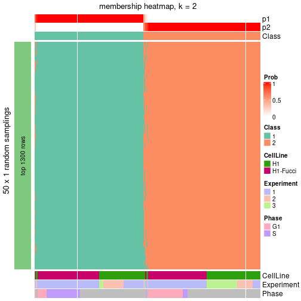</p>

</div>
<div id='tab-node-0-membership-heatmap-2'>
<pre><code class="r">membership_heatmap(res, k = 3)
</code></pre>

<p></p>

</div>
<div id='tab-node-0-membership-heatmap-3'>
<pre><code class="r">membership_heatmap(res, k = 4)
</code></pre>

<p></p>

</div>
</div>

As soon as the classes for columns are determined, the signatures
that are significantly different between subgroups can be looked for. 
Following are the heatmaps for signatures.


Signature heatmaps where rows are scaled:


<script>
$( function() {
	$( '#tabs-node-0-get-signatures' ).tabs();
} );
</script>
<div id='tabs-node-0-get-signatures'>
<ul>
<li><a href='#tab-node-0-get-signatures-1'>k = 2</a></li>
<li><a href='#tab-node-0-get-signatures-2'>k = 3</a></li>
<li><a href='#tab-node-0-get-signatures-3'>k = 4</a></li>
</ul>
<div id='tab-node-0-get-signatures-1'>
<pre><code class="r">get_signatures(res, k = 2)
</code></pre>

<p></p>

</div>
<div id='tab-node-0-get-signatures-2'>
<pre><code class="r">get_signatures(res, k = 3)
</code></pre>

<p></p>

</div>
<div id='tab-node-0-get-signatures-3'>
<pre><code class="r">get_signatures(res, k = 4)
</code></pre>

<p></p>

</div>
</div>


Signature heatmaps where rows are not scaled:


<script>
$( function() {
	$( '#tabs-node-0-get-signatures-no-scale' ).tabs();
} );
</script>
<div id='tabs-node-0-get-signatures-no-scale'>
<ul>
<li><a href='#tab-node-0-get-signatures-no-scale-1'>k = 2</a></li>
<li><a href='#tab-node-0-get-signatures-no-scale-2'>k = 3</a></li>
<li><a href='#tab-node-0-get-signatures-no-scale-3'>k = 4</a></li>
</ul>
<div id='tab-node-0-get-signatures-no-scale-1'>
<pre><code class="r">get_signatures(res, k = 2, scale_rows = FALSE)
</code></pre>

<p></p>

</div>
<div id='tab-node-0-get-signatures-no-scale-2'>
<pre><code class="r">get_signatures(res, k = 3, scale_rows = FALSE)
</code></pre>

<p></p>

</div>
<div id='tab-node-0-get-signatures-no-scale-3'>
<pre><code class="r">get_signatures(res, k = 4, scale_rows = FALSE)
</code></pre>

<p></p>

</div>
</div>


Compare the overlap of signatures from different k:

```r
compare_signatures(res)
```


`get_signature()` returns a data frame invisibly. To get the list of signatures, the function
call should be assigned to a variable explicitly. In following code, if `plot` argument is set
to `FALSE`, no heatmap is plotted while only the differential analysis is performed.

```r
# code only for demonstration
tb = get_signature(res, k = ..., plot = FALSE)
```

An example of the output of `tb` is:

```
#>   which_row         fdr    mean_1    mean_2 scaled_mean_1 scaled_mean_2 km
#> 1        38 0.042760348  8.373488  9.131774    -0.5533452     0.5164555  1
#> 2        40 0.018707592  7.106213  8.469186    -0.6173731     0.5762149  1
#> 3        55 0.019134737 10.221463 11.207825    -0.6159697     0.5749050  1
#> 4        59 0.006059896  5.921854  7.869574    -0.6899429     0.6439467  1
#> 5        60 0.018055526  8.928898 10.211722    -0.6204761     0.5791110  1
#> 6        98 0.009384629 15.714769 14.887706     0.6635654    -0.6193277  2
...
```

The columns in `tb` are:

1. `which_row`: row indices corresponding to the input matrix.
2. `fdr`: FDR for the differential test. 
3. `mean_x`: The mean value in group x.
4. `scaled_mean_x`: The mean value in group x after rows are scaled.
5. `km`: Row groups if k-means clustering is applied to rows (which is done by automatically selecting number of clusters).

If there are too many signatures, `top_signatures = ...` can be set to only show the 
signatures with the highest FDRs:

```r
# code only for demonstration
# e.g. to show the top 500 most significant rows
tb = get_signature(res, k = ..., top_signatures = 500)
```

If the signatures are defined as these which are uniquely high in current group, `diff_method` argument
can be set to `"uniquely_high_in_one_group"`:

```r
# code only for demonstration
tb = get_signature(res, k = ..., diff_method = "uniquely_high_in_one_group")
```


UMAP plot which shows how samples are separated.


<script>
$( function() {
	$( '#tabs-node-0-dimension-reduction' ).tabs();
} );
</script>
<div id='tabs-node-0-dimension-reduction'>
<ul>
<li><a href='#tab-node-0-dimension-reduction-1'>k = 2</a></li>
<li><a href='#tab-node-0-dimension-reduction-2'>k = 3</a></li>
<li><a href='#tab-node-0-dimension-reduction-3'>k = 4</a></li>
</ul>
<div id='tab-node-0-dimension-reduction-1'>
<pre><code class="r">dimension_reduction(res, k = 2, method = &quot;UMAP&quot;)
</code></pre>

<p></p>

</div>
<div id='tab-node-0-dimension-reduction-2'>
<pre><code class="r">dimension_reduction(res, k = 3, method = &quot;UMAP&quot;)
</code></pre>

<p></p>

</div>
<div id='tab-node-0-dimension-reduction-3'>
<pre><code class="r">dimension_reduction(res, k = 4, method = &quot;UMAP&quot;)
</code></pre>

<p></p>

</div>
</div>


Following heatmap shows how subgroups are split when increasing `k`:

```r
collect_classes(res)
```


Test correlation between subgroups and known annotations. If the known
annotation is numeric, one-way ANOVA test is applied, and if the known
annotation is discrete, chi-squared contingency table test is applied.

```r
test_to_known_factors(res)
```

```
#>             n_sample CellLine(p-value) Experiment(p-value) Phase(p-value) k
#> ATC:skmeans      457            0.2555            2.75e-10       5.25e-17 2
#> ATC:skmeans      453            0.5542            8.96e-09       7.98e-17 3
#> ATC:skmeans      437            0.0658            6.45e-12       1.50e-16 4
```


If matrix rows can be associated to genes, consider to use `functional_enrichment(res,
...)` to perform function enrichment for the signature genes. See [this vignette](https://jokergoo.github.io/cola_vignettes/functional_enrichment.html) for more detailed explanations.


 

---------------------------------------------------


### Node01


Parent node: [Node0](#Node0).
Child nodes: 
                [Node011](#Node011)
        ,
                [Node012](#Node012)
        ,
                Node021-leaf
        ,
                [Node022](#Node022)
        ,
                [Node023](#Node023)
        .


The object with results only for a single top-value method and a single partitioning method 
can be extracted as:

```r
res = res_rh["01"]
```

A summary of `res` and all the functions that can be applied to it:

```r
res
```

```
#> A 'ConsensusPartition' object with k = 2, 3, 4.
#>   On a matrix with 13001 rows and 221 columns.
#>   Top rows (1300) are extracted by 'ATC' method.
#>   Subgroups are detected by 'skmeans' method.
#>   Performed in total 150 partitions by row resampling.
#>   Best k for subgroups seems to be 2.
#> 
#> Following methods can be applied to this 'ConsensusPartition' object:
#>  [1] "cola_report"             "collect_classes"         "collect_plots"          
#>  [4] "collect_stats"           "colnames"                "compare_partitions"     
#>  [7] "compare_signatures"      "consensus_heatmap"       "dimension_reduction"    
#> [10] "functional_enrichment"   "get_anno_col"            "get_anno"               
#> [13] "get_classes"             "get_consensus"           "get_matrix"             
#> [16] "get_membership"          "get_param"               "get_signatures"         
#> [19] "get_stats"               "is_best_k"               "is_stable_k"            
#> [22] "membership_heatmap"      "ncol"                    "nrow"                   
#> [25] "plot_ecdf"               "predict_classes"         "rownames"               
#> [28] "select_partition_number" "show"                    "suggest_best_k"         
#> [31] "test_to_known_factors"   "top_rows_heatmap"
```

`collect_plots()` function collects all the plots made from `res` for all `k` (number of subgroups)
into one single page to provide an easy and fast comparison between different `k`.

```r
collect_plots(res)
```


The plots are:

- The first row: a plot of the eCDF (empirical cumulative distribution
  function) curves of the consensus matrix for each `k` and the heatmap of
  predicted classes for each `k`.
- The second row: heatmaps of the consensus matrix for each `k`.
- The third row: heatmaps of the membership matrix for each `k`.
- The fouth row: heatmaps of the signatures for each `k`.

All the plots in panels can be made by individual functions and they are
plotted later in this section.

`select_partition_number()` produces several plots showing different
statistics for choosing "optimized" `k`. There are following statistics:

- eCDF curves of the consensus matrix for each `k`;
- 1-PAC. [The PAC score](https://en.wikipedia.org/wiki/Consensus_clustering#Over-interpretation_potential_of_consensus_clustering)
  measures the proportion of the ambiguous subgrouping.
- Mean silhouette score.
- Concordance. The mean probability of fiting the consensus subgroup labels in all
  partitions.
- Area increased. Denote $A_k$ as the area under the eCDF curve for current
  `k`, the area increased is defined as $A_k - A_{k-1}$.
- Rand index. The percent of pairs of samples that are both in a same cluster
  or both are not in a same cluster in the partition of k and k-1.
- Jaccard index. The ratio of pairs of samples are both in a same cluster in
  the partition of k and k-1 and the pairs of samples are both in a same
  cluster in the partition k or k-1.

The detailed explanations of these statistics can be found in [the _cola_
vignette](https://jokergoo.github.io/cola_vignettes/cola.html#toc_13).

Generally speaking, higher 1-PAC score, higher mean silhouette score or higher
concordance corresponds to better partition. Rand index and Jaccard index
measure how similar the current partition is compared to partition with `k-1`.
If they are too similar, we won't accept `k` is better than `k-1`.

```r
select_partition_number(res)
```


The numeric values for all these statistics can be obtained by `get_stats()`.

```r
get_stats(res)
```

```
#>   k 1-PAC mean_silhouette concordance area_increased  Rand Jaccard
#> 2 2 1.000           0.987       0.994          0.441 0.559   0.559
#> 3 3 0.898           0.898       0.959          0.452 0.747   0.567
#> 4 4 0.638           0.638       0.818          0.112 0.916   0.775
```

`suggest_best_k()` suggests the best $k$ based on these statistics. The rules are as follows:

- All $k$ with Jaccard index larger than 0.95 are removed because increasing
  $k$ does not provide enough extra information. If all $k$ are removed, it is
  marked as no subgroup is detected.
- For all $k$ with 1-PAC score larger than 0.9, the maximal $k$ is taken as
  the best $k$, and other $k$ are marked as optional $k$.
- If it does not fit the second rule. The $k$ with the maximal vote of the
  highest 1-PAC score, highest mean silhouette, and highest concordance is
  taken as the best $k$.

```r
suggest_best_k(res)
```

```
#> [1] 2
```


Following is the table of the partitions (You need to click the **show/hide
code output** link to see it). The membership matrix (columns with name `p*`)
is inferred by
[`clue::cl_consensus()`](https://www.rdocumentation.org/link/cl_consensus?package=clue)
function with the `SE` method. Basically the value in the membership matrix
represents the probability to belong to a certain group. The finall subgroup
label for an item is determined with the group with highest probability it
belongs to.

In `get_classes()` function, the entropy is calculated from the membership
matrix and the silhouette score is calculated from the consensus matrix.


<script>
$( function() {
	$( '#tabs-node-01-get-classes' ).tabs();
} );
</script>
<div id='tabs-node-01-get-classes'>
<ul>
<li><a href='#tab-node-01-get-classes-1'>k = 2</a></li>
<li><a href='#tab-node-01-get-classes-2'>k = 3</a></li>
<li><a href='#tab-node-01-get-classes-3'>k = 4</a></li>
</ul>

<div id='tab-node-01-get-classes-1'>
<p><a id='tab-node-01-get-classes-1-a' style='color:#0366d6' href='#'>show/hide code output</a></p>
<pre><code class="r">cbind(get_classes(res, k = 2), get_membership(res, k = 2))
</code></pre>

<pre><code>#&gt;             class entropy silhouette   p1   p2
#&gt; H1_Exp1.002     1   0.000      0.996 1.00 0.00
#&gt; H1_Exp1.003     1   0.000      0.996 1.00 0.00
#&gt; H1_Exp1.004     1   0.000      0.996 1.00 0.00
#&gt; H1_Exp1.006     1   0.000      0.996 1.00 0.00
#&gt; H1_Exp1.007     1   0.000      0.996 1.00 0.00
#&gt; H1_Exp1.009     2   0.000      0.990 0.00 1.00
#&gt; H1_Exp1.010     1   0.000      0.996 1.00 0.00
#&gt; H1_Exp1.011     1   0.000      0.996 1.00 0.00
#&gt; H1_Exp1.012     1   0.000      0.996 1.00 0.00
#&gt; H1_Exp1.014     1   0.000      0.996 1.00 0.00
#&gt; H1_Exp1.015     1   0.000      0.996 1.00 0.00
#&gt; H1_Exp1.016     1   0.000      0.996 1.00 0.00
#&gt; H1_Exp1.017     1   0.000      0.996 1.00 0.00
#&gt; H1_Exp1.018     1   0.000      0.996 1.00 0.00
#&gt; H1_Exp1.019     2   0.000      0.990 0.00 1.00
#&gt; H1_Exp1.020     1   0.000      0.996 1.00 0.00
#&gt; H1_Exp1.022     1   0.000      0.996 1.00 0.00
#&gt; H1_Exp1.023     1   0.000      0.996 1.00 0.00
#&gt; H1_Exp1.024     1   0.000      0.996 1.00 0.00
#&gt; H1_Exp1.025     1   0.000      0.996 1.00 0.00
#&gt; H1_Exp1.026     1   0.000      0.996 1.00 0.00
#&gt; H1_Exp1.029     1   0.000      0.996 1.00 0.00
#&gt; H1_Exp1.035     1   0.000      0.996 1.00 0.00
#&gt; H1_Exp1.038     1   0.000      0.996 1.00 0.00
#&gt; H1_Exp1.039     1   0.000      0.996 1.00 0.00
#&gt; H1_Exp1.040     1   0.000      0.996 1.00 0.00
#&gt; H1_Exp1.041     1   0.000      0.996 1.00 0.00
#&gt; H1_Exp1.049     1   0.000      0.996 1.00 0.00
#&gt; H1_Exp1.050     2   0.000      0.990 0.00 1.00
#&gt; H1_Exp1.051     1   0.000      0.996 1.00 0.00
#&gt; H1_Exp1.052     2   0.529      0.864 0.12 0.88
#&gt; H1_Exp1.053     1   0.584      0.835 0.86 0.14
#&gt; H1_Exp1.054     2   0.000      0.990 0.00 1.00
#&gt; H1_Exp1.055     2   0.000      0.990 0.00 1.00
#&gt; H1_Exp1.057     2   0.000      0.990 0.00 1.00
#&gt; H1_Exp1.059     2   0.000      0.990 0.00 1.00
#&gt; H1_Exp1.061     1   0.000      0.996 1.00 0.00
#&gt; H1_Exp1.062     1   0.000      0.996 1.00 0.00
#&gt; H1_Exp1.063     1   0.000      0.996 1.00 0.00
#&gt; H1_Exp1.064     1   0.000      0.996 1.00 0.00
#&gt; H1_Exp1.066     1   0.000      0.996 1.00 0.00
#&gt; H1_Exp1.069     2   0.000      0.990 0.00 1.00
#&gt; H1_Exp1.070     1   0.000      0.996 1.00 0.00
#&gt; H1_Exp2.073     1   0.000      0.996 1.00 0.00
#&gt; H1_Exp2.074     1   0.000      0.996 1.00 0.00
#&gt; H1_Exp2.075     1   0.000      0.996 1.00 0.00
#&gt; H1_Exp2.079     1   0.000      0.996 1.00 0.00
#&gt; H1_Exp2.081     1   0.000      0.996 1.00 0.00
#&gt; H1_Exp2.082     2   0.000      0.990 0.00 1.00
#&gt; H1_Exp2.083     1   0.000      0.996 1.00 0.00
#&gt; H1_Exp2.084     1   0.000      0.996 1.00 0.00
#&gt; H1_Exp2.085     1   0.000      0.996 1.00 0.00
#&gt; H1_Exp2.087     1   0.000      0.996 1.00 0.00
#&gt; H1_Exp2.088     1   0.000      0.996 1.00 0.00
#&gt; H1_Exp2.089     1   0.000      0.996 1.00 0.00
#&gt; H1_Exp2.091     1   0.141      0.976 0.98 0.02
#&gt; H1_Exp2.092     1   0.000      0.996 1.00 0.00
#&gt; H1_Exp2.093     2   0.000      0.990 0.00 1.00
#&gt; H1_Exp2.094     1   0.000      0.996 1.00 0.00
#&gt; H1_Exp2.096     1   0.000      0.996 1.00 0.00
#&gt; H1_Exp2.097     1   0.000      0.996 1.00 0.00
#&gt; H1_Exp2.098     1   0.000      0.996 1.00 0.00
#&gt; H1_Exp2.100     1   0.000      0.996 1.00 0.00
#&gt; H1_Exp2.101     1   0.000      0.996 1.00 0.00
#&gt; H1_Exp2.105     1   0.000      0.996 1.00 0.00
#&gt; H1_Exp2.106     1   0.000      0.996 1.00 0.00
#&gt; H1_Exp2.108     1   0.000      0.996 1.00 0.00
#&gt; H1_Exp2.112     2   0.000      0.990 0.00 1.00
#&gt; H1_Exp2.116     2   0.000      0.990 0.00 1.00
#&gt; H1_Exp2.118     1   0.000      0.996 1.00 0.00
#&gt; H1_Exp2.121     1   0.000      0.996 1.00 0.00
#&gt; H1_Exp2.123     2   0.000      0.990 0.00 1.00
#&gt; H1_Exp2.127     1   0.000      0.996 1.00 0.00
#&gt; H1_Exp2.130     2   0.000      0.990 0.00 1.00
#&gt; H1_Exp2.133     2   0.000      0.990 0.00 1.00
#&gt; H1_Exp2.135     2   0.000      0.990 0.00 1.00
#&gt; H1_Exp2.136     1   0.000      0.996 1.00 0.00
#&gt; H1_Exp2.138     1   0.000      0.996 1.00 0.00
#&gt; H1_Exp2.139     2   0.000      0.990 0.00 1.00
#&gt; H1_Exp2.140     2   0.000      0.990 0.00 1.00
#&gt; H1_Exp2.144     1   0.000      0.996 1.00 0.00
#&gt; H1_Exp2.146     2   0.000      0.990 0.00 1.00
#&gt; H1_Exp2.148     1   0.000      0.996 1.00 0.00
#&gt; H1_Exp2.150     2   0.000      0.990 0.00 1.00
#&gt; H1_Exp2.152     1   0.000      0.996 1.00 0.00
#&gt; H1_Exp2.154     2   0.000      0.990 0.00 1.00
#&gt; H1_Exp3.220     2   0.000      0.990 0.00 1.00
#&gt; H1_Exp3.223     1   0.000      0.996 1.00 0.00
#&gt; H1_Exp3.232     1   0.000      0.996 1.00 0.00
#&gt; H1_Exp3.233     2   0.000      0.990 0.00 1.00
#&gt; H1_Exp3.241     1   0.000      0.996 1.00 0.00
#&gt; H1_Exp3.248     2   0.000      0.990 0.00 1.00
#&gt; H1_Exp3.277     2   0.000      0.990 0.00 1.00
#&gt; H1_Exp3.283     2   0.000      0.990 0.00 1.00
#&gt; H1_Exp3.284     2   0.000      0.990 0.00 1.00
#&gt; G2_Exp1.069     1   0.000      0.996 1.00 0.00
#&gt; G2_Exp1.076     1   0.000      0.996 1.00 0.00
#&gt; G2_Exp1.013     1   0.000      0.996 1.00 0.00
#&gt; G2_Exp1.015     1   0.000      0.996 1.00 0.00
#&gt; G2_Exp1.019     1   0.000      0.996 1.00 0.00
#&gt; G2_Exp1.050     2   0.000      0.990 0.00 1.00
#&gt; G2_Exp1.042     2   0.000      0.990 0.00 1.00
#&gt; G2_Exp1.030     1   0.000      0.996 1.00 0.00
#&gt; G2_Exp1.022     2   0.000      0.990 0.00 1.00
#&gt; G2_Exp1.017     1   0.000      0.996 1.00 0.00
#&gt; G2_Exp1.047     1   0.000      0.996 1.00 0.00
#&gt; G2_Exp1.072     2   0.000      0.990 0.00 1.00
#&gt; G2_Exp1.074     2   0.000      0.990 0.00 1.00
#&gt; G2_Exp1.032     1   0.000      0.996 1.00 0.00
#&gt; G2_Exp1.064     1   0.000      0.996 1.00 0.00
#&gt; G2_Exp1.045     1   0.000      0.996 1.00 0.00
#&gt; G2_Exp1.038     1   0.000      0.996 1.00 0.00
#&gt; G2_Exp1.001     1   0.000      0.996 1.00 0.00
#&gt; G2_Exp1.049     1   0.000      0.996 1.00 0.00
#&gt; G2_Exp1.031     1   0.000      0.996 1.00 0.00
#&gt; G2_Exp1.070     2   0.000      0.990 0.00 1.00
#&gt; G2_Exp1.021     2   0.760      0.724 0.22 0.78
#&gt; G2_Exp1.036     1   0.000      0.996 1.00 0.00
#&gt; G2_Exp1.046     1   0.000      0.996 1.00 0.00
#&gt; G2_Exp1.040     1   0.000      0.996 1.00 0.00
#&gt; G2_Exp1.068     1   0.000      0.996 1.00 0.00
#&gt; G2_Exp1.077     1   0.000      0.996 1.00 0.00
#&gt; G2_Exp1.008     2   0.827      0.655 0.26 0.74
#&gt; G2_Exp1.014     1   0.000      0.996 1.00 0.00
#&gt; G2_Exp1.005     1   0.000      0.996 1.00 0.00
#&gt; G2_Exp1.048     2   0.000      0.990 0.00 1.00
#&gt; G2_Exp1.062     2   0.000      0.990 0.00 1.00
#&gt; G2_Exp1.056     1   0.000      0.996 1.00 0.00
#&gt; G2_Exp1.041     1   0.000      0.996 1.00 0.00
#&gt; G2_Exp1.012     1   0.000      0.996 1.00 0.00
#&gt; G2_Exp1.066     2   0.000      0.990 0.00 1.00
#&gt; G2_Exp1.023     2   0.242      0.953 0.04 0.96
#&gt; G2_Exp1.003     1   0.000      0.996 1.00 0.00
#&gt; S_Exp1.071      2   0.000      0.990 0.00 1.00
#&gt; S_Exp1.031      1   0.000      0.996 1.00 0.00
#&gt; S_Exp1.032      2   0.000      0.990 0.00 1.00
#&gt; S_Exp1.035      2   0.000      0.990 0.00 1.00
#&gt; S_Exp1.056      1   0.000      0.996 1.00 0.00
#&gt; S_Exp1.011      1   0.000      0.996 1.00 0.00
#&gt; S_Exp1.016      1   0.000      0.996 1.00 0.00
#&gt; S_Exp1.063      2   0.000      0.990 0.00 1.00
#&gt; S_Exp1.038      1   0.000      0.996 1.00 0.00
#&gt; S_Exp1.048      1   0.000      0.996 1.00 0.00
#&gt; S_Exp1.051      1   0.000      0.996 1.00 0.00
#&gt; S_Exp1.078      2   0.000      0.990 0.00 1.00
#&gt; S_Exp1.023      2   0.141      0.973 0.02 0.98
#&gt; S_Exp1.022      1   0.000      0.996 1.00 0.00
#&gt; S_Exp1.001      1   0.000      0.996 1.00 0.00
#&gt; S_Exp1.046      2   0.000      0.990 0.00 1.00
#&gt; S_Exp1.061      1   0.000      0.996 1.00 0.00
#&gt; S_Exp1.080      1   0.000      0.996 1.00 0.00
#&gt; S_Exp1.008      2   0.000      0.990 0.00 1.00
#&gt; S_Exp1.069      1   0.000      0.996 1.00 0.00
#&gt; S_Exp1.019      1   0.000      0.996 1.00 0.00
#&gt; S_Exp1.003      1   0.000      0.996 1.00 0.00
#&gt; S_Exp1.006      2   0.000      0.990 0.00 1.00
#&gt; S_Exp1.029      1   0.000      0.996 1.00 0.00
#&gt; S_Exp1.025      1   0.000      0.996 1.00 0.00
#&gt; S_Exp1.064      2   0.000      0.990 0.00 1.00
#&gt; S_Exp1.041      1   0.000      0.996 1.00 0.00
#&gt; S_Exp1.057      1   0.000      0.996 1.00 0.00
#&gt; S_Exp1.073      2   0.000      0.990 0.00 1.00
#&gt; S_Exp1.014      2   0.000      0.990 0.00 1.00
#&gt; S_Exp1.039      2   0.000      0.990 0.00 1.00
#&gt; S_Exp1.055      1   0.000      0.996 1.00 0.00
#&gt; S_Exp1.033      1   0.000      0.996 1.00 0.00
#&gt; S_Exp1.081      1   0.000      0.996 1.00 0.00
#&gt; S_Exp1.004      1   0.000      0.996 1.00 0.00
#&gt; S_Exp1.045      1   0.000      0.996 1.00 0.00
#&gt; S_Exp1.054      2   0.000      0.990 0.00 1.00
#&gt; S_Exp1.018      1   0.000      0.996 1.00 0.00
#&gt; S_Exp1.034      1   0.000      0.996 1.00 0.00
#&gt; S_Exp1.067      1   0.000      0.996 1.00 0.00
#&gt; S_Exp1.012      2   0.000      0.990 0.00 1.00
#&gt; S_Exp1.037      1   0.000      0.996 1.00 0.00
#&gt; S_Exp1.070      2   0.000      0.990 0.00 1.00
#&gt; S_Exp1.053      1   0.000      0.996 1.00 0.00
#&gt; S_Exp1.036      1   0.000      0.996 1.00 0.00
#&gt; S_Exp1.021      1   0.000      0.996 1.00 0.00
#&gt; S_Exp1.020      2   0.000      0.990 0.00 1.00
#&gt; S_Exp1.060      1   0.000      0.996 1.00 0.00
#&gt; S_Exp1.015      2   0.000      0.990 0.00 1.00
#&gt; S_Exp1.066      2   0.000      0.990 0.00 1.00
#&gt; S_Exp1.062      1   0.000      0.996 1.00 0.00
#&gt; S_Exp1.040      2   0.000      0.990 0.00 1.00
#&gt; S_Exp1.028      1   0.000      0.996 1.00 0.00
#&gt; S_Exp1.079      1   0.000      0.996 1.00 0.00
#&gt; S_Exp1.047      1   0.000      0.996 1.00 0.00
#&gt; S_Exp1.026      2   0.000      0.990 0.00 1.00
#&gt; S_Exp1.077      1   0.000      0.996 1.00 0.00
#&gt; S_Exp1.052      1   0.000      0.996 1.00 0.00
#&gt; S_Exp1.007      1   0.000      0.996 1.00 0.00
#&gt; S_Exp1.027      1   0.000      0.996 1.00 0.00
#&gt; S_Exp1.017      2   0.000      0.990 0.00 1.00
#&gt; S_Exp1.075      1   0.000      0.996 1.00 0.00
#&gt; S_Exp1.049      1   0.000      0.996 1.00 0.00
#&gt; S_Exp1.072      1   0.000      0.996 1.00 0.00
#&gt; S_Exp1.005      1   0.000      0.996 1.00 0.00
#&gt; S_Exp1.058      1   0.000      0.996 1.00 0.00
#&gt; S_Exp1.010      2   0.000      0.990 0.00 1.00
#&gt; S_Exp1.043      1   0.000      0.996 1.00 0.00
#&gt; S_Exp1.050      1   0.000      0.996 1.00 0.00
#&gt; G1_Exp1.033     1   0.000      0.996 1.00 0.00
#&gt; G1_Exp1.013     1   0.000      0.996 1.00 0.00
#&gt; G1_Exp1.026     1   0.000      0.996 1.00 0.00
#&gt; G1_Exp1.027     1   0.000      0.996 1.00 0.00
#&gt; G1_Exp1.059     2   0.000      0.990 0.00 1.00
#&gt; G1_Exp1.019     1   0.958      0.380 0.62 0.38
#&gt; G1_Exp1.085     2   0.000      0.990 0.00 1.00
#&gt; G1_Exp1.031     2   0.000      0.990 0.00 1.00
#&gt; G1_Exp1.078     2   0.000      0.990 0.00 1.00
#&gt; G1_Exp1.073     1   0.000      0.996 1.00 0.00
#&gt; G1_Exp1.023     1   0.000      0.996 1.00 0.00
#&gt; G1_Exp1.022     1   0.000      0.996 1.00 0.00
#&gt; G1_Exp1.034     2   0.000      0.990 0.00 1.00
#&gt; G1_Exp1.039     1   0.000      0.996 1.00 0.00
#&gt; G1_Exp1.020     2   0.141      0.973 0.02 0.98
#&gt; G1_Exp1.011     2   0.000      0.990 0.00 1.00
#&gt; G1_Exp1.063     2   0.000      0.990 0.00 1.00
#&gt; G1_Exp1.018     1   0.000      0.996 1.00 0.00
#&gt; G1_Exp1.046     2   0.000      0.990 0.00 1.00
</code></pre>

<script>
$('#tab-node-01-get-classes-1-a').parent().next().next().hide();
$('#tab-node-01-get-classes-1-a').click(function(){
  $('#tab-node-01-get-classes-1-a').parent().next().next().toggle();
  return(false);
});
</script>
</div>

<div id='tab-node-01-get-classes-2'>
<p><a id='tab-node-01-get-classes-2-a' style='color:#0366d6' href='#'>show/hide code output</a></p>
<pre><code class="r">cbind(get_classes(res, k = 3), get_membership(res, k = 3))
</code></pre>

<pre><code>#&gt;             class entropy silhouette   p1   p2   p3
#&gt; H1_Exp1.002     1  0.0000    0.97072 1.00 0.00 0.00
#&gt; H1_Exp1.003     1  0.0000    0.97072 1.00 0.00 0.00
#&gt; H1_Exp1.004     1  0.0000    0.97072 1.00 0.00 0.00
#&gt; H1_Exp1.006     1  0.0000    0.97072 1.00 0.00 0.00
#&gt; H1_Exp1.007     1  0.0000    0.97072 1.00 0.00 0.00
#&gt; H1_Exp1.009     2  0.3340    0.83060 0.12 0.88 0.00
#&gt; H1_Exp1.010     1  0.0892    0.95198 0.98 0.00 0.02
#&gt; H1_Exp1.011     1  0.0000    0.97072 1.00 0.00 0.00
#&gt; H1_Exp1.012     1  0.0000    0.97072 1.00 0.00 0.00
#&gt; H1_Exp1.014     1  0.0000    0.97072 1.00 0.00 0.00
#&gt; H1_Exp1.015     3  0.6302    0.15604 0.48 0.00 0.52
#&gt; H1_Exp1.016     3  0.6302    0.14406 0.48 0.00 0.52
#&gt; H1_Exp1.017     3  0.4796    0.72700 0.22 0.00 0.78
#&gt; H1_Exp1.018     3  0.1529    0.88983 0.04 0.00 0.96
#&gt; H1_Exp1.019     3  0.6244    0.17125 0.00 0.44 0.56
#&gt; H1_Exp1.020     3  0.0000    0.90638 0.00 0.00 1.00
#&gt; H1_Exp1.022     3  0.4796    0.73141 0.22 0.00 0.78
#&gt; H1_Exp1.023     3  0.0000    0.90638 0.00 0.00 1.00
#&gt; H1_Exp1.024     3  0.0000    0.90638 0.00 0.00 1.00
#&gt; H1_Exp1.025     3  0.0892    0.90037 0.02 0.00 0.98
#&gt; H1_Exp1.026     1  0.0000    0.97072 1.00 0.00 0.00
#&gt; H1_Exp1.029     3  0.6302    0.15062 0.48 0.00 0.52
#&gt; H1_Exp1.035     3  0.0000    0.90638 0.00 0.00 1.00
#&gt; H1_Exp1.038     3  0.0000    0.90638 0.00 0.00 1.00
#&gt; H1_Exp1.039     3  0.0000    0.90638 0.00 0.00 1.00
#&gt; H1_Exp1.040     3  0.1529    0.88920 0.04 0.00 0.96
#&gt; H1_Exp1.041     3  0.0000    0.90638 0.00 0.00 1.00
#&gt; H1_Exp1.049     3  0.0000    0.90638 0.00 0.00 1.00
#&gt; H1_Exp1.050     2  0.3686    0.83056 0.00 0.86 0.14
#&gt; H1_Exp1.051     3  0.0000    0.90638 0.00 0.00 1.00
#&gt; H1_Exp1.052     3  0.0000    0.90638 0.00 0.00 1.00
#&gt; H1_Exp1.053     3  0.0000    0.90638 0.00 0.00 1.00
#&gt; H1_Exp1.054     3  0.0000    0.90638 0.00 0.00 1.00
#&gt; H1_Exp1.055     3  0.0000    0.90638 0.00 0.00 1.00
#&gt; H1_Exp1.057     2  0.0000    0.97010 0.00 1.00 0.00
#&gt; H1_Exp1.059     2  0.0000    0.97010 0.00 1.00 0.00
#&gt; H1_Exp1.061     3  0.0000    0.90638 0.00 0.00 1.00
#&gt; H1_Exp1.062     3  0.0000    0.90638 0.00 0.00 1.00
#&gt; H1_Exp1.063     3  0.0892    0.89987 0.02 0.00 0.98
#&gt; H1_Exp1.064     3  0.0000    0.90638 0.00 0.00 1.00
#&gt; H1_Exp1.066     3  0.0000    0.90638 0.00 0.00 1.00
#&gt; H1_Exp1.069     2  0.0000    0.97010 0.00 1.00 0.00
#&gt; H1_Exp1.070     1  0.4555    0.72614 0.80 0.00 0.20
#&gt; H1_Exp2.073     1  0.0000    0.97072 1.00 0.00 0.00
#&gt; H1_Exp2.074     1  0.0000    0.97072 1.00 0.00 0.00
#&gt; H1_Exp2.075     1  0.0000    0.97072 1.00 0.00 0.00
#&gt; H1_Exp2.079     1  0.0000    0.97072 1.00 0.00 0.00
#&gt; H1_Exp2.081     1  0.0000    0.97072 1.00 0.00 0.00
#&gt; H1_Exp2.082     2  0.0000    0.97010 0.00 1.00 0.00
#&gt; H1_Exp2.083     1  0.0000    0.97072 1.00 0.00 0.00
#&gt; H1_Exp2.084     1  0.0000    0.97072 1.00 0.00 0.00
#&gt; H1_Exp2.085     1  0.0000    0.97072 1.00 0.00 0.00
#&gt; H1_Exp2.087     1  0.0000    0.97072 1.00 0.00 0.00
#&gt; H1_Exp2.088     1  0.0000    0.97072 1.00 0.00 0.00
#&gt; H1_Exp2.089     1  0.0000    0.97072 1.00 0.00 0.00
#&gt; H1_Exp2.091     1  0.0000    0.97072 1.00 0.00 0.00
#&gt; H1_Exp2.092     1  0.0000    0.97072 1.00 0.00 0.00
#&gt; H1_Exp2.093     2  0.0000    0.97010 0.00 1.00 0.00
#&gt; H1_Exp2.094     1  0.0000    0.97072 1.00 0.00 0.00
#&gt; H1_Exp2.096     1  0.0000    0.97072 1.00 0.00 0.00
#&gt; H1_Exp2.097     1  0.0000    0.97072 1.00 0.00 0.00
#&gt; H1_Exp2.098     1  0.0000    0.97072 1.00 0.00 0.00
#&gt; H1_Exp2.100     1  0.0000    0.97072 1.00 0.00 0.00
#&gt; H1_Exp2.101     1  0.0000    0.97072 1.00 0.00 0.00
#&gt; H1_Exp2.105     1  0.0000    0.97072 1.00 0.00 0.00
#&gt; H1_Exp2.106     1  0.0000    0.97072 1.00 0.00 0.00
#&gt; H1_Exp2.108     1  0.0000    0.97072 1.00 0.00 0.00
#&gt; H1_Exp2.112     2  0.0000    0.97010 0.00 1.00 0.00
#&gt; H1_Exp2.116     2  0.0000    0.97010 0.00 1.00 0.00
#&gt; H1_Exp2.118     3  0.5216    0.67197 0.26 0.00 0.74
#&gt; H1_Exp2.121     3  0.5016    0.70000 0.24 0.00 0.76
#&gt; H1_Exp2.123     2  0.0000    0.97010 0.00 1.00 0.00
#&gt; H1_Exp2.127     3  0.6126    0.39272 0.40 0.00 0.60
#&gt; H1_Exp2.130     2  0.0000    0.97010 0.00 1.00 0.00
#&gt; H1_Exp2.133     2  0.0000    0.97010 0.00 1.00 0.00
#&gt; H1_Exp2.135     2  0.0000    0.97010 0.00 1.00 0.00
#&gt; H1_Exp2.136     1  0.5706    0.49919 0.68 0.00 0.32
#&gt; H1_Exp2.138     1  0.0000    0.97072 1.00 0.00 0.00
#&gt; H1_Exp2.139     2  0.0000    0.97010 0.00 1.00 0.00
#&gt; H1_Exp2.140     2  0.1529    0.92956 0.04 0.96 0.00
#&gt; H1_Exp2.144     1  0.0000    0.97072 1.00 0.00 0.00
#&gt; H1_Exp2.146     2  0.0000    0.97010 0.00 1.00 0.00
#&gt; H1_Exp2.148     1  0.0000    0.97072 1.00 0.00 0.00
#&gt; H1_Exp2.150     2  0.0000    0.97010 0.00 1.00 0.00
#&gt; H1_Exp2.152     1  0.0000    0.97072 1.00 0.00 0.00
#&gt; H1_Exp2.154     2  0.0892    0.95054 0.02 0.98 0.00
#&gt; H1_Exp3.220     2  0.0000    0.97010 0.00 1.00 0.00
#&gt; H1_Exp3.223     1  0.0000    0.97072 1.00 0.00 0.00
#&gt; H1_Exp3.232     1  0.0000    0.97072 1.00 0.00 0.00
#&gt; H1_Exp3.233     2  0.2414    0.92276 0.02 0.94 0.04
#&gt; H1_Exp3.241     3  0.0892    0.90037 0.02 0.00 0.98
#&gt; H1_Exp3.248     2  0.0000    0.97010 0.00 1.00 0.00
#&gt; H1_Exp3.277     2  0.0000    0.97010 0.00 1.00 0.00
#&gt; H1_Exp3.283     2  0.0000    0.97010 0.00 1.00 0.00
#&gt; H1_Exp3.284     2  0.0000    0.97010 0.00 1.00 0.00
#&gt; G2_Exp1.069     1  0.6309   -0.09400 0.50 0.00 0.50
#&gt; G2_Exp1.076     3  0.0892    0.89966 0.02 0.00 0.98
#&gt; G2_Exp1.013     1  0.0000    0.97072 1.00 0.00 0.00
#&gt; G2_Exp1.015     1  0.0000    0.97072 1.00 0.00 0.00
#&gt; G2_Exp1.019     1  0.6280    0.07984 0.54 0.00 0.46
#&gt; G2_Exp1.050     3  0.0892    0.89674 0.00 0.02 0.98
#&gt; G2_Exp1.042     3  0.0892    0.89676 0.00 0.02 0.98
#&gt; G2_Exp1.030     3  0.5397    0.63817 0.28 0.00 0.72
#&gt; G2_Exp1.022     2  0.0000    0.97010 0.00 1.00 0.00
#&gt; G2_Exp1.017     1  0.0000    0.97072 1.00 0.00 0.00
#&gt; G2_Exp1.047     3  0.0000    0.90638 0.00 0.00 1.00
#&gt; G2_Exp1.072     2  0.0000    0.97010 0.00 1.00 0.00
#&gt; G2_Exp1.074     3  0.0892    0.89660 0.00 0.02 0.98
#&gt; G2_Exp1.032     3  0.3340    0.82722 0.12 0.00 0.88
#&gt; G2_Exp1.064     3  0.0000    0.90638 0.00 0.00 1.00
#&gt; G2_Exp1.045     3  0.0000    0.90638 0.00 0.00 1.00
#&gt; G2_Exp1.038     3  0.0000    0.90638 0.00 0.00 1.00
#&gt; G2_Exp1.001     1  0.0000    0.97072 1.00 0.00 0.00
#&gt; G2_Exp1.049     3  0.0000    0.90638 0.00 0.00 1.00
#&gt; G2_Exp1.031     1  0.0000    0.97072 1.00 0.00 0.00
#&gt; G2_Exp1.070     2  0.0000    0.97010 0.00 1.00 0.00
#&gt; G2_Exp1.021     3  0.0892    0.89618 0.00 0.02 0.98
#&gt; G2_Exp1.036     3  0.0892    0.90037 0.02 0.00 0.98
#&gt; G2_Exp1.046     3  0.0000    0.90638 0.00 0.00 1.00
#&gt; G2_Exp1.040     3  0.0000    0.90638 0.00 0.00 1.00
#&gt; G2_Exp1.068     3  0.0000    0.90638 0.00 0.00 1.00
#&gt; G2_Exp1.077     3  0.0000    0.90638 0.00 0.00 1.00
#&gt; G2_Exp1.008     1  0.4002    0.79023 0.84 0.16 0.00
#&gt; G2_Exp1.014     1  0.0000    0.97072 1.00 0.00 0.00
#&gt; G2_Exp1.005     1  0.0000    0.97072 1.00 0.00 0.00
#&gt; G2_Exp1.048     2  0.0000    0.97010 0.00 1.00 0.00
#&gt; G2_Exp1.062     2  0.4796    0.71510 0.00 0.78 0.22
#&gt; G2_Exp1.056     3  0.0892    0.90037 0.02 0.00 0.98
#&gt; G2_Exp1.041     3  0.0000    0.90638 0.00 0.00 1.00
#&gt; G2_Exp1.012     1  0.0000    0.97072 1.00 0.00 0.00
#&gt; G2_Exp1.066     3  0.2959    0.82755 0.00 0.10 0.90
#&gt; G2_Exp1.023     3  0.0892    0.89634 0.00 0.02 0.98
#&gt; G2_Exp1.003     1  0.0000    0.97072 1.00 0.00 0.00
#&gt; S_Exp1.071      2  0.0000    0.97010 0.00 1.00 0.00
#&gt; S_Exp1.031      1  0.0000    0.97072 1.00 0.00 0.00
#&gt; S_Exp1.032      2  0.0000    0.97010 0.00 1.00 0.00
#&gt; S_Exp1.035      2  0.0000    0.97010 0.00 1.00 0.00
#&gt; S_Exp1.056      1  0.0000    0.97072 1.00 0.00 0.00
#&gt; S_Exp1.011      1  0.0000    0.97072 1.00 0.00 0.00
#&gt; S_Exp1.016      1  0.0000    0.97072 1.00 0.00 0.00
#&gt; S_Exp1.063      2  0.0000    0.97010 0.00 1.00 0.00
#&gt; S_Exp1.038      1  0.1529    0.93380 0.96 0.00 0.04
#&gt; S_Exp1.048      1  0.0000    0.97072 1.00 0.00 0.00
#&gt; S_Exp1.051      1  0.0000    0.97072 1.00 0.00 0.00
#&gt; S_Exp1.078      2  0.0000    0.97010 0.00 1.00 0.00
#&gt; S_Exp1.023      2  0.3415    0.87012 0.08 0.90 0.02
#&gt; S_Exp1.022      1  0.0000    0.97072 1.00 0.00 0.00
#&gt; S_Exp1.001      1  0.0000    0.97072 1.00 0.00 0.00
#&gt; S_Exp1.046      2  0.0000    0.97010 0.00 1.00 0.00
#&gt; S_Exp1.061      1  0.0000    0.97072 1.00 0.00 0.00
#&gt; S_Exp1.080      1  0.0000    0.97072 1.00 0.00 0.00
#&gt; S_Exp1.008      2  0.0000    0.97010 0.00 1.00 0.00
#&gt; S_Exp1.069      1  0.0000    0.97072 1.00 0.00 0.00
#&gt; S_Exp1.019      1  0.0000    0.97072 1.00 0.00 0.00
#&gt; S_Exp1.003      1  0.0000    0.97072 1.00 0.00 0.00
#&gt; S_Exp1.006      2  0.0000    0.97010 0.00 1.00 0.00
#&gt; S_Exp1.029      1  0.6244    0.14929 0.56 0.00 0.44
#&gt; S_Exp1.025      1  0.0000    0.97072 1.00 0.00 0.00
#&gt; S_Exp1.064      2  0.0000    0.97010 0.00 1.00 0.00
#&gt; S_Exp1.041      1  0.0000    0.97072 1.00 0.00 0.00
#&gt; S_Exp1.057      1  0.0000    0.97072 1.00 0.00 0.00
#&gt; S_Exp1.073      2  0.0000    0.97010 0.00 1.00 0.00
#&gt; S_Exp1.014      2  0.0000    0.97010 0.00 1.00 0.00
#&gt; S_Exp1.039      2  0.0000    0.97010 0.00 1.00 0.00
#&gt; S_Exp1.055      1  0.0000    0.97072 1.00 0.00 0.00
#&gt; S_Exp1.033      1  0.0000    0.97072 1.00 0.00 0.00
#&gt; S_Exp1.081      1  0.0000    0.97072 1.00 0.00 0.00
#&gt; S_Exp1.004      1  0.0000    0.97072 1.00 0.00 0.00
#&gt; S_Exp1.045      1  0.0000    0.97072 1.00 0.00 0.00
#&gt; S_Exp1.054      2  0.0000    0.97010 0.00 1.00 0.00
#&gt; S_Exp1.018      1  0.0000    0.97072 1.00 0.00 0.00
#&gt; S_Exp1.034      1  0.4002    0.79274 0.84 0.00 0.16
#&gt; S_Exp1.067      1  0.0000    0.97072 1.00 0.00 0.00
#&gt; S_Exp1.012      2  0.0000    0.97010 0.00 1.00 0.00
#&gt; S_Exp1.037      1  0.0000    0.97072 1.00 0.00 0.00
#&gt; S_Exp1.070      2  0.0000    0.97010 0.00 1.00 0.00
#&gt; S_Exp1.053      1  0.0000    0.97072 1.00 0.00 0.00
#&gt; S_Exp1.036      1  0.0000    0.97072 1.00 0.00 0.00
#&gt; S_Exp1.021      1  0.0000    0.97072 1.00 0.00 0.00
#&gt; S_Exp1.020      2  0.0000    0.97010 0.00 1.00 0.00
#&gt; S_Exp1.060      1  0.0000    0.97072 1.00 0.00 0.00
#&gt; S_Exp1.015      2  0.0000    0.97010 0.00 1.00 0.00
#&gt; S_Exp1.066      2  0.0000    0.97010 0.00 1.00 0.00
#&gt; S_Exp1.062      1  0.0000    0.97072 1.00 0.00 0.00
#&gt; S_Exp1.040      2  0.0000    0.97010 0.00 1.00 0.00
#&gt; S_Exp1.028      1  0.0000    0.97072 1.00 0.00 0.00
#&gt; S_Exp1.079      1  0.0000    0.97072 1.00 0.00 0.00
#&gt; S_Exp1.047      1  0.0000    0.97072 1.00 0.00 0.00
#&gt; S_Exp1.026      2  0.1529    0.93614 0.00 0.96 0.04
#&gt; S_Exp1.077      1  0.0000    0.97072 1.00 0.00 0.00
#&gt; S_Exp1.052      1  0.2066    0.91460 0.94 0.00 0.06
#&gt; S_Exp1.007      1  0.0000    0.97072 1.00 0.00 0.00
#&gt; S_Exp1.027      1  0.0892    0.95190 0.98 0.00 0.02
#&gt; S_Exp1.017      2  0.0000    0.97010 0.00 1.00 0.00
#&gt; S_Exp1.075      1  0.0000    0.97072 1.00 0.00 0.00
#&gt; S_Exp1.049      1  0.0000    0.97072 1.00 0.00 0.00
#&gt; S_Exp1.072      1  0.0000    0.97072 1.00 0.00 0.00
#&gt; S_Exp1.005      1  0.0000    0.97072 1.00 0.00 0.00
#&gt; S_Exp1.058      1  0.1529    0.93438 0.96 0.00 0.04
#&gt; S_Exp1.010      2  0.0000    0.97010 0.00 1.00 0.00
#&gt; S_Exp1.043      1  0.0000    0.97072 1.00 0.00 0.00
#&gt; S_Exp1.050      1  0.0000    0.97072 1.00 0.00 0.00
#&gt; G1_Exp1.033     1  0.5835    0.44865 0.66 0.00 0.34
#&gt; G1_Exp1.013     1  0.0000    0.97072 1.00 0.00 0.00
#&gt; G1_Exp1.026     3  0.1529    0.88947 0.04 0.00 0.96
#&gt; G1_Exp1.027     3  0.5397    0.64023 0.28 0.00 0.72
#&gt; G1_Exp1.059     2  0.6192    0.27666 0.00 0.58 0.42
#&gt; G1_Exp1.019     3  0.0892    0.90000 0.02 0.00 0.98
#&gt; G1_Exp1.085     2  0.0000    0.97010 0.00 1.00 0.00
#&gt; G1_Exp1.031     2  0.0000    0.97010 0.00 1.00 0.00
#&gt; G1_Exp1.078     2  0.0000    0.97010 0.00 1.00 0.00
#&gt; G1_Exp1.073     3  0.0000    0.90638 0.00 0.00 1.00
#&gt; G1_Exp1.023     1  0.0000    0.97072 1.00 0.00 0.00
#&gt; G1_Exp1.022     1  0.0000    0.97072 1.00 0.00 0.00
#&gt; G1_Exp1.034     2  0.0000    0.97010 0.00 1.00 0.00
#&gt; G1_Exp1.039     3  0.0892    0.90037 0.02 0.00 0.98
#&gt; G1_Exp1.020     2  0.6309   -0.00389 0.00 0.50 0.50
#&gt; G1_Exp1.011     2  0.0000    0.97010 0.00 1.00 0.00
#&gt; G1_Exp1.063     2  0.0000    0.97010 0.00 1.00 0.00
#&gt; G1_Exp1.018     1  0.0000    0.97072 1.00 0.00 0.00
#&gt; G1_Exp1.046     3  0.4291    0.73650 0.00 0.18 0.82
</code></pre>

<script>
$('#tab-node-01-get-classes-2-a').parent().next().next().hide();
$('#tab-node-01-get-classes-2-a').click(function(){
  $('#tab-node-01-get-classes-2-a').parent().next().next().toggle();
  return(false);
});
</script>
</div>

<div id='tab-node-01-get-classes-3'>
<p><a id='tab-node-01-get-classes-3-a' style='color:#0366d6' href='#'>show/hide code output</a></p>
<pre><code class="r">cbind(get_classes(res, k = 4), get_membership(res, k = 4))
</code></pre>

<pre><code>#&gt;             class entropy silhouette   p1   p2   p3   p4
#&gt; H1_Exp1.002     1  0.0000    0.78944 1.00 0.00 0.00 0.00
#&gt; H1_Exp1.003     1  0.0000    0.78944 1.00 0.00 0.00 0.00
#&gt; H1_Exp1.004     1  0.4907    0.14962 0.58 0.00 0.00 0.42
#&gt; H1_Exp1.006     1  0.0000    0.78944 1.00 0.00 0.00 0.00
#&gt; H1_Exp1.007     1  0.4994   -0.07474 0.52 0.00 0.00 0.48
#&gt; H1_Exp1.009     2  0.5957    0.54447 0.04 0.54 0.00 0.42
#&gt; H1_Exp1.010     4  0.6150    0.48053 0.36 0.00 0.06 0.58
#&gt; H1_Exp1.011     1  0.1637    0.77201 0.94 0.00 0.00 0.06
#&gt; H1_Exp1.012     1  0.0000    0.78944 1.00 0.00 0.00 0.00
#&gt; H1_Exp1.014     1  0.2647    0.72358 0.88 0.00 0.00 0.12
#&gt; H1_Exp1.015     1  0.4522    0.31427 0.68 0.00 0.32 0.00
#&gt; H1_Exp1.016     4  0.7684    0.36719 0.22 0.00 0.36 0.42
#&gt; H1_Exp1.017     4  0.6382    0.33086 0.08 0.00 0.34 0.58
#&gt; H1_Exp1.018     3  0.4406    0.50952 0.30 0.00 0.70 0.00
#&gt; H1_Exp1.019     2  0.7550    0.18686 0.00 0.48 0.22 0.30
#&gt; H1_Exp1.020     3  0.4522    0.53683 0.00 0.00 0.68 0.32
#&gt; H1_Exp1.022     3  0.4977    0.19059 0.46 0.00 0.54 0.00
#&gt; H1_Exp1.023     3  0.4227    0.71050 0.12 0.00 0.82 0.06
#&gt; H1_Exp1.024     3  0.2647    0.74779 0.00 0.00 0.88 0.12
#&gt; H1_Exp1.025     3  0.5291    0.62627 0.18 0.00 0.74 0.08
#&gt; H1_Exp1.026     1  0.0000    0.78944 1.00 0.00 0.00 0.00
#&gt; H1_Exp1.029     1  0.5619    0.23757 0.64 0.00 0.32 0.04
#&gt; H1_Exp1.035     3  0.2011    0.76861 0.00 0.00 0.92 0.08
#&gt; H1_Exp1.038     3  0.3172    0.72144 0.00 0.00 0.84 0.16
#&gt; H1_Exp1.039     3  0.0000    0.78328 0.00 0.00 1.00 0.00
#&gt; H1_Exp1.040     3  0.4406    0.50724 0.30 0.00 0.70 0.00
#&gt; H1_Exp1.041     3  0.0000    0.78328 0.00 0.00 1.00 0.00
#&gt; H1_Exp1.049     3  0.1637    0.77403 0.00 0.00 0.94 0.06
#&gt; H1_Exp1.050     2  0.6286    0.55798 0.00 0.66 0.20 0.14
#&gt; H1_Exp1.051     3  0.1211    0.77924 0.00 0.00 0.96 0.04
#&gt; H1_Exp1.052     3  0.1211    0.77850 0.00 0.00 0.96 0.04
#&gt; H1_Exp1.053     3  0.0000    0.78328 0.00 0.00 1.00 0.00
#&gt; H1_Exp1.054     3  0.2411    0.76712 0.00 0.04 0.92 0.04
#&gt; H1_Exp1.055     3  0.4841    0.66892 0.00 0.14 0.78 0.08
#&gt; H1_Exp1.057     2  0.0707    0.86235 0.00 0.98 0.02 0.00
#&gt; H1_Exp1.059     2  0.0000    0.87318 0.00 1.00 0.00 0.00
#&gt; H1_Exp1.061     3  0.1637    0.77604 0.00 0.00 0.94 0.06
#&gt; H1_Exp1.062     3  0.0000    0.78328 0.00 0.00 1.00 0.00
#&gt; H1_Exp1.063     3  0.5173    0.46429 0.32 0.00 0.66 0.02
#&gt; H1_Exp1.064     3  0.4134    0.61931 0.00 0.00 0.74 0.26
#&gt; H1_Exp1.066     3  0.1211    0.77727 0.04 0.00 0.96 0.00
#&gt; H1_Exp1.069     2  0.0000    0.87318 0.00 1.00 0.00 0.00
#&gt; H1_Exp1.070     4  0.6477    0.54403 0.30 0.00 0.10 0.60
#&gt; H1_Exp2.073     1  0.4790    0.28320 0.62 0.00 0.00 0.38
#&gt; H1_Exp2.074     1  0.0000    0.78944 1.00 0.00 0.00 0.00
#&gt; H1_Exp2.075     1  0.0000    0.78944 1.00 0.00 0.00 0.00
#&gt; H1_Exp2.079     1  0.1637    0.75335 0.94 0.00 0.00 0.06
#&gt; H1_Exp2.081     1  0.0000    0.78944 1.00 0.00 0.00 0.00
#&gt; H1_Exp2.082     2  0.4855    0.63239 0.00 0.60 0.00 0.40
#&gt; H1_Exp2.083     1  0.1637    0.75324 0.94 0.00 0.00 0.06
#&gt; H1_Exp2.084     1  0.4907    0.18388 0.58 0.00 0.00 0.42
#&gt; H1_Exp2.085     1  0.0000    0.78944 1.00 0.00 0.00 0.00
#&gt; H1_Exp2.087     1  0.0000    0.78944 1.00 0.00 0.00 0.00
#&gt; H1_Exp2.088     1  0.3400    0.65706 0.82 0.00 0.00 0.18
#&gt; H1_Exp2.089     1  0.0000    0.78944 1.00 0.00 0.00 0.00
#&gt; H1_Exp2.091     1  0.4713    0.29940 0.64 0.00 0.00 0.36
#&gt; H1_Exp2.092     1  0.0000    0.78944 1.00 0.00 0.00 0.00
#&gt; H1_Exp2.093     2  0.4907    0.61261 0.00 0.58 0.00 0.42
#&gt; H1_Exp2.094     1  0.1211    0.76768 0.96 0.00 0.00 0.04
#&gt; H1_Exp2.096     1  0.1211    0.77686 0.96 0.00 0.00 0.04
#&gt; H1_Exp2.097     1  0.5428    0.22565 0.60 0.00 0.02 0.38
#&gt; H1_Exp2.098     1  0.0000    0.78944 1.00 0.00 0.00 0.00
#&gt; H1_Exp2.100     1  0.0000    0.78944 1.00 0.00 0.00 0.00
#&gt; H1_Exp2.101     1  0.1211    0.76768 0.96 0.00 0.00 0.04
#&gt; H1_Exp2.105     1  0.0000    0.78944 1.00 0.00 0.00 0.00
#&gt; H1_Exp2.106     1  0.3972    0.64707 0.84 0.00 0.08 0.08
#&gt; H1_Exp2.108     1  0.4522    0.43967 0.68 0.00 0.00 0.32
#&gt; H1_Exp2.112     2  0.4855    0.63239 0.00 0.60 0.00 0.40
#&gt; H1_Exp2.116     2  0.0000    0.87318 0.00 1.00 0.00 0.00
#&gt; H1_Exp2.118     4  0.7179    0.06647 0.14 0.00 0.38 0.48
#&gt; H1_Exp2.121     4  0.7016    0.41309 0.14 0.00 0.32 0.54
#&gt; H1_Exp2.123     2  0.0000    0.87318 0.00 1.00 0.00 0.00
#&gt; H1_Exp2.127     3  0.7602    0.01774 0.38 0.00 0.42 0.20
#&gt; H1_Exp2.130     2  0.5987    0.55175 0.00 0.52 0.04 0.44
#&gt; H1_Exp2.133     2  0.0000    0.87318 0.00 1.00 0.00 0.00
#&gt; H1_Exp2.135     2  0.0000    0.87318 0.00 1.00 0.00 0.00
#&gt; H1_Exp2.136     1  0.6976    0.19710 0.58 0.00 0.18 0.24
#&gt; H1_Exp2.138     1  0.2011    0.73508 0.92 0.00 0.00 0.08
#&gt; H1_Exp2.139     2  0.0000    0.87318 0.00 1.00 0.00 0.00
#&gt; H1_Exp2.140     2  0.6554    0.52895 0.08 0.52 0.00 0.40
#&gt; H1_Exp2.144     1  0.2011    0.73510 0.92 0.00 0.00 0.08
#&gt; H1_Exp2.146     2  0.0000    0.87318 0.00 1.00 0.00 0.00
#&gt; H1_Exp2.148     4  0.6150    0.48047 0.36 0.00 0.06 0.58
#&gt; H1_Exp2.150     2  0.0000    0.87318 0.00 1.00 0.00 0.00
#&gt; H1_Exp2.152     1  0.4977    0.00700 0.54 0.00 0.00 0.46
#&gt; H1_Exp2.154     2  0.5355    0.64587 0.02 0.62 0.00 0.36
#&gt; H1_Exp3.220     2  0.0000    0.87318 0.00 1.00 0.00 0.00
#&gt; H1_Exp3.223     1  0.4134    0.54458 0.74 0.00 0.00 0.26
#&gt; H1_Exp3.232     4  0.5606   -0.04775 0.48 0.00 0.02 0.50
#&gt; H1_Exp3.233     2  0.7909    0.43571 0.06 0.44 0.08 0.42
#&gt; H1_Exp3.241     3  0.2921    0.71341 0.14 0.00 0.86 0.00
#&gt; H1_Exp3.248     2  0.4134    0.74119 0.00 0.74 0.00 0.26
#&gt; H1_Exp3.277     2  0.2706    0.83606 0.00 0.90 0.02 0.08
#&gt; H1_Exp3.283     2  0.5535    0.59608 0.00 0.56 0.02 0.42
#&gt; H1_Exp3.284     2  0.4855    0.63239 0.00 0.60 0.00 0.40
#&gt; G2_Exp1.069     1  0.6299   -0.01483 0.52 0.00 0.42 0.06
#&gt; G2_Exp1.076     3  0.4088    0.70732 0.04 0.00 0.82 0.14
#&gt; G2_Exp1.013     1  0.1211    0.77777 0.96 0.00 0.00 0.04
#&gt; G2_Exp1.015     1  0.1637    0.76970 0.94 0.00 0.00 0.06
#&gt; G2_Exp1.019     4  0.6797    0.58067 0.24 0.00 0.16 0.60
#&gt; G2_Exp1.050     3  0.4472    0.64217 0.00 0.02 0.76 0.22
#&gt; G2_Exp1.042     3  0.3611    0.73099 0.00 0.08 0.86 0.06
#&gt; G2_Exp1.030     4  0.7365    0.27465 0.16 0.00 0.40 0.44
#&gt; G2_Exp1.022     2  0.2647    0.78894 0.00 0.88 0.00 0.12
#&gt; G2_Exp1.017     1  0.0000    0.78944 1.00 0.00 0.00 0.00
#&gt; G2_Exp1.047     3  0.0000    0.78328 0.00 0.00 1.00 0.00
#&gt; G2_Exp1.072     2  0.0707    0.86624 0.00 0.98 0.00 0.02
#&gt; G2_Exp1.074     3  0.3611    0.72759 0.00 0.06 0.86 0.08
#&gt; G2_Exp1.032     3  0.7135    0.18667 0.20 0.00 0.56 0.24
#&gt; G2_Exp1.064     3  0.0707    0.78167 0.00 0.00 0.98 0.02
#&gt; G2_Exp1.045     3  0.0000    0.78328 0.00 0.00 1.00 0.00
#&gt; G2_Exp1.038     3  0.0000    0.78328 0.00 0.00 1.00 0.00
#&gt; G2_Exp1.001     1  0.4134    0.54653 0.74 0.00 0.00 0.26
#&gt; G2_Exp1.049     3  0.0000    0.78328 0.00 0.00 1.00 0.00
#&gt; G2_Exp1.031     4  0.5535    0.36038 0.42 0.00 0.02 0.56
#&gt; G2_Exp1.070     2  0.0000    0.87318 0.00 1.00 0.00 0.00
#&gt; G2_Exp1.021     3  0.4088    0.71785 0.00 0.04 0.82 0.14
#&gt; G2_Exp1.036     3  0.4332    0.67547 0.16 0.00 0.80 0.04
#&gt; G2_Exp1.046     3  0.0707    0.78167 0.00 0.00 0.98 0.02
#&gt; G2_Exp1.040     3  0.0000    0.78328 0.00 0.00 1.00 0.00
#&gt; G2_Exp1.068     3  0.1211    0.77945 0.00 0.00 0.96 0.04
#&gt; G2_Exp1.077     3  0.0707    0.78269 0.02 0.00 0.98 0.00
#&gt; G2_Exp1.008     4  0.6049    0.27145 0.12 0.20 0.00 0.68
#&gt; G2_Exp1.014     1  0.1637    0.76789 0.94 0.00 0.00 0.06
#&gt; G2_Exp1.005     1  0.6212    0.08700 0.56 0.00 0.06 0.38
#&gt; G2_Exp1.048     2  0.0000    0.87318 0.00 1.00 0.00 0.00
#&gt; G2_Exp1.062     2  0.6049    0.61494 0.00 0.68 0.20 0.12
#&gt; G2_Exp1.056     3  0.4642    0.59371 0.24 0.00 0.74 0.02
#&gt; G2_Exp1.041     3  0.1211    0.77727 0.04 0.00 0.96 0.00
#&gt; G2_Exp1.012     1  0.1637    0.75311 0.94 0.00 0.00 0.06
#&gt; G2_Exp1.066     3  0.4939    0.62137 0.00 0.04 0.74 0.22
#&gt; G2_Exp1.023     3  0.4292    0.70045 0.00 0.10 0.82 0.08
#&gt; G2_Exp1.003     1  0.0000    0.78944 1.00 0.00 0.00 0.00
#&gt; S_Exp1.071      2  0.0000    0.87318 0.00 1.00 0.00 0.00
#&gt; S_Exp1.031      1  0.2345    0.73930 0.90 0.00 0.00 0.10
#&gt; S_Exp1.032      2  0.5355    0.64792 0.02 0.62 0.00 0.36
#&gt; S_Exp1.035      2  0.2921    0.77104 0.00 0.86 0.00 0.14
#&gt; S_Exp1.056      1  0.4522    0.42842 0.68 0.00 0.00 0.32
#&gt; S_Exp1.011      1  0.2345    0.73506 0.90 0.00 0.00 0.10
#&gt; S_Exp1.016      1  0.4855    0.22477 0.60 0.00 0.00 0.40
#&gt; S_Exp1.063      2  0.0000    0.87318 0.00 1.00 0.00 0.00
#&gt; S_Exp1.038      4  0.4907    0.36059 0.42 0.00 0.00 0.58
#&gt; S_Exp1.048      1  0.0707    0.77766 0.98 0.00 0.02 0.00
#&gt; S_Exp1.051      1  0.0000    0.78944 1.00 0.00 0.00 0.00
#&gt; S_Exp1.078      2  0.0000    0.87318 0.00 1.00 0.00 0.00
#&gt; S_Exp1.023      4  0.4907    0.10739 0.00 0.42 0.00 0.58
#&gt; S_Exp1.022      1  0.3975    0.57923 0.76 0.00 0.00 0.24
#&gt; S_Exp1.001      1  0.5000   -0.15474 0.50 0.00 0.00 0.50
#&gt; S_Exp1.046      2  0.0000    0.87318 0.00 1.00 0.00 0.00
#&gt; S_Exp1.061      1  0.0000    0.78944 1.00 0.00 0.00 0.00
#&gt; S_Exp1.080      1  0.0000    0.78944 1.00 0.00 0.00 0.00
#&gt; S_Exp1.008      2  0.0000    0.87318 0.00 1.00 0.00 0.00
#&gt; S_Exp1.069      1  0.4522    0.43276 0.68 0.00 0.00 0.32
#&gt; S_Exp1.019      1  0.0000    0.78944 1.00 0.00 0.00 0.00
#&gt; S_Exp1.003      1  0.4948    0.09053 0.56 0.00 0.00 0.44
#&gt; S_Exp1.006      2  0.0000    0.87318 0.00 1.00 0.00 0.00
#&gt; S_Exp1.029      1  0.4522    0.33201 0.68 0.00 0.32 0.00
#&gt; S_Exp1.025      1  0.0000    0.78944 1.00 0.00 0.00 0.00
#&gt; S_Exp1.064      2  0.0000    0.87318 0.00 1.00 0.00 0.00
#&gt; S_Exp1.041      1  0.0000    0.78944 1.00 0.00 0.00 0.00
#&gt; S_Exp1.057      1  0.0000    0.78944 1.00 0.00 0.00 0.00
#&gt; S_Exp1.073      2  0.0000    0.87318 0.00 1.00 0.00 0.00
#&gt; S_Exp1.014      2  0.0000    0.87318 0.00 1.00 0.00 0.00
#&gt; S_Exp1.039      2  0.0000    0.87318 0.00 1.00 0.00 0.00
#&gt; S_Exp1.055      1  0.0707    0.78473 0.98 0.00 0.00 0.02
#&gt; S_Exp1.033      1  0.0000    0.78944 1.00 0.00 0.00 0.00
#&gt; S_Exp1.081      1  0.0707    0.78473 0.98 0.00 0.00 0.02
#&gt; S_Exp1.004      1  0.4406    0.47148 0.70 0.00 0.00 0.30
#&gt; S_Exp1.045      1  0.0000    0.78944 1.00 0.00 0.00 0.00
#&gt; S_Exp1.054      2  0.0000    0.87318 0.00 1.00 0.00 0.00
#&gt; S_Exp1.018      1  0.0707    0.78522 0.98 0.00 0.00 0.02
#&gt; S_Exp1.034      4  0.6570    0.52992 0.32 0.00 0.10 0.58
#&gt; S_Exp1.067      1  0.0000    0.78944 1.00 0.00 0.00 0.00
#&gt; S_Exp1.012      2  0.0000    0.87318 0.00 1.00 0.00 0.00
#&gt; S_Exp1.037      1  0.2011    0.73563 0.92 0.00 0.00 0.08
#&gt; S_Exp1.070      2  0.0707    0.86235 0.00 0.98 0.00 0.02
#&gt; S_Exp1.053      1  0.0000    0.78944 1.00 0.00 0.00 0.00
#&gt; S_Exp1.036      1  0.3172    0.68182 0.84 0.00 0.00 0.16
#&gt; S_Exp1.021      1  0.1211    0.77740 0.96 0.00 0.00 0.04
#&gt; S_Exp1.020      2  0.0000    0.87318 0.00 1.00 0.00 0.00
#&gt; S_Exp1.060      1  0.0707    0.78473 0.98 0.00 0.00 0.02
#&gt; S_Exp1.015      2  0.0000    0.87318 0.00 1.00 0.00 0.00
#&gt; S_Exp1.066      2  0.0000    0.87318 0.00 1.00 0.00 0.00
#&gt; S_Exp1.062      1  0.0707    0.78467 0.98 0.00 0.00 0.02
#&gt; S_Exp1.040      2  0.0000    0.87318 0.00 1.00 0.00 0.00
#&gt; S_Exp1.028      1  0.0707    0.77982 0.98 0.00 0.00 0.02
#&gt; S_Exp1.079      4  0.5000    0.09819 0.50 0.00 0.00 0.50
#&gt; S_Exp1.047      1  0.3975    0.58134 0.76 0.00 0.00 0.24
#&gt; S_Exp1.026      2  0.2830    0.81102 0.00 0.90 0.06 0.04
#&gt; S_Exp1.077      1  0.0000    0.78944 1.00 0.00 0.00 0.00
#&gt; S_Exp1.052      1  0.4610    0.62615 0.80 0.00 0.10 0.10
#&gt; S_Exp1.007      1  0.3610    0.62738 0.80 0.00 0.00 0.20
#&gt; S_Exp1.027      4  0.4907    0.36059 0.42 0.00 0.00 0.58
#&gt; S_Exp1.017      2  0.0000    0.87318 0.00 1.00 0.00 0.00
#&gt; S_Exp1.075      1  0.2647    0.72158 0.88 0.00 0.00 0.12
#&gt; S_Exp1.049      1  0.0707    0.78072 0.98 0.00 0.00 0.02
#&gt; S_Exp1.072      1  0.0000    0.78944 1.00 0.00 0.00 0.00
#&gt; S_Exp1.005      1  0.4134    0.54479 0.74 0.00 0.00 0.26
#&gt; S_Exp1.058      1  0.5487    0.19189 0.58 0.00 0.02 0.40
#&gt; S_Exp1.010      2  0.0000    0.87318 0.00 1.00 0.00 0.00
#&gt; S_Exp1.043      1  0.0707    0.78473 0.98 0.00 0.00 0.02
#&gt; S_Exp1.050      1  0.4977   -0.00319 0.54 0.00 0.00 0.46
#&gt; G1_Exp1.033     1  0.5175    0.53303 0.76 0.00 0.12 0.12
#&gt; G1_Exp1.013     1  0.2011    0.76396 0.92 0.00 0.00 0.08
#&gt; G1_Exp1.026     3  0.4406    0.50592 0.30 0.00 0.70 0.00
#&gt; G1_Exp1.027     4  0.5383    0.48483 0.10 0.00 0.16 0.74
#&gt; G1_Exp1.059     3  0.7310    0.12601 0.00 0.36 0.48 0.16
#&gt; G1_Exp1.019     3  0.6836    0.47017 0.14 0.00 0.58 0.28
#&gt; G1_Exp1.085     2  0.0000    0.87318 0.00 1.00 0.00 0.00
#&gt; G1_Exp1.031     2  0.2011    0.84323 0.00 0.92 0.00 0.08
#&gt; G1_Exp1.078     2  0.0000    0.87318 0.00 1.00 0.00 0.00
#&gt; G1_Exp1.073     3  0.0707    0.78251 0.02 0.00 0.98 0.00
#&gt; G1_Exp1.023     1  0.0000    0.78944 1.00 0.00 0.00 0.00
#&gt; G1_Exp1.022     1  0.4994   -0.07587 0.52 0.00 0.00 0.48
#&gt; G1_Exp1.034     2  0.4713    0.66736 0.00 0.64 0.00 0.36
#&gt; G1_Exp1.039     3  0.3610    0.65299 0.20 0.00 0.80 0.00
#&gt; G1_Exp1.020     4  0.8959   -0.20445 0.06 0.28 0.26 0.40
#&gt; G1_Exp1.011     2  0.4406    0.71135 0.00 0.70 0.00 0.30
#&gt; G1_Exp1.063     2  0.1211    0.85884 0.00 0.96 0.00 0.04
#&gt; G1_Exp1.018     1  0.3975    0.51614 0.76 0.00 0.00 0.24
#&gt; G1_Exp1.046     3  0.7372    0.22915 0.00 0.16 0.42 0.42
</code></pre>

<script>
$('#tab-node-01-get-classes-3-a').parent().next().next().hide();
$('#tab-node-01-get-classes-3-a').click(function(){
  $('#tab-node-01-get-classes-3-a').parent().next().next().toggle();
  return(false);
});
</script>
</div>
</div>

Heatmaps for the consensus matrix. It visualizes the probability of two
samples to be in a same group.


<script>
$( function() {
	$( '#tabs-node-01-consensus-heatmap' ).tabs();
} );
</script>
<div id='tabs-node-01-consensus-heatmap'>
<ul>
<li><a href='#tab-node-01-consensus-heatmap-1'>k = 2</a></li>
<li><a href='#tab-node-01-consensus-heatmap-2'>k = 3</a></li>
<li><a href='#tab-node-01-consensus-heatmap-3'>k = 4</a></li>
</ul>
<div id='tab-node-01-consensus-heatmap-1'>
<pre><code class="r">consensus_heatmap(res, k = 2)
</code></pre>

<p></p>

</div>
<div id='tab-node-01-consensus-heatmap-2'>
<pre><code class="r">consensus_heatmap(res, k = 3)
</code></pre>

<p></p>

</div>
<div id='tab-node-01-consensus-heatmap-3'>
<pre><code class="r">consensus_heatmap(res, k = 4)
</code></pre>

<p></p>

</div>
</div>

Heatmaps for the membership of samples in all partitions to see how consistent they are:


<script>
$( function() {
	$( '#tabs-node-01-membership-heatmap' ).tabs();
} );
</script>
<div id='tabs-node-01-membership-heatmap'>
<ul>
<li><a href='#tab-node-01-membership-heatmap-1'>k = 2</a></li>
<li><a href='#tab-node-01-membership-heatmap-2'>k = 3</a></li>
<li><a href='#tab-node-01-membership-heatmap-3'>k = 4</a></li>
</ul>
<div id='tab-node-01-membership-heatmap-1'>
<pre><code class="r">membership_heatmap(res, k = 2)
</code></pre>

<p></p>

</div>
<div id='tab-node-01-membership-heatmap-2'>
<pre><code class="r">membership_heatmap(res, k = 3)
</code></pre>

<p></p>

</div>
<div id='tab-node-01-membership-heatmap-3'>
<pre><code class="r">membership_heatmap(res, k = 4)
</code></pre>

<p></p>

</div>
</div>

As soon as the classes for columns are determined, the signatures
that are significantly different between subgroups can be looked for. 
Following are the heatmaps for signatures.


Signature heatmaps where rows are scaled:


<script>
$( function() {
	$( '#tabs-node-01-get-signatures' ).tabs();
} );
</script>
<div id='tabs-node-01-get-signatures'>
<ul>
<li><a href='#tab-node-01-get-signatures-1'>k = 2</a></li>
<li><a href='#tab-node-01-get-signatures-2'>k = 3</a></li>
<li><a href='#tab-node-01-get-signatures-3'>k = 4</a></li>
</ul>
<div id='tab-node-01-get-signatures-1'>
<pre><code class="r">get_signatures(res, k = 2)
</code></pre>

<p></p>

</div>
<div id='tab-node-01-get-signatures-2'>
<pre><code class="r">get_signatures(res, k = 3)
</code></pre>

<p></p>

</div>
<div id='tab-node-01-get-signatures-3'>
<pre><code class="r">get_signatures(res, k = 4)
</code></pre>

<p></p>

</div>
</div>


Signature heatmaps where rows are not scaled:


<script>
$( function() {
	$( '#tabs-node-01-get-signatures-no-scale' ).tabs();
} );
</script>
<div id='tabs-node-01-get-signatures-no-scale'>
<ul>
<li><a href='#tab-node-01-get-signatures-no-scale-1'>k = 2</a></li>
<li><a href='#tab-node-01-get-signatures-no-scale-2'>k = 3</a></li>
<li><a href='#tab-node-01-get-signatures-no-scale-3'>k = 4</a></li>
</ul>
<div id='tab-node-01-get-signatures-no-scale-1'>
<pre><code class="r">get_signatures(res, k = 2, scale_rows = FALSE)
</code></pre>

<p></p>

</div>
<div id='tab-node-01-get-signatures-no-scale-2'>
<pre><code class="r">get_signatures(res, k = 3, scale_rows = FALSE)
</code></pre>

<p></p>

</div>
<div id='tab-node-01-get-signatures-no-scale-3'>
<pre><code class="r">get_signatures(res, k = 4, scale_rows = FALSE)
</code></pre>

<p>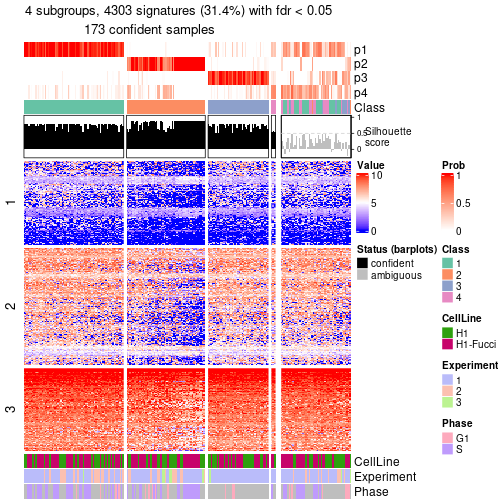</p>

</div>
</div>


Compare the overlap of signatures from different k:

```r
compare_signatures(res)
```


`get_signature()` returns a data frame invisibly. To get the list of signatures, the function
call should be assigned to a variable explicitly. In following code, if `plot` argument is set
to `FALSE`, no heatmap is plotted while only the differential analysis is performed.

```r
# code only for demonstration
tb = get_signature(res, k = ..., plot = FALSE)
```

An example of the output of `tb` is:

```
#>   which_row         fdr    mean_1    mean_2 scaled_mean_1 scaled_mean_2 km
#> 1        38 0.042760348  8.373488  9.131774    -0.5533452     0.5164555  1
#> 2        40 0.018707592  7.106213  8.469186    -0.6173731     0.5762149  1
#> 3        55 0.019134737 10.221463 11.207825    -0.6159697     0.5749050  1
#> 4        59 0.006059896  5.921854  7.869574    -0.6899429     0.6439467  1
#> 5        60 0.018055526  8.928898 10.211722    -0.6204761     0.5791110  1
#> 6        98 0.009384629 15.714769 14.887706     0.6635654    -0.6193277  2
...
```

The columns in `tb` are:

1. `which_row`: row indices corresponding to the input matrix.
2. `fdr`: FDR for the differential test. 
3. `mean_x`: The mean value in group x.
4. `scaled_mean_x`: The mean value in group x after rows are scaled.
5. `km`: Row groups if k-means clustering is applied to rows (which is done by automatically selecting number of clusters).

If there are too many signatures, `top_signatures = ...` can be set to only show the 
signatures with the highest FDRs:

```r
# code only for demonstration
# e.g. to show the top 500 most significant rows
tb = get_signature(res, k = ..., top_signatures = 500)
```

If the signatures are defined as these which are uniquely high in current group, `diff_method` argument
can be set to `"uniquely_high_in_one_group"`:

```r
# code only for demonstration
tb = get_signature(res, k = ..., diff_method = "uniquely_high_in_one_group")
```


UMAP plot which shows how samples are separated.


<script>
$( function() {
	$( '#tabs-node-01-dimension-reduction' ).tabs();
} );
</script>
<div id='tabs-node-01-dimension-reduction'>
<ul>
<li><a href='#tab-node-01-dimension-reduction-1'>k = 2</a></li>
<li><a href='#tab-node-01-dimension-reduction-2'>k = 3</a></li>
<li><a href='#tab-node-01-dimension-reduction-3'>k = 4</a></li>
</ul>
<div id='tab-node-01-dimension-reduction-1'>
<pre><code class="r">dimension_reduction(res, k = 2, method = &quot;UMAP&quot;)
</code></pre>

<p></p>

</div>
<div id='tab-node-01-dimension-reduction-2'>
<pre><code class="r">dimension_reduction(res, k = 3, method = &quot;UMAP&quot;)
</code></pre>

<p></p>

</div>
<div id='tab-node-01-dimension-reduction-3'>
<pre><code class="r">dimension_reduction(res, k = 4, method = &quot;UMAP&quot;)
</code></pre>

<p></p>

</div>
</div>


Following heatmap shows how subgroups are split when increasing `k`:

```r
collect_classes(res)
```


Test correlation between subgroups and known annotations. If the known
annotation is numeric, one-way ANOVA test is applied, and if the known
annotation is discrete, chi-squared contingency table test is applied.

```r
test_to_known_factors(res)
```

```
#>             n_sample CellLine(p-value) Experiment(p-value) Phase(p-value) k
#> ATC:skmeans      220             0.452            0.084735       3.02e-01 2
#> ATC:skmeans      209             0.534            0.000656       4.31e-07 3
#> ATC:skmeans      173             0.708            0.002570       1.96e-03 4
```


If matrix rows can be associated to genes, consider to use `functional_enrichment(res,
...)` to perform function enrichment for the signature genes. See [this vignette](https://jokergoo.github.io/cola_vignettes/functional_enrichment.html) for more detailed explanations.


 

---------------------------------------------------


### Node011


Parent node: [Node01](#Node01).
Child nodes: 
                [Node0111](#Node0111)
        ,
                [Node0112](#Node0112)
        ,
                Node0121-leaf
        ,
                Node0122-leaf
        ,
                Node0221-leaf
        ,
                Node0222-leaf
        ,
                Node0231-leaf
        ,
                Node0232-leaf
        .


The object with results only for a single top-value method and a single partitioning method 
can be extracted as:

```r
res = res_rh["011"]
```

A summary of `res` and all the functions that can be applied to it:

```r
res
```

```
#> A 'ConsensusPartition' object with k = 2, 3, 4.
#>   On a matrix with 13002 rows and 149 columns.
#>   Top rows (1196) are extracted by 'ATC' method.
#>   Subgroups are detected by 'skmeans' method.
#>   Performed in total 150 partitions by row resampling.
#>   Best k for subgroups seems to be 3.
#> 
#> Following methods can be applied to this 'ConsensusPartition' object:
#>  [1] "cola_report"             "collect_classes"         "collect_plots"          
#>  [4] "collect_stats"           "colnames"                "compare_partitions"     
#>  [7] "compare_signatures"      "consensus_heatmap"       "dimension_reduction"    
#> [10] "functional_enrichment"   "get_anno_col"            "get_anno"               
#> [13] "get_classes"             "get_consensus"           "get_matrix"             
#> [16] "get_membership"          "get_param"               "get_signatures"         
#> [19] "get_stats"               "is_best_k"               "is_stable_k"            
#> [22] "membership_heatmap"      "ncol"                    "nrow"                   
#> [25] "plot_ecdf"               "predict_classes"         "rownames"               
#> [28] "select_partition_number" "show"                    "suggest_best_k"         
#> [31] "test_to_known_factors"   "top_rows_heatmap"
```

`collect_plots()` function collects all the plots made from `res` for all `k` (number of subgroups)
into one single page to provide an easy and fast comparison between different `k`.

```r
collect_plots(res)
```


The plots are:

- The first row: a plot of the eCDF (empirical cumulative distribution
  function) curves of the consensus matrix for each `k` and the heatmap of
  predicted classes for each `k`.
- The second row: heatmaps of the consensus matrix for each `k`.
- The third row: heatmaps of the membership matrix for each `k`.
- The fouth row: heatmaps of the signatures for each `k`.

All the plots in panels can be made by individual functions and they are
plotted later in this section.

`select_partition_number()` produces several plots showing different
statistics for choosing "optimized" `k`. There are following statistics:

- eCDF curves of the consensus matrix for each `k`;
- 1-PAC. [The PAC score](https://en.wikipedia.org/wiki/Consensus_clustering#Over-interpretation_potential_of_consensus_clustering)
  measures the proportion of the ambiguous subgrouping.
- Mean silhouette score.
- Concordance. The mean probability of fiting the consensus subgroup labels in all
  partitions.
- Area increased. Denote $A_k$ as the area under the eCDF curve for current
  `k`, the area increased is defined as $A_k - A_{k-1}$.
- Rand index. The percent of pairs of samples that are both in a same cluster
  or both are not in a same cluster in the partition of k and k-1.
- Jaccard index. The ratio of pairs of samples are both in a same cluster in
  the partition of k and k-1 and the pairs of samples are both in a same
  cluster in the partition k or k-1.

The detailed explanations of these statistics can be found in [the _cola_
vignette](https://jokergoo.github.io/cola_vignettes/cola.html#toc_13).

Generally speaking, higher 1-PAC score, higher mean silhouette score or higher
concordance corresponds to better partition. Rand index and Jaccard index
measure how similar the current partition is compared to partition with `k-1`.
If they are too similar, we won't accept `k` is better than `k-1`.

```r
select_partition_number(res)
```


The numeric values for all these statistics can be obtained by `get_stats()`.

```r
get_stats(res)
```

```
#>   k 1-PAC mean_silhouette concordance area_increased  Rand Jaccard
#> 2 2 0.986           0.965       0.985          0.500 0.502   0.502
#> 3 3 0.934           0.937       0.972          0.341 0.733   0.514
#> 4 4 0.650           0.591       0.797          0.117 0.819   0.527
```

`suggest_best_k()` suggests the best $k$ based on these statistics. The rules are as follows:

- All $k$ with Jaccard index larger than 0.95 are removed because increasing
  $k$ does not provide enough extra information. If all $k$ are removed, it is
  marked as no subgroup is detected.
- For all $k$ with 1-PAC score larger than 0.9, the maximal $k$ is taken as
  the best $k$, and other $k$ are marked as optional $k$.
- If it does not fit the second rule. The $k$ with the maximal vote of the
  highest 1-PAC score, highest mean silhouette, and highest concordance is
  taken as the best $k$.

```r
suggest_best_k(res)
```

```
#> [1] 3
#> attr(,"optional")
#> [1] 2
```

There is also optional best $k$ = 2 that is worth to check.

Following is the table of the partitions (You need to click the **show/hide
code output** link to see it). The membership matrix (columns with name `p*`)
is inferred by
[`clue::cl_consensus()`](https://www.rdocumentation.org/link/cl_consensus?package=clue)
function with the `SE` method. Basically the value in the membership matrix
represents the probability to belong to a certain group. The finall subgroup
label for an item is determined with the group with highest probability it
belongs to.

In `get_classes()` function, the entropy is calculated from the membership
matrix and the silhouette score is calculated from the consensus matrix.


<script>
$( function() {
	$( '#tabs-node-011-get-classes' ).tabs();
} );
</script>
<div id='tabs-node-011-get-classes'>
<ul>
<li><a href='#tab-node-011-get-classes-1'>k = 2</a></li>
<li><a href='#tab-node-011-get-classes-2'>k = 3</a></li>
<li><a href='#tab-node-011-get-classes-3'>k = 4</a></li>
</ul>

<div id='tab-node-011-get-classes-1'>
<p><a id='tab-node-011-get-classes-1-a' style='color:#0366d6' href='#'>show/hide code output</a></p>
<pre><code class="r">cbind(get_classes(res, k = 2), get_membership(res, k = 2))
</code></pre>

<pre><code>#&gt;             class entropy silhouette   p1   p2
#&gt; H1_Exp1.002     1   0.000      0.981 1.00 0.00
#&gt; H1_Exp1.003     2   0.000      0.989 0.00 1.00
#&gt; H1_Exp1.004     1   0.000      0.981 1.00 0.00
#&gt; H1_Exp1.006     1   0.000      0.981 1.00 0.00
#&gt; H1_Exp1.007     2   0.469      0.888 0.10 0.90
#&gt; H1_Exp1.010     2   0.327      0.932 0.06 0.94
#&gt; H1_Exp1.011     1   0.000      0.981 1.00 0.00
#&gt; H1_Exp1.012     1   0.904      0.539 0.68 0.32
#&gt; H1_Exp1.014     1   0.000      0.981 1.00 0.00
#&gt; H1_Exp1.015     2   0.000      0.989 0.00 1.00
#&gt; H1_Exp1.016     2   0.000      0.989 0.00 1.00
#&gt; H1_Exp1.017     2   0.000      0.989 0.00 1.00
#&gt; H1_Exp1.018     2   0.000      0.989 0.00 1.00
#&gt; H1_Exp1.020     2   0.000      0.989 0.00 1.00
#&gt; H1_Exp1.022     2   0.000      0.989 0.00 1.00
#&gt; H1_Exp1.023     2   0.000      0.989 0.00 1.00
#&gt; H1_Exp1.024     2   0.000      0.989 0.00 1.00
#&gt; H1_Exp1.025     2   0.000      0.989 0.00 1.00
#&gt; H1_Exp1.026     2   0.000      0.989 0.00 1.00
#&gt; H1_Exp1.029     2   0.000      0.989 0.00 1.00
#&gt; H1_Exp1.035     2   0.000      0.989 0.00 1.00
#&gt; H1_Exp1.038     2   0.000      0.989 0.00 1.00
#&gt; H1_Exp1.039     2   0.000      0.989 0.00 1.00
#&gt; H1_Exp1.040     2   0.000      0.989 0.00 1.00
#&gt; H1_Exp1.041     2   0.000      0.989 0.00 1.00
#&gt; H1_Exp1.049     2   0.000      0.989 0.00 1.00
#&gt; H1_Exp1.051     2   0.000      0.989 0.00 1.00
#&gt; H1_Exp1.053     2   0.000      0.989 0.00 1.00
#&gt; H1_Exp1.061     2   0.000      0.989 0.00 1.00
#&gt; H1_Exp1.062     2   0.000      0.989 0.00 1.00
#&gt; H1_Exp1.063     2   0.000      0.989 0.00 1.00
#&gt; H1_Exp1.064     2   0.000      0.989 0.00 1.00
#&gt; H1_Exp1.066     2   0.000      0.989 0.00 1.00
#&gt; H1_Exp1.070     2   0.000      0.989 0.00 1.00
#&gt; H1_Exp2.073     1   0.000      0.981 1.00 0.00
#&gt; H1_Exp2.074     1   0.000      0.981 1.00 0.00
#&gt; H1_Exp2.075     1   0.000      0.981 1.00 0.00
#&gt; H1_Exp2.079     1   0.000      0.981 1.00 0.00
#&gt; H1_Exp2.081     1   0.000      0.981 1.00 0.00
#&gt; H1_Exp2.083     1   0.000      0.981 1.00 0.00
#&gt; H1_Exp2.084     1   0.000      0.981 1.00 0.00
#&gt; H1_Exp2.085     1   0.000      0.981 1.00 0.00
#&gt; H1_Exp2.087     1   0.000      0.981 1.00 0.00
#&gt; H1_Exp2.088     1   0.000      0.981 1.00 0.00
#&gt; H1_Exp2.089     1   0.000      0.981 1.00 0.00
#&gt; H1_Exp2.091     1   0.000      0.981 1.00 0.00
#&gt; H1_Exp2.092     1   0.000      0.981 1.00 0.00
#&gt; H1_Exp2.094     1   0.000      0.981 1.00 0.00
#&gt; H1_Exp2.096     2   0.722      0.752 0.20 0.80
#&gt; H1_Exp2.097     2   0.855      0.608 0.28 0.72
#&gt; H1_Exp2.098     1   0.000      0.981 1.00 0.00
#&gt; H1_Exp2.100     1   0.634      0.811 0.84 0.16
#&gt; H1_Exp2.101     1   0.141      0.963 0.98 0.02
#&gt; H1_Exp2.105     1   0.000      0.981 1.00 0.00
#&gt; H1_Exp2.106     2   0.000      0.989 0.00 1.00
#&gt; H1_Exp2.108     1   0.000      0.981 1.00 0.00
#&gt; H1_Exp2.118     2   0.000      0.989 0.00 1.00
#&gt; H1_Exp2.121     2   0.000      0.989 0.00 1.00
#&gt; H1_Exp2.127     2   0.000      0.989 0.00 1.00
#&gt; H1_Exp2.136     1   0.990      0.221 0.56 0.44
#&gt; H1_Exp2.138     1   0.000      0.981 1.00 0.00
#&gt; H1_Exp2.144     1   0.141      0.963 0.98 0.02
#&gt; H1_Exp2.148     2   0.000      0.989 0.00 1.00
#&gt; H1_Exp2.152     1   0.795      0.688 0.76 0.24
#&gt; H1_Exp3.223     2   0.000      0.989 0.00 1.00
#&gt; H1_Exp3.232     2   0.000      0.989 0.00 1.00
#&gt; H1_Exp3.241     2   0.000      0.989 0.00 1.00
#&gt; G2_Exp1.069     2   0.000      0.989 0.00 1.00
#&gt; G2_Exp1.076     2   0.000      0.989 0.00 1.00
#&gt; G2_Exp1.013     1   0.000      0.981 1.00 0.00
#&gt; G2_Exp1.015     1   0.722      0.753 0.80 0.20
#&gt; G2_Exp1.019     2   0.000      0.989 0.00 1.00
#&gt; G2_Exp1.030     2   0.000      0.989 0.00 1.00
#&gt; G2_Exp1.017     1   0.000      0.981 1.00 0.00
#&gt; G2_Exp1.047     2   0.000      0.989 0.00 1.00
#&gt; G2_Exp1.032     2   0.000      0.989 0.00 1.00
#&gt; G2_Exp1.064     2   0.000      0.989 0.00 1.00
#&gt; G2_Exp1.045     2   0.000      0.989 0.00 1.00
#&gt; G2_Exp1.038     2   0.000      0.989 0.00 1.00
#&gt; G2_Exp1.001     1   0.000      0.981 1.00 0.00
#&gt; G2_Exp1.049     2   0.000      0.989 0.00 1.00
#&gt; G2_Exp1.031     2   0.327      0.932 0.06 0.94
#&gt; G2_Exp1.036     2   0.000      0.989 0.00 1.00
#&gt; G2_Exp1.046     2   0.000      0.989 0.00 1.00
#&gt; G2_Exp1.040     2   0.000      0.989 0.00 1.00
#&gt; G2_Exp1.068     2   0.000      0.989 0.00 1.00
#&gt; G2_Exp1.077     2   0.000      0.989 0.00 1.00
#&gt; G2_Exp1.014     1   0.000      0.981 1.00 0.00
#&gt; G2_Exp1.005     2   0.000      0.989 0.00 1.00
#&gt; G2_Exp1.056     2   0.000      0.989 0.00 1.00
#&gt; G2_Exp1.041     2   0.000      0.989 0.00 1.00
#&gt; G2_Exp1.012     1   0.000      0.981 1.00 0.00
#&gt; G2_Exp1.003     1   0.000      0.981 1.00 0.00
#&gt; S_Exp1.031      1   0.000      0.981 1.00 0.00
#&gt; S_Exp1.056      1   0.000      0.981 1.00 0.00
#&gt; S_Exp1.011      1   0.000      0.981 1.00 0.00
#&gt; S_Exp1.016      1   0.000      0.981 1.00 0.00
#&gt; S_Exp1.038      1   0.000      0.981 1.00 0.00
#&gt; S_Exp1.048      1   0.000      0.981 1.00 0.00
#&gt; S_Exp1.051      1   0.000      0.981 1.00 0.00
#&gt; S_Exp1.022      1   0.000      0.981 1.00 0.00
#&gt; S_Exp1.001      1   0.000      0.981 1.00 0.00
#&gt; S_Exp1.061      1   0.000      0.981 1.00 0.00
#&gt; S_Exp1.080      1   0.000      0.981 1.00 0.00
#&gt; S_Exp1.069      1   0.000      0.981 1.00 0.00
#&gt; S_Exp1.019      1   0.000      0.981 1.00 0.00
#&gt; S_Exp1.003      1   0.000      0.981 1.00 0.00
#&gt; S_Exp1.029      1   0.584      0.837 0.86 0.14
#&gt; S_Exp1.025      1   0.000      0.981 1.00 0.00
#&gt; S_Exp1.041      1   0.000      0.981 1.00 0.00
#&gt; S_Exp1.057      1   0.000      0.981 1.00 0.00
#&gt; S_Exp1.055      1   0.000      0.981 1.00 0.00
#&gt; S_Exp1.033      1   0.000      0.981 1.00 0.00
#&gt; S_Exp1.081      1   0.000      0.981 1.00 0.00
#&gt; S_Exp1.004      1   0.000      0.981 1.00 0.00
#&gt; S_Exp1.045      1   0.000      0.981 1.00 0.00
#&gt; S_Exp1.018      1   0.000      0.981 1.00 0.00
#&gt; S_Exp1.034      1   0.000      0.981 1.00 0.00
#&gt; S_Exp1.067      1   0.000      0.981 1.00 0.00
#&gt; S_Exp1.037      1   0.000      0.981 1.00 0.00
#&gt; S_Exp1.053      1   0.000      0.981 1.00 0.00
#&gt; S_Exp1.036      1   0.000      0.981 1.00 0.00
#&gt; S_Exp1.021      1   0.000      0.981 1.00 0.00
#&gt; S_Exp1.060      1   0.000      0.981 1.00 0.00
#&gt; S_Exp1.062      1   0.000      0.981 1.00 0.00
#&gt; S_Exp1.028      1   0.000      0.981 1.00 0.00
#&gt; S_Exp1.079      1   0.000      0.981 1.00 0.00
#&gt; S_Exp1.047      1   0.000      0.981 1.00 0.00
#&gt; S_Exp1.077      1   0.000      0.981 1.00 0.00
#&gt; S_Exp1.052      1   0.000      0.981 1.00 0.00
#&gt; S_Exp1.007      1   0.000      0.981 1.00 0.00
#&gt; S_Exp1.027      1   0.000      0.981 1.00 0.00
#&gt; S_Exp1.075      1   0.000      0.981 1.00 0.00
#&gt; S_Exp1.049      1   0.000      0.981 1.00 0.00
#&gt; S_Exp1.072      1   0.000      0.981 1.00 0.00
#&gt; S_Exp1.005      1   0.000      0.981 1.00 0.00
#&gt; S_Exp1.058      1   0.000      0.981 1.00 0.00
#&gt; S_Exp1.043      1   0.000      0.981 1.00 0.00
#&gt; S_Exp1.050      1   0.000      0.981 1.00 0.00
#&gt; G1_Exp1.033     2   0.000      0.989 0.00 1.00
#&gt; G1_Exp1.013     2   0.141      0.971 0.02 0.98
#&gt; G1_Exp1.026     2   0.000      0.989 0.00 1.00
#&gt; G1_Exp1.027     2   0.000      0.989 0.00 1.00
#&gt; G1_Exp1.019     2   0.000      0.989 0.00 1.00
#&gt; G1_Exp1.073     2   0.000      0.989 0.00 1.00
#&gt; G1_Exp1.023     2   0.000      0.989 0.00 1.00
#&gt; G1_Exp1.022     2   0.000      0.989 0.00 1.00
#&gt; G1_Exp1.039     2   0.000      0.989 0.00 1.00
#&gt; G1_Exp1.018     2   0.000      0.989 0.00 1.00
</code></pre>

<script>
$('#tab-node-011-get-classes-1-a').parent().next().next().hide();
$('#tab-node-011-get-classes-1-a').click(function(){
  $('#tab-node-011-get-classes-1-a').parent().next().next().toggle();
  return(false);
});
</script>
</div>

<div id='tab-node-011-get-classes-2'>
<p><a id='tab-node-011-get-classes-2-a' style='color:#0366d6' href='#'>show/hide code output</a></p>
<pre><code class="r">cbind(get_classes(res, k = 3), get_membership(res, k = 3))
</code></pre>

<pre><code>#&gt;             class entropy silhouette   p1   p2   p3
#&gt; H1_Exp1.002     1  0.0000      0.976 1.00 0.00 0.00
#&gt; H1_Exp1.003     2  0.5706      0.546 0.32 0.68 0.00
#&gt; H1_Exp1.004     3  0.0000      0.961 0.00 0.00 1.00
#&gt; H1_Exp1.006     1  0.0000      0.976 1.00 0.00 0.00
#&gt; H1_Exp1.007     3  0.0000      0.961 0.00 0.00 1.00
#&gt; H1_Exp1.010     3  0.0000      0.961 0.00 0.00 1.00
#&gt; H1_Exp1.011     1  0.0000      0.976 1.00 0.00 0.00
#&gt; H1_Exp1.012     1  0.0000      0.976 1.00 0.00 0.00
#&gt; H1_Exp1.014     3  0.1529      0.931 0.04 0.00 0.96
#&gt; H1_Exp1.015     2  0.0000      0.973 0.00 1.00 0.00
#&gt; H1_Exp1.016     2  0.0000      0.973 0.00 1.00 0.00
#&gt; H1_Exp1.017     3  0.1529      0.928 0.00 0.04 0.96
#&gt; H1_Exp1.018     2  0.0000      0.973 0.00 1.00 0.00
#&gt; H1_Exp1.020     2  0.0000      0.973 0.00 1.00 0.00
#&gt; H1_Exp1.022     2  0.2959      0.884 0.10 0.90 0.00
#&gt; H1_Exp1.023     2  0.0000      0.973 0.00 1.00 0.00
#&gt; H1_Exp1.024     2  0.0000      0.973 0.00 1.00 0.00
#&gt; H1_Exp1.025     2  0.4291      0.786 0.18 0.82 0.00
#&gt; H1_Exp1.026     1  0.1529      0.942 0.96 0.04 0.00
#&gt; H1_Exp1.029     2  0.0000      0.973 0.00 1.00 0.00
#&gt; H1_Exp1.035     2  0.0000      0.973 0.00 1.00 0.00
#&gt; H1_Exp1.038     2  0.0000      0.973 0.00 1.00 0.00
#&gt; H1_Exp1.039     2  0.0000      0.973 0.00 1.00 0.00
#&gt; H1_Exp1.040     2  0.0000      0.973 0.00 1.00 0.00
#&gt; H1_Exp1.041     2  0.0000      0.973 0.00 1.00 0.00
#&gt; H1_Exp1.049     2  0.0000      0.973 0.00 1.00 0.00
#&gt; H1_Exp1.051     2  0.0000      0.973 0.00 1.00 0.00
#&gt; H1_Exp1.053     2  0.0000      0.973 0.00 1.00 0.00
#&gt; H1_Exp1.061     2  0.0000      0.973 0.00 1.00 0.00
#&gt; H1_Exp1.062     2  0.0000      0.973 0.00 1.00 0.00
#&gt; H1_Exp1.063     2  0.0000      0.973 0.00 1.00 0.00
#&gt; H1_Exp1.064     2  0.0000      0.973 0.00 1.00 0.00
#&gt; H1_Exp1.066     2  0.0000      0.973 0.00 1.00 0.00
#&gt; H1_Exp1.070     2  0.0000      0.973 0.00 1.00 0.00
#&gt; H1_Exp2.073     3  0.0000      0.961 0.00 0.00 1.00
#&gt; H1_Exp2.074     1  0.0000      0.976 1.00 0.00 0.00
#&gt; H1_Exp2.075     1  0.0000      0.976 1.00 0.00 0.00
#&gt; H1_Exp2.079     1  0.0000      0.976 1.00 0.00 0.00
#&gt; H1_Exp2.081     1  0.0000      0.976 1.00 0.00 0.00
#&gt; H1_Exp2.083     1  0.0000      0.976 1.00 0.00 0.00
#&gt; H1_Exp2.084     3  0.0000      0.961 0.00 0.00 1.00
#&gt; H1_Exp2.085     1  0.0000      0.976 1.00 0.00 0.00
#&gt; H1_Exp2.087     1  0.0000      0.976 1.00 0.00 0.00
#&gt; H1_Exp2.088     3  0.5948      0.455 0.36 0.00 0.64
#&gt; H1_Exp2.089     1  0.0000      0.976 1.00 0.00 0.00
#&gt; H1_Exp2.091     1  0.0000      0.976 1.00 0.00 0.00
#&gt; H1_Exp2.092     1  0.0000      0.976 1.00 0.00 0.00
#&gt; H1_Exp2.094     1  0.0000      0.976 1.00 0.00 0.00
#&gt; H1_Exp2.096     1  0.0000      0.976 1.00 0.00 0.00
#&gt; H1_Exp2.097     1  0.0000      0.976 1.00 0.00 0.00
#&gt; H1_Exp2.098     1  0.0000      0.976 1.00 0.00 0.00
#&gt; H1_Exp2.100     1  0.0000      0.976 1.00 0.00 0.00
#&gt; H1_Exp2.101     1  0.0000      0.976 1.00 0.00 0.00
#&gt; H1_Exp2.105     1  0.0000      0.976 1.00 0.00 0.00
#&gt; H1_Exp2.106     2  0.1529      0.942 0.04 0.96 0.00
#&gt; H1_Exp2.108     3  0.0000      0.961 0.00 0.00 1.00
#&gt; H1_Exp2.118     2  0.0000      0.973 0.00 1.00 0.00
#&gt; H1_Exp2.121     2  0.0000      0.973 0.00 1.00 0.00
#&gt; H1_Exp2.127     2  0.0000      0.973 0.00 1.00 0.00
#&gt; H1_Exp2.136     1  0.2959      0.880 0.90 0.10 0.00
#&gt; H1_Exp2.138     1  0.0000      0.976 1.00 0.00 0.00
#&gt; H1_Exp2.144     1  0.0000      0.976 1.00 0.00 0.00
#&gt; H1_Exp2.148     3  0.0000      0.961 0.00 0.00 1.00
#&gt; H1_Exp2.152     3  0.0000      0.961 0.00 0.00 1.00
#&gt; H1_Exp3.223     2  0.5706      0.535 0.00 0.68 0.32
#&gt; H1_Exp3.232     2  0.0000      0.973 0.00 1.00 0.00
#&gt; H1_Exp3.241     2  0.0000      0.973 0.00 1.00 0.00
#&gt; G2_Exp1.069     2  0.0000      0.973 0.00 1.00 0.00
#&gt; G2_Exp1.076     2  0.0000      0.973 0.00 1.00 0.00
#&gt; G2_Exp1.013     1  0.0000      0.976 1.00 0.00 0.00
#&gt; G2_Exp1.015     3  0.0000      0.961 0.00 0.00 1.00
#&gt; G2_Exp1.019     3  0.0000      0.961 0.00 0.00 1.00
#&gt; G2_Exp1.030     2  0.2537      0.901 0.00 0.92 0.08
#&gt; G2_Exp1.017     1  0.0000      0.976 1.00 0.00 0.00
#&gt; G2_Exp1.047     2  0.0000      0.973 0.00 1.00 0.00
#&gt; G2_Exp1.032     2  0.0000      0.973 0.00 1.00 0.00
#&gt; G2_Exp1.064     2  0.0000      0.973 0.00 1.00 0.00
#&gt; G2_Exp1.045     2  0.0000      0.973 0.00 1.00 0.00
#&gt; G2_Exp1.038     2  0.0000      0.973 0.00 1.00 0.00
#&gt; G2_Exp1.001     3  0.0000      0.961 0.00 0.00 1.00
#&gt; G2_Exp1.049     2  0.0000      0.973 0.00 1.00 0.00
#&gt; G2_Exp1.031     3  0.0000      0.961 0.00 0.00 1.00
#&gt; G2_Exp1.036     2  0.0000      0.973 0.00 1.00 0.00
#&gt; G2_Exp1.046     2  0.0000      0.973 0.00 1.00 0.00
#&gt; G2_Exp1.040     2  0.0000      0.973 0.00 1.00 0.00
#&gt; G2_Exp1.068     2  0.0000      0.973 0.00 1.00 0.00
#&gt; G2_Exp1.077     2  0.0000      0.973 0.00 1.00 0.00
#&gt; G2_Exp1.014     3  0.0000      0.961 0.00 0.00 1.00
#&gt; G2_Exp1.005     3  0.0000      0.961 0.00 0.00 1.00
#&gt; G2_Exp1.056     2  0.2066      0.925 0.06 0.94 0.00
#&gt; G2_Exp1.041     2  0.0000      0.973 0.00 1.00 0.00
#&gt; G2_Exp1.012     1  0.0000      0.976 1.00 0.00 0.00
#&gt; G2_Exp1.003     3  0.5397      0.623 0.28 0.00 0.72
#&gt; S_Exp1.031      3  0.0000      0.961 0.00 0.00 1.00
#&gt; S_Exp1.056      3  0.0000      0.961 0.00 0.00 1.00
#&gt; S_Exp1.011      3  0.0000      0.961 0.00 0.00 1.00
#&gt; S_Exp1.016      3  0.0000      0.961 0.00 0.00 1.00
#&gt; S_Exp1.038      3  0.0000      0.961 0.00 0.00 1.00
#&gt; S_Exp1.048      1  0.4796      0.713 0.78 0.00 0.22
#&gt; S_Exp1.051      1  0.0000      0.976 1.00 0.00 0.00
#&gt; S_Exp1.022      3  0.0000      0.961 0.00 0.00 1.00
#&gt; S_Exp1.001      3  0.0000      0.961 0.00 0.00 1.00
#&gt; S_Exp1.061      1  0.0000      0.976 1.00 0.00 0.00
#&gt; S_Exp1.080      1  0.0000      0.976 1.00 0.00 0.00
#&gt; S_Exp1.069      3  0.0000      0.961 0.00 0.00 1.00
#&gt; S_Exp1.019      3  0.4002      0.804 0.16 0.00 0.84
#&gt; S_Exp1.003      3  0.0000      0.961 0.00 0.00 1.00
#&gt; S_Exp1.029      1  0.2537      0.902 0.92 0.08 0.00
#&gt; S_Exp1.025      3  0.0000      0.961 0.00 0.00 1.00
#&gt; S_Exp1.041      1  0.0000      0.976 1.00 0.00 0.00
#&gt; S_Exp1.057      1  0.0000      0.976 1.00 0.00 0.00
#&gt; S_Exp1.055      1  0.5397      0.603 0.72 0.00 0.28
#&gt; S_Exp1.033      1  0.0000      0.976 1.00 0.00 0.00
#&gt; S_Exp1.081      3  0.0000      0.961 0.00 0.00 1.00
#&gt; S_Exp1.004      3  0.0000      0.961 0.00 0.00 1.00
#&gt; S_Exp1.045      1  0.0000      0.976 1.00 0.00 0.00
#&gt; S_Exp1.018      3  0.6045      0.403 0.38 0.00 0.62
#&gt; S_Exp1.034      3  0.0000      0.961 0.00 0.00 1.00
#&gt; S_Exp1.067      1  0.0000      0.976 1.00 0.00 0.00
#&gt; S_Exp1.037      1  0.0000      0.976 1.00 0.00 0.00
#&gt; S_Exp1.053      1  0.0000      0.976 1.00 0.00 0.00
#&gt; S_Exp1.036      3  0.0000      0.961 0.00 0.00 1.00
#&gt; S_Exp1.021      1  0.5216      0.637 0.74 0.00 0.26
#&gt; S_Exp1.060      3  0.0892      0.946 0.02 0.00 0.98
#&gt; S_Exp1.062      3  0.2959      0.874 0.10 0.00 0.90
#&gt; S_Exp1.028      1  0.0000      0.976 1.00 0.00 0.00
#&gt; S_Exp1.079      3  0.0000      0.961 0.00 0.00 1.00
#&gt; S_Exp1.047      3  0.0000      0.961 0.00 0.00 1.00
#&gt; S_Exp1.077      1  0.0000      0.976 1.00 0.00 0.00
#&gt; S_Exp1.052      3  0.5216      0.657 0.26 0.00 0.74
#&gt; S_Exp1.007      3  0.0000      0.961 0.00 0.00 1.00
#&gt; S_Exp1.027      3  0.0000      0.961 0.00 0.00 1.00
#&gt; S_Exp1.075      3  0.0000      0.961 0.00 0.00 1.00
#&gt; S_Exp1.049      1  0.0000      0.976 1.00 0.00 0.00
#&gt; S_Exp1.072      1  0.0892      0.959 0.98 0.00 0.02
#&gt; S_Exp1.005      3  0.0000      0.961 0.00 0.00 1.00
#&gt; S_Exp1.058      3  0.0000      0.961 0.00 0.00 1.00
#&gt; S_Exp1.043      3  0.0000      0.961 0.00 0.00 1.00
#&gt; S_Exp1.050      3  0.0000      0.961 0.00 0.00 1.00
#&gt; G1_Exp1.033     2  0.2537      0.906 0.08 0.92 0.00
#&gt; G1_Exp1.013     1  0.1529      0.941 0.96 0.04 0.00
#&gt; G1_Exp1.026     2  0.0000      0.973 0.00 1.00 0.00
#&gt; G1_Exp1.027     2  0.4555      0.749 0.00 0.80 0.20
#&gt; G1_Exp1.019     2  0.0000      0.973 0.00 1.00 0.00
#&gt; G1_Exp1.073     2  0.0000      0.973 0.00 1.00 0.00
#&gt; G1_Exp1.023     2  0.1529      0.943 0.04 0.96 0.00
#&gt; G1_Exp1.022     3  0.2537      0.890 0.00 0.08 0.92
#&gt; G1_Exp1.039     2  0.0000      0.973 0.00 1.00 0.00
#&gt; G1_Exp1.018     1  0.0000      0.976 1.00 0.00 0.00
</code></pre>

<script>
$('#tab-node-011-get-classes-2-a').parent().next().next().hide();
$('#tab-node-011-get-classes-2-a').click(function(){
  $('#tab-node-011-get-classes-2-a').parent().next().next().toggle();
  return(false);
});
</script>
</div>

<div id='tab-node-011-get-classes-3'>
<p><a id='tab-node-011-get-classes-3-a' style='color:#0366d6' href='#'>show/hide code output</a></p>
<pre><code class="r">cbind(get_classes(res, k = 4), get_membership(res, k = 4))
</code></pre>

<pre><code>#&gt;             class entropy silhouette   p1   p2   p3   p4
#&gt; H1_Exp1.002     1  0.0000    0.87191 1.00 0.00 0.00 0.00
#&gt; H1_Exp1.003     2  0.4907    0.25984 0.42 0.58 0.00 0.00
#&gt; H1_Exp1.004     4  0.4790   -0.17337 0.00 0.00 0.38 0.62
#&gt; H1_Exp1.006     1  0.0000    0.87191 1.00 0.00 0.00 0.00
#&gt; H1_Exp1.007     4  0.0000    0.62775 0.00 0.00 0.00 1.00
#&gt; H1_Exp1.010     4  0.0000    0.62775 0.00 0.00 0.00 1.00
#&gt; H1_Exp1.011     1  0.0000    0.87191 1.00 0.00 0.00 0.00
#&gt; H1_Exp1.012     1  0.2345    0.80904 0.90 0.10 0.00 0.00
#&gt; H1_Exp1.014     3  0.6941    0.47856 0.12 0.00 0.52 0.36
#&gt; H1_Exp1.015     2  0.0707    0.80346 0.02 0.98 0.00 0.00
#&gt; H1_Exp1.016     4  0.4134    0.50642 0.00 0.26 0.00 0.74
#&gt; H1_Exp1.017     4  0.0000    0.62775 0.00 0.00 0.00 1.00
#&gt; H1_Exp1.018     2  0.0000    0.81204 0.00 1.00 0.00 0.00
#&gt; H1_Exp1.020     4  0.4406    0.44352 0.00 0.30 0.00 0.70
#&gt; H1_Exp1.022     2  0.4624    0.44808 0.34 0.66 0.00 0.00
#&gt; H1_Exp1.023     2  0.4406    0.54023 0.00 0.70 0.00 0.30
#&gt; H1_Exp1.024     2  0.4907    0.30113 0.00 0.58 0.00 0.42
#&gt; H1_Exp1.025     2  0.3172    0.69541 0.16 0.84 0.00 0.00
#&gt; H1_Exp1.026     1  0.2345    0.80909 0.90 0.10 0.00 0.00
#&gt; H1_Exp1.029     2  0.0707    0.80372 0.02 0.98 0.00 0.00
#&gt; H1_Exp1.035     2  0.4855    0.34986 0.00 0.60 0.00 0.40
#&gt; H1_Exp1.038     4  0.4994   -0.03682 0.00 0.48 0.00 0.52
#&gt; H1_Exp1.039     2  0.0000    0.81204 0.00 1.00 0.00 0.00
#&gt; H1_Exp1.040     2  0.2011    0.77668 0.00 0.92 0.00 0.08
#&gt; H1_Exp1.041     2  0.0000    0.81204 0.00 1.00 0.00 0.00
#&gt; H1_Exp1.049     4  0.4977    0.04379 0.00 0.46 0.00 0.54
#&gt; H1_Exp1.051     2  0.1637    0.78907 0.00 0.94 0.00 0.06
#&gt; H1_Exp1.053     2  0.0000    0.81204 0.00 1.00 0.00 0.00
#&gt; H1_Exp1.061     2  0.4790    0.39328 0.00 0.62 0.00 0.38
#&gt; H1_Exp1.062     2  0.0000    0.81204 0.00 1.00 0.00 0.00
#&gt; H1_Exp1.063     2  0.0000    0.81204 0.00 1.00 0.00 0.00
#&gt; H1_Exp1.064     4  0.4522    0.40835 0.00 0.32 0.00 0.68
#&gt; H1_Exp1.066     2  0.0000    0.81204 0.00 1.00 0.00 0.00
#&gt; H1_Exp1.070     4  0.3801    0.55478 0.00 0.22 0.00 0.78
#&gt; H1_Exp2.073     4  0.4977   -0.36220 0.00 0.00 0.46 0.54
#&gt; H1_Exp2.074     1  0.0000    0.87191 1.00 0.00 0.00 0.00
#&gt; H1_Exp2.075     1  0.0000    0.87191 1.00 0.00 0.00 0.00
#&gt; H1_Exp2.079     1  0.0000    0.87191 1.00 0.00 0.00 0.00
#&gt; H1_Exp2.081     1  0.0000    0.87191 1.00 0.00 0.00 0.00
#&gt; H1_Exp2.083     1  0.0000    0.87191 1.00 0.00 0.00 0.00
#&gt; H1_Exp2.084     3  0.5915    0.52334 0.04 0.00 0.56 0.40
#&gt; H1_Exp2.085     1  0.0707    0.86521 0.98 0.00 0.02 0.00
#&gt; H1_Exp2.087     1  0.0000    0.87191 1.00 0.00 0.00 0.00
#&gt; H1_Exp2.088     1  0.5820    0.55360 0.68 0.00 0.08 0.24
#&gt; H1_Exp2.089     1  0.0000    0.87191 1.00 0.00 0.00 0.00
#&gt; H1_Exp2.091     1  0.0000    0.87191 1.00 0.00 0.00 0.00
#&gt; H1_Exp2.092     1  0.0000    0.87191 1.00 0.00 0.00 0.00
#&gt; H1_Exp2.094     1  0.0000    0.87191 1.00 0.00 0.00 0.00
#&gt; H1_Exp2.096     1  0.1211    0.85250 0.96 0.04 0.00 0.00
#&gt; H1_Exp2.097     1  0.0707    0.86362 0.98 0.02 0.00 0.00
#&gt; H1_Exp2.098     1  0.2611    0.83500 0.92 0.02 0.02 0.04
#&gt; H1_Exp2.100     1  0.0707    0.86362 0.98 0.02 0.00 0.00
#&gt; H1_Exp2.101     1  0.0000    0.87191 1.00 0.00 0.00 0.00
#&gt; H1_Exp2.105     1  0.0000    0.87191 1.00 0.00 0.00 0.00
#&gt; H1_Exp2.106     2  0.3037    0.75623 0.10 0.88 0.00 0.02
#&gt; H1_Exp2.108     4  0.4977   -0.35582 0.00 0.00 0.46 0.54
#&gt; H1_Exp2.118     2  0.4994    0.12022 0.00 0.52 0.00 0.48
#&gt; H1_Exp2.121     4  0.4790    0.27958 0.00 0.38 0.00 0.62
#&gt; H1_Exp2.127     2  0.0000    0.81204 0.00 1.00 0.00 0.00
#&gt; H1_Exp2.136     1  0.7382    0.45687 0.52 0.26 0.22 0.00
#&gt; H1_Exp2.138     1  0.0707    0.86524 0.98 0.00 0.02 0.00
#&gt; H1_Exp2.144     1  0.0000    0.87191 1.00 0.00 0.00 0.00
#&gt; H1_Exp2.148     4  0.0000    0.62775 0.00 0.00 0.00 1.00
#&gt; H1_Exp2.152     4  0.2011    0.53909 0.00 0.00 0.08 0.92
#&gt; H1_Exp3.223     4  0.2011    0.64139 0.00 0.08 0.00 0.92
#&gt; H1_Exp3.232     2  0.6714    0.34305 0.36 0.54 0.00 0.10
#&gt; H1_Exp3.241     2  0.0000    0.81204 0.00 1.00 0.00 0.00
#&gt; G2_Exp1.069     2  0.3610    0.67088 0.00 0.80 0.00 0.20
#&gt; G2_Exp1.076     2  0.4624    0.47094 0.00 0.66 0.00 0.34
#&gt; G2_Exp1.013     1  0.2011    0.82840 0.92 0.00 0.08 0.00
#&gt; G2_Exp1.015     4  0.3975    0.26473 0.00 0.00 0.24 0.76
#&gt; G2_Exp1.019     4  0.0000    0.62775 0.00 0.00 0.00 1.00
#&gt; G2_Exp1.030     4  0.4134    0.50774 0.00 0.26 0.00 0.74
#&gt; G2_Exp1.017     1  0.0000    0.87191 1.00 0.00 0.00 0.00
#&gt; G2_Exp1.047     2  0.0000    0.81204 0.00 1.00 0.00 0.00
#&gt; G2_Exp1.032     2  0.4977    0.18608 0.00 0.54 0.00 0.46
#&gt; G2_Exp1.064     2  0.2011    0.77779 0.00 0.92 0.00 0.08
#&gt; G2_Exp1.045     2  0.2921    0.73156 0.00 0.86 0.00 0.14
#&gt; G2_Exp1.038     2  0.0000    0.81204 0.00 1.00 0.00 0.00
#&gt; G2_Exp1.001     3  0.4948    0.50411 0.00 0.00 0.56 0.44
#&gt; G2_Exp1.049     2  0.0000    0.81204 0.00 1.00 0.00 0.00
#&gt; G2_Exp1.031     4  0.1211    0.59857 0.00 0.00 0.04 0.96
#&gt; G2_Exp1.036     2  0.2345    0.76393 0.00 0.90 0.00 0.10
#&gt; G2_Exp1.046     2  0.1637    0.78816 0.00 0.94 0.00 0.06
#&gt; G2_Exp1.040     2  0.4406    0.53841 0.00 0.70 0.00 0.30
#&gt; G2_Exp1.068     4  0.4790    0.29116 0.00 0.38 0.00 0.62
#&gt; G2_Exp1.077     2  0.0000    0.81204 0.00 1.00 0.00 0.00
#&gt; G2_Exp1.014     3  0.5355    0.53316 0.02 0.00 0.62 0.36
#&gt; G2_Exp1.005     4  0.0000    0.62775 0.00 0.00 0.00 1.00
#&gt; G2_Exp1.056     2  0.0707    0.80287 0.00 0.98 0.02 0.00
#&gt; G2_Exp1.041     2  0.0000    0.81204 0.00 1.00 0.00 0.00
#&gt; G2_Exp1.012     1  0.0707    0.86531 0.98 0.00 0.02 0.00
#&gt; G2_Exp1.003     1  0.7544    0.10735 0.46 0.00 0.20 0.34
#&gt; S_Exp1.031      3  0.4855    0.54840 0.00 0.00 0.60 0.40
#&gt; S_Exp1.056      3  0.3975    0.64248 0.00 0.00 0.76 0.24
#&gt; S_Exp1.011      3  0.3610    0.64750 0.00 0.00 0.80 0.20
#&gt; S_Exp1.016      3  0.4855    0.54840 0.00 0.00 0.60 0.40
#&gt; S_Exp1.038      3  0.4994    0.43628 0.00 0.00 0.52 0.48
#&gt; S_Exp1.048      3  0.2011    0.58904 0.08 0.00 0.92 0.00
#&gt; S_Exp1.051      1  0.4790    0.52124 0.62 0.00 0.38 0.00
#&gt; S_Exp1.022      3  0.3801    0.64636 0.00 0.00 0.78 0.22
#&gt; S_Exp1.001      3  0.4855    0.54840 0.00 0.00 0.60 0.40
#&gt; S_Exp1.061      1  0.3975    0.69000 0.76 0.00 0.24 0.00
#&gt; S_Exp1.080      3  0.4277    0.31316 0.28 0.00 0.72 0.00
#&gt; S_Exp1.069      3  0.4855    0.54840 0.00 0.00 0.60 0.40
#&gt; S_Exp1.019      3  0.0707    0.62885 0.00 0.00 0.98 0.02
#&gt; S_Exp1.003      3  0.4907    0.52795 0.00 0.00 0.58 0.42
#&gt; S_Exp1.029      2  0.5987    0.24046 0.04 0.52 0.44 0.00
#&gt; S_Exp1.025      3  0.3801    0.64698 0.00 0.00 0.78 0.22
#&gt; S_Exp1.041      3  0.6005   -0.26200 0.46 0.04 0.50 0.00
#&gt; S_Exp1.057      3  0.4855   -0.00863 0.40 0.00 0.60 0.00
#&gt; S_Exp1.055      3  0.2011    0.58763 0.08 0.00 0.92 0.00
#&gt; S_Exp1.033      1  0.5987    0.37370 0.52 0.04 0.44 0.00
#&gt; S_Exp1.081      3  0.3975    0.64293 0.00 0.00 0.76 0.24
#&gt; S_Exp1.004      3  0.4855    0.54840 0.00 0.00 0.60 0.40
#&gt; S_Exp1.045      3  0.4790    0.05779 0.38 0.00 0.62 0.00
#&gt; S_Exp1.018      3  0.0000    0.62360 0.00 0.00 1.00 0.00
#&gt; S_Exp1.034      4  0.5000   -0.43303 0.00 0.00 0.50 0.50
#&gt; S_Exp1.067      1  0.4907    0.45561 0.58 0.00 0.42 0.00
#&gt; S_Exp1.037      1  0.2921    0.78607 0.86 0.00 0.14 0.00
#&gt; S_Exp1.053      3  0.4713    0.12364 0.36 0.00 0.64 0.00
#&gt; S_Exp1.036      3  0.0707    0.62885 0.00 0.00 0.98 0.02
#&gt; S_Exp1.021      3  0.1211    0.61031 0.04 0.00 0.96 0.00
#&gt; S_Exp1.060      3  0.0000    0.62360 0.00 0.00 1.00 0.00
#&gt; S_Exp1.062      3  0.0000    0.62360 0.00 0.00 1.00 0.00
#&gt; S_Exp1.028      1  0.4855    0.48887 0.60 0.00 0.40 0.00
#&gt; S_Exp1.079      3  0.4948    0.49936 0.00 0.00 0.56 0.44
#&gt; S_Exp1.047      3  0.3975    0.64021 0.00 0.00 0.76 0.24
#&gt; S_Exp1.077      3  0.4790    0.05876 0.38 0.00 0.62 0.00
#&gt; S_Exp1.052      3  0.0707    0.61664 0.02 0.00 0.98 0.00
#&gt; S_Exp1.007      3  0.4277    0.62740 0.00 0.00 0.72 0.28
#&gt; S_Exp1.027      3  0.4977    0.46774 0.00 0.00 0.54 0.46
#&gt; S_Exp1.075      3  0.3801    0.64711 0.00 0.00 0.78 0.22
#&gt; S_Exp1.049      1  0.4790    0.52124 0.62 0.00 0.38 0.00
#&gt; S_Exp1.072      3  0.3610    0.46760 0.20 0.00 0.80 0.00
#&gt; S_Exp1.005      3  0.4406    0.61748 0.00 0.00 0.70 0.30
#&gt; S_Exp1.058      3  0.4907    0.52731 0.00 0.00 0.58 0.42
#&gt; S_Exp1.043      3  0.0000    0.62360 0.00 0.00 1.00 0.00
#&gt; S_Exp1.050      3  0.4994    0.43628 0.00 0.00 0.52 0.48
#&gt; G1_Exp1.033     2  0.3610    0.65814 0.20 0.80 0.00 0.00
#&gt; G1_Exp1.013     1  0.3400    0.72101 0.82 0.18 0.00 0.00
#&gt; G1_Exp1.026     2  0.0000    0.81204 0.00 1.00 0.00 0.00
#&gt; G1_Exp1.027     4  0.2921    0.62814 0.00 0.14 0.00 0.86
#&gt; G1_Exp1.019     2  0.1637    0.77953 0.06 0.94 0.00 0.00
#&gt; G1_Exp1.073     2  0.0000    0.81204 0.00 1.00 0.00 0.00
#&gt; G1_Exp1.023     2  0.4797    0.57660 0.26 0.72 0.00 0.02
#&gt; G1_Exp1.022     4  0.1411    0.62629 0.00 0.02 0.02 0.96
#&gt; G1_Exp1.039     2  0.0000    0.81204 0.00 1.00 0.00 0.00
#&gt; G1_Exp1.018     1  0.2011    0.82585 0.92 0.08 0.00 0.00
</code></pre>

<script>
$('#tab-node-011-get-classes-3-a').parent().next().next().hide();
$('#tab-node-011-get-classes-3-a').click(function(){
  $('#tab-node-011-get-classes-3-a').parent().next().next().toggle();
  return(false);
});
</script>
</div>
</div>

Heatmaps for the consensus matrix. It visualizes the probability of two
samples to be in a same group.


<script>
$( function() {
	$( '#tabs-node-011-consensus-heatmap' ).tabs();
} );
</script>
<div id='tabs-node-011-consensus-heatmap'>
<ul>
<li><a href='#tab-node-011-consensus-heatmap-1'>k = 2</a></li>
<li><a href='#tab-node-011-consensus-heatmap-2'>k = 3</a></li>
<li><a href='#tab-node-011-consensus-heatmap-3'>k = 4</a></li>
</ul>
<div id='tab-node-011-consensus-heatmap-1'>
<pre><code class="r">consensus_heatmap(res, k = 2)
</code></pre>

<p></p>

</div>
<div id='tab-node-011-consensus-heatmap-2'>
<pre><code class="r">consensus_heatmap(res, k = 3)
</code></pre>

<p></p>

</div>
<div id='tab-node-011-consensus-heatmap-3'>
<pre><code class="r">consensus_heatmap(res, k = 4)
</code></pre>

<p></p>

</div>
</div>

Heatmaps for the membership of samples in all partitions to see how consistent they are:


<script>
$( function() {
	$( '#tabs-node-011-membership-heatmap' ).tabs();
} );
</script>
<div id='tabs-node-011-membership-heatmap'>
<ul>
<li><a href='#tab-node-011-membership-heatmap-1'>k = 2</a></li>
<li><a href='#tab-node-011-membership-heatmap-2'>k = 3</a></li>
<li><a href='#tab-node-011-membership-heatmap-3'>k = 4</a></li>
</ul>
<div id='tab-node-011-membership-heatmap-1'>
<pre><code class="r">membership_heatmap(res, k = 2)
</code></pre>

<p></p>

</div>
<div id='tab-node-011-membership-heatmap-2'>
<pre><code class="r">membership_heatmap(res, k = 3)
</code></pre>

<p></p>

</div>
<div id='tab-node-011-membership-heatmap-3'>
<pre><code class="r">membership_heatmap(res, k = 4)
</code></pre>

<p></p>

</div>
</div>

As soon as the classes for columns are determined, the signatures
that are significantly different between subgroups can be looked for. 
Following are the heatmaps for signatures.


Signature heatmaps where rows are scaled:


<script>
$( function() {
	$( '#tabs-node-011-get-signatures' ).tabs();
} );
</script>
<div id='tabs-node-011-get-signatures'>
<ul>
<li><a href='#tab-node-011-get-signatures-1'>k = 2</a></li>
<li><a href='#tab-node-011-get-signatures-2'>k = 3</a></li>
<li><a href='#tab-node-011-get-signatures-3'>k = 4</a></li>
</ul>
<div id='tab-node-011-get-signatures-1'>
<pre><code class="r">get_signatures(res, k = 2)
</code></pre>

<p></p>

</div>
<div id='tab-node-011-get-signatures-2'>
<pre><code class="r">get_signatures(res, k = 3)
</code></pre>

<p></p>

</div>
<div id='tab-node-011-get-signatures-3'>
<pre><code class="r">get_signatures(res, k = 4)
</code></pre>

<p></p>

</div>
</div>


Signature heatmaps where rows are not scaled:


<script>
$( function() {
	$( '#tabs-node-011-get-signatures-no-scale' ).tabs();
} );
</script>
<div id='tabs-node-011-get-signatures-no-scale'>
<ul>
<li><a href='#tab-node-011-get-signatures-no-scale-1'>k = 2</a></li>
<li><a href='#tab-node-011-get-signatures-no-scale-2'>k = 3</a></li>
<li><a href='#tab-node-011-get-signatures-no-scale-3'>k = 4</a></li>
</ul>
<div id='tab-node-011-get-signatures-no-scale-1'>
<pre><code class="r">get_signatures(res, k = 2, scale_rows = FALSE)
</code></pre>

<p>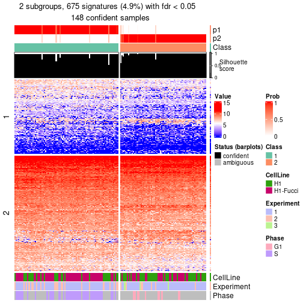</p>

</div>
<div id='tab-node-011-get-signatures-no-scale-2'>
<pre><code class="r">get_signatures(res, k = 3, scale_rows = FALSE)
</code></pre>

<p></p>

</div>
<div id='tab-node-011-get-signatures-no-scale-3'>
<pre><code class="r">get_signatures(res, k = 4, scale_rows = FALSE)
</code></pre>

<p></p>

</div>
</div>


Compare the overlap of signatures from different k:

```r
compare_signatures(res)
```


`get_signature()` returns a data frame invisibly. To get the list of signatures, the function
call should be assigned to a variable explicitly. In following code, if `plot` argument is set
to `FALSE`, no heatmap is plotted while only the differential analysis is performed.

```r
# code only for demonstration
tb = get_signature(res, k = ..., plot = FALSE)
```

An example of the output of `tb` is:

```
#>   which_row         fdr    mean_1    mean_2 scaled_mean_1 scaled_mean_2 km
#> 1        38 0.042760348  8.373488  9.131774    -0.5533452     0.5164555  1
#> 2        40 0.018707592  7.106213  8.469186    -0.6173731     0.5762149  1
#> 3        55 0.019134737 10.221463 11.207825    -0.6159697     0.5749050  1
#> 4        59 0.006059896  5.921854  7.869574    -0.6899429     0.6439467  1
#> 5        60 0.018055526  8.928898 10.211722    -0.6204761     0.5791110  1
#> 6        98 0.009384629 15.714769 14.887706     0.6635654    -0.6193277  2
...
```

The columns in `tb` are:

1. `which_row`: row indices corresponding to the input matrix.
2. `fdr`: FDR for the differential test. 
3. `mean_x`: The mean value in group x.
4. `scaled_mean_x`: The mean value in group x after rows are scaled.
5. `km`: Row groups if k-means clustering is applied to rows (which is done by automatically selecting number of clusters).

If there are too many signatures, `top_signatures = ...` can be set to only show the 
signatures with the highest FDRs:

```r
# code only for demonstration
# e.g. to show the top 500 most significant rows
tb = get_signature(res, k = ..., top_signatures = 500)
```

If the signatures are defined as these which are uniquely high in current group, `diff_method` argument
can be set to `"uniquely_high_in_one_group"`:

```r
# code only for demonstration
tb = get_signature(res, k = ..., diff_method = "uniquely_high_in_one_group")
```


UMAP plot which shows how samples are separated.


<script>
$( function() {
	$( '#tabs-node-011-dimension-reduction' ).tabs();
} );
</script>
<div id='tabs-node-011-dimension-reduction'>
<ul>
<li><a href='#tab-node-011-dimension-reduction-1'>k = 2</a></li>
<li><a href='#tab-node-011-dimension-reduction-2'>k = 3</a></li>
<li><a href='#tab-node-011-dimension-reduction-3'>k = 4</a></li>
</ul>
<div id='tab-node-011-dimension-reduction-1'>
<pre><code class="r">dimension_reduction(res, k = 2, method = &quot;UMAP&quot;)
</code></pre>

<p></p>

</div>
<div id='tab-node-011-dimension-reduction-2'>
<pre><code class="r">dimension_reduction(res, k = 3, method = &quot;UMAP&quot;)
</code></pre>

<p></p>

</div>
<div id='tab-node-011-dimension-reduction-3'>
<pre><code class="r">dimension_reduction(res, k = 4, method = &quot;UMAP&quot;)
</code></pre>

<p></p>

</div>
</div>


Following heatmap shows how subgroups are split when increasing `k`:

```r
collect_classes(res)
```

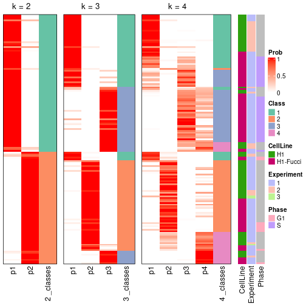


Test correlation between subgroups and known annotations. If the known
annotation is numeric, one-way ANOVA test is applied, and if the known
annotation is discrete, chi-squared contingency table test is applied.

```r
test_to_known_factors(res)
```

```
#>             n_sample CellLine(p-value) Experiment(p-value) Phase(p-value) k
#> ATC:skmeans      148          1.13e-02            8.42e-03       2.10e-12 2
#> ATC:skmeans      147          1.02e-03            2.70e-05       1.24e-08 3
#> ATC:skmeans      111          4.53e-07            3.05e-07       3.40e-07 4
```


If matrix rows can be associated to genes, consider to use `functional_enrichment(res,
...)` to perform function enrichment for the signature genes. See [this vignette](https://jokergoo.github.io/cola_vignettes/functional_enrichment.html) for more detailed explanations.


 

---------------------------------------------------


### Node0111


Parent node: [Node011](#Node011).
Child nodes: 
                Node01111-leaf
        ,
                Node01112-leaf
        ,
                Node01121-leaf
        ,
                Node01122-leaf
        .


The object with results only for a single top-value method and a single partitioning method 
can be extracted as:

```r
res = res_rh["0111"]
```

A summary of `res` and all the functions that can be applied to it:

```r
res
```

```
#> A 'ConsensusPartition' object with k = 2, 3, 4.
#>   On a matrix with 13002 rows and 82 columns.
#>   Top rows (1133) are extracted by 'ATC' method.
#>   Subgroups are detected by 'skmeans' method.
#>   Performed in total 150 partitions by row resampling.
#>   Best k for subgroups seems to be 2.
#> 
#> Following methods can be applied to this 'ConsensusPartition' object:
#>  [1] "cola_report"             "collect_classes"         "collect_plots"          
#>  [4] "collect_stats"           "colnames"                "compare_partitions"     
#>  [7] "compare_signatures"      "consensus_heatmap"       "dimension_reduction"    
#> [10] "functional_enrichment"   "get_anno_col"            "get_anno"               
#> [13] "get_classes"             "get_consensus"           "get_matrix"             
#> [16] "get_membership"          "get_param"               "get_signatures"         
#> [19] "get_stats"               "is_best_k"               "is_stable_k"            
#> [22] "membership_heatmap"      "ncol"                    "nrow"                   
#> [25] "plot_ecdf"               "predict_classes"         "rownames"               
#> [28] "select_partition_number" "show"                    "suggest_best_k"         
#> [31] "test_to_known_factors"   "top_rows_heatmap"
```

`collect_plots()` function collects all the plots made from `res` for all `k` (number of subgroups)
into one single page to provide an easy and fast comparison between different `k`.

```r
collect_plots(res)
```


The plots are:

- The first row: a plot of the eCDF (empirical cumulative distribution
  function) curves of the consensus matrix for each `k` and the heatmap of
  predicted classes for each `k`.
- The second row: heatmaps of the consensus matrix for each `k`.
- The third row: heatmaps of the membership matrix for each `k`.
- The fouth row: heatmaps of the signatures for each `k`.

All the plots in panels can be made by individual functions and they are
plotted later in this section.

`select_partition_number()` produces several plots showing different
statistics for choosing "optimized" `k`. There are following statistics:

- eCDF curves of the consensus matrix for each `k`;
- 1-PAC. [The PAC score](https://en.wikipedia.org/wiki/Consensus_clustering#Over-interpretation_potential_of_consensus_clustering)
  measures the proportion of the ambiguous subgrouping.
- Mean silhouette score.
- Concordance. The mean probability of fiting the consensus subgroup labels in all
  partitions.
- Area increased. Denote $A_k$ as the area under the eCDF curve for current
  `k`, the area increased is defined as $A_k - A_{k-1}$.
- Rand index. The percent of pairs of samples that are both in a same cluster
  or both are not in a same cluster in the partition of k and k-1.
- Jaccard index. The ratio of pairs of samples are both in a same cluster in
  the partition of k and k-1 and the pairs of samples are both in a same
  cluster in the partition k or k-1.

The detailed explanations of these statistics can be found in [the _cola_
vignette](https://jokergoo.github.io/cola_vignettes/cola.html#toc_13).

Generally speaking, higher 1-PAC score, higher mean silhouette score or higher
concordance corresponds to better partition. Rand index and Jaccard index
measure how similar the current partition is compared to partition with `k-1`.
If they are too similar, we won't accept `k` is better than `k-1`.

```r
select_partition_number(res)
```


The numeric values for all these statistics can be obtained by `get_stats()`.

```r
get_stats(res)
```

```
#>   k 1-PAC mean_silhouette concordance area_increased  Rand Jaccard
#> 2 2 0.998           0.953       0.980          0.496 0.501   0.501
#> 3 3 0.725           0.805       0.913          0.351 0.740   0.526
#> 4 4 0.675           0.708       0.852          0.119 0.870   0.638
```

`suggest_best_k()` suggests the best $k$ based on these statistics. The rules are as follows:

- All $k$ with Jaccard index larger than 0.95 are removed because increasing
  $k$ does not provide enough extra information. If all $k$ are removed, it is
  marked as no subgroup is detected.
- For all $k$ with 1-PAC score larger than 0.9, the maximal $k$ is taken as
  the best $k$, and other $k$ are marked as optional $k$.
- If it does not fit the second rule. The $k$ with the maximal vote of the
  highest 1-PAC score, highest mean silhouette, and highest concordance is
  taken as the best $k$.

```r
suggest_best_k(res)
```

```
#> [1] 2
```


Following is the table of the partitions (You need to click the **show/hide
code output** link to see it). The membership matrix (columns with name `p*`)
is inferred by
[`clue::cl_consensus()`](https://www.rdocumentation.org/link/cl_consensus?package=clue)
function with the `SE` method. Basically the value in the membership matrix
represents the probability to belong to a certain group. The finall subgroup
label for an item is determined with the group with highest probability it
belongs to.

In `get_classes()` function, the entropy is calculated from the membership
matrix and the silhouette score is calculated from the consensus matrix.


<script>
$( function() {
	$( '#tabs-node-0111-get-classes' ).tabs();
} );
</script>
<div id='tabs-node-0111-get-classes'>
<ul>
<li><a href='#tab-node-0111-get-classes-1'>k = 2</a></li>
<li><a href='#tab-node-0111-get-classes-2'>k = 3</a></li>
<li><a href='#tab-node-0111-get-classes-3'>k = 4</a></li>
</ul>

<div id='tab-node-0111-get-classes-1'>
<p><a id='tab-node-0111-get-classes-1-a' style='color:#0366d6' href='#'>show/hide code output</a></p>
<pre><code class="r">cbind(get_classes(res, k = 2), get_membership(res, k = 2))
</code></pre>

<pre><code>#&gt;             class entropy silhouette   p1   p2
#&gt; H1_Exp1.002     2   0.000      0.964 0.00 1.00
#&gt; H1_Exp1.004     1   0.000      0.991 1.00 0.00
#&gt; H1_Exp1.006     2   0.000      0.964 0.00 1.00
#&gt; H1_Exp1.011     2   0.000      0.964 0.00 1.00
#&gt; H1_Exp1.012     2   0.000      0.964 0.00 1.00
#&gt; H1_Exp1.014     2   0.971      0.358 0.40 0.60
#&gt; H1_Exp2.073     1   0.000      0.991 1.00 0.00
#&gt; H1_Exp2.074     2   0.000      0.964 0.00 1.00
#&gt; H1_Exp2.075     2   0.000      0.964 0.00 1.00
#&gt; H1_Exp2.079     2   0.000      0.964 0.00 1.00
#&gt; H1_Exp2.081     2   0.000      0.964 0.00 1.00
#&gt; H1_Exp2.083     2   0.000      0.964 0.00 1.00
#&gt; H1_Exp2.084     2   0.000      0.964 0.00 1.00
#&gt; H1_Exp2.085     2   0.000      0.964 0.00 1.00
#&gt; H1_Exp2.087     2   0.000      0.964 0.00 1.00
#&gt; H1_Exp2.088     2   0.000      0.964 0.00 1.00
#&gt; H1_Exp2.089     2   0.000      0.964 0.00 1.00
#&gt; H1_Exp2.091     2   0.000      0.964 0.00 1.00
#&gt; H1_Exp2.092     2   0.000      0.964 0.00 1.00
#&gt; H1_Exp2.094     2   0.000      0.964 0.00 1.00
#&gt; H1_Exp2.098     2   0.000      0.964 0.00 1.00
#&gt; H1_Exp2.100     2   0.000      0.964 0.00 1.00
#&gt; H1_Exp2.101     2   0.000      0.964 0.00 1.00
#&gt; H1_Exp2.105     2   0.000      0.964 0.00 1.00
#&gt; H1_Exp2.108     2   0.327      0.915 0.06 0.94
#&gt; H1_Exp2.136     2   0.000      0.964 0.00 1.00
#&gt; H1_Exp2.138     2   0.000      0.964 0.00 1.00
#&gt; H1_Exp2.144     2   0.000      0.964 0.00 1.00
#&gt; H1_Exp2.152     1   0.000      0.991 1.00 0.00
#&gt; G2_Exp1.013     2   0.000      0.964 0.00 1.00
#&gt; G2_Exp1.015     1   0.000      0.991 1.00 0.00
#&gt; G2_Exp1.017     2   0.000      0.964 0.00 1.00
#&gt; G2_Exp1.001     1   0.000      0.991 1.00 0.00
#&gt; G2_Exp1.014     1   0.000      0.991 1.00 0.00
#&gt; G2_Exp1.012     2   0.000      0.964 0.00 1.00
#&gt; G2_Exp1.003     2   0.327      0.915 0.06 0.94
#&gt; S_Exp1.031      1   0.000      0.991 1.00 0.00
#&gt; S_Exp1.056      1   0.000      0.991 1.00 0.00
#&gt; S_Exp1.011      1   0.000      0.991 1.00 0.00
#&gt; S_Exp1.016      1   0.000      0.991 1.00 0.00
#&gt; S_Exp1.038      1   0.000      0.991 1.00 0.00
#&gt; S_Exp1.048      1   0.000      0.991 1.00 0.00
#&gt; S_Exp1.051      2   0.760      0.718 0.22 0.78
#&gt; S_Exp1.022      1   0.000      0.991 1.00 0.00
#&gt; S_Exp1.001      1   0.000      0.991 1.00 0.00
#&gt; S_Exp1.061      2   0.000      0.964 0.00 1.00
#&gt; S_Exp1.080      1   0.000      0.991 1.00 0.00
#&gt; S_Exp1.069      1   0.000      0.991 1.00 0.00
#&gt; S_Exp1.019      1   0.000      0.991 1.00 0.00
#&gt; S_Exp1.003      1   0.000      0.991 1.00 0.00
#&gt; S_Exp1.029      1   0.000      0.991 1.00 0.00
#&gt; S_Exp1.025      1   0.000      0.991 1.00 0.00
#&gt; S_Exp1.041      1   0.000      0.991 1.00 0.00
#&gt; S_Exp1.057      1   0.469      0.883 0.90 0.10
#&gt; S_Exp1.055      1   0.000      0.991 1.00 0.00
#&gt; S_Exp1.033      1   0.827      0.639 0.74 0.26
#&gt; S_Exp1.081      1   0.000      0.991 1.00 0.00
#&gt; S_Exp1.004      1   0.000      0.991 1.00 0.00
#&gt; S_Exp1.045      1   0.000      0.991 1.00 0.00
#&gt; S_Exp1.018      1   0.000      0.991 1.00 0.00
#&gt; S_Exp1.034      1   0.000      0.991 1.00 0.00
#&gt; S_Exp1.067      2   0.981      0.291 0.42 0.58
#&gt; S_Exp1.037      2   0.000      0.964 0.00 1.00
#&gt; S_Exp1.053      1   0.242      0.951 0.96 0.04
#&gt; S_Exp1.036      1   0.000      0.991 1.00 0.00
#&gt; S_Exp1.021      1   0.000      0.991 1.00 0.00
#&gt; S_Exp1.060      1   0.000      0.991 1.00 0.00
#&gt; S_Exp1.062      1   0.000      0.991 1.00 0.00
#&gt; S_Exp1.028      2   0.327      0.914 0.06 0.94
#&gt; S_Exp1.079      1   0.000      0.991 1.00 0.00
#&gt; S_Exp1.047      1   0.000      0.991 1.00 0.00
#&gt; S_Exp1.077      1   0.000      0.991 1.00 0.00
#&gt; S_Exp1.052      1   0.000      0.991 1.00 0.00
#&gt; S_Exp1.007      1   0.000      0.991 1.00 0.00
#&gt; S_Exp1.027      1   0.000      0.991 1.00 0.00
#&gt; S_Exp1.075      1   0.000      0.991 1.00 0.00
#&gt; S_Exp1.049      2   0.000      0.964 0.00 1.00
#&gt; S_Exp1.072      1   0.000      0.991 1.00 0.00
#&gt; S_Exp1.005      1   0.000      0.991 1.00 0.00
#&gt; S_Exp1.058      1   0.000      0.991 1.00 0.00
#&gt; S_Exp1.043      1   0.000      0.991 1.00 0.00
#&gt; S_Exp1.050      1   0.000      0.991 1.00 0.00
</code></pre>

<script>
$('#tab-node-0111-get-classes-1-a').parent().next().next().hide();
$('#tab-node-0111-get-classes-1-a').click(function(){
  $('#tab-node-0111-get-classes-1-a').parent().next().next().toggle();
  return(false);
});
</script>
</div>

<div id='tab-node-0111-get-classes-2'>
<p><a id='tab-node-0111-get-classes-2-a' style='color:#0366d6' href='#'>show/hide code output</a></p>
<pre><code class="r">cbind(get_classes(res, k = 3), get_membership(res, k = 3))
</code></pre>

<pre><code>#&gt;             class entropy silhouette   p1   p2   p3
#&gt; H1_Exp1.002     2  0.0000     0.9268 0.00 1.00 0.00
#&gt; H1_Exp1.004     1  0.0000     0.8539 1.00 0.00 0.00
#&gt; H1_Exp1.006     2  0.0000     0.9268 0.00 1.00 0.00
#&gt; H1_Exp1.011     2  0.0000     0.9268 0.00 1.00 0.00
#&gt; H1_Exp1.012     2  0.2066     0.8849 0.00 0.94 0.06
#&gt; H1_Exp1.014     1  0.5397     0.5762 0.72 0.28 0.00
#&gt; H1_Exp2.073     1  0.0000     0.8539 1.00 0.00 0.00
#&gt; H1_Exp2.074     2  0.0000     0.9268 0.00 1.00 0.00
#&gt; H1_Exp2.075     2  0.0892     0.9143 0.02 0.98 0.00
#&gt; H1_Exp2.079     2  0.0000     0.9268 0.00 1.00 0.00
#&gt; H1_Exp2.081     2  0.0000     0.9268 0.00 1.00 0.00
#&gt; H1_Exp2.083     2  0.0000     0.9268 0.00 1.00 0.00
#&gt; H1_Exp2.084     1  0.6309    -0.0347 0.50 0.50 0.00
#&gt; H1_Exp2.085     2  0.0000     0.9268 0.00 1.00 0.00
#&gt; H1_Exp2.087     2  0.0000     0.9268 0.00 1.00 0.00
#&gt; H1_Exp2.088     2  0.0892     0.9143 0.02 0.98 0.00
#&gt; H1_Exp2.089     2  0.0000     0.9268 0.00 1.00 0.00
#&gt; H1_Exp2.091     2  0.0000     0.9268 0.00 1.00 0.00
#&gt; H1_Exp2.092     2  0.0000     0.9268 0.00 1.00 0.00
#&gt; H1_Exp2.094     2  0.0000     0.9268 0.00 1.00 0.00
#&gt; H1_Exp2.098     2  0.0000     0.9268 0.00 1.00 0.00
#&gt; H1_Exp2.100     2  0.0000     0.9268 0.00 1.00 0.00
#&gt; H1_Exp2.101     2  0.0000     0.9268 0.00 1.00 0.00
#&gt; H1_Exp2.105     2  0.0000     0.9268 0.00 1.00 0.00
#&gt; H1_Exp2.108     1  0.5948     0.4037 0.64 0.36 0.00
#&gt; H1_Exp2.136     2  0.6244     0.2766 0.00 0.56 0.44
#&gt; H1_Exp2.138     2  0.0000     0.9268 0.00 1.00 0.00
#&gt; H1_Exp2.144     2  0.0000     0.9268 0.00 1.00 0.00
#&gt; H1_Exp2.152     1  0.0000     0.8539 1.00 0.00 0.00
#&gt; G2_Exp1.013     2  0.3340     0.8317 0.00 0.88 0.12
#&gt; G2_Exp1.015     1  0.1529     0.8435 0.96 0.00 0.04
#&gt; G2_Exp1.017     2  0.3686     0.8087 0.00 0.86 0.14
#&gt; G2_Exp1.001     1  0.0000     0.8539 1.00 0.00 0.00
#&gt; G2_Exp1.014     1  0.6387     0.5583 0.68 0.02 0.30
#&gt; G2_Exp1.012     2  0.0000     0.9268 0.00 1.00 0.00
#&gt; G2_Exp1.003     2  0.6280     0.1297 0.46 0.54 0.00
#&gt; S_Exp1.031      1  0.0892     0.8537 0.98 0.00 0.02
#&gt; S_Exp1.056      1  0.3686     0.7938 0.86 0.00 0.14
#&gt; S_Exp1.011      1  0.0000     0.8539 1.00 0.00 0.00
#&gt; S_Exp1.016      1  0.0000     0.8539 1.00 0.00 0.00
#&gt; S_Exp1.038      1  0.0892     0.8537 0.98 0.00 0.02
#&gt; S_Exp1.048      3  0.0000     0.9345 0.00 0.00 1.00
#&gt; S_Exp1.051      3  0.0892     0.9179 0.00 0.02 0.98
#&gt; S_Exp1.022      1  0.5016     0.7046 0.76 0.00 0.24
#&gt; S_Exp1.001      1  0.0000     0.8539 1.00 0.00 0.00
#&gt; S_Exp1.061      3  0.4555     0.6887 0.00 0.20 0.80
#&gt; S_Exp1.080      3  0.0000     0.9345 0.00 0.00 1.00
#&gt; S_Exp1.069      1  0.0892     0.8537 0.98 0.00 0.02
#&gt; S_Exp1.019      1  0.5706     0.5887 0.68 0.00 0.32
#&gt; S_Exp1.003      1  0.0000     0.8539 1.00 0.00 0.00
#&gt; S_Exp1.029      3  0.0000     0.9345 0.00 0.00 1.00
#&gt; S_Exp1.025      1  0.5948     0.5167 0.64 0.00 0.36
#&gt; S_Exp1.041      3  0.0000     0.9345 0.00 0.00 1.00
#&gt; S_Exp1.057      3  0.0000     0.9345 0.00 0.00 1.00
#&gt; S_Exp1.055      3  0.0892     0.9228 0.02 0.00 0.98
#&gt; S_Exp1.033      3  0.0000     0.9345 0.00 0.00 1.00
#&gt; S_Exp1.081      1  0.4796     0.7235 0.78 0.00 0.22
#&gt; S_Exp1.004      1  0.0000     0.8539 1.00 0.00 0.00
#&gt; S_Exp1.045      3  0.0000     0.9345 0.00 0.00 1.00
#&gt; S_Exp1.018      3  0.1529     0.9093 0.04 0.00 0.96
#&gt; S_Exp1.034      1  0.3340     0.8055 0.88 0.00 0.12
#&gt; S_Exp1.067      3  0.0000     0.9345 0.00 0.00 1.00
#&gt; S_Exp1.037      2  0.5016     0.6824 0.00 0.76 0.24
#&gt; S_Exp1.053      3  0.0000     0.9345 0.00 0.00 1.00
#&gt; S_Exp1.036      1  0.6244     0.3248 0.56 0.00 0.44
#&gt; S_Exp1.021      3  0.4291     0.7464 0.18 0.00 0.82
#&gt; S_Exp1.060      3  0.5706     0.4690 0.32 0.00 0.68
#&gt; S_Exp1.062      3  0.2537     0.8717 0.08 0.00 0.92
#&gt; S_Exp1.028      3  0.0000     0.9345 0.00 0.00 1.00
#&gt; S_Exp1.079      1  0.0892     0.8537 0.98 0.00 0.02
#&gt; S_Exp1.047      1  0.5216     0.6801 0.74 0.00 0.26
#&gt; S_Exp1.077      3  0.0000     0.9345 0.00 0.00 1.00
#&gt; S_Exp1.052      3  0.0000     0.9345 0.00 0.00 1.00
#&gt; S_Exp1.007      1  0.0000     0.8539 1.00 0.00 0.00
#&gt; S_Exp1.027      1  0.0892     0.8537 0.98 0.00 0.02
#&gt; S_Exp1.075      1  0.5560     0.6259 0.70 0.00 0.30
#&gt; S_Exp1.049      2  0.6280     0.2179 0.00 0.54 0.46
#&gt; S_Exp1.072      3  0.0892     0.9225 0.02 0.00 0.98
#&gt; S_Exp1.005      1  0.0000     0.8539 1.00 0.00 0.00
#&gt; S_Exp1.058      1  0.2066     0.8388 0.94 0.00 0.06
#&gt; S_Exp1.043      3  0.4555     0.7134 0.20 0.00 0.80
#&gt; S_Exp1.050      1  0.0892     0.8537 0.98 0.00 0.02
</code></pre>

<script>
$('#tab-node-0111-get-classes-2-a').parent().next().next().hide();
$('#tab-node-0111-get-classes-2-a').click(function(){
  $('#tab-node-0111-get-classes-2-a').parent().next().next().toggle();
  return(false);
});
</script>
</div>

<div id='tab-node-0111-get-classes-3'>
<p><a id='tab-node-0111-get-classes-3-a' style='color:#0366d6' href='#'>show/hide code output</a></p>
<pre><code class="r">cbind(get_classes(res, k = 4), get_membership(res, k = 4))
</code></pre>

<pre><code>#&gt;             class entropy silhouette   p1   p2   p3   p4
#&gt; H1_Exp1.002     2  0.0000     0.8771 0.00 1.00 0.00 0.00
#&gt; H1_Exp1.004     4  0.4936     0.4886 0.28 0.02 0.00 0.70
#&gt; H1_Exp1.006     2  0.1211     0.8720 0.04 0.96 0.00 0.00
#&gt; H1_Exp1.011     2  0.0000     0.8771 0.00 1.00 0.00 0.00
#&gt; H1_Exp1.012     2  0.1211     0.8720 0.04 0.96 0.00 0.00
#&gt; H1_Exp1.014     1  0.4971     0.7362 0.80 0.08 0.02 0.10
#&gt; H1_Exp2.073     1  0.2011     0.8064 0.92 0.00 0.00 0.08
#&gt; H1_Exp2.074     2  0.0000     0.8771 0.00 1.00 0.00 0.00
#&gt; H1_Exp2.075     2  0.4994     0.1864 0.48 0.52 0.00 0.00
#&gt; H1_Exp2.079     2  0.0000     0.8771 0.00 1.00 0.00 0.00
#&gt; H1_Exp2.081     2  0.0000     0.8771 0.00 1.00 0.00 0.00
#&gt; H1_Exp2.083     2  0.0000     0.8771 0.00 1.00 0.00 0.00
#&gt; H1_Exp2.084     1  0.4472     0.6435 0.76 0.22 0.00 0.02
#&gt; H1_Exp2.085     2  0.1913     0.8563 0.04 0.94 0.02 0.00
#&gt; H1_Exp2.087     2  0.0707     0.8724 0.02 0.98 0.00 0.00
#&gt; H1_Exp2.088     2  0.3172     0.7636 0.16 0.84 0.00 0.00
#&gt; H1_Exp2.089     2  0.0000     0.8771 0.00 1.00 0.00 0.00
#&gt; H1_Exp2.091     2  0.0000     0.8771 0.00 1.00 0.00 0.00
#&gt; H1_Exp2.092     2  0.0707     0.8724 0.02 0.98 0.00 0.00
#&gt; H1_Exp2.094     2  0.0707     0.8744 0.02 0.98 0.00 0.00
#&gt; H1_Exp2.098     2  0.3606     0.7795 0.14 0.84 0.02 0.00
#&gt; H1_Exp2.100     2  0.2335     0.8455 0.02 0.92 0.06 0.00
#&gt; H1_Exp2.101     2  0.0707     0.8744 0.02 0.98 0.00 0.00
#&gt; H1_Exp2.105     2  0.0000     0.8771 0.00 1.00 0.00 0.00
#&gt; H1_Exp2.108     4  0.7139     0.1493 0.36 0.14 0.00 0.50
#&gt; H1_Exp2.136     2  0.8335     0.0861 0.02 0.42 0.28 0.28
#&gt; H1_Exp2.138     2  0.0707     0.8744 0.02 0.98 0.00 0.00
#&gt; H1_Exp2.144     2  0.0707     0.8744 0.02 0.98 0.00 0.00
#&gt; H1_Exp2.152     1  0.4855     0.3988 0.60 0.00 0.00 0.40
#&gt; G2_Exp1.013     2  0.7198     0.4044 0.18 0.54 0.28 0.00
#&gt; G2_Exp1.015     1  0.1913     0.7977 0.94 0.00 0.02 0.04
#&gt; G2_Exp1.017     2  0.7550     0.2885 0.30 0.48 0.22 0.00
#&gt; G2_Exp1.001     1  0.1637     0.8077 0.94 0.00 0.00 0.06
#&gt; G2_Exp1.014     1  0.3525     0.7570 0.86 0.00 0.10 0.04
#&gt; G2_Exp1.012     2  0.0707     0.8744 0.02 0.98 0.00 0.00
#&gt; G2_Exp1.003     1  0.1913     0.7673 0.94 0.04 0.02 0.00
#&gt; S_Exp1.031      4  0.3975     0.5498 0.24 0.00 0.00 0.76
#&gt; S_Exp1.056      4  0.0000     0.7951 0.00 0.00 0.00 1.00
#&gt; S_Exp1.011      1  0.1211     0.8035 0.96 0.00 0.00 0.04
#&gt; S_Exp1.016      1  0.4277     0.6855 0.72 0.00 0.00 0.28
#&gt; S_Exp1.038      4  0.0707     0.7918 0.02 0.00 0.00 0.98
#&gt; S_Exp1.048      3  0.4713     0.4282 0.00 0.00 0.64 0.36
#&gt; S_Exp1.051      3  0.0707     0.8466 0.02 0.00 0.98 0.00
#&gt; S_Exp1.022      4  0.1637     0.7921 0.00 0.00 0.06 0.94
#&gt; S_Exp1.001      1  0.3172     0.8021 0.84 0.00 0.00 0.16
#&gt; S_Exp1.061      3  0.3172     0.7110 0.00 0.16 0.84 0.00
#&gt; S_Exp1.080      3  0.0707     0.8596 0.00 0.00 0.98 0.02
#&gt; S_Exp1.069      4  0.1211     0.7827 0.04 0.00 0.00 0.96
#&gt; S_Exp1.019      1  0.7474     0.3701 0.50 0.00 0.22 0.28
#&gt; S_Exp1.003      1  0.3172     0.8021 0.84 0.00 0.00 0.16
#&gt; S_Exp1.029      3  0.0707     0.8596 0.00 0.00 0.98 0.02
#&gt; S_Exp1.025      1  0.7748     0.2090 0.44 0.00 0.28 0.28
#&gt; S_Exp1.041      3  0.0707     0.8596 0.00 0.00 0.98 0.02
#&gt; S_Exp1.057      3  0.0707     0.8596 0.00 0.00 0.98 0.02
#&gt; S_Exp1.055      3  0.4907     0.2533 0.00 0.00 0.58 0.42
#&gt; S_Exp1.033      3  0.0707     0.8596 0.00 0.00 0.98 0.02
#&gt; S_Exp1.081      4  0.3935     0.7318 0.10 0.00 0.06 0.84
#&gt; S_Exp1.004      1  0.3172     0.8021 0.84 0.00 0.00 0.16
#&gt; S_Exp1.045      3  0.0707     0.8596 0.00 0.00 0.98 0.02
#&gt; S_Exp1.018      3  0.3611     0.7631 0.06 0.00 0.86 0.08
#&gt; S_Exp1.034      4  0.0707     0.7961 0.00 0.00 0.02 0.98
#&gt; S_Exp1.067      3  0.0707     0.8466 0.02 0.00 0.98 0.00
#&gt; S_Exp1.037      2  0.4642     0.6575 0.02 0.74 0.24 0.00
#&gt; S_Exp1.053      3  0.4134     0.6249 0.00 0.00 0.74 0.26
#&gt; S_Exp1.036      4  0.4949     0.6893 0.06 0.00 0.18 0.76
#&gt; S_Exp1.021      3  0.7346     0.2200 0.28 0.00 0.52 0.20
#&gt; S_Exp1.060      4  0.3172     0.7296 0.00 0.00 0.16 0.84
#&gt; S_Exp1.062      4  0.4522     0.5209 0.00 0.00 0.32 0.68
#&gt; S_Exp1.028      3  0.0000     0.8540 0.00 0.00 1.00 0.00
#&gt; S_Exp1.079      4  0.0707     0.7918 0.02 0.00 0.00 0.98
#&gt; S_Exp1.047      4  0.1211     0.7928 0.00 0.00 0.04 0.96
#&gt; S_Exp1.077      3  0.0707     0.8596 0.00 0.00 0.98 0.02
#&gt; S_Exp1.052      4  0.4855     0.2618 0.00 0.00 0.40 0.60
#&gt; S_Exp1.007      1  0.2647     0.8096 0.88 0.00 0.00 0.12
#&gt; S_Exp1.027      4  0.0707     0.7918 0.02 0.00 0.00 0.98
#&gt; S_Exp1.075      4  0.4841     0.7205 0.08 0.00 0.14 0.78
#&gt; S_Exp1.049      2  0.5487     0.3569 0.02 0.58 0.40 0.00
#&gt; S_Exp1.072      3  0.0707     0.8473 0.02 0.00 0.98 0.00
#&gt; S_Exp1.005      1  0.3172     0.8021 0.84 0.00 0.00 0.16
#&gt; S_Exp1.058      4  0.0707     0.7961 0.00 0.00 0.02 0.98
#&gt; S_Exp1.043      4  0.6605     0.0986 0.08 0.00 0.44 0.48
#&gt; S_Exp1.050      4  0.0707     0.7918 0.02 0.00 0.00 0.98
</code></pre>

<script>
$('#tab-node-0111-get-classes-3-a').parent().next().next().hide();
$('#tab-node-0111-get-classes-3-a').click(function(){
  $('#tab-node-0111-get-classes-3-a').parent().next().next().toggle();
  return(false);
});
</script>
</div>
</div>

Heatmaps for the consensus matrix. It visualizes the probability of two
samples to be in a same group.


<script>
$( function() {
	$( '#tabs-node-0111-consensus-heatmap' ).tabs();
} );
</script>
<div id='tabs-node-0111-consensus-heatmap'>
<ul>
<li><a href='#tab-node-0111-consensus-heatmap-1'>k = 2</a></li>
<li><a href='#tab-node-0111-consensus-heatmap-2'>k = 3</a></li>
<li><a href='#tab-node-0111-consensus-heatmap-3'>k = 4</a></li>
</ul>
<div id='tab-node-0111-consensus-heatmap-1'>
<pre><code class="r">consensus_heatmap(res, k = 2)
</code></pre>

<p></p>

</div>
<div id='tab-node-0111-consensus-heatmap-2'>
<pre><code class="r">consensus_heatmap(res, k = 3)
</code></pre>

<p></p>

</div>
<div id='tab-node-0111-consensus-heatmap-3'>
<pre><code class="r">consensus_heatmap(res, k = 4)
</code></pre>

<p>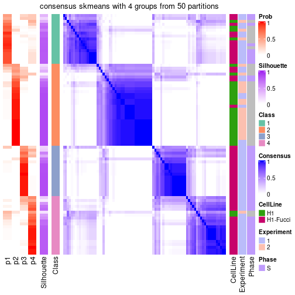</p>

</div>
</div>

Heatmaps for the membership of samples in all partitions to see how consistent they are:


<script>
$( function() {
	$( '#tabs-node-0111-membership-heatmap' ).tabs();
} );
</script>
<div id='tabs-node-0111-membership-heatmap'>
<ul>
<li><a href='#tab-node-0111-membership-heatmap-1'>k = 2</a></li>
<li><a href='#tab-node-0111-membership-heatmap-2'>k = 3</a></li>
<li><a href='#tab-node-0111-membership-heatmap-3'>k = 4</a></li>
</ul>
<div id='tab-node-0111-membership-heatmap-1'>
<pre><code class="r">membership_heatmap(res, k = 2)
</code></pre>

<p></p>

</div>
<div id='tab-node-0111-membership-heatmap-2'>
<pre><code class="r">membership_heatmap(res, k = 3)
</code></pre>

<p></p>

</div>
<div id='tab-node-0111-membership-heatmap-3'>
<pre><code class="r">membership_heatmap(res, k = 4)
</code></pre>

<p></p>

</div>
</div>

As soon as the classes for columns are determined, the signatures
that are significantly different between subgroups can be looked for. 
Following are the heatmaps for signatures.


Signature heatmaps where rows are scaled:


<script>
$( function() {
	$( '#tabs-node-0111-get-signatures' ).tabs();
} );
</script>
<div id='tabs-node-0111-get-signatures'>
<ul>
<li><a href='#tab-node-0111-get-signatures-1'>k = 2</a></li>
<li><a href='#tab-node-0111-get-signatures-2'>k = 3</a></li>
<li><a href='#tab-node-0111-get-signatures-3'>k = 4</a></li>
</ul>
<div id='tab-node-0111-get-signatures-1'>
<pre><code class="r">get_signatures(res, k = 2)
</code></pre>

<p></p>

</div>
<div id='tab-node-0111-get-signatures-2'>
<pre><code class="r">get_signatures(res, k = 3)
</code></pre>

<p></p>

</div>
<div id='tab-node-0111-get-signatures-3'>
<pre><code class="r">get_signatures(res, k = 4)
</code></pre>

<p></p>

</div>
</div>


Signature heatmaps where rows are not scaled:


<script>
$( function() {
	$( '#tabs-node-0111-get-signatures-no-scale' ).tabs();
} );
</script>
<div id='tabs-node-0111-get-signatures-no-scale'>
<ul>
<li><a href='#tab-node-0111-get-signatures-no-scale-1'>k = 2</a></li>
<li><a href='#tab-node-0111-get-signatures-no-scale-2'>k = 3</a></li>
<li><a href='#tab-node-0111-get-signatures-no-scale-3'>k = 4</a></li>
</ul>
<div id='tab-node-0111-get-signatures-no-scale-1'>
<pre><code class="r">get_signatures(res, k = 2, scale_rows = FALSE)
</code></pre>

<p></p>

</div>
<div id='tab-node-0111-get-signatures-no-scale-2'>
<pre><code class="r">get_signatures(res, k = 3, scale_rows = FALSE)
</code></pre>

<p></p>

</div>
<div id='tab-node-0111-get-signatures-no-scale-3'>
<pre><code class="r">get_signatures(res, k = 4, scale_rows = FALSE)
</code></pre>

<p></p>

</div>
</div>


Compare the overlap of signatures from different k:

```r
compare_signatures(res)
```


`get_signature()` returns a data frame invisibly. To get the list of signatures, the function
call should be assigned to a variable explicitly. In following code, if `plot` argument is set
to `FALSE`, no heatmap is plotted while only the differential analysis is performed.

```r
# code only for demonstration
tb = get_signature(res, k = ..., plot = FALSE)
```

An example of the output of `tb` is:

```
#>   which_row         fdr    mean_1    mean_2 scaled_mean_1 scaled_mean_2 km
#> 1        38 0.042760348  8.373488  9.131774    -0.5533452     0.5164555  1
#> 2        40 0.018707592  7.106213  8.469186    -0.6173731     0.5762149  1
#> 3        55 0.019134737 10.221463 11.207825    -0.6159697     0.5749050  1
#> 4        59 0.006059896  5.921854  7.869574    -0.6899429     0.6439467  1
#> 5        60 0.018055526  8.928898 10.211722    -0.6204761     0.5791110  1
#> 6        98 0.009384629 15.714769 14.887706     0.6635654    -0.6193277  2
...
```

The columns in `tb` are:

1. `which_row`: row indices corresponding to the input matrix.
2. `fdr`: FDR for the differential test. 
3. `mean_x`: The mean value in group x.
4. `scaled_mean_x`: The mean value in group x after rows are scaled.
5. `km`: Row groups if k-means clustering is applied to rows (which is done by automatically selecting number of clusters).

If there are too many signatures, `top_signatures = ...` can be set to only show the 
signatures with the highest FDRs:

```r
# code only for demonstration
# e.g. to show the top 500 most significant rows
tb = get_signature(res, k = ..., top_signatures = 500)
```

If the signatures are defined as these which are uniquely high in current group, `diff_method` argument
can be set to `"uniquely_high_in_one_group"`:

```r
# code only for demonstration
tb = get_signature(res, k = ..., diff_method = "uniquely_high_in_one_group")
```


UMAP plot which shows how samples are separated.


<script>
$( function() {
	$( '#tabs-node-0111-dimension-reduction' ).tabs();
} );
</script>
<div id='tabs-node-0111-dimension-reduction'>
<ul>
<li><a href='#tab-node-0111-dimension-reduction-1'>k = 2</a></li>
<li><a href='#tab-node-0111-dimension-reduction-2'>k = 3</a></li>
<li><a href='#tab-node-0111-dimension-reduction-3'>k = 4</a></li>
</ul>
<div id='tab-node-0111-dimension-reduction-1'>
<pre><code class="r">dimension_reduction(res, k = 2, method = &quot;UMAP&quot;)
</code></pre>

<p></p>

</div>
<div id='tab-node-0111-dimension-reduction-2'>
<pre><code class="r">dimension_reduction(res, k = 3, method = &quot;UMAP&quot;)
</code></pre>

<p></p>

</div>
<div id='tab-node-0111-dimension-reduction-3'>
<pre><code class="r">dimension_reduction(res, k = 4, method = &quot;UMAP&quot;)
</code></pre>

<p></p>

</div>
</div>


Following heatmap shows how subgroups are split when increasing `k`:

```r
collect_classes(res)
```


Test correlation between subgroups and known annotations. If the known
annotation is numeric, one-way ANOVA test is applied, and if the known
annotation is discrete, chi-squared contingency table test is applied.

```r
test_to_known_factors(res)
```

```
#>             n_sample CellLine(p-value) Experiment(p-value) Phase(p-value) k
#> ATC:skmeans       80          2.31e-09            8.35e-08             NA 2
#> ATC:skmeans       75          1.84e-10            8.54e-09             NA 3
#> ATC:skmeans       67          1.44e-10            5.24e-08             NA 4
```


If matrix rows can be associated to genes, consider to use `functional_enrichment(res,
...)` to perform function enrichment for the signature genes. See [this vignette](https://jokergoo.github.io/cola_vignettes/functional_enrichment.html) for more detailed explanations.


 

---------------------------------------------------


### Node0112


Parent node: [Node011](#Node011).
Child nodes: 
                Node01111-leaf
        ,
                Node01112-leaf
        ,
                Node01121-leaf
        ,
                Node01122-leaf
        .


The object with results only for a single top-value method and a single partitioning method 
can be extracted as:

```r
res = res_rh["0112"]
```

A summary of `res` and all the functions that can be applied to it:

```r
res
```

```
#> A 'ConsensusPartition' object with k = 2, 3, 4.
#>   On a matrix with 13002 rows and 67 columns.
#>   Top rows (1040) are extracted by 'ATC' method.
#>   Subgroups are detected by 'skmeans' method.
#>   Performed in total 150 partitions by row resampling.
#>   Best k for subgroups seems to be 2.
#> 
#> Following methods can be applied to this 'ConsensusPartition' object:
#>  [1] "cola_report"             "collect_classes"         "collect_plots"          
#>  [4] "collect_stats"           "colnames"                "compare_partitions"     
#>  [7] "compare_signatures"      "consensus_heatmap"       "dimension_reduction"    
#> [10] "functional_enrichment"   "get_anno_col"            "get_anno"               
#> [13] "get_classes"             "get_consensus"           "get_matrix"             
#> [16] "get_membership"          "get_param"               "get_signatures"         
#> [19] "get_stats"               "is_best_k"               "is_stable_k"            
#> [22] "membership_heatmap"      "ncol"                    "nrow"                   
#> [25] "plot_ecdf"               "predict_classes"         "rownames"               
#> [28] "select_partition_number" "show"                    "suggest_best_k"         
#> [31] "test_to_known_factors"   "top_rows_heatmap"
```

`collect_plots()` function collects all the plots made from `res` for all `k` (number of subgroups)
into one single page to provide an easy and fast comparison between different `k`.

```r
collect_plots(res)
```


The plots are:

- The first row: a plot of the eCDF (empirical cumulative distribution
  function) curves of the consensus matrix for each `k` and the heatmap of
  predicted classes for each `k`.
- The second row: heatmaps of the consensus matrix for each `k`.
- The third row: heatmaps of the membership matrix for each `k`.
- The fouth row: heatmaps of the signatures for each `k`.

All the plots in panels can be made by individual functions and they are
plotted later in this section.

`select_partition_number()` produces several plots showing different
statistics for choosing "optimized" `k`. There are following statistics:

- eCDF curves of the consensus matrix for each `k`;
- 1-PAC. [The PAC score](https://en.wikipedia.org/wiki/Consensus_clustering#Over-interpretation_potential_of_consensus_clustering)
  measures the proportion of the ambiguous subgrouping.
- Mean silhouette score.
- Concordance. The mean probability of fiting the consensus subgroup labels in all
  partitions.
- Area increased. Denote $A_k$ as the area under the eCDF curve for current
  `k`, the area increased is defined as $A_k - A_{k-1}$.
- Rand index. The percent of pairs of samples that are both in a same cluster
  or both are not in a same cluster in the partition of k and k-1.
- Jaccard index. The ratio of pairs of samples are both in a same cluster in
  the partition of k and k-1 and the pairs of samples are both in a same
  cluster in the partition k or k-1.

The detailed explanations of these statistics can be found in [the _cola_
vignette](https://jokergoo.github.io/cola_vignettes/cola.html#toc_13).

Generally speaking, higher 1-PAC score, higher mean silhouette score or higher
concordance corresponds to better partition. Rand index and Jaccard index
measure how similar the current partition is compared to partition with `k-1`.
If they are too similar, we won't accept `k` is better than `k-1`.

```r
select_partition_number(res)
```


The numeric values for all these statistics can be obtained by `get_stats()`.

```r
get_stats(res)
```

```
#>   k 1-PAC mean_silhouette concordance area_increased  Rand Jaccard
#> 2 2 0.998           0.969       0.986          0.507 0.493   0.493
#> 3 3 0.748           0.777       0.907          0.307 0.797   0.608
#> 4 4 0.770           0.809       0.905          0.134 0.814   0.518
```

`suggest_best_k()` suggests the best $k$ based on these statistics. The rules are as follows:

- All $k$ with Jaccard index larger than 0.95 are removed because increasing
  $k$ does not provide enough extra information. If all $k$ are removed, it is
  marked as no subgroup is detected.
- For all $k$ with 1-PAC score larger than 0.9, the maximal $k$ is taken as
  the best $k$, and other $k$ are marked as optional $k$.
- If it does not fit the second rule. The $k$ with the maximal vote of the
  highest 1-PAC score, highest mean silhouette, and highest concordance is
  taken as the best $k$.

```r
suggest_best_k(res)
```

```
#> [1] 2
```


Following is the table of the partitions (You need to click the **show/hide
code output** link to see it). The membership matrix (columns with name `p*`)
is inferred by
[`clue::cl_consensus()`](https://www.rdocumentation.org/link/cl_consensus?package=clue)
function with the `SE` method. Basically the value in the membership matrix
represents the probability to belong to a certain group. The finall subgroup
label for an item is determined with the group with highest probability it
belongs to.

In `get_classes()` function, the entropy is calculated from the membership
matrix and the silhouette score is calculated from the consensus matrix.


<script>
$( function() {
	$( '#tabs-node-0112-get-classes' ).tabs();
} );
</script>
<div id='tabs-node-0112-get-classes'>
<ul>
<li><a href='#tab-node-0112-get-classes-1'>k = 2</a></li>
<li><a href='#tab-node-0112-get-classes-2'>k = 3</a></li>
<li><a href='#tab-node-0112-get-classes-3'>k = 4</a></li>
</ul>

<div id='tab-node-0112-get-classes-1'>
<p><a id='tab-node-0112-get-classes-1-a' style='color:#0366d6' href='#'>show/hide code output</a></p>
<pre><code class="r">cbind(get_classes(res, k = 2), get_membership(res, k = 2))
</code></pre>

<pre><code>#&gt;             class entropy silhouette   p1   p2
#&gt; H1_Exp1.003     2   0.000      0.977 0.00 1.00
#&gt; H1_Exp1.007     1   0.000      0.994 1.00 0.00
#&gt; H1_Exp1.010     1   0.000      0.994 1.00 0.00
#&gt; H1_Exp1.015     2   0.000      0.977 0.00 1.00
#&gt; H1_Exp1.016     1   0.000      0.994 1.00 0.00
#&gt; H1_Exp1.017     1   0.000      0.994 1.00 0.00
#&gt; H1_Exp1.018     2   0.000      0.977 0.00 1.00
#&gt; H1_Exp1.020     1   0.000      0.994 1.00 0.00
#&gt; H1_Exp1.022     2   0.000      0.977 0.00 1.00
#&gt; H1_Exp1.023     1   0.000      0.994 1.00 0.00
#&gt; H1_Exp1.024     1   0.000      0.994 1.00 0.00
#&gt; H1_Exp1.025     2   0.000      0.977 0.00 1.00
#&gt; H1_Exp1.026     2   0.000      0.977 0.00 1.00
#&gt; H1_Exp1.029     2   0.000      0.977 0.00 1.00
#&gt; H1_Exp1.035     1   0.000      0.994 1.00 0.00
#&gt; H1_Exp1.038     1   0.000      0.994 1.00 0.00
#&gt; H1_Exp1.039     2   0.000      0.977 0.00 1.00
#&gt; H1_Exp1.040     2   0.529      0.862 0.12 0.88
#&gt; H1_Exp1.041     2   0.000      0.977 0.00 1.00
#&gt; H1_Exp1.049     1   0.000      0.994 1.00 0.00
#&gt; H1_Exp1.051     2   0.881      0.589 0.30 0.70
#&gt; H1_Exp1.053     2   0.000      0.977 0.00 1.00
#&gt; H1_Exp1.061     1   0.000      0.994 1.00 0.00
#&gt; H1_Exp1.062     2   0.000      0.977 0.00 1.00
#&gt; H1_Exp1.063     2   0.000      0.977 0.00 1.00
#&gt; H1_Exp1.064     1   0.000      0.994 1.00 0.00
#&gt; H1_Exp1.066     2   0.000      0.977 0.00 1.00
#&gt; H1_Exp1.070     1   0.000      0.994 1.00 0.00
#&gt; H1_Exp2.096     2   0.000      0.977 0.00 1.00
#&gt; H1_Exp2.097     2   0.000      0.977 0.00 1.00
#&gt; H1_Exp2.106     2   0.141      0.961 0.02 0.98
#&gt; H1_Exp2.118     1   0.000      0.994 1.00 0.00
#&gt; H1_Exp2.121     1   0.000      0.994 1.00 0.00
#&gt; H1_Exp2.127     2   0.000      0.977 0.00 1.00
#&gt; H1_Exp2.148     1   0.000      0.994 1.00 0.00
#&gt; H1_Exp3.223     1   0.000      0.994 1.00 0.00
#&gt; H1_Exp3.232     2   0.000      0.977 0.00 1.00
#&gt; H1_Exp3.241     2   0.827      0.660 0.26 0.74
#&gt; G2_Exp1.069     1   0.529      0.861 0.88 0.12
#&gt; G2_Exp1.076     1   0.000      0.994 1.00 0.00
#&gt; G2_Exp1.019     1   0.000      0.994 1.00 0.00
#&gt; G2_Exp1.030     1   0.000      0.994 1.00 0.00
#&gt; G2_Exp1.047     2   0.000      0.977 0.00 1.00
#&gt; G2_Exp1.032     1   0.000      0.994 1.00 0.00
#&gt; G2_Exp1.064     1   0.000      0.994 1.00 0.00
#&gt; G2_Exp1.045     1   0.000      0.994 1.00 0.00
#&gt; G2_Exp1.038     2   0.000      0.977 0.00 1.00
#&gt; G2_Exp1.049     2   0.000      0.977 0.00 1.00
#&gt; G2_Exp1.031     1   0.000      0.994 1.00 0.00
#&gt; G2_Exp1.036     1   0.141      0.976 0.98 0.02
#&gt; G2_Exp1.046     1   0.242      0.956 0.96 0.04
#&gt; G2_Exp1.040     1   0.000      0.994 1.00 0.00
#&gt; G2_Exp1.068     1   0.000      0.994 1.00 0.00
#&gt; G2_Exp1.077     2   0.000      0.977 0.00 1.00
#&gt; G2_Exp1.005     1   0.000      0.994 1.00 0.00
#&gt; G2_Exp1.056     2   0.000      0.977 0.00 1.00
#&gt; G2_Exp1.041     2   0.000      0.977 0.00 1.00
#&gt; G1_Exp1.033     2   0.000      0.977 0.00 1.00
#&gt; G1_Exp1.013     2   0.000      0.977 0.00 1.00
#&gt; G1_Exp1.026     2   0.000      0.977 0.00 1.00
#&gt; G1_Exp1.027     1   0.000      0.994 1.00 0.00
#&gt; G1_Exp1.019     2   0.000      0.977 0.00 1.00
#&gt; G1_Exp1.073     2   0.000      0.977 0.00 1.00
#&gt; G1_Exp1.023     2   0.402      0.905 0.08 0.92
#&gt; G1_Exp1.022     1   0.000      0.994 1.00 0.00
#&gt; G1_Exp1.039     2   0.000      0.977 0.00 1.00
#&gt; G1_Exp1.018     2   0.000      0.977 0.00 1.00
</code></pre>

<script>
$('#tab-node-0112-get-classes-1-a').parent().next().next().hide();
$('#tab-node-0112-get-classes-1-a').click(function(){
  $('#tab-node-0112-get-classes-1-a').parent().next().next().toggle();
  return(false);
});
</script>
</div>

<div id='tab-node-0112-get-classes-2'>
<p><a id='tab-node-0112-get-classes-2-a' style='color:#0366d6' href='#'>show/hide code output</a></p>
<pre><code class="r">cbind(get_classes(res, k = 3), get_membership(res, k = 3))
</code></pre>

<pre><code>#&gt;             class entropy silhouette   p1   p2   p3
#&gt; H1_Exp1.003     3  0.0000     0.8958 0.00 0.00 1.00
#&gt; H1_Exp1.007     1  0.0000     0.9107 1.00 0.00 0.00
#&gt; H1_Exp1.010     1  0.0000     0.9107 1.00 0.00 0.00
#&gt; H1_Exp1.015     3  0.0892     0.8813 0.00 0.02 0.98
#&gt; H1_Exp1.016     1  0.0000     0.9107 1.00 0.00 0.00
#&gt; H1_Exp1.017     1  0.0000     0.9107 1.00 0.00 0.00
#&gt; H1_Exp1.018     3  0.0000     0.8958 0.00 0.00 1.00
#&gt; H1_Exp1.020     1  0.0000     0.9107 1.00 0.00 0.00
#&gt; H1_Exp1.022     3  0.5835     0.4834 0.00 0.34 0.66
#&gt; H1_Exp1.023     3  0.6244     0.1843 0.44 0.00 0.56
#&gt; H1_Exp1.024     1  0.0000     0.9107 1.00 0.00 0.00
#&gt; H1_Exp1.025     3  0.0000     0.8958 0.00 0.00 1.00
#&gt; H1_Exp1.026     3  0.0000     0.8958 0.00 0.00 1.00
#&gt; H1_Exp1.029     3  0.0000     0.8958 0.00 0.00 1.00
#&gt; H1_Exp1.035     1  0.0000     0.9107 1.00 0.00 0.00
#&gt; H1_Exp1.038     1  0.0000     0.9107 1.00 0.00 0.00
#&gt; H1_Exp1.039     3  0.0000     0.8958 0.00 0.00 1.00
#&gt; H1_Exp1.040     3  0.0000     0.8958 0.00 0.00 1.00
#&gt; H1_Exp1.041     3  0.0000     0.8958 0.00 0.00 1.00
#&gt; H1_Exp1.049     1  0.0000     0.9107 1.00 0.00 0.00
#&gt; H1_Exp1.051     3  0.1529     0.8632 0.04 0.00 0.96
#&gt; H1_Exp1.053     3  0.0000     0.8958 0.00 0.00 1.00
#&gt; H1_Exp1.061     1  0.0000     0.9107 1.00 0.00 0.00
#&gt; H1_Exp1.062     3  0.0000     0.8958 0.00 0.00 1.00
#&gt; H1_Exp1.063     3  0.0000     0.8958 0.00 0.00 1.00
#&gt; H1_Exp1.064     1  0.0000     0.9107 1.00 0.00 0.00
#&gt; H1_Exp1.066     3  0.0000     0.8958 0.00 0.00 1.00
#&gt; H1_Exp1.070     1  0.0000     0.9107 1.00 0.00 0.00
#&gt; H1_Exp2.096     2  0.0892     0.8619 0.00 0.98 0.02
#&gt; H1_Exp2.097     2  0.2537     0.8269 0.00 0.92 0.08
#&gt; H1_Exp2.106     3  0.5970     0.7126 0.06 0.16 0.78
#&gt; H1_Exp2.118     1  0.5147     0.7042 0.80 0.02 0.18
#&gt; H1_Exp2.121     1  0.0000     0.9107 1.00 0.00 0.00
#&gt; H1_Exp2.127     2  0.3340     0.8040 0.00 0.88 0.12
#&gt; H1_Exp2.148     1  0.0000     0.9107 1.00 0.00 0.00
#&gt; H1_Exp3.223     1  0.0000     0.9107 1.00 0.00 0.00
#&gt; H1_Exp3.232     2  0.0000     0.8683 0.00 1.00 0.00
#&gt; H1_Exp3.241     2  0.5780     0.7747 0.08 0.80 0.12
#&gt; G2_Exp1.069     1  0.9953    -0.0315 0.38 0.30 0.32
#&gt; G2_Exp1.076     1  0.2066     0.8670 0.94 0.06 0.00
#&gt; G2_Exp1.019     1  0.0000     0.9107 1.00 0.00 0.00
#&gt; G2_Exp1.030     1  0.0000     0.9107 1.00 0.00 0.00
#&gt; G2_Exp1.047     2  0.5560     0.6067 0.00 0.70 0.30
#&gt; G2_Exp1.032     1  0.0892     0.8968 0.98 0.02 0.00
#&gt; G2_Exp1.064     1  0.9659     0.0196 0.44 0.34 0.22
#&gt; G2_Exp1.045     1  0.8350     0.3926 0.60 0.28 0.12
#&gt; G2_Exp1.038     2  0.6192     0.3570 0.00 0.58 0.42
#&gt; G2_Exp1.049     2  0.3340     0.8231 0.00 0.88 0.12
#&gt; G2_Exp1.031     1  0.0000     0.9107 1.00 0.00 0.00
#&gt; G2_Exp1.036     2  0.7948     0.1654 0.42 0.52 0.06
#&gt; G2_Exp1.046     1  0.9267     0.0306 0.46 0.38 0.16
#&gt; G2_Exp1.040     1  0.2066     0.8651 0.94 0.06 0.00
#&gt; G2_Exp1.068     1  0.0000     0.9107 1.00 0.00 0.00
#&gt; G2_Exp1.077     2  0.2959     0.8360 0.00 0.90 0.10
#&gt; G2_Exp1.005     1  0.0000     0.9107 1.00 0.00 0.00
#&gt; G2_Exp1.056     3  0.6280    -0.0515 0.00 0.46 0.54
#&gt; G2_Exp1.041     2  0.3340     0.8218 0.00 0.88 0.12
#&gt; G1_Exp1.033     2  0.0000     0.8683 0.00 1.00 0.00
#&gt; G1_Exp1.013     2  0.0000     0.8683 0.00 1.00 0.00
#&gt; G1_Exp1.026     2  0.0000     0.8683 0.00 1.00 0.00
#&gt; G1_Exp1.027     1  0.0000     0.9107 1.00 0.00 0.00
#&gt; G1_Exp1.019     2  0.0000     0.8683 0.00 1.00 0.00
#&gt; G1_Exp1.073     2  0.2066     0.8531 0.00 0.94 0.06
#&gt; G1_Exp1.023     2  0.0000     0.8683 0.00 1.00 0.00
#&gt; G1_Exp1.022     2  0.4555     0.6945 0.20 0.80 0.00
#&gt; G1_Exp1.039     2  0.0000     0.8683 0.00 1.00 0.00
#&gt; G1_Exp1.018     2  0.0000     0.8683 0.00 1.00 0.00
</code></pre>

<script>
$('#tab-node-0112-get-classes-2-a').parent().next().next().hide();
$('#tab-node-0112-get-classes-2-a').click(function(){
  $('#tab-node-0112-get-classes-2-a').parent().next().next().toggle();
  return(false);
});
</script>
</div>

<div id='tab-node-0112-get-classes-3'>
<p><a id='tab-node-0112-get-classes-3-a' style='color:#0366d6' href='#'>show/hide code output</a></p>
<pre><code class="r">cbind(get_classes(res, k = 4), get_membership(res, k = 4))
</code></pre>

<pre><code>#&gt;             class entropy silhouette   p1   p2   p3   p4
#&gt; H1_Exp1.003     3  0.1211     0.9376 0.00 0.00 0.96 0.04
#&gt; H1_Exp1.007     1  0.0000     0.9067 1.00 0.00 0.00 0.00
#&gt; H1_Exp1.010     1  0.0000     0.9067 1.00 0.00 0.00 0.00
#&gt; H1_Exp1.015     3  0.0707     0.9357 0.00 0.02 0.98 0.00
#&gt; H1_Exp1.016     1  0.0000     0.9067 1.00 0.00 0.00 0.00
#&gt; H1_Exp1.017     1  0.0707     0.9068 0.98 0.00 0.02 0.00
#&gt; H1_Exp1.018     3  0.0707     0.9357 0.00 0.02 0.98 0.00
#&gt; H1_Exp1.020     1  0.0707     0.9068 0.98 0.00 0.02 0.00
#&gt; H1_Exp1.022     2  0.3801     0.6944 0.00 0.78 0.22 0.00
#&gt; H1_Exp1.023     1  0.4522     0.5407 0.68 0.00 0.32 0.00
#&gt; H1_Exp1.024     1  0.0707     0.9068 0.98 0.00 0.02 0.00
#&gt; H1_Exp1.025     3  0.0707     0.9357 0.00 0.02 0.98 0.00
#&gt; H1_Exp1.026     3  0.0707     0.9357 0.00 0.02 0.98 0.00
#&gt; H1_Exp1.029     3  0.0707     0.9416 0.00 0.00 0.98 0.02
#&gt; H1_Exp1.035     1  0.0707     0.9068 0.98 0.00 0.02 0.00
#&gt; H1_Exp1.038     1  0.0707     0.9068 0.98 0.00 0.02 0.00
#&gt; H1_Exp1.039     3  0.1637     0.9291 0.00 0.00 0.94 0.06
#&gt; H1_Exp1.040     3  0.0707     0.9255 0.02 0.00 0.98 0.00
#&gt; H1_Exp1.041     3  0.1211     0.9376 0.00 0.00 0.96 0.04
#&gt; H1_Exp1.049     1  0.0707     0.9068 0.98 0.00 0.02 0.00
#&gt; H1_Exp1.051     3  0.2647     0.8293 0.12 0.00 0.88 0.00
#&gt; H1_Exp1.053     3  0.0707     0.9416 0.00 0.00 0.98 0.02
#&gt; H1_Exp1.061     1  0.1211     0.8968 0.96 0.00 0.04 0.00
#&gt; H1_Exp1.062     3  0.1637     0.9264 0.00 0.00 0.94 0.06
#&gt; H1_Exp1.063     3  0.0707     0.9416 0.00 0.00 0.98 0.02
#&gt; H1_Exp1.064     1  0.0707     0.9068 0.98 0.00 0.02 0.00
#&gt; H1_Exp1.066     3  0.1211     0.9376 0.00 0.00 0.96 0.04
#&gt; H1_Exp1.070     1  0.0000     0.9067 1.00 0.00 0.00 0.00
#&gt; H1_Exp2.096     2  0.0707     0.8805 0.00 0.98 0.02 0.00
#&gt; H1_Exp2.097     2  0.0707     0.8805 0.00 0.98 0.02 0.00
#&gt; H1_Exp2.106     3  0.7667     0.5099 0.06 0.22 0.60 0.12
#&gt; H1_Exp2.118     1  0.4905     0.7761 0.80 0.06 0.12 0.02
#&gt; H1_Exp2.121     1  0.0000     0.9067 1.00 0.00 0.00 0.00
#&gt; H1_Exp2.127     2  0.7544     0.2514 0.00 0.46 0.20 0.34
#&gt; H1_Exp2.148     1  0.0707     0.8993 0.98 0.02 0.00 0.00
#&gt; H1_Exp3.223     1  0.2335     0.8672 0.92 0.02 0.00 0.06
#&gt; H1_Exp3.232     2  0.0707     0.8805 0.00 0.98 0.02 0.00
#&gt; H1_Exp3.241     4  0.0707     0.8443 0.00 0.02 0.00 0.98
#&gt; G2_Exp1.069     4  0.4610     0.7537 0.10 0.00 0.10 0.80
#&gt; G2_Exp1.076     4  0.4332     0.7371 0.16 0.04 0.00 0.80
#&gt; G2_Exp1.019     1  0.3335     0.8152 0.86 0.02 0.00 0.12
#&gt; G2_Exp1.030     1  0.4642     0.6570 0.74 0.02 0.00 0.24
#&gt; G2_Exp1.047     4  0.0000     0.8509 0.00 0.00 0.00 1.00
#&gt; G2_Exp1.032     4  0.4797     0.6053 0.26 0.02 0.00 0.72
#&gt; G2_Exp1.064     4  0.0000     0.8509 0.00 0.00 0.00 1.00
#&gt; G2_Exp1.045     4  0.0000     0.8509 0.00 0.00 0.00 1.00
#&gt; G2_Exp1.038     4  0.0000     0.8509 0.00 0.00 0.00 1.00
#&gt; G2_Exp1.049     4  0.0707     0.8413 0.00 0.02 0.00 0.98
#&gt; G2_Exp1.031     1  0.3853     0.7734 0.82 0.02 0.00 0.16
#&gt; G2_Exp1.036     4  0.0707     0.8451 0.00 0.02 0.00 0.98
#&gt; G2_Exp1.046     4  0.0000     0.8509 0.00 0.00 0.00 1.00
#&gt; G2_Exp1.040     4  0.1913     0.8314 0.04 0.02 0.00 0.94
#&gt; G2_Exp1.068     4  0.5535     0.2204 0.42 0.02 0.00 0.56
#&gt; G2_Exp1.077     4  0.2647     0.7697 0.00 0.12 0.00 0.88
#&gt; G2_Exp1.005     1  0.5271     0.4510 0.64 0.02 0.00 0.34
#&gt; G2_Exp1.056     4  0.7206     0.0415 0.00 0.14 0.40 0.46
#&gt; G2_Exp1.041     4  0.1211     0.8345 0.00 0.04 0.00 0.96
#&gt; G1_Exp1.033     2  0.0707     0.8805 0.00 0.98 0.02 0.00
#&gt; G1_Exp1.013     2  0.0707     0.8805 0.00 0.98 0.02 0.00
#&gt; G1_Exp1.026     2  0.3801     0.7078 0.00 0.78 0.00 0.22
#&gt; G1_Exp1.027     1  0.2706     0.8628 0.90 0.08 0.00 0.02
#&gt; G1_Exp1.019     2  0.0707     0.8805 0.00 0.98 0.02 0.00
#&gt; G1_Exp1.073     2  0.4948     0.3024 0.00 0.56 0.00 0.44
#&gt; G1_Exp1.023     2  0.1211     0.8567 0.00 0.96 0.00 0.04
#&gt; G1_Exp1.022     2  0.1411     0.8498 0.02 0.96 0.00 0.02
#&gt; G1_Exp1.039     2  0.0707     0.8715 0.00 0.98 0.00 0.02
#&gt; G1_Exp1.018     2  0.0707     0.8805 0.00 0.98 0.02 0.00
</code></pre>

<script>
$('#tab-node-0112-get-classes-3-a').parent().next().next().hide();
$('#tab-node-0112-get-classes-3-a').click(function(){
  $('#tab-node-0112-get-classes-3-a').parent().next().next().toggle();
  return(false);
});
</script>
</div>
</div>

Heatmaps for the consensus matrix. It visualizes the probability of two
samples to be in a same group.


<script>
$( function() {
	$( '#tabs-node-0112-consensus-heatmap' ).tabs();
} );
</script>
<div id='tabs-node-0112-consensus-heatmap'>
<ul>
<li><a href='#tab-node-0112-consensus-heatmap-1'>k = 2</a></li>
<li><a href='#tab-node-0112-consensus-heatmap-2'>k = 3</a></li>
<li><a href='#tab-node-0112-consensus-heatmap-3'>k = 4</a></li>
</ul>
<div id='tab-node-0112-consensus-heatmap-1'>
<pre><code class="r">consensus_heatmap(res, k = 2)
</code></pre>

<p></p>

</div>
<div id='tab-node-0112-consensus-heatmap-2'>
<pre><code class="r">consensus_heatmap(res, k = 3)
</code></pre>

<p>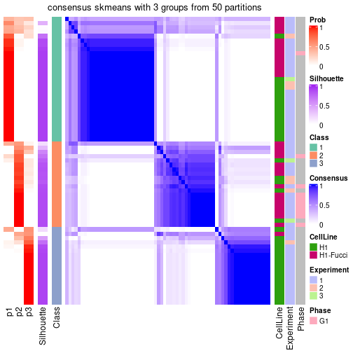</p>

</div>
<div id='tab-node-0112-consensus-heatmap-3'>
<pre><code class="r">consensus_heatmap(res, k = 4)
</code></pre>

<p>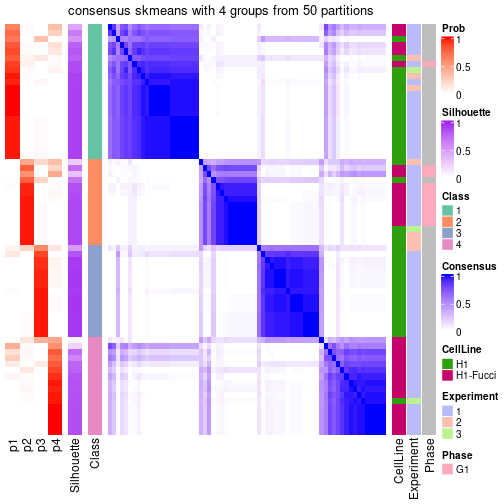</p>

</div>
</div>

Heatmaps for the membership of samples in all partitions to see how consistent they are:


<script>
$( function() {
	$( '#tabs-node-0112-membership-heatmap' ).tabs();
} );
</script>
<div id='tabs-node-0112-membership-heatmap'>
<ul>
<li><a href='#tab-node-0112-membership-heatmap-1'>k = 2</a></li>
<li><a href='#tab-node-0112-membership-heatmap-2'>k = 3</a></li>
<li><a href='#tab-node-0112-membership-heatmap-3'>k = 4</a></li>
</ul>
<div id='tab-node-0112-membership-heatmap-1'>
<pre><code class="r">membership_heatmap(res, k = 2)
</code></pre>

<p></p>

</div>
<div id='tab-node-0112-membership-heatmap-2'>
<pre><code class="r">membership_heatmap(res, k = 3)
</code></pre>

<p></p>

</div>
<div id='tab-node-0112-membership-heatmap-3'>
<pre><code class="r">membership_heatmap(res, k = 4)
</code></pre>

<p></p>

</div>
</div>

As soon as the classes for columns are determined, the signatures
that are significantly different between subgroups can be looked for. 
Following are the heatmaps for signatures.


Signature heatmaps where rows are scaled:


<script>
$( function() {
	$( '#tabs-node-0112-get-signatures' ).tabs();
} );
</script>
<div id='tabs-node-0112-get-signatures'>
<ul>
<li><a href='#tab-node-0112-get-signatures-1'>k = 2</a></li>
<li><a href='#tab-node-0112-get-signatures-2'>k = 3</a></li>
<li><a href='#tab-node-0112-get-signatures-3'>k = 4</a></li>
</ul>
<div id='tab-node-0112-get-signatures-1'>
<pre><code class="r">get_signatures(res, k = 2)
</code></pre>

<p></p>

</div>
<div id='tab-node-0112-get-signatures-2'>
<pre><code class="r">get_signatures(res, k = 3)
</code></pre>

<p></p>

</div>
<div id='tab-node-0112-get-signatures-3'>
<pre><code class="r">get_signatures(res, k = 4)
</code></pre>

<p></p>

</div>
</div>


Signature heatmaps where rows are not scaled:


<script>
$( function() {
	$( '#tabs-node-0112-get-signatures-no-scale' ).tabs();
} );
</script>
<div id='tabs-node-0112-get-signatures-no-scale'>
<ul>
<li><a href='#tab-node-0112-get-signatures-no-scale-1'>k = 2</a></li>
<li><a href='#tab-node-0112-get-signatures-no-scale-2'>k = 3</a></li>
<li><a href='#tab-node-0112-get-signatures-no-scale-3'>k = 4</a></li>
</ul>
<div id='tab-node-0112-get-signatures-no-scale-1'>
<pre><code class="r">get_signatures(res, k = 2, scale_rows = FALSE)
</code></pre>

<p></p>

</div>
<div id='tab-node-0112-get-signatures-no-scale-2'>
<pre><code class="r">get_signatures(res, k = 3, scale_rows = FALSE)
</code></pre>

<p></p>

</div>
<div id='tab-node-0112-get-signatures-no-scale-3'>
<pre><code class="r">get_signatures(res, k = 4, scale_rows = FALSE)
</code></pre>

<p></p>

</div>
</div>


Compare the overlap of signatures from different k:

```r
compare_signatures(res)
```


`get_signature()` returns a data frame invisibly. To get the list of signatures, the function
call should be assigned to a variable explicitly. In following code, if `plot` argument is set
to `FALSE`, no heatmap is plotted while only the differential analysis is performed.

```r
# code only for demonstration
tb = get_signature(res, k = ..., plot = FALSE)
```

An example of the output of `tb` is:

```
#>   which_row         fdr    mean_1    mean_2 scaled_mean_1 scaled_mean_2 km
#> 1        38 0.042760348  8.373488  9.131774    -0.5533452     0.5164555  1
#> 2        40 0.018707592  7.106213  8.469186    -0.6173731     0.5762149  1
#> 3        55 0.019134737 10.221463 11.207825    -0.6159697     0.5749050  1
#> 4        59 0.006059896  5.921854  7.869574    -0.6899429     0.6439467  1
#> 5        60 0.018055526  8.928898 10.211722    -0.6204761     0.5791110  1
#> 6        98 0.009384629 15.714769 14.887706     0.6635654    -0.6193277  2
...
```

The columns in `tb` are:

1. `which_row`: row indices corresponding to the input matrix.
2. `fdr`: FDR for the differential test. 
3. `mean_x`: The mean value in group x.
4. `scaled_mean_x`: The mean value in group x after rows are scaled.
5. `km`: Row groups if k-means clustering is applied to rows (which is done by automatically selecting number of clusters).

If there are too many signatures, `top_signatures = ...` can be set to only show the 
signatures with the highest FDRs:

```r
# code only for demonstration
# e.g. to show the top 500 most significant rows
tb = get_signature(res, k = ..., top_signatures = 500)
```

If the signatures are defined as these which are uniquely high in current group, `diff_method` argument
can be set to `"uniquely_high_in_one_group"`:

```r
# code only for demonstration
tb = get_signature(res, k = ..., diff_method = "uniquely_high_in_one_group")
```


UMAP plot which shows how samples are separated.


<script>
$( function() {
	$( '#tabs-node-0112-dimension-reduction' ).tabs();
} );
</script>
<div id='tabs-node-0112-dimension-reduction'>
<ul>
<li><a href='#tab-node-0112-dimension-reduction-1'>k = 2</a></li>
<li><a href='#tab-node-0112-dimension-reduction-2'>k = 3</a></li>
<li><a href='#tab-node-0112-dimension-reduction-3'>k = 4</a></li>
</ul>
<div id='tab-node-0112-dimension-reduction-1'>
<pre><code class="r">dimension_reduction(res, k = 2, method = &quot;UMAP&quot;)
</code></pre>

<p></p>

</div>
<div id='tab-node-0112-dimension-reduction-2'>
<pre><code class="r">dimension_reduction(res, k = 3, method = &quot;UMAP&quot;)
</code></pre>

<p></p>

</div>
<div id='tab-node-0112-dimension-reduction-3'>
<pre><code class="r">dimension_reduction(res, k = 4, method = &quot;UMAP&quot;)
</code></pre>

<p></p>

</div>
</div>


Following heatmap shows how subgroups are split when increasing `k`:

```r
collect_classes(res)
```


Test correlation between subgroups and known annotations. If the known
annotation is numeric, one-way ANOVA test is applied, and if the known
annotation is discrete, chi-squared contingency table test is applied.

```r
test_to_known_factors(res)
```

```
#>             n_sample CellLine(p-value) Experiment(p-value) Phase(p-value) k
#> ATC:skmeans       67          7.49e-01               0.835             NA 2
#> ATC:skmeans       58          1.12e-04               0.525             NA 3
#> ATC:skmeans       62          2.40e-07               0.657             NA 4
```


If matrix rows can be associated to genes, consider to use `functional_enrichment(res,
...)` to perform function enrichment for the signature genes. See [this vignette](https://jokergoo.github.io/cola_vignettes/functional_enrichment.html) for more detailed explanations.


 

---------------------------------------------------


### Node012


Parent node: [Node01](#Node01).
Child nodes: 
                [Node0111](#Node0111)
        ,
                [Node0112](#Node0112)
        ,
                Node0121-leaf
        ,
                Node0122-leaf
        ,
                Node0221-leaf
        ,
                Node0222-leaf
        ,
                Node0231-leaf
        ,
                Node0232-leaf
        .


The object with results only for a single top-value method and a single partitioning method 
can be extracted as:

```r
res = res_rh["012"]
```

A summary of `res` and all the functions that can be applied to it:

```r
res
```

```
#> A 'ConsensusPartition' object with k = 2, 3, 4.
#>   On a matrix with 12999 rows and 72 columns.
#>   Top rows (1300) are extracted by 'ATC' method.
#>   Subgroups are detected by 'skmeans' method.
#>   Performed in total 150 partitions by row resampling.
#>   Best k for subgroups seems to be 2.
#> 
#> Following methods can be applied to this 'ConsensusPartition' object:
#>  [1] "cola_report"             "collect_classes"         "collect_plots"          
#>  [4] "collect_stats"           "colnames"                "compare_partitions"     
#>  [7] "compare_signatures"      "consensus_heatmap"       "dimension_reduction"    
#> [10] "functional_enrichment"   "get_anno_col"            "get_anno"               
#> [13] "get_classes"             "get_consensus"           "get_matrix"             
#> [16] "get_membership"          "get_param"               "get_signatures"         
#> [19] "get_stats"               "is_best_k"               "is_stable_k"            
#> [22] "membership_heatmap"      "ncol"                    "nrow"                   
#> [25] "plot_ecdf"               "predict_classes"         "rownames"               
#> [28] "select_partition_number" "show"                    "suggest_best_k"         
#> [31] "test_to_known_factors"   "top_rows_heatmap"
```

`collect_plots()` function collects all the plots made from `res` for all `k` (number of subgroups)
into one single page to provide an easy and fast comparison between different `k`.

```r
collect_plots(res)
```


The plots are:

- The first row: a plot of the eCDF (empirical cumulative distribution
  function) curves of the consensus matrix for each `k` and the heatmap of
  predicted classes for each `k`.
- The second row: heatmaps of the consensus matrix for each `k`.
- The third row: heatmaps of the membership matrix for each `k`.
- The fouth row: heatmaps of the signatures for each `k`.

All the plots in panels can be made by individual functions and they are
plotted later in this section.

`select_partition_number()` produces several plots showing different
statistics for choosing "optimized" `k`. There are following statistics:

- eCDF curves of the consensus matrix for each `k`;
- 1-PAC. [The PAC score](https://en.wikipedia.org/wiki/Consensus_clustering#Over-interpretation_potential_of_consensus_clustering)
  measures the proportion of the ambiguous subgrouping.
- Mean silhouette score.
- Concordance. The mean probability of fiting the consensus subgroup labels in all
  partitions.
- Area increased. Denote $A_k$ as the area under the eCDF curve for current
  `k`, the area increased is defined as $A_k - A_{k-1}$.
- Rand index. The percent of pairs of samples that are both in a same cluster
  or both are not in a same cluster in the partition of k and k-1.
- Jaccard index. The ratio of pairs of samples are both in a same cluster in
  the partition of k and k-1 and the pairs of samples are both in a same
  cluster in the partition k or k-1.

The detailed explanations of these statistics can be found in [the _cola_
vignette](https://jokergoo.github.io/cola_vignettes/cola.html#toc_13).

Generally speaking, higher 1-PAC score, higher mean silhouette score or higher
concordance corresponds to better partition. Rand index and Jaccard index
measure how similar the current partition is compared to partition with `k-1`.
If they are too similar, we won't accept `k` is better than `k-1`.

```r
select_partition_number(res)
```


The numeric values for all these statistics can be obtained by `get_stats()`.

```r
get_stats(res)
```

```
#>   k 1-PAC mean_silhouette concordance area_increased  Rand Jaccard
#> 2 2 1.000           0.982       0.992          0.481 0.518   0.518
#> 3 3 0.895           0.915       0.966          0.320 0.792   0.616
#> 4 4 0.656           0.670       0.829          0.114 0.934   0.821
```

`suggest_best_k()` suggests the best $k$ based on these statistics. The rules are as follows:

- All $k$ with Jaccard index larger than 0.95 are removed because increasing
  $k$ does not provide enough extra information. If all $k$ are removed, it is
  marked as no subgroup is detected.
- For all $k$ with 1-PAC score larger than 0.9, the maximal $k$ is taken as
  the best $k$, and other $k$ are marked as optional $k$.
- If it does not fit the second rule. The $k$ with the maximal vote of the
  highest 1-PAC score, highest mean silhouette, and highest concordance is
  taken as the best $k$.

```r
suggest_best_k(res)
```

```
#> [1] 2
```


Following is the table of the partitions (You need to click the **show/hide
code output** link to see it). The membership matrix (columns with name `p*`)
is inferred by
[`clue::cl_consensus()`](https://www.rdocumentation.org/link/cl_consensus?package=clue)
function with the `SE` method. Basically the value in the membership matrix
represents the probability to belong to a certain group. The finall subgroup
label for an item is determined with the group with highest probability it
belongs to.

In `get_classes()` function, the entropy is calculated from the membership
matrix and the silhouette score is calculated from the consensus matrix.


<script>
$( function() {
	$( '#tabs-node-012-get-classes' ).tabs();
} );
</script>
<div id='tabs-node-012-get-classes'>
<ul>
<li><a href='#tab-node-012-get-classes-1'>k = 2</a></li>
<li><a href='#tab-node-012-get-classes-2'>k = 3</a></li>
<li><a href='#tab-node-012-get-classes-3'>k = 4</a></li>
</ul>

<div id='tab-node-012-get-classes-1'>
<p><a id='tab-node-012-get-classes-1-a' style='color:#0366d6' href='#'>show/hide code output</a></p>
<pre><code class="r">cbind(get_classes(res, k = 2), get_membership(res, k = 2))
</code></pre>

<pre><code>#&gt;             class entropy silhouette   p1   p2
#&gt; H1_Exp1.009     1   0.000      0.995 1.00 0.00
#&gt; H1_Exp1.019     1   0.469      0.890 0.90 0.10
#&gt; H1_Exp1.050     1   0.000      0.995 1.00 0.00
#&gt; H1_Exp1.052     1   0.000      0.995 1.00 0.00
#&gt; H1_Exp1.054     1   0.000      0.995 1.00 0.00
#&gt; H1_Exp1.055     1   0.000      0.995 1.00 0.00
#&gt; H1_Exp1.057     1   0.000      0.995 1.00 0.00
#&gt; H1_Exp1.059     2   0.000      0.986 0.00 1.00
#&gt; H1_Exp1.069     2   0.000      0.986 0.00 1.00
#&gt; H1_Exp2.082     1   0.000      0.995 1.00 0.00
#&gt; H1_Exp2.093     1   0.000      0.995 1.00 0.00
#&gt; H1_Exp2.112     1   0.000      0.995 1.00 0.00
#&gt; H1_Exp2.116     1   0.000      0.995 1.00 0.00
#&gt; H1_Exp2.123     2   0.000      0.986 0.00 1.00
#&gt; H1_Exp2.130     1   0.000      0.995 1.00 0.00
#&gt; H1_Exp2.133     1   0.000      0.995 1.00 0.00
#&gt; H1_Exp2.135     2   0.402      0.906 0.08 0.92
#&gt; H1_Exp2.139     1   0.000      0.995 1.00 0.00
#&gt; H1_Exp2.140     1   0.000      0.995 1.00 0.00
#&gt; H1_Exp2.146     2   0.000      0.986 0.00 1.00
#&gt; H1_Exp2.150     2   0.000      0.986 0.00 1.00
#&gt; H1_Exp2.154     1   0.000      0.995 1.00 0.00
#&gt; H1_Exp3.220     2   0.000      0.986 0.00 1.00
#&gt; H1_Exp3.233     1   0.000      0.995 1.00 0.00
#&gt; H1_Exp3.248     1   0.000      0.995 1.00 0.00
#&gt; H1_Exp3.277     1   0.000      0.995 1.00 0.00
#&gt; H1_Exp3.283     1   0.000      0.995 1.00 0.00
#&gt; H1_Exp3.284     1   0.000      0.995 1.00 0.00
#&gt; G2_Exp1.050     1   0.000      0.995 1.00 0.00
#&gt; G2_Exp1.042     1   0.000      0.995 1.00 0.00
#&gt; G2_Exp1.022     1   0.469      0.890 0.90 0.10
#&gt; G2_Exp1.072     1   0.000      0.995 1.00 0.00
#&gt; G2_Exp1.074     1   0.000      0.995 1.00 0.00
#&gt; G2_Exp1.070     1   0.000      0.995 1.00 0.00
#&gt; G2_Exp1.021     1   0.000      0.995 1.00 0.00
#&gt; G2_Exp1.008     1   0.000      0.995 1.00 0.00
#&gt; G2_Exp1.048     2   0.000      0.986 0.00 1.00
#&gt; G2_Exp1.062     1   0.000      0.995 1.00 0.00
#&gt; G2_Exp1.066     1   0.000      0.995 1.00 0.00
#&gt; G2_Exp1.023     1   0.000      0.995 1.00 0.00
#&gt; S_Exp1.071      2   0.000      0.986 0.00 1.00
#&gt; S_Exp1.032      1   0.000      0.995 1.00 0.00
#&gt; S_Exp1.035      2   0.881      0.568 0.30 0.70
#&gt; S_Exp1.063      2   0.000      0.986 0.00 1.00
#&gt; S_Exp1.078      2   0.000      0.986 0.00 1.00
#&gt; S_Exp1.023      2   0.000      0.986 0.00 1.00
#&gt; S_Exp1.046      2   0.000      0.986 0.00 1.00
#&gt; S_Exp1.008      2   0.000      0.986 0.00 1.00
#&gt; S_Exp1.006      2   0.000      0.986 0.00 1.00
#&gt; S_Exp1.064      2   0.000      0.986 0.00 1.00
#&gt; S_Exp1.073      2   0.000      0.986 0.00 1.00
#&gt; S_Exp1.014      2   0.000      0.986 0.00 1.00
#&gt; S_Exp1.039      2   0.000      0.986 0.00 1.00
#&gt; S_Exp1.054      2   0.000      0.986 0.00 1.00
#&gt; S_Exp1.012      2   0.000      0.986 0.00 1.00
#&gt; S_Exp1.070      2   0.000      0.986 0.00 1.00
#&gt; S_Exp1.020      1   0.000      0.995 1.00 0.00
#&gt; S_Exp1.015      2   0.000      0.986 0.00 1.00
#&gt; S_Exp1.066      2   0.000      0.986 0.00 1.00
#&gt; S_Exp1.040      2   0.000      0.986 0.00 1.00
#&gt; S_Exp1.026      1   0.000      0.995 1.00 0.00
#&gt; S_Exp1.017      2   0.000      0.986 0.00 1.00
#&gt; S_Exp1.010      2   0.000      0.986 0.00 1.00
#&gt; G1_Exp1.059     1   0.000      0.995 1.00 0.00
#&gt; G1_Exp1.085     1   0.000      0.995 1.00 0.00
#&gt; G1_Exp1.031     1   0.000      0.995 1.00 0.00
#&gt; G1_Exp1.078     1   0.000      0.995 1.00 0.00
#&gt; G1_Exp1.034     1   0.000      0.995 1.00 0.00
#&gt; G1_Exp1.020     1   0.000      0.995 1.00 0.00
#&gt; G1_Exp1.011     1   0.000      0.995 1.00 0.00
#&gt; G1_Exp1.063     1   0.000      0.995 1.00 0.00
#&gt; G1_Exp1.046     1   0.000      0.995 1.00 0.00
</code></pre>

<script>
$('#tab-node-012-get-classes-1-a').parent().next().next().hide();
$('#tab-node-012-get-classes-1-a').click(function(){
  $('#tab-node-012-get-classes-1-a').parent().next().next().toggle();
  return(false);
});
</script>
</div>

<div id='tab-node-012-get-classes-2'>
<p><a id='tab-node-012-get-classes-2-a' style='color:#0366d6' href='#'>show/hide code output</a></p>
<pre><code class="r">cbind(get_classes(res, k = 3), get_membership(res, k = 3))
</code></pre>

<pre><code>#&gt;             class entropy silhouette   p1   p2   p3
#&gt; H1_Exp1.009     1  0.0000     0.9886 1.00 0.00 0.00
#&gt; H1_Exp1.019     3  0.0000     0.8744 0.00 0.00 1.00
#&gt; H1_Exp1.050     3  0.0000     0.8744 0.00 0.00 1.00
#&gt; H1_Exp1.052     3  0.6126     0.3800 0.40 0.00 0.60
#&gt; H1_Exp1.054     3  0.2959     0.8330 0.10 0.00 0.90
#&gt; H1_Exp1.055     3  0.0000     0.8744 0.00 0.00 1.00
#&gt; H1_Exp1.057     1  0.0892     0.9686 0.98 0.00 0.02
#&gt; H1_Exp1.059     2  0.0000     0.9717 0.00 1.00 0.00
#&gt; H1_Exp1.069     2  0.0000     0.9717 0.00 1.00 0.00
#&gt; H1_Exp2.082     1  0.0000     0.9886 1.00 0.00 0.00
#&gt; H1_Exp2.093     1  0.0000     0.9886 1.00 0.00 0.00
#&gt; H1_Exp2.112     1  0.0000     0.9886 1.00 0.00 0.00
#&gt; H1_Exp2.116     1  0.0000     0.9886 1.00 0.00 0.00
#&gt; H1_Exp2.123     2  0.0000     0.9717 0.00 1.00 0.00
#&gt; H1_Exp2.130     1  0.0000     0.9886 1.00 0.00 0.00
#&gt; H1_Exp2.133     1  0.0000     0.9886 1.00 0.00 0.00
#&gt; H1_Exp2.135     2  0.5016     0.6324 0.24 0.76 0.00
#&gt; H1_Exp2.139     1  0.0000     0.9886 1.00 0.00 0.00
#&gt; H1_Exp2.140     1  0.0000     0.9886 1.00 0.00 0.00
#&gt; H1_Exp2.146     2  0.0000     0.9717 0.00 1.00 0.00
#&gt; H1_Exp2.150     2  0.0000     0.9717 0.00 1.00 0.00
#&gt; H1_Exp2.154     1  0.0000     0.9886 1.00 0.00 0.00
#&gt; H1_Exp3.220     2  0.0000     0.9717 0.00 1.00 0.00
#&gt; H1_Exp3.233     1  0.0000     0.9886 1.00 0.00 0.00
#&gt; H1_Exp3.248     1  0.0000     0.9886 1.00 0.00 0.00
#&gt; H1_Exp3.277     1  0.0000     0.9886 1.00 0.00 0.00
#&gt; H1_Exp3.283     1  0.0000     0.9886 1.00 0.00 0.00
#&gt; H1_Exp3.284     1  0.0000     0.9886 1.00 0.00 0.00
#&gt; G2_Exp1.050     1  0.0000     0.9886 1.00 0.00 0.00
#&gt; G2_Exp1.042     1  0.0000     0.9886 1.00 0.00 0.00
#&gt; G2_Exp1.022     3  0.0000     0.8744 0.00 0.00 1.00
#&gt; G2_Exp1.072     1  0.0000     0.9886 1.00 0.00 0.00
#&gt; G2_Exp1.074     1  0.0000     0.9886 1.00 0.00 0.00
#&gt; G2_Exp1.070     1  0.0892     0.9688 0.98 0.00 0.02
#&gt; G2_Exp1.021     3  0.0000     0.8744 0.00 0.00 1.00
#&gt; G2_Exp1.008     1  0.0000     0.9886 1.00 0.00 0.00
#&gt; G2_Exp1.048     3  0.0000     0.8744 0.00 0.00 1.00
#&gt; G2_Exp1.062     3  0.5216     0.6634 0.26 0.00 0.74
#&gt; G2_Exp1.066     1  0.0000     0.9886 1.00 0.00 0.00
#&gt; G2_Exp1.023     3  0.3340     0.8223 0.12 0.00 0.88
#&gt; S_Exp1.071      2  0.0000     0.9717 0.00 1.00 0.00
#&gt; S_Exp1.032      1  0.0000     0.9886 1.00 0.00 0.00
#&gt; S_Exp1.035      3  0.0000     0.8744 0.00 0.00 1.00
#&gt; S_Exp1.063      2  0.0000     0.9717 0.00 1.00 0.00
#&gt; S_Exp1.078      2  0.0000     0.9717 0.00 1.00 0.00
#&gt; S_Exp1.023      3  0.0000     0.8744 0.00 0.00 1.00
#&gt; S_Exp1.046      2  0.0000     0.9717 0.00 1.00 0.00
#&gt; S_Exp1.008      2  0.0000     0.9717 0.00 1.00 0.00
#&gt; S_Exp1.006      2  0.0000     0.9717 0.00 1.00 0.00
#&gt; S_Exp1.064      2  0.0000     0.9717 0.00 1.00 0.00
#&gt; S_Exp1.073      2  0.0000     0.9717 0.00 1.00 0.00
#&gt; S_Exp1.014      2  0.0000     0.9717 0.00 1.00 0.00
#&gt; S_Exp1.039      2  0.0000     0.9717 0.00 1.00 0.00
#&gt; S_Exp1.054      3  0.3340     0.7796 0.00 0.12 0.88
#&gt; S_Exp1.012      2  0.0000     0.9717 0.00 1.00 0.00
#&gt; S_Exp1.070      3  0.0000     0.8744 0.00 0.00 1.00
#&gt; S_Exp1.020      1  0.0000     0.9886 1.00 0.00 0.00
#&gt; S_Exp1.015      2  0.5216     0.6358 0.00 0.74 0.26
#&gt; S_Exp1.066      3  0.6309    -0.0667 0.00 0.50 0.50
#&gt; S_Exp1.040      2  0.0000     0.9717 0.00 1.00 0.00
#&gt; S_Exp1.026      3  0.3686     0.8084 0.14 0.00 0.86
#&gt; S_Exp1.017      2  0.0000     0.9717 0.00 1.00 0.00
#&gt; S_Exp1.010      2  0.0000     0.9717 0.00 1.00 0.00
#&gt; G1_Exp1.059     1  0.0000     0.9886 1.00 0.00 0.00
#&gt; G1_Exp1.085     1  0.0000     0.9886 1.00 0.00 0.00
#&gt; G1_Exp1.031     1  0.0000     0.9886 1.00 0.00 0.00
#&gt; G1_Exp1.078     1  0.5560     0.5212 0.70 0.00 0.30
#&gt; G1_Exp1.034     1  0.0000     0.9886 1.00 0.00 0.00
#&gt; G1_Exp1.020     1  0.0000     0.9886 1.00 0.00 0.00
#&gt; G1_Exp1.011     1  0.0000     0.9886 1.00 0.00 0.00
#&gt; G1_Exp1.063     1  0.0000     0.9886 1.00 0.00 0.00
#&gt; G1_Exp1.046     1  0.0000     0.9886 1.00 0.00 0.00
</code></pre>

<script>
$('#tab-node-012-get-classes-2-a').parent().next().next().hide();
$('#tab-node-012-get-classes-2-a').click(function(){
  $('#tab-node-012-get-classes-2-a').parent().next().next().toggle();
  return(false);
});
</script>
</div>

<div id='tab-node-012-get-classes-3'>
<p><a id='tab-node-012-get-classes-3-a' style='color:#0366d6' href='#'>show/hide code output</a></p>
<pre><code class="r">cbind(get_classes(res, k = 4), get_membership(res, k = 4))
</code></pre>

<pre><code>#&gt;             class entropy silhouette   p1   p2   p3   p4
#&gt; H1_Exp1.009     1  0.3975     0.6471 0.76 0.00 0.00 0.24
#&gt; H1_Exp1.019     3  0.0000     0.7078 0.00 0.00 1.00 0.00
#&gt; H1_Exp1.050     3  0.1637     0.6941 0.00 0.00 0.94 0.06
#&gt; H1_Exp1.052     4  0.7775     0.4443 0.38 0.00 0.24 0.38
#&gt; H1_Exp1.054     3  0.6714     0.1314 0.10 0.00 0.54 0.36
#&gt; H1_Exp1.055     3  0.3172     0.6347 0.00 0.00 0.84 0.16
#&gt; H1_Exp1.057     1  0.5392     0.4763 0.68 0.00 0.04 0.28
#&gt; H1_Exp1.059     2  0.1637     0.9480 0.00 0.94 0.00 0.06
#&gt; H1_Exp1.069     2  0.1637     0.9480 0.00 0.94 0.00 0.06
#&gt; H1_Exp2.082     1  0.2647     0.7196 0.88 0.00 0.00 0.12
#&gt; H1_Exp2.093     1  0.2921     0.7076 0.86 0.00 0.00 0.14
#&gt; H1_Exp2.112     1  0.2011     0.7411 0.92 0.00 0.00 0.08
#&gt; H1_Exp2.116     4  0.5487     0.1419 0.40 0.00 0.02 0.58
#&gt; H1_Exp2.123     2  0.3172     0.8724 0.00 0.84 0.00 0.16
#&gt; H1_Exp2.130     1  0.1637     0.7687 0.94 0.00 0.00 0.06
#&gt; H1_Exp2.133     1  0.4277     0.5812 0.72 0.00 0.00 0.28
#&gt; H1_Exp2.135     4  0.7653     0.1242 0.24 0.30 0.00 0.46
#&gt; H1_Exp2.139     1  0.4977     0.1620 0.54 0.00 0.00 0.46
#&gt; H1_Exp2.140     1  0.2011     0.7654 0.92 0.00 0.00 0.08
#&gt; H1_Exp2.146     2  0.1637     0.9480 0.00 0.94 0.00 0.06
#&gt; H1_Exp2.150     2  0.0000     0.9564 0.00 1.00 0.00 0.00
#&gt; H1_Exp2.154     1  0.5962     0.4152 0.66 0.00 0.08 0.26
#&gt; H1_Exp3.220     2  0.4277     0.7333 0.00 0.72 0.00 0.28
#&gt; H1_Exp3.233     1  0.1637     0.7639 0.94 0.00 0.00 0.06
#&gt; H1_Exp3.248     1  0.1211     0.7679 0.96 0.00 0.00 0.04
#&gt; H1_Exp3.277     1  0.3801     0.6454 0.78 0.00 0.00 0.22
#&gt; H1_Exp3.283     1  0.0707     0.7685 0.98 0.00 0.00 0.02
#&gt; H1_Exp3.284     1  0.0000     0.7666 1.00 0.00 0.00 0.00
#&gt; G2_Exp1.050     1  0.1637     0.7611 0.94 0.00 0.00 0.06
#&gt; G2_Exp1.042     1  0.4522     0.4180 0.68 0.00 0.00 0.32
#&gt; G2_Exp1.022     3  0.1637     0.6955 0.00 0.00 0.94 0.06
#&gt; G2_Exp1.072     1  0.3172     0.7000 0.84 0.00 0.00 0.16
#&gt; G2_Exp1.074     1  0.2921     0.7135 0.86 0.00 0.00 0.14
#&gt; G2_Exp1.070     1  0.5594     0.0293 0.52 0.00 0.02 0.46
#&gt; G2_Exp1.021     3  0.6500     0.2649 0.12 0.00 0.62 0.26
#&gt; G2_Exp1.008     1  0.3610     0.6564 0.80 0.00 0.00 0.20
#&gt; G2_Exp1.048     3  0.1211     0.7011 0.00 0.04 0.96 0.00
#&gt; G2_Exp1.062     4  0.7775     0.4768 0.38 0.00 0.24 0.38
#&gt; G2_Exp1.066     1  0.2345     0.7469 0.90 0.00 0.00 0.10
#&gt; G2_Exp1.023     3  0.7707    -0.3176 0.24 0.00 0.44 0.32
#&gt; S_Exp1.071      2  0.0707     0.9549 0.00 0.98 0.00 0.02
#&gt; S_Exp1.032      1  0.2647     0.7254 0.88 0.00 0.00 0.12
#&gt; S_Exp1.035      3  0.0000     0.7078 0.00 0.00 1.00 0.00
#&gt; S_Exp1.063      2  0.0000     0.9564 0.00 1.00 0.00 0.00
#&gt; S_Exp1.078      2  0.0000     0.9564 0.00 1.00 0.00 0.00
#&gt; S_Exp1.023      3  0.0000     0.7078 0.00 0.00 1.00 0.00
#&gt; S_Exp1.046      2  0.0707     0.9497 0.00 0.98 0.00 0.02
#&gt; S_Exp1.008      2  0.0000     0.9564 0.00 1.00 0.00 0.00
#&gt; S_Exp1.006      2  0.1637     0.9480 0.00 0.94 0.00 0.06
#&gt; S_Exp1.064      2  0.0000     0.9564 0.00 1.00 0.00 0.00
#&gt; S_Exp1.073      2  0.1211     0.9518 0.00 0.96 0.00 0.04
#&gt; S_Exp1.014      2  0.0000     0.9564 0.00 1.00 0.00 0.00
#&gt; S_Exp1.039      2  0.1637     0.9480 0.00 0.94 0.00 0.06
#&gt; S_Exp1.054      3  0.5657     0.5756 0.00 0.16 0.72 0.12
#&gt; S_Exp1.012      2  0.0000     0.9564 0.00 1.00 0.00 0.00
#&gt; S_Exp1.070      3  0.1637     0.6932 0.00 0.06 0.94 0.00
#&gt; S_Exp1.020      1  0.4134     0.5696 0.74 0.00 0.00 0.26
#&gt; S_Exp1.015      3  0.4977     0.1985 0.00 0.46 0.54 0.00
#&gt; S_Exp1.066      3  0.4522     0.4780 0.00 0.32 0.68 0.00
#&gt; S_Exp1.040      2  0.1637     0.9480 0.00 0.94 0.00 0.06
#&gt; S_Exp1.026      4  0.7581     0.2370 0.20 0.00 0.36 0.44
#&gt; S_Exp1.017      2  0.0000     0.9564 0.00 1.00 0.00 0.00
#&gt; S_Exp1.010      2  0.0000     0.9564 0.00 1.00 0.00 0.00
#&gt; G1_Exp1.059     1  0.2345     0.7477 0.90 0.00 0.00 0.10
#&gt; G1_Exp1.085     1  0.4624     0.4077 0.66 0.00 0.00 0.34
#&gt; G1_Exp1.031     1  0.1211     0.7571 0.96 0.00 0.00 0.04
#&gt; G1_Exp1.078     4  0.7544     0.4892 0.34 0.00 0.20 0.46
#&gt; G1_Exp1.034     1  0.2647     0.7573 0.88 0.00 0.00 0.12
#&gt; G1_Exp1.020     1  0.2647     0.7334 0.88 0.00 0.00 0.12
#&gt; G1_Exp1.011     1  0.2345     0.7538 0.90 0.00 0.00 0.10
#&gt; G1_Exp1.063     1  0.2647     0.7273 0.88 0.00 0.00 0.12
#&gt; G1_Exp1.046     1  0.0707     0.7682 0.98 0.00 0.00 0.02
</code></pre>

<script>
$('#tab-node-012-get-classes-3-a').parent().next().next().hide();
$('#tab-node-012-get-classes-3-a').click(function(){
  $('#tab-node-012-get-classes-3-a').parent().next().next().toggle();
  return(false);
});
</script>
</div>
</div>

Heatmaps for the consensus matrix. It visualizes the probability of two
samples to be in a same group.


<script>
$( function() {
	$( '#tabs-node-012-consensus-heatmap' ).tabs();
} );
</script>
<div id='tabs-node-012-consensus-heatmap'>
<ul>
<li><a href='#tab-node-012-consensus-heatmap-1'>k = 2</a></li>
<li><a href='#tab-node-012-consensus-heatmap-2'>k = 3</a></li>
<li><a href='#tab-node-012-consensus-heatmap-3'>k = 4</a></li>
</ul>
<div id='tab-node-012-consensus-heatmap-1'>
<pre><code class="r">consensus_heatmap(res, k = 2)
</code></pre>

<p></p>

</div>
<div id='tab-node-012-consensus-heatmap-2'>
<pre><code class="r">consensus_heatmap(res, k = 3)
</code></pre>

<p></p>

</div>
<div id='tab-node-012-consensus-heatmap-3'>
<pre><code class="r">consensus_heatmap(res, k = 4)
</code></pre>

<p></p>

</div>
</div>

Heatmaps for the membership of samples in all partitions to see how consistent they are:


<script>
$( function() {
	$( '#tabs-node-012-membership-heatmap' ).tabs();
} );
</script>
<div id='tabs-node-012-membership-heatmap'>
<ul>
<li><a href='#tab-node-012-membership-heatmap-1'>k = 2</a></li>
<li><a href='#tab-node-012-membership-heatmap-2'>k = 3</a></li>
<li><a href='#tab-node-012-membership-heatmap-3'>k = 4</a></li>
</ul>
<div id='tab-node-012-membership-heatmap-1'>
<pre><code class="r">membership_heatmap(res, k = 2)
</code></pre>

<p></p>

</div>
<div id='tab-node-012-membership-heatmap-2'>
<pre><code class="r">membership_heatmap(res, k = 3)
</code></pre>

<p></p>

</div>
<div id='tab-node-012-membership-heatmap-3'>
<pre><code class="r">membership_heatmap(res, k = 4)
</code></pre>

<p></p>

</div>
</div>

As soon as the classes for columns are determined, the signatures
that are significantly different between subgroups can be looked for. 
Following are the heatmaps for signatures.


Signature heatmaps where rows are scaled:


<script>
$( function() {
	$( '#tabs-node-012-get-signatures' ).tabs();
} );
</script>
<div id='tabs-node-012-get-signatures'>
<ul>
<li><a href='#tab-node-012-get-signatures-1'>k = 2</a></li>
<li><a href='#tab-node-012-get-signatures-2'>k = 3</a></li>
<li><a href='#tab-node-012-get-signatures-3'>k = 4</a></li>
</ul>
<div id='tab-node-012-get-signatures-1'>
<pre><code class="r">get_signatures(res, k = 2)
</code></pre>

<p></p>

</div>
<div id='tab-node-012-get-signatures-2'>
<pre><code class="r">get_signatures(res, k = 3)
</code></pre>

<p></p>

</div>
<div id='tab-node-012-get-signatures-3'>
<pre><code class="r">get_signatures(res, k = 4)
</code></pre>

<p></p>

</div>
</div>


Signature heatmaps where rows are not scaled:


<script>
$( function() {
	$( '#tabs-node-012-get-signatures-no-scale' ).tabs();
} );
</script>
<div id='tabs-node-012-get-signatures-no-scale'>
<ul>
<li><a href='#tab-node-012-get-signatures-no-scale-1'>k = 2</a></li>
<li><a href='#tab-node-012-get-signatures-no-scale-2'>k = 3</a></li>
<li><a href='#tab-node-012-get-signatures-no-scale-3'>k = 4</a></li>
</ul>
<div id='tab-node-012-get-signatures-no-scale-1'>
<pre><code class="r">get_signatures(res, k = 2, scale_rows = FALSE)
</code></pre>

<p></p>

</div>
<div id='tab-node-012-get-signatures-no-scale-2'>
<pre><code class="r">get_signatures(res, k = 3, scale_rows = FALSE)
</code></pre>

<p></p>

</div>
<div id='tab-node-012-get-signatures-no-scale-3'>
<pre><code class="r">get_signatures(res, k = 4, scale_rows = FALSE)
</code></pre>

<p></p>

</div>
</div>


Compare the overlap of signatures from different k:

```r
compare_signatures(res)
```


`get_signature()` returns a data frame invisibly. To get the list of signatures, the function
call should be assigned to a variable explicitly. In following code, if `plot` argument is set
to `FALSE`, no heatmap is plotted while only the differential analysis is performed.

```r
# code only for demonstration
tb = get_signature(res, k = ..., plot = FALSE)
```

An example of the output of `tb` is:

```
#>   which_row         fdr    mean_1    mean_2 scaled_mean_1 scaled_mean_2 km
#> 1        38 0.042760348  8.373488  9.131774    -0.5533452     0.5164555  1
#> 2        40 0.018707592  7.106213  8.469186    -0.6173731     0.5762149  1
#> 3        55 0.019134737 10.221463 11.207825    -0.6159697     0.5749050  1
#> 4        59 0.006059896  5.921854  7.869574    -0.6899429     0.6439467  1
#> 5        60 0.018055526  8.928898 10.211722    -0.6204761     0.5791110  1
#> 6        98 0.009384629 15.714769 14.887706     0.6635654    -0.6193277  2
...
```

The columns in `tb` are:

1. `which_row`: row indices corresponding to the input matrix.
2. `fdr`: FDR for the differential test. 
3. `mean_x`: The mean value in group x.
4. `scaled_mean_x`: The mean value in group x after rows are scaled.
5. `km`: Row groups if k-means clustering is applied to rows (which is done by automatically selecting number of clusters).

If there are too many signatures, `top_signatures = ...` can be set to only show the 
signatures with the highest FDRs:

```r
# code only for demonstration
# e.g. to show the top 500 most significant rows
tb = get_signature(res, k = ..., top_signatures = 500)
```

If the signatures are defined as these which are uniquely high in current group, `diff_method` argument
can be set to `"uniquely_high_in_one_group"`:

```r
# code only for demonstration
tb = get_signature(res, k = ..., diff_method = "uniquely_high_in_one_group")
```


UMAP plot which shows how samples are separated.


<script>
$( function() {
	$( '#tabs-node-012-dimension-reduction' ).tabs();
} );
</script>
<div id='tabs-node-012-dimension-reduction'>
<ul>
<li><a href='#tab-node-012-dimension-reduction-1'>k = 2</a></li>
<li><a href='#tab-node-012-dimension-reduction-2'>k = 3</a></li>
<li><a href='#tab-node-012-dimension-reduction-3'>k = 4</a></li>
</ul>
<div id='tab-node-012-dimension-reduction-1'>
<pre><code class="r">dimension_reduction(res, k = 2, method = &quot;UMAP&quot;)
</code></pre>

<p></p>

</div>
<div id='tab-node-012-dimension-reduction-2'>
<pre><code class="r">dimension_reduction(res, k = 3, method = &quot;UMAP&quot;)
</code></pre>

<p></p>

</div>
<div id='tab-node-012-dimension-reduction-3'>
<pre><code class="r">dimension_reduction(res, k = 4, method = &quot;UMAP&quot;)
</code></pre>

<p></p>

</div>
</div>


Following heatmap shows how subgroups are split when increasing `k`:

```r
collect_classes(res)
```

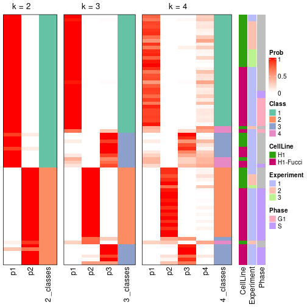


Test correlation between subgroups and known annotations. If the known
annotation is numeric, one-way ANOVA test is applied, and if the known
annotation is discrete, chi-squared contingency table test is applied.

```r
test_to_known_factors(res)
```

```
#>             n_sample CellLine(p-value) Experiment(p-value) Phase(p-value) k
#> ATC:skmeans       72            0.0929              0.3569       3.15e-05 2
#> ATC:skmeans       70            0.3592              0.0552       9.84e-06 3
#> ATC:skmeans       55            0.5074              0.1181       7.87e-05 4
```


If matrix rows can be associated to genes, consider to use `functional_enrichment(res,
...)` to perform function enrichment for the signature genes. See [this vignette](https://jokergoo.github.io/cola_vignettes/functional_enrichment.html) for more detailed explanations.


 

---------------------------------------------------


### Node02


Parent node: [Node0](#Node0).
Child nodes: 
                [Node011](#Node011)
        ,
                [Node012](#Node012)
        ,
                Node021-leaf
        ,
                [Node022](#Node022)
        ,
                [Node023](#Node023)
        .


The object with results only for a single top-value method and a single partitioning method 
can be extracted as:

```r
res = res_rh["02"]
```

A summary of `res` and all the functions that can be applied to it:

```r
res
```

```
#> A 'ConsensusPartition' object with k = 2, 3, 4.
#>   On a matrix with 13002 rows and 239 columns.
#>   Top rows (1300) are extracted by 'ATC' method.
#>   Subgroups are detected by 'skmeans' method.
#>   Performed in total 150 partitions by row resampling.
#>   Best k for subgroups seems to be 3.
#> 
#> Following methods can be applied to this 'ConsensusPartition' object:
#>  [1] "cola_report"             "collect_classes"         "collect_plots"          
#>  [4] "collect_stats"           "colnames"                "compare_partitions"     
#>  [7] "compare_signatures"      "consensus_heatmap"       "dimension_reduction"    
#> [10] "functional_enrichment"   "get_anno_col"            "get_anno"               
#> [13] "get_classes"             "get_consensus"           "get_matrix"             
#> [16] "get_membership"          "get_param"               "get_signatures"         
#> [19] "get_stats"               "is_best_k"               "is_stable_k"            
#> [22] "membership_heatmap"      "ncol"                    "nrow"                   
#> [25] "plot_ecdf"               "predict_classes"         "rownames"               
#> [28] "select_partition_number" "show"                    "suggest_best_k"         
#> [31] "test_to_known_factors"   "top_rows_heatmap"
```

`collect_plots()` function collects all the plots made from `res` for all `k` (number of subgroups)
into one single page to provide an easy and fast comparison between different `k`.

```r
collect_plots(res)
```


The plots are:

- The first row: a plot of the eCDF (empirical cumulative distribution
  function) curves of the consensus matrix for each `k` and the heatmap of
  predicted classes for each `k`.
- The second row: heatmaps of the consensus matrix for each `k`.
- The third row: heatmaps of the membership matrix for each `k`.
- The fouth row: heatmaps of the signatures for each `k`.

All the plots in panels can be made by individual functions and they are
plotted later in this section.

`select_partition_number()` produces several plots showing different
statistics for choosing "optimized" `k`. There are following statistics:

- eCDF curves of the consensus matrix for each `k`;
- 1-PAC. [The PAC score](https://en.wikipedia.org/wiki/Consensus_clustering#Over-interpretation_potential_of_consensus_clustering)
  measures the proportion of the ambiguous subgrouping.
- Mean silhouette score.
- Concordance. The mean probability of fiting the consensus subgroup labels in all
  partitions.
- Area increased. Denote $A_k$ as the area under the eCDF curve for current
  `k`, the area increased is defined as $A_k - A_{k-1}$.
- Rand index. The percent of pairs of samples that are both in a same cluster
  or both are not in a same cluster in the partition of k and k-1.
- Jaccard index. The ratio of pairs of samples are both in a same cluster in
  the partition of k and k-1 and the pairs of samples are both in a same
  cluster in the partition k or k-1.

The detailed explanations of these statistics can be found in [the _cola_
vignette](https://jokergoo.github.io/cola_vignettes/cola.html#toc_13).

Generally speaking, higher 1-PAC score, higher mean silhouette score or higher
concordance corresponds to better partition. Rand index and Jaccard index
measure how similar the current partition is compared to partition with `k-1`.
If they are too similar, we won't accept `k` is better than `k-1`.

```r
select_partition_number(res)
```


The numeric values for all these statistics can be obtained by `get_stats()`.

```r
get_stats(res)
```

```
#>   k 1-PAC mean_silhouette concordance area_increased  Rand Jaccard
#> 2 2 0.871           0.913       0.959          0.498 0.503   0.503
#> 3 3 0.908           0.929       0.969          0.345 0.707   0.480
#> 4 4 0.865           0.865       0.941          0.120 0.846   0.580
```

`suggest_best_k()` suggests the best $k$ based on these statistics. The rules are as follows:

- All $k$ with Jaccard index larger than 0.95 are removed because increasing
  $k$ does not provide enough extra information. If all $k$ are removed, it is
  marked as no subgroup is detected.
- For all $k$ with 1-PAC score larger than 0.9, the maximal $k$ is taken as
  the best $k$, and other $k$ are marked as optional $k$.
- If it does not fit the second rule. The $k$ with the maximal vote of the
  highest 1-PAC score, highest mean silhouette, and highest concordance is
  taken as the best $k$.

```r
suggest_best_k(res)
```

```
#> [1] 3
```


Following is the table of the partitions (You need to click the **show/hide
code output** link to see it). The membership matrix (columns with name `p*`)
is inferred by
[`clue::cl_consensus()`](https://www.rdocumentation.org/link/cl_consensus?package=clue)
function with the `SE` method. Basically the value in the membership matrix
represents the probability to belong to a certain group. The finall subgroup
label for an item is determined with the group with highest probability it
belongs to.

In `get_classes()` function, the entropy is calculated from the membership
matrix and the silhouette score is calculated from the consensus matrix.


<script>
$( function() {
	$( '#tabs-node-02-get-classes' ).tabs();
} );
</script>
<div id='tabs-node-02-get-classes'>
<ul>
<li><a href='#tab-node-02-get-classes-1'>k = 2</a></li>
<li><a href='#tab-node-02-get-classes-2'>k = 3</a></li>
<li><a href='#tab-node-02-get-classes-3'>k = 4</a></li>
</ul>

<div id='tab-node-02-get-classes-1'>
<p><a id='tab-node-02-get-classes-1-a' style='color:#0366d6' href='#'>show/hide code output</a></p>
<pre><code class="r">cbind(get_classes(res, k = 2), get_membership(res, k = 2))
</code></pre>

<pre><code>#&gt;             class entropy silhouette   p1   p2
#&gt; H1_Exp1.001     1   0.000      0.959 1.00 0.00
#&gt; H1_Exp1.008     2   0.141      0.950 0.02 0.98
#&gt; H1_Exp1.021     2   0.141      0.950 0.02 0.98
#&gt; H1_Exp1.027     2   0.760      0.730 0.22 0.78
#&gt; H1_Exp1.030     1   0.000      0.959 1.00 0.00
#&gt; H1_Exp1.031     1   0.402      0.910 0.92 0.08
#&gt; H1_Exp1.032     2   0.402      0.899 0.08 0.92
#&gt; H1_Exp1.033     1   0.141      0.948 0.98 0.02
#&gt; H1_Exp1.036     2   0.722      0.759 0.20 0.80
#&gt; H1_Exp1.042     2   0.000      0.955 0.00 1.00
#&gt; H1_Exp1.043     1   0.141      0.955 0.98 0.02
#&gt; H1_Exp1.044     2   0.722      0.772 0.20 0.80
#&gt; H1_Exp1.045     2   0.000      0.955 0.00 1.00
#&gt; H1_Exp1.047     2   0.000      0.955 0.00 1.00
#&gt; H1_Exp1.048     2   0.000      0.955 0.00 1.00
#&gt; H1_Exp1.058     2   0.402      0.899 0.08 0.92
#&gt; H1_Exp1.060     2   0.000      0.955 0.00 1.00
#&gt; H1_Exp1.065     1   0.000      0.959 1.00 0.00
#&gt; H1_Exp1.068     1   0.242      0.944 0.96 0.04
#&gt; H1_Exp2.076     1   0.000      0.959 1.00 0.00
#&gt; H1_Exp2.077     1   0.000      0.959 1.00 0.00
#&gt; H1_Exp2.078     1   0.000      0.959 1.00 0.00
#&gt; H1_Exp2.080     1   0.000      0.959 1.00 0.00
#&gt; H1_Exp2.086     1   0.000      0.959 1.00 0.00
#&gt; H1_Exp2.090     1   0.000      0.959 1.00 0.00
#&gt; H1_Exp2.099     2   0.141      0.950 0.02 0.98
#&gt; H1_Exp2.102     1   0.000      0.959 1.00 0.00
#&gt; H1_Exp2.103     1   0.000      0.959 1.00 0.00
#&gt; H1_Exp2.104     1   0.000      0.959 1.00 0.00
#&gt; H1_Exp2.107     2   0.141      0.950 0.02 0.98
#&gt; H1_Exp2.109     2   0.402      0.910 0.08 0.92
#&gt; H1_Exp2.110     1   0.000      0.959 1.00 0.00
#&gt; H1_Exp2.111     1   0.855      0.609 0.72 0.28
#&gt; H1_Exp2.113     2   0.141      0.950 0.02 0.98
#&gt; H1_Exp2.114     1   0.000      0.959 1.00 0.00
#&gt; H1_Exp2.115     1   0.141      0.955 0.98 0.02
#&gt; H1_Exp2.117     1   0.141      0.949 0.98 0.02
#&gt; H1_Exp2.120     1   0.000      0.959 1.00 0.00
#&gt; H1_Exp2.122     1   0.000      0.959 1.00 0.00
#&gt; H1_Exp2.124     1   0.402      0.896 0.92 0.08
#&gt; H1_Exp2.125     1   0.141      0.955 0.98 0.02
#&gt; H1_Exp2.126     1   0.000      0.959 1.00 0.00
#&gt; H1_Exp2.128     1   0.000      0.959 1.00 0.00
#&gt; H1_Exp2.129     2   0.141      0.950 0.02 0.98
#&gt; H1_Exp2.132     1   0.000      0.959 1.00 0.00
#&gt; H1_Exp2.134     2   0.000      0.955 0.00 1.00
#&gt; H1_Exp2.137     1   0.000      0.959 1.00 0.00
#&gt; H1_Exp2.141     1   0.000      0.959 1.00 0.00
#&gt; H1_Exp2.142     1   0.000      0.959 1.00 0.00
#&gt; H1_Exp2.145     1   0.000      0.959 1.00 0.00
#&gt; H1_Exp2.147     2   0.242      0.941 0.04 0.96
#&gt; H1_Exp2.149     1   0.141      0.955 0.98 0.02
#&gt; H1_Exp2.151     2   0.141      0.950 0.02 0.98
#&gt; H1_Exp2.153     1   0.000      0.959 1.00 0.00
#&gt; H1_Exp3.218     2   0.000      0.955 0.00 1.00
#&gt; H1_Exp3.219     1   0.000      0.959 1.00 0.00
#&gt; H1_Exp3.221     1   0.000      0.959 1.00 0.00
#&gt; H1_Exp3.222     2   0.141      0.950 0.02 0.98
#&gt; H1_Exp3.224     1   0.141      0.955 0.98 0.02
#&gt; H1_Exp3.225     1   0.000      0.959 1.00 0.00
#&gt; H1_Exp3.226     2   0.141      0.950 0.02 0.98
#&gt; H1_Exp3.227     1   0.000      0.959 1.00 0.00
#&gt; H1_Exp3.228     1   0.680      0.773 0.82 0.18
#&gt; H1_Exp3.229     1   0.000      0.959 1.00 0.00
#&gt; H1_Exp3.230     1   0.000      0.959 1.00 0.00
#&gt; H1_Exp3.231     1   0.000      0.959 1.00 0.00
#&gt; H1_Exp3.234     2   0.141      0.950 0.02 0.98
#&gt; H1_Exp3.235     2   0.000      0.955 0.00 1.00
#&gt; H1_Exp3.236     1   0.000      0.959 1.00 0.00
#&gt; H1_Exp3.237     2   0.000      0.955 0.00 1.00
#&gt; H1_Exp3.238     1   0.402      0.910 0.92 0.08
#&gt; H1_Exp3.239     2   0.990      0.246 0.44 0.56
#&gt; H1_Exp3.240     2   0.141      0.950 0.02 0.98
#&gt; H1_Exp3.242     2   0.000      0.955 0.00 1.00
#&gt; H1_Exp3.243     2   0.000      0.955 0.00 1.00
#&gt; H1_Exp3.244     1   0.327      0.927 0.94 0.06
#&gt; H1_Exp3.246     2   0.000      0.955 0.00 1.00
#&gt; H1_Exp3.247     1   0.402      0.910 0.92 0.08
#&gt; H1_Exp3.249     2   0.000      0.955 0.00 1.00
#&gt; H1_Exp3.250     2   0.000      0.955 0.00 1.00
#&gt; H1_Exp3.251     2   0.000      0.955 0.00 1.00
#&gt; H1_Exp3.252     2   0.000      0.955 0.00 1.00
#&gt; H1_Exp3.253     1   0.141      0.955 0.98 0.02
#&gt; H1_Exp3.254     2   0.469      0.880 0.10 0.90
#&gt; H1_Exp3.255     2   0.000      0.955 0.00 1.00
#&gt; H1_Exp3.256     1   0.402      0.910 0.92 0.08
#&gt; H1_Exp3.257     1   0.995      0.160 0.54 0.46
#&gt; H1_Exp3.258     2   0.000      0.955 0.00 1.00
#&gt; H1_Exp3.259     2   0.000      0.955 0.00 1.00
#&gt; H1_Exp3.260     2   0.327      0.916 0.06 0.94
#&gt; H1_Exp3.261     1   0.141      0.955 0.98 0.02
#&gt; H1_Exp3.262     2   0.000      0.955 0.00 1.00
#&gt; H1_Exp3.263     2   0.141      0.945 0.02 0.98
#&gt; H1_Exp3.264     1   0.827      0.665 0.74 0.26
#&gt; H1_Exp3.265     2   0.000      0.955 0.00 1.00
#&gt; H1_Exp3.266     1   0.141      0.955 0.98 0.02
#&gt; H1_Exp3.267     2   0.000      0.955 0.00 1.00
#&gt; H1_Exp3.268     2   0.971      0.336 0.40 0.60
#&gt; H1_Exp3.269     2   0.000      0.955 0.00 1.00
#&gt; H1_Exp3.270     2   0.402      0.899 0.08 0.92
#&gt; H1_Exp3.271     1   0.141      0.955 0.98 0.02
#&gt; H1_Exp3.272     1   0.141      0.955 0.98 0.02
#&gt; H1_Exp3.273     2   0.000      0.955 0.00 1.00
#&gt; H1_Exp3.274     2   0.000      0.955 0.00 1.00
#&gt; H1_Exp3.275     2   0.000      0.955 0.00 1.00
#&gt; H1_Exp3.276     2   0.000      0.955 0.00 1.00
#&gt; H1_Exp3.278     2   0.680      0.785 0.18 0.82
#&gt; H1_Exp3.279     1   0.141      0.955 0.98 0.02
#&gt; H1_Exp3.280     2   0.000      0.955 0.00 1.00
#&gt; H1_Exp3.281     1   0.141      0.955 0.98 0.02
#&gt; H1_Exp3.282     2   0.529      0.860 0.12 0.88
#&gt; H1_Exp3.285     2   0.141      0.950 0.02 0.98
#&gt; H1_Exp3.286     2   0.000      0.955 0.00 1.00
#&gt; H1_Exp3.287     2   0.000      0.955 0.00 1.00
#&gt; H1_Exp3.288     1   0.402      0.910 0.92 0.08
#&gt; H1_Exp3.289     1   0.141      0.955 0.98 0.02
#&gt; H1_Exp3.290     1   0.000      0.959 1.00 0.00
#&gt; H1_Exp3.291     2   0.141      0.950 0.02 0.98
#&gt; G2_Exp1.059     1   0.141      0.955 0.98 0.02
#&gt; G2_Exp1.075     2   0.141      0.950 0.02 0.98
#&gt; G2_Exp1.063     2   0.000      0.955 0.00 1.00
#&gt; G2_Exp1.029     2   0.141      0.950 0.02 0.98
#&gt; G2_Exp1.037     1   0.000      0.959 1.00 0.00
#&gt; G2_Exp1.057     1   0.141      0.955 0.98 0.02
#&gt; G2_Exp1.018     2   0.141      0.950 0.02 0.98
#&gt; G2_Exp1.004     2   0.141      0.950 0.02 0.98
#&gt; G2_Exp1.061     1   0.000      0.959 1.00 0.00
#&gt; G2_Exp1.060     2   0.000      0.955 0.00 1.00
#&gt; G2_Exp1.058     2   0.000      0.955 0.00 1.00
#&gt; G2_Exp1.065     2   0.141      0.950 0.02 0.98
#&gt; G2_Exp1.002     1   0.000      0.959 1.00 0.00
#&gt; G2_Exp1.044     1   0.141      0.955 0.98 0.02
#&gt; G2_Exp1.051     2   0.000      0.955 0.00 1.00
#&gt; G2_Exp1.073     2   0.141      0.950 0.02 0.98
#&gt; G2_Exp1.028     1   0.000      0.959 1.00 0.00
#&gt; G2_Exp1.034     1   0.000      0.959 1.00 0.00
#&gt; G2_Exp1.054     1   0.000      0.959 1.00 0.00
#&gt; G2_Exp1.024     1   0.141      0.948 0.98 0.02
#&gt; G2_Exp1.020     2   0.141      0.950 0.02 0.98
#&gt; G2_Exp1.039     2   0.000      0.955 0.00 1.00
#&gt; G2_Exp1.007     1   0.000      0.959 1.00 0.00
#&gt; G2_Exp1.026     2   0.141      0.950 0.02 0.98
#&gt; G2_Exp1.011     1   0.000      0.959 1.00 0.00
#&gt; G2_Exp1.053     2   0.000      0.955 0.00 1.00
#&gt; G2_Exp1.006     1   0.402      0.895 0.92 0.08
#&gt; G2_Exp1.016     1   0.000      0.959 1.00 0.00
#&gt; G2_Exp1.010     1   0.000      0.959 1.00 0.00
#&gt; G2_Exp1.027     2   0.141      0.950 0.02 0.98
#&gt; G2_Exp1.067     2   0.141      0.950 0.02 0.98
#&gt; G2_Exp1.009     2   0.402      0.906 0.08 0.92
#&gt; G2_Exp1.025     1   0.000      0.959 1.00 0.00
#&gt; G2_Exp1.055     2   0.000      0.955 0.00 1.00
#&gt; G2_Exp1.033     1   0.141      0.955 0.98 0.02
#&gt; G2_Exp1.043     2   0.000      0.955 0.00 1.00
#&gt; G2_Exp1.052     2   0.000      0.955 0.00 1.00
#&gt; G2_Exp1.071     2   0.141      0.950 0.02 0.98
#&gt; S_Exp1.074      1   0.469      0.874 0.90 0.10
#&gt; S_Exp1.030      1   0.000      0.959 1.00 0.00
#&gt; S_Exp1.013      2   0.141      0.950 0.02 0.98
#&gt; S_Exp1.065      1   0.000      0.959 1.00 0.00
#&gt; S_Exp1.076      1   0.000      0.959 1.00 0.00
#&gt; S_Exp1.068      1   0.000      0.959 1.00 0.00
#&gt; S_Exp1.009      1   0.000      0.959 1.00 0.00
#&gt; S_Exp1.042      2   0.327      0.923 0.06 0.94
#&gt; S_Exp1.002      1   0.141      0.948 0.98 0.02
#&gt; S_Exp1.059      1   0.327      0.916 0.94 0.06
#&gt; S_Exp1.044      1   0.000      0.959 1.00 0.00
#&gt; G1_Exp1.048     2   0.881      0.576 0.30 0.70
#&gt; G1_Exp1.090     2   0.000      0.955 0.00 1.00
#&gt; G1_Exp1.061     1   0.141      0.955 0.98 0.02
#&gt; G1_Exp1.025     1   0.141      0.955 0.98 0.02
#&gt; G1_Exp1.081     1   0.402      0.910 0.92 0.08
#&gt; G1_Exp1.024     1   0.000      0.959 1.00 0.00
#&gt; G1_Exp1.056     2   0.000      0.955 0.00 1.00
#&gt; G1_Exp1.064     2   0.000      0.955 0.00 1.00
#&gt; G1_Exp1.053     1   0.141      0.955 0.98 0.02
#&gt; G1_Exp1.070     2   0.000      0.955 0.00 1.00
#&gt; G1_Exp1.087     1   0.141      0.955 0.98 0.02
#&gt; G1_Exp1.067     2   0.000      0.955 0.00 1.00
#&gt; G1_Exp1.003     1   0.000      0.959 1.00 0.00
#&gt; G1_Exp1.052     1   0.141      0.955 0.98 0.02
#&gt; G1_Exp1.060     2   0.000      0.955 0.00 1.00
#&gt; G1_Exp1.071     2   0.000      0.955 0.00 1.00
#&gt; G1_Exp1.045     2   0.000      0.955 0.00 1.00
#&gt; G1_Exp1.040     1   0.402      0.910 0.92 0.08
#&gt; G1_Exp1.016     2   0.760      0.743 0.22 0.78
#&gt; G1_Exp1.002     1   0.990      0.198 0.56 0.44
#&gt; G1_Exp1.021     1   0.000      0.959 1.00 0.00
#&gt; G1_Exp1.015     1   0.000      0.959 1.00 0.00
#&gt; G1_Exp1.042     1   0.141      0.955 0.98 0.02
#&gt; G1_Exp1.058     2   0.529      0.860 0.12 0.88
#&gt; G1_Exp1.075     2   0.000      0.955 0.00 1.00
#&gt; G1_Exp1.074     2   0.242      0.931 0.04 0.96
#&gt; G1_Exp1.079     2   0.855      0.623 0.28 0.72
#&gt; G1_Exp1.038     1   0.402      0.910 0.92 0.08
#&gt; G1_Exp1.035     1   0.000      0.959 1.00 0.00
#&gt; G1_Exp1.012     1   0.000      0.959 1.00 0.00
#&gt; G1_Exp1.032     1   0.141      0.955 0.98 0.02
#&gt; G1_Exp1.009     1   0.000      0.959 1.00 0.00
#&gt; G1_Exp1.043     1   0.141      0.955 0.98 0.02
#&gt; G1_Exp1.089     1   0.141      0.955 0.98 0.02
#&gt; G1_Exp1.080     1   0.141      0.955 0.98 0.02
#&gt; G1_Exp1.007     1   0.999      0.045 0.52 0.48
#&gt; G1_Exp1.062     1   0.971      0.352 0.60 0.40
#&gt; G1_Exp1.069     2   0.000      0.955 0.00 1.00
#&gt; G1_Exp1.004     2   0.141      0.950 0.02 0.98
#&gt; G1_Exp1.010     2   0.141      0.950 0.02 0.98
#&gt; G1_Exp1.044     1   0.242      0.943 0.96 0.04
#&gt; G1_Exp1.065     2   0.000      0.955 0.00 1.00
#&gt; G1_Exp1.029     1   0.000      0.959 1.00 0.00
#&gt; G1_Exp1.086     1   0.000      0.959 1.00 0.00
#&gt; G1_Exp1.084     1   0.141      0.955 0.98 0.02
#&gt; G1_Exp1.088     2   0.000      0.955 0.00 1.00
#&gt; G1_Exp1.051     1   0.141      0.955 0.98 0.02
#&gt; G1_Exp1.066     2   0.000      0.955 0.00 1.00
#&gt; G1_Exp1.047     1   0.141      0.955 0.98 0.02
#&gt; G1_Exp1.072     2   0.000      0.955 0.00 1.00
#&gt; G1_Exp1.057     2   0.469      0.880 0.10 0.90
#&gt; G1_Exp1.054     2   0.000      0.955 0.00 1.00
#&gt; G1_Exp1.082     1   0.995      0.122 0.54 0.46
#&gt; G1_Exp1.077     1   0.141      0.955 0.98 0.02
#&gt; G1_Exp1.091     1   0.000      0.959 1.00 0.00
#&gt; G1_Exp1.068     1   0.327      0.927 0.94 0.06
#&gt; G1_Exp1.001     1   0.000      0.959 1.00 0.00
#&gt; G1_Exp1.005     1   0.000      0.959 1.00 0.00
#&gt; G1_Exp1.037     1   0.141      0.955 0.98 0.02
#&gt; G1_Exp1.014     1   0.000      0.959 1.00 0.00
#&gt; G1_Exp1.017     1   0.000      0.959 1.00 0.00
#&gt; G1_Exp1.028     1   0.722      0.746 0.80 0.20
#&gt; G1_Exp1.036     1   0.141      0.955 0.98 0.02
#&gt; G1_Exp1.049     1   0.141      0.955 0.98 0.02
#&gt; G1_Exp1.041     2   0.000      0.955 0.00 1.00
#&gt; G1_Exp1.006     1   0.000      0.959 1.00 0.00
#&gt; G1_Exp1.008     1   0.000      0.959 1.00 0.00
#&gt; G1_Exp1.055     1   0.141      0.955 0.98 0.02
#&gt; G1_Exp1.050     2   0.000      0.955 0.00 1.00
#&gt; G1_Exp1.076     2   0.680      0.779 0.18 0.82
#&gt; G1_Exp1.083     2   0.943      0.438 0.36 0.64
#&gt; G1_Exp1.030     1   0.000      0.959 1.00 0.00
</code></pre>

<script>
$('#tab-node-02-get-classes-1-a').parent().next().next().hide();
$('#tab-node-02-get-classes-1-a').click(function(){
  $('#tab-node-02-get-classes-1-a').parent().next().next().toggle();
  return(false);
});
</script>
</div>

<div id='tab-node-02-get-classes-2'>
<p><a id='tab-node-02-get-classes-2-a' style='color:#0366d6' href='#'>show/hide code output</a></p>
<pre><code class="r">cbind(get_classes(res, k = 3), get_membership(res, k = 3))
</code></pre>

<pre><code>#&gt;             class entropy silhouette   p1   p2   p3
#&gt; H1_Exp1.001     1  0.0000     0.9634 1.00 0.00 0.00
#&gt; H1_Exp1.008     2  0.0000     0.9711 0.00 1.00 0.00
#&gt; H1_Exp1.021     2  0.0000     0.9711 0.00 1.00 0.00
#&gt; H1_Exp1.027     3  0.0000     0.9682 0.00 0.00 1.00
#&gt; H1_Exp1.030     3  0.2066     0.9163 0.06 0.00 0.94
#&gt; H1_Exp1.031     3  0.0000     0.9682 0.00 0.00 1.00
#&gt; H1_Exp1.032     3  0.0000     0.9682 0.00 0.00 1.00
#&gt; H1_Exp1.033     1  0.0000     0.9634 1.00 0.00 0.00
#&gt; H1_Exp1.036     3  0.0000     0.9682 0.00 0.00 1.00
#&gt; H1_Exp1.042     3  0.0000     0.9682 0.00 0.00 1.00
#&gt; H1_Exp1.043     3  0.0000     0.9682 0.00 0.00 1.00
#&gt; H1_Exp1.044     2  0.5216     0.6402 0.26 0.74 0.00
#&gt; H1_Exp1.045     2  0.0000     0.9711 0.00 1.00 0.00
#&gt; H1_Exp1.047     2  0.0000     0.9711 0.00 1.00 0.00
#&gt; H1_Exp1.048     2  0.0000     0.9711 0.00 1.00 0.00
#&gt; H1_Exp1.058     3  0.0000     0.9682 0.00 0.00 1.00
#&gt; H1_Exp1.060     2  0.0000     0.9711 0.00 1.00 0.00
#&gt; H1_Exp1.065     1  0.0000     0.9634 1.00 0.00 0.00
#&gt; H1_Exp1.068     3  0.0000     0.9682 0.00 0.00 1.00
#&gt; H1_Exp2.076     1  0.0000     0.9634 1.00 0.00 0.00
#&gt; H1_Exp2.077     1  0.0000     0.9634 1.00 0.00 0.00
#&gt; H1_Exp2.078     1  0.0000     0.9634 1.00 0.00 0.00
#&gt; H1_Exp2.080     1  0.0000     0.9634 1.00 0.00 0.00
#&gt; H1_Exp2.086     1  0.0000     0.9634 1.00 0.00 0.00
#&gt; H1_Exp2.090     1  0.0000     0.9634 1.00 0.00 0.00
#&gt; H1_Exp2.099     2  0.0000     0.9711 0.00 1.00 0.00
#&gt; H1_Exp2.102     1  0.0000     0.9634 1.00 0.00 0.00
#&gt; H1_Exp2.103     1  0.0000     0.9634 1.00 0.00 0.00
#&gt; H1_Exp2.104     1  0.0000     0.9634 1.00 0.00 0.00
#&gt; H1_Exp2.107     2  0.0000     0.9711 0.00 1.00 0.00
#&gt; H1_Exp2.109     1  0.4555     0.7450 0.80 0.20 0.00
#&gt; H1_Exp2.110     1  0.1529     0.9311 0.96 0.00 0.04
#&gt; H1_Exp2.111     1  0.0000     0.9634 1.00 0.00 0.00
#&gt; H1_Exp2.113     2  0.0000     0.9711 0.00 1.00 0.00
#&gt; H1_Exp2.114     1  0.4002     0.8054 0.84 0.00 0.16
#&gt; H1_Exp2.115     3  0.0892     0.9520 0.02 0.00 0.98
#&gt; H1_Exp2.117     3  0.5835     0.4858 0.34 0.00 0.66
#&gt; H1_Exp2.120     3  0.1529     0.9345 0.04 0.00 0.96
#&gt; H1_Exp2.122     1  0.0000     0.9634 1.00 0.00 0.00
#&gt; H1_Exp2.124     1  0.0000     0.9634 1.00 0.00 0.00
#&gt; H1_Exp2.125     3  0.0000     0.9682 0.00 0.00 1.00
#&gt; H1_Exp2.126     3  0.0000     0.9682 0.00 0.00 1.00
#&gt; H1_Exp2.128     1  0.0000     0.9634 1.00 0.00 0.00
#&gt; H1_Exp2.129     2  0.0000     0.9711 0.00 1.00 0.00
#&gt; H1_Exp2.132     3  0.4555     0.7467 0.20 0.00 0.80
#&gt; H1_Exp2.134     2  0.0000     0.9711 0.00 1.00 0.00
#&gt; H1_Exp2.137     3  0.5835     0.4851 0.34 0.00 0.66
#&gt; H1_Exp2.141     1  0.5397     0.6189 0.72 0.00 0.28
#&gt; H1_Exp2.142     1  0.0000     0.9634 1.00 0.00 0.00
#&gt; H1_Exp2.145     1  0.0000     0.9634 1.00 0.00 0.00
#&gt; H1_Exp2.147     2  0.6309    -0.0224 0.50 0.50 0.00
#&gt; H1_Exp2.149     3  0.0000     0.9682 0.00 0.00 1.00
#&gt; H1_Exp2.151     2  0.0000     0.9711 0.00 1.00 0.00
#&gt; H1_Exp2.153     1  0.6045     0.3964 0.62 0.00 0.38
#&gt; H1_Exp3.218     2  0.0892     0.9553 0.00 0.98 0.02
#&gt; H1_Exp3.219     1  0.0000     0.9634 1.00 0.00 0.00
#&gt; H1_Exp3.221     1  0.0000     0.9634 1.00 0.00 0.00
#&gt; H1_Exp3.222     1  0.5560     0.5746 0.70 0.30 0.00
#&gt; H1_Exp3.224     3  0.0000     0.9682 0.00 0.00 1.00
#&gt; H1_Exp3.225     1  0.0000     0.9634 1.00 0.00 0.00
#&gt; H1_Exp3.226     2  0.0000     0.9711 0.00 1.00 0.00
#&gt; H1_Exp3.227     1  0.0000     0.9634 1.00 0.00 0.00
#&gt; H1_Exp3.228     1  0.1781     0.9362 0.96 0.02 0.02
#&gt; H1_Exp3.229     1  0.0000     0.9634 1.00 0.00 0.00
#&gt; H1_Exp3.230     1  0.0000     0.9634 1.00 0.00 0.00
#&gt; H1_Exp3.231     1  0.0000     0.9634 1.00 0.00 0.00
#&gt; H1_Exp3.234     2  0.0000     0.9711 0.00 1.00 0.00
#&gt; H1_Exp3.235     2  0.0000     0.9711 0.00 1.00 0.00
#&gt; H1_Exp3.236     1  0.0000     0.9634 1.00 0.00 0.00
#&gt; H1_Exp3.237     2  0.0000     0.9711 0.00 1.00 0.00
#&gt; H1_Exp3.238     3  0.0000     0.9682 0.00 0.00 1.00
#&gt; H1_Exp3.239     1  0.3686     0.8253 0.86 0.14 0.00
#&gt; H1_Exp3.240     2  0.0000     0.9711 0.00 1.00 0.00
#&gt; H1_Exp3.242     2  0.1529     0.9376 0.00 0.96 0.04
#&gt; H1_Exp3.243     2  0.0000     0.9711 0.00 1.00 0.00
#&gt; H1_Exp3.244     3  0.0000     0.9682 0.00 0.00 1.00
#&gt; H1_Exp3.246     2  0.0000     0.9711 0.00 1.00 0.00
#&gt; H1_Exp3.247     3  0.0000     0.9682 0.00 0.00 1.00
#&gt; H1_Exp3.249     2  0.0000     0.9711 0.00 1.00 0.00
#&gt; H1_Exp3.250     2  0.0000     0.9711 0.00 1.00 0.00
#&gt; H1_Exp3.251     2  0.0000     0.9711 0.00 1.00 0.00
#&gt; H1_Exp3.252     2  0.0000     0.9711 0.00 1.00 0.00
#&gt; H1_Exp3.253     3  0.0000     0.9682 0.00 0.00 1.00
#&gt; H1_Exp3.254     3  0.0000     0.9682 0.00 0.00 1.00
#&gt; H1_Exp3.255     2  0.2959     0.8774 0.00 0.90 0.10
#&gt; H1_Exp3.256     3  0.0000     0.9682 0.00 0.00 1.00
#&gt; H1_Exp3.257     3  0.0000     0.9682 0.00 0.00 1.00
#&gt; H1_Exp3.258     2  0.0000     0.9711 0.00 1.00 0.00
#&gt; H1_Exp3.259     2  0.1529     0.9377 0.00 0.96 0.04
#&gt; H1_Exp3.260     3  0.0000     0.9682 0.00 0.00 1.00
#&gt; H1_Exp3.261     3  0.0000     0.9682 0.00 0.00 1.00
#&gt; H1_Exp3.262     3  0.4555     0.7446 0.00 0.20 0.80
#&gt; H1_Exp3.263     3  0.0892     0.9523 0.00 0.02 0.98
#&gt; H1_Exp3.264     3  0.0000     0.9682 0.00 0.00 1.00
#&gt; H1_Exp3.265     2  0.0000     0.9711 0.00 1.00 0.00
#&gt; H1_Exp3.266     3  0.0000     0.9682 0.00 0.00 1.00
#&gt; H1_Exp3.267     2  0.0000     0.9711 0.00 1.00 0.00
#&gt; H1_Exp3.268     3  0.0000     0.9682 0.00 0.00 1.00
#&gt; H1_Exp3.269     2  0.0000     0.9711 0.00 1.00 0.00
#&gt; H1_Exp3.270     3  0.0000     0.9682 0.00 0.00 1.00
#&gt; H1_Exp3.271     3  0.0000     0.9682 0.00 0.00 1.00
#&gt; H1_Exp3.272     3  0.0000     0.9682 0.00 0.00 1.00
#&gt; H1_Exp3.273     2  0.5216     0.6548 0.00 0.74 0.26
#&gt; H1_Exp3.274     2  0.0000     0.9711 0.00 1.00 0.00
#&gt; H1_Exp3.275     2  0.0000     0.9711 0.00 1.00 0.00
#&gt; H1_Exp3.276     2  0.0000     0.9711 0.00 1.00 0.00
#&gt; H1_Exp3.278     3  0.0000     0.9682 0.00 0.00 1.00
#&gt; H1_Exp3.279     3  0.0000     0.9682 0.00 0.00 1.00
#&gt; H1_Exp3.280     2  0.0000     0.9711 0.00 1.00 0.00
#&gt; H1_Exp3.281     3  0.0000     0.9682 0.00 0.00 1.00
#&gt; H1_Exp3.282     3  0.5406     0.7321 0.02 0.20 0.78
#&gt; H1_Exp3.285     2  0.0000     0.9711 0.00 1.00 0.00
#&gt; H1_Exp3.286     2  0.0000     0.9711 0.00 1.00 0.00
#&gt; H1_Exp3.287     2  0.0000     0.9711 0.00 1.00 0.00
#&gt; H1_Exp3.288     3  0.0000     0.9682 0.00 0.00 1.00
#&gt; H1_Exp3.289     3  0.0000     0.9682 0.00 0.00 1.00
#&gt; H1_Exp3.290     1  0.0000     0.9634 1.00 0.00 0.00
#&gt; H1_Exp3.291     2  0.0000     0.9711 0.00 1.00 0.00
#&gt; G2_Exp1.059     3  0.0000     0.9682 0.00 0.00 1.00
#&gt; G2_Exp1.075     2  0.0892     0.9540 0.02 0.98 0.00
#&gt; G2_Exp1.063     2  0.0000     0.9711 0.00 1.00 0.00
#&gt; G2_Exp1.029     2  0.0000     0.9711 0.00 1.00 0.00
#&gt; G2_Exp1.037     1  0.0000     0.9634 1.00 0.00 0.00
#&gt; G2_Exp1.057     3  0.0000     0.9682 0.00 0.00 1.00
#&gt; G2_Exp1.018     2  0.0000     0.9711 0.00 1.00 0.00
#&gt; G2_Exp1.004     2  0.0000     0.9711 0.00 1.00 0.00
#&gt; G2_Exp1.061     1  0.0000     0.9634 1.00 0.00 0.00
#&gt; G2_Exp1.060     2  0.0000     0.9711 0.00 1.00 0.00
#&gt; G2_Exp1.058     2  0.0000     0.9711 0.00 1.00 0.00
#&gt; G2_Exp1.065     2  0.0000     0.9711 0.00 1.00 0.00
#&gt; G2_Exp1.002     1  0.0000     0.9634 1.00 0.00 0.00
#&gt; G2_Exp1.044     3  0.0000     0.9682 0.00 0.00 1.00
#&gt; G2_Exp1.051     2  0.4796     0.7201 0.00 0.78 0.22
#&gt; G2_Exp1.073     2  0.0000     0.9711 0.00 1.00 0.00
#&gt; G2_Exp1.028     1  0.0000     0.9634 1.00 0.00 0.00
#&gt; G2_Exp1.034     1  0.0000     0.9634 1.00 0.00 0.00
#&gt; G2_Exp1.054     3  0.5706     0.5319 0.32 0.00 0.68
#&gt; G2_Exp1.024     1  0.0000     0.9634 1.00 0.00 0.00
#&gt; G2_Exp1.020     2  0.0000     0.9711 0.00 1.00 0.00
#&gt; G2_Exp1.039     2  0.0000     0.9711 0.00 1.00 0.00
#&gt; G2_Exp1.007     1  0.0000     0.9634 1.00 0.00 0.00
#&gt; G2_Exp1.026     2  0.0000     0.9711 0.00 1.00 0.00
#&gt; G2_Exp1.011     1  0.0000     0.9634 1.00 0.00 0.00
#&gt; G2_Exp1.053     2  0.0000     0.9711 0.00 1.00 0.00
#&gt; G2_Exp1.006     1  0.0000     0.9634 1.00 0.00 0.00
#&gt; G2_Exp1.016     1  0.0000     0.9634 1.00 0.00 0.00
#&gt; G2_Exp1.010     1  0.0000     0.9634 1.00 0.00 0.00
#&gt; G2_Exp1.027     2  0.0000     0.9711 0.00 1.00 0.00
#&gt; G2_Exp1.067     2  0.0000     0.9711 0.00 1.00 0.00
#&gt; G2_Exp1.009     1  0.0000     0.9634 1.00 0.00 0.00
#&gt; G2_Exp1.025     1  0.0000     0.9634 1.00 0.00 0.00
#&gt; G2_Exp1.055     2  0.0000     0.9711 0.00 1.00 0.00
#&gt; G2_Exp1.033     3  0.0000     0.9682 0.00 0.00 1.00
#&gt; G2_Exp1.043     2  0.0000     0.9711 0.00 1.00 0.00
#&gt; G2_Exp1.052     2  0.0000     0.9711 0.00 1.00 0.00
#&gt; G2_Exp1.071     2  0.0000     0.9711 0.00 1.00 0.00
#&gt; S_Exp1.074      1  0.0000     0.9634 1.00 0.00 0.00
#&gt; S_Exp1.030      1  0.0000     0.9634 1.00 0.00 0.00
#&gt; S_Exp1.013      2  0.0000     0.9711 0.00 1.00 0.00
#&gt; S_Exp1.065      1  0.4796     0.7220 0.78 0.00 0.22
#&gt; S_Exp1.076      1  0.0000     0.9634 1.00 0.00 0.00
#&gt; S_Exp1.068      1  0.0000     0.9634 1.00 0.00 0.00
#&gt; S_Exp1.009      1  0.0000     0.9634 1.00 0.00 0.00
#&gt; S_Exp1.042      1  0.2537     0.8937 0.92 0.08 0.00
#&gt; S_Exp1.002      1  0.0000     0.9634 1.00 0.00 0.00
#&gt; S_Exp1.059      1  0.0000     0.9634 1.00 0.00 0.00
#&gt; S_Exp1.044      1  0.0000     0.9634 1.00 0.00 0.00
#&gt; G1_Exp1.048     3  0.0000     0.9682 0.00 0.00 1.00
#&gt; G1_Exp1.090     2  0.0892     0.9551 0.00 0.98 0.02
#&gt; G1_Exp1.061     3  0.0000     0.9682 0.00 0.00 1.00
#&gt; G1_Exp1.025     3  0.0000     0.9682 0.00 0.00 1.00
#&gt; G1_Exp1.081     3  0.0000     0.9682 0.00 0.00 1.00
#&gt; G1_Exp1.024     1  0.0000     0.9634 1.00 0.00 0.00
#&gt; G1_Exp1.056     2  0.0000     0.9711 0.00 1.00 0.00
#&gt; G1_Exp1.064     2  0.5560     0.5799 0.00 0.70 0.30
#&gt; G1_Exp1.053     3  0.0000     0.9682 0.00 0.00 1.00
#&gt; G1_Exp1.070     3  0.4002     0.7999 0.00 0.16 0.84
#&gt; G1_Exp1.087     3  0.0000     0.9682 0.00 0.00 1.00
#&gt; G1_Exp1.067     2  0.0000     0.9711 0.00 1.00 0.00
#&gt; G1_Exp1.003     1  0.0000     0.9634 1.00 0.00 0.00
#&gt; G1_Exp1.052     3  0.0000     0.9682 0.00 0.00 1.00
#&gt; G1_Exp1.060     2  0.3686     0.8323 0.00 0.86 0.14
#&gt; G1_Exp1.071     2  0.0000     0.9711 0.00 1.00 0.00
#&gt; G1_Exp1.045     2  0.0000     0.9711 0.00 1.00 0.00
#&gt; G1_Exp1.040     3  0.0000     0.9682 0.00 0.00 1.00
#&gt; G1_Exp1.016     1  0.0000     0.9634 1.00 0.00 0.00
#&gt; G1_Exp1.002     1  0.0000     0.9634 1.00 0.00 0.00
#&gt; G1_Exp1.021     1  0.0000     0.9634 1.00 0.00 0.00
#&gt; G1_Exp1.015     1  0.0000     0.9634 1.00 0.00 0.00
#&gt; G1_Exp1.042     3  0.0000     0.9682 0.00 0.00 1.00
#&gt; G1_Exp1.058     3  0.0000     0.9682 0.00 0.00 1.00
#&gt; G1_Exp1.075     2  0.0000     0.9711 0.00 1.00 0.00
#&gt; G1_Exp1.074     3  0.0000     0.9682 0.00 0.00 1.00
#&gt; G1_Exp1.079     3  0.0000     0.9682 0.00 0.00 1.00
#&gt; G1_Exp1.038     3  0.0000     0.9682 0.00 0.00 1.00
#&gt; G1_Exp1.035     1  0.0892     0.9477 0.98 0.00 0.02
#&gt; G1_Exp1.012     1  0.0000     0.9634 1.00 0.00 0.00
#&gt; G1_Exp1.032     3  0.0000     0.9682 0.00 0.00 1.00
#&gt; G1_Exp1.009     1  0.5216     0.6579 0.74 0.00 0.26
#&gt; G1_Exp1.043     3  0.0000     0.9682 0.00 0.00 1.00
#&gt; G1_Exp1.089     3  0.0000     0.9682 0.00 0.00 1.00
#&gt; G1_Exp1.080     3  0.0000     0.9682 0.00 0.00 1.00
#&gt; G1_Exp1.007     1  0.0000     0.9634 1.00 0.00 0.00
#&gt; G1_Exp1.062     3  0.0000     0.9682 0.00 0.00 1.00
#&gt; G1_Exp1.069     3  0.0892     0.9520 0.00 0.02 0.98
#&gt; G1_Exp1.004     2  0.0000     0.9711 0.00 1.00 0.00
#&gt; G1_Exp1.010     2  0.0000     0.9711 0.00 1.00 0.00
#&gt; G1_Exp1.044     3  0.0000     0.9682 0.00 0.00 1.00
#&gt; G1_Exp1.065     2  0.0000     0.9711 0.00 1.00 0.00
#&gt; G1_Exp1.029     1  0.0000     0.9634 1.00 0.00 0.00
#&gt; G1_Exp1.086     1  0.2537     0.8935 0.92 0.00 0.08
#&gt; G1_Exp1.084     3  0.0000     0.9682 0.00 0.00 1.00
#&gt; G1_Exp1.088     2  0.0000     0.9711 0.00 1.00 0.00
#&gt; G1_Exp1.051     3  0.0000     0.9682 0.00 0.00 1.00
#&gt; G1_Exp1.066     2  0.5560     0.5824 0.00 0.70 0.30
#&gt; G1_Exp1.047     3  0.0000     0.9682 0.00 0.00 1.00
#&gt; G1_Exp1.072     2  0.0000     0.9711 0.00 1.00 0.00
#&gt; G1_Exp1.057     3  0.0000     0.9682 0.00 0.00 1.00
#&gt; G1_Exp1.054     2  0.0000     0.9711 0.00 1.00 0.00
#&gt; G1_Exp1.082     1  0.5397     0.6090 0.72 0.28 0.00
#&gt; G1_Exp1.077     3  0.0000     0.9682 0.00 0.00 1.00
#&gt; G1_Exp1.091     1  0.5397     0.6177 0.72 0.00 0.28
#&gt; G1_Exp1.068     3  0.0000     0.9682 0.00 0.00 1.00
#&gt; G1_Exp1.001     1  0.0000     0.9634 1.00 0.00 0.00
#&gt; G1_Exp1.005     1  0.0000     0.9634 1.00 0.00 0.00
#&gt; G1_Exp1.037     3  0.0000     0.9682 0.00 0.00 1.00
#&gt; G1_Exp1.014     1  0.0000     0.9634 1.00 0.00 0.00
#&gt; G1_Exp1.017     1  0.0000     0.9634 1.00 0.00 0.00
#&gt; G1_Exp1.028     1  0.0000     0.9634 1.00 0.00 0.00
#&gt; G1_Exp1.036     3  0.0000     0.9682 0.00 0.00 1.00
#&gt; G1_Exp1.049     3  0.0000     0.9682 0.00 0.00 1.00
#&gt; G1_Exp1.041     2  0.0000     0.9711 0.00 1.00 0.00
#&gt; G1_Exp1.006     1  0.0000     0.9634 1.00 0.00 0.00
#&gt; G1_Exp1.008     1  0.0000     0.9634 1.00 0.00 0.00
#&gt; G1_Exp1.055     3  0.0000     0.9682 0.00 0.00 1.00
#&gt; G1_Exp1.050     2  0.0000     0.9711 0.00 1.00 0.00
#&gt; G1_Exp1.076     3  0.2959     0.8737 0.00 0.10 0.90
#&gt; G1_Exp1.083     3  0.3832     0.8639 0.02 0.10 0.88
#&gt; G1_Exp1.030     3  0.5216     0.6464 0.26 0.00 0.74
</code></pre>

<script>
$('#tab-node-02-get-classes-2-a').parent().next().next().hide();
$('#tab-node-02-get-classes-2-a').click(function(){
  $('#tab-node-02-get-classes-2-a').parent().next().next().toggle();
  return(false);
});
</script>
</div>

<div id='tab-node-02-get-classes-3'>
<p><a id='tab-node-02-get-classes-3-a' style='color:#0366d6' href='#'>show/hide code output</a></p>
<pre><code class="r">cbind(get_classes(res, k = 4), get_membership(res, k = 4))
</code></pre>

<pre><code>#&gt;             class entropy silhouette   p1   p2   p3   p4
#&gt; H1_Exp1.001     1  0.0000     0.9533 1.00 0.00 0.00 0.00
#&gt; H1_Exp1.008     2  0.0707     0.9313 0.00 0.98 0.00 0.02
#&gt; H1_Exp1.021     2  0.0000     0.9444 0.00 1.00 0.00 0.00
#&gt; H1_Exp1.027     4  0.0000     0.8836 0.00 0.00 0.00 1.00
#&gt; H1_Exp1.030     4  0.5428     0.7185 0.14 0.00 0.12 0.74
#&gt; H1_Exp1.031     4  0.0707     0.8777 0.00 0.00 0.02 0.98
#&gt; H1_Exp1.032     4  0.0000     0.8836 0.00 0.00 0.00 1.00
#&gt; H1_Exp1.033     1  0.0707     0.9384 0.98 0.00 0.02 0.00
#&gt; H1_Exp1.036     4  0.1637     0.8606 0.00 0.00 0.06 0.94
#&gt; H1_Exp1.042     3  0.0000     0.9552 0.00 0.00 1.00 0.00
#&gt; H1_Exp1.043     3  0.0000     0.9552 0.00 0.00 1.00 0.00
#&gt; H1_Exp1.044     2  0.6808     0.3747 0.12 0.56 0.32 0.00
#&gt; H1_Exp1.045     2  0.0000     0.9444 0.00 1.00 0.00 0.00
#&gt; H1_Exp1.047     2  0.0000     0.9444 0.00 1.00 0.00 0.00
#&gt; H1_Exp1.048     2  0.0000     0.9444 0.00 1.00 0.00 0.00
#&gt; H1_Exp1.058     4  0.2011     0.8472 0.00 0.00 0.08 0.92
#&gt; H1_Exp1.060     2  0.0000     0.9444 0.00 1.00 0.00 0.00
#&gt; H1_Exp1.065     1  0.0000     0.9533 1.00 0.00 0.00 0.00
#&gt; H1_Exp1.068     4  0.0000     0.8836 0.00 0.00 0.00 1.00
#&gt; H1_Exp2.076     1  0.0000     0.9533 1.00 0.00 0.00 0.00
#&gt; H1_Exp2.077     1  0.0000     0.9533 1.00 0.00 0.00 0.00
#&gt; H1_Exp2.078     1  0.0000     0.9533 1.00 0.00 0.00 0.00
#&gt; H1_Exp2.080     1  0.0000     0.9533 1.00 0.00 0.00 0.00
#&gt; H1_Exp2.086     1  0.0000     0.9533 1.00 0.00 0.00 0.00
#&gt; H1_Exp2.090     1  0.0000     0.9533 1.00 0.00 0.00 0.00
#&gt; H1_Exp2.099     2  0.0000     0.9444 0.00 1.00 0.00 0.00
#&gt; H1_Exp2.102     1  0.0000     0.9533 1.00 0.00 0.00 0.00
#&gt; H1_Exp2.103     1  0.0000     0.9533 1.00 0.00 0.00 0.00
#&gt; H1_Exp2.104     1  0.0000     0.9533 1.00 0.00 0.00 0.00
#&gt; H1_Exp2.107     2  0.0000     0.9444 0.00 1.00 0.00 0.00
#&gt; H1_Exp2.109     1  0.6500     0.4726 0.62 0.12 0.00 0.26
#&gt; H1_Exp2.110     4  0.4624     0.4832 0.34 0.00 0.00 0.66
#&gt; H1_Exp2.111     1  0.0707     0.9383 0.98 0.02 0.00 0.00
#&gt; H1_Exp2.113     2  0.0000     0.9444 0.00 1.00 0.00 0.00
#&gt; H1_Exp2.114     4  0.1637     0.8609 0.06 0.00 0.00 0.94
#&gt; H1_Exp2.115     4  0.3610     0.7363 0.00 0.00 0.20 0.80
#&gt; H1_Exp2.117     4  0.1211     0.8706 0.04 0.00 0.00 0.96
#&gt; H1_Exp2.120     4  0.2011     0.8474 0.00 0.00 0.08 0.92
#&gt; H1_Exp2.122     1  0.1211     0.9212 0.96 0.00 0.04 0.00
#&gt; H1_Exp2.124     1  0.0707     0.9378 0.98 0.02 0.00 0.00
#&gt; H1_Exp2.125     4  0.0000     0.8836 0.00 0.00 0.00 1.00
#&gt; H1_Exp2.126     4  0.6299     0.2314 0.06 0.00 0.42 0.52
#&gt; H1_Exp2.128     1  0.0000     0.9533 1.00 0.00 0.00 0.00
#&gt; H1_Exp2.129     2  0.0000     0.9444 0.00 1.00 0.00 0.00
#&gt; H1_Exp2.132     4  0.2011     0.8465 0.08 0.00 0.00 0.92
#&gt; H1_Exp2.134     2  0.0000     0.9444 0.00 1.00 0.00 0.00
#&gt; H1_Exp2.137     3  0.7493     0.2733 0.32 0.00 0.48 0.20
#&gt; H1_Exp2.141     4  0.1637     0.8592 0.06 0.00 0.00 0.94
#&gt; H1_Exp2.142     1  0.3610     0.7337 0.80 0.00 0.00 0.20
#&gt; H1_Exp2.145     1  0.0000     0.9533 1.00 0.00 0.00 0.00
#&gt; H1_Exp2.147     4  0.0000     0.8836 0.00 0.00 0.00 1.00
#&gt; H1_Exp2.149     3  0.4855     0.2730 0.00 0.00 0.60 0.40
#&gt; H1_Exp2.151     2  0.0000     0.9444 0.00 1.00 0.00 0.00
#&gt; H1_Exp2.153     4  0.4522     0.5229 0.32 0.00 0.00 0.68
#&gt; H1_Exp3.218     4  0.2647     0.8168 0.00 0.12 0.00 0.88
#&gt; H1_Exp3.219     1  0.2011     0.8829 0.92 0.00 0.00 0.08
#&gt; H1_Exp3.221     4  0.0707     0.8780 0.02 0.00 0.00 0.98
#&gt; H1_Exp3.222     4  0.7310     0.2595 0.36 0.16 0.00 0.48
#&gt; H1_Exp3.224     4  0.0000     0.8836 0.00 0.00 0.00 1.00
#&gt; H1_Exp3.225     1  0.0000     0.9533 1.00 0.00 0.00 0.00
#&gt; H1_Exp3.226     2  0.4713     0.4227 0.00 0.64 0.00 0.36
#&gt; H1_Exp3.227     1  0.0000     0.9533 1.00 0.00 0.00 0.00
#&gt; H1_Exp3.228     1  0.6074     0.3735 0.60 0.06 0.00 0.34
#&gt; H1_Exp3.229     1  0.1637     0.9027 0.94 0.00 0.00 0.06
#&gt; H1_Exp3.230     4  0.2345     0.8345 0.10 0.00 0.00 0.90
#&gt; H1_Exp3.231     1  0.4994     0.0532 0.52 0.00 0.00 0.48
#&gt; H1_Exp3.234     2  0.0000     0.9444 0.00 1.00 0.00 0.00
#&gt; H1_Exp3.235     4  0.4713     0.4371 0.00 0.36 0.00 0.64
#&gt; H1_Exp3.236     1  0.0000     0.9533 1.00 0.00 0.00 0.00
#&gt; H1_Exp3.237     4  0.1211     0.8700 0.00 0.04 0.00 0.96
#&gt; H1_Exp3.238     4  0.0000     0.8836 0.00 0.00 0.00 1.00
#&gt; H1_Exp3.239     1  0.4522     0.5297 0.68 0.32 0.00 0.00
#&gt; H1_Exp3.240     2  0.0000     0.9444 0.00 1.00 0.00 0.00
#&gt; H1_Exp3.242     4  0.1637     0.8601 0.00 0.06 0.00 0.94
#&gt; H1_Exp3.243     2  0.1211     0.9159 0.00 0.96 0.00 0.04
#&gt; H1_Exp3.244     4  0.0000     0.8836 0.00 0.00 0.00 1.00
#&gt; H1_Exp3.246     2  0.0000     0.9444 0.00 1.00 0.00 0.00
#&gt; H1_Exp3.247     4  0.0000     0.8836 0.00 0.00 0.00 1.00
#&gt; H1_Exp3.249     4  0.2345     0.8320 0.00 0.10 0.00 0.90
#&gt; H1_Exp3.250     2  0.0000     0.9444 0.00 1.00 0.00 0.00
#&gt; H1_Exp3.251     2  0.3975     0.6715 0.00 0.76 0.00 0.24
#&gt; H1_Exp3.252     2  0.0000     0.9444 0.00 1.00 0.00 0.00
#&gt; H1_Exp3.253     4  0.0707     0.8777 0.00 0.00 0.02 0.98
#&gt; H1_Exp3.254     4  0.0000     0.8836 0.00 0.00 0.00 1.00
#&gt; H1_Exp3.255     4  0.4713     0.4341 0.00 0.36 0.00 0.64
#&gt; H1_Exp3.256     4  0.0000     0.8836 0.00 0.00 0.00 1.00
#&gt; H1_Exp3.257     4  0.0000     0.8836 0.00 0.00 0.00 1.00
#&gt; H1_Exp3.258     2  0.0000     0.9444 0.00 1.00 0.00 0.00
#&gt; H1_Exp3.259     4  0.2011     0.8492 0.00 0.08 0.00 0.92
#&gt; H1_Exp3.260     4  0.0000     0.8836 0.00 0.00 0.00 1.00
#&gt; H1_Exp3.261     4  0.4713     0.4695 0.00 0.00 0.36 0.64
#&gt; H1_Exp3.262     4  0.4642     0.6532 0.00 0.24 0.02 0.74
#&gt; H1_Exp3.263     4  0.0000     0.8836 0.00 0.00 0.00 1.00
#&gt; H1_Exp3.264     3  0.1211     0.9205 0.00 0.00 0.96 0.04
#&gt; H1_Exp3.265     4  0.0707     0.8779 0.00 0.02 0.00 0.98
#&gt; H1_Exp3.266     4  0.3172     0.7788 0.00 0.00 0.16 0.84
#&gt; H1_Exp3.267     2  0.0707     0.9313 0.00 0.98 0.00 0.02
#&gt; H1_Exp3.268     4  0.0000     0.8836 0.00 0.00 0.00 1.00
#&gt; H1_Exp3.269     2  0.0000     0.9444 0.00 1.00 0.00 0.00
#&gt; H1_Exp3.270     4  0.0000     0.8836 0.00 0.00 0.00 1.00
#&gt; H1_Exp3.271     4  0.0000     0.8836 0.00 0.00 0.00 1.00
#&gt; H1_Exp3.272     3  0.1211     0.9210 0.00 0.00 0.96 0.04
#&gt; H1_Exp3.273     4  0.3610     0.7267 0.00 0.20 0.00 0.80
#&gt; H1_Exp3.274     2  0.0000     0.9444 0.00 1.00 0.00 0.00
#&gt; H1_Exp3.275     2  0.0000     0.9444 0.00 1.00 0.00 0.00
#&gt; H1_Exp3.276     2  0.0707     0.9313 0.00 0.98 0.00 0.02
#&gt; H1_Exp3.278     4  0.3172     0.7825 0.00 0.00 0.16 0.84
#&gt; H1_Exp3.279     4  0.0000     0.8836 0.00 0.00 0.00 1.00
#&gt; H1_Exp3.280     2  0.0000     0.9444 0.00 1.00 0.00 0.00
#&gt; H1_Exp3.281     4  0.0707     0.8777 0.00 0.00 0.02 0.98
#&gt; H1_Exp3.282     4  0.0000     0.8836 0.00 0.00 0.00 1.00
#&gt; H1_Exp3.285     2  0.0000     0.9444 0.00 1.00 0.00 0.00
#&gt; H1_Exp3.286     2  0.4855     0.3194 0.00 0.60 0.00 0.40
#&gt; H1_Exp3.287     2  0.0000     0.9444 0.00 1.00 0.00 0.00
#&gt; H1_Exp3.288     4  0.0000     0.8836 0.00 0.00 0.00 1.00
#&gt; H1_Exp3.289     4  0.0000     0.8836 0.00 0.00 0.00 1.00
#&gt; H1_Exp3.290     1  0.0000     0.9533 1.00 0.00 0.00 0.00
#&gt; H1_Exp3.291     2  0.2345     0.8594 0.00 0.90 0.00 0.10
#&gt; G2_Exp1.059     3  0.0000     0.9552 0.00 0.00 1.00 0.00
#&gt; G2_Exp1.075     2  0.4755     0.7076 0.04 0.76 0.20 0.00
#&gt; G2_Exp1.063     2  0.0000     0.9444 0.00 1.00 0.00 0.00
#&gt; G2_Exp1.029     2  0.0000     0.9444 0.00 1.00 0.00 0.00
#&gt; G2_Exp1.037     1  0.0707     0.9390 0.98 0.00 0.02 0.00
#&gt; G2_Exp1.057     3  0.0000     0.9552 0.00 0.00 1.00 0.00
#&gt; G2_Exp1.018     2  0.0000     0.9444 0.00 1.00 0.00 0.00
#&gt; G2_Exp1.004     2  0.0000     0.9444 0.00 1.00 0.00 0.00
#&gt; G2_Exp1.061     1  0.0000     0.9533 1.00 0.00 0.00 0.00
#&gt; G2_Exp1.060     2  0.0000     0.9444 0.00 1.00 0.00 0.00
#&gt; G2_Exp1.058     2  0.0000     0.9444 0.00 1.00 0.00 0.00
#&gt; G2_Exp1.065     2  0.1211     0.9103 0.04 0.96 0.00 0.00
#&gt; G2_Exp1.002     1  0.0000     0.9533 1.00 0.00 0.00 0.00
#&gt; G2_Exp1.044     3  0.0000     0.9552 0.00 0.00 1.00 0.00
#&gt; G2_Exp1.051     2  0.5570     0.2091 0.00 0.54 0.44 0.02
#&gt; G2_Exp1.073     2  0.0000     0.9444 0.00 1.00 0.00 0.00
#&gt; G2_Exp1.028     1  0.0000     0.9533 1.00 0.00 0.00 0.00
#&gt; G2_Exp1.034     1  0.4134     0.6400 0.74 0.00 0.26 0.00
#&gt; G2_Exp1.054     3  0.0000     0.9552 0.00 0.00 1.00 0.00
#&gt; G2_Exp1.024     1  0.0000     0.9533 1.00 0.00 0.00 0.00
#&gt; G2_Exp1.020     2  0.0000     0.9444 0.00 1.00 0.00 0.00
#&gt; G2_Exp1.039     2  0.4994     0.1114 0.00 0.52 0.48 0.00
#&gt; G2_Exp1.007     1  0.0000     0.9533 1.00 0.00 0.00 0.00
#&gt; G2_Exp1.026     2  0.0000     0.9444 0.00 1.00 0.00 0.00
#&gt; G2_Exp1.011     1  0.0000     0.9533 1.00 0.00 0.00 0.00
#&gt; G2_Exp1.053     2  0.0000     0.9444 0.00 1.00 0.00 0.00
#&gt; G2_Exp1.006     1  0.0000     0.9533 1.00 0.00 0.00 0.00
#&gt; G2_Exp1.016     1  0.0000     0.9533 1.00 0.00 0.00 0.00
#&gt; G2_Exp1.010     1  0.0000     0.9533 1.00 0.00 0.00 0.00
#&gt; G2_Exp1.027     2  0.0000     0.9444 0.00 1.00 0.00 0.00
#&gt; G2_Exp1.067     2  0.0000     0.9444 0.00 1.00 0.00 0.00
#&gt; G2_Exp1.009     1  0.1211     0.9193 0.96 0.04 0.00 0.00
#&gt; G2_Exp1.025     1  0.0000     0.9533 1.00 0.00 0.00 0.00
#&gt; G2_Exp1.055     2  0.1211     0.9145 0.00 0.96 0.04 0.00
#&gt; G2_Exp1.033     3  0.0000     0.9552 0.00 0.00 1.00 0.00
#&gt; G2_Exp1.043     2  0.2345     0.8620 0.00 0.90 0.10 0.00
#&gt; G2_Exp1.052     2  0.2011     0.8805 0.00 0.92 0.08 0.00
#&gt; G2_Exp1.071     2  0.0000     0.9444 0.00 1.00 0.00 0.00
#&gt; S_Exp1.074      1  0.0000     0.9533 1.00 0.00 0.00 0.00
#&gt; S_Exp1.030      1  0.0000     0.9533 1.00 0.00 0.00 0.00
#&gt; S_Exp1.013      2  0.0000     0.9444 0.00 1.00 0.00 0.00
#&gt; S_Exp1.065      1  0.4406     0.5626 0.70 0.00 0.30 0.00
#&gt; S_Exp1.076      1  0.0000     0.9533 1.00 0.00 0.00 0.00
#&gt; S_Exp1.068      1  0.0000     0.9533 1.00 0.00 0.00 0.00
#&gt; S_Exp1.009      1  0.0000     0.9533 1.00 0.00 0.00 0.00
#&gt; S_Exp1.042      1  0.3610     0.7394 0.80 0.20 0.00 0.00
#&gt; S_Exp1.002      1  0.0000     0.9533 1.00 0.00 0.00 0.00
#&gt; S_Exp1.059      1  0.0000     0.9533 1.00 0.00 0.00 0.00
#&gt; S_Exp1.044      1  0.0000     0.9533 1.00 0.00 0.00 0.00
#&gt; G1_Exp1.048     3  0.0000     0.9552 0.00 0.00 1.00 0.00
#&gt; G1_Exp1.090     2  0.3821     0.8087 0.00 0.84 0.04 0.12
#&gt; G1_Exp1.061     3  0.0000     0.9552 0.00 0.00 1.00 0.00
#&gt; G1_Exp1.025     3  0.0000     0.9552 0.00 0.00 1.00 0.00
#&gt; G1_Exp1.081     3  0.0000     0.9552 0.00 0.00 1.00 0.00
#&gt; G1_Exp1.024     1  0.0000     0.9533 1.00 0.00 0.00 0.00
#&gt; G1_Exp1.056     2  0.2345     0.8616 0.00 0.90 0.00 0.10
#&gt; G1_Exp1.064     3  0.0707     0.9378 0.00 0.02 0.98 0.00
#&gt; G1_Exp1.053     3  0.0000     0.9552 0.00 0.00 1.00 0.00
#&gt; G1_Exp1.070     3  0.0000     0.9552 0.00 0.00 1.00 0.00
#&gt; G1_Exp1.087     3  0.0000     0.9552 0.00 0.00 1.00 0.00
#&gt; G1_Exp1.067     2  0.0000     0.9444 0.00 1.00 0.00 0.00
#&gt; G1_Exp1.003     1  0.0000     0.9533 1.00 0.00 0.00 0.00
#&gt; G1_Exp1.052     3  0.0000     0.9552 0.00 0.00 1.00 0.00
#&gt; G1_Exp1.060     3  0.1211     0.9189 0.00 0.04 0.96 0.00
#&gt; G1_Exp1.071     2  0.0000     0.9444 0.00 1.00 0.00 0.00
#&gt; G1_Exp1.045     2  0.0000     0.9444 0.00 1.00 0.00 0.00
#&gt; G1_Exp1.040     4  0.4907     0.3182 0.00 0.00 0.42 0.58
#&gt; G1_Exp1.016     1  0.0707     0.9374 0.98 0.02 0.00 0.00
#&gt; G1_Exp1.002     1  0.0000     0.9533 1.00 0.00 0.00 0.00
#&gt; G1_Exp1.021     1  0.0000     0.9533 1.00 0.00 0.00 0.00
#&gt; G1_Exp1.015     1  0.0000     0.9533 1.00 0.00 0.00 0.00
#&gt; G1_Exp1.042     3  0.0000     0.9552 0.00 0.00 1.00 0.00
#&gt; G1_Exp1.058     4  0.4855     0.3731 0.00 0.00 0.40 0.60
#&gt; G1_Exp1.075     2  0.0000     0.9444 0.00 1.00 0.00 0.00
#&gt; G1_Exp1.074     3  0.0000     0.9552 0.00 0.00 1.00 0.00
#&gt; G1_Exp1.079     3  0.2011     0.8793 0.00 0.00 0.92 0.08
#&gt; G1_Exp1.038     3  0.0000     0.9552 0.00 0.00 1.00 0.00
#&gt; G1_Exp1.035     3  0.1637     0.8984 0.06 0.00 0.94 0.00
#&gt; G1_Exp1.012     1  0.0000     0.9533 1.00 0.00 0.00 0.00
#&gt; G1_Exp1.032     3  0.0000     0.9552 0.00 0.00 1.00 0.00
#&gt; G1_Exp1.009     3  0.4134     0.6454 0.26 0.00 0.74 0.00
#&gt; G1_Exp1.043     3  0.0000     0.9552 0.00 0.00 1.00 0.00
#&gt; G1_Exp1.089     3  0.0000     0.9552 0.00 0.00 1.00 0.00
#&gt; G1_Exp1.080     3  0.0000     0.9552 0.00 0.00 1.00 0.00
#&gt; G1_Exp1.007     1  0.0000     0.9533 1.00 0.00 0.00 0.00
#&gt; G1_Exp1.062     3  0.0000     0.9552 0.00 0.00 1.00 0.00
#&gt; G1_Exp1.069     3  0.0000     0.9552 0.00 0.00 1.00 0.00
#&gt; G1_Exp1.004     2  0.0000     0.9444 0.00 1.00 0.00 0.00
#&gt; G1_Exp1.010     2  0.0000     0.9444 0.00 1.00 0.00 0.00
#&gt; G1_Exp1.044     3  0.0000     0.9552 0.00 0.00 1.00 0.00
#&gt; G1_Exp1.065     2  0.0000     0.9444 0.00 1.00 0.00 0.00
#&gt; G1_Exp1.029     1  0.0000     0.9533 1.00 0.00 0.00 0.00
#&gt; G1_Exp1.086     3  0.4855     0.3374 0.40 0.00 0.60 0.00
#&gt; G1_Exp1.084     3  0.0000     0.9552 0.00 0.00 1.00 0.00
#&gt; G1_Exp1.088     2  0.0000     0.9444 0.00 1.00 0.00 0.00
#&gt; G1_Exp1.051     3  0.0000     0.9552 0.00 0.00 1.00 0.00
#&gt; G1_Exp1.066     3  0.2921     0.8063 0.00 0.14 0.86 0.00
#&gt; G1_Exp1.047     3  0.0000     0.9552 0.00 0.00 1.00 0.00
#&gt; G1_Exp1.072     2  0.2647     0.8436 0.00 0.88 0.12 0.00
#&gt; G1_Exp1.057     3  0.0000     0.9552 0.00 0.00 1.00 0.00
#&gt; G1_Exp1.054     2  0.0000     0.9444 0.00 1.00 0.00 0.00
#&gt; G1_Exp1.082     3  0.0707     0.9381 0.02 0.00 0.98 0.00
#&gt; G1_Exp1.077     3  0.0000     0.9552 0.00 0.00 1.00 0.00
#&gt; G1_Exp1.091     3  0.0000     0.9552 0.00 0.00 1.00 0.00
#&gt; G1_Exp1.068     3  0.0000     0.9552 0.00 0.00 1.00 0.00
#&gt; G1_Exp1.001     1  0.0000     0.9533 1.00 0.00 0.00 0.00
#&gt; G1_Exp1.005     1  0.0000     0.9533 1.00 0.00 0.00 0.00
#&gt; G1_Exp1.037     3  0.0000     0.9552 0.00 0.00 1.00 0.00
#&gt; G1_Exp1.014     1  0.0000     0.9533 1.00 0.00 0.00 0.00
#&gt; G1_Exp1.017     1  0.0707     0.9386 0.98 0.00 0.02 0.00
#&gt; G1_Exp1.028     1  0.0000     0.9533 1.00 0.00 0.00 0.00
#&gt; G1_Exp1.036     3  0.0000     0.9552 0.00 0.00 1.00 0.00
#&gt; G1_Exp1.049     3  0.0000     0.9552 0.00 0.00 1.00 0.00
#&gt; G1_Exp1.041     2  0.0000     0.9444 0.00 1.00 0.00 0.00
#&gt; G1_Exp1.006     1  0.0000     0.9533 1.00 0.00 0.00 0.00
#&gt; G1_Exp1.008     1  0.0000     0.9533 1.00 0.00 0.00 0.00
#&gt; G1_Exp1.055     3  0.0000     0.9552 0.00 0.00 1.00 0.00
#&gt; G1_Exp1.050     2  0.0000     0.9444 0.00 1.00 0.00 0.00
#&gt; G1_Exp1.076     3  0.0000     0.9552 0.00 0.00 1.00 0.00
#&gt; G1_Exp1.083     3  0.0000     0.9552 0.00 0.00 1.00 0.00
#&gt; G1_Exp1.030     3  0.0000     0.9552 0.00 0.00 1.00 0.00
</code></pre>

<script>
$('#tab-node-02-get-classes-3-a').parent().next().next().hide();
$('#tab-node-02-get-classes-3-a').click(function(){
  $('#tab-node-02-get-classes-3-a').parent().next().next().toggle();
  return(false);
});
</script>
</div>
</div>

Heatmaps for the consensus matrix. It visualizes the probability of two
samples to be in a same group.


<script>
$( function() {
	$( '#tabs-node-02-consensus-heatmap' ).tabs();
} );
</script>
<div id='tabs-node-02-consensus-heatmap'>
<ul>
<li><a href='#tab-node-02-consensus-heatmap-1'>k = 2</a></li>
<li><a href='#tab-node-02-consensus-heatmap-2'>k = 3</a></li>
<li><a href='#tab-node-02-consensus-heatmap-3'>k = 4</a></li>
</ul>
<div id='tab-node-02-consensus-heatmap-1'>
<pre><code class="r">consensus_heatmap(res, k = 2)
</code></pre>

<p></p>

</div>
<div id='tab-node-02-consensus-heatmap-2'>
<pre><code class="r">consensus_heatmap(res, k = 3)
</code></pre>

<p></p>

</div>
<div id='tab-node-02-consensus-heatmap-3'>
<pre><code class="r">consensus_heatmap(res, k = 4)
</code></pre>

<p></p>

</div>
</div>

Heatmaps for the membership of samples in all partitions to see how consistent they are:


<script>
$( function() {
	$( '#tabs-node-02-membership-heatmap' ).tabs();
} );
</script>
<div id='tabs-node-02-membership-heatmap'>
<ul>
<li><a href='#tab-node-02-membership-heatmap-1'>k = 2</a></li>
<li><a href='#tab-node-02-membership-heatmap-2'>k = 3</a></li>
<li><a href='#tab-node-02-membership-heatmap-3'>k = 4</a></li>
</ul>
<div id='tab-node-02-membership-heatmap-1'>
<pre><code class="r">membership_heatmap(res, k = 2)
</code></pre>

<p></p>

</div>
<div id='tab-node-02-membership-heatmap-2'>
<pre><code class="r">membership_heatmap(res, k = 3)
</code></pre>

<p></p>

</div>
<div id='tab-node-02-membership-heatmap-3'>
<pre><code class="r">membership_heatmap(res, k = 4)
</code></pre>

<p></p>

</div>
</div>

As soon as the classes for columns are determined, the signatures
that are significantly different between subgroups can be looked for. 
Following are the heatmaps for signatures.


Signature heatmaps where rows are scaled:


<script>
$( function() {
	$( '#tabs-node-02-get-signatures' ).tabs();
} );
</script>
<div id='tabs-node-02-get-signatures'>
<ul>
<li><a href='#tab-node-02-get-signatures-1'>k = 2</a></li>
<li><a href='#tab-node-02-get-signatures-2'>k = 3</a></li>
<li><a href='#tab-node-02-get-signatures-3'>k = 4</a></li>
</ul>
<div id='tab-node-02-get-signatures-1'>
<pre><code class="r">get_signatures(res, k = 2)
</code></pre>

<p></p>

</div>
<div id='tab-node-02-get-signatures-2'>
<pre><code class="r">get_signatures(res, k = 3)
</code></pre>

<p></p>

</div>
<div id='tab-node-02-get-signatures-3'>
<pre><code class="r">get_signatures(res, k = 4)
</code></pre>

<p></p>

</div>
</div>


Signature heatmaps where rows are not scaled:


<script>
$( function() {
	$( '#tabs-node-02-get-signatures-no-scale' ).tabs();
} );
</script>
<div id='tabs-node-02-get-signatures-no-scale'>
<ul>
<li><a href='#tab-node-02-get-signatures-no-scale-1'>k = 2</a></li>
<li><a href='#tab-node-02-get-signatures-no-scale-2'>k = 3</a></li>
<li><a href='#tab-node-02-get-signatures-no-scale-3'>k = 4</a></li>
</ul>
<div id='tab-node-02-get-signatures-no-scale-1'>
<pre><code class="r">get_signatures(res, k = 2, scale_rows = FALSE)
</code></pre>

<p></p>

</div>
<div id='tab-node-02-get-signatures-no-scale-2'>
<pre><code class="r">get_signatures(res, k = 3, scale_rows = FALSE)
</code></pre>

<p></p>

</div>
<div id='tab-node-02-get-signatures-no-scale-3'>
<pre><code class="r">get_signatures(res, k = 4, scale_rows = FALSE)
</code></pre>

<p></p>

</div>
</div>


Compare the overlap of signatures from different k:

```r
compare_signatures(res)
```


`get_signature()` returns a data frame invisibly. To get the list of signatures, the function
call should be assigned to a variable explicitly. In following code, if `plot` argument is set
to `FALSE`, no heatmap is plotted while only the differential analysis is performed.

```r
# code only for demonstration
tb = get_signature(res, k = ..., plot = FALSE)
```

An example of the output of `tb` is:

```
#>   which_row         fdr    mean_1    mean_2 scaled_mean_1 scaled_mean_2 km
#> 1        38 0.042760348  8.373488  9.131774    -0.5533452     0.5164555  1
#> 2        40 0.018707592  7.106213  8.469186    -0.6173731     0.5762149  1
#> 3        55 0.019134737 10.221463 11.207825    -0.6159697     0.5749050  1
#> 4        59 0.006059896  5.921854  7.869574    -0.6899429     0.6439467  1
#> 5        60 0.018055526  8.928898 10.211722    -0.6204761     0.5791110  1
#> 6        98 0.009384629 15.714769 14.887706     0.6635654    -0.6193277  2
...
```

The columns in `tb` are:

1. `which_row`: row indices corresponding to the input matrix.
2. `fdr`: FDR for the differential test. 
3. `mean_x`: The mean value in group x.
4. `scaled_mean_x`: The mean value in group x after rows are scaled.
5. `km`: Row groups if k-means clustering is applied to rows (which is done by automatically selecting number of clusters).

If there are too many signatures, `top_signatures = ...` can be set to only show the 
signatures with the highest FDRs:

```r
# code only for demonstration
# e.g. to show the top 500 most significant rows
tb = get_signature(res, k = ..., top_signatures = 500)
```

If the signatures are defined as these which are uniquely high in current group, `diff_method` argument
can be set to `"uniquely_high_in_one_group"`:

```r
# code only for demonstration
tb = get_signature(res, k = ..., diff_method = "uniquely_high_in_one_group")
```


UMAP plot which shows how samples are separated.


<script>
$( function() {
	$( '#tabs-node-02-dimension-reduction' ).tabs();
} );
</script>
<div id='tabs-node-02-dimension-reduction'>
<ul>
<li><a href='#tab-node-02-dimension-reduction-1'>k = 2</a></li>
<li><a href='#tab-node-02-dimension-reduction-2'>k = 3</a></li>
<li><a href='#tab-node-02-dimension-reduction-3'>k = 4</a></li>
</ul>
<div id='tab-node-02-dimension-reduction-1'>
<pre><code class="r">dimension_reduction(res, k = 2, method = &quot;UMAP&quot;)
</code></pre>

<p></p>

</div>
<div id='tab-node-02-dimension-reduction-2'>
<pre><code class="r">dimension_reduction(res, k = 3, method = &quot;UMAP&quot;)
</code></pre>

<p></p>

</div>
<div id='tab-node-02-dimension-reduction-3'>
<pre><code class="r">dimension_reduction(res, k = 4, method = &quot;UMAP&quot;)
</code></pre>

<p></p>

</div>
</div>


Following heatmap shows how subgroups are split when increasing `k`:

```r
collect_classes(res)
```


Test correlation between subgroups and known annotations. If the known
annotation is numeric, one-way ANOVA test is applied, and if the known
annotation is discrete, chi-squared contingency table test is applied.

```r
test_to_known_factors(res)
```

```
#>             n_sample CellLine(p-value) Experiment(p-value) Phase(p-value) k
#> ATC:skmeans      231          3.94e-01            2.83e-03       3.26e-01 2
#> ATC:skmeans      235          5.52e-01            1.53e-03       3.60e-04 3
#> ATC:skmeans      220          1.01e-17            2.10e-15       4.03e-05 4
```


If matrix rows can be associated to genes, consider to use `functional_enrichment(res,
...)` to perform function enrichment for the signature genes. See [this vignette](https://jokergoo.github.io/cola_vignettes/functional_enrichment.html) for more detailed explanations.


 

---------------------------------------------------


### Node022


Parent node: [Node02](#Node02).
Child nodes: 
                [Node0111](#Node0111)
        ,
                [Node0112](#Node0112)
        ,
                Node0121-leaf
        ,
                Node0122-leaf
        ,
                Node0221-leaf
        ,
                Node0222-leaf
        ,
                Node0231-leaf
        ,
                Node0232-leaf
        .


The object with results only for a single top-value method and a single partitioning method 
can be extracted as:

```r
res = res_rh["022"]
```

A summary of `res` and all the functions that can be applied to it:

```r
res
```

```
#> A 'ConsensusPartition' object with k = 2, 3, 4.
#>   On a matrix with 13000 rows and 80 columns.
#>   Top rows (947) are extracted by 'ATC' method.
#>   Subgroups are detected by 'skmeans' method.
#>   Performed in total 150 partitions by row resampling.
#>   Best k for subgroups seems to be 2.
#> 
#> Following methods can be applied to this 'ConsensusPartition' object:
#>  [1] "cola_report"             "collect_classes"         "collect_plots"          
#>  [4] "collect_stats"           "colnames"                "compare_partitions"     
#>  [7] "compare_signatures"      "consensus_heatmap"       "dimension_reduction"    
#> [10] "functional_enrichment"   "get_anno_col"            "get_anno"               
#> [13] "get_classes"             "get_consensus"           "get_matrix"             
#> [16] "get_membership"          "get_param"               "get_signatures"         
#> [19] "get_stats"               "is_best_k"               "is_stable_k"            
#> [22] "membership_heatmap"      "ncol"                    "nrow"                   
#> [25] "plot_ecdf"               "predict_classes"         "rownames"               
#> [28] "select_partition_number" "show"                    "suggest_best_k"         
#> [31] "test_to_known_factors"   "top_rows_heatmap"
```

`collect_plots()` function collects all the plots made from `res` for all `k` (number of subgroups)
into one single page to provide an easy and fast comparison between different `k`.

```r
collect_plots(res)
```


The plots are:

- The first row: a plot of the eCDF (empirical cumulative distribution
  function) curves of the consensus matrix for each `k` and the heatmap of
  predicted classes for each `k`.
- The second row: heatmaps of the consensus matrix for each `k`.
- The third row: heatmaps of the membership matrix for each `k`.
- The fouth row: heatmaps of the signatures for each `k`.

All the plots in panels can be made by individual functions and they are
plotted later in this section.

`select_partition_number()` produces several plots showing different
statistics for choosing "optimized" `k`. There are following statistics:

- eCDF curves of the consensus matrix for each `k`;
- 1-PAC. [The PAC score](https://en.wikipedia.org/wiki/Consensus_clustering#Over-interpretation_potential_of_consensus_clustering)
  measures the proportion of the ambiguous subgrouping.
- Mean silhouette score.
- Concordance. The mean probability of fiting the consensus subgroup labels in all
  partitions.
- Area increased. Denote $A_k$ as the area under the eCDF curve for current
  `k`, the area increased is defined as $A_k - A_{k-1}$.
- Rand index. The percent of pairs of samples that are both in a same cluster
  or both are not in a same cluster in the partition of k and k-1.
- Jaccard index. The ratio of pairs of samples are both in a same cluster in
  the partition of k and k-1 and the pairs of samples are both in a same
  cluster in the partition k or k-1.

The detailed explanations of these statistics can be found in [the _cola_
vignette](https://jokergoo.github.io/cola_vignettes/cola.html#toc_13).

Generally speaking, higher 1-PAC score, higher mean silhouette score or higher
concordance corresponds to better partition. Rand index and Jaccard index
measure how similar the current partition is compared to partition with `k-1`.
If they are too similar, we won't accept `k` is better than `k-1`.

```r
select_partition_number(res)
```


The numeric values for all these statistics can be obtained by `get_stats()`.

```r
get_stats(res)
```

```
#>   k 1-PAC mean_silhouette concordance area_increased  Rand Jaccard
#> 2 2 0.898           0.945       0.976          0.506 0.494   0.494
#> 3 3 0.676           0.687       0.827          0.296 0.776   0.580
#> 4 4 0.763           0.817       0.909          0.129 0.859   0.622
```

`suggest_best_k()` suggests the best $k$ based on these statistics. The rules are as follows:

- All $k$ with Jaccard index larger than 0.95 are removed because increasing
  $k$ does not provide enough extra information. If all $k$ are removed, it is
  marked as no subgroup is detected.
- For all $k$ with 1-PAC score larger than 0.9, the maximal $k$ is taken as
  the best $k$, and other $k$ are marked as optional $k$.
- If it does not fit the second rule. The $k$ with the maximal vote of the
  highest 1-PAC score, highest mean silhouette, and highest concordance is
  taken as the best $k$.

```r
suggest_best_k(res)
```

```
#> [1] 2
```


Following is the table of the partitions (You need to click the **show/hide
code output** link to see it). The membership matrix (columns with name `p*`)
is inferred by
[`clue::cl_consensus()`](https://www.rdocumentation.org/link/cl_consensus?package=clue)
function with the `SE` method. Basically the value in the membership matrix
represents the probability to belong to a certain group. The finall subgroup
label for an item is determined with the group with highest probability it
belongs to.

In `get_classes()` function, the entropy is calculated from the membership
matrix and the silhouette score is calculated from the consensus matrix.


<script>
$( function() {
	$( '#tabs-node-022-get-classes' ).tabs();
} );
</script>
<div id='tabs-node-022-get-classes'>
<ul>
<li><a href='#tab-node-022-get-classes-1'>k = 2</a></li>
<li><a href='#tab-node-022-get-classes-2'>k = 3</a></li>
<li><a href='#tab-node-022-get-classes-3'>k = 4</a></li>
</ul>

<div id='tab-node-022-get-classes-1'>
<p><a id='tab-node-022-get-classes-1-a' style='color:#0366d6' href='#'>show/hide code output</a></p>
<pre><code class="r">cbind(get_classes(res, k = 2), get_membership(res, k = 2))
</code></pre>

<pre><code>#&gt;             class entropy silhouette   p1   p2
#&gt; H1_Exp1.008     2   0.000      0.968 0.00 1.00
#&gt; H1_Exp1.021     2   0.904      0.541 0.32 0.68
#&gt; H1_Exp1.044     1   0.000      0.981 1.00 0.00
#&gt; H1_Exp1.045     1   0.000      0.981 1.00 0.00
#&gt; H1_Exp1.047     2   0.881      0.599 0.30 0.70
#&gt; H1_Exp1.048     1   0.000      0.981 1.00 0.00
#&gt; H1_Exp1.060     1   0.000      0.981 1.00 0.00
#&gt; H1_Exp2.099     2   0.000      0.968 0.00 1.00
#&gt; H1_Exp2.107     2   0.000      0.968 0.00 1.00
#&gt; H1_Exp2.113     1   0.000      0.981 1.00 0.00
#&gt; H1_Exp2.129     1   0.000      0.981 1.00 0.00
#&gt; H1_Exp2.134     2   0.000      0.968 0.00 1.00
#&gt; H1_Exp2.147     2   0.000      0.968 0.00 1.00
#&gt; H1_Exp2.151     2   0.000      0.968 0.00 1.00
#&gt; H1_Exp3.218     2   0.000      0.968 0.00 1.00
#&gt; H1_Exp3.226     2   0.000      0.968 0.00 1.00
#&gt; H1_Exp3.234     1   0.000      0.981 1.00 0.00
#&gt; H1_Exp3.235     2   0.000      0.968 0.00 1.00
#&gt; H1_Exp3.237     2   0.000      0.968 0.00 1.00
#&gt; H1_Exp3.240     1   0.000      0.981 1.00 0.00
#&gt; H1_Exp3.242     2   0.000      0.968 0.00 1.00
#&gt; H1_Exp3.243     2   0.000      0.968 0.00 1.00
#&gt; H1_Exp3.246     2   0.000      0.968 0.00 1.00
#&gt; H1_Exp3.249     2   0.795      0.688 0.24 0.76
#&gt; H1_Exp3.250     2   0.000      0.968 0.00 1.00
#&gt; H1_Exp3.251     2   0.000      0.968 0.00 1.00
#&gt; H1_Exp3.252     1   0.634      0.809 0.84 0.16
#&gt; H1_Exp3.255     2   0.000      0.968 0.00 1.00
#&gt; H1_Exp3.258     1   0.000      0.981 1.00 0.00
#&gt; H1_Exp3.259     2   0.000      0.968 0.00 1.00
#&gt; H1_Exp3.265     2   0.000      0.968 0.00 1.00
#&gt; H1_Exp3.267     2   0.000      0.968 0.00 1.00
#&gt; H1_Exp3.269     1   0.000      0.981 1.00 0.00
#&gt; H1_Exp3.273     2   0.000      0.968 0.00 1.00
#&gt; H1_Exp3.274     1   0.000      0.981 1.00 0.00
#&gt; H1_Exp3.275     1   0.000      0.981 1.00 0.00
#&gt; H1_Exp3.276     2   0.000      0.968 0.00 1.00
#&gt; H1_Exp3.280     2   0.000      0.968 0.00 1.00
#&gt; H1_Exp3.285     1   0.680      0.779 0.82 0.18
#&gt; H1_Exp3.286     2   0.000      0.968 0.00 1.00
#&gt; H1_Exp3.287     2   0.000      0.968 0.00 1.00
#&gt; H1_Exp3.291     1   0.943      0.440 0.64 0.36
#&gt; G2_Exp1.075     1   0.000      0.981 1.00 0.00
#&gt; G2_Exp1.063     1   0.000      0.981 1.00 0.00
#&gt; G2_Exp1.029     1   0.000      0.981 1.00 0.00
#&gt; G2_Exp1.018     1   0.000      0.981 1.00 0.00
#&gt; G2_Exp1.004     1   0.000      0.981 1.00 0.00
#&gt; G2_Exp1.060     1   0.000      0.981 1.00 0.00
#&gt; G2_Exp1.058     1   0.000      0.981 1.00 0.00
#&gt; G2_Exp1.065     1   0.000      0.981 1.00 0.00
#&gt; G2_Exp1.051     1   0.000      0.981 1.00 0.00
#&gt; G2_Exp1.073     1   0.000      0.981 1.00 0.00
#&gt; G2_Exp1.020     2   0.000      0.968 0.00 1.00
#&gt; G2_Exp1.039     1   0.000      0.981 1.00 0.00
#&gt; G2_Exp1.026     1   0.000      0.981 1.00 0.00
#&gt; G2_Exp1.053     1   0.000      0.981 1.00 0.00
#&gt; G2_Exp1.027     1   0.000      0.981 1.00 0.00
#&gt; G2_Exp1.067     1   0.000      0.981 1.00 0.00
#&gt; G2_Exp1.055     1   0.000      0.981 1.00 0.00
#&gt; G2_Exp1.043     1   0.000      0.981 1.00 0.00
#&gt; G2_Exp1.052     1   0.000      0.981 1.00 0.00
#&gt; G2_Exp1.071     1   0.000      0.981 1.00 0.00
#&gt; S_Exp1.013      2   0.000      0.968 0.00 1.00
#&gt; G1_Exp1.090     2   0.000      0.968 0.00 1.00
#&gt; G1_Exp1.056     2   0.000      0.968 0.00 1.00
#&gt; G1_Exp1.064     1   0.000      0.981 1.00 0.00
#&gt; G1_Exp1.067     2   0.402      0.902 0.08 0.92
#&gt; G1_Exp1.060     1   0.000      0.981 1.00 0.00
#&gt; G1_Exp1.071     2   0.000      0.968 0.00 1.00
#&gt; G1_Exp1.045     2   0.000      0.968 0.00 1.00
#&gt; G1_Exp1.075     1   0.000      0.981 1.00 0.00
#&gt; G1_Exp1.004     1   0.000      0.981 1.00 0.00
#&gt; G1_Exp1.010     2   0.000      0.968 0.00 1.00
#&gt; G1_Exp1.065     2   0.680      0.788 0.18 0.82
#&gt; G1_Exp1.088     2   0.469      0.881 0.10 0.90
#&gt; G1_Exp1.066     1   0.000      0.981 1.00 0.00
#&gt; G1_Exp1.072     2   0.000      0.968 0.00 1.00
#&gt; G1_Exp1.054     2   0.242      0.936 0.04 0.96
#&gt; G1_Exp1.041     2   0.000      0.968 0.00 1.00
#&gt; G1_Exp1.050     2   0.000      0.968 0.00 1.00
</code></pre>

<script>
$('#tab-node-022-get-classes-1-a').parent().next().next().hide();
$('#tab-node-022-get-classes-1-a').click(function(){
  $('#tab-node-022-get-classes-1-a').parent().next().next().toggle();
  return(false);
});
</script>
</div>

<div id='tab-node-022-get-classes-2'>
<p><a id='tab-node-022-get-classes-2-a' style='color:#0366d6' href='#'>show/hide code output</a></p>
<pre><code class="r">cbind(get_classes(res, k = 3), get_membership(res, k = 3))
</code></pre>

<pre><code>#&gt;             class entropy silhouette   p1   p2   p3
#&gt; H1_Exp1.008     2  0.6192      0.668 0.00 0.58 0.42
#&gt; H1_Exp1.021     2  0.9460      0.135 0.24 0.50 0.26
#&gt; H1_Exp1.044     1  0.0000      0.905 1.00 0.00 0.00
#&gt; H1_Exp1.045     1  0.0000      0.905 1.00 0.00 0.00
#&gt; H1_Exp1.047     3  0.6443      0.586 0.24 0.04 0.72
#&gt; H1_Exp1.048     1  0.0000      0.905 1.00 0.00 0.00
#&gt; H1_Exp1.060     1  0.0000      0.905 1.00 0.00 0.00
#&gt; H1_Exp2.099     2  0.6192      0.668 0.00 0.58 0.42
#&gt; H1_Exp2.107     2  0.6192      0.668 0.00 0.58 0.42
#&gt; H1_Exp2.113     1  0.1529      0.875 0.96 0.04 0.00
#&gt; H1_Exp2.129     1  0.0000      0.905 1.00 0.00 0.00
#&gt; H1_Exp2.134     2  0.6192      0.668 0.00 0.58 0.42
#&gt; H1_Exp2.147     2  0.6192      0.668 0.00 0.58 0.42
#&gt; H1_Exp2.151     2  0.6192      0.668 0.00 0.58 0.42
#&gt; H1_Exp3.218     2  0.0000      0.629 0.00 1.00 0.00
#&gt; H1_Exp3.226     2  0.6192      0.668 0.00 0.58 0.42
#&gt; H1_Exp3.234     1  0.0000      0.905 1.00 0.00 0.00
#&gt; H1_Exp3.235     2  0.6192      0.668 0.00 0.58 0.42
#&gt; H1_Exp3.237     2  0.6192      0.668 0.00 0.58 0.42
#&gt; H1_Exp3.240     1  0.4291      0.747 0.82 0.18 0.00
#&gt; H1_Exp3.242     2  0.0000      0.629 0.00 1.00 0.00
#&gt; H1_Exp3.243     2  0.5706      0.666 0.00 0.68 0.32
#&gt; H1_Exp3.246     2  0.0000      0.629 0.00 1.00 0.00
#&gt; H1_Exp3.249     2  0.0000      0.629 0.00 1.00 0.00
#&gt; H1_Exp3.250     2  0.4291      0.565 0.00 0.82 0.18
#&gt; H1_Exp3.251     2  0.2537      0.588 0.00 0.92 0.08
#&gt; H1_Exp3.252     2  0.4291      0.445 0.18 0.82 0.00
#&gt; H1_Exp3.255     2  0.6244      0.649 0.00 0.56 0.44
#&gt; H1_Exp3.258     1  0.6302      0.369 0.52 0.48 0.00
#&gt; H1_Exp3.259     2  0.2066      0.601 0.00 0.94 0.06
#&gt; H1_Exp3.265     2  0.6045      0.645 0.00 0.62 0.38
#&gt; H1_Exp3.267     2  0.6280      0.622 0.00 0.54 0.46
#&gt; H1_Exp3.269     1  0.6192      0.482 0.58 0.42 0.00
#&gt; H1_Exp3.273     3  0.6244     -0.227 0.00 0.44 0.56
#&gt; H1_Exp3.274     1  0.6192      0.482 0.58 0.42 0.00
#&gt; H1_Exp3.275     1  0.6192      0.482 0.58 0.42 0.00
#&gt; H1_Exp3.276     2  0.0000      0.629 0.00 1.00 0.00
#&gt; H1_Exp3.280     2  0.1529      0.615 0.00 0.96 0.04
#&gt; H1_Exp3.285     2  0.1529      0.601 0.04 0.96 0.00
#&gt; H1_Exp3.286     2  0.6244      0.649 0.00 0.56 0.44
#&gt; H1_Exp3.287     2  0.6192      0.668 0.00 0.58 0.42
#&gt; H1_Exp3.291     2  0.0000      0.629 0.00 1.00 0.00
#&gt; G2_Exp1.075     1  0.0000      0.905 1.00 0.00 0.00
#&gt; G2_Exp1.063     1  0.0000      0.905 1.00 0.00 0.00
#&gt; G2_Exp1.029     1  0.0000      0.905 1.00 0.00 0.00
#&gt; G2_Exp1.018     1  0.0000      0.905 1.00 0.00 0.00
#&gt; G2_Exp1.004     1  0.0000      0.905 1.00 0.00 0.00
#&gt; G2_Exp1.060     1  0.0892      0.888 0.98 0.00 0.02
#&gt; G2_Exp1.058     1  0.0000      0.905 1.00 0.00 0.00
#&gt; G2_Exp1.065     1  0.0000      0.905 1.00 0.00 0.00
#&gt; G2_Exp1.051     1  0.0000      0.905 1.00 0.00 0.00
#&gt; G2_Exp1.073     1  0.0000      0.905 1.00 0.00 0.00
#&gt; G2_Exp1.020     2  0.6192      0.668 0.00 0.58 0.42
#&gt; G2_Exp1.039     1  0.0000      0.905 1.00 0.00 0.00
#&gt; G2_Exp1.026     1  0.0000      0.905 1.00 0.00 0.00
#&gt; G2_Exp1.053     1  0.0000      0.905 1.00 0.00 0.00
#&gt; G2_Exp1.027     1  0.0000      0.905 1.00 0.00 0.00
#&gt; G2_Exp1.067     1  0.0000      0.905 1.00 0.00 0.00
#&gt; G2_Exp1.055     1  0.0000      0.905 1.00 0.00 0.00
#&gt; G2_Exp1.043     1  0.0000      0.905 1.00 0.00 0.00
#&gt; G2_Exp1.052     1  0.0000      0.905 1.00 0.00 0.00
#&gt; G2_Exp1.071     1  0.0000      0.905 1.00 0.00 0.00
#&gt; S_Exp1.013      2  0.6192      0.668 0.00 0.58 0.42
#&gt; G1_Exp1.090     3  0.2537      0.633 0.00 0.08 0.92
#&gt; G1_Exp1.056     3  0.0892      0.718 0.00 0.02 0.98
#&gt; G1_Exp1.064     3  0.6302      0.129 0.48 0.00 0.52
#&gt; G1_Exp1.067     3  0.0000      0.737 0.00 0.00 1.00
#&gt; G1_Exp1.060     1  0.4796      0.628 0.78 0.00 0.22
#&gt; G1_Exp1.071     3  0.0000      0.737 0.00 0.00 1.00
#&gt; G1_Exp1.045     3  0.0000      0.737 0.00 0.00 1.00
#&gt; G1_Exp1.075     3  0.6244      0.243 0.44 0.00 0.56
#&gt; G1_Exp1.004     1  0.6192      0.137 0.58 0.00 0.42
#&gt; G1_Exp1.010     3  0.1529      0.703 0.00 0.04 0.96
#&gt; G1_Exp1.065     3  0.6407      0.586 0.08 0.16 0.76
#&gt; G1_Exp1.088     3  0.2066      0.720 0.06 0.00 0.94
#&gt; G1_Exp1.066     3  0.6126      0.337 0.40 0.00 0.60
#&gt; G1_Exp1.072     3  0.0000      0.737 0.00 0.00 1.00
#&gt; G1_Exp1.054     3  0.0892      0.735 0.02 0.00 0.98
#&gt; G1_Exp1.041     3  0.0000      0.737 0.00 0.00 1.00
#&gt; G1_Exp1.050     3  0.0000      0.737 0.00 0.00 1.00
</code></pre>

<script>
$('#tab-node-022-get-classes-2-a').parent().next().next().hide();
$('#tab-node-022-get-classes-2-a').click(function(){
  $('#tab-node-022-get-classes-2-a').parent().next().next().toggle();
  return(false);
});
</script>
</div>

<div id='tab-node-022-get-classes-3'>
<p><a id='tab-node-022-get-classes-3-a' style='color:#0366d6' href='#'>show/hide code output</a></p>
<pre><code class="r">cbind(get_classes(res, k = 4), get_membership(res, k = 4))
</code></pre>

<pre><code>#&gt;             class entropy silhouette   p1   p2   p3   p4
#&gt; H1_Exp1.008     2  0.0707    0.91976 0.00 0.98 0.02 0.00
#&gt; H1_Exp1.021     3  0.9971   -0.00513 0.22 0.24 0.28 0.26
#&gt; H1_Exp1.044     1  0.0000    0.93795 1.00 0.00 0.00 0.00
#&gt; H1_Exp1.045     1  0.0000    0.93795 1.00 0.00 0.00 0.00
#&gt; H1_Exp1.047     3  0.3886    0.77065 0.08 0.02 0.86 0.04
#&gt; H1_Exp1.048     1  0.0000    0.93795 1.00 0.00 0.00 0.00
#&gt; H1_Exp1.060     1  0.0000    0.93795 1.00 0.00 0.00 0.00
#&gt; H1_Exp2.099     2  0.0707    0.91755 0.00 0.98 0.00 0.02
#&gt; H1_Exp2.107     2  0.0000    0.92981 0.00 1.00 0.00 0.00
#&gt; H1_Exp2.113     1  0.4079    0.75188 0.80 0.00 0.02 0.18
#&gt; H1_Exp2.129     1  0.4211    0.81383 0.84 0.04 0.02 0.10
#&gt; H1_Exp2.134     2  0.0000    0.92981 0.00 1.00 0.00 0.00
#&gt; H1_Exp2.147     2  0.0707    0.91976 0.00 0.98 0.02 0.00
#&gt; H1_Exp2.151     2  0.0000    0.92981 0.00 1.00 0.00 0.00
#&gt; H1_Exp3.218     4  0.2921    0.85036 0.00 0.14 0.00 0.86
#&gt; H1_Exp3.226     2  0.0000    0.92981 0.00 1.00 0.00 0.00
#&gt; H1_Exp3.234     1  0.1637    0.89804 0.94 0.00 0.00 0.06
#&gt; H1_Exp3.235     2  0.0000    0.92981 0.00 1.00 0.00 0.00
#&gt; H1_Exp3.237     2  0.0000    0.92981 0.00 1.00 0.00 0.00
#&gt; H1_Exp3.240     1  0.3610    0.74756 0.80 0.00 0.00 0.20
#&gt; H1_Exp3.242     4  0.2921    0.84607 0.00 0.14 0.00 0.86
#&gt; H1_Exp3.243     2  0.1637    0.88757 0.00 0.94 0.00 0.06
#&gt; H1_Exp3.246     4  0.3610    0.78209 0.00 0.20 0.00 0.80
#&gt; H1_Exp3.249     4  0.0000    0.87739 0.00 0.00 0.00 1.00
#&gt; H1_Exp3.250     4  0.3335    0.84770 0.00 0.12 0.02 0.86
#&gt; H1_Exp3.251     4  0.0000    0.87739 0.00 0.00 0.00 1.00
#&gt; H1_Exp3.252     4  0.6477    0.53347 0.10 0.30 0.00 0.60
#&gt; H1_Exp3.255     2  0.3525    0.82051 0.00 0.86 0.10 0.04
#&gt; H1_Exp3.258     4  0.0707    0.87874 0.02 0.00 0.00 0.98
#&gt; H1_Exp3.259     4  0.1211    0.88246 0.00 0.04 0.00 0.96
#&gt; H1_Exp3.265     2  0.4755    0.68696 0.00 0.76 0.04 0.20
#&gt; H1_Exp3.267     2  0.1211    0.90440 0.00 0.96 0.04 0.00
#&gt; H1_Exp3.269     4  0.3172    0.75620 0.16 0.00 0.00 0.84
#&gt; H1_Exp3.273     3  0.7738    0.24355 0.00 0.26 0.44 0.30
#&gt; H1_Exp3.274     4  0.0707    0.87855 0.02 0.00 0.00 0.98
#&gt; H1_Exp3.275     4  0.1211    0.87255 0.04 0.00 0.00 0.96
#&gt; H1_Exp3.276     4  0.3172    0.82035 0.00 0.16 0.00 0.84
#&gt; H1_Exp3.280     4  0.2011    0.87810 0.00 0.08 0.00 0.92
#&gt; H1_Exp3.285     4  0.1913    0.88360 0.02 0.04 0.00 0.94
#&gt; H1_Exp3.286     2  0.1211    0.90506 0.00 0.96 0.04 0.00
#&gt; H1_Exp3.287     2  0.0000    0.92981 0.00 1.00 0.00 0.00
#&gt; H1_Exp3.291     4  0.1211    0.88503 0.00 0.04 0.00 0.96
#&gt; G2_Exp1.075     1  0.0000    0.93795 1.00 0.00 0.00 0.00
#&gt; G2_Exp1.063     1  0.0000    0.93795 1.00 0.00 0.00 0.00
#&gt; G2_Exp1.029     1  0.0000    0.93795 1.00 0.00 0.00 0.00
#&gt; G2_Exp1.018     1  0.0000    0.93795 1.00 0.00 0.00 0.00
#&gt; G2_Exp1.004     1  0.0000    0.93795 1.00 0.00 0.00 0.00
#&gt; G2_Exp1.060     1  0.1211    0.91666 0.96 0.00 0.04 0.00
#&gt; G2_Exp1.058     1  0.0000    0.93795 1.00 0.00 0.00 0.00
#&gt; G2_Exp1.065     1  0.0000    0.93795 1.00 0.00 0.00 0.00
#&gt; G2_Exp1.051     1  0.2411    0.89188 0.92 0.00 0.04 0.04
#&gt; G2_Exp1.073     1  0.0707    0.92889 0.98 0.00 0.02 0.00
#&gt; G2_Exp1.020     2  0.0000    0.92981 0.00 1.00 0.00 0.00
#&gt; G2_Exp1.039     1  0.0000    0.93795 1.00 0.00 0.00 0.00
#&gt; G2_Exp1.026     1  0.0000    0.93795 1.00 0.00 0.00 0.00
#&gt; G2_Exp1.053     1  0.0707    0.92889 0.98 0.00 0.02 0.00
#&gt; G2_Exp1.027     1  0.0000    0.93795 1.00 0.00 0.00 0.00
#&gt; G2_Exp1.067     1  0.0000    0.93795 1.00 0.00 0.00 0.00
#&gt; G2_Exp1.055     1  0.0000    0.93795 1.00 0.00 0.00 0.00
#&gt; G2_Exp1.043     1  0.0000    0.93795 1.00 0.00 0.00 0.00
#&gt; G2_Exp1.052     1  0.0707    0.92889 0.98 0.00 0.02 0.00
#&gt; G2_Exp1.071     1  0.0000    0.93795 1.00 0.00 0.00 0.00
#&gt; S_Exp1.013      2  0.0000    0.92981 0.00 1.00 0.00 0.00
#&gt; G1_Exp1.090     3  0.4977    0.18770 0.00 0.46 0.54 0.00
#&gt; G1_Exp1.056     3  0.3821    0.78305 0.00 0.12 0.84 0.04
#&gt; G1_Exp1.064     3  0.3400    0.70346 0.18 0.00 0.82 0.00
#&gt; G1_Exp1.067     3  0.0707    0.82479 0.00 0.02 0.98 0.00
#&gt; G1_Exp1.060     1  0.4855    0.35637 0.60 0.00 0.40 0.00
#&gt; G1_Exp1.071     3  0.2011    0.81981 0.00 0.08 0.92 0.00
#&gt; G1_Exp1.045     3  0.1211    0.82750 0.00 0.04 0.96 0.00
#&gt; G1_Exp1.075     3  0.2647    0.76269 0.12 0.00 0.88 0.00
#&gt; G1_Exp1.004     1  0.5594    0.10504 0.52 0.02 0.46 0.00
#&gt; G1_Exp1.010     2  0.4994   -0.05738 0.00 0.52 0.48 0.00
#&gt; G1_Exp1.065     3  0.2411    0.82171 0.00 0.04 0.92 0.04
#&gt; G1_Exp1.088     3  0.0000    0.81874 0.00 0.00 1.00 0.00
#&gt; G1_Exp1.066     3  0.0707    0.81524 0.02 0.00 0.98 0.00
#&gt; G1_Exp1.072     3  0.1211    0.82750 0.00 0.04 0.96 0.00
#&gt; G1_Exp1.054     3  0.1211    0.82750 0.00 0.04 0.96 0.00
#&gt; G1_Exp1.041     3  0.3172    0.76432 0.00 0.16 0.84 0.00
#&gt; G1_Exp1.050     3  0.2345    0.80817 0.00 0.10 0.90 0.00
</code></pre>

<script>
$('#tab-node-022-get-classes-3-a').parent().next().next().hide();
$('#tab-node-022-get-classes-3-a').click(function(){
  $('#tab-node-022-get-classes-3-a').parent().next().next().toggle();
  return(false);
});
</script>
</div>
</div>

Heatmaps for the consensus matrix. It visualizes the probability of two
samples to be in a same group.


<script>
$( function() {
	$( '#tabs-node-022-consensus-heatmap' ).tabs();
} );
</script>
<div id='tabs-node-022-consensus-heatmap'>
<ul>
<li><a href='#tab-node-022-consensus-heatmap-1'>k = 2</a></li>
<li><a href='#tab-node-022-consensus-heatmap-2'>k = 3</a></li>
<li><a href='#tab-node-022-consensus-heatmap-3'>k = 4</a></li>
</ul>
<div id='tab-node-022-consensus-heatmap-1'>
<pre><code class="r">consensus_heatmap(res, k = 2)
</code></pre>

<p></p>

</div>
<div id='tab-node-022-consensus-heatmap-2'>
<pre><code class="r">consensus_heatmap(res, k = 3)
</code></pre>

<p></p>

</div>
<div id='tab-node-022-consensus-heatmap-3'>
<pre><code class="r">consensus_heatmap(res, k = 4)
</code></pre>

<p></p>

</div>
</div>

Heatmaps for the membership of samples in all partitions to see how consistent they are:


<script>
$( function() {
	$( '#tabs-node-022-membership-heatmap' ).tabs();
} );
</script>
<div id='tabs-node-022-membership-heatmap'>
<ul>
<li><a href='#tab-node-022-membership-heatmap-1'>k = 2</a></li>
<li><a href='#tab-node-022-membership-heatmap-2'>k = 3</a></li>
<li><a href='#tab-node-022-membership-heatmap-3'>k = 4</a></li>
</ul>
<div id='tab-node-022-membership-heatmap-1'>
<pre><code class="r">membership_heatmap(res, k = 2)
</code></pre>

<p></p>

</div>
<div id='tab-node-022-membership-heatmap-2'>
<pre><code class="r">membership_heatmap(res, k = 3)
</code></pre>

<p></p>

</div>
<div id='tab-node-022-membership-heatmap-3'>
<pre><code class="r">membership_heatmap(res, k = 4)
</code></pre>

<p></p>

</div>
</div>

As soon as the classes for columns are determined, the signatures
that are significantly different between subgroups can be looked for. 
Following are the heatmaps for signatures.


Signature heatmaps where rows are scaled:


<script>
$( function() {
	$( '#tabs-node-022-get-signatures' ).tabs();
} );
</script>
<div id='tabs-node-022-get-signatures'>
<ul>
<li><a href='#tab-node-022-get-signatures-1'>k = 2</a></li>
<li><a href='#tab-node-022-get-signatures-2'>k = 3</a></li>
<li><a href='#tab-node-022-get-signatures-3'>k = 4</a></li>
</ul>
<div id='tab-node-022-get-signatures-1'>
<pre><code class="r">get_signatures(res, k = 2)
</code></pre>

<p></p>

</div>
<div id='tab-node-022-get-signatures-2'>
<pre><code class="r">get_signatures(res, k = 3)
</code></pre>

<p></p>

</div>
<div id='tab-node-022-get-signatures-3'>
<pre><code class="r">get_signatures(res, k = 4)
</code></pre>

<p>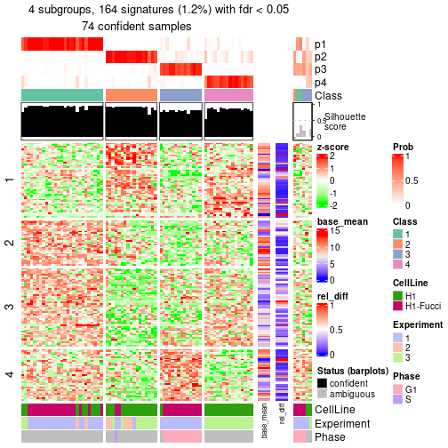</p>

</div>
</div>


Signature heatmaps where rows are not scaled:


<script>
$( function() {
	$( '#tabs-node-022-get-signatures-no-scale' ).tabs();
} );
</script>
<div id='tabs-node-022-get-signatures-no-scale'>
<ul>
<li><a href='#tab-node-022-get-signatures-no-scale-1'>k = 2</a></li>
<li><a href='#tab-node-022-get-signatures-no-scale-2'>k = 3</a></li>
<li><a href='#tab-node-022-get-signatures-no-scale-3'>k = 4</a></li>
</ul>
<div id='tab-node-022-get-signatures-no-scale-1'>
<pre><code class="r">get_signatures(res, k = 2, scale_rows = FALSE)
</code></pre>

<p></p>

</div>
<div id='tab-node-022-get-signatures-no-scale-2'>
<pre><code class="r">get_signatures(res, k = 3, scale_rows = FALSE)
</code></pre>

<p></p>

</div>
<div id='tab-node-022-get-signatures-no-scale-3'>
<pre><code class="r">get_signatures(res, k = 4, scale_rows = FALSE)
</code></pre>

<p></p>

</div>
</div>


Compare the overlap of signatures from different k:

```r
compare_signatures(res)
```


`get_signature()` returns a data frame invisibly. To get the list of signatures, the function
call should be assigned to a variable explicitly. In following code, if `plot` argument is set
to `FALSE`, no heatmap is plotted while only the differential analysis is performed.

```r
# code only for demonstration
tb = get_signature(res, k = ..., plot = FALSE)
```

An example of the output of `tb` is:

```
#>   which_row         fdr    mean_1    mean_2 scaled_mean_1 scaled_mean_2 km
#> 1        38 0.042760348  8.373488  9.131774    -0.5533452     0.5164555  1
#> 2        40 0.018707592  7.106213  8.469186    -0.6173731     0.5762149  1
#> 3        55 0.019134737 10.221463 11.207825    -0.6159697     0.5749050  1
#> 4        59 0.006059896  5.921854  7.869574    -0.6899429     0.6439467  1
#> 5        60 0.018055526  8.928898 10.211722    -0.6204761     0.5791110  1
#> 6        98 0.009384629 15.714769 14.887706     0.6635654    -0.6193277  2
...
```

The columns in `tb` are:

1. `which_row`: row indices corresponding to the input matrix.
2. `fdr`: FDR for the differential test. 
3. `mean_x`: The mean value in group x.
4. `scaled_mean_x`: The mean value in group x after rows are scaled.
5. `km`: Row groups if k-means clustering is applied to rows (which is done by automatically selecting number of clusters).

If there are too many signatures, `top_signatures = ...` can be set to only show the 
signatures with the highest FDRs:

```r
# code only for demonstration
# e.g. to show the top 500 most significant rows
tb = get_signature(res, k = ..., top_signatures = 500)
```

If the signatures are defined as these which are uniquely high in current group, `diff_method` argument
can be set to `"uniquely_high_in_one_group"`:

```r
# code only for demonstration
tb = get_signature(res, k = ..., diff_method = "uniquely_high_in_one_group")
```


UMAP plot which shows how samples are separated.


<script>
$( function() {
	$( '#tabs-node-022-dimension-reduction' ).tabs();
} );
</script>
<div id='tabs-node-022-dimension-reduction'>
<ul>
<li><a href='#tab-node-022-dimension-reduction-1'>k = 2</a></li>
<li><a href='#tab-node-022-dimension-reduction-2'>k = 3</a></li>
<li><a href='#tab-node-022-dimension-reduction-3'>k = 4</a></li>
</ul>
<div id='tab-node-022-dimension-reduction-1'>
<pre><code class="r">dimension_reduction(res, k = 2, method = &quot;UMAP&quot;)
</code></pre>

<p></p>

</div>
<div id='tab-node-022-dimension-reduction-2'>
<pre><code class="r">dimension_reduction(res, k = 3, method = &quot;UMAP&quot;)
</code></pre>

<p></p>

</div>
<div id='tab-node-022-dimension-reduction-3'>
<pre><code class="r">dimension_reduction(res, k = 4, method = &quot;UMAP&quot;)
</code></pre>

<p></p>

</div>
</div>


Following heatmap shows how subgroups are split when increasing `k`:

```r
collect_classes(res)
```


Test correlation between subgroups and known annotations. If the known
annotation is numeric, one-way ANOVA test is applied, and if the known
annotation is discrete, chi-squared contingency table test is applied.

```r
test_to_known_factors(res)
```

```
#>             n_sample CellLine(p-value) Experiment(p-value) Phase(p-value) k
#> ATC:skmeans       79          1.86e-02            1.53e-02       1.000000 2
#> ATC:skmeans       69          2.49e-08            4.12e-09       0.000912 3
#> ATC:skmeans       74          8.40e-09            8.51e-12       0.084182 4
```


If matrix rows can be associated to genes, consider to use `functional_enrichment(res,
...)` to perform function enrichment for the signature genes. See [this vignette](https://jokergoo.github.io/cola_vignettes/functional_enrichment.html) for more detailed explanations.


 

---------------------------------------------------


### Node023


Parent node: [Node02](#Node02).
Child nodes: 
                [Node0111](#Node0111)
        ,
                [Node0112](#Node0112)
        ,
                Node0121-leaf
        ,
                Node0122-leaf
        ,
                Node0221-leaf
        ,
                Node0222-leaf
        ,
                Node0231-leaf
        ,
                Node0232-leaf
        .


The object with results only for a single top-value method and a single partitioning method 
can be extracted as:

```r
res = res_rh["023"]
```

A summary of `res` and all the functions that can be applied to it:

```r
res
```

```
#> A 'ConsensusPartition' object with k = 2, 3, 4.
#>   On a matrix with 13000 rows and 80 columns.
#>   Top rows (1022) are extracted by 'ATC' method.
#>   Subgroups are detected by 'skmeans' method.
#>   Performed in total 150 partitions by row resampling.
#>   Best k for subgroups seems to be 2.
#> 
#> Following methods can be applied to this 'ConsensusPartition' object:
#>  [1] "cola_report"             "collect_classes"         "collect_plots"          
#>  [4] "collect_stats"           "colnames"                "compare_partitions"     
#>  [7] "compare_signatures"      "consensus_heatmap"       "dimension_reduction"    
#> [10] "functional_enrichment"   "get_anno_col"            "get_anno"               
#> [13] "get_classes"             "get_consensus"           "get_matrix"             
#> [16] "get_membership"          "get_param"               "get_signatures"         
#> [19] "get_stats"               "is_best_k"               "is_stable_k"            
#> [22] "membership_heatmap"      "ncol"                    "nrow"                   
#> [25] "plot_ecdf"               "predict_classes"         "rownames"               
#> [28] "select_partition_number" "show"                    "suggest_best_k"         
#> [31] "test_to_known_factors"   "top_rows_heatmap"
```

`collect_plots()` function collects all the plots made from `res` for all `k` (number of subgroups)
into one single page to provide an easy and fast comparison between different `k`.

```r
collect_plots(res)
```


The plots are:

- The first row: a plot of the eCDF (empirical cumulative distribution
  function) curves of the consensus matrix for each `k` and the heatmap of
  predicted classes for each `k`.
- The second row: heatmaps of the consensus matrix for each `k`.
- The third row: heatmaps of the membership matrix for each `k`.
- The fouth row: heatmaps of the signatures for each `k`.

All the plots in panels can be made by individual functions and they are
plotted later in this section.

`select_partition_number()` produces several plots showing different
statistics for choosing "optimized" `k`. There are following statistics:

- eCDF curves of the consensus matrix for each `k`;
- 1-PAC. [The PAC score](https://en.wikipedia.org/wiki/Consensus_clustering#Over-interpretation_potential_of_consensus_clustering)
  measures the proportion of the ambiguous subgrouping.
- Mean silhouette score.
- Concordance. The mean probability of fiting the consensus subgroup labels in all
  partitions.
- Area increased. Denote $A_k$ as the area under the eCDF curve for current
  `k`, the area increased is defined as $A_k - A_{k-1}$.
- Rand index. The percent of pairs of samples that are both in a same cluster
  or both are not in a same cluster in the partition of k and k-1.
- Jaccard index. The ratio of pairs of samples are both in a same cluster in
  the partition of k and k-1 and the pairs of samples are both in a same
  cluster in the partition k or k-1.

The detailed explanations of these statistics can be found in [the _cola_
vignette](https://jokergoo.github.io/cola_vignettes/cola.html#toc_13).

Generally speaking, higher 1-PAC score, higher mean silhouette score or higher
concordance corresponds to better partition. Rand index and Jaccard index
measure how similar the current partition is compared to partition with `k-1`.
If they are too similar, we won't accept `k` is better than `k-1`.

```r
select_partition_number(res)
```


The numeric values for all these statistics can be obtained by `get_stats()`.

```r
get_stats(res)
```

```
#>   k 1-PAC mean_silhouette concordance area_increased  Rand Jaccard
#> 2 2 0.973           0.959       0.983          0.499 0.502   0.502
#> 3 3 0.540           0.723       0.856          0.281 0.877   0.759
#> 4 4 0.473           0.525       0.748          0.118 0.943   0.857
```

`suggest_best_k()` suggests the best $k$ based on these statistics. The rules are as follows:

- All $k$ with Jaccard index larger than 0.95 are removed because increasing
  $k$ does not provide enough extra information. If all $k$ are removed, it is
  marked as no subgroup is detected.
- For all $k$ with 1-PAC score larger than 0.9, the maximal $k$ is taken as
  the best $k$, and other $k$ are marked as optional $k$.
- If it does not fit the second rule. The $k$ with the maximal vote of the
  highest 1-PAC score, highest mean silhouette, and highest concordance is
  taken as the best $k$.

```r
suggest_best_k(res)
```

```
#> [1] 2
```


Following is the table of the partitions (You need to click the **show/hide
code output** link to see it). The membership matrix (columns with name `p*`)
is inferred by
[`clue::cl_consensus()`](https://www.rdocumentation.org/link/cl_consensus?package=clue)
function with the `SE` method. Basically the value in the membership matrix
represents the probability to belong to a certain group. The finall subgroup
label for an item is determined with the group with highest probability it
belongs to.

In `get_classes()` function, the entropy is calculated from the membership
matrix and the silhouette score is calculated from the consensus matrix.


<script>
$( function() {
	$( '#tabs-node-023-get-classes' ).tabs();
} );
</script>
<div id='tabs-node-023-get-classes'>
<ul>
<li><a href='#tab-node-023-get-classes-1'>k = 2</a></li>
<li><a href='#tab-node-023-get-classes-2'>k = 3</a></li>
<li><a href='#tab-node-023-get-classes-3'>k = 4</a></li>
</ul>

<div id='tab-node-023-get-classes-1'>
<p><a id='tab-node-023-get-classes-1-a' style='color:#0366d6' href='#'>show/hide code output</a></p>
<pre><code class="r">cbind(get_classes(res, k = 2), get_membership(res, k = 2))
</code></pre>

<pre><code>#&gt;             class entropy silhouette   p1   p2
#&gt; H1_Exp1.027     2   0.000      0.981 0.00 1.00
#&gt; H1_Exp1.030     2   0.000      0.981 0.00 1.00
#&gt; H1_Exp1.031     2   0.000      0.981 0.00 1.00
#&gt; H1_Exp1.032     2   0.000      0.981 0.00 1.00
#&gt; H1_Exp1.036     2   0.000      0.981 0.00 1.00
#&gt; H1_Exp1.042     1   0.000      0.983 1.00 0.00
#&gt; H1_Exp1.043     1   0.000      0.983 1.00 0.00
#&gt; H1_Exp1.058     2   0.000      0.981 0.00 1.00
#&gt; H1_Exp1.068     2   0.000      0.981 0.00 1.00
#&gt; H1_Exp2.115     2   0.925      0.486 0.34 0.66
#&gt; H1_Exp2.117     2   0.327      0.924 0.06 0.94
#&gt; H1_Exp2.120     2   0.000      0.981 0.00 1.00
#&gt; H1_Exp2.125     2   0.000      0.981 0.00 1.00
#&gt; H1_Exp2.126     1   0.242      0.946 0.96 0.04
#&gt; H1_Exp2.132     2   0.000      0.981 0.00 1.00
#&gt; H1_Exp2.137     1   0.000      0.983 1.00 0.00
#&gt; H1_Exp2.149     1   0.469      0.882 0.90 0.10
#&gt; H1_Exp3.224     2   0.000      0.981 0.00 1.00
#&gt; H1_Exp3.238     2   0.000      0.981 0.00 1.00
#&gt; H1_Exp3.244     2   0.000      0.981 0.00 1.00
#&gt; H1_Exp3.247     2   0.000      0.981 0.00 1.00
#&gt; H1_Exp3.253     2   0.000      0.981 0.00 1.00
#&gt; H1_Exp3.254     2   0.000      0.981 0.00 1.00
#&gt; H1_Exp3.256     2   0.000      0.981 0.00 1.00
#&gt; H1_Exp3.257     2   0.000      0.981 0.00 1.00
#&gt; H1_Exp3.260     2   0.000      0.981 0.00 1.00
#&gt; H1_Exp3.261     2   0.000      0.981 0.00 1.00
#&gt; H1_Exp3.262     2   0.000      0.981 0.00 1.00
#&gt; H1_Exp3.263     2   0.000      0.981 0.00 1.00
#&gt; H1_Exp3.264     1   0.760      0.716 0.78 0.22
#&gt; H1_Exp3.266     2   0.000      0.981 0.00 1.00
#&gt; H1_Exp3.268     2   0.000      0.981 0.00 1.00
#&gt; H1_Exp3.270     2   0.000      0.981 0.00 1.00
#&gt; H1_Exp3.271     2   0.000      0.981 0.00 1.00
#&gt; H1_Exp3.272     1   0.000      0.983 1.00 0.00
#&gt; H1_Exp3.278     1   0.000      0.983 1.00 0.00
#&gt; H1_Exp3.279     2   0.000      0.981 0.00 1.00
#&gt; H1_Exp3.281     2   0.000      0.981 0.00 1.00
#&gt; H1_Exp3.282     2   0.000      0.981 0.00 1.00
#&gt; H1_Exp3.288     2   0.000      0.981 0.00 1.00
#&gt; H1_Exp3.289     2   0.000      0.981 0.00 1.00
#&gt; G2_Exp1.059     1   0.000      0.983 1.00 0.00
#&gt; G2_Exp1.057     1   0.000      0.983 1.00 0.00
#&gt; G2_Exp1.044     1   0.000      0.983 1.00 0.00
#&gt; G2_Exp1.054     1   0.000      0.983 1.00 0.00
#&gt; G2_Exp1.033     2   0.000      0.981 0.00 1.00
#&gt; G1_Exp1.048     1   0.000      0.983 1.00 0.00
#&gt; G1_Exp1.061     1   0.000      0.983 1.00 0.00
#&gt; G1_Exp1.025     1   0.000      0.983 1.00 0.00
#&gt; G1_Exp1.081     1   0.000      0.983 1.00 0.00
#&gt; G1_Exp1.053     1   0.000      0.983 1.00 0.00
#&gt; G1_Exp1.070     1   0.000      0.983 1.00 0.00
#&gt; G1_Exp1.087     1   0.000      0.983 1.00 0.00
#&gt; G1_Exp1.052     1   0.000      0.983 1.00 0.00
#&gt; G1_Exp1.040     2   0.795      0.685 0.24 0.76
#&gt; G1_Exp1.042     1   0.000      0.983 1.00 0.00
#&gt; G1_Exp1.058     1   0.943      0.426 0.64 0.36
#&gt; G1_Exp1.074     1   0.000      0.983 1.00 0.00
#&gt; G1_Exp1.079     1   0.000      0.983 1.00 0.00
#&gt; G1_Exp1.038     1   0.000      0.983 1.00 0.00
#&gt; G1_Exp1.032     1   0.000      0.983 1.00 0.00
#&gt; G1_Exp1.043     1   0.000      0.983 1.00 0.00
#&gt; G1_Exp1.089     1   0.000      0.983 1.00 0.00
#&gt; G1_Exp1.080     1   0.000      0.983 1.00 0.00
#&gt; G1_Exp1.062     1   0.000      0.983 1.00 0.00
#&gt; G1_Exp1.069     1   0.000      0.983 1.00 0.00
#&gt; G1_Exp1.044     1   0.000      0.983 1.00 0.00
#&gt; G1_Exp1.084     1   0.000      0.983 1.00 0.00
#&gt; G1_Exp1.051     1   0.000      0.983 1.00 0.00
#&gt; G1_Exp1.047     1   0.000      0.983 1.00 0.00
#&gt; G1_Exp1.057     1   0.000      0.983 1.00 0.00
#&gt; G1_Exp1.077     1   0.000      0.983 1.00 0.00
#&gt; G1_Exp1.068     1   0.000      0.983 1.00 0.00
#&gt; G1_Exp1.037     1   0.000      0.983 1.00 0.00
#&gt; G1_Exp1.036     1   0.000      0.983 1.00 0.00
#&gt; G1_Exp1.049     1   0.000      0.983 1.00 0.00
#&gt; G1_Exp1.055     1   0.000      0.983 1.00 0.00
#&gt; G1_Exp1.076     1   0.000      0.983 1.00 0.00
#&gt; G1_Exp1.083     1   0.000      0.983 1.00 0.00
#&gt; G1_Exp1.030     1   0.000      0.983 1.00 0.00
</code></pre>

<script>
$('#tab-node-023-get-classes-1-a').parent().next().next().hide();
$('#tab-node-023-get-classes-1-a').click(function(){
  $('#tab-node-023-get-classes-1-a').parent().next().next().toggle();
  return(false);
});
</script>
</div>

<div id='tab-node-023-get-classes-2'>
<p><a id='tab-node-023-get-classes-2-a' style='color:#0366d6' href='#'>show/hide code output</a></p>
<pre><code class="r">cbind(get_classes(res, k = 3), get_membership(res, k = 3))
</code></pre>

<pre><code>#&gt;             class entropy silhouette   p1   p2   p3
#&gt; H1_Exp1.027     3  0.6280    0.18321 0.00 0.46 0.54
#&gt; H1_Exp1.030     3  0.7059   -0.08573 0.02 0.46 0.52
#&gt; H1_Exp1.031     2  0.2959    0.83933 0.00 0.90 0.10
#&gt; H1_Exp1.032     2  0.2537    0.84656 0.00 0.92 0.08
#&gt; H1_Exp1.036     2  0.5216    0.66493 0.00 0.74 0.26
#&gt; H1_Exp1.042     1  0.5706    0.51768 0.68 0.00 0.32
#&gt; H1_Exp1.043     1  0.5016    0.66909 0.76 0.00 0.24
#&gt; H1_Exp1.058     2  0.6045    0.38650 0.00 0.62 0.38
#&gt; H1_Exp1.068     2  0.5835    0.51877 0.00 0.66 0.34
#&gt; H1_Exp2.115     3  0.4556    0.70836 0.08 0.06 0.86
#&gt; H1_Exp2.117     3  0.3042    0.70421 0.04 0.04 0.92
#&gt; H1_Exp2.120     3  0.5159    0.67778 0.04 0.14 0.82
#&gt; H1_Exp2.125     2  0.0892    0.87661 0.00 0.98 0.02
#&gt; H1_Exp2.126     3  0.4002    0.61903 0.16 0.00 0.84
#&gt; H1_Exp2.132     2  0.6126    0.37286 0.00 0.60 0.40
#&gt; H1_Exp2.137     1  0.6192    0.39032 0.58 0.00 0.42
#&gt; H1_Exp2.149     1  0.9899   -0.26449 0.40 0.28 0.32
#&gt; H1_Exp3.224     2  0.0000    0.88510 0.00 1.00 0.00
#&gt; H1_Exp3.238     2  0.0000    0.88510 0.00 1.00 0.00
#&gt; H1_Exp3.244     2  0.0000    0.88510 0.00 1.00 0.00
#&gt; H1_Exp3.247     2  0.0892    0.87810 0.00 0.98 0.02
#&gt; H1_Exp3.253     3  0.6232    0.57545 0.04 0.22 0.74
#&gt; H1_Exp3.254     2  0.0000    0.88510 0.00 1.00 0.00
#&gt; H1_Exp3.256     2  0.0000    0.88510 0.00 1.00 0.00
#&gt; H1_Exp3.257     2  0.0000    0.88510 0.00 1.00 0.00
#&gt; H1_Exp3.260     2  0.0000    0.88510 0.00 1.00 0.00
#&gt; H1_Exp3.261     2  0.5948    0.44124 0.00 0.64 0.36
#&gt; H1_Exp3.262     2  0.0000    0.88510 0.00 1.00 0.00
#&gt; H1_Exp3.263     2  0.1529    0.86937 0.00 0.96 0.04
#&gt; H1_Exp3.264     3  0.7398    0.66808 0.12 0.18 0.70
#&gt; H1_Exp3.266     2  0.4291    0.73935 0.00 0.82 0.18
#&gt; H1_Exp3.268     2  0.2959    0.82678 0.00 0.90 0.10
#&gt; H1_Exp3.270     2  0.0892    0.87764 0.00 0.98 0.02
#&gt; H1_Exp3.271     2  0.0000    0.88510 0.00 1.00 0.00
#&gt; H1_Exp3.272     1  0.4796    0.72726 0.78 0.00 0.22
#&gt; H1_Exp3.278     1  0.3340    0.78824 0.88 0.00 0.12
#&gt; H1_Exp3.279     2  0.0892    0.87816 0.00 0.98 0.02
#&gt; H1_Exp3.281     2  0.5560    0.58656 0.00 0.70 0.30
#&gt; H1_Exp3.282     2  0.0000    0.88510 0.00 1.00 0.00
#&gt; H1_Exp3.288     2  0.0000    0.88510 0.00 1.00 0.00
#&gt; H1_Exp3.289     2  0.0000    0.88510 0.00 1.00 0.00
#&gt; G2_Exp1.059     1  0.3686    0.77002 0.86 0.00 0.14
#&gt; G2_Exp1.057     1  0.6245    0.66959 0.76 0.06 0.18
#&gt; G2_Exp1.044     1  0.2066    0.81995 0.94 0.00 0.06
#&gt; G2_Exp1.054     1  0.0892    0.83405 0.98 0.00 0.02
#&gt; G2_Exp1.033     2  0.0892    0.87435 0.00 0.98 0.02
#&gt; G1_Exp1.048     1  0.0000    0.83900 1.00 0.00 0.00
#&gt; G1_Exp1.061     1  0.2959    0.82676 0.90 0.00 0.10
#&gt; G1_Exp1.025     1  0.4002    0.79429 0.84 0.00 0.16
#&gt; G1_Exp1.081     1  0.4555    0.77249 0.80 0.00 0.20
#&gt; G1_Exp1.053     1  0.3340    0.81780 0.88 0.00 0.12
#&gt; G1_Exp1.070     1  0.5706    0.62880 0.68 0.00 0.32
#&gt; G1_Exp1.087     1  0.4555    0.77426 0.80 0.00 0.20
#&gt; G1_Exp1.052     1  0.2537    0.83242 0.92 0.00 0.08
#&gt; G1_Exp1.040     3  0.7138    0.69061 0.12 0.16 0.72
#&gt; G1_Exp1.042     1  0.4002    0.80077 0.84 0.00 0.16
#&gt; G1_Exp1.058     3  0.7725    0.67129 0.16 0.16 0.68
#&gt; G1_Exp1.074     1  0.3686    0.80973 0.86 0.00 0.14
#&gt; G1_Exp1.079     1  0.5016    0.71754 0.76 0.00 0.24
#&gt; G1_Exp1.038     1  0.2537    0.83250 0.92 0.00 0.08
#&gt; G1_Exp1.032     1  0.6849    0.44939 0.60 0.02 0.38
#&gt; G1_Exp1.043     1  0.0000    0.83900 1.00 0.00 0.00
#&gt; G1_Exp1.089     1  0.0000    0.83900 1.00 0.00 0.00
#&gt; G1_Exp1.080     1  0.0000    0.83900 1.00 0.00 0.00
#&gt; G1_Exp1.062     1  0.5835    0.58991 0.66 0.00 0.34
#&gt; G1_Exp1.069     1  0.2959    0.82771 0.90 0.00 0.10
#&gt; G1_Exp1.044     1  0.0000    0.83900 1.00 0.00 0.00
#&gt; G1_Exp1.084     1  0.0892    0.83836 0.98 0.00 0.02
#&gt; G1_Exp1.051     1  0.1529    0.83771 0.96 0.00 0.04
#&gt; G1_Exp1.047     1  0.0000    0.83900 1.00 0.00 0.00
#&gt; G1_Exp1.057     3  0.6192   -0.00378 0.42 0.00 0.58
#&gt; G1_Exp1.077     1  0.5216    0.73173 0.74 0.00 0.26
#&gt; G1_Exp1.068     1  0.5397    0.68346 0.72 0.00 0.28
#&gt; G1_Exp1.037     1  0.1529    0.83771 0.96 0.00 0.04
#&gt; G1_Exp1.036     1  0.0000    0.83900 1.00 0.00 0.00
#&gt; G1_Exp1.049     1  0.0000    0.83900 1.00 0.00 0.00
#&gt; G1_Exp1.055     1  0.0000    0.83900 1.00 0.00 0.00
#&gt; G1_Exp1.076     1  0.0000    0.83900 1.00 0.00 0.00
#&gt; G1_Exp1.083     1  0.0892    0.83836 0.98 0.00 0.02
#&gt; G1_Exp1.030     1  0.3686    0.81738 0.86 0.00 0.14
</code></pre>

<script>
$('#tab-node-023-get-classes-2-a').parent().next().next().hide();
$('#tab-node-023-get-classes-2-a').click(function(){
  $('#tab-node-023-get-classes-2-a').parent().next().next().toggle();
  return(false);
});
</script>
</div>

<div id='tab-node-023-get-classes-3'>
<p><a id='tab-node-023-get-classes-3-a' style='color:#0366d6' href='#'>show/hide code output</a></p>
<pre><code class="r">cbind(get_classes(res, k = 4), get_membership(res, k = 4))
</code></pre>

<pre><code>#&gt;             class entropy silhouette   p1   p2   p3   p4
#&gt; H1_Exp1.027     3  0.6323   -0.04775 0.00 0.44 0.50 0.06
#&gt; H1_Exp1.030     4  0.8172    0.15547 0.04 0.14 0.38 0.44
#&gt; H1_Exp1.031     2  0.4949    0.62459 0.00 0.76 0.06 0.18
#&gt; H1_Exp1.032     2  0.5657    0.58706 0.00 0.72 0.12 0.16
#&gt; H1_Exp1.036     4  0.7869    0.17790 0.00 0.34 0.28 0.38
#&gt; H1_Exp1.042     1  0.7869   -0.20150 0.38 0.00 0.28 0.34
#&gt; H1_Exp1.043     1  0.5619    0.47842 0.64 0.00 0.04 0.32
#&gt; H1_Exp1.058     2  0.7357    0.00529 0.00 0.50 0.32 0.18
#&gt; H1_Exp1.068     2  0.7913   -0.33863 0.00 0.36 0.32 0.32
#&gt; H1_Exp2.115     3  0.3821    0.40194 0.04 0.00 0.84 0.12
#&gt; H1_Exp2.117     3  0.3030    0.43863 0.02 0.02 0.90 0.06
#&gt; H1_Exp2.120     3  0.4227    0.36465 0.00 0.06 0.82 0.12
#&gt; H1_Exp2.125     2  0.1913    0.75256 0.00 0.94 0.02 0.04
#&gt; H1_Exp2.126     3  0.4971    0.45678 0.10 0.02 0.80 0.08
#&gt; H1_Exp2.132     4  0.6933    0.39197 0.00 0.30 0.14 0.56
#&gt; H1_Exp2.137     1  0.6286    0.60151 0.66 0.00 0.20 0.14
#&gt; H1_Exp2.149     1  0.9557   -0.22338 0.34 0.24 0.30 0.12
#&gt; H1_Exp3.224     2  0.0000    0.76383 0.00 1.00 0.00 0.00
#&gt; H1_Exp3.238     2  0.0000    0.76383 0.00 1.00 0.00 0.00
#&gt; H1_Exp3.244     2  0.2830    0.74977 0.00 0.90 0.06 0.04
#&gt; H1_Exp3.247     2  0.3198    0.74388 0.00 0.88 0.04 0.08
#&gt; H1_Exp3.253     3  0.8149   -0.16707 0.02 0.22 0.46 0.30
#&gt; H1_Exp3.254     2  0.0000    0.76383 0.00 1.00 0.00 0.00
#&gt; H1_Exp3.256     2  0.0000    0.76383 0.00 1.00 0.00 0.00
#&gt; H1_Exp3.257     2  0.2706    0.75467 0.00 0.90 0.02 0.08
#&gt; H1_Exp3.260     2  0.0000    0.76383 0.00 1.00 0.00 0.00
#&gt; H1_Exp3.261     2  0.6881    0.15042 0.00 0.54 0.34 0.12
#&gt; H1_Exp3.262     2  0.2411    0.75430 0.00 0.92 0.04 0.04
#&gt; H1_Exp3.263     2  0.2706    0.74879 0.00 0.90 0.02 0.08
#&gt; H1_Exp3.264     3  0.9470    0.08693 0.14 0.18 0.38 0.30
#&gt; H1_Exp3.266     2  0.5619    0.41861 0.00 0.64 0.04 0.32
#&gt; H1_Exp3.268     2  0.4581    0.69878 0.00 0.80 0.08 0.12
#&gt; H1_Exp3.270     2  0.3853    0.71094 0.00 0.82 0.02 0.16
#&gt; H1_Exp3.271     2  0.4079    0.63566 0.00 0.80 0.02 0.18
#&gt; H1_Exp3.272     1  0.7310    0.21567 0.48 0.00 0.16 0.36
#&gt; H1_Exp3.278     1  0.5570    0.26271 0.54 0.00 0.02 0.44
#&gt; H1_Exp3.279     2  0.4642    0.59538 0.00 0.74 0.02 0.24
#&gt; H1_Exp3.281     4  0.6808    0.34877 0.00 0.32 0.12 0.56
#&gt; H1_Exp3.282     2  0.3172    0.69073 0.00 0.84 0.00 0.16
#&gt; H1_Exp3.288     2  0.1637    0.76038 0.00 0.94 0.00 0.06
#&gt; H1_Exp3.289     2  0.0000    0.76383 0.00 1.00 0.00 0.00
#&gt; G2_Exp1.059     1  0.5271    0.47790 0.64 0.00 0.02 0.34
#&gt; G2_Exp1.057     4  0.5993    0.01269 0.36 0.02 0.02 0.60
#&gt; G2_Exp1.044     1  0.3801    0.64186 0.78 0.00 0.00 0.22
#&gt; G2_Exp1.054     1  0.2647    0.71545 0.88 0.00 0.00 0.12
#&gt; G2_Exp1.033     2  0.6150    0.22249 0.00 0.58 0.06 0.36
#&gt; G1_Exp1.048     1  0.0000    0.74929 1.00 0.00 0.00 0.00
#&gt; G1_Exp1.061     1  0.6122    0.64530 0.68 0.00 0.16 0.16
#&gt; G1_Exp1.025     1  0.6976    0.49248 0.58 0.00 0.18 0.24
#&gt; G1_Exp1.081     1  0.6049    0.64916 0.68 0.00 0.12 0.20
#&gt; G1_Exp1.053     1  0.5902    0.66114 0.70 0.00 0.14 0.16
#&gt; G1_Exp1.070     1  0.7135    0.52899 0.56 0.00 0.20 0.24
#&gt; G1_Exp1.087     1  0.3972    0.73306 0.84 0.00 0.08 0.08
#&gt; G1_Exp1.052     1  0.5151    0.70750 0.76 0.00 0.10 0.14
#&gt; G1_Exp1.040     3  0.8939    0.32931 0.14 0.18 0.50 0.18
#&gt; G1_Exp1.042     1  0.5383    0.68618 0.74 0.00 0.10 0.16
#&gt; G1_Exp1.058     3  0.6969    0.35645 0.04 0.12 0.66 0.18
#&gt; G1_Exp1.074     1  0.4227    0.73367 0.82 0.00 0.06 0.12
#&gt; G1_Exp1.079     1  0.6449    0.56417 0.64 0.00 0.22 0.14
#&gt; G1_Exp1.038     1  0.3935    0.74145 0.84 0.00 0.06 0.10
#&gt; G1_Exp1.032     3  0.8272    0.07097 0.38 0.02 0.38 0.22
#&gt; G1_Exp1.043     1  0.0000    0.74929 1.00 0.00 0.00 0.00
#&gt; G1_Exp1.089     1  0.0707    0.74556 0.98 0.00 0.00 0.02
#&gt; G1_Exp1.080     1  0.0000    0.74929 1.00 0.00 0.00 0.00
#&gt; G1_Exp1.062     1  0.6477    0.44033 0.60 0.00 0.30 0.10
#&gt; G1_Exp1.069     1  0.3525    0.74482 0.86 0.00 0.04 0.10
#&gt; G1_Exp1.044     1  0.0000    0.74929 1.00 0.00 0.00 0.00
#&gt; G1_Exp1.084     1  0.2335    0.75111 0.92 0.00 0.02 0.06
#&gt; G1_Exp1.051     1  0.1411    0.74981 0.96 0.00 0.02 0.02
#&gt; G1_Exp1.047     1  0.1211    0.75025 0.96 0.00 0.00 0.04
#&gt; G1_Exp1.057     3  0.7198    0.31128 0.28 0.00 0.54 0.18
#&gt; G1_Exp1.077     1  0.6941    0.40804 0.52 0.00 0.12 0.36
#&gt; G1_Exp1.068     1  0.6286    0.62437 0.66 0.00 0.20 0.14
#&gt; G1_Exp1.037     1  0.2706    0.75110 0.90 0.00 0.02 0.08
#&gt; G1_Exp1.036     1  0.0000    0.74929 1.00 0.00 0.00 0.00
#&gt; G1_Exp1.049     1  0.3335    0.74435 0.86 0.00 0.02 0.12
#&gt; G1_Exp1.055     1  0.0000    0.74929 1.00 0.00 0.00 0.00
#&gt; G1_Exp1.076     1  0.0000    0.74929 1.00 0.00 0.00 0.00
#&gt; G1_Exp1.083     1  0.3247    0.74395 0.88 0.00 0.06 0.06
#&gt; G1_Exp1.030     1  0.5863    0.67869 0.70 0.00 0.12 0.18
</code></pre>

<script>
$('#tab-node-023-get-classes-3-a').parent().next().next().hide();
$('#tab-node-023-get-classes-3-a').click(function(){
  $('#tab-node-023-get-classes-3-a').parent().next().next().toggle();
  return(false);
});
</script>
</div>
</div>

Heatmaps for the consensus matrix. It visualizes the probability of two
samples to be in a same group.


<script>
$( function() {
	$( '#tabs-node-023-consensus-heatmap' ).tabs();
} );
</script>
<div id='tabs-node-023-consensus-heatmap'>
<ul>
<li><a href='#tab-node-023-consensus-heatmap-1'>k = 2</a></li>
<li><a href='#tab-node-023-consensus-heatmap-2'>k = 3</a></li>
<li><a href='#tab-node-023-consensus-heatmap-3'>k = 4</a></li>
</ul>
<div id='tab-node-023-consensus-heatmap-1'>
<pre><code class="r">consensus_heatmap(res, k = 2)
</code></pre>

<p></p>

</div>
<div id='tab-node-023-consensus-heatmap-2'>
<pre><code class="r">consensus_heatmap(res, k = 3)
</code></pre>

<p>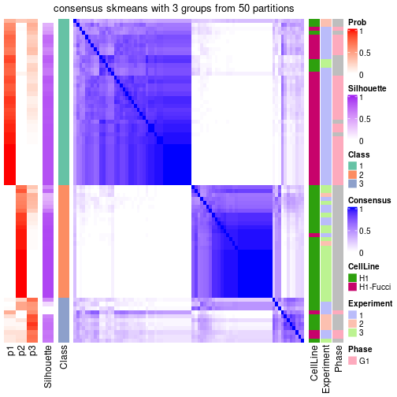</p>

</div>
<div id='tab-node-023-consensus-heatmap-3'>
<pre><code class="r">consensus_heatmap(res, k = 4)
</code></pre>

<p></p>

</div>
</div>

Heatmaps for the membership of samples in all partitions to see how consistent they are:


<script>
$( function() {
	$( '#tabs-node-023-membership-heatmap' ).tabs();
} );
</script>
<div id='tabs-node-023-membership-heatmap'>
<ul>
<li><a href='#tab-node-023-membership-heatmap-1'>k = 2</a></li>
<li><a href='#tab-node-023-membership-heatmap-2'>k = 3</a></li>
<li><a href='#tab-node-023-membership-heatmap-3'>k = 4</a></li>
</ul>
<div id='tab-node-023-membership-heatmap-1'>
<pre><code class="r">membership_heatmap(res, k = 2)
</code></pre>

<p></p>

</div>
<div id='tab-node-023-membership-heatmap-2'>
<pre><code class="r">membership_heatmap(res, k = 3)
</code></pre>

<p></p>

</div>
<div id='tab-node-023-membership-heatmap-3'>
<pre><code class="r">membership_heatmap(res, k = 4)
</code></pre>

<p></p>

</div>
</div>

As soon as the classes for columns are determined, the signatures
that are significantly different between subgroups can be looked for. 
Following are the heatmaps for signatures.


Signature heatmaps where rows are scaled:


<script>
$( function() {
	$( '#tabs-node-023-get-signatures' ).tabs();
} );
</script>
<div id='tabs-node-023-get-signatures'>
<ul>
<li><a href='#tab-node-023-get-signatures-1'>k = 2</a></li>
<li><a href='#tab-node-023-get-signatures-2'>k = 3</a></li>
<li><a href='#tab-node-023-get-signatures-3'>k = 4</a></li>
</ul>
<div id='tab-node-023-get-signatures-1'>
<pre><code class="r">get_signatures(res, k = 2)
</code></pre>

<p></p>

</div>
<div id='tab-node-023-get-signatures-2'>
<pre><code class="r">get_signatures(res, k = 3)
</code></pre>

<p></p>

</div>
<div id='tab-node-023-get-signatures-3'>
<pre><code class="r">get_signatures(res, k = 4)
</code></pre>

<p></p>

</div>
</div>


Signature heatmaps where rows are not scaled:


<script>
$( function() {
	$( '#tabs-node-023-get-signatures-no-scale' ).tabs();
} );
</script>
<div id='tabs-node-023-get-signatures-no-scale'>
<ul>
<li><a href='#tab-node-023-get-signatures-no-scale-1'>k = 2</a></li>
<li><a href='#tab-node-023-get-signatures-no-scale-2'>k = 3</a></li>
<li><a href='#tab-node-023-get-signatures-no-scale-3'>k = 4</a></li>
</ul>
<div id='tab-node-023-get-signatures-no-scale-1'>
<pre><code class="r">get_signatures(res, k = 2, scale_rows = FALSE)
</code></pre>

<p></p>

</div>
<div id='tab-node-023-get-signatures-no-scale-2'>
<pre><code class="r">get_signatures(res, k = 3, scale_rows = FALSE)
</code></pre>

<p></p>

</div>
<div id='tab-node-023-get-signatures-no-scale-3'>
<pre><code class="r">get_signatures(res, k = 4, scale_rows = FALSE)
</code></pre>

<p>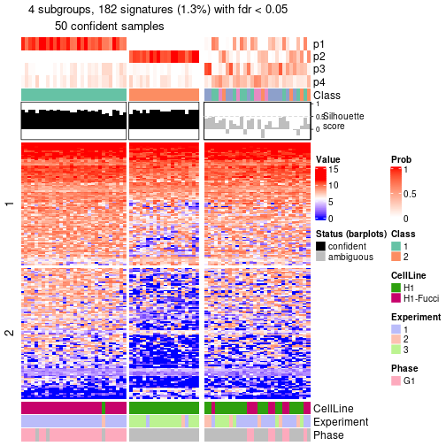</p>

</div>
</div>


Compare the overlap of signatures from different k:

```r
compare_signatures(res)
```


`get_signature()` returns a data frame invisibly. To get the list of signatures, the function
call should be assigned to a variable explicitly. In following code, if `plot` argument is set
to `FALSE`, no heatmap is plotted while only the differential analysis is performed.

```r
# code only for demonstration
tb = get_signature(res, k = ..., plot = FALSE)
```

An example of the output of `tb` is:

```
#>   which_row         fdr    mean_1    mean_2 scaled_mean_1 scaled_mean_2 km
#> 1        38 0.042760348  8.373488  9.131774    -0.5533452     0.5164555  1
#> 2        40 0.018707592  7.106213  8.469186    -0.6173731     0.5762149  1
#> 3        55 0.019134737 10.221463 11.207825    -0.6159697     0.5749050  1
#> 4        59 0.006059896  5.921854  7.869574    -0.6899429     0.6439467  1
#> 5        60 0.018055526  8.928898 10.211722    -0.6204761     0.5791110  1
#> 6        98 0.009384629 15.714769 14.887706     0.6635654    -0.6193277  2
...
```

The columns in `tb` are:

1. `which_row`: row indices corresponding to the input matrix.
2. `fdr`: FDR for the differential test. 
3. `mean_x`: The mean value in group x.
4. `scaled_mean_x`: The mean value in group x after rows are scaled.
5. `km`: Row groups if k-means clustering is applied to rows (which is done by automatically selecting number of clusters).

If there are too many signatures, `top_signatures = ...` can be set to only show the 
signatures with the highest FDRs:

```r
# code only for demonstration
# e.g. to show the top 500 most significant rows
tb = get_signature(res, k = ..., top_signatures = 500)
```

If the signatures are defined as these which are uniquely high in current group, `diff_method` argument
can be set to `"uniquely_high_in_one_group"`:

```r
# code only for demonstration
tb = get_signature(res, k = ..., diff_method = "uniquely_high_in_one_group")
```


UMAP plot which shows how samples are separated.


<script>
$( function() {
	$( '#tabs-node-023-dimension-reduction' ).tabs();
} );
</script>
<div id='tabs-node-023-dimension-reduction'>
<ul>
<li><a href='#tab-node-023-dimension-reduction-1'>k = 2</a></li>
<li><a href='#tab-node-023-dimension-reduction-2'>k = 3</a></li>
<li><a href='#tab-node-023-dimension-reduction-3'>k = 4</a></li>
</ul>
<div id='tab-node-023-dimension-reduction-1'>
<pre><code class="r">dimension_reduction(res, k = 2, method = &quot;UMAP&quot;)
</code></pre>

<p></p>

</div>
<div id='tab-node-023-dimension-reduction-2'>
<pre><code class="r">dimension_reduction(res, k = 3, method = &quot;UMAP&quot;)
</code></pre>

<p></p>

</div>
<div id='tab-node-023-dimension-reduction-3'>
<pre><code class="r">dimension_reduction(res, k = 4, method = &quot;UMAP&quot;)
</code></pre>

<p></p>

</div>
</div>


Following heatmap shows how subgroups are split when increasing `k`:

```r
collect_classes(res)
```


Test correlation between subgroups and known annotations. If the known
annotation is numeric, one-way ANOVA test is applied, and if the known
annotation is discrete, chi-squared contingency table test is applied.

```r
test_to_known_factors(res)
```

```
#>             n_sample CellLine(p-value) Experiment(p-value) Phase(p-value) k
#> ATC:skmeans       78          1.32e-10            2.09e-07             NA 2
#> ATC:skmeans       71          6.88e-11            6.15e-13             NA 3
#> ATC:skmeans       50          8.46e-11            1.94e-09             NA 4
```


If matrix rows can be associated to genes, consider to use `functional_enrichment(res,
...)` to perform function enrichment for the signature genes. See [this vignette](https://jokergoo.github.io/cola_vignettes/functional_enrichment.html) for more detailed explanations.


 

## Session info


```r
sessionInfo()
```

```
#> R version 4.1.0 (2021-05-18)
#> Platform: x86_64-pc-linux-gnu (64-bit)
#> Running under: CentOS Linux 7 (Core)
#> 
#> Matrix products: default
#> BLAS/LAPACK: /usr/lib64/libopenblas-r0.3.3.so
#> 
#> locale:
#>  [1] LC_CTYPE=en_US.UTF-8       LC_NUMERIC=C               LC_TIME=en_US.UTF-8       
#>  [4] LC_COLLATE=en_US.UTF-8     LC_MONETARY=en_US.UTF-8    LC_MESSAGES=en_US.UTF-8   
#>  [7] LC_PAPER=en_US.UTF-8       LC_NAME=C                  LC_ADDRESS=C              
#> [10] LC_TELEPHONE=C             LC_MEASUREMENT=en_US.UTF-8 LC_IDENTIFICATION=C       
#> 
#> attached base packages:
#>  [1] grid      parallel  stats4    stats     graphics  grDevices utils     datasets  methods  
#> [10] base     
#> 
#> other attached packages:
#>  [1] genefilter_1.74.0           ComplexHeatmap_2.8.0        markdown_1.1               
#>  [4] knitr_1.33                  scRNAseq_2.6.1              SingleCellExperiment_1.14.1
#>  [7] SummarizedExperiment_1.22.0 Biobase_2.52.0              GenomicRanges_1.44.0       
#> [10] GenomeInfoDb_1.28.1         IRanges_2.26.0              S4Vectors_0.30.0           
#> [13] BiocGenerics_0.38.0         MatrixGenerics_1.4.0        matrixStats_0.59.0         
#> [16] cola_1.9.4                 
#> 
#> loaded via a namespace (and not attached):
#>   [1] circlize_0.4.13               AnnotationHub_3.0.1           BiocFileCache_2.0.0          
#>   [4] lazyeval_0.2.2                polylabelr_0.2.0              splines_4.1.0                
#>   [7] Polychrome_1.3.1              BiocParallel_1.26.1           ggplot2_3.3.5                
#>  [10] digest_0.6.27                 foreach_1.5.1                 ensembldb_2.16.3             
#>  [13] htmltools_0.5.1.1             viridis_0.6.1                 fansi_0.5.0                  
#>  [16] magrittr_2.0.1                memoise_2.0.0                 cluster_2.1.2                
#>  [19] doParallel_1.0.16             Biostrings_2.60.1             annotate_1.70.0              
#>  [22] askpass_1.1                   prettyunits_1.1.1             colorspace_2.0-2             
#>  [25] blob_1.2.1                    rappdirs_0.3.3                xfun_0.24                    
#>  [28] dplyr_1.0.7                   crayon_1.4.1                  RCurl_1.98-1.3               
#>  [31] microbenchmark_1.4-7          jsonlite_1.7.2                impute_1.66.0                
#>  [34] brew_1.0-6                    survival_3.2-11               iterators_1.0.13             
#>  [37] glue_1.4.2                    polyclip_1.10-0               gtable_0.3.0                 
#>  [40] zlibbioc_1.38.0               XVector_0.32.0                GetoptLong_1.0.5             
#>  [43] DelayedArray_0.18.0           shape_1.4.6                   scales_1.1.1                 
#>  [46] data.tree_1.0.0               DBI_1.1.1                     Rcpp_1.0.7                   
#>  [49] viridisLite_0.4.0             xtable_1.8-4                  progress_1.2.2               
#>  [52] clue_0.3-59                   reticulate_1.20               bit_4.0.4                    
#>  [55] mclust_5.4.7                  umap_0.2.7.0                  httr_1.4.2                   
#>  [58] RColorBrewer_1.1-2            ellipsis_0.3.2                pkgconfig_2.0.3              
#>  [61] XML_3.99-0.6                  dbplyr_2.1.1                  utf8_1.2.1                   
#>  [64] tidyselect_1.1.1              rlang_0.4.11                  later_1.2.0                  
#>  [67] AnnotationDbi_1.54.1          munsell_0.5.0                 BiocVersion_3.13.1           
#>  [70] tools_4.1.0                   cachem_1.0.5                  generics_0.1.0               
#>  [73] RSQLite_2.2.7                 ExperimentHub_2.0.0           evaluate_0.14                
#>  [76] stringr_1.4.0                 fastmap_1.1.0                 yaml_2.2.1                   
#>  [79] bit64_4.0.5                   purrr_0.3.4                   dendextend_1.15.1            
#>  [82] KEGGREST_1.32.0               AnnotationFilter_1.16.0       mime_0.11                    
#>  [85] slam_0.1-48                   xml2_1.3.2                    biomaRt_2.48.2               
#>  [88] compiler_4.1.0                rstudioapi_0.13               filelock_1.0.2               
#>  [91] curl_4.3.2                    png_0.1-7                     interactiveDisplayBase_1.30.0
#>  [94] tibble_3.1.2                  stringi_1.7.3                 highr_0.9                    
#>  [97] GenomicFeatures_1.44.0        RSpectra_0.16-0               lattice_0.20-44              
#> [100] ProtGenerics_1.24.0           Matrix_1.3-4                  vctrs_0.3.8                  
#> [103] pillar_1.6.1                  lifecycle_1.0.0               BiocManager_1.30.16          
#> [106] eulerr_6.1.0                  GlobalOptions_0.1.2           bitops_1.0-7                 
#> [109] irlba_2.3.3                   httpuv_1.6.1                  rtracklayer_1.52.0           
#> [112] R6_2.5.0                      BiocIO_1.2.0                  promises_1.2.0.1             
#> [115] gridExtra_2.3                 codetools_0.2-18              assertthat_0.2.1             
#> [118] openssl_1.4.4                 rjson_0.2.20                  GenomicAlignments_1.28.0     
#> [121] Rsamtools_2.8.0               GenomeInfoDbData_1.2.6        hms_1.1.0                    
#> [124] skmeans_0.2-13                Cairo_1.5-12.2                scatterplot3d_0.3-41         
#> [127] shiny_1.6.0                   restfulr_0.0.13
```


